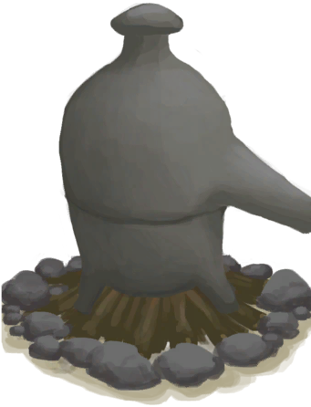

# 蒸馏器  
> 将海水蒸馏成淡水。  
  
<table class="table table-bordered" data-toggle="table"  data-show-header="false"><thead style="display:none"><tr ><th  style="width:50%;text-align:left;vertical-align:top;"  >title</th><th  style="width:50%;text-align:left;vertical-align:top;"  ></th></tr></thead><tr ><td  style="width:50%;text-align:left;vertical-align:top;"  >** 不可删除 **  **重量：**1000  **标签：**	[“火”](tag_Fire.md)  **槽位：**1  **过滤器：**[“储水容器”](tag_WaterContainer.md)  **可用次数：**0  ** 效果: ** [

[保温](InsulationCold.md)](InsulationCold.md)<b>+15</b> [

[湿度](Wetness.md)](Wetness.md)加成<b>-2</b> [

[光亮](Light.md)](Light.md)<b>+25</b></td><td  style="width:50%;text-align:left;vertical-align:top;"  >

<a href="AlembicOn.md" style="color:black">蒸馏器</a>

一种实用的装置，通过在蒸馏过程中控制加热温度来提取不同的物质。  它可以从任何水（包括海水）中蒸馏出<b>饮用水</b>，还能制造<b>浓硝酸</b>：炸‍葯的必备原料。 使用它的方式是先把一个空容器放在里面，然后将不适合饮用的水或<b>硝石溶液</b>倒入其中，最后再对其加热。产生的液体会随着时间逐渐滴落在空容器中。</td></tr></tbody></table>  
  
## 获取来源  

** 使用**[火种](TinderLit.md)点燃

[蒸馏器(关)](AlembicOff.md)

** 使用**[蒸馏器](AlembicUndeployed.md)放置蒸馏器

[营火](Campfire.md)

  
  
## 动作  

<table><tr><td rowspan="2" style="width:200px;text-align:center;font-size:1.3em;font-weight:bold">

取出火炭

15分

</td><td></td></tr><tr><td><b>自身：</b>燃料  <b>-16(-16.67%)</b>, 

  <b>-16(-100%)</b></td></tr><tr><td colspan="2"><b>需求：</b>

: <b>16(100%)</b></td></tr><tr><td colspan="2">[

[火炭](Embers.md)](Embers.md)(<b>+1</b>)</td></tr></table>
  

<table><tr><td rowspan="2" style="width:200px;text-align:center;font-size:1.3em;font-weight:bold">

熄灭火焰

</td><td></td></tr><tr><td><b>自身：</b>→ [

[蒸馏器(关)](AlembicOff.md)](AlembicOff.md)</td></tr></table>
  

<table><tr><td rowspan="2" style="width:200px;text-align:center;font-size:1.3em;font-weight:bold">

取出

</td><td></td></tr><tr><td><b>自身：</b>→ [

[营火](Campfire.md)](Campfire.md)</td></tr><tr><td colspan="2">[

[蒸馏器](AlembicUndeployed.md)](AlembicUndeployed.md)(<b>+1</b>)</td></tr></table>
  
  
  
## 可拖入  

<table style="margin-bottom:0px;"><tr><td style="width:40%;text-align:left; background-color:#FEFEFE"><b>拖入：</b>[

[椰子壳](CoconutShell.md)](CoconutShell.md)</td><td style="width:40%;font-size:1em;font-weight:bold;background-color:#FEFEFE">添入椰子壳  </td></tr><tr style="background-color:#FFFFFF"><td style=""><b>使用物：</b>→消失</td><td style=""><b>自身：</b>燃料  <b>+3(3.13%)</b></td></tr></table>
  

<table style="margin-bottom:0px;"><tr><td style="width:40%;text-align:left; background-color:#FEFEFE"><b>拖入：</b>[

[木材](Wood.md)](Wood.md)</td><td style="width:40%;font-size:1em;font-weight:bold;background-color:#FEFEFE">添入柴火  </td></tr><tr style="background-color:#FFFFFF"><td style=""><b>使用物：</b>→消失</td><td style=""><b>自身：</b>燃料  <b>+28(29.17%)</b></td></tr></table>
  

<table style="margin-bottom:0px;"><tr><td style="width:40%;text-align:left; background-color:#FEFEFE"><b>拖入：</b>[“燃料”](tag_Fuel.md)</td><td style="width:40%;font-size:1em;font-weight:bold;background-color:#FEFEFE">添入燃料  </td></tr><tr style="background-color:#FFFFFF"><td style=""><b>使用物：</b>→消失</td><td style=""><b>自身：</b>燃料  <b>+7(7.29%)</b></td></tr></table>
  

<table style="margin-bottom:0px;"><tr><td style="width:40%;text-align:left; background-color:#FEFEFE"><b>拖入：</b>[

[木炭](Charcoal.md)](Charcoal.md) | [

[火炭](Embers.md)](Embers.md)</td><td style="width:40%;font-size:1em;font-weight:bold;background-color:#FEFEFE">添入木炭  </td></tr><tr style="background-color:#FFFFFF"><td style=""><b>使用物：</b>→消失</td><td style=""><b>自身：</b>燃料  <b>+7(7.29%)</b>, 

  <b>+7(43.75%)</b></td></tr></table>
  

<table style="margin-bottom:0px;"><tr><td style="width:40%;text-align:left; background-color:#FEFEFE"><b>拖入：</b>[“火绒”](tag_Tinder.md)</td><td style="width:40%;font-size:1em;font-weight:bold;background-color:#FEFEFE">点燃火绒  </td></tr><tr style="background-color:#FFFFFF"><td style=""><b>使用物：</b>→ [

[火种](TinderLit.md)](TinderLit.md)</td><td style=""><b>自身：</b></td></tr></table>
  

<table style="margin-bottom:0px;"><tr><td style="width:40%;text-align:left; background-color:#FEFEFE"><b>拖入：</b>[“树叶”](tag_Leaves.md)</td><td style="width:40%;font-size:1em;font-weight:bold;background-color:#FEFEFE">添入树叶  </td></tr><tr style="background-color:#FFFFFF"><td style=""><b>使用物：</b>→消失</td><td style=""><b>自身：</b>燃料  <b>+2(2.08%)</b></td></tr></table>
  

<table style="margin-bottom:0px;"><tr><td style="width:40%;text-align:left; background-color:#FEFEFE"><b>拖入：</b>[

[盐水](LQ_WaterSalt.md)](LQ_WaterSalt.md) | [

[有毒的水](LQ_WaterToxic.md)](LQ_WaterToxic.md) | [

[不安全的水](LQ_WaterUnsafe.md)](LQ_WaterUnsafe.md) | [

[灰水](LQ_AshWater.md)](LQ_AshWater.md)</td><td style="width:40%;font-size:1em;font-weight:bold;background-color:#FEFEFE">倒入  </td></tr><tr style="background-color:#FFFFFF"><td style=""><b>使用物：</b></td><td style=""><b>自身：</b>水量

  <b>+1200(100%)</b></td></tr></table>
  

<table style="margin-bottom:0px;"><tr><td style="width:40%;text-align:left; background-color:#FEFEFE"><b>拖入：</b>[

[硝石溶液](LQ_DissolvedNiter.md)](LQ_DissolvedNiter.md)</td><td style="width:40%;font-size:1em;font-weight:bold;background-color:#FEFEFE">倒入  </td></tr><tr style="background-color:#FFFFFF"><td style=""><b>使用物：</b></td><td style=""><b>自身：</b>硝石溶液

  <b>+300(25%)</b></td></tr></table>
  
  
## 可拖至  

[装有燃料的油桶](JerrycanFuel.md)

  
  
## 转化  

<table style="margin-bottom:0px;"><tr><td  colspan=2 style="font-size:1em;font-weight:bold;background-color:#FEFEFE">补充液体</td><td style="text-align:right; background-color:#FEFEFE"></td></tr><tr style="background-color:#FFFFFF"><td style="width:30%;font-size:1em;text-align:right;vertical-align:middle;">[“灌溉用水”](tag_WaterFresh.md)</td><td style="text-align:center;width:20%;vertical-align:middle;">
15分

补充液体
</td><td style="text-align:left;vertical-align:middle;">含水量  <b>+19</b></td></tr><tr style="text-align:left;background-color:#FEFEFE"><td colspan="3"><b></b>** 需要属性：** 水量

: <b>1～1200(0.08%～100%)</b></td></tr></table>
  

<table style="margin-bottom:0px;"><tr><td  colspan=2 style="font-size:1em;font-weight:bold;background-color:#FEFEFE">加入用于蒸馏水的液体</td><td style="text-align:right; background-color:#FEFEFE"></td></tr><tr style="background-color:#FFFFFF"><td style="width:30%;font-size:1em;text-align:right;vertical-align:middle;">[“储水容器”](tag_WaterContainer.md)</td><td style="text-align:center;width:20%;vertical-align:middle;">
15分

加入用于蒸馏水的液体
</td><td style="text-align:left;vertical-align:middle;"></td></tr><tr style="text-align:left;background-color:#FEFEFE"><td colspan="3"><b></b>** 需要属性：** 水量

: <b>1～1200(0.08%～100%)</b></td></tr><tr><td colspan="3">[水](LQ_Water.md)(<b>+1</b>)</td></tr></table>
  

<table style="margin-bottom:0px;"><tr><td  colspan=2 style="font-size:1em;font-weight:bold;background-color:#FEFEFE">加入用于蒸馏硝酸的液体</td><td style="text-align:right; background-color:#FEFEFE"></td></tr><tr style="background-color:#FFFFFF"><td style="width:30%;font-size:1em;text-align:right;vertical-align:middle;">[“储水容器”](tag_WaterContainer.md)</td><td style="text-align:center;width:20%;vertical-align:middle;">
15分

加入用于蒸馏硝酸的液体
</td><td style="text-align:left;vertical-align:middle;"></td></tr><tr style="text-align:left;background-color:#FEFEFE"><td colspan="3"><b></b>** 需要属性：** 硝石溶液

: <b>1～1200(0.08%～100%)</b></td></tr><tr><td colspan="3">[浓硝酸](LQ_AquaFortis.md)(<b>+1</b>)</td></tr></table>
  

<table style="margin-bottom:0px;"><tr><td  colspan=2 style="font-size:1em;font-weight:bold;background-color:#FEFEFE">补充液体</td><td style="text-align:right; background-color:#FEFEFE"></td></tr><tr style="background-color:#FFFFFF"><td style="width:30%;font-size:1em;text-align:right;vertical-align:middle;">[

[浓硝酸](LQ_AquaFortis.md)](LQ_AquaFortis.md)</td><td style="text-align:center;width:20%;vertical-align:middle;">
15分

补充液体
</td><td style="text-align:left;vertical-align:middle;">含水量  <b>+19</b></td></tr><tr style="text-align:left;background-color:#FEFEFE"><td colspan="3"><b></b>** 需要属性：** 硝石溶液

: <b>1～1200(0.08%～100%)</b></td></tr></table>
  
## 属性   

<table style="margin-bottom:0px;"><tr><td style="width:30%;text-align:left; background-color:#FEFEFE;font-size:1.3em;font-weight:bold;">

水量</td><td style="font-size:1em;background-color:#FEFEFE">初始：0 , 最大：1200 每15分钟-38 , 最多需要：7小时54分</td></tr><tr style="background-color:#FFFFFF"><td colspan=2></td></tr></table>
  

<table style="margin-bottom:0px;"><tr><td style="width:30%;text-align:left; background-color:#FEFEFE;font-size:1.3em;font-weight:bold;">燃料</td><td style="font-size:1em;background-color:#FEFEFE">初始：32 , 最大：96 每15分钟-1 , 最多需要：1天</td></tr><tr style="background-color:#FFFFFF"><td colspan=2>** 到达0时： ** 自身: → [

[蒸馏器(关)](AlembicOff.md)](AlembicOff.md)</td></tr></table>
  

<table style="margin-bottom:0px;"><tr><td style="width:30%;text-align:left; background-color:#FEFEFE;font-size:1.3em;font-weight:bold;">

</td><td style="font-size:1em;background-color:#FEFEFE">初始：0 , 最大：16 每15分钟+1 , 最多需要：4小时</td></tr><tr style="background-color:#FFFFFF"><td colspan=2></td></tr></table>
  

<table style="margin-bottom:0px;"><tr><td style="width:30%;text-align:left; background-color:#FEFEFE;font-size:1.3em;font-weight:bold;">

硝石溶液</td><td style="font-size:1em;background-color:#FEFEFE">初始：0 , 最大：1200 每15分钟-38 , 最多需要：7小时54分</td></tr><tr style="background-color:#FFFFFF"><td colspan=2></td></tr></table>
  
## 被动效果  
<table class="table table-bordered" data-toggle="table"  ><thead style=""><tr ><th  style="text-align:left;vertical-align:top;"  >名称</th><th  style="text-align:left;vertical-align:top;"  >条件</th><th  style="text-align:left;vertical-align:top;"  data-sortable="true"  >变化(每15分钟)</th><th  style="text-align:left;vertical-align:top;"  >玩家状态</th></tr></thead><tr ><td  style="text-align:left;vertical-align:top;"  >Hot</td><td  style="text-align:left;vertical-align:top;"  >** 需要状态：** [

[遮蔽](Sheltered.md)](Sheltered.md): <b>1-1</b></td><td  style="text-align:left;vertical-align:top;"  ></td><td  style="text-align:left;vertical-align:top;"  >[

[体感温度](TemperaturePerceived.md)](TemperaturePerceived.md)<b>+10</b></td></tr></tbody></table>  
  

