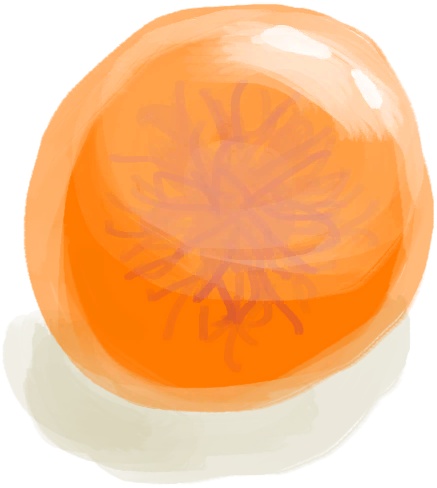

# 盛开的外星植物  
> 闻起来出奇的香，并且表面长有球状结节。  
  
<table class="table table-bordered" data-toggle="table"  data-show-header="false"><thead style="display:none"><tr ><th  style="width:50%;text-align:left;vertical-align:top;"  >title</th><th  style="width:50%;text-align:left;vertical-align:top;"  ></th></tr></thead><tr ><td  style="width:50%;text-align:left;vertical-align:top;"  >** 效果: ** [

[外星植物渴求](AlienCravings.md)](AlienCravings.md)加成<b>+0.2</b> [

[舒适度](Comfort.md)](Comfort.md)<b>+100</b></td><td  style="width:50%;text-align:left;vertical-align:top;"  >

<a href="AlienGrowth.md" style="color:black">盛开的外星植物</a>

</td></tr></tbody></table>  
  
## 获取来源  

转化

[外星植物](AlienGrowthCleared.md)

  
  
## 动作  

<table><tr><td rowspan="2" style="width:200px;text-align:center;font-size:1.3em;font-weight:bold">

采集

</td><td></td></tr><tr><td><b>自身：</b>→ [

[外星植物](AlienGrowthCleared.md)](AlienGrowthCleared.md)</td></tr><tr><td colspan="2">[

[外星结节](AlienNodule.md)](AlienNodule.md)(<b>+2～+4</b>)</td></tr></table>
  
  
  
## 可拖入  

<table style="margin-bottom:0px;"><tr><td style="width:40%;text-align:left; background-color:#FEFEFE"><b>拖入：</b>[“斧”](tag_Axe.md)</td><td style="width:40%;font-size:1em;font-weight:bold;background-color:#FEFEFE">砍倒 (15分) [“手部动作(组)”](HandAction.md)</td></tr><tr><td colspan="2"><b>需求：</b>[

[光亮](Light.md)](Light.md): <b>10-100</b></td></tr><tr style="background-color:#FFFFFF"><td style=""><b>使用物：</b>使用次数  <b>-1(-2%)</b></td><td style=""><b>自身：</b>→消失</td></tr><tr><td colspan="2"><b>状态变化：</b>[

[耐力](Stamina.md)](Stamina.md)<b>-1</b>, [

[手掌损伤](HandDamage.md)](HandDamage.md)<b>+20</b></td></tr><tr><td colspan="2">[

[外星结节](AlienNodule.md)](AlienNodule.md)(<b>+3～+5</b>)</td></tr></table>
  
  
## 属性   

<table style="margin-bottom:0px;"><tr><td style="width:30%;text-align:left; background-color:#FEFEFE;font-size:1.3em;font-weight:bold;">进度</td><td style="font-size:1em;background-color:#FEFEFE">初始：0 , 最大：288 每15分钟+1 , 最多需要：3天</td></tr><tr style="background-color:#FFFFFF"><td colspan=2>** 到达上限时： ** [

[外星植物](AlienGrowthCleared.md)](AlienGrowthCleared.md)(<b>+1</b>)</td></tr></table>
  
## 其他效果  
<table class="table table-bordered" data-toggle="table"  ><thead style=""><tr ><th  style="text-align:left;vertical-align:top;"  >名称</th><th  style="text-align:left;vertical-align:top;"  >目标</th><th  style="text-align:left;vertical-align:top;"  data-sortable="true"  >条件</th><th  style="text-align:left;vertical-align:top;"  >变化</th><th  style="text-align:left;vertical-align:top;"  data-sortable="true"  >玩家状态</th></tr></thead><tr ><td  style="text-align:left;vertical-align:top;"  >Fungal Infestation</td><td  style="text-align:left;vertical-align:top;"  >[“农作物”](tag_Crop.md)</td><td  style="text-align:left;vertical-align:top;"  ></td><td  style="text-align:left;vertical-align:top;"  >真菌感染

 +2(0.69%)</td><td  style="text-align:left;vertical-align:top;"  ></td></tr><tr ><td  style="text-align:left;vertical-align:top;"  >Putrefactin</td><td  style="text-align:left;vertical-align:top;"  >[“人类食物”](tag_HumanFood.md) [“诱饵”](tag_Bait.md) [“饲料”](tag_Feed.md)</td><td  style="text-align:left;vertical-align:top;"  ></td><td  style="text-align:left;vertical-align:top;"  >耐久 -2</td><td  style="text-align:left;vertical-align:top;"  ></td></tr></tbody></table>  
  

