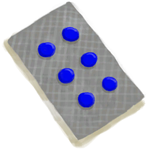

# 镇痛  
> 降低疼痛、发烧、压力和世界观，同时提高勇气。  
> 像<b>卡瓦</b>这样的一些植物具有止疼的功效，可以帮助镇痛和退烧。  它们的镇静作用还可以减轻<b>压力</b>，改善<b>情绪</b>。  
  

<b>基础值: </b> 0 
  

<b>变化范围: </b> 0 ~ 400 
  

<b>基础变化率: </b> -1 / 每15分钟 
  
## 阶段  

<table><tr style="height:2em;"><td style="background-color:#F0F0F0;text-align:center;width:180px;font-size:1.4em;font-weight:bold;vertical-align:middle;">
1 ～ 100

0% ～ 25%
</td><td colspan=2 style="font-size:1.1em;vertical-align:middle;background-color:#F9F9F9;">
<b>

轻度镇痛剂量</b>

</td></tr><tr><td colspan=2><b>影响：</b>[

[疼痛](Pain.md)](Pain.md)<b>-200</b>, [

[发烧](Fever.md)](Fever.md)加成<b>-10</b>, [

[勇气](Courage.md)](Courage.md)<b>+200</b>, [

[压力](Stress.md)](Stress.md)加成<b>-2</b></td></tr><tr><td colspan=2></td></tr><tr style="height:2em;"><td style="background-color:#F0F0F0;text-align:center;width:180px;font-size:1.4em;font-weight:bold;vertical-align:middle;">
101 ～ 200

25% ～ 50%
</td><td colspan=2 style="font-size:1.1em;vertical-align:middle;background-color:#F9F9F9;">
<b>

中度镇痛剂量</b>

</td></tr><tr><td colspan=2><b>影响：</b>[

[疼痛](Pain.md)](Pain.md)<b>-300</b>, [

[发烧](Fever.md)](Fever.md)加成<b>-20</b>, [

[镇痛](Analgesia.md)](Analgesia.md)加成<b>-1</b>, [

[勇气](Courage.md)](Courage.md)<b>+400</b>, [

[压力](Stress.md)](Stress.md)加成<b>-4</b>, [

[世界观](Structure.md)](Structure.md)加成<b>-1</b></td></tr><tr><td colspan=2></td></tr><tr style="height:2em;"><td style="background-color:#F0F0F0;text-align:center;width:180px;font-size:1.4em;font-weight:bold;vertical-align:middle;">
201 ～ 300

50% ～ 75%
</td><td colspan=2 style="font-size:1.1em;vertical-align:middle;background-color:#F9F9F9;">
<b>

高镇痛剂量</b>

</td></tr><tr><td colspan=2><b>影响：</b>[

[疼痛](Pain.md)](Pain.md)<b>-400</b>, [

[发烧](Fever.md)](Fever.md)加成<b>-40</b>, [

[镇痛](Analgesia.md)](Analgesia.md)加成<b>-3</b>, [

[勇气](Courage.md)](Courage.md)<b>+800</b>, [

[压力](Stress.md)](Stress.md)加成<b>-6</b>, [

[世界观](Structure.md)](Structure.md)加成<b>-2</b></td></tr><tr><td colspan=2></td></tr><tr style="height:2em;"><td style="background-color:#F0F0F0;text-align:center;width:180px;font-size:1.4em;font-weight:bold;vertical-align:middle;">
301 ～ 400

75% ～ 100%
</td><td colspan=2 style="font-size:1.1em;vertical-align:middle;background-color:#F9F9F9;">
<b>

极高镇痛剂量</b>

</td></tr><tr><td colspan=2><b>影响：</b>[

[疼痛](Pain.md)](Pain.md)<b>-500</b>, [

[发烧](Fever.md)](Fever.md)加成<b>-80</b>, [

[镇痛](Analgesia.md)](Analgesia.md)加成<b>-5</b>, [

[勇气](Courage.md)](Courage.md)<b>+1600</b>, [

[压力](Stress.md)](Stress.md)加成<b>-8</b>, [

[世界观](Structure.md)](Structure.md)加成<b>-4</b></td></tr><tr><td colspan=2></td></tr></table>
  
## 可被以下操作改变  
<table class="table table-bordered" data-toggle="table"  ><thead style=""><tr ><th  style="text-align:left;vertical-align:top;"  >来源</th><th  style="text-align:left;vertical-align:top;"  >操作</th><th  style="text-align:left;vertical-align:top;"  data-sortable="true"  >值</th></tr></thead><tr ><td  style="text-align:left;vertical-align:top;"  >[

[止痛药](Painkillers.md)](Painkillers.md)</td><td  style="text-align:left;vertical-align:top;"  >服用</td><td  style="text-align:left;vertical-align:top;"  >200</td></tr><tr ><td  style="text-align:left;vertical-align:top;"  >[

[卡瓦汤](LQ_Kava.md)](LQ_Kava.md)</td><td  style="text-align:left;vertical-align:top;"  >饮用</td><td  style="text-align:left;vertical-align:top;"  >75</td></tr><tr ><td  style="text-align:left;vertical-align:top;"  >[

[捣碎的卡瓦根](KavaRootGround.md)](KavaRootGround.md)</td><td  style="text-align:left;vertical-align:top;"  >食用</td><td  style="text-align:left;vertical-align:top;"  >50</td></tr><tr ><td  style="text-align:left;vertical-align:top;"  >[

[卡瓦根](KavaRoot.md)](KavaRoot.md)</td><td  style="text-align:left;vertical-align:top;"  >食用</td><td  style="text-align:left;vertical-align:top;"  >25</td></tr><tr ><td  style="text-align:left;vertical-align:top;"  >[

[干燥的卡瓦根](KavaRootDried.md)](KavaRootDried.md)</td><td  style="text-align:left;vertical-align:top;"  >食用</td><td  style="text-align:left;vertical-align:top;"  >25</td></tr></tbody></table>  
  

