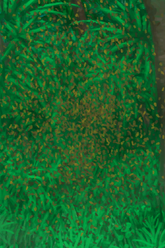

# 繁殖中的蜂群  
> 这个蜂巢在繁殖，我应该找个布袋把新蜂后抓起来。  
  
<table class="table table-bordered" data-toggle="table"  data-show-header="false"><thead style="display:none"><tr ><th  style="width:50%;text-align:left;vertical-align:top;"  >title</th><th  style="width:50%;text-align:left;vertical-align:top;"  ></th></tr></thead><tr ><td  style="width:50%;text-align:left;vertical-align:top;"  >** 不可堆叠 **  **重量：**500  **可用次数：**336</td><td  style="width:50%;text-align:left;vertical-align:top;"  >

<a href="BeeSkepSwarming.md" style="color:black">繁殖中的蜂群</a>

<b>蜂箱</b>是一种人工蜂巢，需要由<b>棕榈编织片、泥土和粪便</b>制成，然后需要放入<b>巢脾</b>、蜂王和一些蜜蜂。 一旦你有了一个蜂巢，你就要确保该地区长了足够的花，让蜜蜂可以生产足够的蜂蜜来养活自己。你也可以给蜜蜂喂混合了<b>糖或蜂蜜</b>的<b>水</b>，这样它们的蜂蜜储备增长得更快。  一旦蜜蜂达到最大数量，它们就会<b>繁殖</b>。这时可以用一个袋子捕捉多余的蜜蜂和它们的蜂后，并用它们来制作一个新的蜂箱。 处理蜜蜂时，考虑使用<b>熏蜂器和防蜂服</b>，否则你会被蜇得很惨。</td></tr></tbody></table>  
  
## 获取来源  

转化

[蜂箱](BeeSkep.md)

  
  
## 动作  

<table><tr><td rowspan="2" style="width:200px;text-align:center;font-size:1.3em;font-weight:bold">

采集

45分

</td><td></td></tr><tr><td><b>自身：</b>蜂蜜

  <b>-500(-50%)</b></td></tr><tr><td colspan="2"><b>需求：</b>休眠

: <b>0(0%)</b>, 蜂蜜

: <b>500～1000(50%～100%)</b>, [

[光亮](Light.md)](Light.md): <b>10-100</b></td></tr><tr><td colspan="2"><b>状态变化：</b>[

[污垢](Filth.md)](Filth.md)<b>+20</b>, [

[蜜蜂蛰刺](BeeStings.md)](BeeStings.md)<b>+4～+16</b></td></tr><tr><td colspan="2">[

[巢脾](BeeHoneycomb.md)](BeeHoneycomb.md)(<b>+2</b>), [

[一群蜜蜂！(事件)](Event_BeesSwarming.md)](Event_BeesSwarming.md)(<b>+1</b>)</td></tr></table>
  

<table><tr><td rowspan="2" style="width:200px;text-align:center;font-size:1.3em;font-weight:bold">

采集

45分

</td><td></td></tr><tr><td><b>自身：</b>蜂蜜

  <b>-500(-50%)</b></td></tr><tr><td colspan="2"><b>需求：</b>休眠

: <b>1～6(16.67%～100%)</b>, 蜂蜜

: <b>500～1000(50%～100%)</b>, [

[光亮](Light.md)](Light.md): <b>10-100</b></td></tr><tr><td colspan="2"><b>状态变化：</b>[

[污垢](Filth.md)](Filth.md)<b>+20</b>, [

[蜜蜂蛰刺](BeeStings.md)](BeeStings.md)<b>+2～+8</b></td></tr><tr><td colspan="2">[

[巢脾](BeeHoneycomb.md)](BeeHoneycomb.md)(<b>+2</b>)</td></tr></table>
  
  
  
## 可拖入  

<table style="margin-bottom:0px;"><tr><td style="width:40%;text-align:left; background-color:#FEFEFE"><b>拖入：</b>[

[火把(开)](TorchOn.md)](TorchOn.md) | [

[熏蜂器(开)](BeeSmokerOn.md)](BeeSmokerOn.md)</td><td style="width:40%;font-size:1em;font-weight:bold;background-color:#FEFEFE">烟熏  </td></tr><tr style="background-color:#FFFFFF"><td style=""><b>使用物：</b></td><td style=""><b>自身：</b>休眠

  <b>+6(100%)</b></td></tr></table>
  

<table style="margin-bottom:0px;"><tr><td style="width:40%;text-align:left; background-color:#FEFEFE"><b>拖入：</b>[“储水容器”](tag_WaterContainer.md) ([“甜水(组)”](GpTag_SweetWater.md) x 1)</td><td style="width:40%;font-size:1em;font-weight:bold;background-color:#FEFEFE">添入  </td></tr><tr style="background-color:#FFFFFF"><td style=""><b>使用物：</b></td><td style=""><b>自身：</b>食物储备

  <b>+500(173.61%)</b></td></tr></table>
  

<table style="margin-bottom:0px;"><tr><td style="width:40%;text-align:left; background-color:#FEFEFE"><b>拖入：</b>[

[布袋](Sack.md)](Sack.md)</td><td style="width:40%;font-size:1em;font-weight:bold;background-color:#FEFEFE">捕捉蜜蜂 (15分) </td></tr><tr style="background-color:#FFFFFF"><td style=""><b>使用物：</b></td><td style=""><b>自身：</b>→ [

[蜂箱](BeeSkep.md)](BeeSkep.md), 种群数量

  <b>-672(-50%)</b></td></tr><tr><td colspan="2">

<table style="margin-bottom:3px;"><tr><td rowspan=2 style="text-align:center" width="80px">
基础权重

0
</td><td style="font-size:0.6em;line-height:0.6em;font-weight:bold">Protected</td></tr><tr><td>[

[蜂后](QueenBee.md)](QueenBee.md)(<b>+1</b>), [

[蜜蜂](Bees.md)](Bees.md)(<b>+1</b>)</td></tr><tr><td colspan=2><li>[

[蜂蛰防护](BeeProtection.md)](BeeProtection.md)为<b>6～10</b>时权重<b>+10</b>，否则权重-1000000</li></td></tr></table>

<table style="margin-bottom:3px;"><tr><td rowspan=2 style="text-align:center" width="80px">
基础权重

0
</td><td style="font-size:0.6em;line-height:0.6em;font-weight:bold">Protected</td></tr><tr><td>[

[蜂后](QueenBee.md)](QueenBee.md)(<b>+1</b>), [

[蜜蜂](Bees.md)](Bees.md)(<b>+1</b>), [

[一群蜜蜂！(事件)](Event_BeesSwarming.md)](Event_BeesSwarming.md)(<b>+1</b>)</td></tr><tr><td colspan=2><li>[

[蜂蛰防护](BeeProtection.md)](BeeProtection.md)为<b>0</b>时权重<b>+10</b>，否则权重-1000000</li></td></tr></table>
<button class="btn btn-secondary btn-sm" style="" data-toggle="modal" onclick="setCollectionDataBase64('eyJ0aXRsZSI6IuamgueOh+aooeaLnzog5o2V5o2J6Jyc6JyCICjnuYHmrpbkuK3nmoTonILnvqQpIiwiY29sbGVjdGlvbnMiOlt7ImRyb3AiOiI8ZGl2IHN0eWxlPVwid2lkdGg6MjVweDtkaXNwbGF5OmlubGluZS1ibG9jazt0ZXh0LWFsaWduOmNlbnRlclwiPjxpbWcgZGVjb2Rpbmc9XCJhc3luY1wiIHNyYz1cIi4uL3dpa2kvU3ByaXRlL0JlZVF1ZWVuLnBuZ1wiIGhyZWY9XCJhLm1kXCIgc3R5bGU9XCJtYXgtd2lkdGg6MjVweDttYXgtaGVpZ2h0OjI1cHg7XCI+PC9kaXY+6JyC5ZCOPGRpdiBzdHlsZT1cIndpZHRoOjI1cHg7ZGlzcGxheTppbmxpbmUtYmxvY2s7dGV4dC1hbGlnbjpjZW50ZXJcIj48aW1nIGRlY29kaW5nPVwiYXN5bmNcIiBzcmM9XCIuLi93aWtpL1Nwcml0ZS9CZWVQaWxlLnBuZ1wiIGhyZWY9XCJhLm1kXCIgc3R5bGU9XCJtYXgtd2lkdGg6MjVweDttYXgtaGVpZ2h0OjI1cHg7XCI+PC9kaXY+6Jyc6JyCIiwiYmFzZSI6MCwiY29uZGl0aW9uIjpbeyJrZXkiOiJCZWVQcm90ZWN0aW9uIiwidGl0bGUiOiLonILom7DpmLLmiqQiLCJ0eXBlIjoicmFuZ2UiLCJtYXgiOlswLDEwXSwicmFuZ2UiOls2LDEwXSwid2VpZ2h0IjpbMTAsMTBdLCJkZWZhdWx0VmFsdWUiOjAsIndoZW5PdXRPZlJhbmdlIjoyfV19LHsiZHJvcCI6IjxkaXYgc3R5bGU9XCJ3aWR0aDoyNXB4O2Rpc3BsYXk6aW5saW5lLWJsb2NrO3RleHQtYWxpZ246Y2VudGVyXCI+PGltZyBkZWNvZGluZz1cImFzeW5jXCIgc3JjPVwiLi4vd2lraS9TcHJpdGUvQmVlUXVlZW4ucG5nXCIgaHJlZj1cImEubWRcIiBzdHlsZT1cIm1heC13aWR0aDoyNXB4O21heC1oZWlnaHQ6MjVweDtcIj48L2Rpdj7onILlkI48ZGl2IHN0eWxlPVwid2lkdGg6MjVweDtkaXNwbGF5OmlubGluZS1ibG9jazt0ZXh0LWFsaWduOmNlbnRlclwiPjxpbWcgZGVjb2Rpbmc9XCJhc3luY1wiIHNyYz1cIi4uL3dpa2kvU3ByaXRlL0JlZVBpbGUucG5nXCIgaHJlZj1cImEubWRcIiBzdHlsZT1cIm1heC13aWR0aDoyNXB4O21heC1oZWlnaHQ6MjVweDtcIj48L2Rpdj7onJzonII8ZGl2IHN0eWxlPVwid2lkdGg6MjVweDtkaXNwbGF5OmlubGluZS1ibG9jazt0ZXh0LWFsaWduOmNlbnRlclwiPjxpbWcgZGVjb2Rpbmc9XCJhc3luY1wiIHNyYz1cIi4uL3dpa2kvU3ByaXRlL0JlZVN3YXJtLnBuZ1wiIGhyZWY9XCJhLm1kXCIgc3R5bGU9XCJtYXgtd2lkdGg6MjVweDttYXgtaGVpZ2h0OjI1cHg7XCI+PC9kaXY+5LiA576k6Jyc6JyC77yBKOS6i+S7tikiLCJiYXNlIjowLCJjb25kaXRpb24iOlt7ImtleSI6IkJlZVByb3RlY3Rpb24iLCJ0aXRsZSI6IuicguibsOmYsuaKpCIsInR5cGUiOiJyYW5nZSIsIm1heCI6WzAsMTBdLCJyYW5nZSI6WzAsMF0sIndlaWdodCI6WzEwLDEwXSwiZGVmYXVsdFZhbHVlIjowLCJ3aGVuT3V0T2ZSYW5nZSI6Mn1dfV19')" data-target="#modelCollectionSimulator">概率模拟</button>
</td></tr></table>
  
  
## 属性   

<table style="margin-bottom:0px;"><tr><td style="width:30%;text-align:left; background-color:#FEFEFE;font-size:1.3em;font-weight:bold;">

休眠</td><td style="font-size:1em;background-color:#FEFEFE">初始：0 , 最大：6 每15分钟-1 , 最多需要：1小时30分</td></tr><tr style="background-color:#FFFFFF"><td colspan=2></td></tr></table>
  

<table style="margin-bottom:0px;"><tr><td style="width:30%;text-align:left; background-color:#FEFEFE;font-size:1.3em;font-weight:bold;">

种群数量</td><td style="font-size:1em;background-color:#FEFEFE">初始：336 , 最大：1344 每15分钟+1 , 最多需要：14天</td></tr><tr style="background-color:#FFFFFF"><td colspan=2></td></tr></table>
  

<table style="margin-bottom:0px;"><tr><td style="width:30%;text-align:left; background-color:#FEFEFE;font-size:1.3em;font-weight:bold;">

食物储备</td><td style="font-size:1em;background-color:#FEFEFE">初始：0 , 最大：288 每15分钟-1 , 最多需要：3天</td></tr><tr style="background-color:#FFFFFF"><td colspan=2></td></tr></table>
  

<table style="margin-bottom:0px;"><tr><td style="width:30%;text-align:left; background-color:#FEFEFE;font-size:1.3em;font-weight:bold;">

蜂蜜</td><td style="font-size:1em;background-color:#FEFEFE">初始：0 , 最大：1000 -</td></tr><tr style="background-color:#FFFFFF"><td colspan=2></td></tr></table>
  

<table style="margin-bottom:0px;"><tr><td style="width:30%;text-align:left; background-color:#FEFEFE;font-size:1.3em;font-weight:bold;">特殊1</td><td style="font-size:1em;background-color:#FEFEFE">初始：96 , 最大：96 每15分钟-1 , 最多需要：1天</td></tr><tr style="background-color:#FFFFFF"><td colspan=2>** 到达0时： ** 自身: → [

[蜂箱](BeeSkep.md)](BeeSkep.md) 种群数量

  <b>-672(-50%)</b></td></tr></table>
  
## 被动效果  
<table class="table table-bordered" data-toggle="table"  ><thead style=""><tr ><th  style="text-align:left;vertical-align:top;"  >名称</th><th  style="text-align:left;vertical-align:top;"  >条件</th><th  style="text-align:left;vertical-align:top;"  >变化(每15分钟)</th><th  style="text-align:left;vertical-align:top;"  data-sortable="true"  >玩家状态</th></tr></thead><tr ><td  style="text-align:left;vertical-align:top;"  >Make Honey</td><td  style="text-align:left;vertical-align:top;"  >** 需要存在卡牌(可叠加)：** [“花”](tag_Flower.md)</td><td  style="text-align:left;vertical-align:top;"  >蜂蜜

+0.1(0.01%)</td><td  style="text-align:left;vertical-align:top;"  ></td></tr><tr ><td  style="text-align:left;vertical-align:top;"  >Eat Honey</td><td  style="text-align:left;vertical-align:top;"  >** 需要属性：** 食物储备

: <b>0～0.1(0%～0.03%)</b></td><td  style="text-align:left;vertical-align:top;"  >蜂蜜

-1(-0.1%)</td><td  style="text-align:left;vertical-align:top;"  ></td></tr><tr ><td  style="text-align:left;vertical-align:top;"  >Starve</td><td  style="text-align:left;vertical-align:top;"  >** 需要属性：** 食物储备

: <b>0～0.1(0%～0.03%)</b> 蜂蜜

: <b>0～0.1(0%～0.01%)</b></td><td  style="text-align:left;vertical-align:top;"  >种群数量

 -2(-0.15%)</td><td  style="text-align:left;vertical-align:top;"  ></td></tr><tr ><td  style="text-align:left;vertical-align:top;"  >Hive Competition</td><td  style="text-align:left;vertical-align:top;"  >** 需要存在卡牌(可叠加)：** [繁殖中的蜂群](BeeSkepSwarming.md)</td><td  style="text-align:left;vertical-align:top;"  >蜂蜜

-0.5(-0.05%)</td><td  style="text-align:left;vertical-align:top;"  ></td></tr><tr ><td  style="text-align:left;vertical-align:top;"  >Breed More</td><td  style="text-align:left;vertical-align:top;"  >** 需要属性：** 食物储备

: <b>0.5～1(0.17%～0.35%)</b> 蜂蜜

: <b>0.5～1(0.05%～0.1%)</b></td><td  style="text-align:left;vertical-align:top;"  >种群数量

 +1(0.07%)</td><td  style="text-align:left;vertical-align:top;"  ></td></tr></tbody></table>  
  

