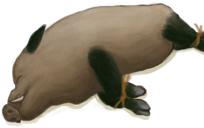

# 公猪  
> 一头活公猪。可以通过喂食喂水来维持生命，或者放养在畜栏里。  
  
<table class="table table-bordered" data-toggle="table"  data-show-header="false"><thead style="display:none"><tr ><th  style="width:50%;text-align:left;vertical-align:top;"  >title</th><th  style="width:50%;text-align:left;vertical-align:top;"  ></th></tr></thead><tr ><td  style="width:50%;text-align:left;vertical-align:top;"  >** 不可堆叠 **  **重量：**3000  **标签：**	[“野猪”](tag_Boar.md), [“大的”](tag_Large.md), [“大型动物”](tag_LargeAnimal.md)  **可用次数：**288</td><td  style="width:50%;text-align:left;vertical-align:top;"  >

<a href="BoarTiedMale.md" style="color:black">公猪</a>

</td></tr></tbody></table>  
  
## 获取来源  

捕捉猎物

[陷坑](TrappingPit.md)

捡起

[公猪](BoarEnclosureMale.md)

  
  
## 动作  

<table><tr><td rowspan="2" style="width:200px;text-align:center;font-size:1.3em;font-weight:bold">

圈养在畜栏中

</td><td></td></tr><tr><td><b>自身：</b>→ [

[公猪](BoarEnclosureMale.md)](BoarEnclosureMale.md)</td></tr><tr><td colspan="2"><b>需求：</b>位于[

[畜栏(环境)](Env_Enclosure.md)](Env_Enclosure.md)</td></tr></table>
  

<table><tr><td rowspan="2" style="width:200px;text-align:center;font-size:1.3em;font-weight:bold">

放生

15分

</td><td></td></tr><tr><td><b>自身：</b>→消失</td></tr><tr><td colspan="2"><b>需求：</b>~~位于[

[畜栏(环境)](Env_Enclosure.md)](Env_Enclosure.md)~~</td></tr><tr><td colspan="2"><b>状态变化：</b>[野猪种群数量](Pop_Boar.md)<b>+1000</b></td></tr></table>
  
  
  
## 可拖入  

<table style="margin-bottom:0px;"><tr><td style="width:40%;text-align:left; background-color:#FEFEFE"><b>拖入：</b>[“低糖分”](tag_SugarsPoor.md) | [“低蛋白”](tag_ProteinsPoor.md) | [“低加工”](tag_ProcessedPoor.md)</td><td style="width:40%;font-size:1em;font-weight:bold;background-color:#FEFEFE">喂食 (3分) </td></tr><tr style="background-color:#FFFFFF"><td style=""><b>使用物：</b>→消失</td><td style=""><b>自身：</b>饥饿

  <b>+48(8.33%)</b>, 情绪

  <b>+12(1.2%)</b></td></tr></table>
  

<table style="margin-bottom:0px;"><tr><td style="width:40%;text-align:left; background-color:#FEFEFE"><b>拖入：</b>[“高糖分”](tag_SugarsRich.md) | [“高蛋白”](tag_ProteinsRich.md) | [“高加工”](tag_ProcessedRich.md)</td><td style="width:40%;font-size:1em;font-weight:bold;background-color:#FEFEFE">喂食 (3分) </td></tr><tr style="background-color:#FFFFFF"><td style=""><b>使用物：</b>→消失</td><td style=""><b>自身：</b>饥饿

  <b>+384(66.67%)</b>, 情绪

  <b>+50(5%)</b></td></tr></table>
  

<table style="margin-bottom:0px;"><tr><td style="width:40%;text-align:left; background-color:#FEFEFE"><b>拖入：</b>[“中糖分”](tag_SugarsMedium.md) | [“中蛋白”](tag_ProteinsMedium.md) | [“中加工”](tag_ProcessedMedium.md)</td><td style="width:40%;font-size:1em;font-weight:bold;background-color:#FEFEFE">喂食 (3分) </td></tr><tr style="background-color:#FFFFFF"><td style=""><b>使用物：</b>→消失</td><td style=""><b>自身：</b>饥饿

  <b>+192(33.33%)</b>, 情绪

  <b>+25(2.5%)</b></td></tr></table>
  

<table style="margin-bottom:0px;"><tr><td style="width:40%;text-align:left; background-color:#FEFEFE"><b>拖入：</b>[“储水容器”](tag_WaterContainer.md) ([“淡水(组)”](GpTag_WaterFresh.md) x 1)</td><td style="width:40%;font-size:1em;font-weight:bold;background-color:#FEFEFE">喂水  </td></tr><tr style="background-color:#FFFFFF"><td style=""><b>使用物：</b></td><td style=""><b>自身：</b>口渴

  <b>+48(16.67%)</b>, 情绪

  <b>+25(2.5%)</b></td></tr></table>
  

<table style="margin-bottom:0px;"><tr><td style="width:40%;text-align:left; background-color:#FEFEFE"><b>拖入：</b>[

[大石块](StoneHeavy.md)](StoneHeavy.md) | [“切割工具”](tag_Cutter.md) | [“斧”](tag_Axe.md) | [“一级矛”](tag_Spear.md)</td><td style="width:40%;font-size:1em;font-weight:bold;background-color:#FEFEFE">宰杀 (30分) [“手部动作(组)”](HandAction.md)</td></tr><tr><td colspan="2"><b>需求：</b>[

[光亮](Light.md)](Light.md): <b>10-100</b></td></tr><tr style="background-color:#FFFFFF"><td style=""><b>使用物：</b></td><td style=""><b>自身：</b>→ [

[野猪尸体](BoarCarcass.md)](BoarCarcass.md)</td></tr><tr><td colspan="2"><b>状态变化：</b>[

[污垢](Filth.md)](Filth.md)<b>+20</b></td></tr></table>
  
  
## 属性   

<table style="margin-bottom:0px;"><tr><td style="width:30%;text-align:left; background-color:#FEFEFE;font-size:1.3em;font-weight:bold;">

饥饿</td><td style="font-size:1em;background-color:#FEFEFE">初始：576 , 最大：576 每15分钟-1 , 最多需要：6天</td></tr><tr style="background-color:#FFFFFF"><td colspan=2>** 到达0时： ** 自身: → [

[野猪尸体](BoarCarcass.md)](BoarCarcass.md)</td></tr></table>
  

<table style="margin-bottom:0px;"><tr><td style="width:30%;text-align:left; background-color:#FEFEFE;font-size:1.3em;font-weight:bold;">

口渴</td><td style="font-size:1em;background-color:#FEFEFE">初始：288 , 最大：288 每15分钟-1 , 最多需要：3天</td></tr><tr style="background-color:#FFFFFF"><td colspan=2>** 到达0时：渴死了 ** 自身: → [

[野猪尸体](BoarCarcass.md)](BoarCarcass.md)</td></tr></table>
  

<table style="margin-bottom:0px;"><tr><td style="width:30%;text-align:left; background-color:#FEFEFE;font-size:1.3em;font-weight:bold;">

情绪</td><td style="font-size:1em;background-color:#FEFEFE">初始：0 , 最大：1000 每15分钟-5 , 最多需要：2天2小时</td></tr><tr style="background-color:#FFFFFF"><td colspan=2></td></tr></table>
  

<table style="margin-bottom:0px;"><tr><td style="width:30%;text-align:left; background-color:#FEFEFE;font-size:1.3em;font-weight:bold;">

体重</td><td style="font-size:1em;background-color:#FEFEFE">初始：3000 , 最大：6000 每15分钟-2 , 最多需要：31天6小时</td></tr><tr style="background-color:#FFFFFF"><td colspan=2></td></tr></table>
  

