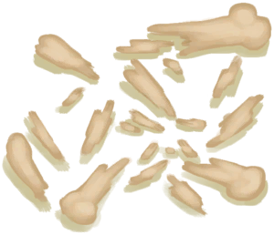

# 骨头  
> 有点吓人，不过也许我能用它们制作点什么。  
  
<table class="table table-bordered" data-toggle="table"  data-show-header="false"><thead style="display:none"><tr ><th  style="width:50%;text-align:left;vertical-align:top;"  >title</th><th  style="width:50%;text-align:left;vertical-align:top;"  ></th></tr></thead><tr ><td  style="width:50%;text-align:left;vertical-align:top;"  >**环境：**[猕猴窝(环境)](Env_MacaqueDen.md)  **重量：**150</td><td  style="width:50%;text-align:left;vertical-align:top;"  >

<a href="Bones.md" style="color:black">骨头</a>

骨头可以从动物的尸体上获得，有时也可以在巨蜥的食丸中找到。  大的骨头可以用于某些特定的制作配方，也可以砸碎成为<b>骨头碎片</b>用于制作较小的物品，或者进一步磨碎成<b>骨粉</b>用作肥料。 <b>鱼钩和骨针</b>可以用鸟骨或骨头碎片制作，分别用于钓鱼和裁缝。</td></tr></tbody></table>  
  
## 获取来源  

转化

[野猪尸体](BoarCarcass.md)

转化

[小猪尸体](BoarCarcassPiglet.md)

转化

[剥皮的野猪](BoarSkinned.md)

转化

[剥皮的小猪](BoarSkinnedPiglet.md)

转化

[山羊尸体(母)](GoatCarcassFemale.md)

转化

[小羊尸体](GoatCarcassKid.md)

转化

[山羊尸体(公)](GoatCarcassMale.md)

转化

[剥皮的山羊](GoatSkinned.md)

转化

[剥皮的小羊](GoatSkinnedKid.md)

** 使用**[黑曜石刀](KnifeObsidian.md)剔肉

[猕猴尸体](MacaqueCarcass.md)

** 使用**[“切割工具”](tag_Cutter.md)剔肉

[猕猴尸体](MacaqueCarcass.md)

采集

[食丸](GastricPellet.md)

转化

[巨蜥尸体](MonitorCarcass.md)

转化

[剥皮的巨蜥](MonitorSkinned.md)

采集

[骷髅(坑洞)](Skeleton.md)

  
  
## 可拖入  

<table style="margin-bottom:0px;"><tr><td style="width:40%;text-align:left; background-color:#FEFEFE"><b>拖入：</b>[“锤”](tag_Hammer.md)</td><td style="width:40%;font-size:1em;font-weight:bold;background-color:#FEFEFE">打碎 (30分) [“手部动作(组)”](HandAction.md)</td></tr><tr style="background-color:#FFFFFF"><td style=""><b>使用物：</b></td><td style=""><b>自身：</b>→消失</td></tr><tr><td colspan="2">[

[骨头碎片](BoneSplinters.md)](BoneSplinters.md)(<b>+2</b>)</td></tr></table>
  
  
## 可拖至  

[忠犬朋友](DogFriend.md)

  
  
## 可用于蓝图  

<a href="Bp_BoneKnife.md" style="color:black">骨刀</a>

<a href="Bp_Drum.md" style="color:black">鼓</a>

<a href="Bp_FluteBone.md" style="color:black">骨笛</a>

<a href="Bp_Harpoon.md" style="color:black">鱼镖</a>

<a href="Bp_BoneBroth.md" style="color:black">骨头汤</a>

  
  
  

