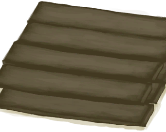

# 书架（未放置）  
> 一个储物装置，可以储存或展示物品。  
  
<table class="table table-bordered" data-toggle="table"  data-show-header="false"><thead style="display:none"><tr ><th  style="width:50%;text-align:left;vertical-align:top;"  >title</th><th  style="width:50%;text-align:left;vertical-align:top;"  ></th></tr></thead><tr ><td  style="width:50%;text-align:left;vertical-align:top;"  >** 不可删除 **  **重量：**1500</td><td  style="width:50%;text-align:left;vertical-align:top;"  >

<a href="BookShelfDismantled.md" style="color:black">书架（未放置）</a>

</td></tr></tbody></table>  
  
## 获取来源  

拆卸并捡起

[书架](Bookshelf.md)

  
  
## 动作  

<table><tr><td rowspan="2" style="width:200px;text-align:center;font-size:1.3em;font-weight:bold">

放置

1小时

</td><td>[“手部动作(组)”](HandAction.md)</td></tr><tr><td><b>自身：</b>→ [

[书架](Bookshelf.md)](Bookshelf.md)</td></tr><tr><td colspan="2"><b>需求：</b>[

[遮蔽](Sheltered.md)](Sheltered.md): <b>1-1</b>, [

[光亮](Light.md)](Light.md): <b>10-100</b></td></tr></table>
  
  
  

