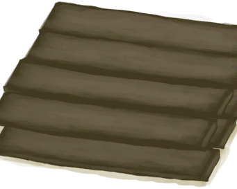

# 书架  
> 一个储物装置，可以储存或展示物品。  
  
<table class="table table-bordered" data-toggle="table"  data-show-header="false"><thead style="display:none"><tr ><th  style="width:50%;text-align:left;vertical-align:top;"  >title</th><th  style="width:50%;text-align:left;vertical-align:top;"  ></th></tr></thead><tr ><td  style="width:50%;text-align:left;vertical-align:top;"  >** 可重命名 **  ** 不可堆叠 **  **重量：**1000  **标签：**	[“袋子”](tag_Bag.md)  **容量：**3000  **减重：**-3000  ** 效果: ** [

[舒适度](Comfort.md)](Comfort.md)<b>+50</b></td><td  style="width:50%;text-align:left;vertical-align:top;"  >

<a href="Bookshelf.md" style="color:black">书架</a>

一件实用的家具，可以增加你的<b>舒适度</b>，提供大量的存储空间，并为你提供充足的空间来展示<b>装饰品</b>。书架上的每一件装饰品都会增加整体<b>舒适度</b>。  它需要足够的<b>木工技能</b>，以及<b>木板和木钉</b>来建造。</td></tr></tbody></table>  
  
## 获取来源  

放置

[书架（未放置）](BookShelfDismantled.md)

蓝图制造

[书架(蓝图)](Bp_Bookshelf.md)

  
  
## 动作  

<table><tr><td rowspan="2" style="width:200px;text-align:center;font-size:1.3em;font-weight:bold">

拆解

2小时

</td><td></td></tr><tr><td><b>自身：</b>→消失</td></tr><tr><td colspan="2">[

[木板](Plank.md)](Plank.md)(<b>+7</b>)</td></tr></table>
  

<table><tr><td rowspan="2" style="width:200px;text-align:center;font-size:1.3em;font-weight:bold">

拆卸并捡起

30分

</td><td>[“手部动作(组)”](HandAction.md)</td></tr><tr><td><b>自身：</b>→ [

[书架（未放置）](BookShelfDismantled.md)](BookShelfDismantled.md)</td></tr><tr><td colspan="2"><b>需求：</b>[

[光亮](Light.md)](Light.md): <b>10-100</b></td></tr></table>
  
  
  
## 被动效果  
<table class="table table-bordered" data-toggle="table"  ><thead style=""><tr ><th  style="text-align:left;vertical-align:top;"  >名称</th><th  style="text-align:left;vertical-align:top;"  >条件</th><th  style="text-align:left;vertical-align:top;"  data-sortable="true"  >变化(每15分钟)</th><th  style="text-align:left;vertical-align:top;"  >玩家状态</th></tr></thead><tr ><td  style="text-align:left;vertical-align:top;"  >Decoration Comfort</td><td  style="text-align:left;vertical-align:top;"  >** 需要放入：** [“装饰品”](tag_Decoration.md)</td><td  style="text-align:left;vertical-align:top;"  ></td><td  style="text-align:left;vertical-align:top;"  >[

[舒适度](Comfort.md)](Comfort.md)<b>+10</b></td></tr><tr ><td  style="text-align:left;vertical-align:top;"  >Decoration Advanced Comfort</td><td  style="text-align:left;vertical-align:top;"  >** 需要放入：** [“高级装饰品”](tag_DecorationAdv.md)</td><td  style="text-align:left;vertical-align:top;"  ></td><td  style="text-align:left;vertical-align:top;"  >[

[舒适度](Comfort.md)](Comfort.md)<b>+15</b></td></tr></tbody></table>  
  

