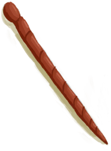
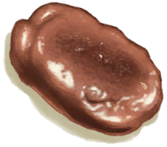

# 铜针  
> 趁手又耐用。  
  
<table class="table table-bordered" data-toggle="table"  data-show-header="false"><thead style="display:none"><tr ><th  style="width:50%;text-align:left;vertical-align:top;"  >title</th><th  style="width:50%;text-align:left;vertical-align:top;"  ></th></tr></thead><tr ><td  style="width:50%;text-align:left;vertical-align:top;"  >** 解锁需求: ** [铜板](CopperSheet.md)  ** 研究耗时: ** 12小时  ** 动作分类: ** [“手部动作(组)”](HandAction.md) [“制造动作(组)”](CraftAction.md)  ** 制作条件: ** ~~[

[铜针(蓝图)](Bp_CopperNeedles.md)](Bp_CopperNeedles.md)存在于手中/面板~~</td><td  style="width:50%;text-align:left;vertical-align:top;"  >

<a href="Bp_CopperNeedles.md" style="color:black">铜针</a>

</td></tr></tbody></table>  
  
## 制作  

<table><tr><td style="width:100px;"><b>材料总计：</b></td><td>[

[铜板](CopperSheet.md)](CopperSheet.md) x 1 , [“锋利的刀(组)”](GpTag_CutterAdv.md) x 1(使用次数-4)</td></tr><tr><td><b>耗时：</b></td><td>1小时30分</td></tr><tr><td><b>需求：</b></td><td>[

[光亮](Light.md)](Light.md): <b>10-100</b></td></tr><tr><td><b>状态变化：</b></td><td>[

[金工(技能)](Skill_Metalworking.md)](Skill_Metalworking.md)<b>+1</b>, [

[压力](Stress.md)](Stress.md)<b>-10</b>, [

[情绪](Morale.md)](Morale.md)<b>+10</b></td></tr><tr><td colspan=2><b>步骤：</b></td></tr><tr><td style="text-align:right"><b>1.</b></td><td>[

[铜板](CopperSheet.md)](CopperSheet.md) x 1 + [“锋利的刀(组)”](GpTag_CutterAdv.md) x 1(使用次数-4)</td></tr><tr style="background-color:#fff;font-size:1.2em;"><td></td><td style="text-align:right"><b>成品：</b>[

[铜针](CopperNeedle.md)](CopperNeedle.md)(<b>+4</b>)</td></tr></table>
  
  

