# 粘土  
> 一块粘土。  
  
<table class="table table-bordered" data-toggle="table"  data-show-header="false"><thead style="display:none"><tr ><th  style="width:50%;text-align:left;vertical-align:top;"  >title</th><th  style="width:50%;text-align:left;vertical-align:top;"  ></th></tr></thead><tr ><td  style="width:50%;text-align:left;vertical-align:top;"  >**重量：**150  **标签：**	[“沉重的”](tag_Heavy.md)</td><td  style="width:50%;text-align:left;vertical-align:top;"  >

<a href="Clay.md" style="color:black">粘土</a>

粘土可以通过粉碎<b>干土</b>然后添加<b>水</b>，或单纯搅拌<b>泥</b>制成。  它是一种极其有用的材料，可用于制作多种<b>液体容器</b>和建筑。</td></tr></tbody></table>  
  
## 获取来源  

制作粘土

[泥堆](MudPile.md)

** 使用**[“锤”](tag_Hammer.md)制作粘土

[泥堆](MudPile.md)

摔碎

[未烧制的陶碗](ClayBowlUnfired.md)

** 使用**[“水(任意)”](tag_WaterAny.md)加水搅拌

[细土](FineDirt.md)

回收

[装饰品模具](MoldCopperDecoration.md)

  
  
## 可拖入  

<table style="margin-bottom:0px;"><tr><td style="width:40%;text-align:left; background-color:#FEFEFE"><b>拖入：</b>[“抗裂剂”](tag_Temper.md)</td><td style="width:40%;font-size:1em;font-weight:bold;background-color:#FEFEFE">制作碗 (15分) [“手部动作(组)”](HandAction.md)</td></tr><tr><td colspan="2"><b>需求：</b>[

[光亮](Light.md)](Light.md): <b>10-100</b></td></tr><tr style="background-color:#FFFFFF"><td style=""><b>使用物：</b>→消失</td><td style=""><b>自身：</b>→ [

[未烧制的陶碗](ClayBowlUnfired.md)](ClayBowlUnfired.md)</td></tr></table>
  
  
## 可用于蓝图  

<a href="Bp_BeeSmoker.md" style="color:black">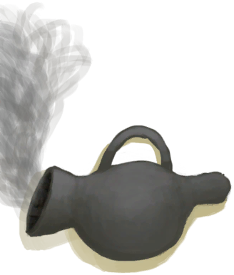熏蜂器</a>

<a href="Bp_Cellar.md" style="color:black">地窖</a>

<a href="Bp_Forge.md" style="color:black">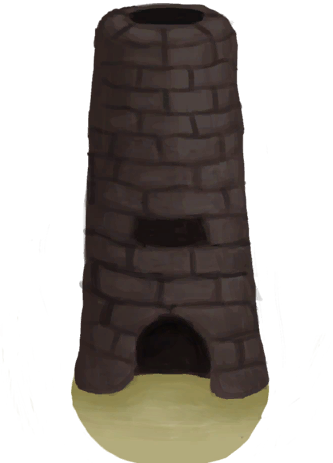熔炉</a>

<a href="Bp_KilnAdvanced.md" style="color:black">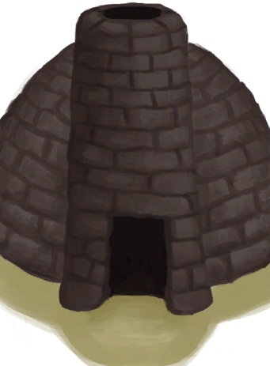高级窑炉</a>

<a href="Bp_MoldDecoration.md" style="color:black">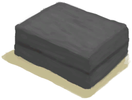装饰品模具</a>

<a href="Bp_NiterBed.md" style="color:black">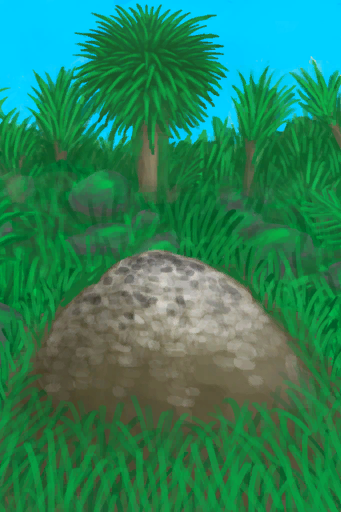硝石矿床</a>

<a href="Bp_SaltBed.md" style="color:black">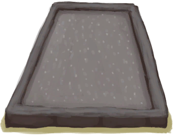盐田</a>

<a href="Bp_SupplyChest.md" style="color:black">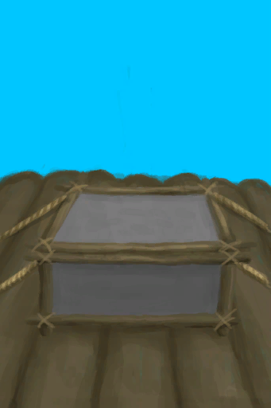补给箱</a>

<a href="Bp_WaterReservoir.md" style="color:black">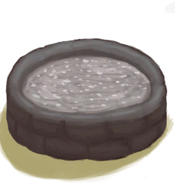蓄水池</a>

<a href="Bp_WateringTrough.md" style="color:black">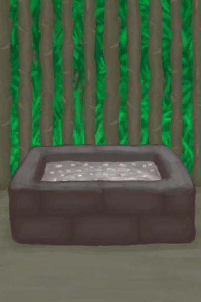水槽</a>

<a href="Bp_Alembic.md" style="color:black">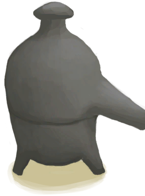蒸馏器</a>

<a href="Bp_ClayBowl.md" style="color:black">陶碗</a>

<a href="Bp_ClayFirePit.md" style="color:black">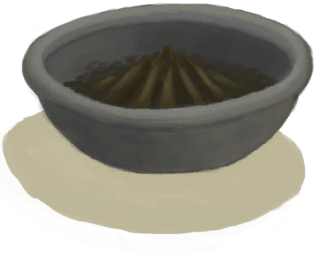粘土火盆</a>

<a href="Bp_ClayJar.md" style="color:black">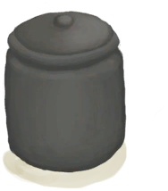小陶罐</a>

<a href="Bp_ClayPotCooler.md" style="color:black">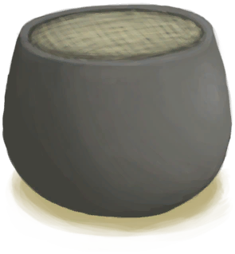保鲜罐</a>

<a href="Bp_ClayVase.md" style="color:black">陶罐</a>

<a href="Bp_CookingPot.md" style="color:black">烹饪锅</a>

<a href="Bp_GlazedVase.md" style="color:black">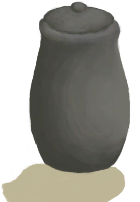釉面陶罐</a>

  
  
  

