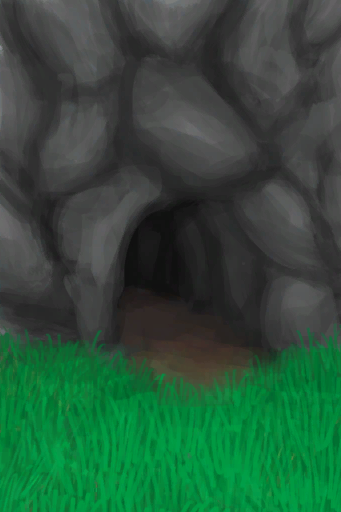
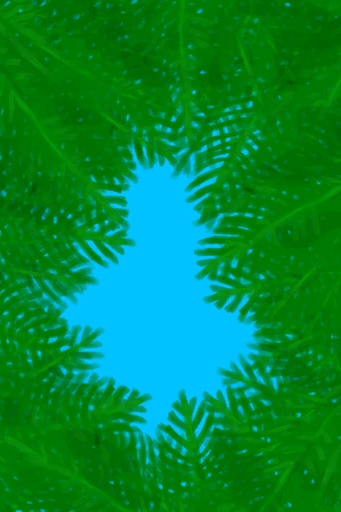

# 舒适度  
> 显示一个地点的安全、舒适和有意义程度。降低压力和寂寞感，改善情绪和世界观。  
> 住在一个舒适的定居点有助于改善你的<b>情绪</b>和<b>世界观</b>，同时降低你的<b>压力</b>和<b>孤独感</b>。  安全实用并且舒适的定居点非常重要。可以通过在室内添置<b>家具</b>和<b>装饰品</b>来增加舒适度。用<b>扫帚</b>保持室内环境整洁，否则污垢会增加<b>不适</b>。  <b>鲜花</b>和<b>香薰蜡烛</b>也可以暂时增加舒适度。  
  

<b>基础值: </b> 0 
  

<b>变化范围: </b> 0 ~ 2500 
  

<b>基础变化率: </b> 无 
  
## 阶段  

<table><tr style="height:2em;"><td style="background-color:#F0F0F0;text-align:center;width:180px;font-size:1.4em;font-weight:bold;vertical-align:middle;">
100 ～ 250

4% ～ 10%
</td><td colspan=2 style="font-size:1.1em;vertical-align:middle;background-color:#F9F9F9;">
<b>

最低舒适度</b>

</td></tr><tr><td colspan=2><b>影响：</b>[

[世界观](Structure.md)](Structure.md)加成<b>+1</b>, [

[压力](Stress.md)](Stress.md)加成<b>-0.5</b></td></tr><tr><td colspan=2></td></tr><tr style="height:2em;"><td style="background-color:#F0F0F0;text-align:center;width:180px;font-size:1.4em;font-weight:bold;vertical-align:middle;">
251 ～ 500

10% ～ 20%
</td><td colspan=2 style="font-size:1.1em;vertical-align:middle;background-color:#F9F9F9;">
<b>

低舒适度</b>

&nbsp;&nbsp;我应该让这个地方感觉更像一个家。
</td></tr><tr><td colspan=2><b>影响：</b>[

[世界观](Structure.md)](Structure.md)加成<b>+2</b>, [

[压力](Stress.md)](Stress.md)加成<b>-0.5</b>, [

[情绪](Morale.md)](Morale.md)加成<b>+0.25</b></td></tr><tr><td colspan=2></td></tr><tr style="height:2em;"><td style="background-color:#F0F0F0;text-align:center;width:180px;font-size:1.4em;font-weight:bold;vertical-align:middle;">
501 ～ 1000

20% ～ 40%
</td><td colspan=2 style="font-size:1.1em;vertical-align:middle;background-color:#F9F9F9;">
<b>

中舒适度</b>

&nbsp;&nbsp;我应该进一步布置和装饰这个地方。
</td></tr><tr><td colspan=2><b>影响：</b>[

[世界观](Structure.md)](Structure.md)加成<b>+3</b>, [

[压力](Stress.md)](Stress.md)加成<b>-0.75</b>, [

[情绪](Morale.md)](Morale.md)加成<b>+0.5</b>, [

[孤独感](Loneliness.md)](Loneliness.md)加成<b>-0.5</b></td></tr><tr><td colspan=2></td></tr><tr style="height:2em;"><td style="background-color:#F0F0F0;text-align:center;width:180px;font-size:1.4em;font-weight:bold;vertical-align:middle;">
1001 ～ 1750

40% ～ 70%
</td><td colspan=2 style="font-size:1.1em;vertical-align:middle;background-color:#F9F9F9;">
<b>

高舒适度</b>

&nbsp;&nbsp;一个不错的家。我在这里感觉很舒服。
</td></tr><tr><td colspan=2><b>影响：</b>[

[世界观](Structure.md)](Structure.md)加成<b>+4</b>, [

[压力](Stress.md)](Stress.md)加成<b>-1</b>, [

[情绪](Morale.md)](Morale.md)加成<b>+0.75</b>, [

[孤独感](Loneliness.md)](Loneliness.md)加成<b>-1</b></td></tr><tr><td colspan=2></td></tr><tr style="height:2em;"><td style="background-color:#F0F0F0;text-align:center;width:180px;font-size:1.4em;font-weight:bold;vertical-align:middle;">
1751 ～ 2500

70% ～ 100%
</td><td colspan=2 style="font-size:1.1em;vertical-align:middle;background-color:#F9F9F9;">
<b>

最高舒适度</b>

&nbsp;&nbsp;快乐老家。任何地方都比不上它。
</td></tr><tr><td colspan=2><b>影响：</b>[

[世界观](Structure.md)](Structure.md)加成<b>+5</b>, [

[压力](Stress.md)](Stress.md)加成<b>-1.25</b>, [

[情绪](Morale.md)](Morale.md)加成<b>+1</b>, [

[孤独感](Loneliness.md)](Loneliness.md)加成<b>-2</b></td></tr><tr><td colspan=2></td></tr></table>
  
## 相关卡牌  
[不适](Discomfort.md)  |  [遮蔽](Sheltered.md)  
## 可被以下操作改变  
<table class="table table-bordered" data-toggle="table"  ><thead style=""><tr ><th  style="text-align:left;vertical-align:top;"  >来源</th><th  style="text-align:left;vertical-align:top;"  >操作</th><th  style="text-align:left;vertical-align:top;"  data-sortable="true"  >值</th></tr></thead><tr ><td  style="text-align:left;vertical-align:top;"  >[

[木床](BedWooden.md)](BedWooden.md)</td><td  style="text-align:left;vertical-align:top;"  >被动效果</td><td  style="text-align:left;vertical-align:top;"  >250</td></tr><tr ><td  style="text-align:left;vertical-align:top;"  >[

[皮地毯(木筏)](Imp_RaftStitchedHideFloor.md)](Imp_RaftStitchedHideFloor.md)</td><td  style="text-align:left;vertical-align:top;"  >被动效果</td><td  style="text-align:left;vertical-align:top;"  >250</td></tr><tr ><td  style="text-align:left;vertical-align:top;"  >[

[皮地毯](Imp_StitchedHideFloor.md)](Imp_StitchedHideFloor.md)</td><td  style="text-align:left;vertical-align:top;"  >被动效果</td><td  style="text-align:left;vertical-align:top;"  >250</td></tr><tr ><td  style="text-align:left;vertical-align:top;"  >[

[白墙](Imp_WhiteWashedWalls.md)](Imp_WhiteWashedWalls.md)</td><td  style="text-align:left;vertical-align:top;"  >被动效果</td><td  style="text-align:left;vertical-align:top;"  >250</td></tr><tr ><td  style="text-align:left;vertical-align:top;"  >[

[木筏庇护所](RaftShelter.md)](RaftShelter.md)</td><td  style="text-align:left;vertical-align:top;"  >被动效果</td><td  style="text-align:left;vertical-align:top;"  >250</td></tr><tr ><td  style="text-align:left;vertical-align:top;"  >[

[火炉](Stove.md)](Stove.md)</td><td  style="text-align:left;vertical-align:top;"  >条件被动</td><td  style="text-align:left;vertical-align:top;"  >150</td></tr><tr ><td  style="text-align:left;vertical-align:top;"  >[

[火炉(熄灭)](StoveExtinguished.md)](StoveExtinguished.md)</td><td  style="text-align:left;vertical-align:top;"  >条件被动</td><td  style="text-align:left;vertical-align:top;"  >150</td></tr><tr ><td  style="text-align:left;vertical-align:top;"  >[

[木桌](Table.md)](Table.md)</td><td  style="text-align:left;vertical-align:top;"  >被动效果</td><td  style="text-align:left;vertical-align:top;"  >150</td></tr><tr ><td  style="text-align:left;vertical-align:top;"  >[

[门](Imp_Door.md)](Imp_Door.md)</td><td  style="text-align:left;vertical-align:top;"  >被动效果</td><td  style="text-align:left;vertical-align:top;"  >150</td></tr><tr ><td  style="text-align:left;vertical-align:top;"  >[

[人鱼巢](MermaidNest.md)](MermaidNest.md)</td><td  style="text-align:left;vertical-align:top;"  >被动效果</td><td  style="text-align:left;vertical-align:top;"  >100</td></tr><tr ><td  style="text-align:left;vertical-align:top;"  >[

[鼓](Drum.md)](Drum.md)</td><td  style="text-align:left;vertical-align:top;"  >条件被动</td><td  style="text-align:left;vertical-align:top;"  >100</td></tr><tr ><td  style="text-align:left;vertical-align:top;"  >[

[盛开的外星植物](AlienGrowth.md)](AlienGrowth.md)</td><td  style="text-align:left;vertical-align:top;"  >被动效果</td><td  style="text-align:left;vertical-align:top;"  >100</td></tr><tr ><td  style="text-align:left;vertical-align:top;"  >[

[外星植物](AlienGrowthCleared.md)](AlienGrowthCleared.md)</td><td  style="text-align:left;vertical-align:top;"  >被动效果</td><td  style="text-align:left;vertical-align:top;"  >100</td></tr><tr ><td  style="text-align:left;vertical-align:top;"  >[

[椅子](ChairPlaced.md)](ChairPlaced.md)</td><td  style="text-align:left;vertical-align:top;"  >被动效果</td><td  style="text-align:left;vertical-align:top;"  >75</td></tr><tr ><td  style="text-align:left;vertical-align:top;"  >[

[陶轮](PotteryWheel.md)](PotteryWheel.md)</td><td  style="text-align:left;vertical-align:top;"  >条件被动</td><td  style="text-align:left;vertical-align:top;"  >75</td></tr><tr ><td  style="text-align:left;vertical-align:top;"  >[

[座椅](SeatAttached.md)](SeatAttached.md)</td><td  style="text-align:left;vertical-align:top;"  >被动效果</td><td  style="text-align:left;vertical-align:top;"  >75</td></tr><tr ><td  style="text-align:left;vertical-align:top;"  >[

[座椅](SeatPlaced.md)](SeatPlaced.md)</td><td  style="text-align:left;vertical-align:top;"  >被动效果</td><td  style="text-align:left;vertical-align:top;"  >75</td></tr><tr ><td  style="text-align:left;vertical-align:top;"  >[

[家园标志](Imp_HomeSign.md)](Imp_HomeSign.md)</td><td  style="text-align:left;vertical-align:top;"  >被动效果</td><td  style="text-align:left;vertical-align:top;"  >75</td></tr><tr ><td  style="text-align:left;vertical-align:top;"  >[

[海之荣耀](Imp_SeaTrophy.md)](Imp_SeaTrophy.md)</td><td  style="text-align:left;vertical-align:top;"  >被动效果</td><td  style="text-align:left;vertical-align:top;"  >75</td></tr><tr ><td  style="text-align:left;vertical-align:top;"  >[

[茉莉蜡烛(开)](CandleJasmineOn.md)](CandleJasmineOn.md)</td><td  style="text-align:left;vertical-align:top;"  >被动效果</td><td  style="text-align:left;vertical-align:top;"  >75</td></tr><tr ><td  style="text-align:left;vertical-align:top;"  >[

[简易床](BedRustic.md)](BedRustic.md)</td><td  style="text-align:left;vertical-align:top;"  >被动效果</td><td  style="text-align:left;vertical-align:top;"  >50</td></tr><tr ><td  style="text-align:left;vertical-align:top;"  >[

[茉莉花(陶罐)](ClayJarJasmine.md)](ClayJarJasmine.md)</td><td  style="text-align:left;vertical-align:top;"  >被动效果</td><td  style="text-align:left;vertical-align:top;"  >50</td></tr><tr ><td  style="text-align:left;vertical-align:top;"  >[

[书架](Bookshelf.md)](Bookshelf.md)</td><td  style="text-align:left;vertical-align:top;"  >被动效果</td><td  style="text-align:left;vertical-align:top;"  >50</td></tr><tr ><td  style="text-align:left;vertical-align:top;"  >[

[茉莉花(塑料瓶)](PlasticBottleJasmine.md)](PlasticBottleJasmine.md)</td><td  style="text-align:left;vertical-align:top;"  >被动效果</td><td  style="text-align:left;vertical-align:top;"  >25</td></tr><tr ><td  style="text-align:left;vertical-align:top;"  >[

[蜥蜴皮手鼓](LizardDrum.md)](LizardDrum.md)</td><td  style="text-align:left;vertical-align:top;"  >被动效果</td><td  style="text-align:left;vertical-align:top;"  >25</td></tr><tr ><td  style="text-align:left;vertical-align:top;"  >[

[香茅蜡烛(开)](CandleCitronellaOn.md)](CandleCitronellaOn.md)</td><td  style="text-align:left;vertical-align:top;"  >被动效果</td><td  style="text-align:left;vertical-align:top;"  >25</td></tr><tr ><td  style="text-align:left;vertical-align:top;"  >[

[书架](Bookshelf.md)](Bookshelf.md)</td><td  style="text-align:left;vertical-align:top;"  >条件被动</td><td  style="text-align:left;vertical-align:top;"  >15</td></tr><tr ><td  style="text-align:left;vertical-align:top;"  >[

[架子](Shelf.md)](Shelf.md)</td><td  style="text-align:left;vertical-align:top;"  >条件被动</td><td  style="text-align:left;vertical-align:top;"  >15</td></tr><tr ><td  style="text-align:left;vertical-align:top;"  >[

[书架](Bookshelf.md)](Bookshelf.md)</td><td  style="text-align:left;vertical-align:top;"  >条件被动</td><td  style="text-align:left;vertical-align:top;"  >10</td></tr><tr ><td  style="text-align:left;vertical-align:top;"  >[

[架子](Shelf.md)](Shelf.md)</td><td  style="text-align:left;vertical-align:top;"  >条件被动</td><td  style="text-align:left;vertical-align:top;"  >10</td></tr><tr ><td  style="text-align:left;vertical-align:top;"  >[

[蝙蝠洞](CaveBats.md)](CaveBats.md)</td><td  style="text-align:left;vertical-align:top;"  >被动效果</td><td  style="text-align:left;vertical-align:top;"  >-100</td></tr><tr ><td  style="text-align:left;vertical-align:top;"  >[

[草原洞穴(洞穴)](CaveGrasslands.md)](CaveGrasslands.md)</td><td  style="text-align:left;vertical-align:top;"  >被动效果</td><td  style="text-align:left;vertical-align:top;"  >-100</td></tr><tr ><td  style="text-align:left;vertical-align:top;"  >[

[隧道](Tunnel.md)](Tunnel.md)</td><td  style="text-align:left;vertical-align:top;"  >被动效果</td><td  style="text-align:left;vertical-align:top;"  >-100</td></tr><tr ><td  style="text-align:left;vertical-align:top;"  >[

[猕猴窝](MacaqueDen.md)](MacaqueDen.md)</td><td  style="text-align:left;vertical-align:top;"  >被动效果</td><td  style="text-align:left;vertical-align:top;"  >-100</td></tr><tr ><td  style="text-align:left;vertical-align:top;"  >[

[屋顶损坏](Dmg_RaftDamage.md)](Dmg_RaftDamage.md)</td><td  style="text-align:left;vertical-align:top;"  >被动效果</td><td  style="text-align:left;vertical-align:top;"  >-250</td></tr><tr ><td  style="text-align:left;vertical-align:top;"  >[

[屋顶损坏](Dmg_RoofDamage.md)](Dmg_RoofDamage.md)</td><td  style="text-align:left;vertical-align:top;"  >被动效果</td><td  style="text-align:left;vertical-align:top;"  >-250</td></tr><tr ><td  style="text-align:left;vertical-align:top;"  >[

[野猪尸体](BoarCarcass.md)](BoarCarcass.md)</td><td  style="text-align:left;vertical-align:top;"  >被动效果</td><td  style="text-align:left;vertical-align:top;"  >-250</td></tr><tr ><td  style="text-align:left;vertical-align:top;"  >[

[小猪尸体](BoarCarcassPiglet.md)](BoarCarcassPiglet.md)</td><td  style="text-align:left;vertical-align:top;"  >被动效果</td><td  style="text-align:left;vertical-align:top;"  >-250</td></tr><tr ><td  style="text-align:left;vertical-align:top;"  >[

[山羊尸体(母)](GoatCarcassFemale.md)](GoatCarcassFemale.md)</td><td  style="text-align:left;vertical-align:top;"  >被动效果</td><td  style="text-align:left;vertical-align:top;"  >-250</td></tr><tr ><td  style="text-align:left;vertical-align:top;"  >[

[小羊尸体](GoatCarcassKid.md)](GoatCarcassKid.md)</td><td  style="text-align:left;vertical-align:top;"  >被动效果</td><td  style="text-align:left;vertical-align:top;"  >-250</td></tr><tr ><td  style="text-align:left;vertical-align:top;"  >[

[山羊尸体(公)](GoatCarcassMale.md)](GoatCarcassMale.md)</td><td  style="text-align:left;vertical-align:top;"  >被动效果</td><td  style="text-align:left;vertical-align:top;"  >-250</td></tr><tr ><td  style="text-align:left;vertical-align:top;"  >[

[巨蜥尸体](MonitorCarcass.md)](MonitorCarcass.md)</td><td  style="text-align:left;vertical-align:top;"  >被动效果</td><td  style="text-align:left;vertical-align:top;"  >-250</td></tr><tr ><td  style="text-align:left;vertical-align:top;"  >[洞穴(环境)](Env_CaveSea.md)</td><td  style="text-align:left;vertical-align:top;"  >被动效果</td><td  style="text-align:left;vertical-align:top;"  >-250</td></tr><tr ><td  style="text-align:left;vertical-align:top;"  >[

[潮湿洞穴](DampChamber.md)](DampChamber.md)</td><td  style="text-align:left;vertical-align:top;"  >被动效果</td><td  style="text-align:left;vertical-align:top;"  >-500</td></tr><tr ><td  style="text-align:left;vertical-align:top;"  >[

[覆溺洞穴](FloodedChamber.md)](FloodedChamber.md)</td><td  style="text-align:left;vertical-align:top;"  >被动效果</td><td  style="text-align:left;vertical-align:top;"  >-500</td></tr><tr ><td  style="text-align:left;vertical-align:top;"  >[

[洞穴上层](HighChamber.md)](HighChamber.md)</td><td  style="text-align:left;vertical-align:top;"  >被动效果</td><td  style="text-align:left;vertical-align:top;"  >-500</td></tr><tr ><td  style="text-align:left;vertical-align:top;"  >[

[洞穴底层](LowChamber.md)](LowChamber.md)</td><td  style="text-align:left;vertical-align:top;"  >被动效果</td><td  style="text-align:left;vertical-align:top;"  >-500</td></tr><tr ><td  style="text-align:left;vertical-align:top;"  >[

[洞穴中层](MidChamber.md)](MidChamber.md)</td><td  style="text-align:left;vertical-align:top;"  >被动效果</td><td  style="text-align:left;vertical-align:top;"  >-500</td></tr><tr ><td  style="text-align:left;vertical-align:top;"  >[

[狭窄隧道(洞穴上层)](NarrowTunnel.md)](NarrowTunnel.md)</td><td  style="text-align:left;vertical-align:top;"  >被动效果</td><td  style="text-align:left;vertical-align:top;"  >-500</td></tr><tr ><td  style="text-align:left;vertical-align:top;"  >[

[幽暗洞穴(环境)](Env_CaveDark.md)](Env_CaveDark.md)</td><td  style="text-align:left;vertical-align:top;"  >被动效果</td><td  style="text-align:left;vertical-align:top;"  >-500</td></tr><tr ><td  style="text-align:left;vertical-align:top;"  >[潮汐洞(环境)](Env_CaveTidal.md)</td><td  style="text-align:left;vertical-align:top;"  >被动效果</td><td  style="text-align:left;vertical-align:top;"  >-500</td></tr><tr ><td  style="text-align:left;vertical-align:top;"  >[

[坍塌的屋顶(泥屋)](Dmg_RoofCollapsed.md)](Dmg_RoofCollapsed.md)</td><td  style="text-align:left;vertical-align:top;"  >被动效果</td><td  style="text-align:left;vertical-align:top;"  >-2000</td></tr></tbody></table>  
  

