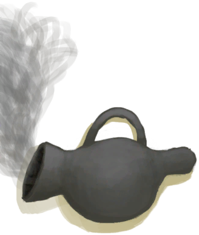

# 细线  
> 我应该用它做点东西，或者多弄点细线，把它纺成线团。  
  
<table class="table table-bordered" data-toggle="table"  data-show-header="false"><thead style="display:none"><tr ><th  style="width:50%;text-align:left;vertical-align:top;"  >title</th><th  style="width:50%;text-align:left;vertical-align:top;"  ></th></tr></thead><tr ><td  style="width:50%;text-align:left;vertical-align:top;"  >**重量：**10  **标签：**	[“细线”](tag_Cord.md)</td><td  style="width:50%;text-align:left;vertical-align:top;"  >

<a href="CordFiber.md" style="color:black">细线</a>

细线是将从<b>椰子皮和蛇草</b>中提取的<b>纤维</b>编织在一起制成的。  将细线纺在一起会产生<b>线团</b>，这些线团可以再次纺在一起制成<b>绳子</b>或在<b>织布机上织布</b>。  细线本身也能用于<b>制作</b>许多东西，比如工具和建筑。 它也是在<b>木筏</b>上进行<b>维修</b>的必要资源。</td></tr></tbody></table>  
  
## 获取来源  

拆解

[睡袋](BedRoll.md)

转化

[睡袋](BedRoll.md)

拆解

[简易床](BedRustic.md)

拆除

[窝棚](Shelter.md)

转化

[窝棚](Shelter.md)

拆除

[有遮蔽的叶床](ShelteredLeafBed.md)

转化

[有遮蔽的叶床](ShelteredLeafBed.md)

拆解

[猪食槽](BoarFeeder.md)

拆解

[猪食槽(空)](BoarFeederEmpty.md)

拆除

[诱捕笼](CageTrap.md)

拆解

[堆肥箱](CompostBin.md)

拆解

[晾晒架](DryingRack.md)

拆除

[捕鱼陷阱(未放置)](FishTrap.md)

拆解

[羊食槽](GoatFeeder.md)

拆解

[羊食槽(空)](GoatFeederEmpty.md)

拆卸织布机

[织布机（空）](LoomEmpty.md)

** 使用**[布片](ClothSmall.md)解编布匹

[织布机（空）](LoomEmpty.md)

** 使用**[布](Cloth.md)解编布匹

[织布机（空）](LoomEmpty.md)

** 使用**[大块的布](ClothLarge.md)解编布匹

[织布机（空）](LoomEmpty.md)

** 使用**[“切割工具”](tag_Cutter.md)切下塑料布

[打开的降落伞](ParachuteDeployed.md)

拆解

[灰山鹑喂食器](PartridgeFeeder.md)

拆解

[灰山鹑喂食器(空)](PartridgeFeederEmpty.md)

拆除

[稻草人](Scarecrow.md)

转化

[稻草人](Scarecrow.md)

拆除陷阱

[套索陷阱](SnareTrap.md)

拆除陷阱

[套索陷阱(未重置)](SnareTrapTriggered.md)

取下细线

[针线(骨针)](BoneNeedleThreaded.md)

拆解

[简易的弓](BowRustic.md)

转化

[简易的弓](BowRustic.md)

拆解

[防蜂服](BeeSuit.md)

转化

[防蜂服](BeeSuit.md)

转化

[椰子凉鞋](CoconutSandals.md)

拆解

[鲜花项链](FlowerNecklace.md)

转化

[鲜花项链](FlowerNecklace.md)

拆解

[草裙](LeafSKirt.md)

转化

[草裙](LeafSKirt.md)

拆解

[皮裤](LeatherPants.md)

转化

[皮裤](LeatherPants.md)

拆解

[皮革鞋子](LeatherShoes.md)

转化

[皮革鞋子](LeatherShoes.md)

拆解

[珍珠项链](PearlNecklace.md)

转化

[珍珠项链](PearlNecklace.md)

拆解

[雨衣](Raincoat.md)

转化

[雨衣](Raincoat.md)

转化

[海鸥护符](SeagullCharm.md)

拆解

[贝壳项链](SeashellNecklace.md)

转化

[贝壳项链](SeashellNecklace.md)

拆解

[鲨鱼头饰](SharkHeadpiece.md)

转化

[衬衫](ShirtFiber.md)

转化

[夹板](Splint.md)

拆解

[蓑衣](StrawCape.md)

转化

[蓑衣](StrawCape.md)

转化

[简易止血带](TourniquetRustic.md)

转化

[风箱](Bellows.md)

取下细线

[针线(铜针)](CopperNeedleThreaded.md)

** 使用**[纤维](Fibers.md)缠起来

[纤维](Fibers.md)

拆解

[挎包](Satchel.md)

拆解

[挎包(猎人专有)](SatchelHunter.md)

拆解

[补给箱](SupplyChestRaft.md)

拆解

[小拉车](Travois.md)

拆解

[铜斧](AxeCopper.md)

转化

[铜斧](AxeCopper.md)

转化

[燧石斧](AxeFlint.md)

拆解

[废金属斧](AxeScrap.md)

转化

[废金属斧](AxeScrap.md)

拆解

[扫帚](Broom.md)

转化

[钓鱼线](FishingLine.md)

转化

[钓鱼线（已添加诱饵）](FishingLineBait.md)

转化

[钓鱼线](FishingLineRustic.md)

转化

[钓鱼线（已添加诱饵）](FishingLineRusticBait.md)

转化

[钓鱼竿](FishingRod.md)

转化

[钓鱼竿（已添加诱饵）](FishingRodBait.md)

拆解

[铜铲](ShovelCopper.md)

转化

[铜铲](ShovelCopper.md)

拆解

[废金属铲](ShovelScrap.md)

转化

[废金属铲](ShovelScrap.md)

转化

[木铲](ShovelWooden.md)

纺细线

[缠好的纺锤](SpindleFiber.md)

取下细线

[针线(木针)](WoodenNeedleThreaded.md)

拆成细线

[线团](YarnFiber.md)

清理

[废墟(泥屋)](Debris.md)

采集

[漂浮的残骸](FloatingDebris.md)

** 使用**[石斧](StoneAxe.md)砍倒

[树液收集处](PalmTreeSapStation.md)(未实装)

** 使用**[“斧”](tag_Axe.md)砍倒

[树液收集处](PalmTreeSapStation.md)(未实装)

** 使用**[石斧](StoneAxe.md)砍倒

[树液补给点(空)](PalmTreeSapStationEmpty.md)(未实装)

** 使用**[“斧”](tag_Axe.md)砍倒

[树液补给点(空)](PalmTreeSapStationEmpty.md)(未实装)

  
  
## 可拖入  

<table style="margin-bottom:0px;"><tr><td style="width:40%;text-align:left; background-color:#FEFEFE"><b>拖入：</b>[

[细线](CordFiber.md)](CordFiber.md)</td><td style="width:40%;font-size:1em;font-weight:bold;background-color:#FEFEFE">制作线团 (15分) [“手部动作(组)”](HandAction.md)</td></tr><tr><td colspan="2"><b>需求：</b>[

[光亮](Light.md)](Light.md): <b>10-100</b></td></tr><tr style="background-color:#FFFFFF"><td style=""><b>使用物：</b>→消失</td><td style=""><b>自身：</b>→ [

[线团](YarnFiber.md)](YarnFiber.md)</td></tr><tr><td colspan="2"><b>状态变化：</b>[

[纺织(技能)](Skill_Tailoring.md)](Skill_Tailoring.md)<b>+0.5</b></td></tr></table>
  
  
## 可拖至  

[捕捞拖网](RaftFishTrap.md)

[稻草人](Scarecrow.md)

[骨针](BoneNeedle.md)

[铜针](CopperNeedle.md)

[细线](CordFiber.md)

[补给箱](SupplyChestRaft.md)

[小树枝](Sticks.md)

[木针](WoodenNeedle.md)

[损坏的帆](SailBroken_Raft.md)

[收起的帆](SailDown_Raft.md)

  
  
## 可用于蓝图  

<a href="Bp_BedRustic.md" style="color:black">简易床</a>

<a href="Bp_BedWooden.md" style="color:black">木床</a>

<a href="Bp_BeeSmoker.md" style="color:black">熏蜂器</a>

<a href="Bp_BoneKnife.md" style="color:black">骨刀</a>

<a href="Bp_Bow.md" style="color:black">弓</a>

<a href="Bp_BowDrill.md" style="color:black">弓钻</a>

<a href="Bp_Broom.md" style="color:black">扫帚</a>

<a href="Bp_CageTrap.md" style="color:black">诱捕笼</a>

<a href="Bp_Candles.md" style="color:black">蜡烛</a>

<a href="Bp_CandlesCitronella.md" style="color:black">香茅蜡烛</a>

<a href="Bp_CandlesJasmine.md" style="color:black">茉莉蜡烛</a>

<a href="Bp_Cellar.md" style="color:black">地窖</a>

<a href="Bp_CeremonialDagger.md" style="color:black">仪式匕首</a>

<a href="Bp_Chest.md" style="color:black">储物箱</a>

<a href="Bp_Cistern.md" style="color:black">水窖</a>

<a href="Bp_CompostBin.md" style="color:black">堆肥箱</a>

<a href="Bp_CopperAxe.md" style="color:black">铜斧</a>

<a href="Bp_CopperShovel.md" style="color:black">铜铲</a>

<a href="Bp_CopperSpear.md" style="color:black">铜长矛</a>

<a href="Bp_Drum.md" style="color:black">鼓</a>

<a href="Bp_DryingRack.md" style="color:black">晾晒架</a>

<a href="Bp_Dynamite.md" style="color:black">炸药</a>

<a href="Bp_Enclosure.md" style="color:black">畜栏</a>

<a href="Bp_FishBait.md" style="color:black">鱼饵</a>

<a href="Bp_FishTrap.md" style="color:black">捕鱼陷阱</a>

<a href="Bp_FishingLine.md" style="color:black">钓鱼线</a>

<a href="Bp_FishingRod.md" style="color:black">钓鱼竿</a>

<a href="Bp_FishingSpear.md" style="color:black">鱼叉</a>

<a href="Bp_FlintAxe.md" style="color:black">燧石斧</a>

<a href="Bp_FlintKnife.md" style="color:black">燧石刀</a>

<a href="Bp_FlintSpear.md" style="color:black">燧石长矛</a>

<a href="Bp_GoatFeeder.md" style="color:black">羊食槽</a>

<a href="Bp_Harpoon.md" style="color:black">鱼镖</a>

<a href="Bp_LizardDrum.md" style="color:black">蜥蜴皮手鼓</a>

<a href="Bp_Loom.md" style="color:black">织布机</a>

<a href="Bp_MudHut.md" style="color:black">泥屋</a>

<a href="Bp_ObsidianKnife.md" style="color:black">黑曜石刀</a>

<a href="Bp_ObsidianSpear.md" style="color:black">黑曜石长矛</a>

<a href="Bp_PartridgeFeeder.md" style="color:black">灰山鹑喂食器</a>

<a href="Bp_Raft.md" style="color:black">木筏</a>

<a href="Bp_RaftFishTrap.md" style="color:black">捕捞拖网</a>

<a href="Bp_RaftShelter.md" style="color:black">木筏庇护所</a>

<a href="Bp_Scarecrow.md" style="color:black">稻草人</a>

<a href="Bp_ScrapAxe.md" style="color:black">废金属斧</a>

<a href="Bp_ScrapKnife.md" style="color:black">废金属刀</a>

<a href="Bp_ScrapShovel.md" style="color:black">废金属铲</a>

<a href="Bp_ScrapSpear.md" style="color:black">废金属长矛</a>

<a href="Bp_Shed.md" style="color:black">棚屋</a>

<a href="Bp_Shelter.md" style="color:black">窝棚</a>

<a href="Bp_Sling.md" style="color:black">投石索</a>

<a href="Bp_SnareTrap.md" style="color:black">套索陷阱</a>

<a href="Bp_Splint.md" style="color:black">夹板</a>

<a href="Bp_SupplyChest.md" style="color:black">补给箱</a>

<a href="Bp_TourniquetRustic.md" style="color:black">简易止血带</a>

<a href="Bp_Travois.md" style="color:black">小拉车</a>

<a href="Bp_Well.md" style="color:black">水井</a>

<a href="Bp_WoodenShovel.md" style="color:black">木铲</a>

<a href="Bp_Bedroll.md" style="color:black">睡袋</a>

<a href="Bp_BeeSuit.md" style="color:black">防蜂服</a>

<a href="Bp_Bellows.md" style="color:black">风箱</a>

<a href="Bp_CoconutSandals.md" style="color:black">椰子凉鞋</a>

<a href="Bp_CopperBottle.md" style="color:black">铜瓶</a>

<a href="Bp_CopperJar.md" style="color:black">铜罐</a>

<a href="Bp_FlowerNecklace.md" style="color:black">鲜花项链</a>

<a href="Bp_GasMask.md" style="color:black">防毒面具</a>

<a href="Bp_LeafSkirt.md" style="color:black">草裙</a>

<a href="Bp_LeatherBackpack.md" style="color:black">皮革背包</a>

<a href="Bp_LeatherGloves.md" style="color:black">皮革手套</a>

<a href="Bp_LeatherPants.md" style="color:black">皮裤</a>

<a href="Bp_LeatherShoes.md" style="color:black">皮革鞋子</a>

<a href="Bp_PearlNecklace.md" style="color:black">珍珠项链</a>

<a href="Bp_Quiver.md" style="color:black">箭筒</a>

<a href="Bp_Raincoat.md" style="color:black">雨衣</a>

<a href="Bp_Sack.md" style="color:black">布袋</a>

<a href="Bp_Satchel.md" style="color:black">挎包</a>

<a href="Bp_SeagullCharm.md" style="color:black">海鸥护符</a>

<a href="Bp_SeashellNecklace.md" style="color:black">贝壳项链</a>

<a href="Bp_SharkHeadpiece.md" style="color:black">鲨鱼头饰</a>

<a href="Bp_Shirt.md" style="color:black">衬衫</a>

<a href="Bp_StrawCape.md" style="color:black">蓑衣</a>

<a href="Bp_Waterskin.md" style="color:black">水袋</a>

  
  
  

