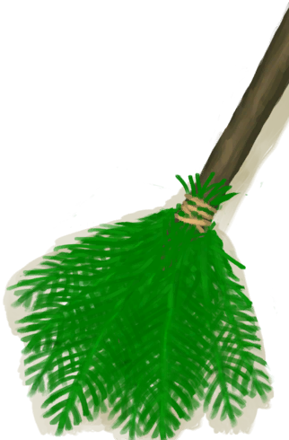

# 潮湿洞穴  
> 一个非常潮湿的洞穴，有一个壮观的地下水潭。  
  

<a href="DampChamber.md" style="color:black">潮湿洞穴</a>

<a href="NarrowTunnel.md" style="color:black">狭窄隧道</a>

<a href="DarkCave.md" style="color:black">幽暗洞穴</a>

  
  
<table class="table table-bordered" data-toggle="table"  data-show-header="false"><thead style="display:none"><tr ><th  style="width:50%;text-align:left;vertical-align:top;"  >title</th><th  style="width:50%;text-align:left;vertical-align:top;"  data-sortable="true"  ></th></tr></thead><tr ><td  style="width:50%;text-align:left;vertical-align:top;"  >** 区域唯一 **  **环境：**[潮湿洞穴(环境)](Env_DampChamber.md)  **标签：**	[“室内”](tag_EnvIndoors.md), [“洞穴系统”](tag_EnvCaveSystem.md)  ** 效果: ** [

[舒适度](Comfort.md)](Comfort.md)<b>-500</b>  ** 环境效果: ** [

[降水值](RainValue.md)](RainValue.md)<b>-5</b> [

[蚊虫数量](BugPopulation.md)](BugPopulation.md)<b>+3</b> [

[绝热](InsulationHeat.md)](InsulationHeat.md)<b>+6</b> [

[体感温度](TemperaturePerceived.md)](TemperaturePerceived.md)<b>-8</b> [

[阳光防护](SunProtection.md)](SunProtection.md)<b>+6</b> [

[遮蔽](Sheltered.md)](Sheltered.md)<b>+1</b> [夜晚](IsNight.md)<b>+1</b> [

[内陆恐惧症](LandSickness.md)](LandSickness.md)加成<b>-8</b>  ** 容量： **30000  ** 可改造项目: ** [皮地毯](Imp_StitchedHideFloor.md) , [白墙](Imp_WhiteWashedWalls.md) , [海之荣耀](Imp_SeaTrophy.md) , [家园标志](Imp_HomeSign.md)</td><td  style="width:50%;text-align:left;vertical-align:top;"  ></td></tr></tbody></table>  
  
## 探索  
<table class="table table-bordered" data-toggle="table"  ><thead style=""><tr ><th  style="text-align:left;vertical-align:top;"  >进度</th><th  style="text-align:left;vertical-align:top;"  >目的地</th></tr></thead><tr ><td  style="text-align:left;vertical-align:top;"  >50%</td><td  style="text-align:left;vertical-align:top;"  >[干涸的洞穴水潭(潮湿洞穴)](CavePond.md)</td></tr><tr ><td  style="text-align:left;vertical-align:top;"  >100%</td><td  style="text-align:left;vertical-align:top;"  >[狭窄通道(潮湿洞穴)](DarkCaveCaveEntranceClosed.md)</td></tr></tbody></table>  
  
## 动作  

<table><tr><td rowspan="2" style="width:200px;text-align:center;font-size:1.3em;font-weight:bold">

探索

15分

</td><td></td></tr><tr><td></td></tr><tr><td colspan="2"><b>需求：</b>[

[光亮](Light.md)](Light.md): <b>5-100</b></td></tr><tr><td colspan="2"><b>状态变化：</b>[

[污垢](Filth.md)](Filth.md)<b>+2</b></td></tr><tr><td colspan="2">

<table style="margin-bottom:3px;"><tr><td rowspan=2 style="text-align:center" width="80px">
基础权重

10
</td><td style="font-size:0.6em;line-height:0.6em;font-weight:bold">Stone❗限4次</td></tr><tr><td>[

[石头](Stone.md)](Stone.md)(<b>+1</b>)</td></tr></table>

<table style="margin-bottom:3px;"><tr><td rowspan=2 style="text-align:center" width="80px">
基础权重

4
</td><td style="font-size:0.6em;line-height:0.6em;font-weight:bold">Bugs</td></tr><tr><td>[

[虫子](Bugs.md)](Bugs.md)(<b>+3</b>)</td></tr></table>

<table style="margin-bottom:3px;"><tr><td rowspan=2 style="text-align:center" width="80px">
基础权重

5
</td><td style="font-size:0.6em;line-height:0.6em;font-weight:bold">Geode❗限3次</td></tr><tr><td>[

[晶洞](Geode.md)](Geode.md)(<b>+1</b>)</td></tr></table>

</td></tr></table>
  
  
  
## 可拖入  

<table style="margin-bottom:0px;"><tr><td style="width:40%;text-align:left; background-color:#FEFEFE"><b>拖入：</b>[

[扫帚](Broom.md)](Broom.md)</td><td style="width:40%;font-size:1em;font-weight:bold;background-color:#FEFEFE">打扫 (30分) [“手部动作(组)”](HandAction.md)</td></tr><tr style="background-color:#FFFFFF"><td style=""><b>使用物：</b>使用次数  <b>-1(-2.5%)</b></td><td style=""><b>自身：</b>污秽

  <b>-250(-25%)</b></td></tr><tr><td colspan="2"><b>状态变化：</b>[

[压力](Stress.md)](Stress.md)<b>-10</b>, [

[情绪](Morale.md)](Morale.md)<b>+5</b></td></tr><tr><td colspan="2"><b>需求：</b>[

[光亮](Light.md)](Light.md): <b>5-100</b></td></tr></table>
  
  
## 属性   

<table style="margin-bottom:0px;"><tr><td style="width:30%;text-align:left; background-color:#FEFEFE;font-size:1.3em;font-weight:bold;">

污秽</td><td style="font-size:1em;background-color:#FEFEFE">初始：1000 , 最大：1000 每15分钟+3 , 最多需要：3天11小时20分</td></tr><tr style="background-color:#FFFFFF"><td colspan=2></td></tr></table>
  

<table style="margin-bottom:0px;"><tr><td style="width:30%;text-align:left; background-color:#FEFEFE;font-size:1.3em;font-weight:bold;">蘑菇</td><td style="font-size:1em;background-color:#FEFEFE">初始：0 , 最大：672 每15分钟+1 , 最多需要：7天</td></tr><tr style="background-color:#FFFFFF"><td colspan=2>** 到达上限时： ** 自身: 蘑菇  <b>-672(-100%)</b> [

[杂菌](AssortedMushroomsPlant.md)](AssortedMushroomsPlant.md)(<b>+1～+2</b>)</td></tr></table>
  
## 被动效果  
<table class="table table-bordered" data-toggle="table"  ><thead style=""><tr ><th  style="text-align:left;vertical-align:top;"  >名称</th><th  style="text-align:left;vertical-align:top;"  >条件</th><th  style="text-align:left;vertical-align:top;"  data-sortable="true"  >变化(每15分钟)</th><th  style="text-align:left;vertical-align:top;"  >玩家状态</th></tr></thead><tr ><td  style="text-align:left;vertical-align:top;"  >Minimal Filth</td><td  style="text-align:left;vertical-align:top;"  >** 需要属性：** 污秽

: <b>100～250(10%～25%)</b></td><td  style="text-align:left;vertical-align:top;"  ></td><td  style="text-align:left;vertical-align:top;"  >[

[不适](Discomfort.md)](Discomfort.md)<b>+175</b></td></tr><tr ><td  style="text-align:left;vertical-align:top;"  >Low Filth</td><td  style="text-align:left;vertical-align:top;"  >** 需要属性：** 污秽

: <b>251～500(25.1%～50%)</b></td><td  style="text-align:left;vertical-align:top;"  ></td><td  style="text-align:left;vertical-align:top;"  >[

[不适](Discomfort.md)](Discomfort.md)<b>+375</b></td></tr><tr ><td  style="text-align:left;vertical-align:top;"  >Moderate Filth</td><td  style="text-align:left;vertical-align:top;"  >** 需要属性：** 污秽

: <b>501～750(50.1%～75%)</b></td><td  style="text-align:left;vertical-align:top;"  ></td><td  style="text-align:left;vertical-align:top;"  >[

[不适](Discomfort.md)](Discomfort.md)<b>+625</b></td></tr><tr ><td  style="text-align:left;vertical-align:top;"  >Extreme Filth</td><td  style="text-align:left;vertical-align:top;"  >** 需要属性：** 污秽

: <b>751～1000(75.1%～100%)</b></td><td  style="text-align:left;vertical-align:top;"  ></td><td  style="text-align:left;vertical-align:top;"  >[

[不适](Discomfort.md)](Discomfort.md)<b>+875</b></td></tr></tbody></table>  
  

