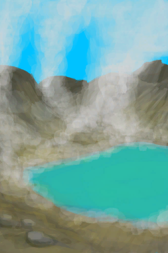

# 火山  
> 这里的空气有毒，我应该谨慎行事。  
  
<table class="table table-bordered" data-toggle="table"  data-show-header="false"><thead style="display:none"><tr ><th  style="width:50%;text-align:left;vertical-align:top;"  >title</th><th  style="width:50%;text-align:left;vertical-align:top;"  ></th></tr></thead><tr ><td  style="width:50%;text-align:left;vertical-align:top;"  >** 炎热区域 **  **标签：**	[“干燥环境”](tag_EnvDry.md), [“高地”](tag_Highland.md), [“有毒环境”](tag_EnvToxic.md), [“贫瘠环境”](tag_EnvInfertile.md), [“开阔环境”](tag_EnvOpen.md)  **初始：**	[酸湖(火山)](AcidLake.md), [干涸酸湖(火山)](AcidLakePuddle.md)  ** 效果: ** [

[体感温度](TemperaturePerceived.md)](TemperaturePerceived.md)<b>+10</b> [

[淋雨](RainExposure.md)](RainExposure.md) [

[绝热](InsulationHeat.md)](InsulationHeat.md) [

[空气毒性](AirToxicity.md)](AirToxicity.md)<b>+6</b></td><td  style="width:50%;text-align:left;vertical-align:top;"  >

<a href="Env_AcidLake.md" style="color:black">火山</a>

</td></tr></tbody></table>  
  
## 获取来源  

前往

[前往酸湖(火山)](Path_VolcanoToAcidLake.md)

  
  

