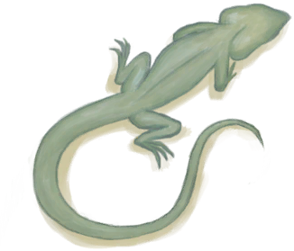

# 礼物！  
> 你的朋友好像给你带了一件礼物！  
  
<table class="table table-bordered" data-toggle="table"  data-show-header="false"><thead style="display:none"><tr ><th  style="width:50%;text-align:left;vertical-align:top;"  data-sortable="true"  >title</th><th  style="width:50%;text-align:left;vertical-align:top;"  ></th></tr></thead><tr ><td  style="width:50%;text-align:left;vertical-align:top;"  ></td><td  style="width:50%;text-align:left;vertical-align:top;"  >

<a href="Event_DogFriendGift.md" style="color:black">礼物！</a>

</td></tr></tbody></table>  
  
## 获取来源  

转化

[忠犬朋友](DogFriend.md)

  
  
## 动作  

<table><tr><td rowspan="2" style="width:200px;text-align:center;font-size:1.3em;font-weight:bold">

看看礼物

</td><td></td></tr><tr><td><b>自身：</b>→消失</td></tr><tr><td colspan="2"><b>状态变化：</b>[

[情绪](Morale.md)](Morale.md)<b>+10</b></td></tr><tr><td colspan="2">

<table style="margin-bottom:3px;"><tr><td rowspan=2 style="text-align:center" width="80px">
基础权重

2
</td><td style="font-size:0.6em;line-height:0.6em;font-weight:bold">Partridge Dead</td></tr><tr><td>[

[灰山鹑尸体](PartridgeDead.md)](PartridgeDead.md)(<b>+1</b>)[灰山鹑种群数量](Pop_Partridge.md)<b>-1000</b></td></tr><tr><td colspan=2><li>[灰山鹑种群数量](Pop_Partridge.md)为<b>0</b>时权重<b>-100</b></li></td></tr></table>

<table style="margin-bottom:3px;"><tr><td rowspan=2 style="text-align:center" width="80px">
基础权重

1
</td><td style="font-size:0.6em;line-height:0.6em;font-weight:bold">Partridge Male</td></tr><tr><td>[

[雄灰山鹑](PartridgeMaleLive.md)](PartridgeMaleLive.md)(<b>+1</b>)[灰山鹑种群数量](Pop_Partridge.md)<b>-1000</b></td></tr><tr><td colspan=2><li>[灰山鹑种群数量](Pop_Partridge.md)为<b>0</b>时权重<b>-100</b></li></td></tr></table>

<table style="margin-bottom:3px;"><tr><td rowspan=2 style="text-align:center" width="80px">
基础权重

2
</td><td style="font-size:0.6em;line-height:0.6em;font-weight:bold">Partridge Female</td></tr><tr><td>[

[雌灰山鹑](PartridgeFemaleLive.md)](PartridgeFemaleLive.md)(<b>+1</b>)[灰山鹑种群数量](Pop_Partridge.md)<b>-1000</b></td></tr><tr><td colspan=2><li>[灰山鹑种群数量](Pop_Partridge.md)为<b>0</b>时权重<b>-100</b></li></td></tr></table>

<table style="margin-bottom:3px;"><tr><td rowspan=2 style="text-align:center" width="80px">
基础权重

2
</td><td style="font-size:0.6em;line-height:0.6em;font-weight:bold">Seagull Dead</td></tr><tr><td>[

[海鸥尸体](SeagullDead.md)](SeagullDead.md)(<b>+1</b>)[海鸥种群数量](Pop_Seagull.md)<b>-1000</b></td></tr></table>

<table style="margin-bottom:3px;"><tr><td rowspan=2 style="text-align:center" width="80px">
基础权重

15
</td><td style="font-size:0.6em;line-height:0.6em;font-weight:bold">Mouse</td></tr><tr><td>[

[老鼠尸体](Mouse.md)](Mouse.md)(<b>+1</b>)[老鼠种群数量](Pop_Mouse.md)<b>-1000</b></td></tr></table>

<table style="margin-bottom:3px;"><tr><td rowspan=2 style="text-align:center" width="80px">
基础权重

15
</td><td style="font-size:0.6em;line-height:0.6em;font-weight:bold">Lizard</td></tr><tr><td>[

[蜥蜴](Lizard.md)](Lizard.md)(<b>+1</b>)[蜥蜴种群数量](Pop_Lizard.md)<b>-1000</b></td></tr></table>
<button class="btn btn-secondary btn-sm" style="" data-toggle="modal" onclick="setCollectionDataBase64('eyJ0aXRsZSI6IuamgueOh+aooeaLnzog55yL55yL56S854mpICjnpLznianvvIEpIiwiY29sbGVjdGlvbnMiOlt7ImRyb3AiOiI8ZGl2IHN0eWxlPVwid2lkdGg6MjVweDtkaXNwbGF5OmlubGluZS1ibG9jazt0ZXh0LWFsaWduOmNlbnRlclwiPjxpbWcgZGVjb2Rpbmc9XCJhc3luY1wiIHNyYz1cIi4uL3dpa2kvU3ByaXRlL1BhcnRyaWRnZURlYWQucG5nXCIgaHJlZj1cImEubWRcIiBzdHlsZT1cIm1heC13aWR0aDoyNXB4O21heC1oZWlnaHQ6MjVweDtcIj48L2Rpdj7ngbDlsbHpuZHlsLjkvZMiLCJiYXNlIjoyLCJjb25kaXRpb24iOlt7ImtleSI6IlBvcF9QYXJ0cmlkZ2UiLCJ0aXRsZSI6IueBsOWxsem5keenjee+pOaVsOmHjyIsInR5cGUiOiJyYW5nZSIsIm1heCI6WzAsNDAwMDBdLCJyYW5nZSI6WzAsMF0sIndlaWdodCI6Wy0xMDAsLTEwMF0sImRlZmF1bHRWYWx1ZSI6NDAwMDAsIndoZW5PdXRPZlJhbmdlIjowfV19LHsiZHJvcCI6IjxkaXYgc3R5bGU9XCJ3aWR0aDoyNXB4O2Rpc3BsYXk6aW5saW5lLWJsb2NrO3RleHQtYWxpZ246Y2VudGVyXCI+PGltZyBkZWNvZGluZz1cImFzeW5jXCIgc3JjPVwiLi4vd2lraS9TcHJpdGUvUGFydHJpZGdlSGFuZ2luZ01hbGUucG5nXCIgaHJlZj1cImEubWRcIiBzdHlsZT1cIm1heC13aWR0aDoyNXB4O21heC1oZWlnaHQ6MjVweDtcIj48L2Rpdj7pm4TngbDlsbHpuZEiLCJiYXNlIjoxLCJjb25kaXRpb24iOlt7ImtleSI6IlBvcF9QYXJ0cmlkZ2UiLCJ0aXRsZSI6IueBsOWxsem5keenjee+pOaVsOmHjyIsInR5cGUiOiJyYW5nZSIsIm1heCI6WzAsNDAwMDBdLCJyYW5nZSI6WzAsMF0sIndlaWdodCI6Wy0xMDAsLTEwMF0sImRlZmF1bHRWYWx1ZSI6NDAwMDAsIndoZW5PdXRPZlJhbmdlIjowfV19LHsiZHJvcCI6IjxkaXYgc3R5bGU9XCJ3aWR0aDoyNXB4O2Rpc3BsYXk6aW5saW5lLWJsb2NrO3RleHQtYWxpZ246Y2VudGVyXCI+PGltZyBkZWNvZGluZz1cImFzeW5jXCIgc3JjPVwiLi4vd2lraS9TcHJpdGUvUGFydHJpZGdlSGFuZ2luZy5wbmdcIiBocmVmPVwiYS5tZFwiIHN0eWxlPVwibWF4LXdpZHRoOjI1cHg7bWF4LWhlaWdodDoyNXB4O1wiPjwvZGl2PumbjOeBsOWxsem5kSIsImJhc2UiOjIsImNvbmRpdGlvbiI6W3sia2V5IjoiUG9wX1BhcnRyaWRnZSIsInRpdGxlIjoi54Gw5bGx6bmR56eN576k5pWw6YePIiwidHlwZSI6InJhbmdlIiwibWF4IjpbMCw0MDAwMF0sInJhbmdlIjpbMCwwXSwid2VpZ2h0IjpbLTEwMCwtMTAwXSwiZGVmYXVsdFZhbHVlIjo0MDAwMCwid2hlbk91dE9mUmFuZ2UiOjB9XX0seyJkcm9wIjoiPGRpdiBzdHlsZT1cIndpZHRoOjI1cHg7ZGlzcGxheTppbmxpbmUtYmxvY2s7dGV4dC1hbGlnbjpjZW50ZXJcIj48aW1nIGRlY29kaW5nPVwiYXN5bmNcIiBzcmM9XCIuLi93aWtpL1Nwcml0ZS9TZWFndWxsRGVhZC5wbmdcIiBocmVmPVwiYS5tZFwiIHN0eWxlPVwibWF4LXdpZHRoOjI1cHg7bWF4LWhlaWdodDoyNXB4O1wiPjwvZGl2Pua1t+m4peWwuOS9kyIsImJhc2UiOjIsImNvbmRpdGlvbiI6W119LHsiZHJvcCI6IjxkaXYgc3R5bGU9XCJ3aWR0aDoyNXB4O2Rpc3BsYXk6aW5saW5lLWJsb2NrO3RleHQtYWxpZ246Y2VudGVyXCI+PGltZyBkZWNvZGluZz1cImFzeW5jXCIgc3JjPVwiLi4vd2lraS9TcHJpdGUvTW91c2UucG5nXCIgaHJlZj1cImEubWRcIiBzdHlsZT1cIm1heC13aWR0aDoyNXB4O21heC1oZWlnaHQ6MjVweDtcIj48L2Rpdj7ogIHpvKDlsLjkvZMiLCJiYXNlIjoxNSwiY29uZGl0aW9uIjpbXX0seyJkcm9wIjoiPGRpdiBzdHlsZT1cIndpZHRoOjI1cHg7ZGlzcGxheTppbmxpbmUtYmxvY2s7dGV4dC1hbGlnbjpjZW50ZXJcIj48aW1nIGRlY29kaW5nPVwiYXN5bmNcIiBzcmM9XCIuLi93aWtpL1Nwcml0ZS9MaXphcmQucG5nXCIgaHJlZj1cImEubWRcIiBzdHlsZT1cIm1heC13aWR0aDoyNXB4O21heC1oZWlnaHQ6MjVweDtcIj48L2Rpdj7onKXonLQiLCJiYXNlIjoxNSwiY29uZGl0aW9uIjpbXX1dfQ==')" data-target="#modelCollectionSimulator">概率模拟</button>
</td></tr></table>
  
  
  

