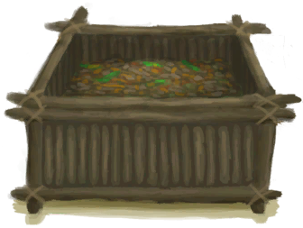

## 农夫  

<table style="margin-bottom:0px;"><tr><td rowspan=2 style="width:160px"></td><td style="font-size:1.8em"><b>农夫</b></td><td style="width:50%">解锁价格：1☀️</td></tr><tr><td  colspan=2 style=""><i>无处可去的你被带到了这座岛上，住在你祖父的农场里。

然而一周还没过完，一场可怕的飓风就席卷了小岛，摧毁了大部分庄稼和畜栏。农场现在成了一片废墟。你的祖父则病倒了，生活无法自理。

你能够重建农场并让你的祖父恢复健康吗？</i></td><tr><td colspan=2><b>初始环境：</b>[

[泥屋(损坏)](MudHutRuins.md)](MudHutRuins.md)<td colspan=1><b>初始天气：</b>[

[风暴](TropicalIsland_StormStart.md)](TropicalIsland_StormStart.md)</tr></tr><tr><td colspan=3><b>初始特性：</b>

[皮肤黝黑](Pk_3_DarkSkin.md)

[乐观主义](Pk_4_Optimist.md)

[独来独往](Pk_4_Loner.md)

[药草学者](Pk_5_Herbologist.md)

[陷阱能手](Pk_5_Trapper.md)

[厨师](Pk_5_Cook.md)

[木匠](Pk_5_Woodworker.md)

[潜行大师](Pk_5_StealthMaster.md)

[天生免疫](Pk_4_Immunized.md)

[强免疫系统](Pk_4_ImmuneSystemStrong.md)

[抗虫体质](Pk_4_BugResistant.md)

[席地而睡](Pk_4_RoughSleeper.md)

[祖父](Pk_6_Grandfather.md)

  
  
</tr><tr><td colspan=3><b>初始衣物：</b> 

<a href="T-Shirt.md" style="color:black">T恤</a>

<a href="Shorts.md" style="color:black">短裤</a>

<a href="Flipflops.md" style="color:black">人字拖</a>

  
  
</tr><tr><td colspan=3><b>初始卡牌：</b> 

<a href="Grandfather.md" style="color:black">祖父</a>

<a href="ChestFarmer.md" style="color:black">储物箱</a>

<a href="Event_IntroFarmer.md" style="color:black">介绍</a>

<a href="ClayBowl.md" style="color:black">陶碗x3</a>

<a href="ClayVase.md" style="color:black">陶罐</a>

<a href="HandDrill.md" style="color:black">手钻</a>

<a href="KnifeGrandpaBlunt.md" style="color:black">祖父的钝刀</a>

<a href="T-Shirt.md" style="color:black">T恤</a>

<a href="PlasticBottle.md" style="color:black">塑料瓶</a>

<a href="Broom.md" style="color:black">扫帚</a>

  
  
</tr><tr><td colspan=3><b>初始蓝图：</b> 

<a href="Bp_AloeGel.md" style="color:black">芦荟膏</a>

<a href="Bp_BugRepellent.md" style="color:black">驱虫膏</a>

<a href="Bp_CropPlot.md" style="color:black">农田</a>

<a href="Bp_PesticideChilli.md" style="color:black">辣椒农药</a>

<a href="Bp_CompostBin.md" style="color:black">堆肥箱</a>

<a href="Bp_DeadfallTrap.md" style="color:black">落石陷阱</a>

<a href="Bp_SnareTrap.md" style="color:black">套索陷阱</a>

<a href="Bp_FishTrap.md" style="color:black">捕鱼陷阱</a>

<a href="Bp_LogTrap.md" style="color:black">原木陷阱</a>

<a href="Bp_CageTrap.md" style="color:black">诱捕笼</a>

<a href="Bp_TrappingPit.md" style="color:black">陷坑</a>

<a href="Bp_CookingPot.md" style="color:black">烹饪锅</a>

<a href="Bp_WoodShavings.md" style="color:black">木屑</a>

<a href="Bp_WoodCarvings.md" style="color:black">木雕</a>

<a href="Bp_Planks.md" style="color:black">木板</a>

<a href="Bp_Treenails.md" style="color:black">木钉</a>

  
  
</tr></table>
    
  
## 目标  

<b>生存基础</b>

<table style="margin-bottom:0px;"><tr><td rowSpan=3 style="width:50px;max-height:100px;text-align:center;vertical-align:top"></td><td colspan=2 >
<b>打磨祖父的钝刀</b>
<i>用作切割工具。</i></td></tr><tr style=""><td><b>达成条件：</b>[

[祖父的刀](KnifeGrandpa.md)](KnifeGrandpa.md)x1 </td></tr><tr style=""><td ><b>达成奖励：</b>[

[压力](Stress.md)](Stress.md)<b>-48</b></td></tr><tr style="border-bottom:2px solid #CCC;height:1px;"></tr><tr><td rowSpan=3 style="width:50px;max-height:100px;text-align:center;vertical-align:top"></td><td colspan=2 >
<b>搭建一个营火</b>
<i>用来烹饪食物并提供夜间照明。</i></td></tr><tr style=""><td><b>达成条件：</b>[

[营火(熄灭)](CampfireExtinguished.md)](CampfireExtinguished.md)x1 </td></tr><tr style=""><td ><b>达成奖励：</b>[

[决心](Determination.md)](Determination.md)<b>+100</b>&nbsp;&nbsp;&nbsp;&nbsp;[

[压力](Stress.md)](Stress.md)<b>-48</b></td></tr><tr style="border-bottom:2px solid #CCC;height:1px;"></tr><tr><td rowSpan=3 style="width:50px;max-height:100px;text-align:center;vertical-align:top"></td><td colspan=2 >
<b>煮一些米饭</b>
<i>填饱肚子。</i></td></tr><tr style=""><td><b>达成条件：</b>[

[米饭](RiceCooked.md)](RiceCooked.md)x1 </td></tr><tr style=""><td ><b>达成奖励：</b>[

[压力](Stress.md)](Stress.md)<b>-48</b></td></tr><tr style="border-bottom:2px solid #CCC;height:1px;"></tr></table>
 
<b>静待痊愈</b>

<table style="margin-bottom:0px;"><tr><td rowSpan=3 style="width:50px;max-height:100px;text-align:center;vertical-align:top"></td><td colspan=2 >
<b>给祖父喂饭</b>
<i>助他恢复健康。</i></td></tr><tr style=""><td><b>达成条件：</b>Feed [

[祖父](Grandfather.md)](Grandfather.md) </td></tr><tr style=""><td ><b>达成奖励：</b>[

[压力](Stress.md)](Stress.md)<b>-48</b></td></tr><tr style="border-bottom:2px solid #CCC;height:1px;"></tr><tr><td rowSpan=3 style="width:50px;max-height:100px;text-align:center;vertical-align:top"></td><td colspan=2 >
<b>制作一张叶床</b>
<i>晚上休息得更好。</i></td></tr><tr style=""><td><b>达成条件：</b>[

[叶床](LeafBed.md)](LeafBed.md)x1 </td></tr><tr style=""><td ><b>达成奖励：</b>[

[压力](Stress.md)](Stress.md)<b>-48</b></td></tr><tr style="border-bottom:2px solid #CCC;height:1px;"></tr><tr><td rowSpan=3 style="width:50px;max-height:100px;text-align:center;vertical-align:top"></td><td colspan=2 >
<b>探索丛林深处</b>
<i>记住这个地区的布局。</i></td></tr><tr style=""><td><b>达成条件：</b>[探索从林深处](Exploration_DeepJungle.md): <b>20</b> </td></tr><tr style=""><td ><b>达成奖励：</b>[

[压力](Stress.md)](Stress.md)<b>-48</b></td></tr><tr style="border-bottom:2px solid #CCC;height:1px;"></tr></table>
 
<b><i>修理房子</i></b>

<table style="margin-bottom:0px;"><tr><td rowSpan=3 style="width:50px;max-height:100px;text-align:center;vertical-align:top"></td><td colspan=2 >
<b>打扫你的房子</b>
<i>用扫帚来打扫卫生。</i></td></tr><tr style=""><td><b>达成条件：</b>Clean [

[泥屋(损坏)](MudHutRuins.md)](MudHutRuins.md) </td></tr><tr style=""><td ><b>达成奖励：</b>[

[压力](Stress.md)](Stress.md)<b>-48</b></td></tr><tr style="border-bottom:2px solid #CCC;height:1px;"></tr><tr><td rowSpan=3 style="width:50px;max-height:100px;text-align:center;vertical-align:top"></td><td colspan=2 >
<b>清理所有废墟</b>
<i>从中获取资源并腾出空间。</i></td></tr><tr style=""><td><b>达成条件：</b>清理 [

[废墟(泥屋)](Debris.md)](Debris.md) </td></tr><tr style=""><td ><b>达成奖励：</b>[

[压力](Stress.md)](Stress.md)<b>-48</b></td></tr><tr style="border-bottom:2px solid #CCC;height:1px;"></tr><tr><td rowSpan=3 style="width:50px;max-height:100px;text-align:center;vertical-align:top"></td><td colspan=2 >
<b>修理屋顶</b>
<i>让一切恢复正常。</i></td></tr><tr style=""><td><b>达成条件：</b>Build [

[坍塌的屋顶(泥屋)](Dmg_RoofCollapsed.md)](Dmg_RoofCollapsed.md)[

[泥屋(损坏)(环境)](Env_MudHutRuins.md)](Env_MudHutRuins.md)x1 </td></tr><tr style=""><td ><b>达成奖励：</b>[

[压力](Stress.md)](Stress.md)<b>-48</b></td></tr><tr style="border-bottom:2px solid #CCC;height:1px;"></tr></table>
 
<b>翻新农场</b>

<table style="margin-bottom:0px;"><tr><td rowSpan=3 style="width:50px;max-height:100px;text-align:center;vertical-align:top"></td><td colspan=2 >
<b>在湿地中找到一个水塘</b>
<i>用作应急水源。</i></td></tr><tr style=""><td><b>达成条件：</b>[

[干涸的小水塘(湿地)](Puddle.md)](Puddle.md)x1 </td></tr><tr style=""><td ><b>达成奖励：</b>[

[决心](Determination.md)](Determination.md)<b>+250</b>&nbsp;&nbsp;&nbsp;&nbsp;[

[压力](Stress.md)](Stress.md)<b>-48</b></td></tr><tr style="border-bottom:2px solid #CCC;height:1px;"></tr><tr><td rowSpan=3 style="width:50px;max-height:100px;text-align:center;vertical-align:top"></td><td colspan=2 >
<b>建造一个火炉。</b>
<i>以更好地发挥你的厨艺。</i></td></tr><tr style=""><td><b>达成条件：</b>[

[火炉](Stove.md)](Stove.md)x1&nbsp;&nbsp;&nbsp;&nbsp;[

[火炉(熄灭)](StoveExtinguished.md)](StoveExtinguished.md)x1 </td></tr><tr style=""><td ><b>达成奖励：</b>[

[压力](Stress.md)](Stress.md)<b>-48</b></td></tr><tr style="border-bottom:2px solid #CCC;height:1px;"></tr><tr><td rowSpan=3 style="width:50px;max-height:100px;text-align:center;vertical-align:top"></td><td colspan=2 >
<b>建造一个堆肥箱</b>
<i>来为你的庄稼准备足够的肥料。</i></td></tr><tr style=""><td><b>达成条件：</b>[

[堆肥箱](CompostBin.md)](CompostBin.md)x1 </td></tr><tr style=""><td ><b>达成奖励：</b>[

[压力](Stress.md)](Stress.md)<b>-48</b></td></tr><tr style="border-bottom:2px solid #CCC;height:1px;"></tr></table>
 
<b>重建农场</b>

<table style="margin-bottom:0px;"><tr><td rowSpan=3 style="width:50px;max-height:100px;text-align:center;vertical-align:top"></td><td colspan=2 >
<b>重塑农场往日繁荣。</b>
<i>然后你就可以准备面对你的命运了。</i></td></tr><tr style=""></tr><tr style=""><td ><b>达成奖励：</b>[

[压力](Stress.md)](Stress.md)<b>-48</b></td></tr><tr style="border-bottom:2px solid #CCC;height:1px;"></tr><tr><td rowSpan=3 style="width:50px;max-height:100px;text-align:center;vertical-align:top"></td><td colspan=2 >
<b>作物</b>
</td></tr><tr style=""><td>
<table style="margin-bottom:0px;"><tr><td rowSpan=3 style="width:50px;max-height:100px;text-align:center;vertical-align:top"></td><td colspan=2 >
<b>制作农药</b>
<i>以保护你的作物。</i></td></tr><tr style=""><td><b>达成条件：</b>[

[辣椒农药](LQ_PesticideChilli.md)](LQ_PesticideChilli.md)x1&nbsp;&nbsp;&nbsp;&nbsp;[

[硫磺农药](LQ_PesticideBrimstone.md)](LQ_PesticideBrimstone.md)x1 </td></tr><tr style=""><td ><b>达成奖励：</b>[

[压力](Stress.md)](Stress.md)<b>-48</b></td></tr><tr style="border-bottom:2px solid #CCC;height:1px;"></tr><tr><td rowSpan=3 style="width:50px;max-height:100px;text-align:center;vertical-align:top"></td><td colspan=2 >
<b>修建灌溉系统</b>
<i>以简化作物浇灌流程。</i></td></tr><tr style=""><td><b>达成条件：</b>[

[灌溉系统](Imp_Irrigation.md)](Imp_Irrigation.md)x1 </td></tr><tr style=""><td ><b>达成奖励：</b>[

[压力](Stress.md)](Stress.md)<b>-48</b></td></tr><tr style="border-bottom:2px solid #CCC;height:1px;"></tr><tr><td rowSpan=3 style="width:50px;max-height:100px;text-align:center;vertical-align:top"></td><td colspan=2 >
<b>种植岛上的所有作物</b>
<i>以确保你能自给自足。</i></td></tr><tr style=""><td>
<table style="margin-bottom:0px;"><tr><td rowSpan=3 style="width:50px;max-height:100px;text-align:center;vertical-align:top"></td><td colspan=2 >
<b>种植岛上的所有作物</b>
<i>以确保你能自给自足。</i></td></tr><tr style=""></tr><tr style=""><td ><b>达成奖励：</b>[

[压力](Stress.md)](Stress.md)<b>-48</b></td></tr><tr style="border-bottom:2px solid #CCC;height:1px;"></tr><tr><td rowSpan=3 style="width:50px;max-height:100px;text-align:center;vertical-align:top"></td><td colspan=2 >
<b>大叶仙茅</b>
</td></tr><tr style=""><td><b>达成条件：</b>[

[大叶仙茅田](CropPlotWeevilLily.md)](CropPlotWeevilLily.md)x1 </td></tr><tr style=""><td ><b>达成奖励：</b>[

[压力](Stress.md)](Stress.md)<b>-48</b></td></tr><tr style="border-bottom:2px solid #CCC;height:1px;"></tr><tr><td rowSpan=3 style="width:50px;max-height:100px;text-align:center;vertical-align:top"></td><td colspan=2 >
<b>卡瓦胡椒</b>
</td></tr><tr style=""><td><b>达成条件：</b>[

[卡瓦胡椒田](CropPlotKava.md)](CropPlotKava.md)x1 </td></tr><tr style=""><td ><b>达成奖励：</b>[

[压力](Stress.md)](Stress.md)<b>-48</b></td></tr><tr style="border-bottom:2px solid #CCC;height:1px;"></tr><tr><td rowSpan=3 style="width:50px;max-height:100px;text-align:center;vertical-align:top"></td><td colspan=2 >
<b>茉莉</b>
</td></tr><tr style=""><td><b>达成条件：</b>[

[茉莉花田](CropPlotJasmine.md)](CropPlotJasmine.md)x1 </td></tr><tr style=""><td ><b>达成奖励：</b>[

[压力](Stress.md)](Stress.md)<b>-48</b></td></tr><tr style="border-bottom:2px solid #CCC;height:1px;"></tr><tr><td rowSpan=3 style="width:50px;max-height:100px;text-align:center;vertical-align:top"></td><td colspan=2 >
<b>蜘蛛兰</b>
</td></tr><tr style=""><td><b>达成条件：</b>[

[蜘蛛兰田](CropPlotSpiderLily.md)](CropPlotSpiderLily.md)x1 </td></tr><tr style=""><td ><b>达成奖励：</b>[

[压力](Stress.md)](Stress.md)<b>-48</b></td></tr><tr style="border-bottom:2px solid #CCC;height:1px;"></tr><tr><td rowSpan=3 style="width:50px;max-height:100px;text-align:center;vertical-align:top"></td><td colspan=2 >
<b>姜</b>
</td></tr><tr style=""><td><b>达成条件：</b>[

[姜田](CropPlotGinger.md)](CropPlotGinger.md)x1 </td></tr><tr style=""><td ><b>达成奖励：</b>[

[压力](Stress.md)](Stress.md)<b>-48</b></td></tr><tr style="border-bottom:2px solid #CCC;height:1px;"></tr><tr><td rowSpan=3 style="width:50px;max-height:100px;text-align:center;vertical-align:top"></td><td colspan=2 >
<b>西米树</b>
</td></tr><tr style=""><td><b>达成条件：</b>[

[西米树田](CropPlotSagoPalm.md)](CropPlotSagoPalm.md)x1 </td></tr><tr style=""><td ><b>达成奖励：</b>[

[压力](Stress.md)](Stress.md)<b>-48</b></td></tr><tr style="border-bottom:2px solid #CCC;height:1px;"></tr><tr><td rowSpan=3 style="width:50px;max-height:100px;text-align:center;vertical-align:top"></td><td colspan=2 >
<b>香蕉</b>
</td></tr><tr style=""><td><b>达成条件：</b>[

[香蕉树田](CropPlotBananaTree.md)](CropPlotBananaTree.md)x1 </td></tr><tr style=""><td ><b>达成奖励：</b>[

[压力](Stress.md)](Stress.md)<b>-48</b></td></tr><tr style="border-bottom:2px solid #CCC;height:1px;"></tr><tr><td rowSpan=3 style="width:50px;max-height:100px;text-align:center;vertical-align:top"></td><td colspan=2 >
<b>参薯</b>
</td></tr><tr style=""><td><b>达成条件：</b>[

[参薯田](CropPlotYam.md)](CropPlotYam.md)x1 </td></tr><tr style=""><td ><b>达成奖励：</b>[

[压力](Stress.md)](Stress.md)<b>-48</b></td></tr><tr style="border-bottom:2px solid #CCC;height:1px;"></tr><tr><td rowSpan=3 style="width:50px;max-height:100px;text-align:center;vertical-align:top"></td><td colspan=2 >
<b>芒果</b>
</td></tr><tr style=""><td><b>达成条件：</b>[

[芒果树田](CropPlotMangoTree.md)](CropPlotMangoTree.md)x1 </td></tr><tr style=""><td ><b>达成奖励：</b>[

[压力](Stress.md)](Stress.md)<b>-48</b></td></tr><tr style="border-bottom:2px solid #CCC;height:1px;"></tr></table>
  </td></tr><tr style=""><td ><b>达成奖励：</b>[

[压力](Stress.md)](Stress.md)<b>-48</b></td></tr><tr style="border-bottom:2px solid #CCC;height:1px;"></tr></table>
  </td></tr><tr style=""><td ><b>达成奖励：</b>[

[压力](Stress.md)](Stress.md)<b>-48</b></td></tr><tr style="border-bottom:2px solid #CCC;height:1px;"></tr><tr><td rowSpan=3 style="width:50px;max-height:100px;text-align:center;vertical-align:top"></td><td colspan=2 >
<b>装备</b>
</td></tr><tr style=""><td>
<table style="margin-bottom:0px;"><tr><td rowSpan=3 style="width:50px;max-height:100px;text-align:center;vertical-align:top"></td><td colspan=2 >
<b>修建一口水窖</b>
<i>以保证旱季的用水。</i></td></tr><tr style=""><td><b>达成条件：</b>[

[水窖](Cistern.md)](Cistern.md)x1 </td></tr><tr style=""><td ><b>达成奖励：</b>[

[压力](Stress.md)](Stress.md)<b>-48</b></td></tr><tr style="border-bottom:2px solid #CCC;height:1px;"></tr><tr><td rowSpan=3 style="width:50px;max-height:100px;text-align:center;vertical-align:top"></td><td colspan=2 >
<b>修建一间地窖</b>
<i>以减缓物品腐烂的速度。</i></td></tr><tr style=""><td><b>达成条件：</b>[

[地窖](CellarEntrance.md)](CellarEntrance.md)x1 </td></tr><tr style=""><td ><b>达成奖励：</b>[

[压力](Stress.md)](Stress.md)<b>-48</b></td></tr><tr style="border-bottom:2px solid #CCC;height:1px;"></tr><tr><td rowSpan=3 style="width:50px;max-height:100px;text-align:center;vertical-align:top"></td><td colspan=2 >
<b>制作铜制工具</b>
<i>一把<b>斧子</b>和一把<b>铲子</b>应该够了。</i></td></tr><tr style=""><td><b>达成条件：</b>[

[铜铲](ShovelCopper.md)](ShovelCopper.md)x1&nbsp;&nbsp;&nbsp;&nbsp;[

[铜斧](AxeCopper.md)](AxeCopper.md)x1 </td></tr><tr style=""><td ><b>达成奖励：</b>[

[压力](Stress.md)](Stress.md)<b>-48</b></td></tr><tr style="border-bottom:2px solid #CCC;height:1px;"></tr></table>
  </td></tr><tr style=""><td ><b>达成奖励：</b>[

[压力](Stress.md)](Stress.md)<b>-48</b></td></tr><tr style="border-bottom:2px solid #CCC;height:1px;"></tr><tr><td rowSpan=3 style="width:50px;max-height:100px;text-align:center;vertical-align:top"></td><td colspan=2 >
<b>动物</b>
</td></tr><tr style=""><td>
<table style="margin-bottom:0px;"><tr><td rowSpan=3 style="width:50px;max-height:100px;text-align:center;vertical-align:top"></td><td colspan=2 >
<b>弄到一个蜂箱。</b>
<i>以获取一些蜂蜜。注意提前先种好一些花。</i></td></tr><tr style=""><td><b>达成条件：</b>[

[蜂箱](BeeSkep.md)](BeeSkep.md)x1 </td></tr><tr style=""><td ><b>达成奖励：</b>[

[压力](Stress.md)](Stress.md)<b>-48</b></td></tr><tr style="border-bottom:2px solid #CCC;height:1px;"></tr><tr><td rowSpan=3 style="width:50px;max-height:100px;text-align:center;vertical-align:top"></td><td colspan=2 >
<b>抓4只灰山鹑</b>
<i>以获取蛋、羽毛和鸟肉。</i></td></tr><tr style=""><td><b>达成条件：</b>[“灰山鹑”](tag_Partridge.md)x4 </td></tr><tr style=""><td ><b>达成奖励：</b>[

[压力](Stress.md)](Stress.md)<b>-48</b></td></tr><tr style="border-bottom:2px solid #CCC;height:1px;"></tr><tr><td rowSpan=3 style="width:50px;max-height:100px;text-align:center;vertical-align:top"></td><td colspan=2 >
<b>抓一头山羊</b>
<i>以获取奶、皮革和肉。</i></td></tr><tr style=""><td><b>达成条件：</b>[

[公山羊](GoatEnclosureMale.md)](GoatEnclosureMale.md)x1&nbsp;&nbsp;&nbsp;&nbsp;[

[母山羊](GoatEnclosureFemale.md)](GoatEnclosureFemale.md)x1 </td></tr><tr style=""><td ><b>达成奖励：</b>[

[压力](Stress.md)](Stress.md)<b>-48</b></td></tr><tr style="border-bottom:2px solid #CCC;height:1px;"></tr></table>
  </td></tr><tr style=""><td ><b>达成奖励：</b>[

[压力](Stress.md)](Stress.md)<b>-48</b></td></tr><tr style="border-bottom:2px solid #CCC;height:1px;"></tr></table>
 
<b>直面命运</b>

<table style="margin-bottom:0px;"><tr><td rowSpan=3 style="width:50px;max-height:100px;text-align:center;vertical-align:top"></td><td colspan=2 >
<b>让祖父开心</b>
<i>做祖父最爱的料理。</i></td></tr><tr style=""><td>
<table style="margin-bottom:0px;"><tr><td rowSpan=3 style="width:50px;max-height:100px;text-align:center;vertical-align:top"></td><td colspan=2 >
<b>让祖父开心</b>
<i>做祖父最爱的料理。</i></td></tr><tr style=""></tr><tr style=""><td ><b>达成奖励：</b>[

[压力](Stress.md)](Stress.md)<b>-48</b></td></tr><tr style="border-bottom:2px solid #CCC;height:1px;"></tr><tr><td rowSpan=3 style="width:50px;max-height:100px;text-align:center;vertical-align:top"></td><td colspan=2 >
<b>椰子鱼</b>
</td></tr><tr style=""><td><b>达成条件：</b>[祖父去世了么？](IsGrandpaDead.md): <b>1</b>[

[椰子鱼](CoconutFish.md)](CoconutFish.md)x1&nbsp;&nbsp;&nbsp;&nbsp;[

[祖父](Grandfather.md)](Grandfather.md)x1 </td></tr><tr style=""><td ><b>达成奖励：</b>[

[压力](Stress.md)](Stress.md)<b>-48</b></td></tr><tr style="border-bottom:2px solid #CCC;height:1px;"></tr><tr><td rowSpan=3 style="width:50px;max-height:100px;text-align:center;vertical-align:top"></td><td colspan=2 >
<b>海鲜杂烩</b>
</td></tr><tr style=""><td><b>达成条件：</b>[祖父去世了么？](IsGrandpaDead.md): <b>1</b>[

[海鲜杂烩](SeafoodCup.md)](SeafoodCup.md)x1&nbsp;&nbsp;&nbsp;&nbsp;[

[祖父](Grandfather.md)](Grandfather.md)x1 </td></tr><tr style=""><td ><b>达成奖励：</b>[

[压力](Stress.md)](Stress.md)<b>-48</b></td></tr><tr style="border-bottom:2px solid #CCC;height:1px;"></tr><tr><td rowSpan=3 style="width:50px;max-height:100px;text-align:center;vertical-align:top"></td><td colspan=2 >
<b>黄油焗牡蛎</b>
</td></tr><tr style=""><td><b>达成条件：</b>[祖父去世了么？](IsGrandpaDead.md): <b>1</b>[

[黄油焗牡蛎](OysterMeatBaked.md)](OysterMeatBaked.md)x1&nbsp;&nbsp;&nbsp;&nbsp;[

[祖父](Grandfather.md)](Grandfather.md)x1 </td></tr><tr style=""><td ><b>达成奖励：</b>[

[压力](Stress.md)](Stress.md)<b>-48</b></td></tr><tr style="border-bottom:2px solid #CCC;height:1px;"></tr><tr><td rowSpan=3 style="width:50px;max-height:100px;text-align:center;vertical-align:top"></td><td colspan=2 >
<b>丛林沙拉</b>
</td></tr><tr style=""><td><b>达成条件：</b>[祖父去世了么？](IsGrandpaDead.md): <b>1</b>[

[丛林沙拉](JungleSalad.md)](JungleSalad.md)x1&nbsp;&nbsp;&nbsp;&nbsp;[

[祖父](Grandfather.md)](Grandfather.md)x1 </td></tr><tr style=""><td ><b>达成奖励：</b>[

[压力](Stress.md)](Stress.md)<b>-48</b></td></tr><tr style="border-bottom:2px solid #CCC;height:1px;"></tr><tr><td rowSpan=3 style="width:50px;max-height:100px;text-align:center;vertical-align:top"></td><td colspan=2 >
<b>参薯咖喱</b>
</td></tr><tr style=""><td><b>达成条件：</b>[祖父去世了么？](IsGrandpaDead.md): <b>1</b>[

[参薯咖喱](YamCurry.md)](YamCurry.md)x1&nbsp;&nbsp;&nbsp;&nbsp;[

[祖父](Grandfather.md)](Grandfather.md)x1 </td></tr><tr style=""><td ><b>达成奖励：</b>[

[压力](Stress.md)](Stress.md)<b>-48</b></td></tr><tr style="border-bottom:2px solid #CCC;height:1px;"></tr><tr><td rowSpan=3 style="width:50px;max-height:100px;text-align:center;vertical-align:top"></td><td colspan=2 >
<b>蜜汁火腿</b>
</td></tr><tr style=""><td><b>达成条件：</b>[祖父去世了么？](IsGrandpaDead.md): <b>1</b>[

[蜜汁火腿](HoneyGlazedPork.md)](HoneyGlazedPork.md)x1&nbsp;&nbsp;&nbsp;&nbsp;[

[祖父](Grandfather.md)](Grandfather.md)x1 </td></tr><tr style=""><td ><b>达成奖励：</b>[

[压力](Stress.md)](Stress.md)<b>-48</b></td></tr><tr style="border-bottom:2px solid #CCC;height:1px;"></tr><tr><td rowSpan=3 style="width:50px;max-height:100px;text-align:center;vertical-align:top"></td><td colspan=2 >
<b>姜糖</b>
</td></tr><tr style=""><td><b>达成条件：</b>[祖父去世了么？](IsGrandpaDead.md): <b>1</b>[

[姜糖](CandiedGinger.md)](CandiedGinger.md)x1&nbsp;&nbsp;&nbsp;&nbsp;[

[祖父](Grandfather.md)](Grandfather.md)x1 </td></tr><tr style=""><td ><b>达成奖励：</b>[

[压力](Stress.md)](Stress.md)<b>-48</b></td></tr><tr style="border-bottom:2px solid #CCC;height:1px;"></tr><tr><td rowSpan=3 style="width:50px;max-height:100px;text-align:center;vertical-align:top"></td><td colspan=2 >
<b>参薯酱</b>
</td></tr><tr style=""><td><b>达成条件：</b>[祖父去世了么？](IsGrandpaDead.md): <b>1</b>[

[参薯酱](YamJam.md)](YamJam.md)x1&nbsp;&nbsp;&nbsp;&nbsp;[

[祖父](Grandfather.md)](Grandfather.md)x1 </td></tr><tr style=""><td ><b>达成奖励：</b>[

[压力](Stress.md)](Stress.md)<b>-48</b></td></tr><tr style="border-bottom:2px solid #CCC;height:1px;"></tr><tr><td rowSpan=3 style="width:50px;max-height:100px;text-align:center;vertical-align:top"></td><td colspan=2 >
<b>西米蛋糕</b>
</td></tr><tr style=""><td><b>达成条件：</b>[祖父去世了么？](IsGrandpaDead.md): <b>1</b>[

[西米蛋糕](SagoCake.md)](SagoCake.md)x1&nbsp;&nbsp;&nbsp;&nbsp;[

[祖父](Grandfather.md)](Grandfather.md)x1 </td></tr><tr style=""><td ><b>达成奖励：</b>[

[压力](Stress.md)](Stress.md)<b>-48</b></td></tr><tr style="border-bottom:2px solid #CCC;height:1px;"></tr></table>
  </td></tr><tr style=""><td ><b>达成奖励：</b>[

[压力](Stress.md)](Stress.md)<b>-48</b></td></tr><tr style="border-bottom:2px solid #CCC;height:1px;"></tr><tr><td rowSpan=3 style="width:50px;max-height:100px;text-align:center;vertical-align:top"></td><td colspan=2 >
<b>逃离海岛</b>
</td></tr><tr style=""><td>
<table style="margin-bottom:0px;"><tr><td rowSpan=3 style="width:50px;max-height:100px;text-align:center;vertical-align:top"></td><td colspan=2 >
<b>建造一艘木筏</b>
<i>以离开岛屿并重返文明世界。</i></td></tr><tr style=""><td><b>达成条件：</b>[

[木筏](RaftEntrance.md)](RaftEntrance.md)x1 </td></tr><tr style="border-bottom:2px solid #CCC;height:1px;"></tr><tr><td rowSpan=3 style="width:50px;max-height:100px;text-align:center;vertical-align:top"></td><td colspan=2 >
<b>重返文明世界</b>
<i>完成这次冒险。</i></td></tr><tr style=""><td><b>达成条件：</b>[

[距离](Distance.md)](Distance.md): <b>2016</b> </td></tr><tr style="border-bottom:2px solid #CCC;height:1px;"></tr></table>
  </td></tr><tr style="border-bottom:2px solid #CCC;height:1px;"></tr><tr><td rowSpan=3 style="width:50px;max-height:100px;text-align:center;vertical-align:top"></td><td colspan=2 >
<b>在岛上定居</b>
</td></tr><tr style=""><td>
<table style="margin-bottom:0px;"><tr><td rowSpan=3 style="width:50px;max-height:100px;text-align:center;vertical-align:top"></td><td colspan=2 >
<b>在岛上生存120天</b>
<i>来熟悉这座岛。</i></td></tr><tr style=""><td><b>达成条件：</b>[计数](Counter.md): <b>11520～999999</b> </td></tr><tr style="border-bottom:2px solid #CCC;height:1px;"></tr><tr><td rowSpan=3 style="width:50px;max-height:100px;text-align:center;vertical-align:top"></td><td colspan=2 >
<b>达到最高舒适度</b>
<i>把你的住所变成真正的家。</i></td></tr><tr style=""><td><b>达成条件：</b>[

[舒适度](Comfort.md)](Comfort.md): <b>1751～2500</b> </td></tr><tr style="border-bottom:2px solid #CCC;height:1px;"></tr></table>
  </td></tr><tr style="border-bottom:2px solid #CCC;height:1px;"></tr></table>
   

