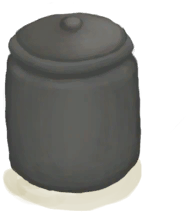

# 纤维  
> 可以把它和更多的纤维编织成细线。也可以用作火绒。  
  
<table class="table table-bordered" data-toggle="table"  data-show-header="false"><thead style="display:none"><tr ><th  style="width:50%;text-align:left;vertical-align:top;"  >title</th><th  style="width:50%;text-align:left;vertical-align:top;"  ></th></tr></thead><tr ><td  style="width:50%;text-align:left;vertical-align:top;"  >**重量：**20  **标签：**	[“抗裂剂”](tag_Temper.md), [“火绒”](tag_Tinder.md), [“低纤维”](tag_FibersPoor.md)</td><td  style="width:50%;text-align:left;vertical-align:top;"  >

<a href="Fibers.md" style="color:black">纤维</a>

植物纤维可以从<b>蛇草或椰子皮</b>中提取。  这是一种生存必需的材料：将两份纤维编织在一起，制成<b>细线</b>，用途非常广泛。  另外，你也可以使用<b>手钻</b>点燃纤维，并将其用作火绒点燃<b>火源</b>。</td></tr></tbody></table>  
  
## 获取来源  

** 使用**[“斧”](tag_Axe.md)拆解

[座椅](Seat.md)

** 使用**[“斧”](tag_Axe.md) , [“斧”](tag_Axe.md)拆卸

[座椅](SeatPlaced.md)

转化

[椰子凉鞋](CoconutSandals.md)

提取纤维

[椰子皮](CoconutHusk.md)

提取纤维

[蛇草](SnakeGrass.md)

  
  
## 可拖入  

<table style="margin-bottom:0px;"><tr><td style="width:40%;text-align:left; background-color:#FEFEFE"><b>拖入：</b>[

[手钻](HandDrill.md)](HandDrill.md)</td><td style="width:40%;font-size:1em;font-weight:bold;background-color:#FEFEFE">钻木取火 (30分) [“手部动作(组)”](HandAction.md)</td></tr><tr style="background-color:#FFFFFF"><td style=""><b>使用物：</b>使用次数  <b>-1</b></td><td style=""><b>自身：</b>→ [

[火种](TinderLit.md)](TinderLit.md)</td></tr><tr><td colspan="2"><b>状态变化：</b>[

[情绪](Morale.md)](Morale.md)<b>+1</b>, [

[手掌损伤](HandDamage.md)](HandDamage.md)<b>+40</b></td></tr></table>
  

<table style="margin-bottom:0px;"><tr><td style="width:40%;text-align:left; background-color:#FEFEFE"><b>拖入：</b>[

[弓钻](BowDrill.md)](BowDrill.md)</td><td style="width:40%;font-size:1em;font-weight:bold;background-color:#FEFEFE">钻木取火 (15分) [“手部动作(组)”](HandAction.md)</td></tr><tr style="background-color:#FFFFFF"><td style=""><b>使用物：</b>使用次数  <b>-1</b></td><td style=""><b>自身：</b>→ [

[火种](TinderLit.md)](TinderLit.md)</td></tr><tr><td colspan="2"><b>状态变化：</b>[

[情绪](Morale.md)](Morale.md)<b>+1</b>, [

[手掌损伤](HandDamage.md)](HandDamage.md)<b>+10</b></td></tr></table>
  

<table style="margin-bottom:0px;"><tr><td style="width:40%;text-align:left; background-color:#FEFEFE"><b>拖入：</b>[“火源”](tag_FireSource.md)</td><td style="width:40%;font-size:1em;font-weight:bold;background-color:#FEFEFE">点燃火绒  </td></tr><tr style="background-color:#FFFFFF"><td style=""><b>使用物：</b></td><td style=""><b>自身：</b>→ [

[火种](TinderLit.md)](TinderLit.md)</td></tr><tr><td colspan="2"><b>状态变化：</b>[

[情绪](Morale.md)](Morale.md)<b>+1</b></td></tr></table>
  

<table style="margin-bottom:0px;"><tr><td style="width:40%;text-align:left; background-color:#FEFEFE"><b>拖入：</b>[

[信号镜](SignalingMirror.md)](SignalingMirror.md) | [

[眼镜](Glasses.md)](Glasses.md)</td><td style="width:40%;font-size:1em;font-weight:bold;background-color:#FEFEFE">点燃火绒 (45分) </td></tr><tr><td colspan="2"><b>需求：</b>[

[降水值](RainValue.md)](RainValue.md): <b>0-0</b>, [

[阳光强度](SunStrength.md)](SunStrength.md): <b>1-6</b></td></tr><tr style="background-color:#FFFFFF"><td style=""><b>使用物：</b></td><td style=""><b>自身：</b>→ [

[火种](TinderLit.md)](TinderLit.md)</td></tr><tr><td colspan="2"><b>状态变化：</b>[

[情绪](Morale.md)](Morale.md)<b>+1</b></td></tr></table>
  

<table style="margin-bottom:0px;"><tr><td style="width:40%;text-align:left; background-color:#FEFEFE"><b>拖入：</b>[

[纤维](Fibers.md)](Fibers.md)</td><td style="width:40%;font-size:1em;font-weight:bold;background-color:#FEFEFE">缠起来 (30分) [“手部动作(组)”](HandAction.md), [“制造动作(组)”](CraftAction.md)</td></tr><tr><td colspan="2"><b>需求：</b>[

[光亮](Light.md)](Light.md): <b>10-100</b></td></tr><tr style="background-color:#FFFFFF"><td style=""><b>使用物：</b>→消失</td><td style=""><b>自身：</b>→ [

[细线](CordFiber.md)](CordFiber.md)</td></tr><tr><td colspan="2"><b>状态变化：</b>[

[纺织(技能)](Skill_Tailoring.md)](Skill_Tailoring.md)<b>+0.5</b>, [

[压力](Stress.md)](Stress.md)<b>-10</b> 加成<b>-1</b></td></tr></table>
  
  
## 可拖至  

[堆肥箱](CompostBin.md)

[蒸馏器(开)](AlembicOn.md)

[营火](Campfire.md)

[粘土火盆](ClayFirePit.md)

[火堆](Fire.md)

[熔炉](Forge.md)

[熔炉(熄灭)](ForgeExtinguished.md)

[瓦斯炉(开)](GasCookerOn.md)

[窑炉](Kiln.md)

[高级窑炉](KilnAdvanced.md)

[高级窑炉(熄灭)](KilnAdvancedExtinguished.md)

[窑炉(熄灭)](KilnExtinguished.md)

[火炉](Stove.md)

[羊食槽](GoatFeeder.md)

[羊食槽(空)](GoatFeederEmpty.md)

[泥堆](MudPile.md)

[烟熏炉](Smoker.md)

[烟熏炉(熄灭)](SmokerExtinguished.md)

[烟熏炉(塑料布)(熄灭)](SmokerExtinguishedPlastic.md)

[烟熏炉(塑料布)(点燃)](SmokerPlastic.md)

[粘土](Clay.md)

[火炭](Embers.md)

[纤维](Fibers.md)

[母山羊](GoatEnclosureFemale.md)

[小羊](GoatEnclosureKid.md)

[泌乳期山羊](GoatEnclosureLactating.md)

[公山羊](GoatEnclosureMale.md)

[母山羊](GoatTiedFemale.md)

[泌乳期山羊](GoatTiedFemaleLactating.md)

[小羊](GoatTiedKid.md)

[公山羊](GoatTiedMale.md)

[熏蜂器(关)](BeeSmokerOff.md)

[手钻](FirePlow.md)

[纺锤](Spindle.md)

  
  
## 可用于蓝图  

<a href="Bp_MoldAxe.md" style="color:black">斧头模具</a>

<a href="Bp_MoldKnife.md" style="color:black">刀模具</a>

<a href="Bp_MoldShovel.md" style="color:black">铲头模具</a>

<a href="Bp_MoldSpear.md" style="color:black">矛头模具</a>

<a href="Bp_Alembic.md" style="color:black">蒸馏器</a>

<a href="Bp_ClayBowl.md" style="color:black">陶碗</a>

<a href="Bp_ClayFirePit.md" style="color:black">粘土火盆</a>

<a href="Bp_ClayJar.md" style="color:black">小陶罐</a>

<a href="Bp_ClayPotCooler.md" style="color:black">保鲜罐</a>

<a href="Bp_ClayVase.md" style="color:black">陶罐</a>

<a href="Bp_CookingPot.md" style="color:black">烹饪锅</a>

<a href="Bp_GlazedVase.md" style="color:black">釉面陶罐</a>

<a href="Bp_LeatherShoes.md" style="color:black">皮革鞋子</a>

  
  
  

