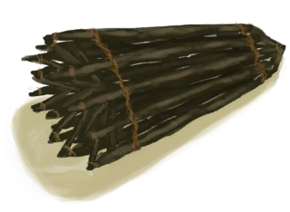
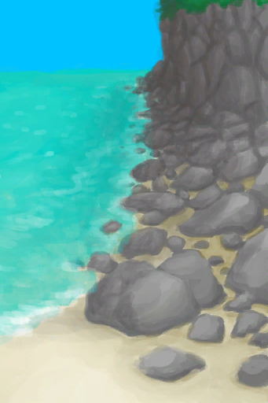
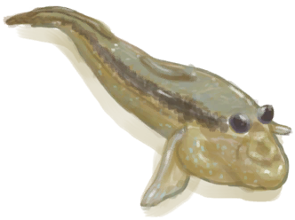
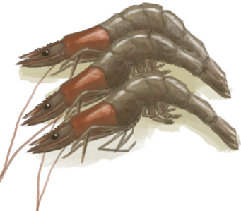

# 捕鱼陷阱  
> 我应该稍后再来检查是否有鱼。  
  
<table class="table table-bordered" data-toggle="table"  data-show-header="false"><thead style="display:none"><tr ><th  style="width:50%;text-align:left;vertical-align:top;"  >title</th><th  style="width:50%;text-align:left;vertical-align:top;"  ></th></tr></thead><tr ><td  style="width:50%;text-align:left;vertical-align:top;"  >** 不可删除 **  ** 不可堆叠 **  **槽位：**1  **过滤器：**[“可烹饪的”](tag_Cookable.md)</td><td  style="width:50%;text-align:left;vertical-align:top;"  >

<a href="FishTrapDeployed.md" style="color:black">捕鱼陷阱</a>

一种设计巧妙的篮状陷阱，可以轻松地捕获<b>鱼与贝类</b>。  这种陷阱并不需要<b>诱饵</b>，然而必须得放置在沿海区域。 <b>风暴</b>会摧毁它们，所以要记得在<b>湿润季节</b>收起来。</td></tr></tbody></table>  
  
## 获取来源  

放置

[捕鱼陷阱(未放置)](FishTrap.md)

** 使用**[捕鱼陷阱(未放置)](FishTrap.md)放置

[海(环礁)](Sea_Atoll.md)

** 使用**[捕鱼陷阱(未放置)](FishTrap.md)放置

[海(海湾)](Sea_Bay.md)

** 使用**[捕鱼陷阱(未放置)](FishTrap.md)放置

[海(沙滩)](Sea_Beach.md)

** 使用**[捕鱼陷阱(未放置)](FishTrap.md)放置

[海(隐秘港湾)](Sea_Cove.md)

  
  
## 动作  

<table><tr><td rowspan="2" style="width:200px;text-align:center;font-size:1.3em;font-weight:bold">

拿起陷阱

15分

</td><td>[“腿部动作(组)”](LegAction.md)</td></tr><tr><td><b>自身：</b>→ [

[捕鱼陷阱(未放置)](FishTrap.md)](FishTrap.md)</td></tr><tr><td colspan="2"><b>需求：</b>[

[光亮](Light.md)](Light.md): <b>10-100</b></td></tr></table>
  
  
  
## 转化  

<table style="margin-bottom:0px;"><tr><td  colspan=2 style="font-size:1em;font-weight:bold;background-color:#FEFEFE">捕捉猎物</td><td style="text-align:right; background-color:#FEFEFE">[

[陷阱(技能)](Skill_Trapping.md)](Skill_Trapping.md)<b>+0.5</b></td></tr><tr style="background-color:#FFFFFF"><td style="width:30%;font-size:1em;text-align:right;vertical-align:middle;"></td><td style="text-align:center;width:20%;vertical-align:middle;">
1天1小时 ～ 3天3小时

捕捉猎物
</td><td style="text-align:left;vertical-align:middle;"></td></tr><tr><td colspan="3">

<table style="margin-bottom:3px;"><tr><td rowspan=2 style="text-align:center" width="80px">
基础权重

25
</td><td style="font-size:0.6em;line-height:0.6em;font-weight:bold">Fail</td></tr><tr><td></td></tr><tr><td colspan=2><li>[

[陷阱(技能)](Skill_Trapping.md)](Skill_Trapping.md)为<b>0～150</b>时权重<b>+0～-20</b></li></td></tr></table>

<table style="margin-bottom:3px;"><tr><td rowspan=2 style="text-align:center" width="80px">
基础权重

0
</td><td style="font-size:0.6em;line-height:0.6em;font-weight:bold">Parrotfish</td></tr><tr><td>[

[鹦哥鱼](ParrotFish.md)](ParrotFish.md)(<b>+1</b>)</td></tr><tr><td colspan=2><li>位于[

[沙滩(环境)](Env_Beach.md)](Env_Beach.md)权重<b>+8</b>,</li><li>位于[

[隐秘港湾(环境)](Env_Cove.md)](Env_Cove.md)权重<b>+8</b>,</li><li>位于[

[海湾(环境)](Env_Bay.md)](Env_Bay.md)权重<b>+8</b>,</li><li>位于[

[岩滩(环境)](Env_Rocks.md)](Env_Rocks.md)权重<b>+6</b>,</li><li>位于[

[荒芜沙滩(环境)](Env_DesolateBeach.md)](Env_DesolateBeach.md)权重<b>+6</b>,</li><li>位于[

[红树林(环境)](Env_Mangroves.md)](Env_Mangroves.md)权重<b>+4</b>,</li></td></tr></table>

<table style="margin-bottom:3px;"><tr><td rowspan=2 style="text-align:center" width="80px">
基础权重

0
</td><td style="font-size:0.6em;line-height:0.6em;font-weight:bold">Goatfish</td></tr><tr><td>[

[绯鲤](Goatfish.md)](Goatfish.md)(<b>+1</b>)</td></tr><tr><td colspan=2><li>位于[

[沙滩(环境)](Env_Beach.md)](Env_Beach.md)权重<b>+8</b>,</li><li>位于[

[隐秘港湾(环境)](Env_Cove.md)](Env_Cove.md)权重<b>+8</b>,</li><li>位于[

[海湾(环境)](Env_Bay.md)](Env_Bay.md)权重<b>+8</b>,</li><li>位于[

[岩滩(环境)](Env_Rocks.md)](Env_Rocks.md)权重<b>+8</b>,</li><li>位于[

[荒芜沙滩(环境)](Env_DesolateBeach.md)](Env_DesolateBeach.md)权重<b>+8</b>,</li><li>位于[

[鸟岩岛(环境)](Env_BirdRock.md)](Env_BirdRock.md)权重<b>+8</b>,</li><li>位于[

[红树林(环境)](Env_Mangroves.md)](Env_Mangroves.md)权重<b>+8</b>,</li></td></tr></table>

<table style="margin-bottom:3px;"><tr><td rowspan=2 style="text-align:center" width="80px">
基础权重

0
</td><td style="font-size:0.6em;line-height:0.6em;font-weight:bold">Mudskipper</td></tr><tr><td>[

[弹涂鱼](Mudskipper.md)](Mudskipper.md)(<b>+1</b>)</td></tr><tr><td colspan=2><li>位于[

[红树林(环境)](Env_Mangroves.md)](Env_Mangroves.md)权重<b>+8</b>,</li></td></tr></table>

<table style="margin-bottom:3px;"><tr><td rowspan=2 style="text-align:center" width="80px">
基础权重

0
</td><td style="font-size:0.6em;line-height:0.6em;font-weight:bold">Crab</td></tr><tr><td>[

[螃蟹](Crab.md)](Crab.md)(<b>+1</b>)[螃蟹种群数量](Pop_Crab.md)<b>-1000</b></td></tr><tr><td colspan=2><li>位于[

[沙滩(环境)](Env_Beach.md)](Env_Beach.md),[螃蟹种群数量](Pop_Crab.md)为<b>1000～60000</b>时权重<b>+1～+10</b></li><li>位于[

[隐秘港湾(环境)](Env_Cove.md)](Env_Cove.md),[螃蟹种群数量](Pop_Crab.md)为<b>1000～60000</b>时权重<b>+1～+10</b></li><li>位于[

[海湾(环境)](Env_Bay.md)](Env_Bay.md),[螃蟹种群数量](Pop_Crab.md)为<b>1000～60000</b>时权重<b>+1～+10</b></li><li>位于[

[鸟岩岛(环境)](Env_BirdRock.md)](Env_BirdRock.md)权重<b>+10</b>,[螃蟹种群数量](Pop_Crab.md)为<b>1000～60000</b>时权重<b>+1～+10</b></li><li>位于[

[岩滩(环境)](Env_Rocks.md)](Env_Rocks.md)权重<b>+4</b>,[螃蟹种群数量](Pop_Crab.md)为<b>1000～60000</b>时权重<b>+1～+16</b></li><li>位于[

[荒芜沙滩(环境)](Env_DesolateBeach.md)](Env_DesolateBeach.md)权重<b>+4</b>,[螃蟹种群数量](Pop_Crab.md)为<b>1000～60000</b>时权重<b>+1～+16</b></li><li>位于[

[红树林(环境)](Env_Mangroves.md)](Env_Mangroves.md)权重<b>+4</b>,[螃蟹种群数量](Pop_Crab.md)为<b>1000～60000</b>时权重<b>+1～+20</b></li></td></tr></table>

<table style="margin-bottom:3px;"><tr><td rowspan=2 style="text-align:center" width="80px">
基础权重

0
</td><td style="font-size:0.6em;line-height:0.6em;font-weight:bold">Prawns</td></tr><tr><td>[

[虾](Prawns.md)](Prawns.md)(<b>+3</b>)[虾种群数量](Pop_Prawn.md)<b>-1000</b></td></tr><tr><td colspan=2><li>位于[

[沙滩(环境)](Env_Beach.md)](Env_Beach.md),[虾种群数量](Pop_Prawn.md)为<b>1000～60000</b>时权重<b>+1～+10</b></li><li>位于[

[隐秘港湾(环境)](Env_Cove.md)](Env_Cove.md),[虾种群数量](Pop_Prawn.md)为<b>1000～60000</b>时权重<b>+1～+10</b></li><li>位于[

[海湾(环境)](Env_Bay.md)](Env_Bay.md),[虾种群数量](Pop_Prawn.md)为<b>1000～60000</b>时权重<b>+1～+10</b></li><li>位于[

[鸟岩岛(环境)](Env_BirdRock.md)](Env_BirdRock.md)权重<b>+10</b>,[虾种群数量](Pop_Prawn.md)为<b>1000～60000</b>时权重<b>+1～+10</b></li><li>位于[

[岩滩(环境)](Env_Rocks.md)](Env_Rocks.md)权重<b>+4</b>,[虾种群数量](Pop_Prawn.md)为<b>1000～60000</b>时权重<b>+1～+14</b></li><li>位于[

[荒芜沙滩(环境)](Env_DesolateBeach.md)](Env_DesolateBeach.md)权重<b>+4</b>,[虾种群数量](Pop_Prawn.md)为<b>1000～60000</b>时权重<b>+1～+14</b></li><li>位于[

[红树林(环境)](Env_Mangroves.md)](Env_Mangroves.md)权重<b>+4</b>,[虾种群数量](Pop_Prawn.md)为<b>1000～60000</b>时权重<b>+1～+20</b></li></td></tr></table>
<button class="btn btn-secondary btn-sm" style="" data-toggle="modal" onclick="setCollectionDataBase64('eyJ0aXRsZSI6IuamgueOh+aooeaLnzog5o2V5o2J54yO54mpICjmjZXpsbzpmbfpmLEpIiwiY29sbGVjdGlvbnMiOlt7ImRyb3AiOiLml6AiLCJiYXNlIjoyNSwiY29uZGl0aW9uIjpbeyJrZXkiOiJTa2lsbF9UcmFwcGluZyIsInRpdGxlIjoi6Zm36ZixKOaKgOiDvSkiLCJ0eXBlIjoicmFuZ2UiLCJtYXgiOlswLDE1MF0sInJhbmdlIjpbMCwxNTBdLCJ3ZWlnaHQiOlswLC0yMF0sImRlZmF1bHRWYWx1ZSI6MCwid2hlbk91dE9mUmFuZ2UiOjB9XX0seyJkcm9wIjoiPGRpdiBzdHlsZT1cIndpZHRoOjI1cHg7ZGlzcGxheTppbmxpbmUtYmxvY2s7dGV4dC1hbGlnbjpjZW50ZXJcIj48aW1nIGRlY29kaW5nPVwiYXN5bmNcIiBzcmM9XCIuLi93aWtpL1Nwcml0ZS9QYXJyb3RGaXNoLnBuZ1wiIGhyZWY9XCJhLm1kXCIgc3R5bGU9XCJtYXgtd2lkdGg6MjVweDttYXgtaGVpZ2h0OjI1cHg7XCI+PC9kaXY+6bmm5ZOl6bG8IiwiYmFzZSI6MCwiY29uZGl0aW9uIjpbeyJrZXkiOiJFbnZfQmVhY2giLCJ0aXRsZSI6IuS9jeS6jjxkaXYgc3R5bGU9XCJ3aWR0aDoyMHB4O2Rpc3BsYXk6aW5saW5lLWJsb2NrO3RleHQtYWxpZ246Y2VudGVyXCI+PGltZyBkZWNvZGluZz1cImFzeW5jXCIgc3JjPVwiLi4vd2lraS9TcHJpdGUvQmlnSXNsYW5kLnBuZ1wiIGhyZWY9XCJhLm1kXCIgc3R5bGU9XCJtYXgtd2lkdGg6MjBweDttYXgtaGVpZ2h0OjIwcHg7XCI+PC9kaXY+5rKZ5rupKOeOr+WigykiLCJ0eXBlIjoidG9nZ2xlIiwicmFuZ2UiOlswLDFdLCJtYXgiOlswLDFdLCJ3ZWlnaHQiOlswLDhdLCJkZWZhdWx0VmFsdWUiOjAsIndoZW5PdXRPZlJhbmdlIjowLCJtYXhTdGFja0dyb3VwIjoiIn0seyJrZXkiOiJFbnZfQ292ZSIsInRpdGxlIjoi5L2N5LqOPGRpdiBzdHlsZT1cIndpZHRoOjIwcHg7ZGlzcGxheTppbmxpbmUtYmxvY2s7dGV4dC1hbGlnbjpjZW50ZXJcIj48aW1nIGRlY29kaW5nPVwiYXN5bmNcIiBzcmM9XCIuLi93aWtpL1Nwcml0ZS9CaWdJc2xhbmQucG5nXCIgaHJlZj1cImEubWRcIiBzdHlsZT1cIm1heC13aWR0aDoyMHB4O21heC1oZWlnaHQ6MjBweDtcIj48L2Rpdj7pmpDnp5jmuK/mub4o546v5aKDKSIsInR5cGUiOiJ0b2dnbGUiLCJyYW5nZSI6WzAsMV0sIm1heCI6WzAsMV0sIndlaWdodCI6WzAsOF0sImRlZmF1bHRWYWx1ZSI6MCwid2hlbk91dE9mUmFuZ2UiOjAsIm1heFN0YWNrR3JvdXAiOiIifSx7ImtleSI6IkVudl9CYXkiLCJ0aXRsZSI6IuS9jeS6jjxkaXYgc3R5bGU9XCJ3aWR0aDoyMHB4O2Rpc3BsYXk6aW5saW5lLWJsb2NrO3RleHQtYWxpZ246Y2VudGVyXCI+PGltZyBkZWNvZGluZz1cImFzeW5jXCIgc3JjPVwiLi4vd2lraS9TcHJpdGUvQmF5LnBuZ1wiIGhyZWY9XCJhLm1kXCIgc3R5bGU9XCJtYXgtd2lkdGg6MjBweDttYXgtaGVpZ2h0OjIwcHg7XCI+PC9kaXY+5rW35rm+KOeOr+WigykiLCJ0eXBlIjoidG9nZ2xlIiwicmFuZ2UiOlswLDFdLCJtYXgiOlswLDFdLCJ3ZWlnaHQiOlswLDhdLCJkZWZhdWx0VmFsdWUiOjAsIndoZW5PdXRPZlJhbmdlIjowLCJtYXhTdGFja0dyb3VwIjoiIn0seyJrZXkiOiJFbnZfUm9ja3MiLCJ0aXRsZSI6IuS9jeS6jjxkaXYgc3R5bGU9XCJ3aWR0aDoyMHB4O2Rpc3BsYXk6aW5saW5lLWJsb2NrO3RleHQtYWxpZ246Y2VudGVyXCI+PGltZyBkZWNvZGluZz1cImFzeW5jXCIgc3JjPVwiLi4vd2lraS9TcHJpdGUvUm9ja3lQYXRoLnBuZ1wiIGhyZWY9XCJhLm1kXCIgc3R5bGU9XCJtYXgtd2lkdGg6MjBweDttYXgtaGVpZ2h0OjIwcHg7XCI+PC9kaXY+5bKp5rupKOeOr+WigykiLCJ0eXBlIjoidG9nZ2xlIiwicmFuZ2UiOlswLDFdLCJtYXgiOlswLDFdLCJ3ZWlnaHQiOlswLDZdLCJkZWZhdWx0VmFsdWUiOjAsIndoZW5PdXRPZlJhbmdlIjowLCJtYXhTdGFja0dyb3VwIjoiIn0seyJrZXkiOiJFbnZfRGVzb2xhdGVCZWFjaCIsInRpdGxlIjoi5L2N5LqOPGRpdiBzdHlsZT1cIndpZHRoOjIwcHg7ZGlzcGxheTppbmxpbmUtYmxvY2s7dGV4dC1hbGlnbjpjZW50ZXJcIj48aW1nIGRlY29kaW5nPVwiYXN5bmNcIiBzcmM9XCIuLi93aWtpL1Nwcml0ZS9EZXNvbGF0ZUJlYWNoLnBuZ1wiIGhyZWY9XCJhLm1kXCIgc3R5bGU9XCJtYXgtd2lkdGg6MjBweDttYXgtaGVpZ2h0OjIwcHg7XCI+PC9kaXY+6I2S6Iqc5rKZ5rupKOeOr+WigykiLCJ0eXBlIjoidG9nZ2xlIiwicmFuZ2UiOlswLDFdLCJtYXgiOlswLDFdLCJ3ZWlnaHQiOlswLDZdLCJkZWZhdWx0VmFsdWUiOjAsIndoZW5PdXRPZlJhbmdlIjowLCJtYXhTdGFja0dyb3VwIjoiIn0seyJrZXkiOiJFbnZfTWFuZ3JvdmVzIiwidGl0bGUiOiLkvY3kuo48ZGl2IHN0eWxlPVwid2lkdGg6MjBweDtkaXNwbGF5OmlubGluZS1ibG9jazt0ZXh0LWFsaWduOmNlbnRlclwiPjxpbWcgZGVjb2Rpbmc9XCJhc3luY1wiIHNyYz1cIi4uL3dpa2kvU3ByaXRlL01hbmdyb3Zlcy5wbmdcIiBocmVmPVwiYS5tZFwiIHN0eWxlPVwibWF4LXdpZHRoOjIwcHg7bWF4LWhlaWdodDoyMHB4O1wiPjwvZGl2Pue6ouagkeaelyjnjq/looMpIiwidHlwZSI6InRvZ2dsZSIsInJhbmdlIjpbMCwxXSwibWF4IjpbMCwxXSwid2VpZ2h0IjpbMCw0XSwiZGVmYXVsdFZhbHVlIjowLCJ3aGVuT3V0T2ZSYW5nZSI6MCwibWF4U3RhY2tHcm91cCI6IiJ9XX0seyJkcm9wIjoiPGRpdiBzdHlsZT1cIndpZHRoOjI1cHg7ZGlzcGxheTppbmxpbmUtYmxvY2s7dGV4dC1hbGlnbjpjZW50ZXJcIj48aW1nIGRlY29kaW5nPVwiYXN5bmNcIiBzcmM9XCIuLi93aWtpL1Nwcml0ZS9Hb2F0ZmlzaC5wbmdcIiBocmVmPVwiYS5tZFwiIHN0eWxlPVwibWF4LXdpZHRoOjI1cHg7bWF4LWhlaWdodDoyNXB4O1wiPjwvZGl2Pue7r+mypCIsImJhc2UiOjAsImNvbmRpdGlvbiI6W3sia2V5IjoiRW52X0JlYWNoIiwidGl0bGUiOiLkvY3kuo48ZGl2IHN0eWxlPVwid2lkdGg6MjBweDtkaXNwbGF5OmlubGluZS1ibG9jazt0ZXh0LWFsaWduOmNlbnRlclwiPjxpbWcgZGVjb2Rpbmc9XCJhc3luY1wiIHNyYz1cIi4uL3dpa2kvU3ByaXRlL0JpZ0lzbGFuZC5wbmdcIiBocmVmPVwiYS5tZFwiIHN0eWxlPVwibWF4LXdpZHRoOjIwcHg7bWF4LWhlaWdodDoyMHB4O1wiPjwvZGl2Puaymea7qSjnjq/looMpIiwidHlwZSI6InRvZ2dsZSIsInJhbmdlIjpbMCwxXSwibWF4IjpbMCwxXSwid2VpZ2h0IjpbMCw4XSwiZGVmYXVsdFZhbHVlIjowLCJ3aGVuT3V0T2ZSYW5nZSI6MCwibWF4U3RhY2tHcm91cCI6IiJ9LHsia2V5IjoiRW52X0NvdmUiLCJ0aXRsZSI6IuS9jeS6jjxkaXYgc3R5bGU9XCJ3aWR0aDoyMHB4O2Rpc3BsYXk6aW5saW5lLWJsb2NrO3RleHQtYWxpZ246Y2VudGVyXCI+PGltZyBkZWNvZGluZz1cImFzeW5jXCIgc3JjPVwiLi4vd2lraS9TcHJpdGUvQmlnSXNsYW5kLnBuZ1wiIGhyZWY9XCJhLm1kXCIgc3R5bGU9XCJtYXgtd2lkdGg6MjBweDttYXgtaGVpZ2h0OjIwcHg7XCI+PC9kaXY+6ZqQ56eY5riv5rm+KOeOr+WigykiLCJ0eXBlIjoidG9nZ2xlIiwicmFuZ2UiOlswLDFdLCJtYXgiOlswLDFdLCJ3ZWlnaHQiOlswLDhdLCJkZWZhdWx0VmFsdWUiOjAsIndoZW5PdXRPZlJhbmdlIjowLCJtYXhTdGFja0dyb3VwIjoiIn0seyJrZXkiOiJFbnZfQmF5IiwidGl0bGUiOiLkvY3kuo48ZGl2IHN0eWxlPVwid2lkdGg6MjBweDtkaXNwbGF5OmlubGluZS1ibG9jazt0ZXh0LWFsaWduOmNlbnRlclwiPjxpbWcgZGVjb2Rpbmc9XCJhc3luY1wiIHNyYz1cIi4uL3dpa2kvU3ByaXRlL0JheS5wbmdcIiBocmVmPVwiYS5tZFwiIHN0eWxlPVwibWF4LXdpZHRoOjIwcHg7bWF4LWhlaWdodDoyMHB4O1wiPjwvZGl2Pua1t+a5vijnjq/looMpIiwidHlwZSI6InRvZ2dsZSIsInJhbmdlIjpbMCwxXSwibWF4IjpbMCwxXSwid2VpZ2h0IjpbMCw4XSwiZGVmYXVsdFZhbHVlIjowLCJ3aGVuT3V0T2ZSYW5nZSI6MCwibWF4U3RhY2tHcm91cCI6IiJ9LHsia2V5IjoiRW52X1JvY2tzIiwidGl0bGUiOiLkvY3kuo48ZGl2IHN0eWxlPVwid2lkdGg6MjBweDtkaXNwbGF5OmlubGluZS1ibG9jazt0ZXh0LWFsaWduOmNlbnRlclwiPjxpbWcgZGVjb2Rpbmc9XCJhc3luY1wiIHNyYz1cIi4uL3dpa2kvU3ByaXRlL1JvY2t5UGF0aC5wbmdcIiBocmVmPVwiYS5tZFwiIHN0eWxlPVwibWF4LXdpZHRoOjIwcHg7bWF4LWhlaWdodDoyMHB4O1wiPjwvZGl2PuWyqea7qSjnjq/looMpIiwidHlwZSI6InRvZ2dsZSIsInJhbmdlIjpbMCwxXSwibWF4IjpbMCwxXSwid2VpZ2h0IjpbMCw4XSwiZGVmYXVsdFZhbHVlIjowLCJ3aGVuT3V0T2ZSYW5nZSI6MCwibWF4U3RhY2tHcm91cCI6IiJ9LHsia2V5IjoiRW52X0Rlc29sYXRlQmVhY2giLCJ0aXRsZSI6IuS9jeS6jjxkaXYgc3R5bGU9XCJ3aWR0aDoyMHB4O2Rpc3BsYXk6aW5saW5lLWJsb2NrO3RleHQtYWxpZ246Y2VudGVyXCI+PGltZyBkZWNvZGluZz1cImFzeW5jXCIgc3JjPVwiLi4vd2lraS9TcHJpdGUvRGVzb2xhdGVCZWFjaC5wbmdcIiBocmVmPVwiYS5tZFwiIHN0eWxlPVwibWF4LXdpZHRoOjIwcHg7bWF4LWhlaWdodDoyMHB4O1wiPjwvZGl2PuiNkuiKnOaymea7qSjnjq/looMpIiwidHlwZSI6InRvZ2dsZSIsInJhbmdlIjpbMCwxXSwibWF4IjpbMCwxXSwid2VpZ2h0IjpbMCw4XSwiZGVmYXVsdFZhbHVlIjowLCJ3aGVuT3V0T2ZSYW5nZSI6MCwibWF4U3RhY2tHcm91cCI6IiJ9LHsia2V5IjoiRW52X0JpcmRSb2NrIiwidGl0bGUiOiLkvY3kuo48ZGl2IHN0eWxlPVwid2lkdGg6MjBweDtkaXNwbGF5OmlubGluZS1ibG9jazt0ZXh0LWFsaWduOmNlbnRlclwiPjxpbWcgZGVjb2Rpbmc9XCJhc3luY1wiIHNyYz1cIi4uL3dpa2kvU3ByaXRlL1BvaW50eVJvY2sucG5nXCIgaHJlZj1cImEubWRcIiBzdHlsZT1cIm1heC13aWR0aDoyMHB4O21heC1oZWlnaHQ6MjBweDtcIj48L2Rpdj7puJ/lsqnlspso546v5aKDKSIsInR5cGUiOiJ0b2dnbGUiLCJyYW5nZSI6WzAsMV0sIm1heCI6WzAsMV0sIndlaWdodCI6WzAsOF0sImRlZmF1bHRWYWx1ZSI6MCwid2hlbk91dE9mUmFuZ2UiOjAsIm1heFN0YWNrR3JvdXAiOiIifSx7ImtleSI6IkVudl9NYW5ncm92ZXMiLCJ0aXRsZSI6IuS9jeS6jjxkaXYgc3R5bGU9XCJ3aWR0aDoyMHB4O2Rpc3BsYXk6aW5saW5lLWJsb2NrO3RleHQtYWxpZ246Y2VudGVyXCI+PGltZyBkZWNvZGluZz1cImFzeW5jXCIgc3JjPVwiLi4vd2lraS9TcHJpdGUvTWFuZ3JvdmVzLnBuZ1wiIGhyZWY9XCJhLm1kXCIgc3R5bGU9XCJtYXgtd2lkdGg6MjBweDttYXgtaGVpZ2h0OjIwcHg7XCI+PC9kaXY+57qi5qCR5p6XKOeOr+WigykiLCJ0eXBlIjoidG9nZ2xlIiwicmFuZ2UiOlswLDFdLCJtYXgiOlswLDFdLCJ3ZWlnaHQiOlswLDhdLCJkZWZhdWx0VmFsdWUiOjAsIndoZW5PdXRPZlJhbmdlIjowLCJtYXhTdGFja0dyb3VwIjoiIn1dfSx7ImRyb3AiOiI8ZGl2IHN0eWxlPVwid2lkdGg6MjVweDtkaXNwbGF5OmlubGluZS1ibG9jazt0ZXh0LWFsaWduOmNlbnRlclwiPjxpbWcgZGVjb2Rpbmc9XCJhc3luY1wiIHNyYz1cIi4uL3dpa2kvU3ByaXRlL011ZHNraXBwZXIucG5nXCIgaHJlZj1cImEubWRcIiBzdHlsZT1cIm1heC13aWR0aDoyNXB4O21heC1oZWlnaHQ6MjVweDtcIj48L2Rpdj7lvLnmtoLpsbwiLCJiYXNlIjowLCJjb25kaXRpb24iOlt7ImtleSI6IkVudl9NYW5ncm92ZXMiLCJ0aXRsZSI6IuS9jeS6jjxkaXYgc3R5bGU9XCJ3aWR0aDoyMHB4O2Rpc3BsYXk6aW5saW5lLWJsb2NrO3RleHQtYWxpZ246Y2VudGVyXCI+PGltZyBkZWNvZGluZz1cImFzeW5jXCIgc3JjPVwiLi4vd2lraS9TcHJpdGUvTWFuZ3JvdmVzLnBuZ1wiIGhyZWY9XCJhLm1kXCIgc3R5bGU9XCJtYXgtd2lkdGg6MjBweDttYXgtaGVpZ2h0OjIwcHg7XCI+PC9kaXY+57qi5qCR5p6XKOeOr+WigykiLCJ0eXBlIjoidG9nZ2xlIiwicmFuZ2UiOlswLDFdLCJtYXgiOlswLDFdLCJ3ZWlnaHQiOlswLDhdLCJkZWZhdWx0VmFsdWUiOjAsIndoZW5PdXRPZlJhbmdlIjowLCJtYXhTdGFja0dyb3VwIjoiIn1dfSx7ImRyb3AiOiI8ZGl2IHN0eWxlPVwid2lkdGg6MjVweDtkaXNwbGF5OmlubGluZS1ibG9jazt0ZXh0LWFsaWduOmNlbnRlclwiPjxpbWcgZGVjb2Rpbmc9XCJhc3luY1wiIHNyYz1cIi4uL3dpa2kvU3ByaXRlL0NyYWIucG5nXCIgaHJlZj1cImEubWRcIiBzdHlsZT1cIm1heC13aWR0aDoyNXB4O21heC1oZWlnaHQ6MjVweDtcIj48L2Rpdj7onoPon7kiLCJiYXNlIjowLCJjb25kaXRpb24iOlt7ImtleSI6IkVudl9CZWFjaCIsInRpdGxlIjoi5L2N5LqOPGRpdiBzdHlsZT1cIndpZHRoOjIwcHg7ZGlzcGxheTppbmxpbmUtYmxvY2s7dGV4dC1hbGlnbjpjZW50ZXJcIj48aW1nIGRlY29kaW5nPVwiYXN5bmNcIiBzcmM9XCIuLi93aWtpL1Nwcml0ZS9CaWdJc2xhbmQucG5nXCIgaHJlZj1cImEubWRcIiBzdHlsZT1cIm1heC13aWR0aDoyMHB4O21heC1oZWlnaHQ6MjBweDtcIj48L2Rpdj7mspnmu6ko546v5aKDKSIsInR5cGUiOiJ0b2dnbGUiLCJyYW5nZSI6WzAsMV0sIm1heCI6WzAsMV0sIndlaWdodCI6WzAsMF0sImRlZmF1bHRWYWx1ZSI6MCwid2hlbk91dE9mUmFuZ2UiOjAsIm1heFN0YWNrR3JvdXAiOiIifSx7ImtleSI6IlBvcF9DcmFiIiwidGl0bGUiOiLonoPon7nnp43nvqTmlbDph48iLCJ0eXBlIjoicmFuZ2UiLCJtYXgiOlswLDYwMDAwXSwicmFuZ2UiOlsxMDAwLDYwMDAwXSwid2VpZ2h0IjpbMSwxMF0sImRlZmF1bHRWYWx1ZSI6NjAwMDAsIndoZW5PdXRPZlJhbmdlIjowLCJwcmVkIjoiRW52X0JlYWNoIn0seyJrZXkiOiJFbnZfQ292ZSIsInRpdGxlIjoi5L2N5LqOPGRpdiBzdHlsZT1cIndpZHRoOjIwcHg7ZGlzcGxheTppbmxpbmUtYmxvY2s7dGV4dC1hbGlnbjpjZW50ZXJcIj48aW1nIGRlY29kaW5nPVwiYXN5bmNcIiBzcmM9XCIuLi93aWtpL1Nwcml0ZS9CaWdJc2xhbmQucG5nXCIgaHJlZj1cImEubWRcIiBzdHlsZT1cIm1heC13aWR0aDoyMHB4O21heC1oZWlnaHQ6MjBweDtcIj48L2Rpdj7pmpDnp5jmuK/mub4o546v5aKDKSIsInR5cGUiOiJ0b2dnbGUiLCJyYW5nZSI6WzAsMV0sIm1heCI6WzAsMV0sIndlaWdodCI6WzAsMF0sImRlZmF1bHRWYWx1ZSI6MCwid2hlbk91dE9mUmFuZ2UiOjAsIm1heFN0YWNrR3JvdXAiOiIifSx7ImtleSI6IlBvcF9DcmFiIiwidGl0bGUiOiLonoPon7nnp43nvqTmlbDph48iLCJ0eXBlIjoicmFuZ2UiLCJtYXgiOlswLDYwMDAwXSwicmFuZ2UiOlsxMDAwLDYwMDAwXSwid2VpZ2h0IjpbMSwxMF0sImRlZmF1bHRWYWx1ZSI6NjAwMDAsIndoZW5PdXRPZlJhbmdlIjowLCJwcmVkIjoiRW52X0NvdmUifSx7ImtleSI6IkVudl9CYXkiLCJ0aXRsZSI6IuS9jeS6jjxkaXYgc3R5bGU9XCJ3aWR0aDoyMHB4O2Rpc3BsYXk6aW5saW5lLWJsb2NrO3RleHQtYWxpZ246Y2VudGVyXCI+PGltZyBkZWNvZGluZz1cImFzeW5jXCIgc3JjPVwiLi4vd2lraS9TcHJpdGUvQmF5LnBuZ1wiIGhyZWY9XCJhLm1kXCIgc3R5bGU9XCJtYXgtd2lkdGg6MjBweDttYXgtaGVpZ2h0OjIwcHg7XCI+PC9kaXY+5rW35rm+KOeOr+WigykiLCJ0eXBlIjoidG9nZ2xlIiwicmFuZ2UiOlswLDFdLCJtYXgiOlswLDFdLCJ3ZWlnaHQiOlswLDBdLCJkZWZhdWx0VmFsdWUiOjAsIndoZW5PdXRPZlJhbmdlIjowLCJtYXhTdGFja0dyb3VwIjoiIn0seyJrZXkiOiJQb3BfQ3JhYiIsInRpdGxlIjoi6J6D6J+556eN576k5pWw6YePIiwidHlwZSI6InJhbmdlIiwibWF4IjpbMCw2MDAwMF0sInJhbmdlIjpbMTAwMCw2MDAwMF0sIndlaWdodCI6WzEsMTBdLCJkZWZhdWx0VmFsdWUiOjYwMDAwLCJ3aGVuT3V0T2ZSYW5nZSI6MCwicHJlZCI6IkVudl9CYXkifSx7ImtleSI6IkVudl9CaXJkUm9jayIsInRpdGxlIjoi5L2N5LqOPGRpdiBzdHlsZT1cIndpZHRoOjIwcHg7ZGlzcGxheTppbmxpbmUtYmxvY2s7dGV4dC1hbGlnbjpjZW50ZXJcIj48aW1nIGRlY29kaW5nPVwiYXN5bmNcIiBzcmM9XCIuLi93aWtpL1Nwcml0ZS9Qb2ludHlSb2NrLnBuZ1wiIGhyZWY9XCJhLm1kXCIgc3R5bGU9XCJtYXgtd2lkdGg6MjBweDttYXgtaGVpZ2h0OjIwcHg7XCI+PC9kaXY+6bif5bKp5bKbKOeOr+WigykiLCJ0eXBlIjoidG9nZ2xlIiwicmFuZ2UiOlswLDFdLCJtYXgiOlswLDFdLCJ3ZWlnaHQiOlswLDEwXSwiZGVmYXVsdFZhbHVlIjowLCJ3aGVuT3V0T2ZSYW5nZSI6MCwibWF4U3RhY2tHcm91cCI6IiJ9LHsia2V5IjoiUG9wX0NyYWIiLCJ0aXRsZSI6Iuieg+ifueenjee+pOaVsOmHjyIsInR5cGUiOiJyYW5nZSIsIm1heCI6WzAsNjAwMDBdLCJyYW5nZSI6WzEwMDAsNjAwMDBdLCJ3ZWlnaHQiOlsxLDEwXSwiZGVmYXVsdFZhbHVlIjo2MDAwMCwid2hlbk91dE9mUmFuZ2UiOjAsInByZWQiOiJFbnZfQmlyZFJvY2sifSx7ImtleSI6IkVudl9Sb2NrcyIsInRpdGxlIjoi5L2N5LqOPGRpdiBzdHlsZT1cIndpZHRoOjIwcHg7ZGlzcGxheTppbmxpbmUtYmxvY2s7dGV4dC1hbGlnbjpjZW50ZXJcIj48aW1nIGRlY29kaW5nPVwiYXN5bmNcIiBzcmM9XCIuLi93aWtpL1Nwcml0ZS9Sb2NreVBhdGgucG5nXCIgaHJlZj1cImEubWRcIiBzdHlsZT1cIm1heC13aWR0aDoyMHB4O21heC1oZWlnaHQ6MjBweDtcIj48L2Rpdj7lsqnmu6ko546v5aKDKSIsInR5cGUiOiJ0b2dnbGUiLCJyYW5nZSI6WzAsMV0sIm1heCI6WzAsMV0sIndlaWdodCI6WzAsNF0sImRlZmF1bHRWYWx1ZSI6MCwid2hlbk91dE9mUmFuZ2UiOjAsIm1heFN0YWNrR3JvdXAiOiIifSx7ImtleSI6IlBvcF9DcmFiIiwidGl0bGUiOiLonoPon7nnp43nvqTmlbDph48iLCJ0eXBlIjoicmFuZ2UiLCJtYXgiOlswLDYwMDAwXSwicmFuZ2UiOlsxMDAwLDYwMDAwXSwid2VpZ2h0IjpbMSwxNl0sImRlZmF1bHRWYWx1ZSI6NjAwMDAsIndoZW5PdXRPZlJhbmdlIjowLCJwcmVkIjoiRW52X1JvY2tzIn0seyJrZXkiOiJFbnZfRGVzb2xhdGVCZWFjaCIsInRpdGxlIjoi5L2N5LqOPGRpdiBzdHlsZT1cIndpZHRoOjIwcHg7ZGlzcGxheTppbmxpbmUtYmxvY2s7dGV4dC1hbGlnbjpjZW50ZXJcIj48aW1nIGRlY29kaW5nPVwiYXN5bmNcIiBzcmM9XCIuLi93aWtpL1Nwcml0ZS9EZXNvbGF0ZUJlYWNoLnBuZ1wiIGhyZWY9XCJhLm1kXCIgc3R5bGU9XCJtYXgtd2lkdGg6MjBweDttYXgtaGVpZ2h0OjIwcHg7XCI+PC9kaXY+6I2S6Iqc5rKZ5rupKOeOr+WigykiLCJ0eXBlIjoidG9nZ2xlIiwicmFuZ2UiOlswLDFdLCJtYXgiOlswLDFdLCJ3ZWlnaHQiOlswLDRdLCJkZWZhdWx0VmFsdWUiOjAsIndoZW5PdXRPZlJhbmdlIjowLCJtYXhTdGFja0dyb3VwIjoiIn0seyJrZXkiOiJQb3BfQ3JhYiIsInRpdGxlIjoi6J6D6J+556eN576k5pWw6YePIiwidHlwZSI6InJhbmdlIiwibWF4IjpbMCw2MDAwMF0sInJhbmdlIjpbMTAwMCw2MDAwMF0sIndlaWdodCI6WzEsMTZdLCJkZWZhdWx0VmFsdWUiOjYwMDAwLCJ3aGVuT3V0T2ZSYW5nZSI6MCwicHJlZCI6IkVudl9EZXNvbGF0ZUJlYWNoIn0seyJrZXkiOiJFbnZfTWFuZ3JvdmVzIiwidGl0bGUiOiLkvY3kuo48ZGl2IHN0eWxlPVwid2lkdGg6MjBweDtkaXNwbGF5OmlubGluZS1ibG9jazt0ZXh0LWFsaWduOmNlbnRlclwiPjxpbWcgZGVjb2Rpbmc9XCJhc3luY1wiIHNyYz1cIi4uL3dpa2kvU3ByaXRlL01hbmdyb3Zlcy5wbmdcIiBocmVmPVwiYS5tZFwiIHN0eWxlPVwibWF4LXdpZHRoOjIwcHg7bWF4LWhlaWdodDoyMHB4O1wiPjwvZGl2Pue6ouagkeaelyjnjq/looMpIiwidHlwZSI6InRvZ2dsZSIsInJhbmdlIjpbMCwxXSwibWF4IjpbMCwxXSwid2VpZ2h0IjpbMCw0XSwiZGVmYXVsdFZhbHVlIjowLCJ3aGVuT3V0T2ZSYW5nZSI6MCwibWF4U3RhY2tHcm91cCI6IiJ9LHsia2V5IjoiUG9wX0NyYWIiLCJ0aXRsZSI6Iuieg+ifueenjee+pOaVsOmHjyIsInR5cGUiOiJyYW5nZSIsIm1heCI6WzAsNjAwMDBdLCJyYW5nZSI6WzEwMDAsNjAwMDBdLCJ3ZWlnaHQiOlsxLDIwXSwiZGVmYXVsdFZhbHVlIjo2MDAwMCwid2hlbk91dE9mUmFuZ2UiOjAsInByZWQiOiJFbnZfTWFuZ3JvdmVzIn1dfSx7ImRyb3AiOiI8ZGl2IHN0eWxlPVwid2lkdGg6MjVweDtkaXNwbGF5OmlubGluZS1ibG9jazt0ZXh0LWFsaWduOmNlbnRlclwiPjxpbWcgZGVjb2Rpbmc9XCJhc3luY1wiIHNyYz1cIi4uL3dpa2kvU3ByaXRlL1ByYXducy5wbmdcIiBocmVmPVwiYS5tZFwiIHN0eWxlPVwibWF4LXdpZHRoOjI1cHg7bWF4LWhlaWdodDoyNXB4O1wiPjwvZGl2PuiZviIsImJhc2UiOjAsImNvbmRpdGlvbiI6W3sia2V5IjoiRW52X0JlYWNoIiwidGl0bGUiOiLkvY3kuo48ZGl2IHN0eWxlPVwid2lkdGg6MjBweDtkaXNwbGF5OmlubGluZS1ibG9jazt0ZXh0LWFsaWduOmNlbnRlclwiPjxpbWcgZGVjb2Rpbmc9XCJhc3luY1wiIHNyYz1cIi4uL3dpa2kvU3ByaXRlL0JpZ0lzbGFuZC5wbmdcIiBocmVmPVwiYS5tZFwiIHN0eWxlPVwibWF4LXdpZHRoOjIwcHg7bWF4LWhlaWdodDoyMHB4O1wiPjwvZGl2Puaymea7qSjnjq/looMpIiwidHlwZSI6InRvZ2dsZSIsInJhbmdlIjpbMCwxXSwibWF4IjpbMCwxXSwid2VpZ2h0IjpbMCwwXSwiZGVmYXVsdFZhbHVlIjowLCJ3aGVuT3V0T2ZSYW5nZSI6MCwibWF4U3RhY2tHcm91cCI6IiJ9LHsia2V5IjoiUG9wX1ByYXduIiwidGl0bGUiOiLomb7np43nvqTmlbDph48iLCJ0eXBlIjoicmFuZ2UiLCJtYXgiOlswLDYwMDAwXSwicmFuZ2UiOlsxMDAwLDYwMDAwXSwid2VpZ2h0IjpbMSwxMF0sImRlZmF1bHRWYWx1ZSI6NjAwMDAsIndoZW5PdXRPZlJhbmdlIjowLCJwcmVkIjoiRW52X0JlYWNoIn0seyJrZXkiOiJFbnZfQ292ZSIsInRpdGxlIjoi5L2N5LqOPGRpdiBzdHlsZT1cIndpZHRoOjIwcHg7ZGlzcGxheTppbmxpbmUtYmxvY2s7dGV4dC1hbGlnbjpjZW50ZXJcIj48aW1nIGRlY29kaW5nPVwiYXN5bmNcIiBzcmM9XCIuLi93aWtpL1Nwcml0ZS9CaWdJc2xhbmQucG5nXCIgaHJlZj1cImEubWRcIiBzdHlsZT1cIm1heC13aWR0aDoyMHB4O21heC1oZWlnaHQ6MjBweDtcIj48L2Rpdj7pmpDnp5jmuK/mub4o546v5aKDKSIsInR5cGUiOiJ0b2dnbGUiLCJyYW5nZSI6WzAsMV0sIm1heCI6WzAsMV0sIndlaWdodCI6WzAsMF0sImRlZmF1bHRWYWx1ZSI6MCwid2hlbk91dE9mUmFuZ2UiOjAsIm1heFN0YWNrR3JvdXAiOiIifSx7ImtleSI6IlBvcF9QcmF3biIsInRpdGxlIjoi6Jm+56eN576k5pWw6YePIiwidHlwZSI6InJhbmdlIiwibWF4IjpbMCw2MDAwMF0sInJhbmdlIjpbMTAwMCw2MDAwMF0sIndlaWdodCI6WzEsMTBdLCJkZWZhdWx0VmFsdWUiOjYwMDAwLCJ3aGVuT3V0T2ZSYW5nZSI6MCwicHJlZCI6IkVudl9Db3ZlIn0seyJrZXkiOiJFbnZfQmF5IiwidGl0bGUiOiLkvY3kuo48ZGl2IHN0eWxlPVwid2lkdGg6MjBweDtkaXNwbGF5OmlubGluZS1ibG9jazt0ZXh0LWFsaWduOmNlbnRlclwiPjxpbWcgZGVjb2Rpbmc9XCJhc3luY1wiIHNyYz1cIi4uL3dpa2kvU3ByaXRlL0JheS5wbmdcIiBocmVmPVwiYS5tZFwiIHN0eWxlPVwibWF4LXdpZHRoOjIwcHg7bWF4LWhlaWdodDoyMHB4O1wiPjwvZGl2Pua1t+a5vijnjq/looMpIiwidHlwZSI6InRvZ2dsZSIsInJhbmdlIjpbMCwxXSwibWF4IjpbMCwxXSwid2VpZ2h0IjpbMCwwXSwiZGVmYXVsdFZhbHVlIjowLCJ3aGVuT3V0T2ZSYW5nZSI6MCwibWF4U3RhY2tHcm91cCI6IiJ9LHsia2V5IjoiUG9wX1ByYXduIiwidGl0bGUiOiLomb7np43nvqTmlbDph48iLCJ0eXBlIjoicmFuZ2UiLCJtYXgiOlswLDYwMDAwXSwicmFuZ2UiOlsxMDAwLDYwMDAwXSwid2VpZ2h0IjpbMSwxMF0sImRlZmF1bHRWYWx1ZSI6NjAwMDAsIndoZW5PdXRPZlJhbmdlIjowLCJwcmVkIjoiRW52X0JheSJ9LHsia2V5IjoiRW52X0JpcmRSb2NrIiwidGl0bGUiOiLkvY3kuo48ZGl2IHN0eWxlPVwid2lkdGg6MjBweDtkaXNwbGF5OmlubGluZS1ibG9jazt0ZXh0LWFsaWduOmNlbnRlclwiPjxpbWcgZGVjb2Rpbmc9XCJhc3luY1wiIHNyYz1cIi4uL3dpa2kvU3ByaXRlL1BvaW50eVJvY2sucG5nXCIgaHJlZj1cImEubWRcIiBzdHlsZT1cIm1heC13aWR0aDoyMHB4O21heC1oZWlnaHQ6MjBweDtcIj48L2Rpdj7puJ/lsqnlspso546v5aKDKSIsInR5cGUiOiJ0b2dnbGUiLCJyYW5nZSI6WzAsMV0sIm1heCI6WzAsMV0sIndlaWdodCI6WzAsMTBdLCJkZWZhdWx0VmFsdWUiOjAsIndoZW5PdXRPZlJhbmdlIjowLCJtYXhTdGFja0dyb3VwIjoiIn0seyJrZXkiOiJQb3BfUHJhd24iLCJ0aXRsZSI6IuiZvuenjee+pOaVsOmHjyIsInR5cGUiOiJyYW5nZSIsIm1heCI6WzAsNjAwMDBdLCJyYW5nZSI6WzEwMDAsNjAwMDBdLCJ3ZWlnaHQiOlsxLDEwXSwiZGVmYXVsdFZhbHVlIjo2MDAwMCwid2hlbk91dE9mUmFuZ2UiOjAsInByZWQiOiJFbnZfQmlyZFJvY2sifSx7ImtleSI6IkVudl9Sb2NrcyIsInRpdGxlIjoi5L2N5LqOPGRpdiBzdHlsZT1cIndpZHRoOjIwcHg7ZGlzcGxheTppbmxpbmUtYmxvY2s7dGV4dC1hbGlnbjpjZW50ZXJcIj48aW1nIGRlY29kaW5nPVwiYXN5bmNcIiBzcmM9XCIuLi93aWtpL1Nwcml0ZS9Sb2NreVBhdGgucG5nXCIgaHJlZj1cImEubWRcIiBzdHlsZT1cIm1heC13aWR0aDoyMHB4O21heC1oZWlnaHQ6MjBweDtcIj48L2Rpdj7lsqnmu6ko546v5aKDKSIsInR5cGUiOiJ0b2dnbGUiLCJyYW5nZSI6WzAsMV0sIm1heCI6WzAsMV0sIndlaWdodCI6WzAsNF0sImRlZmF1bHRWYWx1ZSI6MCwid2hlbk91dE9mUmFuZ2UiOjAsIm1heFN0YWNrR3JvdXAiOiIifSx7ImtleSI6IlBvcF9QcmF3biIsInRpdGxlIjoi6Jm+56eN576k5pWw6YePIiwidHlwZSI6InJhbmdlIiwibWF4IjpbMCw2MDAwMF0sInJhbmdlIjpbMTAwMCw2MDAwMF0sIndlaWdodCI6WzEsMTRdLCJkZWZhdWx0VmFsdWUiOjYwMDAwLCJ3aGVuT3V0T2ZSYW5nZSI6MCwicHJlZCI6IkVudl9Sb2NrcyJ9LHsia2V5IjoiRW52X0Rlc29sYXRlQmVhY2giLCJ0aXRsZSI6IuS9jeS6jjxkaXYgc3R5bGU9XCJ3aWR0aDoyMHB4O2Rpc3BsYXk6aW5saW5lLWJsb2NrO3RleHQtYWxpZ246Y2VudGVyXCI+PGltZyBkZWNvZGluZz1cImFzeW5jXCIgc3JjPVwiLi4vd2lraS9TcHJpdGUvRGVzb2xhdGVCZWFjaC5wbmdcIiBocmVmPVwiYS5tZFwiIHN0eWxlPVwibWF4LXdpZHRoOjIwcHg7bWF4LWhlaWdodDoyMHB4O1wiPjwvZGl2PuiNkuiKnOaymea7qSjnjq/looMpIiwidHlwZSI6InRvZ2dsZSIsInJhbmdlIjpbMCwxXSwibWF4IjpbMCwxXSwid2VpZ2h0IjpbMCw0XSwiZGVmYXVsdFZhbHVlIjowLCJ3aGVuT3V0T2ZSYW5nZSI6MCwibWF4U3RhY2tHcm91cCI6IiJ9LHsia2V5IjoiUG9wX1ByYXduIiwidGl0bGUiOiLomb7np43nvqTmlbDph48iLCJ0eXBlIjoicmFuZ2UiLCJtYXgiOlswLDYwMDAwXSwicmFuZ2UiOlsxMDAwLDYwMDAwXSwid2VpZ2h0IjpbMSwxNF0sImRlZmF1bHRWYWx1ZSI6NjAwMDAsIndoZW5PdXRPZlJhbmdlIjowLCJwcmVkIjoiRW52X0Rlc29sYXRlQmVhY2gifSx7ImtleSI6IkVudl9NYW5ncm92ZXMiLCJ0aXRsZSI6IuS9jeS6jjxkaXYgc3R5bGU9XCJ3aWR0aDoyMHB4O2Rpc3BsYXk6aW5saW5lLWJsb2NrO3RleHQtYWxpZ246Y2VudGVyXCI+PGltZyBkZWNvZGluZz1cImFzeW5jXCIgc3JjPVwiLi4vd2lraS9TcHJpdGUvTWFuZ3JvdmVzLnBuZ1wiIGhyZWY9XCJhLm1kXCIgc3R5bGU9XCJtYXgtd2lkdGg6MjBweDttYXgtaGVpZ2h0OjIwcHg7XCI+PC9kaXY+57qi5qCR5p6XKOeOr+WigykiLCJ0eXBlIjoidG9nZ2xlIiwicmFuZ2UiOlswLDFdLCJtYXgiOlswLDFdLCJ3ZWlnaHQiOlswLDRdLCJkZWZhdWx0VmFsdWUiOjAsIndoZW5PdXRPZlJhbmdlIjowLCJtYXhTdGFja0dyb3VwIjoiIn0seyJrZXkiOiJQb3BfUHJhd24iLCJ0aXRsZSI6IuiZvuenjee+pOaVsOmHjyIsInR5cGUiOiJyYW5nZSIsIm1heCI6WzAsNjAwMDBdLCJyYW5nZSI6WzEwMDAsNjAwMDBdLCJ3ZWlnaHQiOlsxLDIwXSwiZGVmYXVsdFZhbHVlIjo2MDAwMCwid2hlbk91dE9mUmFuZ2UiOjAsInByZWQiOiJFbnZfTWFuZ3JvdmVzIn1dfV19')" data-target="#modelCollectionSimulator">概率模拟</button>
</td></tr></table>
  

