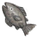
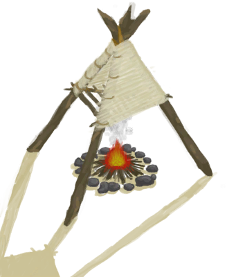

# 石斑鱼肉(未实装)  
> 做熟后味道会更好。  
  
<table class="table table-bordered" data-toggle="table"  data-show-header="false"><thead style="display:none"><tr ><th  style="width:50%;text-align:left;vertical-align:top;"  >title</th><th  style="width:50%;text-align:left;vertical-align:top;"  ></th></tr></thead><tr ><td  style="width:50%;text-align:left;vertical-align:top;"  >**重量：**100  **标签：**	[“可烹饪的”](tag_Cookable.md), [“饲料”](tag_Feed.md), [“鱼肉”](tag_Fish.md)</td><td  style="width:50%;text-align:left;vertical-align:top;"  >

<a href="GrouperMeat.md" style="color:black">石斑鱼肉</a>

</td></tr></tbody></table>  
  
## 获取来源  

** 使用**[“切割工具”](tag_Cutter.md)切割

[石斑鱼](Grouper.md)(未实装)

  
  
## 动作  

<table><tr><td rowspan="2" style="width:200px;text-align:center;font-size:1.3em;font-weight:bold">

食用

15分

</td><td>[“食用肉类动作(组)”](CarnivorousAction.md), [“进食动作(组)”](EatingAction.md)</td></tr><tr><td><b>自身：</b>→消失</td></tr><tr><td colspan="2"><b>状态变化：</b>[

[饱食](Satiation.md)](Satiation.md)<b>+15</b>, [

[胃](Stomach.md)](Stomach.md)<b>+14</b>, [

[水分](Hydration.md)](Hydration.md)<b>+4</b>, [

[情绪](Morale.md)](Morale.md)<b>-2</b>, [

[鱼类<nobr>厌倦度</nobr>](SaturationFish.md)](SaturationFish.md)<b>+30</b>, [

[污垢](Filth.md)](Filth.md)<b>+5</b>, [

[细菌性发烧](BacteriaFever.md)](BacteriaFever.md)<b>+0～+25</b></td></tr></table>
  
  
  
## 可拖入  

<table style="margin-bottom:0px;"><tr><td style="width:40%;text-align:left; background-color:#FEFEFE"><b>拖入：</b>[

[盐](Salt.md)](Salt.md)</td><td style="width:40%;font-size:1em;font-weight:bold;background-color:#FEFEFE">腌制石斑鱼 (15分) </td></tr><tr><td colspan="2"><b>需求：</b>[

[光亮](Light.md)](Light.md): <b>10-100</b></td></tr><tr style="background-color:#FFFFFF"><td style=""><b>使用物：</b>→消失</td><td style=""><b>自身：</b></td></tr></table>
  

<table style="margin-bottom:0px;"><tr><td style="width:40%;text-align:left; background-color:#FEFEFE"><b>拖入：</b>[“切割工具”](tag_Cutter.md)</td><td style="width:40%;font-size:1em;font-weight:bold;background-color:#FEFEFE">切成鱼片 (15分) </td></tr><tr><td colspan="2"><b>需求：</b>[

[光亮](Light.md)](Light.md): <b>10-100</b></td></tr><tr style="background-color:#FFFFFF"><td style=""><b>使用物：</b>使用次数  <b>-1(-0.67%)</b></td><td style=""><b>自身：</b>→消失</td></tr><tr><td colspan="2">[

[鱼片](FishSlices.md)](FishSlices.md)(<b>+1</b>)</td></tr></table>
  
  
## 可拖至  

[堆肥箱](CompostBin.md)

[烟熏炉](Smoker.md)

[烟熏炉(塑料布)(点燃)](SmokerPlastic.md)

[中陷阱的猕猴](CageTrapMacaque.md)

[忠犬朋友](DogFriend.md)

[猕猴朋友](MacaqueFriend.md)

[受伤的猕猴](MacaqueWounded.md)

  
  
## 可用于转化  
<table class="table table-bordered" data-toggle="table"  ><thead style=""><tr ><th  style="text-align:left;vertical-align:top;"  >转化为</th><th  style="text-align:left;vertical-align:top;"  >容器</th></tr></thead><tr ><td  style="text-align:left;vertical-align:top;"  >[

[烤石斑鱼](GrouperMeatCooked.md)](GrouperMeatCooked.md)</td><td  style="text-align:left;vertical-align:top;"  >[

[营火](Campfire.md)](Campfire.md)</td></tr><tr ><td  style="text-align:left;vertical-align:top;"  >[

[烤石斑鱼](GrouperMeatCooked.md)](GrouperMeatCooked.md)</td><td  style="text-align:left;vertical-align:top;"  >[

[粘土火盆](ClayFirePit.md)](ClayFirePit.md)</td></tr><tr ><td  style="text-align:left;vertical-align:top;"  >[

[烤石斑鱼](GrouperMeatCooked.md)](GrouperMeatCooked.md)</td><td  style="text-align:left;vertical-align:top;"  >[

[火堆](Fire.md)](Fire.md)</td></tr><tr ><td  style="text-align:left;vertical-align:top;"  >[

[烤石斑鱼](GrouperMeatCooked.md)](GrouperMeatCooked.md)</td><td  style="text-align:left;vertical-align:top;"  >[

[瓦斯炉(开)](GasCookerOn.md)](GasCookerOn.md)</td></tr><tr ><td  style="text-align:left;vertical-align:top;"  >[

[烤石斑鱼](GrouperMeatCooked.md)](GrouperMeatCooked.md)</td><td  style="text-align:left;vertical-align:top;"  >[

[火炉](Stove.md)](Stove.md)</td></tr><tr ><td  style="text-align:left;vertical-align:top;"  >[

[烤石斑鱼](GrouperMeatCooked.md)](GrouperMeatCooked.md)</td><td  style="text-align:left;vertical-align:top;"  >[

[烟熏炉](Smoker.md)](Smoker.md)</td></tr><tr ><td  style="text-align:left;vertical-align:top;"  >[

[烤石斑鱼](GrouperMeatCooked.md)](GrouperMeatCooked.md)</td><td  style="text-align:left;vertical-align:top;"  >[

[烟熏炉(塑料布)(点燃)](SmokerPlastic.md)](SmokerPlastic.md)</td></tr><tr ><td  style="text-align:left;vertical-align:top;"  >[

[烤石斑鱼](GrouperMeatCooked.md)](GrouperMeatCooked.md)</td><td  style="text-align:left;vertical-align:top;"  >[

[打火机（开）(开)](tq_Nc_DiasterBeason_Character_Lola_StartMaterials_LighterOn.md)](tq_Nc_DiasterBeason_Character_Lola_StartMaterials_LighterOn.md)</td></tr></tbody></table>  
  
## 属性   

<table style="margin-bottom:0px;"><tr><td style="width:30%;text-align:left; background-color:#FEFEFE;font-size:1.3em;font-weight:bold;">耐久</td><td style="font-size:1em;background-color:#FEFEFE">初始：192 每15分钟-1 , 最多需要：2天</td></tr><tr style="background-color:#FFFFFF"><td colspan=2>** 到达0时： ** 自身: → [

[腐烂物](RottenRemains.md)](RottenRemains.md)</td></tr></table>
  

