# “手部动作(组)”  

重置陷阱 [

[解除陷阱](CageTrapPlacedTriggered.md)](CageTrapPlacedTriggered.md)

重置陷阱 [

[解除陷阱(雌灰山鹑)](CageTrapPlacedTriggeredPartridgeFemale.md)](CageTrapPlacedTriggeredPartridgeFemale.md)

重置陷阱 [

[解除陷阱(雄灰山鹑)](CageTrapPlacedTriggeredPartridgeMale.md)](CageTrapPlacedTriggeredPartridgeMale.md)

重置陷阱 [

[解除陷阱(海鸥)](CageTrapPlacedTriggeredSeagull.md)](CageTrapPlacedTriggeredSeagull.md)

摧毁 [

[杏仁树田](CropPlotAlmondTree.md)](CropPlotAlmondTree.md)

摧毁 [

[芦荟田](CropPlotAloeVera.md)](CropPlotAloeVera.md)

摧毁 [

[香蕉树田](CropPlotBananaTree.md)](CropPlotBananaTree.md)

摧毁 [

[辣椒田](CropPlotChilies.md)](CropPlotChilies.md)

摧毁 [

[月季田](CropPlotChinaRose.md)](CropPlotChinaRose.md)

摧毁 [

[金鸡纳树田](CropPlotCinchonaTree.md)](CropPlotCinchonaTree.md)

摧毁 [

[咖啡田](CropPlotCoffee.md)](CropPlotCoffee.md)

摧毁 [

[姜田](CropPlotGinger.md)](CropPlotGinger.md)

摧毁 [

[茉莉花田](CropPlotJasmine.md)](CropPlotJasmine.md)

摧毁 [

[卡瓦胡椒田](CropPlotKava.md)](CropPlotKava.md)

摧毁 [

[柠檬草田](CropPlotLemonGrass.md)](CropPlotLemonGrass.md)

摧毁 [

[芒果树田](CropPlotMangoTree.md)](CropPlotMangoTree.md)

摧毁 [

[水椰树田](CropPlotNipaPalm.md)](CropPlotNipaPalm.md)

摧毁 [

[棕榈丛田](CropPlotPalmBush.md)](CropPlotPalmBush.md)

摧毁 [

[椰子树田](CropPlotPalmTree.md)](CropPlotPalmTree.md)

摧毁 [

[稻田](CropPlotRice.md)](CropPlotRice.md)

摧毁 [

[毁坏的田地](CropPlotRuined.md)](CropPlotRuined.md)

摧毁 [

[西米树田](CropPlotSagoPalm.md)](CropPlotSagoPalm.md)

摧毁 [

[蛇草田](CropPlotSnakeGrass.md)](CropPlotSnakeGrass.md)

摧毁 [

[蜘蛛兰田](CropPlotSpiderLily.md)](CropPlotSpiderLily.md)

摧毁 [

[大叶仙茅田](CropPlotWeevilLily.md)](CropPlotWeevilLily.md)

摧毁 [

[野枣田](CropPlotWildJujube.md)](CropPlotWildJujube.md)

摧毁 [

[参薯田](CropPlotYam.md)](CropPlotYam.md)

重置陷阱 [

[落石陷阱(未重置)](DeadfallTrapTriggered.md)](DeadfallTrapTriggered.md)

制作泥巴 [

[干土堆](DirtPile.md)](DirtPile.md)

碾碎干土 [

[干土堆](DirtPile.md)](DirtPile.md)

重置陷阱 [

[原木陷阱(未重置)](LogTrapTriggered.md)](LogTrapTriggered.md)

织布 [

[织布机](Loom.md)](Loom.md)

制作粘土 [

[泥堆](MudPile.md)](MudPile.md)

涂到身上 [

[泥堆](MudPile.md)](MudPile.md)

重置陷阱 [

[套索陷阱(未重置)](SnareTrapTriggered.md)](SnareTrapTriggered.md)

重置陷阱 [
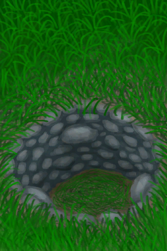
[陷坑](TrappingPitTriggered.md)](TrappingPitTriggered.md)

蓝图制造 [

[芦荟膏(蓝图)](Bp_AloeGel.md)](Bp_AloeGel.md)

蓝图制造 [

[箭矢(蓝图)](Bp_Arrow.md)](Bp_Arrow.md)

蓝图制造 [
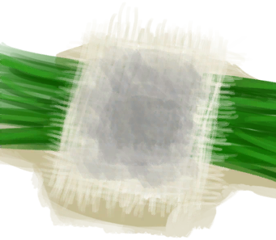
[草木灰敷料(蓝图)](Bp_AshDressing.md)](Bp_AshDressing.md)

蓝图制造 [

[简易床(蓝图)](Bp_BedRustic.md)](Bp_BedRustic.md)

蓝图制造 [

[木床(蓝图)](Bp_BedWooden.md)](Bp_BedWooden.md)

蓝图制造 [

[蜂箱(蓝图)](Bp_BeeSkep.md)](Bp_BeeSkep.md)

蓝图制造 [

[空蜂箱(蓝图)](Bp_BeeSkepEmpty.md)](Bp_BeeSkepEmpty.md)

蓝图制造 [

[熏蜂器(蓝图)](Bp_BeeSmoker.md)](Bp_BeeSmoker.md)

蓝图制造 [

[猪食槽(蓝图)](Bp_BoarFeeder.md)](Bp_BoarFeeder.md)

蓝图制造 [

[骨刀(蓝图)](Bp_BoneKnife.md)](Bp_BoneKnife.md)

蓝图制造 [

[书架(蓝图)](Bp_Bookshelf.md)](Bp_Bookshelf.md)

蓝图制造 [

[弓(蓝图)](Bp_Bow.md)](Bp_Bow.md)

蓝图制造 [

[弓钻(蓝图)](Bp_BowDrill.md)](Bp_BowDrill.md)

蓝图制造 [

[硫磺膏(蓝图)](Bp_BrimstoneGel.md)](Bp_BrimstoneGel.md)

蓝图制造 [

[扫帚(蓝图)](Bp_Broom.md)](Bp_Broom.md)

蓝图制造 [

[驱虫膏(蓝图)](Bp_BugRepellent.md)](Bp_BugRepellent.md)

蓝图制造 [

[诱捕笼(蓝图)](Bp_CageTrap.md)](Bp_CageTrap.md)

蓝图制造 [

[营火(蓝图)](Bp_Campfire.md)](Bp_Campfire.md)

蓝图制造 [

[蜡烛(蓝图)](Bp_Candles.md)](Bp_Candles.md)

蓝图制造 [

[香茅蜡烛(蓝图)](Bp_CandlesCitronella.md)](Bp_CandlesCitronella.md)

蓝图制造 [

[茉莉蜡烛(蓝图)](Bp_CandlesJasmine.md)](Bp_CandlesJasmine.md)

蓝图制造 [
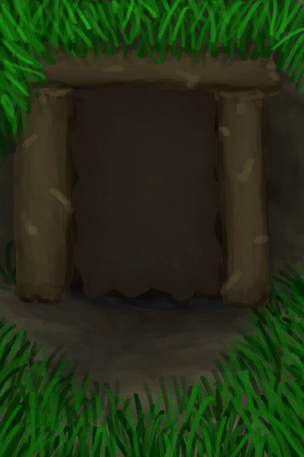
[地窖(蓝图)](Bp_Cellar.md)](Bp_Cellar.md)

蓝图制造 [

[仪式匕首(蓝图)](Bp_CeremonialDagger.md)](Bp_CeremonialDagger.md)

蓝图制造 [

[椅子(蓝图)](Bp_Chair.md)](Bp_Chair.md)

蓝图制造 [

[储物箱(蓝图)](Bp_Chest.md)](Bp_Chest.md)

蓝图制造 [

[水窖(蓝图)](Bp_Cistern.md)](Bp_Cistern.md)

蓝图制造 [

[堆肥箱(蓝图)](Bp_CompostBin.md)](Bp_CompostBin.md)

蓝图制造 [

[铜斧(蓝图)](Bp_CopperAxe.md)](Bp_CopperAxe.md)

蓝图制造 [

[铜板(蓝图)](Bp_CopperSheet.md)](Bp_CopperSheet.md)

蓝图制造 [

[铜铲(蓝图)](Bp_CopperShovel.md)](Bp_CopperShovel.md)

蓝图制造 [

[铜长矛(蓝图)](Bp_CopperSpear.md)](Bp_CopperSpear.md)

蓝图制造 [

[农田(蓝图)](Bp_CropPlot.md)](Bp_CropPlot.md)

蓝图制造 [

[落石陷阱(蓝图)](Bp_DeadfallTrap.md)](Bp_DeadfallTrap.md)

蓝图制造 [

[鼓(蓝图)](Bp_Drum.md)](Bp_Drum.md)

蓝图制造 [

[晾晒架(蓝图)](Bp_DryingRack.md)](Bp_DryingRack.md)

蓝图制造 [

[炸药(蓝图)](Bp_Dynamite.md)](Bp_Dynamite.md)

蓝图制造 [

[木质餐具(蓝图)](Bp_EatingUtensilsWooden.md)](Bp_EatingUtensilsWooden.md)

蓝图制造 [

[畜栏(蓝图)](Bp_Enclosure.md)](Bp_Enclosure.md)

蓝图制造 [

[鸟食(蓝图)](Bp_FeedBird.md)](Bp_FeedBird.md)

蓝图制造 [

[猪食(蓝图)](Bp_FeedBoar.md)](Bp_FeedBoar.md)

蓝图制造 [

[山羊饲料(蓝图)](Bp_FeedGoat.md)](Bp_FeedGoat.md)

蓝图制造 [
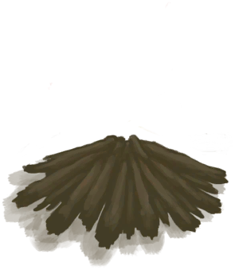
[火堆(蓝图)](Bp_Fire.md)](Bp_Fire.md)

蓝图制造 [

[鱼饵(蓝图)](Bp_FishBait.md)](Bp_FishBait.md)

蓝图制造 [

[捕鱼陷阱(蓝图)](Bp_FishTrap.md)](Bp_FishTrap.md)

蓝图制造 [

[钓鱼竿(蓝图)](Bp_FishingRod.md)](Bp_FishingRod.md)

蓝图制造 [

[鱼叉(蓝图)](Bp_FishingSpear.md)](Bp_FishingSpear.md)

蓝图制造 [

[燧石斧(蓝图)](Bp_FlintAxe.md)](Bp_FlintAxe.md)

蓝图制造 [

[燧石刀(蓝图)](Bp_FlintKnife.md)](Bp_FlintKnife.md)

蓝图制造 [

[燧石长矛(蓝图)](Bp_FlintSpear.md)](Bp_FlintSpear.md)

蓝图制造 [

[骨笛(蓝图)](Bp_FluteBone.md)](Bp_FluteBone.md)

蓝图制造 [

[木笛(蓝图)](Bp_FluteWooden.md)](Bp_FluteWooden.md)

蓝图制造 [

[熔炉(蓝图)](Bp_Forge.md)](Bp_Forge.md)

蓝图制造 [

[胶水(蓝图)](Bp_Glue.md)](Bp_Glue.md)

蓝图制造 [

[羊食槽(蓝图)](Bp_GoatFeeder.md)](Bp_GoatFeeder.md)

蓝图制造 [

[手钻(蓝图)](Bp_HandDrill.md)](Bp_HandDrill.md)

蓝图制造 [

[鱼镖(蓝图)](Bp_Harpoon.md)](Bp_Harpoon.md)

蓝图制造 [

[蜂蜜(蓝图)](Bp_Honey.md)](Bp_Honey.md)

蓝图制造 [

[窑炉(蓝图)](Bp_Kiln.md)](Bp_Kiln.md)

蓝图制造 [

[高级窑炉(蓝图)](Bp_KilnAdvanced.md)](Bp_KilnAdvanced.md)

蓝图制造 [

[叶床(蓝图)](Bp_Leafbed.md)](Bp_Leafbed.md)

蓝图制造 [

[蜥蜴皮手鼓(蓝图)](Bp_LizardDrum.md)](Bp_LizardDrum.md)

蓝图制造 [

[原木陷阱(蓝图)](Bp_LogTrap.md)](Bp_LogTrap.md)

蓝图制造 [

[织布机(蓝图)](Bp_Loom.md)](Bp_Loom.md)

蓝图制造 [

[人鱼巢(蓝图)](Bp_MermaidNest.md)](Bp_MermaidNest.md)

蓝图制造 [
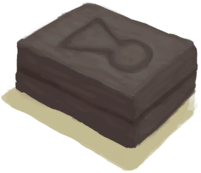
[斧头模具(蓝图)](Bp_MoldAxe.md)](Bp_MoldAxe.md)

蓝图制造 [

[装饰品模具(蓝图)](Bp_MoldDecoration.md)](Bp_MoldDecoration.md)

蓝图制造 [

[刀模具(蓝图)](Bp_MoldKnife.md)](Bp_MoldKnife.md)

蓝图制造 [

[铲头模具(蓝图)](Bp_MoldShovel.md)](Bp_MoldShovel.md)

蓝图制造 [

[矛头模具(蓝图)](Bp_MoldSpear.md)](Bp_MoldSpear.md)

蓝图制造 [

[砂浆(蓝图)](Bp_Mortar.md)](Bp_Mortar.md)

蓝图制造 [

[泥屋(蓝图)](Bp_MudHut.md)](Bp_MudHut.md)

蓝图制造 [

[菌床(蓝图)](Bp_MushroomBed.md)](Bp_MushroomBed.md)

蓝图制造 [

[硝石矿床(蓝图)](Bp_NiterBed.md)](Bp_NiterBed.md)

蓝图制造 [

[黑曜石刀(蓝图)](Bp_ObsidianKnife.md)](Bp_ObsidianKnife.md)

蓝图制造 [

[黑曜石长矛(蓝图)](Bp_ObsidianSpear.md)](Bp_ObsidianSpear.md)

蓝图制造 [

[灰山鹑喂食器(蓝图)](Bp_PartridgeFeeder.md)](Bp_PartridgeFeeder.md)

蓝图制造 [

[硫磺农药(蓝图)](Bp_PesticideBrimstone.md)](Bp_PesticideBrimstone.md)

蓝图制造 [

[辣椒农药(蓝图)](Bp_PesticideChilli.md)](Bp_PesticideChilli.md)

蓝图制造 [

[木板(蓝图)](Bp_Planks.md)](Bp_Planks.md)

蓝图制造 [

[陶轮(蓝图)](Bp_PotteryWheel.md)](Bp_PotteryWheel.md)

蓝图制造 [

[金鸡纳树皮粉(蓝图)](Bp_Quinine.md)](Bp_Quinine.md)

蓝图制造 [

[硫酸奎宁(蓝图)](Bp_QuinineSulfate.md)](Bp_QuinineSulfate.md)

蓝图制造 [

[木筏(蓝图)](Bp_Raft.md)](Bp_Raft.md)

蓝图制造 [
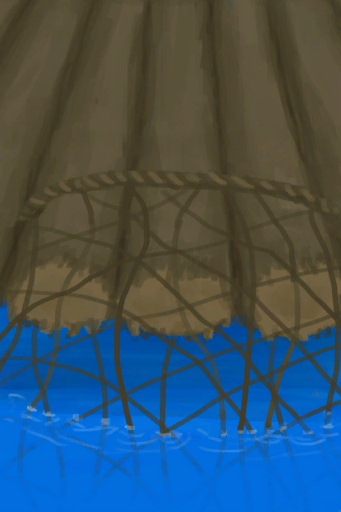
[捕捞拖网(蓝图)](Bp_RaftFishTrap.md)](Bp_RaftFishTrap.md)

蓝图制造 [

[木筏庇护所(蓝图)](Bp_RaftShelter.md)](Bp_RaftShelter.md)

蓝图制造 [

[集雨器(蓝图)](Bp_Raincatcher.md)](Bp_Raincatcher.md)

蓝图制造 [

[水稻田(蓝图)](Bp_RicePaddy.md)](Bp_RicePaddy.md)

蓝图制造 [
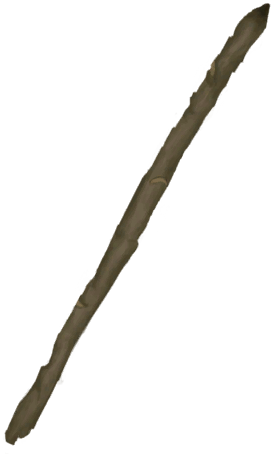
[简易长矛(蓝图)](Bp_RusticSpear.md)](Bp_RusticSpear.md)

蓝图制造 [

[盐田(蓝图)](Bp_SaltBed.md)](Bp_SaltBed.md)

蓝图制造 [

[稻草人(蓝图)](Bp_Scarecrow.md)](Bp_Scarecrow.md)

蓝图制造 [

[废金属斧(蓝图)](Bp_ScrapAxe.md)](Bp_ScrapAxe.md)

蓝图制造 [

[废金属刀(蓝图)](Bp_ScrapKnife.md)](Bp_ScrapKnife.md)

蓝图制造 [

[废金属铲(蓝图)](Bp_ScrapShovel.md)](Bp_ScrapShovel.md)

蓝图制造 [

[废金属长矛(蓝图)](Bp_ScrapSpear.md)](Bp_ScrapSpear.md)

蓝图制造 [

[石刀(蓝图)](Bp_SharpenedStone.md)](Bp_SharpenedStone.md)

蓝图制造 [

[棚屋(蓝图)](Bp_Shed.md)](Bp_Shed.md)

蓝图制造 [

[架子(蓝图)](Bp_Shelf.md)](Bp_Shelf.md)

蓝图制造 [

[窝棚(蓝图)](Bp_Shelter.md)](Bp_Shelter.md)

蓝图制造 [

[盾牌(蓝图)](Bp_Shield.md)](Bp_Shield.md)

蓝图制造 [

[淋浴器(蓝图)](Bp_Shower.md)](Bp_Shower.md)

蓝图制造 [

[投石索(蓝图)](Bp_Sling.md)](Bp_Sling.md)

蓝图制造 [

[套索陷阱(蓝图)](Bp_SnareTrap.md)](Bp_SnareTrap.md)

蓝图制造 [

[肥皂(蓝图)](Bp_Soap.md)](Bp_Soap.md)

蓝图制造 [

[太阳能蒸馏器(蓝图)](Bp_SolarStill.md)](Bp_SolarStill.md)

蓝图制造 [

[纺锤(蓝图)](Bp_Spindle.md)](Bp_Spindle.md)

蓝图制造 [

[夹板(蓝图)](Bp_Splint.md)](Bp_Splint.md)

蓝图制造 [

[石斧(蓝图)](Bp_StoneAxe.md)](Bp_StoneAxe.md)

蓝图制造 [

[石屋(蓝图)](Bp_StoneHut.md)](Bp_StoneHut.md)

蓝图制造 [

[火炉(蓝图)](Bp_Stove.md)](Bp_Stove.md)

蓝图制造 [

[补给箱(蓝图)](Bp_SupplyChest.md)](Bp_SupplyChest.md)

蓝图制造 [

[木桌(蓝图)](Bp_Table.md)](Bp_Table.md)

蓝图制造 [

[火把(蓝图)](Bp_Torch.md)](Bp_Torch.md)

蓝图制造 [

[止血带(蓝图)](Bp_Tourniquet.md)](Bp_Tourniquet.md)

蓝图制造 [

[简易止血带(蓝图)](Bp_TourniquetRustic.md)](Bp_TourniquetRustic.md)

蓝图制造 [

[陷坑(蓝图)](Bp_TrappingPit.md)](Bp_TrappingPit.md)

蓝图制造 [

[小拉车(蓝图)](Bp_Travois.md)](Bp_Travois.md)

蓝图制造 [

[木钉(蓝图)](Bp_Treenails.md)](Bp_Treenails.md)

蓝图制造 [

[硫酸(蓝图)](Bp_Vitriol.md)](Bp_Vitriol.md)

蓝图制造 [

[滤水器(蓝图)](Bp_WaterFilter.md)](Bp_WaterFilter.md)

蓝图制造 [

[蓄水池(蓝图)](Bp_WaterReservoir.md)](Bp_WaterReservoir.md)

蓝图制造 [
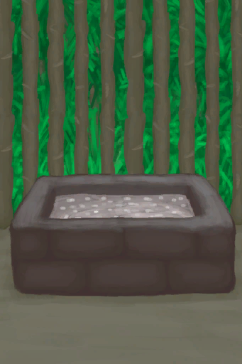
[水槽(蓝图)](Bp_WateringTrough.md)](Bp_WateringTrough.md)

蓝图制造 [

[水井(蓝图)](Bp_Well.md)](Bp_Well.md)

蓝图制造 [

[韦斯顿(蓝图)](Bp_Weston.md)](Bp_Weston.md)

蓝图制造 [

[木雕(蓝图)](Bp_WoodCarvings.md)](Bp_WoodCarvings.md)

蓝图制造 [

[木屑(蓝图)](Bp_WoodShavings.md)](Bp_WoodShavings.md)

蓝图制造 [
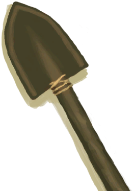
[木铲(蓝图)](Bp_WoodenShovel.md)](Bp_WoodenShovel.md)

蓝图制造 [

[背篓(蓝图)](Bp_WovenBackpack.md)](Bp_WovenBackpack.md)

蓝图制造 [

[编织篓(蓝图)](Bp_WovenBasket.md)](Bp_WovenBasket.md)

蓝图制造 [

[棕榈编织帽(蓝图)](Bp_WovenHat.md)](Bp_WovenHat.md)

蓝图制造 [

[睡袋(蓝图)](Bp_Bedroll.md)](Bp_Bedroll.md)

蓝图制造 [

[骨头汤(蓝图)](Bp_BoneBroth.md)](Bp_BoneBroth.md)

蓝图制造 [

[黄油(蓝图)](Bp_Butter.md)](Bp_Butter.md)

蓝图制造 [

[黄油焗牡蛎(蓝图)](Bp_ButterBakedOysters.md)](Bp_ButterBakedOysters.md)

蓝图制造 [

[姜糖(蓝图)](Bp_CandiedGinger.md)](Bp_CandiedGinger.md)

蓝图制造 [

[奶酪(蓝图)](Bp_Cheese.md)](Bp_Cheese.md)

蓝图制造 [

[鸡肉三明治(蓝图)](Bp_ChickenSandwich.md)](Bp_ChickenSandwich.md)

蓝图制造 [

[椰子鱼(蓝图)](Bp_CoconutFish.md)](Bp_CoconutFish.md)

蓝图制造 [

[椰奶(蓝图)](Bp_CoconutMilk.md)](Bp_CoconutMilk.md)

蓝图制造 [

[醉蟹(蓝图)](Bp_DrunkenCrab.md)](Bp_DrunkenCrab.md)

蓝图制造 [

[蛋炒饭(蓝图)](Bp_EggFriedRice.md)](Bp_EggFriedRice.md)

蓝图制造 [

[炸鱼薯条(蓝图)](Bp_FishNChips.md)](Bp_FishNChips.md)

蓝图制造 [

[鱼肉煎蛋饼(蓝图)](Bp_FishOmelette.md)](Bp_FishOmelette.md)

蓝图制造 [

[咸鱼(蓝图)](Bp_FishSalted.md)](Bp_FishSalted.md)

蓝图制造 [

[鱼肉塔可(蓝图)](Bp_FishTaco.md)](Bp_FishTaco.md)

蓝图制造 [

[炸香蕉(蓝图)](Bp_FriedBananas.md)](Bp_FriedBananas.md)

蓝图制造 [

[炒菇球(蓝图)](Bp_FriedPuffballs.md)](Bp_FriedPuffballs.md)

蓝图制造 [

[炖羊肉(蓝图)](Bp_GoatStew.md)](Bp_GoatStew.md)

蓝图制造 [

[肉食盛宴(蓝图)](Bp_HeartyFeast.md)](Bp_HeartyFeast.md)

蓝图制造 [

[蜜糖(蓝图)](Bp_HoneyCandy.md)](Bp_HoneyCandy.md)

蓝图制造 [

[蜜汁火腿(蓝图)](Bp_HoneyGlazedPork.md)](Bp_HoneyGlazedPork.md)

蓝图制造 [

[热带烤鸡(蓝图)](Bp_IslandChicken.md)](Bp_IslandChicken.md)

蓝图制造 [

[丛林沙拉(蓝图)](Bp_JungleSalad.md)](Bp_JungleSalad.md)

蓝图制造 [

[辣炒巨蜥肉(蓝图)](Bp_LizardFry.md)](Bp_LizardFry.md)

蓝图制造 [

[猕猴肉串(蓝图)](Bp_MacaqueSkewers.md)](Bp_MacaqueSkewers.md)

蓝图制造 [

[腌肉(蓝图)](Bp_MeatSalted.md)](Bp_MeatSalted.md)

蓝图制造 [

[蛋白棒(蓝图)](Bp_ProteinBar.md)](Bp_ProteinBar.md)

蓝图制造 [

[西米蛋糕(蓝图)](Bp_SagoCake.md)](Bp_SagoCake.md)

蓝图制造 [

[西米糕(蓝图)](Bp_SagoSlime.md)](Bp_SagoSlime.md)

蓝图制造 [

[海鲜杂烩(蓝图)](Bp_SeafoodCup.md)](Bp_SeafoodCup.md)

蓝图制造 [

[寿司(蓝图)](Bp_Sushi.md)](Bp_Sushi.md)

蓝图制造 [

[汤力水(蓝图)](Bp_TonicWater.md)](Bp_TonicWater.md)

蓝图制造 [

[参薯咖喱(蓝图)](Bp_YamCurry.md)](Bp_YamCurry.md)

蓝图制造 [

[参薯酱(蓝图)](Bp_YamJam.md)](Bp_YamJam.md)

蓝图制造 [

[蒸馏器(蓝图)](Bp_Alembic.md)](Bp_Alembic.md)

蓝图制造 [

[陶碗(蓝图)](Bp_ClayBowl.md)](Bp_ClayBowl.md)

蓝图制造 [

[粘土火盆(蓝图)](Bp_ClayFirePit.md)](Bp_ClayFirePit.md)

蓝图制造 [

[小陶罐(蓝图)](Bp_ClayJar.md)](Bp_ClayJar.md)

蓝图制造 [

[保鲜罐(蓝图)](Bp_ClayPotCooler.md)](Bp_ClayPotCooler.md)

蓝图制造 [

[陶罐(蓝图)](Bp_ClayVase.md)](Bp_ClayVase.md)

蓝图制造 [

[烹饪锅(蓝图)](Bp_CookingPot.md)](Bp_CookingPot.md)

蓝图制造 [

[釉面陶罐(蓝图)](Bp_GlazedVase.md)](Bp_GlazedVase.md)

蓝图制造 [

[防蜂服(蓝图)](Bp_BeeSuit.md)](Bp_BeeSuit.md)

蓝图制造 [

[风箱(蓝图)](Bp_Bellows.md)](Bp_Bellows.md)

蓝图制造 [

[椰子凉鞋(蓝图)](Bp_CoconutSandals.md)](Bp_CoconutSandals.md)

蓝图制造 [

[铜瓶(蓝图)](Bp_CopperBottle.md)](Bp_CopperBottle.md)

蓝图制造 [

[铜罐(蓝图)](Bp_CopperJar.md)](Bp_CopperJar.md)

蓝图制造 [

[铜项链(蓝图)](Bp_CopperNecklace.md)](Bp_CopperNecklace.md)

蓝图制造 [

[铜针(蓝图)](Bp_CopperNeedles.md)](Bp_CopperNeedles.md)

蓝图制造 [

[铜制餐具(蓝图)](Bp_EatingUtensilsCopper.md)](Bp_EatingUtensilsCopper.md)

蓝图制造 [

[鲜花项链(蓝图)](Bp_FlowerNecklace.md)](Bp_FlowerNecklace.md)

蓝图制造 [
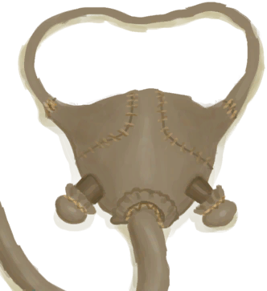
[防毒面具(蓝图)](Bp_GasMask.md)](Bp_GasMask.md)

蓝图制造 [

[吊床(蓝图)](Bp_Hammock.md)](Bp_Hammock.md)

蓝图制造 [

[草裙(蓝图)](Bp_LeafSkirt.md)](Bp_LeafSkirt.md)

蓝图制造 [

[皮革背包(蓝图)](Bp_LeatherBackpack.md)](Bp_LeatherBackpack.md)

蓝图制造 [

[皮革手套(蓝图)](Bp_LeatherGloves.md)](Bp_LeatherGloves.md)

蓝图制造 [

[皮裤(蓝图)](Bp_LeatherPants.md)](Bp_LeatherPants.md)

蓝图制造 [

[皮革鞋子(蓝图)](Bp_LeatherShoes.md)](Bp_LeatherShoes.md)

蓝图制造 [

[珍珠项链(蓝图)](Bp_PearlNecklace.md)](Bp_PearlNecklace.md)

蓝图制造 [

[箭筒(蓝图)](Bp_Quiver.md)](Bp_Quiver.md)

蓝图制造 [

[雨衣(蓝图)](Bp_Raincoat.md)](Bp_Raincoat.md)

蓝图制造 [

[布袋(蓝图)](Bp_Sack.md)](Bp_Sack.md)

蓝图制造 [

[挎包(蓝图)](Bp_Satchel.md)](Bp_Satchel.md)

蓝图制造 [

[海鸥护符(蓝图)](Bp_SeagullCharm.md)](Bp_SeagullCharm.md)

蓝图制造 [

[贝壳项链(蓝图)](Bp_SeashellNecklace.md)](Bp_SeashellNecklace.md)

蓝图制造 [

[鲨鱼头饰(蓝图)](Bp_SharkHeadpiece.md)](Bp_SharkHeadpiece.md)

蓝图制造 [

[衬衫(蓝图)](Bp_Shirt.md)](Bp_Shirt.md)

蓝图制造 [

[蓑衣(蓝图)](Bp_StrawCape.md)](Bp_StrawCape.md)

蓝图制造 [

[水袋(蓝图)](Bp_Waterskin.md)](Bp_Waterskin.md)

蓝图制造 [

[木针(蓝图)](Bp_WoodenNeedles.md)](Bp_WoodenNeedles.md)

蓝图制造 [

[家园标志](Imp_HomeSign.md)](Imp_HomeSign.md)

涂抹 [

[芦荟膏](AloeVeraGel.md)](AloeVeraGel.md)

涂抹 [

[芦荟叶](AloeVeraLeaf.md)](AloeVeraLeaf.md)

制作钩 [

[骨头碎片](BoneSplinters.md)](BoneSplinters.md)

制作针 [

[骨头碎片](BoneSplinters.md)](BoneSplinters.md)

制作钩 [

[鸟骨](BonesBird.md)](BonesBird.md)

制作针 [

[鸟骨](BonesBird.md)](BonesBird.md)

练习 [

[简易的弓](BowRustic.md)](BowRustic.md)

涂抹 [

[驱虫膏](BugRepellent.md)](BugRepellent.md)

制作绷带 [

[布](Cloth.md)](Cloth.md)

制作包脚布 [

[布](Cloth.md)](Cloth.md)

制作绑手带 [

[布](Cloth.md)](Cloth.md)

提取纤维 [

[椰子皮](CoconutHusk.md)](CoconutHusk.md)

练习投石 [

[燧石](Flint.md)](Flint.md)

制作绷带 [

[大叶仙茅叶片](WeevilLilyLeaves.md)](WeevilLilyLeaves.md)

练习 [

[投石索](Sling.md)](Sling.md)

洗个澡 [

[湿肥皂](SoapWet.md)](SoapWet.md)

练习投石 [

[石头](Stone.md)](Stone.md)

涂抹 [

[防晒霜](SunScreen.md)](SunScreen.md)

洗个澡 [

[潮汐池(岩滩)](TidePool.md)](TidePool.md)

洗个澡 [

[被淹没的潮汐池(岩滩)](TidePoolFlooded.md)](TidePoolFlooded.md)

训练 [

[扫帚](Broom.md)](Broom.md)

训练 [

[鱼镖](HarpoonBone.md)](HarpoonBone.md)

训练 [

[铜长矛](SpearCopper.md)](SpearCopper.md)

训练 [

[鱼叉](SpearFishing.md)](SpearFishing.md)

训练 [

[燧石长矛](SpearFlint.md)](SpearFlint.md)

训练 [

[黑曜石长矛](SpearObsidian.md)](SpearObsidian.md)

训练 [

[简易长矛](SpearRustic.md)](SpearRustic.md)

训练 [

[废金属长矛](SpearScrap.md)](SpearScrap.md)

洗个澡 [

[水](LQ_Water.md)](LQ_Water.md)

洗个澡 [

[盐水](LQ_WaterSalt.md)](LQ_WaterSalt.md)

洗个澡 [

[有毒的水](LQ_WaterToxic.md)](LQ_WaterToxic.md)

洗个澡 [

[不安全的水](LQ_WaterUnsafe.md)](LQ_WaterUnsafe.md)

洗个澡 [

[海水(覆溺洞穴)](Sea_Cave.md)](Sea_Cave.md)

挖 [

[坍塌的隧道入口(东部高地)](TunnelEntranceClosed.md)](TunnelEntranceClosed.md)

挖泥巴 [

[泥滩](MudDeposit.md)](MudDeposit.md)

堆沙堡 [

[沙堆(环礁)](SandSource.md)](SandSource.md)

洗个澡 [

[海(环礁)](Sea_Atoll.md)](Sea_Atoll.md)

洗个澡 [

[海(海湾)](Sea_Bay.md)](Sea_Bay.md)

洗个澡 [

[海(沙滩)](Sea_Beach.md)](Sea_Beach.md)

洗个澡 [

[海(隐秘港湾)](Sea_Cove.md)](Sea_Cove.md)

洗个澡 [

[海(荒芜沙滩)](Sea_DesolateBeach.md)](Sea_DesolateBeach.md)

洗个澡 [

[海(红树林)](Sea_Mangroves.md)](Sea_Mangroves.md)

洗个澡 [

[海](Sea_Raft.md)](Sea_Raft.md)

洗个澡 [

[海(鸟岩岛)](Sea_Rocks.md)](Sea_Rocks.md)

采集辣椒 [

[辣椒丛](ChiliPlant.md)](ChiliPlant.md)

采集 [

[咖啡丛](CoffeePlant.md)](CoffeePlant.md)

采集根部 [

[姜株](GingerPlant.md)](GingerPlant.md)

采集根部 [
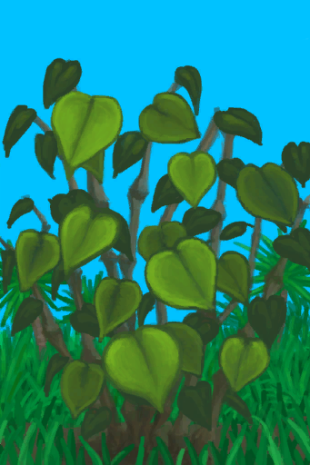
[卡瓦胡椒株](KavaPlant.md)](KavaPlant.md)

采集 [

[棕榈丛](PalmBush.md)](PalmBush.md)

采集 [

[蛇草丛](SnakegrassPatch.md)](SnakegrassPatch.md)

采集 [

[蜘蛛兰](SpiderLily.md)](SpiderLily.md)

刨参薯根 [

[野参薯](YamPlant.md)](YamPlant.md)

挖泥巴 [

[干涸的小水塘(湿地)](Puddle.md)](Puddle.md)

挖干土 [

[干涸的小水塘(湿地)](Puddle.md)](Puddle.md)

淋浴 [

[淋浴器](Shower.md)](Shower.md)

放置 [
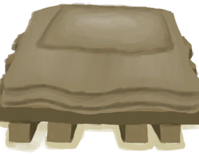
[木床（未放置）](BedWoodenDismantled.md)](BedWoodenDismantled.md)

拆解 [

[简易床](BedRustic.md)](BedRustic.md)

拆卸并搬起 [

[木床](BedWooden.md)](BedWooden.md)

拆解 [

[猪食槽](BoarFeeder.md)](BoarFeeder.md)

拆解 [

[猪食槽(空)](BoarFeederEmpty.md)](BoarFeederEmpty.md)

放置 [

[书架（未放置）](BookShelfDismantled.md)](BookShelfDismantled.md)

拆除 [

[诱捕笼](CageTrap.md)](CageTrap.md)

捡起 [

[诱捕笼](CageTrapPlaced.md)](CageTrapPlaced.md)

捡起 [

[解除陷阱](CageTrapPlacedTriggered.md)](CageTrapPlacedTriggered.md)

捡起 [

[解除陷阱(雌灰山鹑)](CageTrapPlacedTriggeredPartridgeFemale.md)](CageTrapPlacedTriggeredPartridgeFemale.md)

捡起 [

[解除陷阱(雄灰山鹑)](CageTrapPlacedTriggeredPartridgeMale.md)](CageTrapPlacedTriggeredPartridgeMale.md)

捡起 [

[解除陷阱(海鸥)](CageTrapPlacedTriggeredSeagull.md)](CageTrapPlacedTriggeredSeagull.md)

放置 [

[椅子](Chair.md)](Chair.md)

搬起 [

[椅子](ChairPlaced.md)](ChairPlaced.md)

拆解 [

[堆肥箱](CompostBin.md)](CompostBin.md)

采矿 [

[铜矿脉(洞穴上层)](CopperVein.md)](CopperVein.md)

拆除陷阱 [

[落石陷阱](DeadfallTrap.md)](DeadfallTrap.md)

拆除陷阱 [

[落石陷阱(未重置)](DeadfallTrapTriggered.md)](DeadfallTrapTriggered.md)

拆解 [

[晾晒架](DryingRack.md)](DryingRack.md)

拆除 [

[火炉(熄灭)](StoveExtinguished.md)](StoveExtinguished.md)

拆除 [

[捕鱼陷阱(未放置)](FishTrap.md)](FishTrap.md)

拆解 [

[羊食槽](GoatFeeder.md)](GoatFeeder.md)

拆解 [

[羊食槽(空)](GoatFeederEmpty.md)](GoatFeederEmpty.md)

切割成木材 [

[半根原木](HalfLog.md)](HalfLog.md)

切下塑料布 [

[没气的救生筏](LifeRaftDeflated.md)](LifeRaftDeflated.md)

截成两段 [

[原木](Log.md)](Log.md)

拆除陷阱 [

[原木陷阱](LogTrap.md)](LogTrap.md)

拆除陷阱 [

[原木陷阱(未重置)](LogTrapTriggered.md)](LogTrapTriggered.md)

扩大布匹 [

[织布机](Loom.md)](Loom.md)

拆卸织布机 [

[织布机（空）](LoomEmpty.md)](LoomEmpty.md)

制作泥砖 [

[泥堆](MudPile.md)](MudPile.md)

切下塑料布 [

[打开的降落伞](ParachuteDeployed.md)](ParachuteDeployed.md)

拆解 [

[灰山鹑喂食器](PartridgeFeeder.md)](PartridgeFeeder.md)

拆卸并搬起 [

[陶轮](PotteryWheel.md)](PotteryWheel.md)

放置 [

[陶轮（未放置）](PotteryWheelDismantled.md)](PotteryWheelDismantled.md)

拆解 [

[座椅](Seat.md)](Seat.md)

分离 [

[座椅](SeatAttached.md)](SeatAttached.md)

拆卸 [

[座椅](SeatPlaced.md)](SeatPlaced.md)

拆除陷阱 [

[套索陷阱](SnareTrap.md)](SnareTrap.md)

拆除陷阱 [

[套索陷阱(未重置)](SnareTrapTriggered.md)](SnareTrapTriggered.md)

拆卸并搬起 [

[木桌](Table.md)](Table.md)

放置 [

[木桌（未放置）](TableDismantled.md)](TableDismantled.md)

拆除陷阱 [

[陷坑](TrappingPit.md)](TrappingPit.md)

拆除陷阱 [

[陷坑](TrappingPitTriggered.md)](TrappingPitTriggered.md)

拆除 [

[水槽](WateringTrough.md)](WateringTrough.md)

穿线 [

[骨针](BoneNeedle.md)](BoneNeedle.md)

取下细线 [

[针线(骨针)](BoneNeedleThreaded.md)](BoneNeedleThreaded.md)

打碎 [

[骨头](Bones.md)](Bones.md)

碾碎 [

[木炭](Charcoal.md)](Charcoal.md)

制作碗 [

[粘土](Clay.md)](Clay.md)

撕开布料 [

[布](Cloth.md)](Cloth.md)

制作止血带 [

[布](Cloth.md)](Cloth.md)

临时防毒面具 [

[大块的布](ClothLarge.md)](ClothLarge.md)

撕开布料 [

[大块的布](ClothLarge.md)](ClothLarge.md)

制作草木灰敷料 [

[布片](ClothSmall.md)](ClothSmall.md)

撕开布料 [

[超大块布](ClothVeryLarge.md)](ClothVeryLarge.md)

拆解 [

[防蜂服](BeeSuit.md)](BeeSuit.md)

修复 [

[防蜂服](BeeSuit.md)](BeeSuit.md)

撕开布料 [

[包脚布](FootWrappings.md)](FootWrappings.md)

撕开布料 [

[绑手带](HandWrappings.md)](HandWrappings.md)

修复 [

[求生帽](HatSurvival.md)](HatSurvival.md)

撕开布料 [

[夏威夷衬衫](HawaiianShirt.md)](HawaiianShirt.md)

修复 [

[夏威夷衬衫](HawaiianShirt.md)](HawaiianShirt.md)

撕开布料 [

[头巾](HeadWrappings.md)](HeadWrappings.md)

撕开布料 [

[卫衣](HoodieRetromation.md)](HoodieRetromation.md)

修复 [

[卫衣](HoodieRetromation.md)](HoodieRetromation.md)

修理 [

[皮革手套](LeatherGloves.md)](LeatherGloves.md)

拆解 [

[皮裤](LeatherPants.md)](LeatherPants.md)

修复 [

[皮裤](LeatherPants.md)](LeatherPants.md)

修复 [

[皮革鞋子](LeatherShoes.md)](LeatherShoes.md)

修复 [

[军靴](MilitaryBoots.md)](MilitaryBoots.md)

撕开布料 [

[军裤](MilitaryPants.md)](MilitaryPants.md)

修复 [

[军裤](MilitaryPants.md)](MilitaryPants.md)

撕开布料 [布制裤子](PantsCloth.md)

修复 [布制裤子](PantsCloth.md)

修复 [

[珍珠项链](PearlNecklace.md)](PearlNecklace.md)

拆解 [

[雨衣](Raincoat.md)](Raincoat.md)

修复 [

[雨衣](Raincoat.md)](Raincoat.md)

修复 [

[鲨鱼头饰](SharkHeadpiece.md)](SharkHeadpiece.md)

撕开布料 [

[衬衫](ShirtFiber.md)](ShirtFiber.md)

修复 [

[衬衫](ShirtFiber.md)](ShirtFiber.md)

撕开布料 [

[短裤](Shorts.md)](Shorts.md)

修复 [

[短裤](Shorts.md)](Shorts.md)

修复 [

[运动鞋](Sneakers.md)](Sneakers.md)

撕开布料 [

[袜子](Socks.md)](Socks.md)

修复 [

[袜子](Socks.md)](Socks.md)

拆解 [

[蓑衣](StrawCape.md)](StrawCape.md)

撕开布料 [

[T恤](T-Shirt.md)](T-Shirt.md)

修复 [

[T恤](T-Shirt.md)](T-Shirt.md)

撕开布料 [

[内裤](Underwear.md)](Underwear.md)

修复 [

[内裤](Underwear.md)](Underwear.md)

给椰子钻孔 [

[椰子](Coconut.md)](Coconut.md)

敲开椰子 [

[椰子](Coconut.md)](Coconut.md)

刮椰肉 [

[半个椰子](CoconutHalf.md)](CoconutHalf.md)

剥 [

[青椰子](CoconutHusked.md)](CoconutHusked.md)

敲开椰子 [

[带孔椰子](CoconutPerforated.md)](CoconutPerforated.md)

敲开 [

[腐烂的椰子](CoconutRotten.md)](CoconutRotten.md)

敲碎海螺 [

[海螺](Conch.md)](Conch.md)

敲开 [

[铜制装饰品](CopperDecoration_Mold.md)](CopperDecoration_Mold.md)

穿线 [

[铜针](CopperNeedle.md)](CopperNeedle.md)

取下细线 [

[针线(铜针)](CopperNeedleThreaded.md)](CopperNeedleThreaded.md)

制作线团 [

[细线](CordFiber.md)](CordFiber.md)

钻木取火 [

[羽毛](Feathers.md)](Feathers.md)

钻木取火 [

[纤维](Fibers.md)](Fibers.md)

缠起来 [

[纤维](Fibers.md)](Fibers.md)

练习石工 [

[燧石](Flint.md)](Flint.md)

雕刻 [
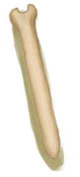
[未完成的骨笛](FluteBone_Unfinished.md)](FluteBone_Unfinished.md)

雕刻 [

[未完成的木笛](FluteWooden_Unfinished.md)](FluteWooden_Unfinished.md)

剖开 [

[北梭鱼](Bonefish.md)](Bonefish.md)

制作诱饵 [

[烤北梭鱼](BonefishCooked.md)](BonefishCooked.md)

制作诱饵 [

[北梭鱼肉](BonefishMeat.md)](BonefishMeat.md)

杀害 [

[中陷阱的猕猴](CageTrapMacaque.md)](CageTrapMacaque.md)

剥皮 [

[眼镜蛇尸体](CobraDead.md)](CobraDead.md)

采集咖啡豆 [

[咖啡果](CoffeeBerries.md)](CoffeeBerries.md)

敲松 [
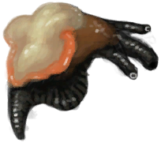
[海螺肉](ConchMeat.md)](ConchMeat.md)

制作诱饵 [

[鱼干](FishDried.md)](FishDried.md)

制作诱饵 [

[咸鱼](FishSalted.md)](FishSalted.md)

制作诱饵 [

[腌制中的咸鱼](FishSaltedDrying.md)](FishSaltedDrying.md)

捣碎 [

[姜](Ginger.md)](Ginger.md)

捣碎 [

[干姜](GingerDried.md)](GingerDried.md)

制作诱饵 [

[绯鲤](Goatfish.md)](Goatfish.md)

制作诱饵 [

[烤绯鲤](GoatfishCooked.md)](GoatfishCooked.md)

制作诱饵 [

[烟熏绯鲤](GoatfishSmoked.md)](GoatfishSmoked.md)

制作诱饵 [

[鲱鱼](Herring.md)](Herring.md)

制作诱饵 [

[烤鲱鱼](HerringCooked.md)](HerringCooked.md)

制作诱饵 [

[烟熏鲱鱼](HerringSmoked.md)](HerringSmoked.md)

捣碎 [

[茉莉花](JasmineFlowers.md)](JasmineFlowers.md)

捣碎 [

[卡瓦根](KavaRoot.md)](KavaRoot.md)

捣碎 [

[干燥的卡瓦根](KavaRootDried.md)](KavaRootDried.md)

切割 [

[大马鲅鱼](KingThreadfin.md)](KingThreadfin.md)

剥皮 [

[野猪尸体](BoarCarcass.md)](BoarCarcass.md)

剥皮 [

[小猪尸体](BoarCarcassPiglet.md)](BoarCarcassPiglet.md)

捡起 [

[母猪](BoarEnclosureFemale.md)](BoarEnclosureFemale.md)

宰杀 [

[母猪](BoarEnclosureFemale.md)](BoarEnclosureFemale.md)

捡起 [

[公猪](BoarEnclosureMale.md)](BoarEnclosureMale.md)

宰杀 [

[公猪](BoarEnclosureMale.md)](BoarEnclosureMale.md)

捡起 [

[小猪](BoarEnclosurePiglet.md)](BoarEnclosurePiglet.md)

宰杀 [

[小猪](BoarEnclosurePiglet.md)](BoarEnclosurePiglet.md)

剔肉 [

[剥皮的野猪](BoarSkinned.md)](BoarSkinned.md)

剔肉 [

[剥皮的小猪](BoarSkinnedPiglet.md)](BoarSkinnedPiglet.md)

宰杀 [

[母猪](BoarTiedFemale.md)](BoarTiedFemale.md)

宰杀 [

[公猪](BoarTiedMale.md)](BoarTiedMale.md)

宰杀 [

[小猪](BoarTiedPiglet.md)](BoarTiedPiglet.md)

杀害！ [

[忠犬朋友](DogFriend.md)](DogFriend.md)

剥皮 [

[山羊尸体(母)](GoatCarcassFemale.md)](GoatCarcassFemale.md)

剥皮 [

[小羊尸体](GoatCarcassKid.md)](GoatCarcassKid.md)

剥皮 [

[山羊尸体(公)](GoatCarcassMale.md)](GoatCarcassMale.md)

捆起来 [

[母山羊](GoatEnclosureFemale.md)](GoatEnclosureFemale.md)

宰杀 [

[母山羊](GoatEnclosureFemale.md)](GoatEnclosureFemale.md)

捆起来 [

[小羊](GoatEnclosureKid.md)](GoatEnclosureKid.md)

宰杀 [

[小羊](GoatEnclosureKid.md)](GoatEnclosureKid.md)

捆起来 [

[泌乳期山羊](GoatEnclosureLactating.md)](GoatEnclosureLactating.md)

宰杀 [

[泌乳期山羊](GoatEnclosureLactating.md)](GoatEnclosureLactating.md)

挤奶 [

[泌乳期山羊](GoatEnclosureLactating.md)](GoatEnclosureLactating.md)

捆起来 [

[公山羊](GoatEnclosureMale.md)](GoatEnclosureMale.md)

宰杀 [

[公山羊](GoatEnclosureMale.md)](GoatEnclosureMale.md)

剔肉 [

[剥皮的山羊](GoatSkinned.md)](GoatSkinned.md)

剔肉 [

[剥皮的小羊](GoatSkinnedKid.md)](GoatSkinnedKid.md)

宰杀 [

[母山羊](GoatTiedFemale.md)](GoatTiedFemale.md)

宰杀 [

[泌乳期山羊](GoatTiedFemaleLactating.md)](GoatTiedFemaleLactating.md)

宰杀 [

[小羊](GoatTiedKid.md)](GoatTiedKid.md)

宰杀 [

[公山羊](GoatTiedMale.md)](GoatTiedMale.md)

杀害！ [

[猕猴朋友](MacaqueFriend.md)](MacaqueFriend.md)

切割 [

[海怪尸体](SeahoundCarcass.md)](SeahoundCarcass.md)

切割 [

[鲨鱼尸体](SharkCarcass.md)](SharkCarcass.md)

捣碎 [

[柠檬草](LemongrassStalks.md)](LemongrassStalks.md)

剔肉 [
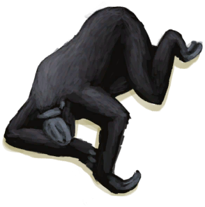
[猕猴尸体](MacaqueCarcass.md)](MacaqueCarcass.md)

解脱 [
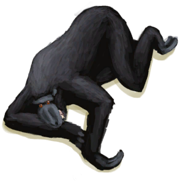
[受伤的猕猴](MacaqueWounded.md)](MacaqueWounded.md)

制作诱饵 [

[鹦哥鱼](ParrotFish.md)](ParrotFish.md)

制作诱饵 [

[烤鹦哥鱼](ParrotFishCooked.md)](ParrotFishCooked.md)

制作诱饵 [

[烟熏鹦哥鱼](ParrotFishSmoked.md)](ParrotFishSmoked.md)

采集 [

[灰山鹑遗骸](PartridgeCarcass.md)](PartridgeCarcass.md)

剖开 [

[灰山鹑尸体](PartridgeDead.md)](PartridgeDead.md)

剖开 [

[雌灰山鹑](PartridgeFemaleEnclosure.md)](PartridgeFemaleEnclosure.md)

剖开 [

[雌灰山鹑](PartridgeFemaleLive.md)](PartridgeFemaleLive.md)

剖开 [

[雄灰山鹑](PartridgeMaleEnclosure.md)](PartridgeMaleEnclosure.md)

剖开 [

[雄灰山鹑](PartridgeMaleLive.md)](PartridgeMaleLive.md)

剥皮 [
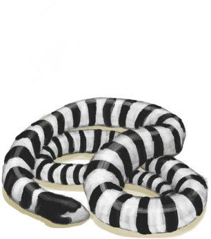
[海蛇尸体](SeaKraitDead.md)](SeaKraitDead.md)

处理 [

[海鸥遗骸](SeagullCarcass.md)](SeagullCarcass.md)

剖开 [

[海鸥尸体](SeagullDead.md)](SeagullDead.md)

制作诱饵 [

[烤鲨鱼肉](SharkCooked.md)](SharkCooked.md)

制作诱饵 [

[鲨鱼肉](SharkMeat.md)](SharkMeat.md)

提取纤维 [

[蛇草](SnakeGrass.md)](SnakeGrass.md)

捣碎 [

[蛇草](SnakeGrass.md)](SnakeGrass.md)

捣碎叶子 [

[蜘蛛兰叶](SpiderLilyLeaves.md)](SpiderLilyLeaves.md)

捣碎叶子 [

[干燥的蜘蛛兰叶](SpiderLilyLeavesDried.md)](SpiderLilyLeavesDried.md)

制作诱饵 [

[烤马鲅鱼](ThreadfinCooked.md)](ThreadfinCooked.md)

制作诱饵 [

[马鲅鱼肉](ThreadfinMeat.md)](ThreadfinMeat.md)

去皮并切开 [

[参薯](Yam.md)](Yam.md)

敲开 [

[晶洞](Geode.md)](Geode.md)

敲碎海螺 [

[大海螺](GiantConch.md)](GiantConch.md)

制作石斧 [

[木斧柄](HandleWood.md)](HandleWood.md)

拆卸并捡起 [

[书架](Bookshelf.md)](Bookshelf.md)

拆解 [

[挎包](Satchel.md)](Satchel.md)

拆解 [

[挎包(猎人专有)](SatchelHunter.md)](SatchelHunter.md)

拆解 [

[小拉车](Travois.md)](Travois.md)

钻木取火 [

[枯叶](LeavesDry.md)](LeavesDry.md)

剥皮 [

[巨蜥尸体](MonitorCarcass.md)](MonitorCarcass.md)

剔肉 [

[剥皮的巨蜥](MonitorSkinned.md)](MonitorSkinned.md)

敲碎 [

[煅烧后的砂浆](MortarBurnt.md)](MortarBurnt.md)

破坏 [

[泥砖](MudBrick.md)](MudBrick.md)

钻木取火 [

[鸟巢](Nest.md)](Nest.md)

取得种子 [

[水椰子](NipaFruit.md)](NipaFruit.md)

研磨 [

[硝石晶体](NiterCrystals.md)](NiterCrystals.md)

练习石工 [

[黑曜石](Obsidian.md)](Obsidian.md)

打开 [

[牡蛎](Oyster.md)](Oyster.md)

编织 [

[棕榈叶](PalmFronds.md)](PalmFronds.md)

钻木取火 [

[纸](Papers.md)](Papers.md)

拆开 [

[绳子](Rope.md)](Rope.md)

刮皮 [

[新鲜兽皮](SkinFresh.md)](SkinFresh.md)

刮皮 [

[蜥蜴生皮](SkinFreshReptile.md)](SkinFreshReptile.md)

折断长木棍 [

[长木棍](StickLong.md)](StickLong.md)

削成简易长矛 [

[长木棍](StickLong.md)](StickLong.md)

制作手钻 [

[小树枝](Sticks.md)](Sticks.md)

制作止血带 [

[小树枝](Sticks.md)](Sticks.md)

打磨石头 [

[石头](Stone.md)](Stone.md)

敲碎 [

[煅烧后的石头](StoneBurnt.md)](StoneBurnt.md)

打磨石头 [

[大石块](StoneHeavy.md)](StoneHeavy.md)

打磨石头 [

[硫磺石](StoneHeavyBrimstone.md)](StoneHeavyBrimstone.md)

敲碎 [

[煅烧后的大石块](StoneHeavyBurnt.md)](StoneHeavyBurnt.md)

拾海 [

[潮汐池(岩滩)](TidePool.md)](TidePool.md)

拆解 [

[废金属斧](AxeScrap.md)](AxeScrap.md)

磨利 [

[铜刀](KnifeCopper.md)](KnifeCopper.md)

磨利 [

[钝刀](KnifeCopperBlunt.md)](KnifeCopperBlunt.md)

磨利 [

[祖父的刀](KnifeGrandpa.md)](KnifeGrandpa.md)

磨利 [

[祖父的钝刀](KnifeGrandpaBlunt.md)](KnifeGrandpaBlunt.md)

磨利 [

[军刀](KnifeMilitary.md)](KnifeMilitary.md)

磨利 [

[钝刀](KnifeMilitaryBlunt.md)](KnifeMilitaryBlunt.md)

拆解 [

[废金属铲](ShovelScrap.md)](ShovelScrap.md)

拆解 [

[铜长矛](SpearCopper.md)](SpearCopper.md)

拆解 [

[燧石长矛](SpearFlint.md)](SpearFlint.md)

拆解 [

[黑曜石长矛](SpearObsidian.md)](SpearObsidian.md)

拆解 [

[废金属长矛](SpearScrap.md)](SpearScrap.md)

剥开杏仁 [

[热带杏仁](TropicalAlmonds.md)](TropicalAlmonds.md)

雕刻 [

[野猪牙](Tusk.md)](Tusk.md)

破开海胆 [

[海胆](Urchin.md)](Urchin.md)

杀害！ [

[韦斯顿](Weston.md)](Weston.md)

刨花 [

[木材](Wood.md)](Wood.md)

堆成火堆 [

[木材](Wood.md)](Wood.md)

雕刻 [

[未完成的木雕](WoodCarving_Unfinished.md)](WoodCarving_Unfinished.md)

钻木取火 [

[木屑](WoodShavings.md)](WoodShavings.md)

穿线 [

[木针](WoodenNeedle.md)](WoodenNeedle.md)

取下细线 [

[针线(木针)](WoodenNeedleThreaded.md)](WoodenNeedleThreaded.md)

用淡水清理 [

[擦伤](W_Abrasion.md)](W_Abrasion.md)

用蜂蜜水清理 [

[擦伤](W_Abrasion.md)](W_Abrasion.md)

用碱水清理 [

[擦伤](W_Abrasion.md)](W_Abrasion.md)

涂抹蜂蜜 [

[擦伤](W_Abrasion.md)](W_Abrasion.md)

用淡水清理 [

[左臂撕裂伤](W_ArmLacerationL.md)](W_ArmLacerationL.md)

用蜂蜜水清理 [

[左臂撕裂伤](W_ArmLacerationL.md)](W_ArmLacerationL.md)

用碱水清理 [

[左臂撕裂伤](W_ArmLacerationL.md)](W_ArmLacerationL.md)

涂抹蜂蜜 [

[左臂撕裂伤](W_ArmLacerationL.md)](W_ArmLacerationL.md)

缝合 [

[左臂撕裂伤](W_ArmLacerationL.md)](W_ArmLacerationL.md)

用淡水清理 [

[已缝合的左臂撕裂伤](W_ArmLacerationLStitched.md)](W_ArmLacerationLStitched.md)

用蜂蜜水清理 [

[已缝合的左臂撕裂伤](W_ArmLacerationLStitched.md)](W_ArmLacerationLStitched.md)

用碱水清理 [

[已缝合的左臂撕裂伤](W_ArmLacerationLStitched.md)](W_ArmLacerationLStitched.md)

涂抹蜂蜜 [

[已缝合的左臂撕裂伤](W_ArmLacerationLStitched.md)](W_ArmLacerationLStitched.md)

用淡水清理 [

[右臂撕裂伤](W_ArmLacerationR.md)](W_ArmLacerationR.md)

用蜂蜜水清理 [

[右臂撕裂伤](W_ArmLacerationR.md)](W_ArmLacerationR.md)

用碱水清理 [

[右臂撕裂伤](W_ArmLacerationR.md)](W_ArmLacerationR.md)

涂抹蜂蜜 [

[右臂撕裂伤](W_ArmLacerationR.md)](W_ArmLacerationR.md)

缝合 [

[右臂撕裂伤](W_ArmLacerationR.md)](W_ArmLacerationR.md)

用淡水清理 [

[已缝合的右臂撕裂伤](W_ArmLacerationRStitched.md)](W_ArmLacerationRStitched.md)

用蜂蜜水清理 [

[已缝合的右臂撕裂伤](W_ArmLacerationRStitched.md)](W_ArmLacerationRStitched.md)

用碱水清理 [

[已缝合的右臂撕裂伤](W_ArmLacerationRStitched.md)](W_ArmLacerationRStitched.md)

涂抹蜂蜜 [

[已缝合的右臂撕裂伤](W_ArmLacerationRStitched.md)](W_ArmLacerationRStitched.md)

用淡水清理 [

[狗咬伤](W_DogBite.md)](W_DogBite.md)

用蜂蜜水清理 [

[狗咬伤](W_DogBite.md)](W_DogBite.md)

用碱水清理 [

[狗咬伤](W_DogBite.md)](W_DogBite.md)

涂抹蜂蜜 [

[狗咬伤](W_DogBite.md)](W_DogBite.md)

用淡水清理 [

[左腿撕裂伤](W_LegLacerationL.md)](W_LegLacerationL.md)

用蜂蜜水清理 [

[左腿撕裂伤](W_LegLacerationL.md)](W_LegLacerationL.md)

用碱水清理 [

[左腿撕裂伤](W_LegLacerationL.md)](W_LegLacerationL.md)

涂抹蜂蜜 [

[左腿撕裂伤](W_LegLacerationL.md)](W_LegLacerationL.md)

缝合 [

[左腿撕裂伤](W_LegLacerationL.md)](W_LegLacerationL.md)

用淡水清理 [

[已缝合的左腿撕裂伤](W_LegLacerationLStitched.md)](W_LegLacerationLStitched.md)

用蜂蜜水清理 [

[已缝合的左腿撕裂伤](W_LegLacerationLStitched.md)](W_LegLacerationLStitched.md)

用碱水清理 [

[已缝合的左腿撕裂伤](W_LegLacerationLStitched.md)](W_LegLacerationLStitched.md)

涂抹蜂蜜 [

[已缝合的左腿撕裂伤](W_LegLacerationLStitched.md)](W_LegLacerationLStitched.md)

用淡水清理 [

[右腿撕裂伤](W_LegLacerationR.md)](W_LegLacerationR.md)

用蜂蜜水清理 [

[右腿撕裂伤](W_LegLacerationR.md)](W_LegLacerationR.md)

用碱水清理 [

[右腿撕裂伤](W_LegLacerationR.md)](W_LegLacerationR.md)

涂抹蜂蜜 [

[右腿撕裂伤](W_LegLacerationR.md)](W_LegLacerationR.md)

缝合 [

[右腿撕裂伤](W_LegLacerationR.md)](W_LegLacerationR.md)

用淡水清理 [

[已缝合的右腿撕裂伤](W_LegLacerationRStitched.md)](W_LegLacerationRStitched.md)

用蜂蜜水清理 [

[已缝合的右腿撕裂伤](W_LegLacerationRStitched.md)](W_LegLacerationRStitched.md)

用碱水清理 [

[已缝合的右腿撕裂伤](W_LegLacerationRStitched.md)](W_LegLacerationRStitched.md)

涂抹蜂蜜 [

[已缝合的右腿撕裂伤](W_LegLacerationRStitched.md)](W_LegLacerationRStitched.md)

用淡水清理 [

[猕猴咬伤](W_MacaqueBite.md)](W_MacaqueBite.md)

用蜂蜜水清理 [

[猕猴咬伤](W_MacaqueBite.md)](W_MacaqueBite.md)

用碱水清理 [

[猕猴咬伤](W_MacaqueBite.md)](W_MacaqueBite.md)

涂抹蜂蜜 [

[猕猴咬伤](W_MacaqueBite.md)](W_MacaqueBite.md)

用淡水清理 [

[轻微撕裂伤](W_MinorLaceration.md)](W_MinorLaceration.md)

用蜂蜜水清理 [

[轻微撕裂伤](W_MinorLaceration.md)](W_MinorLaceration.md)

用碱水清理 [

[轻微撕裂伤](W_MinorLaceration.md)](W_MinorLaceration.md)

涂抹蜂蜜 [

[轻微撕裂伤](W_MinorLaceration.md)](W_MinorLaceration.md)

缝合 [

[轻微撕裂伤](W_MinorLaceration.md)](W_MinorLaceration.md)

用淡水清理 [

[已缝合的轻微撕裂伤](W_MinorLacerationStitched.md)](W_MinorLacerationStitched.md)

用蜂蜜水清理 [

[已缝合的轻微撕裂伤](W_MinorLacerationStitched.md)](W_MinorLacerationStitched.md)

用碱水清理 [

[已缝合的轻微撕裂伤](W_MinorLacerationStitched.md)](W_MinorLacerationStitched.md)

涂抹蜂蜜 [

[已缝合的轻微撕裂伤](W_MinorLacerationStitched.md)](W_MinorLacerationStitched.md)

用淡水清理 [

[巨蜥咬伤](W_MonitorBite.md)](W_MonitorBite.md)

用蜂蜜水清理 [

[巨蜥咬伤](W_MonitorBite.md)](W_MonitorBite.md)

用碱水清理 [

[巨蜥咬伤](W_MonitorBite.md)](W_MonitorBite.md)

涂抹蜂蜜 [

[巨蜥咬伤](W_MonitorBite.md)](W_MonitorBite.md)

用淡水清理 [

[海怪刺伤](W_SeahoundSting.md)](W_SeahoundSting.md)

用蜂蜜水清理 [

[海怪刺伤](W_SeahoundSting.md)](W_SeahoundSting.md)

用碱水清理 [

[海怪刺伤](W_SeahoundSting.md)](W_SeahoundSting.md)

涂抹蜂蜜 [

[海怪刺伤](W_SeahoundSting.md)](W_SeahoundSting.md)

用淡水清理 [

[鲨鱼咬伤](W_SharkBite.md)](W_SharkBite.md)

用蜂蜜水清理 [

[鲨鱼咬伤](W_SharkBite.md)](W_SharkBite.md)

用碱水清理 [

[鲨鱼咬伤](W_SharkBite.md)](W_SharkBite.md)

涂抹蜂蜜 [

[鲨鱼咬伤](W_SharkBite.md)](W_SharkBite.md)

用淡水清理 [

[蜘蛛咬伤](W_SpiderBite.md)](W_SpiderBite.md)

用蜂蜜水清理 [

[蜘蛛咬伤](W_SpiderBite.md)](W_SpiderBite.md)

用碱水清理 [

[蜘蛛咬伤](W_SpiderBite.md)](W_SpiderBite.md)

涂抹蜂蜜 [

[蜘蛛咬伤](W_SpiderBite.md)](W_SpiderBite.md)

用淡水清理 [

[海胆刺伤](W_UrchinWound.md)](W_UrchinWound.md)

用蜂蜜水清理 [

[海胆刺伤](W_UrchinWound.md)](W_UrchinWound.md)

用碱水清理 [

[海胆刺伤](W_UrchinWound.md)](W_UrchinWound.md)

涂抹蜂蜜 [

[海胆刺伤](W_UrchinWound.md)](W_UrchinWound.md)

拆成细线 [

[线团](YarnFiber.md)](YarnFiber.md)

制作绳子 [

[线团](YarnFiber.md)](YarnFiber.md)

砍倒 [

[盛开的外星植物](AlienGrowth.md)](AlienGrowth.md)

砍倒 [

[外星植物](AlienGrowthCleared.md)](AlienGrowthCleared.md)

砍树 [
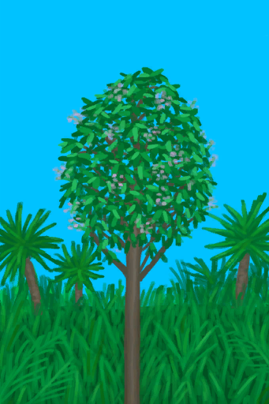
[金鸡纳树](CinchonaTree.md)](CinchonaTree.md)

采集树皮 [

[金鸡纳树](CinchonaTree.md)](CinchonaTree.md)

砍树 [

[剥净的金鸡纳树](CinchonaTreeCleared.md)](CinchonaTreeCleared.md)

打扫 [

[蝙蝠洞](CaveBats.md)](CaveBats.md)

打扫 [

[草原洞穴(洞穴)](CaveGrasslands.md)](CaveGrasslands.md)

打扫 [

[海蚀洞(洞穴)](CaveSea.md)](CaveSea.md)

打扫 [

[晶石洞穴(洞穴上层)](CrystalChamber.md)](CrystalChamber.md)

挖 [

[狭窄通道(洞穴底层)](CrystalChamberEntranceClosed.md)](CrystalChamberEntranceClosed.md)

打扫 [

[潮湿洞穴](DampChamber.md)](DampChamber.md)

挖 [

[狭窄通道(潮湿洞穴)](DarkCaveCaveEntranceClosed.md)](DarkCaveCaveEntranceClosed.md)

打扫 [

[黑暗(阴暗洞穴)](DarkChamber.md)](DarkChamber.md)

挖 [

[狭窄通道(洞穴中层)](DarkChamberCaveEntranceClosed.md)](DarkChamberCaveEntranceClosed.md)

打扫 [

[覆溺洞穴](FloodedChamber.md)](FloodedChamber.md)

挖 [

[狭窄通道(洞穴上层)](FloodedChamberEntranceClosed.md)](FloodedChamberEntranceClosed.md)

打扫 [

[洞穴上层](HighChamber.md)](HighChamber.md)

挖 [

[狭窄通道(隧道)](HighChamberEntranceClosed.md)](HighChamberEntranceClosed.md)

打扫 [

[洞穴底层](LowChamber.md)](LowChamber.md)

打扫 [

[洞穴中层](MidChamber.md)](MidChamber.md)

打扫 [

[狭窄隧道(洞穴上层)](NarrowTunnel.md)](NarrowTunnel.md)

打扫 [

[隧道](Tunnel.md)](Tunnel.md)

打扫 [

[潮汐洞](CaveTidal.md)](CaveTidal.md)

打扫 [

[地窖](Cellar.md)](Cellar.md)

打扫 [

[幽暗洞穴](DarkCave.md)](DarkCave.md)

打扫 [

[畜栏](Enclosure.md)](Enclosure.md)

打扫 [

[猕猴窝](MacaqueDen.md)](MacaqueDen.md)

打扫 [

[泥屋](MudHut.md)](MudHut.md)

打扫 [

[泥屋(损坏)](MudHutRuins.md)](MudHutRuins.md)

打扫 [

[飞机残骸(坠毁的飞机)](PlaneCrash.md)](PlaneCrash.md)

打扫 [

[棚屋](Shed.md)](Shed.md)

打扫 [

[石屋](StoneHut.md)](StoneHut.md)

砍树 [

[小芒果树](MangoTreeYoung.md)](MangoTreeYoung.md)

砍伐木材 [

[丛林深处](DeepJungle.md)](DeepJungle.md)

挖土 [

[东部草原](GrasslandsE.md)](GrasslandsE.md)

挖土 [

[西部草原](GrasslandsW.md)](GrasslandsW.md)

砍伐木材 [

[东部高地](HighlandsEastern.md)](HighlandsEastern.md)

砍伐木材 [

[西部高地](HighlandsWestern.md)](HighlandsWestern.md)

砍伐木材 [

[丛林](Jungle.md)](Jungle.md)

砍伐木材 [

[丛林高地](JungleHighlands.md)](JungleHighlands.md)

砍伐木材 [

[红树林](Mangroves.md)](Mangroves.md)

砍伐木材 [

[丛林边缘](Outskirts.md)](Outskirts.md)

收集沙子 [

[沙堆(环礁)](SandSource.md)](SandSource.md)

挖沙 [

[沙堆(环礁)](SandSource.md)](SandSource.md)

叉鱼 [

[海(环礁)](Sea_Atoll.md)](Sea_Atoll.md)

叉鱼 [

[海(海湾)](Sea_Bay.md)](Sea_Bay.md)

叉鱼 [

[海(沙滩)](Sea_Beach.md)](Sea_Beach.md)

叉鱼 [

[海(隐秘港湾)](Sea_Cove.md)](Sea_Cove.md)

叉鱼 [

[海(荒芜沙滩)](Sea_DesolateBeach.md)](Sea_DesolateBeach.md)

叉鱼 [

[海(红树林)](Sea_Mangroves.md)](Sea_Mangroves.md)

叉鱼 [

[海](Sea_Raft.md)](Sea_Raft.md)

叉鱼 [

[海(鸟岩岛)](Sea_Rocks.md)](Sea_Rocks.md)

挖土 [

[神秘谷](SecretValley.md)](SecretValley.md)

砍伐木材 [

[湿地丛林(湿地)](Wetlands.md)](Wetlands.md)

砍树 [

[幼年椰子树](PalmTreeYoung.md)](PalmTreeYoung.md)

砍树 [

[摘光的香蕉树](BananaTreeCleared.md)](BananaTreeCleared.md)

砍树 [

[大树](LargeTree.md)](LargeTree.md)

修整原木 [

[倒下的大树](LargeTreeFelled.md)](LargeTreeFelled.md)

砍树 [

[摘光的芒果树](MangoTreeCleared.md)](MangoTreeCleared.md)

砍倒 [

[摘完的椰子树](PalmTreeCleared.md)](PalmTreeCleared.md)

清除 [

[倒下的棕榈树](PalmTreeFelled.md)](PalmTreeFelled.md)

砍倒 [

[椰子树](PalmTreeNew.md)](PalmTreeNew.md)

扔石头 [

[椰子树](PalmTreeNew.md)](PalmTreeNew.md)

派出猕猴 [

[椰子树](PalmTreeNew.md)](PalmTreeNew.md)

砍倒 [

[椰子树(多事件旧)](PalmTreeNewMultiEventOld.md)](PalmTreeNewMultiEventOld.md)

砍倒 [

[椰子树(旧)](PalmTreeOld.md)](PalmTreeOld.md)

击中椰子 [

[椰子树(旧)](PalmTreeOld.md)](PalmTreeOld.md)

派出猕猴 [

[椰子树(旧)](PalmTreeOld.md)](PalmTreeOld.md)

砍倒 [

[树液收集处](PalmTreeSapStation.md)](PalmTreeSapStation.md)

砍倒 [

[树液补给点(空)](PalmTreeSapStationEmpty.md)](PalmTreeSapStationEmpty.md)

砍树 [

[西米树](SagoPalm.md)](SagoPalm.md)

从中劈开 [

[倒下的西米树](SagoPalmFelled.md)](SagoPalmFelled.md)

刮取树芯 [

[劈开的西米树干](SagoSplitLog.md)](SagoSplitLog.md)

摘热带杏仁 [

[热带杏仁树](TropicalAlmondTree.md)](TropicalAlmondTree.md)

砍树 [

[摘光的热带杏仁树](TropicalAlmondTreeCleared.md)](TropicalAlmondTreeCleared.md)

清理树枝 [

[倒下的热带杏仁树](TropicalAlmondTreeFelled.md)](TropicalAlmondTreeFelled.md)

拆解 [

[雨水收集器](RainCatcher.md)](RainCatcher.md)

砍树 [

[小棕榈树](SmallPalm.md)](SmallPalm.md)

砍树 [

[小树](SmallTree.md)](SmallTree.md)

砍树 [

[小杏仁树](TropicalAlmondTreeYoung.md)](TropicalAlmondTreeYoung.md)

拆除 [

[滤水器](WaterFilter.md)](WaterFilter.md)

砍倒 [

[野枣丛](WildJujube.md)](WildJujube.md)

砍倒 [

[摘光的野枣从](WildJujubeCleared.md)](WildJujubeCleared.md)

  
  

