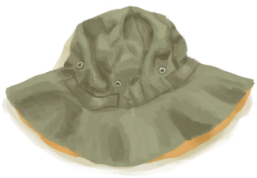

# 绝热  
> 保护你免受高温的影响。  
  

<b>基础值: </b> 0 
  

<b>变化范围: </b> 0 ~ 0 
  

<b>基础变化率: </b> 无 
  
## 阶段  

<table><tr style="height:2em;"><td style="background-color:#F0F0F0;text-align:center;width:180px;font-size:1.4em;font-weight:bold;vertical-align:middle;">
5 ～ 10

</td><td colspan=2 style="font-size:1.1em;vertical-align:middle;background-color:#F9F9F9;">
<b>

1级</b>

</td></tr><tr><td colspan=2><b>影响：</b>[

[过热](Hyperthermia.md)](Hyperthermia.md)加成<b>-24</b></td></tr><tr><td colspan=2></td></tr><tr style="height:2em;"><td style="background-color:#F0F0F0;text-align:center;width:180px;font-size:1.4em;font-weight:bold;vertical-align:middle;">
11 ～ 20

</td><td colspan=2 style="font-size:1.1em;vertical-align:middle;background-color:#F9F9F9;">
<b>

2级</b>

</td></tr><tr><td colspan=2><b>影响：</b>[

[过热](Hyperthermia.md)](Hyperthermia.md)加成<b>-26</b></td></tr><tr><td colspan=2></td></tr><tr style="height:2em;"><td style="background-color:#F0F0F0;text-align:center;width:180px;font-size:1.4em;font-weight:bold;vertical-align:middle;">
21 ～ 30

</td><td colspan=2 style="font-size:1.1em;vertical-align:middle;background-color:#F9F9F9;">
<b>

3级</b>

</td></tr><tr><td colspan=2><b>影响：</b>[

[过热](Hyperthermia.md)](Hyperthermia.md)加成<b>-28</b></td></tr><tr><td colspan=2></td></tr><tr style="height:2em;"><td style="background-color:#F0F0F0;text-align:center;width:180px;font-size:1.4em;font-weight:bold;vertical-align:middle;">
31 ～ 40

</td><td colspan=2 style="font-size:1.1em;vertical-align:middle;background-color:#F9F9F9;">
<b>

4级</b>

</td></tr><tr><td colspan=2><b>影响：</b>[

[过热](Hyperthermia.md)](Hyperthermia.md)加成<b>-30</b></td></tr><tr><td colspan=2></td></tr><tr style="height:2em;"><td style="background-color:#F0F0F0;text-align:center;width:180px;font-size:1.4em;font-weight:bold;vertical-align:middle;">
41 ～ 50

</td><td colspan=2 style="font-size:1.1em;vertical-align:middle;background-color:#F9F9F9;">
<b>

5级</b>

</td></tr><tr><td colspan=2><b>影响：</b>[

[过热](Hyperthermia.md)](Hyperthermia.md)加成<b>-40</b></td></tr><tr><td colspan=2></td></tr></table>
  
## 加成值影响因素  
<table class="table table-bordered" data-toggle="table"  ><thead style=""><tr ><th  style="text-align:left;vertical-align:top;"  >来源</th><th  style="text-align:left;vertical-align:top;"  >操作</th><th  style="text-align:left;vertical-align:top;"  >值</th></tr></thead><tr ><td  style="text-align:left;vertical-align:top;"  >[火山(环境)](Env_AcidLake.md)</td><td  style="text-align:left;vertical-align:top;"  >被动效果</td><td  style="text-align:left;vertical-align:top;"  >加成+0</td></tr><tr ><td  style="text-align:left;vertical-align:top;"  >[东部高地(环境)](Env_HighlandsEastern.md)</td><td  style="text-align:left;vertical-align:top;"  >被动效果</td><td  style="text-align:left;vertical-align:top;"  >加成+0</td></tr><tr ><td  style="text-align:left;vertical-align:top;"  >[火山(环境)](Env_Volcano.md)</td><td  style="text-align:left;vertical-align:top;"  >被动效果</td><td  style="text-align:left;vertical-align:top;"  >加成+0</td></tr></tbody></table>  
  
## 可被以下操作改变  
<table class="table table-bordered" data-toggle="table"  ><thead style=""><tr ><th  style="text-align:left;vertical-align:top;"  >来源</th><th  style="text-align:left;vertical-align:top;"  >操作</th><th  style="text-align:left;vertical-align:top;"  data-sortable="true"  >值</th></tr></thead><tr ><td  style="text-align:left;vertical-align:top;"  >[

[晶石洞穴(环境)](Env_CrystalChamber.md)](Env_CrystalChamber.md)</td><td  style="text-align:left;vertical-align:top;"  >被动效果</td><td  style="text-align:left;vertical-align:top;"  >6</td></tr><tr ><td  style="text-align:left;vertical-align:top;"  >[

[潮湿洞穴(环境)](Env_DampChamber.md)](Env_DampChamber.md)</td><td  style="text-align:left;vertical-align:top;"  >被动效果</td><td  style="text-align:left;vertical-align:top;"  >6</td></tr><tr ><td  style="text-align:left;vertical-align:top;"  >[

[阴暗洞穴(环境)](Env_DarkChamber.md)](Env_DarkChamber.md)</td><td  style="text-align:left;vertical-align:top;"  >被动效果</td><td  style="text-align:left;vertical-align:top;"  >6</td></tr><tr ><td  style="text-align:left;vertical-align:top;"  >[

[覆溺洞穴(环境)](Env_FloodedChamber.md)](Env_FloodedChamber.md)</td><td  style="text-align:left;vertical-align:top;"  >被动效果</td><td  style="text-align:left;vertical-align:top;"  >6</td></tr><tr ><td  style="text-align:left;vertical-align:top;"  >[

[洞穴上层(环境)](Env_HighChamber.md)](Env_HighChamber.md)</td><td  style="text-align:left;vertical-align:top;"  >被动效果</td><td  style="text-align:left;vertical-align:top;"  >6</td></tr><tr ><td  style="text-align:left;vertical-align:top;"  >[

[洞穴底层(环境)](Env_LowChamber.md)](Env_LowChamber.md)</td><td  style="text-align:left;vertical-align:top;"  >被动效果</td><td  style="text-align:left;vertical-align:top;"  >6</td></tr><tr ><td  style="text-align:left;vertical-align:top;"  >[

[洞穴中层(环境)](Env_MidChamber.md)](Env_MidChamber.md)</td><td  style="text-align:left;vertical-align:top;"  >被动效果</td><td  style="text-align:left;vertical-align:top;"  >6</td></tr><tr ><td  style="text-align:left;vertical-align:top;"  >[

[狭窄通道(环境)](Env_NarrowTunnel.md)](Env_NarrowTunnel.md)</td><td  style="text-align:left;vertical-align:top;"  >被动效果</td><td  style="text-align:left;vertical-align:top;"  >6</td></tr><tr ><td  style="text-align:left;vertical-align:top;"  >[

[地窖(环境)](Env_Cellar.md)](Env_Cellar.md)</td><td  style="text-align:left;vertical-align:top;"  >被动效果</td><td  style="text-align:left;vertical-align:top;"  >6</td></tr><tr ><td  style="text-align:left;vertical-align:top;"  >[

[窝棚](Shelter.md)](Shelter.md)</td><td  style="text-align:left;vertical-align:top;"  >被动效果</td><td  style="text-align:left;vertical-align:top;"  >5</td></tr><tr ><td  style="text-align:left;vertical-align:top;"  >[

[有遮蔽的叶床](ShelteredLeafBed.md)](ShelteredLeafBed.md)</td><td  style="text-align:left;vertical-align:top;"  >被动效果</td><td  style="text-align:left;vertical-align:top;"  >5</td></tr><tr ><td  style="text-align:left;vertical-align:top;"  >[

[木筏庇护所](RaftShelter.md)](RaftShelter.md)</td><td  style="text-align:left;vertical-align:top;"  >被动效果</td><td  style="text-align:left;vertical-align:top;"  >5</td></tr><tr ><td  style="text-align:left;vertical-align:top;"  >[

[隧道(环境)](Env_Tunnel.md)](Env_Tunnel.md)</td><td  style="text-align:left;vertical-align:top;"  >被动效果</td><td  style="text-align:left;vertical-align:top;"  >3</td></tr><tr ><td  style="text-align:left;vertical-align:top;"  >[

[蝙蝠洞(环境)](Env_CaveBats.md)](Env_CaveBats.md)</td><td  style="text-align:left;vertical-align:top;"  >被动效果</td><td  style="text-align:left;vertical-align:top;"  >3</td></tr><tr ><td  style="text-align:left;vertical-align:top;"  >[

[幽暗洞穴(环境)](Env_CaveDark.md)](Env_CaveDark.md)</td><td  style="text-align:left;vertical-align:top;"  >被动效果</td><td  style="text-align:left;vertical-align:top;"  >3</td></tr><tr ><td  style="text-align:left;vertical-align:top;"  >[洞穴(环境)](Env_CaveGrasslands.md)</td><td  style="text-align:left;vertical-align:top;"  >被动效果</td><td  style="text-align:left;vertical-align:top;"  >3</td></tr><tr ><td  style="text-align:left;vertical-align:top;"  >[洞穴(环境)](Env_CaveSea.md)</td><td  style="text-align:left;vertical-align:top;"  >被动效果</td><td  style="text-align:left;vertical-align:top;"  >3</td></tr><tr ><td  style="text-align:left;vertical-align:top;"  >[潮汐洞(环境)](Env_CaveTidal.md)</td><td  style="text-align:left;vertical-align:top;"  >被动效果</td><td  style="text-align:left;vertical-align:top;"  >3</td></tr><tr ><td  style="text-align:left;vertical-align:top;"  >[

[坠毁的飞机(环境)](Env_CrashedPlane.md)](Env_CrashedPlane.md)</td><td  style="text-align:left;vertical-align:top;"  >被动效果</td><td  style="text-align:left;vertical-align:top;"  >3</td></tr><tr ><td  style="text-align:left;vertical-align:top;"  >[坑洞(环境)](Env_HighlandHole.md)</td><td  style="text-align:left;vertical-align:top;"  >被动效果</td><td  style="text-align:left;vertical-align:top;"  >3</td></tr><tr ><td  style="text-align:left;vertical-align:top;"  >[

[猕猴窝(环境)](Env_MacaqueDen.md)](Env_MacaqueDen.md)</td><td  style="text-align:left;vertical-align:top;"  >被动效果</td><td  style="text-align:left;vertical-align:top;"  >3</td></tr><tr ><td  style="text-align:left;vertical-align:top;"  >[

[泥屋(环境)](Env_MudHut.md)](Env_MudHut.md)</td><td  style="text-align:left;vertical-align:top;"  >被动效果</td><td  style="text-align:left;vertical-align:top;"  >3</td></tr><tr ><td  style="text-align:left;vertical-align:top;"  >[

[泥屋(损坏)(环境)](Env_MudHutRuins.md)](Env_MudHutRuins.md)</td><td  style="text-align:left;vertical-align:top;"  >被动效果</td><td  style="text-align:left;vertical-align:top;"  >3</td></tr><tr ><td  style="text-align:left;vertical-align:top;"  >[

[棚屋(环境)](Env_Shed.md)](Env_Shed.md)</td><td  style="text-align:left;vertical-align:top;"  >被动效果</td><td  style="text-align:left;vertical-align:top;"  >3</td></tr><tr ><td  style="text-align:left;vertical-align:top;"  >[

[石屋(环境)](Env_StoneHut.md)](Env_StoneHut.md)</td><td  style="text-align:left;vertical-align:top;"  >被动效果</td><td  style="text-align:left;vertical-align:top;"  >3</td></tr><tr ><td  style="text-align:left;vertical-align:top;"  >[

[湿地(环境)](Env_Wetlands.md)](Env_Wetlands.md)</td><td  style="text-align:left;vertical-align:top;"  >被动效果</td><td  style="text-align:left;vertical-align:top;"  >3</td></tr><tr ><td  style="text-align:left;vertical-align:top;"  >[

[求生帽](HatSurvival.md)](HatSurvival.md)</td><td  style="text-align:left;vertical-align:top;"  >被动效果</td><td  style="text-align:left;vertical-align:top;"  >2</td></tr><tr ><td  style="text-align:left;vertical-align:top;"  >[

[棕榈编织帽](HatWoven.md)](HatWoven.md)</td><td  style="text-align:left;vertical-align:top;"  >被动效果</td><td  style="text-align:left;vertical-align:top;"  >2</td></tr><tr ><td  style="text-align:left;vertical-align:top;"  >[

[丛林深处(环境)](Env_DeepJungle.md)](Env_DeepJungle.md)</td><td  style="text-align:left;vertical-align:top;"  >被动效果</td><td  style="text-align:left;vertical-align:top;"  >2</td></tr><tr ><td  style="text-align:left;vertical-align:top;"  >[

[西部高地(环境)](Env_HighlandsWestern.md)](Env_HighlandsWestern.md)</td><td  style="text-align:left;vertical-align:top;"  >被动效果</td><td  style="text-align:left;vertical-align:top;"  >2</td></tr><tr ><td  style="text-align:left;vertical-align:top;"  >[

[丛林(环境)](Env_Jungle.md)](Env_Jungle.md)</td><td  style="text-align:left;vertical-align:top;"  >被动效果</td><td  style="text-align:left;vertical-align:top;"  >2</td></tr><tr ><td  style="text-align:left;vertical-align:top;"  >[

[丛林高地(环境)](Env_JungleHighlands.md)](Env_JungleHighlands.md)</td><td  style="text-align:left;vertical-align:top;"  >被动效果</td><td  style="text-align:left;vertical-align:top;"  >2</td></tr><tr ><td  style="text-align:left;vertical-align:top;"  >[

[红树林(环境)](Env_Mangroves.md)](Env_Mangroves.md)</td><td  style="text-align:left;vertical-align:top;"  >被动效果</td><td  style="text-align:left;vertical-align:top;"  >2</td></tr><tr ><td  style="text-align:left;vertical-align:top;"  >[

[丛林边缘(环境)](Env_Outskirts.md)](Env_Outskirts.md)</td><td  style="text-align:left;vertical-align:top;"  >被动效果</td><td  style="text-align:left;vertical-align:top;"  >2</td></tr><tr ><td  style="text-align:left;vertical-align:top;"  >[

[坍塌的屋顶(泥屋)](Dmg_RoofCollapsed.md)](Dmg_RoofCollapsed.md)</td><td  style="text-align:left;vertical-align:top;"  >被动效果</td><td  style="text-align:left;vertical-align:top;"  >-3</td></tr></tbody></table>  
  

