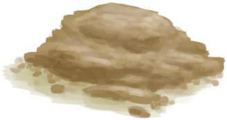

# 水  
> 干净的饮用水。  
  
<table class="table table-bordered" data-toggle="table"  data-show-header="false"><thead style="display:none"><tr ><th  style="width:50%;text-align:left;vertical-align:top;"  >title</th><th  style="width:50%;text-align:left;vertical-align:top;"  ></th></tr></thead><tr ><td  style="width:50%;text-align:left;vertical-align:top;"  >**重量：**0.33  **标签：**	[“灌溉用水”](tag_WaterFresh.md), [“弱效清洁剂”](tag_CleanerWeak.md), [“水(任意)”](tag_WaterAny.md)</td><td  style="width:50%;text-align:left;vertical-align:top;"  >

<a href="LQ_Water.md" style="color:black">水</a>

</td></tr></tbody></table>  
  
## 获取来源  

加入用于蒸馏水的液体

[蒸馏器(开)](AlembicOn.md)

收集雨水

[带孔椰子](CoconutPerforated.md)

收集雨水

[水壶](Canteen.md)

收集雨水

[陶碗](ClayBowl.md)

收集雨水

[小陶罐](ClayJar.md)

收集雨水

[茉莉花(陶罐)](ClayJarJasmine.md)

收集雨水

[陶罐](ClayVase.md)

收集雨水

[椰壶](CoconutFlask.md)(未实装)

收集雨水

[椰子壳](CoconutShell.md)

收集雨水

[烹饪锅](CookingPot.md)

收集雨水

[铜瓶](CopperBottle.md)

收集雨水

[铜罐](CopperJar.md)

收集雨水

[釉面陶罐](GlazedVase.md)

收集雨水

[葫芦瓶](GourdBottle.md)

收集雨水

[油桶](Jerrycan.md)

收集雨水

[塑料瓶](PlasticBottle.md)

收集雨水

[塑料瓶(满)](PlasticBottleFull.md)

收集雨水

[茉莉花(塑料瓶)](PlasticBottleJasmine.md)

收集雨水

[水袋](Waterskin.md)

** 使用**[“储水容器”](tag_WaterContainer.md)倒入

[应急水包](WaterRation.md)

转化

[开水](LQ_WaterBoiling.md)

下雨时更换

[盐水](LQ_WaterSalt.md)

** 使用**[净水片](WaterPurificationTablets.md) , [熟石灰](LQ_SlakedLime.md)净化

[不安全的水](LQ_WaterUnsafe.md)

开始填充

[香蕉树桩](BananaStump.md)

开始填充

[太阳能蒸馏器](SolarStill.md)

开始填充

[滤水器](WaterFilter.md)

  
  
## 动作  

<table><tr><td rowspan="2" style="width:200px;text-align:center;font-size:1.3em;font-weight:bold">

饮用

3分

</td><td></td></tr><tr><td></td></tr><tr><td colspan="2"><b>状态变化：</b>[

[水分](Hydration.md)](Hydration.md)<b>+40</b></td></tr></table>
  

<table><tr><td rowspan="2" style="width:200px;text-align:center;font-size:1.3em;font-weight:bold">

洗个澡

15分

</td><td>[“手部动作(组)”](HandAction.md)</td></tr><tr><td></td></tr><tr><td colspan="2"><b>需求：</b>含水量: 100</td></tr><tr><td colspan="2"><b>相关卡牌变化：</b>装备中的[“腿部（内层）”](tag_Clothing.md)

  <b>+6(50%)</b>, 所有[眼镜蛇毒液](W_CobraSpit.md)燃料  <b>-75</b></td></tr><tr><td colspan="2"><b>状态变化：</b>[

[湿度](Wetness.md)](Wetness.md)<b>+100</b> (每15分钟), [

[情绪](Morale.md)](Morale.md)<b>+1</b>, [

[污垢](Filth.md)](Filth.md)<b>-150</b>, [

[泥巴防护](MudProtection.md)](MudProtection.md)<b>-50</b>, [

[芦荟膏防护](AloeVeraGelProtection.md)](AloeVeraGelProtection.md)<b>-50</b>, [

[驱虫](BugRepellentApplied.md)](BugRepellentApplied.md)<b>-50</b>, [

[阳光防护](SunProtection.md)](SunProtection.md)<b>-50</b></td></tr></table>
  
  
  
## 可拖至  

[人鱼巢](MermaidNest.md)

[杏仁树田](CropPlotAlmondTree.md)

[芦荟田](CropPlotAloeVera.md)

[香蕉树田](CropPlotBananaTree.md)

[辣椒田](CropPlotChilies.md)

[月季田](CropPlotChinaRose.md)

[金鸡纳树田](CropPlotCinchonaTree.md)

[咖啡田](CropPlotCoffee.md)

[未浇灌的农田](CropPlotDry.md)

[未栽种的农田(空)](CropPlotEmpty.md)

[姜田](CropPlotGinger.md)

[茉莉花田](CropPlotJasmine.md)

[卡瓦胡椒田](CropPlotKava.md)

[柠檬草田](CropPlotLemonGrass.md)

[芒果树田](CropPlotMangoTree.md)

[水椰树田](CropPlotNipaPalm.md)

[棕榈丛田](CropPlotPalmBush.md)

[椰子树田](CropPlotPalmTree.md)

[稻田](CropPlotRice.md)

[毁坏的田地](CropPlotRuined.md)

[西米树田](CropPlotSagoPalm.md)

[蛇草田](CropPlotSnakeGrass.md)

[蜘蛛兰田](CropPlotSpiderLily.md)

[大叶仙茅田](CropPlotWeevilLily.md)

[野枣田](CropPlotWildJujube.md)

[参薯田](CropPlotYam.md)

[杂菌菌床](MushroomBedAssorted.md)

[未浇灌的菌床](MushroomBedDry.md)

[未种植的菌床(空)](MushroomBedEmpty.md)

[迷幻菇菌床](MushroomBedMagic.md)

[马勃菌菌床](MushroomBedPuffballs.md)

[干土堆](DirtPile.md)

[灰烬](Ash.md)

[临时防毒面具](MaskMakeshift.md)

[细土](FineDirt.md)

[巢脾](BeeHoneycomb.md)

[捣碎的卡瓦根](KavaRootGround.md)

[稻米](RiceGrains.md)

[西米树芯](SagoSawdust.md)

[糖](Sugar.md)

[参薯片](YamCut.md)

[保鲜罐(关)](ClayPotCoolerOff.md)

[保鲜罐(开)](ClayPotCoolerOn.md)

[生石灰](Quicklime.md)

[肥皂](SoapDry.md)

[湿肥皂](SoapWet.md)

[擦伤](W_Abrasion.md)

[左臂撕裂伤](W_ArmLacerationL.md)

[已缝合的左臂撕裂伤](W_ArmLacerationLStitched.md)

[右臂撕裂伤](W_ArmLacerationR.md)

[已缝合的右臂撕裂伤](W_ArmLacerationRStitched.md)

[眼镜蛇毒液](W_CobraSpit.md)

[狗咬伤](W_DogBite.md)

[左腿撕裂伤](W_LegLacerationL.md)

[已缝合的左腿撕裂伤](W_LegLacerationLStitched.md)

[右腿撕裂伤](W_LegLacerationR.md)

[已缝合的右腿撕裂伤](W_LegLacerationRStitched.md)

[猕猴咬伤](W_MacaqueBite.md)

[轻微撕裂伤](W_MinorLaceration.md)

[已缝合的轻微撕裂伤](W_MinorLacerationStitched.md)

[巨蜥咬伤](W_MonitorBite.md)

[海怪刺伤](W_SeahoundSting.md)

[鲨鱼咬伤](W_SharkBite.md)

[蜘蛛咬伤](W_SpiderBite.md)

[海胆刺伤](W_UrchinWound.md)

[蜂蜜](LQ_Honey.md)

[不安全的水](LQ_WaterUnsafe.md)

[滤水器](WaterFilter.md)

  
  
## 可用于蓝图  

<a href="Bp_Dynamite.md" style="color:black">炸‍葯</a>

<a href="Bp_Mortar.md" style="color:black">砂浆</a>

  
  
  
## 被动效果  
<table class="table table-bordered" data-toggle="table"  ><thead style=""><tr ><th  style="text-align:left;vertical-align:top;"  >名称</th><th  style="text-align:left;vertical-align:top;"  >条件</th><th  style="text-align:left;vertical-align:top;"  >变化(每15分钟)</th><th  style="text-align:left;vertical-align:top;"  data-sortable="true"  >玩家状态</th></tr></thead><tr ><td  style="text-align:left;vertical-align:top;"  >Evaporation</td><td  style="text-align:left;vertical-align:top;"  >** 需要容器：** [“容器（敞口）”](tag_ContainerOpen.md)</td><td  style="text-align:left;vertical-align:top;"  >含水量-1</td><td  style="text-align:left;vertical-align:top;"  ></td></tr><tr ><td  style="text-align:left;vertical-align:top;"  >Evaporation Large</td><td  style="text-align:left;vertical-align:top;"  >** 需要容器：** [“容器（蓄水池）”](tag_ContainerReservoir.md)</td><td  style="text-align:left;vertical-align:top;"  >含水量-3</td><td  style="text-align:left;vertical-align:top;"  ></td></tr><tr ><td  style="text-align:left;vertical-align:top;"  >FillUnderRain</td><td  style="text-align:left;vertical-align:top;"  >** 需要状态：** [

[降水值](RainValue.md)](RainValue.md): <b>1-5</b> ** 需要容器：** [“容器（敞口）”](tag_ContainerOpen.md)</td><td  style="text-align:left;vertical-align:top;"  >含水量+50</td><td  style="text-align:left;vertical-align:top;"  ></td></tr><tr ><td  style="text-align:left;vertical-align:top;"  >FillUnderRain</td><td  style="text-align:left;vertical-align:top;"  >** 需要状态：** [

[降水值](RainValue.md)](RainValue.md): <b>1-5</b> ** 需要容器：** [“容器（密封）”](tag_ContainerSealed.md)</td><td  style="text-align:left;vertical-align:top;"  >含水量+50</td><td  style="text-align:left;vertical-align:top;"  ></td></tr><tr ><td  style="text-align:left;vertical-align:top;"  >FillUnderRainReservoir</td><td  style="text-align:left;vertical-align:top;"  >** 需要状态：** [

[降水值](RainValue.md)](RainValue.md): <b>1-5</b> ** 需要容器：** [“容器（蓄水池）”](tag_ContainerReservoir.md)</td><td  style="text-align:left;vertical-align:top;"  >含水量+250</td><td  style="text-align:left;vertical-align:top;"  ></td></tr></tbody></table>  
  

