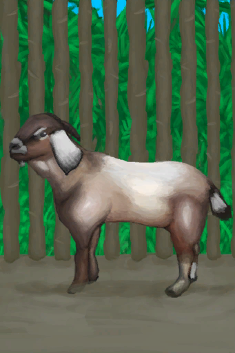

# 孤独感  
> 随着时间增加。使情绪变得消极并影响世界观。  
> 孤独感会随着时间的推移而增加，你的情绪和世界观会随之降低。  有像韦斯顿或是猕猴这样的朋友可以让你不那么孤独。当你已经在岛上生活了很长时间时，拥有高舒适度的家也会有帮助。  
  

<b>基础值: </b> 0 
  

<b>变化范围: </b> 0 ~ 4880 
  

<b>基础变化率: </b> +1 / 每15分钟 
  

<b>衰减: </b>相同来源12小时内衰减50%，叠加2次 
  
## 阶段  

<table><tr style="height:2em;"><td style="background-color:#F0F0F0;text-align:center;width:180px;font-size:1.4em;font-weight:bold;vertical-align:middle;">
900 ～ 2440

18% ～ 50%
</td><td colspan=2 style="font-size:1.1em;vertical-align:middle;background-color:#F9F9F9;">
<b>

孤独</b>

&nbsp;&nbsp;我感到一丝孤独……
</td></tr><tr><td colspan=2><b>影响：</b>[

[世界观](Structure.md)](Structure.md)加成<b>-1</b>, [

[情绪](Morale.md)](Morale.md)加成<b>-0.25</b>, [

[压力](Stress.md)](Stress.md)加成<b>+0.75</b></td></tr><tr><td colspan=2></td></tr><tr style="height:2em;"><td style="background-color:#F0F0F0;text-align:center;width:180px;font-size:1.4em;font-weight:bold;vertical-align:middle;">
2441 ～ 3660

50% ～ 75%
</td><td colspan=2 style="font-size:1.1em;vertical-align:middle;background-color:#F9F9F9;">
<b>

孤独</b>

&nbsp;&nbsp;我感到孤独……
</td></tr><tr><td colspan=2><b>影响：</b>[

[世界观](Structure.md)](Structure.md)加成<b>-2</b>, [

[情绪](Morale.md)](Morale.md)加成<b>-0.75</b>, [

[压力](Stress.md)](Stress.md)加成<b>+1.5</b></td></tr><tr><td colspan=2></td></tr><tr style="height:2em;"><td style="background-color:#F0F0F0;text-align:center;width:180px;font-size:1.4em;font-weight:bold;vertical-align:middle;">
3661 ～ 4880

75% ～ 100%
</td><td colspan=2 style="font-size:1.1em;vertical-align:middle;background-color:#F9F9F9;">
<b>

孤独</b>

&nbsp;&nbsp;我感到十分孤独……
</td></tr><tr><td colspan=2><b>影响：</b>[

[世界观](Structure.md)](Structure.md)加成<b>-3</b>, [

[情绪](Morale.md)](Morale.md)加成<b>-1.5</b>, [

[精神失常](MindState.md)](MindState.md)加成<b>+0.5</b>, [

[孤独感](Loneliness.md)](Loneliness.md)加成<b>-0.5</b>, [

[压力](Stress.md)](Stress.md)加成<b>+1.5～+2</b></td></tr><tr><td colspan=2></td></tr></table>
  
## 相关卡牌  
[情绪](Morale.md)  |  [船长亲密关系](CaptainPropinquity.md)  |  [船长陪伴](CaptainCompany.md)  |  [舒适度](Comfort.md)  |  [娱乐](Entertainment.md)  |  [韦斯顿的陪伴](WestonCompany.md)  |  [韦斯顿亲密关系](WestonPropinquity.md)  |  [孤立感](Isolation.md)  
## 加成值影响因素  
<table class="table table-bordered" data-toggle="table"  ><thead style=""><tr ><th  style="text-align:left;vertical-align:top;"  >来源</th><th  style="text-align:left;vertical-align:top;"  >操作</th><th  style="text-align:left;vertical-align:top;"  >值</th></tr></thead><tr ><td  style="text-align:left;vertical-align:top;"  >[婴儿](Baby.md)</td><td  style="text-align:left;vertical-align:top;"  >被动效果</td><td  style="text-align:left;vertical-align:top;"  >加成-1</td></tr><tr ><td  style="text-align:left;vertical-align:top;"  >[母猪](BoarEnclosureFemale.md)</td><td  style="text-align:left;vertical-align:top;"  >条件被动</td><td  style="text-align:left;vertical-align:top;"  >加成-1</td></tr><tr ><td  style="text-align:left;vertical-align:top;"  >[公猪](BoarEnclosureMale.md)</td><td  style="text-align:left;vertical-align:top;"  >条件被动</td><td  style="text-align:left;vertical-align:top;"  >加成-1</td></tr><tr ><td  style="text-align:left;vertical-align:top;"  >[小猪](BoarEnclosurePiglet.md)</td><td  style="text-align:left;vertical-align:top;"  >条件被动</td><td  style="text-align:left;vertical-align:top;"  >加成-1</td></tr><tr ><td  style="text-align:left;vertical-align:top;"  >[母山羊](GoatEnclosureFemale.md)</td><td  style="text-align:left;vertical-align:top;"  >条件被动</td><td  style="text-align:left;vertical-align:top;"  >加成-1</td></tr><tr ><td  style="text-align:left;vertical-align:top;"  >[小羊](GoatEnclosureKid.md)</td><td  style="text-align:left;vertical-align:top;"  >条件被动</td><td  style="text-align:left;vertical-align:top;"  >加成-1</td></tr><tr ><td  style="text-align:left;vertical-align:top;"  >[泌乳期山羊](GoatEnclosureLactating.md)</td><td  style="text-align:left;vertical-align:top;"  >条件被动</td><td  style="text-align:left;vertical-align:top;"  >加成-1</td></tr><tr ><td  style="text-align:left;vertical-align:top;"  >[公山羊](GoatEnclosureMale.md)</td><td  style="text-align:left;vertical-align:top;"  >条件被动</td><td  style="text-align:left;vertical-align:top;"  >加成-1</td></tr><tr ><td  style="text-align:left;vertical-align:top;"  >[韦斯顿](Weston.md)</td><td  style="text-align:left;vertical-align:top;"  >被动效果</td><td  style="text-align:left;vertical-align:top;"  >加成-1</td></tr><tr ><td  style="text-align:left;vertical-align:top;"  >[忠犬朋友](DogFriend.md)</td><td  style="text-align:left;vertical-align:top;"  >被动效果</td><td  style="text-align:left;vertical-align:top;"  >加成-2</td></tr><tr ><td  style="text-align:left;vertical-align:top;"  >[猕猴朋友](MacaqueFriend.md)</td><td  style="text-align:left;vertical-align:top;"  >被动效果</td><td  style="text-align:left;vertical-align:top;"  >加成-2</td></tr><tr ><td  style="text-align:left;vertical-align:top;"  >

[独来独往](Pk_4_Loner.md)</td><td  style="text-align:left;vertical-align:top;"  >特质影响</td><td  style="text-align:left;vertical-align:top;"  >加成-2</td></tr><tr ><td  style="text-align:left;vertical-align:top;"  >[祖父](Grandfather.md)</td><td  style="text-align:left;vertical-align:top;"  >被动效果</td><td  style="text-align:left;vertical-align:top;"  >加成-5</td></tr><tr ><td  style="text-align:left;vertical-align:top;"  >[祖父(健康)](GrandfatherHealthy.md)</td><td  style="text-align:left;vertical-align:top;"  >被动效果</td><td  style="text-align:left;vertical-align:top;"  >加成-10</td></tr></tbody></table>  
  
## 可被以下操作改变  
<table class="table table-bordered" data-toggle="table"  ><thead style=""><tr ><th  style="text-align:left;vertical-align:top;"  >来源</th><th  style="text-align:left;vertical-align:top;"  >操作</th><th  style="text-align:left;vertical-align:top;"  >值</th></tr></thead><tr ><td  style="text-align:left;vertical-align:top;"  >[

[第2页(事件)](Event_FluteTunes2.md)](Event_FluteTunes2.md)</td><td  style="text-align:left;vertical-align:top;"  >孤独之调</td><td  style="text-align:left;vertical-align:top;"  >-2 / 每15分钟</td></tr><tr ><td  style="text-align:left;vertical-align:top;"  >[

[婴儿](Baby.md)](Baby.md)</td><td  style="text-align:left;vertical-align:top;"  >喂奶</td><td  style="text-align:left;vertical-align:top;"  >-5</td></tr><tr ><td  style="text-align:left;vertical-align:top;"  >[

[婴儿](Baby.md)](Baby.md)</td><td  style="text-align:left;vertical-align:top;"  >哄哄</td><td  style="text-align:left;vertical-align:top;"  >-5</td></tr><tr ><td  style="text-align:left;vertical-align:top;"  >[

[婴儿](Baby.md)](Baby.md)</td><td  style="text-align:left;vertical-align:top;"  >一起玩耍</td><td  style="text-align:left;vertical-align:top;"  >-10</td></tr><tr ><td  style="text-align:left;vertical-align:top;"  >[

[祖父](Grandfather.md)](Grandfather.md)</td><td  style="text-align:left;vertical-align:top;"  >喂食 ** 拖入：**[“人类食物”](tag_HumanFood.md)</td><td  style="text-align:left;vertical-align:top;"  >-15</td></tr><tr ><td  style="text-align:left;vertical-align:top;"  >[

[祖父(健康)](GrandfatherHealthy.md)](GrandfatherHealthy.md)</td><td  style="text-align:left;vertical-align:top;"  >喂食 ** 拖入：**[“人类食物”](tag_HumanFood.md)</td><td  style="text-align:left;vertical-align:top;"  >-15</td></tr><tr ><td  style="text-align:left;vertical-align:top;"  >[

[船长](Captain.md)](Captain.md)</td><td  style="text-align:left;vertical-align:top;"  >聊天</td><td  style="text-align:left;vertical-align:top;"  >-20</td></tr><tr ><td  style="text-align:left;vertical-align:top;"  >[

[中陷阱的猕猴](CageTrapMacaque.md)](CageTrapMacaque.md)</td><td  style="text-align:left;vertical-align:top;"  >抚摸</td><td  style="text-align:left;vertical-align:top;"  >-20</td></tr><tr ><td  style="text-align:left;vertical-align:top;"  >[

[中陷阱的猕猴](CageTrapMacaque.md)](CageTrapMacaque.md)</td><td  style="text-align:left;vertical-align:top;"  >喂食 ** 拖入：**[鱼片](FishSlices.md) , [烤鱼片](FishSlicesCooked.md) , [虾](Prawns.md) , [烤虾](PrawnsCooked.md) , [鱼杂](FishScraps.md) , [烤鱼杂](FishScrapsCooked.md)</td><td  style="text-align:left;vertical-align:top;"  >-20</td></tr><tr ><td  style="text-align:left;vertical-align:top;"  >[

[中陷阱的猕猴](CageTrapMacaque.md)](CageTrapMacaque.md)</td><td  style="text-align:left;vertical-align:top;"  >喂食 ** 拖入：**[“饲料”](tag_Feed.md)</td><td  style="text-align:left;vertical-align:top;"  >-20</td></tr><tr ><td  style="text-align:left;vertical-align:top;"  >[

[母猪](BoarEnclosureFemale.md)](BoarEnclosureFemale.md)</td><td  style="text-align:left;vertical-align:top;"  >抚摸</td><td  style="text-align:left;vertical-align:top;"  >-20</td></tr><tr ><td  style="text-align:left;vertical-align:top;"  >[

[公猪](BoarEnclosureMale.md)](BoarEnclosureMale.md)</td><td  style="text-align:left;vertical-align:top;"  >抚摸</td><td  style="text-align:left;vertical-align:top;"  >-20</td></tr><tr ><td  style="text-align:left;vertical-align:top;"  >[

[小猪](BoarEnclosurePiglet.md)](BoarEnclosurePiglet.md)</td><td  style="text-align:left;vertical-align:top;"  >抚摸</td><td  style="text-align:left;vertical-align:top;"  >-20</td></tr><tr ><td  style="text-align:left;vertical-align:top;"  >[

[忠犬朋友](DogFriend.md)](DogFriend.md)</td><td  style="text-align:left;vertical-align:top;"  >喂食 ** 拖入：**[鱼片](FishSlices.md) , [烤鱼片](FishSlicesCooked.md) , [虾](Prawns.md) , [烤虾](PrawnsCooked.md) , [鱼杂](FishScraps.md) , [烤鱼杂](FishScrapsCooked.md) , [螃蟹](Crab.md) , [烤螃蟹](CrabCooked.md)</td><td  style="text-align:left;vertical-align:top;"  >-20 ~ 0</td></tr><tr ><td  style="text-align:left;vertical-align:top;"  >[

[忠犬朋友](DogFriend.md)](DogFriend.md)</td><td  style="text-align:left;vertical-align:top;"  >喂食 ** 拖入：**[鱼片](FishSlices.md) , [烤鱼片](FishSlicesCooked.md) , [虾](Prawns.md) , [烤虾](PrawnsCooked.md) , [鱼杂](FishScraps.md) , [烤鱼杂](FishScrapsCooked.md) , [螃蟹](Crab.md) , [烤螃蟹](CrabCooked.md)</td><td  style="text-align:left;vertical-align:top;"  >-20</td></tr><tr ><td  style="text-align:left;vertical-align:top;"  >[

[忠犬朋友](DogFriend.md)](DogFriend.md)</td><td  style="text-align:left;vertical-align:top;"  >喂食 ** 拖入：**[“肉”](tag_Meat.md) , [“鱼肉”](tag_Fish.md)</td><td  style="text-align:left;vertical-align:top;"  >-20</td></tr><tr ><td  style="text-align:left;vertical-align:top;"  >[

[忠犬朋友](DogFriend.md)](DogFriend.md)</td><td  style="text-align:left;vertical-align:top;"  >喂骨头 ** 拖入：**[骨头](Bones.md)</td><td  style="text-align:left;vertical-align:top;"  >-20</td></tr><tr ><td  style="text-align:left;vertical-align:top;"  >[

[母山羊](GoatEnclosureFemale.md)](GoatEnclosureFemale.md)</td><td  style="text-align:left;vertical-align:top;"  >抚摸</td><td  style="text-align:left;vertical-align:top;"  >-20</td></tr><tr ><td  style="text-align:left;vertical-align:top;"  >[

[小羊](GoatEnclosureKid.md)](GoatEnclosureKid.md)</td><td  style="text-align:left;vertical-align:top;"  >抚摸</td><td  style="text-align:left;vertical-align:top;"  >-20</td></tr><tr ><td  style="text-align:left;vertical-align:top;"  >[

[泌乳期山羊](GoatEnclosureLactating.md)](GoatEnclosureLactating.md)</td><td  style="text-align:left;vertical-align:top;"  >抚摸</td><td  style="text-align:left;vertical-align:top;"  >-20</td></tr><tr ><td  style="text-align:left;vertical-align:top;"  >[

[公山羊](GoatEnclosureMale.md)](GoatEnclosureMale.md)</td><td  style="text-align:left;vertical-align:top;"  >抚摸</td><td  style="text-align:left;vertical-align:top;"  >-20</td></tr><tr ><td  style="text-align:left;vertical-align:top;"  >[

[猕猴朋友](MacaqueFriend.md)](MacaqueFriend.md)</td><td  style="text-align:left;vertical-align:top;"  >喂食 ** 拖入：**[鱼片](FishSlices.md) , [烤鱼片](FishSlicesCooked.md) , [虾](Prawns.md) , [烤虾](PrawnsCooked.md) , [鱼杂](FishScraps.md) , [烤鱼杂](FishScrapsCooked.md)</td><td  style="text-align:left;vertical-align:top;"  >-20</td></tr><tr ><td  style="text-align:left;vertical-align:top;"  >[

[猕猴朋友](MacaqueFriend.md)](MacaqueFriend.md)</td><td  style="text-align:left;vertical-align:top;"  >喂食 ** 拖入：**[“饲料”](tag_Feed.md)</td><td  style="text-align:left;vertical-align:top;"  >-20</td></tr><tr ><td  style="text-align:left;vertical-align:top;"  >[

[受伤的猕猴](MacaqueWounded.md)](MacaqueWounded.md)</td><td  style="text-align:left;vertical-align:top;"  >抚摸</td><td  style="text-align:left;vertical-align:top;"  >-20</td></tr><tr ><td  style="text-align:left;vertical-align:top;"  >[

[受伤的猕猴](MacaqueWounded.md)](MacaqueWounded.md)</td><td  style="text-align:left;vertical-align:top;"  >喂食 ** 拖入：**[鱼片](FishSlices.md) , [烤鱼片](FishSlicesCooked.md) , [虾](Prawns.md) , [烤虾](PrawnsCooked.md) , [鱼杂](FishScraps.md) , [烤鱼杂](FishScrapsCooked.md)</td><td  style="text-align:left;vertical-align:top;"  >-20</td></tr><tr ><td  style="text-align:left;vertical-align:top;"  >[

[受伤的猕猴](MacaqueWounded.md)](MacaqueWounded.md)</td><td  style="text-align:left;vertical-align:top;"  >喂食 ** 拖入：**[“饲料”](tag_Feed.md)</td><td  style="text-align:left;vertical-align:top;"  >-20</td></tr><tr ><td  style="text-align:left;vertical-align:top;"  >[

[韦斯顿](Weston.md)](Weston.md)</td><td  style="text-align:left;vertical-align:top;"  >聊天</td><td  style="text-align:left;vertical-align:top;"  >-20</td></tr><tr ><td  style="text-align:left;vertical-align:top;"  >[

[忠犬朋友](DogFriend.md)](DogFriend.md)</td><td  style="text-align:left;vertical-align:top;"  >抚摸</td><td  style="text-align:left;vertical-align:top;"  >-30</td></tr><tr ><td  style="text-align:left;vertical-align:top;"  >[

[忠犬朋友](DogFriend.md)](DogFriend.md)</td><td  style="text-align:left;vertical-align:top;"  >一起玩耍</td><td  style="text-align:left;vertical-align:top;"  >-30</td></tr><tr ><td  style="text-align:left;vertical-align:top;"  >[

[祖父](Grandfather.md)](Grandfather.md)</td><td  style="text-align:left;vertical-align:top;"  >陪伴</td><td  style="text-align:left;vertical-align:top;"  >-30</td></tr><tr ><td  style="text-align:left;vertical-align:top;"  >[

[猕猴朋友](MacaqueFriend.md)](MacaqueFriend.md)</td><td  style="text-align:left;vertical-align:top;"  >抚摸</td><td  style="text-align:left;vertical-align:top;"  >-30</td></tr><tr ><td  style="text-align:left;vertical-align:top;"  >[

[祖父](Grandfather.md)](Grandfather.md)</td><td  style="text-align:left;vertical-align:top;"  >喂食 ** 拖入：**[“椰子壳料理”](tag_MealCoconutShell.md)</td><td  style="text-align:left;vertical-align:top;"  >-50</td></tr><tr ><td  style="text-align:left;vertical-align:top;"  >[

[祖父](Grandfather.md)](Grandfather.md)</td><td  style="text-align:left;vertical-align:top;"  >喂食 ** 拖入：**[“已烹饪的”](tag_MealCookingpot.md)</td><td  style="text-align:left;vertical-align:top;"  >-50</td></tr><tr ><td  style="text-align:left;vertical-align:top;"  >[

[祖父(健康)](GrandfatherHealthy.md)](GrandfatherHealthy.md)</td><td  style="text-align:left;vertical-align:top;"  >喂食 ** 拖入：**[“椰子壳料理”](tag_MealCoconutShell.md)</td><td  style="text-align:left;vertical-align:top;"  >-50</td></tr><tr ><td  style="text-align:left;vertical-align:top;"  >[

[祖父(健康)](GrandfatherHealthy.md)](GrandfatherHealthy.md)</td><td  style="text-align:left;vertical-align:top;"  >喂食 ** 拖入：**[“已烹饪的”](tag_MealCookingpot.md)</td><td  style="text-align:left;vertical-align:top;"  >-50</td></tr><tr ><td  style="text-align:left;vertical-align:top;"  >[

[手机(开)](PhoneOn.md)](PhoneOn.md)</td><td  style="text-align:left;vertical-align:top;"  >看照片</td><td  style="text-align:left;vertical-align:top;"  >-50</td></tr><tr ><td  style="text-align:left;vertical-align:top;"  >[

[手机](PhoneOnLight.md)](PhoneOnLight.md)</td><td  style="text-align:left;vertical-align:top;"  >看照片</td><td  style="text-align:left;vertical-align:top;"  >-50</td></tr><tr ><td  style="text-align:left;vertical-align:top;"  >[

[祖父(健康)](GrandfatherHealthy.md)](GrandfatherHealthy.md)</td><td  style="text-align:left;vertical-align:top;"  >陪伴</td><td  style="text-align:left;vertical-align:top;"  >-60</td></tr></tbody></table>  
  
## 被以下操作需求  
<table class="table table-bordered" data-toggle="table"  ><thead style=""><tr ><th  style="text-align:left;vertical-align:top;"  >来源</th><th  style="text-align:left;vertical-align:top;"  >操作</th><th  style="text-align:left;vertical-align:top;"  data-sortable="true"  >值</th></tr></thead><tr ><td  style="text-align:left;vertical-align:top;"  >[头骨](Skull.md)</td><td  style="text-align:left;vertical-align:top;"  >聊聊吧</td><td  style="text-align:left;vertical-align:top;"  >900 ~ 4880</td></tr><tr ><td  style="text-align:left;vertical-align:top;"  >[骨笛](FluteBone.md)</td><td  style="text-align:left;vertical-align:top;"  >影响</td><td  style="text-align:left;vertical-align:top;"  >0 ~ 4880</td></tr><tr ><td  style="text-align:left;vertical-align:top;"  >[木笛](FluteWooden.md)</td><td  style="text-align:left;vertical-align:top;"  >影响</td><td  style="text-align:left;vertical-align:top;"  >0 ~ 4880</td></tr></tbody></table>  
  

