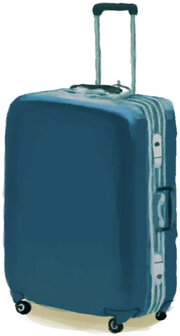

# 行李箱  
> 我可以把物品储存在里面。  
  
<table class="table table-bordered" data-toggle="table"  data-show-header="false"><thead style="display:none"><tr ><th  style="width:50%;text-align:left;vertical-align:top;"  >title</th><th  style="width:50%;text-align:left;vertical-align:top;"  ></th></tr></thead><tr ><td  style="width:50%;text-align:left;vertical-align:top;"  >** 不可堆叠 **  **重量：**500  **标签：**	[“袋子”](tag_Bag.md)  **槽位：**6  **初始卡牌：**

[

[袜子](Socks.md)](Socks.md)(2)

[

[内裤](Underwear.md)](Underwear.md)

[

[短裤](Shorts.md)](Shorts.md)

[

[T恤](T-Shirt.md)](T-Shirt.md)

[

[运动鞋](Sneakers.md)](Sneakers.md)

  
  
  **过滤器：**~~[“袋子”](tag_Bag.md)~~ , ~~[“大的”](tag_Large.md)~~ , ~~[“火源”](tag_FireSource.md)~~ , ~~[“火”](tag_Fire.md)~~ , ~~[“可泼溅的”](tag_Spillable.md)~~  **容量：**1000  **减重：**-1000</td><td  style="width:50%;text-align:left;vertical-align:top;"  >

<a href="LuggageA.md" style="color:black">行李箱</a>

</td></tr></tbody></table>  
  
## 获取来源  

拿起

[行李箱](LuggageAPlaced.md)

特质影响

[坠机](Pk_1_PlaneCrash.md)

  
  
## 动作  

<table><tr><td rowspan="2" style="width:200px;text-align:center;font-size:1.3em;font-weight:bold">

放置

</td><td></td></tr><tr><td><b>自身：</b>→ [

[行李箱](LuggageAPlaced.md)](LuggageAPlaced.md)</td></tr></table>
  
  
  

