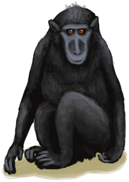
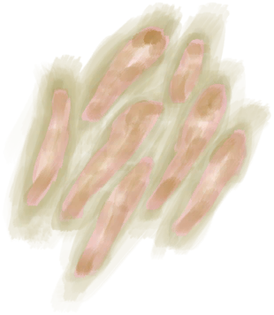
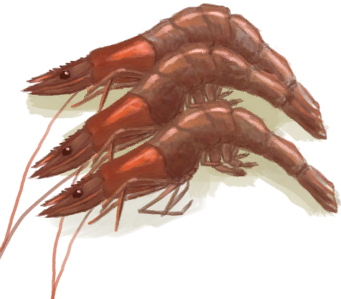
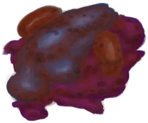
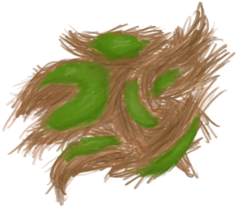
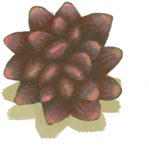
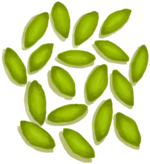
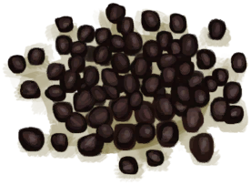

# 猕猴朋友  
> 大多数情况下，它是一个忠诚友好的同伴……  
  
<table class="table table-bordered" data-toggle="table"  data-show-header="false"><thead style="display:none"><tr ><th  style="width:50%;text-align:left;vertical-align:top;"  >title</th><th  style="width:50%;text-align:left;vertical-align:top;"  ></th></tr></thead><tr ><td  style="width:50%;text-align:left;vertical-align:top;"  >** 可重命名 **  ** 不可堆叠 **  **重量：**750  **装备时减重：**-500  **装备：**[“宠物”](eTag_Pet.md)  **可用次数：**288  ** 效果: ** [

[孤独感](Loneliness.md)](Loneliness.md)加成<b>-2</b></td><td  style="width:50%;text-align:left;vertical-align:top;"  >

<a href="MacaqueFriend.md" style="color:black">猕猴朋友</a>

猕猴出没于岛上森林茂密的地区。当它们觉得你好欺负的时候，就会经常<b>偷</b>你的东西。即使它们战斗力不强，未及时处理的猕猴<b>咬伤</b>也很容易引发感染。  你可以试着猎杀它们，猕猴肉也是不错的营养来源，同时还能提供一些皮革。 如果你只是伤了它们但没有致其死地，你可以照料它们直至其恢复健康，并和它们成为朋友。猕猴朋友会陪伴你，降低你的<b>孤独</b>，送你礼物，甚至帮你剥椰子。注意要保证它们吃饱喝足，否则它们不高兴了，就有可能<b>咬你一口</b>。</td></tr></tbody></table>  
  
## 获取来源  

已驯服！

[中陷阱的猕猴](CageTrapMacaque.md)

痊愈了！

[受伤的猕猴](MacaqueWounded.md)

  
  
## 动作  

<table><tr><td rowspan="2" style="width:200px;text-align:center;font-size:1.3em;font-weight:bold">

抚摸

15分

</td><td></td></tr><tr><td><b>自身：</b>情绪

  <b>+25(2.5%)</b></td></tr><tr><td colspan="2">

<table style="margin-bottom:3px;"><tr><td rowspan=2 style="text-align:center" width="80px">
基础权重

800
</td><td style="font-size:0.6em;line-height:0.6em;font-weight:bold">Success</td></tr><tr><td>[

[孤独感](Loneliness.md)](Loneliness.md)<b>-30</b> [

[压力](Stress.md)](Stress.md)<b>-25</b> [

[娱乐](Entertainment.md)](Entertainment.md)<b>+6</b></td></tr></table>

<table style="margin-bottom:3px;"><tr><td rowspan=2 style="text-align:center" width="80px">
基础权重

0
</td><td style="font-size:0.6em;line-height:0.6em;font-weight:bold">Ouch!</td></tr><tr><td>[

[啊！！！！(事件)](Event_MacaqueFriendAnger.md)](Event_MacaqueFriendAnger.md)(<b>+1</b>)[

[压力](Stress.md)](Stress.md)<b>+10</b></td></tr><tr><td colspan=2><li>情绪

为<b>0～1000(0%～100%)</b>时权重<b>+800～+0</b></li></td></tr></table>
<button class="btn btn-secondary btn-sm" style="" data-toggle="modal" onclick="setCollectionDataBase64('eyJ0aXRsZSI6IuamgueOh+aooeaLnzog5oqa5pG4ICjnjJXnjLTmnIvlj4spIiwiY29sbGVjdGlvbnMiOlt7ImRyb3AiOiLml6AiLCJiYXNlIjo4MDAsImNvbmRpdGlvbiI6W119LHsiZHJvcCI6IjxkaXYgc3R5bGU9XCJ3aWR0aDoyNXB4O2Rpc3BsYXk6aW5saW5lLWJsb2NrO3RleHQtYWxpZ246Y2VudGVyXCI+PGltZyBkZWNvZGluZz1cImFzeW5jXCIgc3JjPVwiLi4vd2lraS9TcHJpdGUvTWFjYXF1ZUJpdGUucG5nXCIgaHJlZj1cImEubWRcIiBzdHlsZT1cIm1heC13aWR0aDoyNXB4O21heC1oZWlnaHQ6MjVweDtcIj48L2Rpdj7llYrvvIHvvIHvvIHvvIEo5LqL5Lu2KSIsImJhc2UiOjAsImNvbmRpdGlvbiI6W3sia2V5IjoiUHJvZ3Jlc3MiLCJ0aXRsZSI6IuaDhee7qjxkaXYgc3R5bGU9XCJ3aWR0aDoyMHB4O2Rpc3BsYXk6aW5saW5lLWJsb2NrO3RleHQtYWxpZ246Y2VudGVyXCI+PGltZyBkZWNvZGluZz1cImFzeW5jXCIgc3JjPVwiLi4vd2lraS9TcHJpdGUvQ29udGVudC5wbmdcIiBocmVmPVwiYS5tZFwiIHN0eWxlPVwibWF4LXdpZHRoOjIwcHg7bWF4LWhlaWdodDoyMHB4O1wiPjwvZGl2PiIsInR5cGUiOiJyYW5nZSIsIm1heCI6WzAsMTAwMF0sInJhbmdlIjpbMCwxMDAwXSwid2VpZ2h0IjpbODAwLDBdLCJkZWZhdWx0VmFsdWUiOjAsIndoZW5PdXRPZlJhbmdlIjowfV19XX0=')" data-target="#modelCollectionSimulator">概率模拟</button>
</td></tr></table>
  
  
  
## 可拖入  

<table style="margin-bottom:0px;"><tr><td style="width:40%;text-align:left; background-color:#FEFEFE"><b>拖入：</b>[

[鱼片](FishSlices.md)](FishSlices.md) | [

[烤鱼片](FishSlicesCooked.md)](FishSlicesCooked.md) | [

[虾](Prawns.md)](Prawns.md) | [

[烤虾](PrawnsCooked.md)](PrawnsCooked.md) | [

[鱼杂](FishScraps.md)](FishScraps.md) | [

[烤鱼杂](FishScrapsCooked.md)](FishScrapsCooked.md)</td><td style="width:40%;font-size:1em;font-weight:bold;background-color:#FEFEFE">喂食 (3分) </td></tr><tr style="background-color:#FFFFFF"><td style=""><b>使用物：</b>→消失</td><td style=""><b>自身：</b>饥饿

  <b>+288(50%)</b>, 情绪

  <b>+50(5%)</b></td></tr><tr><td colspan="2">

<table style="margin-bottom:3px;"><tr><td rowspan=2 style="text-align:center" width="80px">
基础权重

800
</td><td style="font-size:0.6em;line-height:0.6em;font-weight:bold">Success</td></tr><tr><td>[

[孤独感](Loneliness.md)](Loneliness.md)<b>-20</b> [

[压力](Stress.md)](Stress.md)<b>-10</b></td></tr></table>

<table style="margin-bottom:3px;"><tr><td rowspan=2 style="text-align:center" width="80px">
基础权重

0
</td><td style="font-size:0.6em;line-height:0.6em;font-weight:bold">Ouch!</td></tr><tr><td>[

[啊！！！！(事件)](Event_MacaqueFriendAnger.md)](Event_MacaqueFriendAnger.md)(<b>+1</b>)[

[压力](Stress.md)](Stress.md)<b>+10</b></td></tr><tr><td colspan=2><li>情绪

为<b>0～1000(0%～100%)</b>时权重<b>+150～+0</b></li></td></tr></table>
<button class="btn btn-secondary btn-sm" style="" data-toggle="modal" onclick="setCollectionDataBase64('eyJ0aXRsZSI6IuamgueOh+aooeaLnzog5ZaC6aOfICjnjJXnjLTmnIvlj4spIiwiY29sbGVjdGlvbnMiOlt7ImRyb3AiOiLml6AiLCJiYXNlIjo4MDAsImNvbmRpdGlvbiI6W119LHsiZHJvcCI6IjxkaXYgc3R5bGU9XCJ3aWR0aDoyNXB4O2Rpc3BsYXk6aW5saW5lLWJsb2NrO3RleHQtYWxpZ246Y2VudGVyXCI+PGltZyBkZWNvZGluZz1cImFzeW5jXCIgc3JjPVwiLi4vd2lraS9TcHJpdGUvTWFjYXF1ZUJpdGUucG5nXCIgaHJlZj1cImEubWRcIiBzdHlsZT1cIm1heC13aWR0aDoyNXB4O21heC1oZWlnaHQ6MjVweDtcIj48L2Rpdj7llYrvvIHvvIHvvIHvvIEo5LqL5Lu2KSIsImJhc2UiOjAsImNvbmRpdGlvbiI6W3sia2V5IjoiUHJvZ3Jlc3MiLCJ0aXRsZSI6IuaDhee7qjxkaXYgc3R5bGU9XCJ3aWR0aDoyMHB4O2Rpc3BsYXk6aW5saW5lLWJsb2NrO3RleHQtYWxpZ246Y2VudGVyXCI+PGltZyBkZWNvZGluZz1cImFzeW5jXCIgc3JjPVwiLi4vd2lraS9TcHJpdGUvQ29udGVudC5wbmdcIiBocmVmPVwiYS5tZFwiIHN0eWxlPVwibWF4LXdpZHRoOjIwcHg7bWF4LWhlaWdodDoyMHB4O1wiPjwvZGl2PiIsInR5cGUiOiJyYW5nZSIsIm1heCI6WzAsMTAwMF0sInJhbmdlIjpbMCwxMDAwXSwid2VpZ2h0IjpbMTUwLDBdLCJkZWZhdWx0VmFsdWUiOjAsIndoZW5PdXRPZlJhbmdlIjowfV19XX0=')" data-target="#modelCollectionSimulator">概率模拟</button>
</td></tr></table>
  

<table style="margin-bottom:0px;"><tr><td style="width:40%;text-align:left; background-color:#FEFEFE"><b>拖入：</b>[“饲料”](tag_Feed.md)</td><td style="width:40%;font-size:1em;font-weight:bold;background-color:#FEFEFE">喂食 (3分) </td></tr><tr style="background-color:#FFFFFF"><td style=""><b>使用物：</b>→消失</td><td style=""><b>自身：</b>饥饿

  <b>+288(50%)</b>, 情绪

  <b>+250(25%)</b></td></tr><tr><td colspan="2">

<table style="margin-bottom:3px;"><tr><td rowspan=2 style="text-align:center" width="80px">
基础权重

800
</td><td style="font-size:0.6em;line-height:0.6em;font-weight:bold">Success</td></tr><tr><td>[

[孤独感](Loneliness.md)](Loneliness.md)<b>-20</b> [

[压力](Stress.md)](Stress.md)<b>-10</b></td></tr></table>

<table style="margin-bottom:3px;"><tr><td rowspan=2 style="text-align:center" width="80px">
基础权重

0
</td><td style="font-size:0.6em;line-height:0.6em;font-weight:bold">Ouch!</td></tr><tr><td>[

[啊！！！！(事件)](Event_MacaqueFriendAnger.md)](Event_MacaqueFriendAnger.md)(<b>+1</b>)[

[压力](Stress.md)](Stress.md)<b>+10</b></td></tr><tr><td colspan=2><li>情绪

为<b>0～1000(0%～100%)</b>时权重<b>+150～+0</b></li></td></tr></table>
<button class="btn btn-secondary btn-sm" style="" data-toggle="modal" onclick="setCollectionDataBase64('eyJ0aXRsZSI6IuamgueOh+aooeaLnzog5ZaC6aOfICjnjJXnjLTmnIvlj4spIiwiY29sbGVjdGlvbnMiOlt7ImRyb3AiOiLml6AiLCJiYXNlIjo4MDAsImNvbmRpdGlvbiI6W119LHsiZHJvcCI6IjxkaXYgc3R5bGU9XCJ3aWR0aDoyNXB4O2Rpc3BsYXk6aW5saW5lLWJsb2NrO3RleHQtYWxpZ246Y2VudGVyXCI+PGltZyBkZWNvZGluZz1cImFzeW5jXCIgc3JjPVwiLi4vd2lraS9TcHJpdGUvTWFjYXF1ZUJpdGUucG5nXCIgaHJlZj1cImEubWRcIiBzdHlsZT1cIm1heC13aWR0aDoyNXB4O21heC1oZWlnaHQ6MjVweDtcIj48L2Rpdj7llYrvvIHvvIHvvIHvvIEo5LqL5Lu2KSIsImJhc2UiOjAsImNvbmRpdGlvbiI6W3sia2V5IjoiUHJvZ3Jlc3MiLCJ0aXRsZSI6IuaDhee7qjxkaXYgc3R5bGU9XCJ3aWR0aDoyMHB4O2Rpc3BsYXk6aW5saW5lLWJsb2NrO3RleHQtYWxpZ246Y2VudGVyXCI+PGltZyBkZWNvZGluZz1cImFzeW5jXCIgc3JjPVwiLi4vd2lraS9TcHJpdGUvQ29udGVudC5wbmdcIiBocmVmPVwiYS5tZFwiIHN0eWxlPVwibWF4LXdpZHRoOjIwcHg7bWF4LWhlaWdodDoyMHB4O1wiPjwvZGl2PiIsInR5cGUiOiJyYW5nZSIsIm1heCI6WzAsMTAwMF0sInJhbmdlIjpbMCwxMDAwXSwid2VpZ2h0IjpbMTUwLDBdLCJkZWZhdWx0VmFsdWUiOjAsIndoZW5PdXRPZlJhbmdlIjowfV19XX0=')" data-target="#modelCollectionSimulator">概率模拟</button>
</td></tr></table>
  

<table style="margin-bottom:0px;"><tr><td style="width:40%;text-align:left; background-color:#FEFEFE"><b>拖入：</b>[“储水容器”](tag_WaterContainer.md) ([“淡水(组)”](GpTag_WaterFresh.md) x 1)</td><td style="width:40%;font-size:1em;font-weight:bold;background-color:#FEFEFE">喂水  </td></tr><tr style="background-color:#FFFFFF"><td style=""><b>使用物：</b></td><td style=""><b>自身：</b>口渴

  <b>+48(16.67%)</b>, 情绪

  <b>+25(2.5%)</b></td></tr></table>
  

<table style="margin-bottom:0px;"><tr><td style="width:40%;text-align:left; background-color:#FEFEFE"><b>拖入：</b>[

[青椰子](CoconutHusked.md)](CoconutHusked.md)</td><td style="width:40%;font-size:1em;font-weight:bold;background-color:#FEFEFE">剥椰子  </td></tr><tr style="background-color:#FFFFFF"><td style=""><b>使用物：</b>→ [

[椰子](Coconut.md)](Coconut.md)</td><td style=""><b>自身：</b></td></tr><tr><td colspan="2">[

[椰子皮](CoconutHusk.md)](CoconutHusk.md)(<b>+1</b>)</td></tr></table>
  

<table style="margin-bottom:0px;"><tr><td style="width:40%;text-align:left; background-color:#FEFEFE"><b>拖入：</b>[

[水椰子](NipaFruit.md)](NipaFruit.md)</td><td style="width:40%;font-size:1em;font-weight:bold;background-color:#FEFEFE">剥水椰子  </td></tr><tr style="background-color:#FFFFFF"><td style=""><b>使用物：</b>使用次数  <b>-1(-25%)</b></td><td style=""><b>自身：</b></td></tr><tr><td colspan="2">[

[水椰籽](NipaSeeds.md)](NipaSeeds.md)(<b>+1</b>)</td></tr></table>
  

<table style="margin-bottom:0px;"><tr><td style="width:40%;text-align:left; background-color:#FEFEFE"><b>拖入：</b>[

[热带杏仁](TropicalAlmonds.md)](TropicalAlmonds.md)</td><td style="width:40%;font-size:1em;font-weight:bold;background-color:#FEFEFE">剥热带杏仁  </td></tr><tr style="background-color:#FFFFFF"><td style=""><b>使用物：</b>→消失</td><td style=""><b>自身：</b></td></tr><tr><td colspan="2">[

[热带杏仁核](TropicalAlmondKernels.md)](TropicalAlmondKernels.md)(<b>+1</b>)</td></tr></table>
  

<table style="margin-bottom:0px;"><tr><td style="width:40%;text-align:left; background-color:#FEFEFE"><b>拖入：</b>[“切割工具”](tag_Cutter.md) | [“一级矛”](tag_Spear.md)</td><td style="width:40%;font-size:1em;font-weight:bold;background-color:#FEFEFE">杀害！ (15分) [“手部动作(组)”](HandAction.md)</td></tr><tr><td colspan="2"><b>需求：</b>[

[光亮](Light.md)](Light.md): <b>10-100</b></td></tr><tr style="background-color:#FFFFFF"><td style=""><b>使用物：</b>使用次数  <b>-1(-0.67%)</b></td><td style=""><b>自身：</b>→ [

[猕猴尸体](MacaqueCarcass.md)](MacaqueCarcass.md)</td></tr><tr><td colspan="2"><b>状态变化：</b>[

[污垢](Filth.md)](Filth.md)<b>+20</b>, [

[情绪](Morale.md)](Morale.md)<b>-100</b>, [

[哀悼](Mourning.md)](Mourning.md)<b>+288</b></td></tr><tr><td colspan="2">

<table style="margin-bottom:3px;"><tr><td rowspan=2 style="text-align:center" width="80px">
基础权重

1
</td><td style="font-size:0.6em;line-height:0.6em;font-weight:bold">No Bite</td></tr><tr><td></td></tr></table>

<table style="margin-bottom:3px;"><tr><td rowspan=2 style="text-align:center" width="80px">
基础权重

3
</td><td style="font-size:0.6em;line-height:0.6em;font-weight:bold">Bite</td></tr><tr><td>[

[猕猴咬伤](W_MacaqueBite.md)](W_MacaqueBite.md)(<b>+1</b>)</td></tr></table>

</td></tr></table>
  
  
## 可拖至  

[椰子树](PalmTreeNew.md)

  
  
## 属性   

<table style="margin-bottom:0px;"><tr><td style="width:30%;text-align:left; background-color:#FEFEFE;font-size:1.3em;font-weight:bold;">

饥饿</td><td style="font-size:1em;background-color:#FEFEFE">初始：288 , 最大：576 每15分钟-1 , 最多需要：6天</td></tr><tr style="background-color:#FFFFFF"><td colspan=2>** 到达0时： ** 自身: → [

[猕猴尸体](MacaqueCarcass.md)](MacaqueCarcass.md)</td></tr></table>
  

<table style="margin-bottom:0px;"><tr><td style="width:30%;text-align:left; background-color:#FEFEFE;font-size:1.3em;font-weight:bold;">

口渴</td><td style="font-size:1em;background-color:#FEFEFE">初始：288 , 最大：288 每15分钟-1 , 最多需要：3天</td></tr><tr style="background-color:#FFFFFF"><td colspan=2>** 到达0时：渴死了 ** 自身: → [

[猕猴尸体](MacaqueCarcass.md)](MacaqueCarcass.md)</td></tr></table>
  

<table style="margin-bottom:0px;"><tr><td style="width:30%;text-align:left; background-color:#FEFEFE;font-size:1.3em;font-weight:bold;">

情绪</td><td style="font-size:1em;background-color:#FEFEFE">初始：0 , 最大：1000 每15分钟-4 , 最多需要：2天14小时30分</td></tr><tr style="background-color:#FFFFFF"><td colspan=2>** 到达0时： ** 自身: 情绪

  <b>+250～+500(25%～50%)</b> [

[啊！！！！(事件)](Event_MacaqueFriendAnger.md)](Event_MacaqueFriendAnger.md)(<b>+1</b>)</td></tr></table>
  

<table style="margin-bottom:0px;"><tr><td style="width:30%;text-align:left; background-color:#FEFEFE;font-size:1.3em;font-weight:bold;">独处时间</td><td style="font-size:1em;background-color:#FEFEFE">初始：96 , 最大：96 每15分钟-1 , 最多需要：1天</td></tr><tr style="background-color:#FFFFFF"><td colspan=2>** 到达0时： ** 自身: 饥饿

  <b>+24～+96(4.17%～16.67%)</b> 口渴

  <b>+24～+96(8.33%～33.33%)</b> 独处时间  <b>+96(100%)</b> [

[礼物！(事件)](Event_MacaqueFriendGift.md)](Event_MacaqueFriendGift.md)(<b>+1</b>)</td></tr></table>
  

<table style="margin-bottom:0px;"><tr><td style="width:30%;text-align:left; background-color:#FEFEFE;font-size:1.3em;font-weight:bold;">便便</td><td style="font-size:1em;background-color:#FEFEFE">初始：192 , 最大：192 每15分钟-1 , 最多需要：2天</td></tr><tr style="background-color:#FFFFFF"><td colspan=2>** 到达0时： ** 自身: 便便  <b>+192(100%)</b> [

[粪便](Manure.md)](Manure.md)(<b>+1</b>)</td></tr></table>
  
## 被动效果  
<table class="table table-bordered" data-toggle="table"  ><thead style=""><tr ><th  style="text-align:left;vertical-align:top;"  >名称</th><th  style="text-align:left;vertical-align:top;"  >条件</th><th  style="text-align:left;vertical-align:top;"  >变化(每15分钟)</th><th  style="text-align:left;vertical-align:top;"  data-sortable="true"  >玩家状态</th></tr></thead><tr ><td  style="text-align:left;vertical-align:top;"  >Cure Stress</td><td  style="text-align:left;vertical-align:top;"  >** 需要属性：** 饥饿

: <b>432～576(75%～100%)</b> 口渴

: <b>216～288(75%～100%)</b></td><td  style="text-align:left;vertical-align:top;"  >饥饿

 -1(-0.18%) 情绪

+10(1%)</td><td  style="text-align:left;vertical-align:top;"  ></td></tr><tr ><td  style="text-align:left;vertical-align:top;"  >Overcrowding</td><td  style="text-align:left;vertical-align:top;"  >** 需要属性：** 怀孕

: <b>1～1536(0.07%～114.29%)</b> ** 需要存在卡牌(可叠加)：** [“山羊”](tag_Goat.md)</td><td  style="text-align:left;vertical-align:top;"  >情绪

-0.66(-0.07%)</td><td  style="text-align:left;vertical-align:top;"  ></td></tr></tbody></table>  
  

