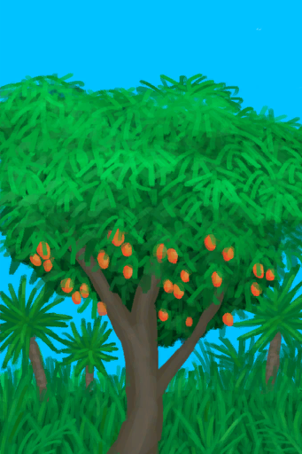

# 芒果树  
> 我能在上面采集芒果。  
  
<table class="table table-bordered" data-toggle="table"  data-show-header="false"><thead style="display:none"><tr ><th  style="width:50%;text-align:left;vertical-align:top;"  >title</th><th  style="width:50%;text-align:left;vertical-align:top;"  ></th></tr></thead><tr ><td  style="width:50%;text-align:left;vertical-align:top;"  >**可用次数：**8</td><td  style="width:50%;text-align:left;vertical-align:top;"  >

<a href="MangoTree.md" style="color:black">芒果树</a>

</td></tr></tbody></table>  
  
## 获取来源  

探索

[丛林高地](JungleHighlands.md)

转化

[芒果树](MangoTree.md)

转化

[摘光的芒果树](MangoTreeCleared.md)

  
  
## 动作  

<table><tr><td rowspan="2" style="width:200px;text-align:center;font-size:1.3em;font-weight:bold">

采集

3分

</td><td></td></tr><tr><td><b>自身：</b>使用次数  <b>-1</b></td></tr><tr><td colspan="2"><b>需求：</b>[

[光亮](Light.md)](Light.md): <b>10-100</b></td></tr><tr><td colspan="2">[

[芒果](Mango.md)](Mango.md)(<b>+1</b>)</td></tr></table>
  
  
  
## 属性   

<table style="margin-bottom:0px;"><tr><td style="width:30%;text-align:left; background-color:#FEFEFE;font-size:1.3em;font-weight:bold;">使用次数</td><td style="font-size:1em;background-color:#FEFEFE">初始：8 -</td></tr><tr style="background-color:#FFFFFF"><td colspan=2>** 到达0时： ** 自身: → [

[摘光的芒果树](MangoTreeCleared.md)](MangoTreeCleared.md)</td></tr></table>
  

<table style="margin-bottom:0px;"><tr><td style="width:30%;text-align:left; background-color:#FEFEFE;font-size:1.3em;font-weight:bold;">

芒果 成熟度</td><td style="font-size:1em;background-color:#FEFEFE">初始：0 , 最大：2880 每15分钟+1 , 最多需要：30天</td></tr><tr style="background-color:#FFFFFF"><td colspan=2>** 到达上限时： ** 自身: → [

[芒果树](MangoTree.md)](MangoTree.md)</td></tr></table>
  

