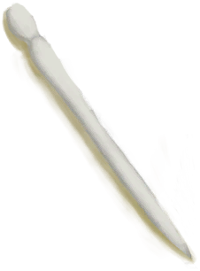
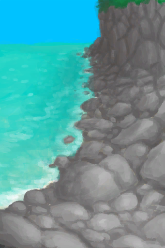
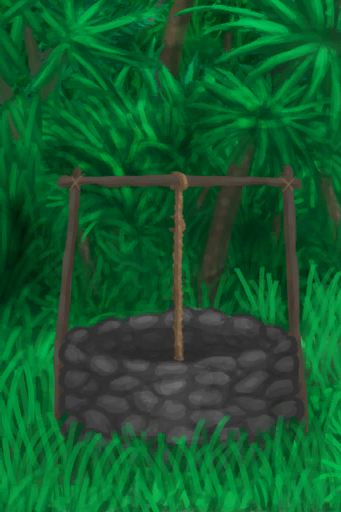
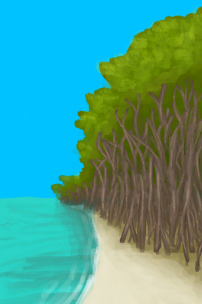
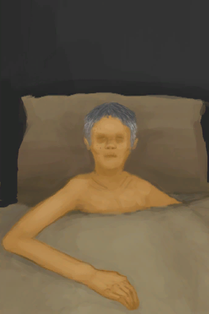
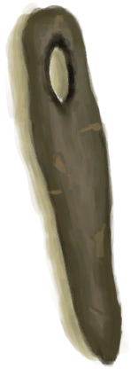
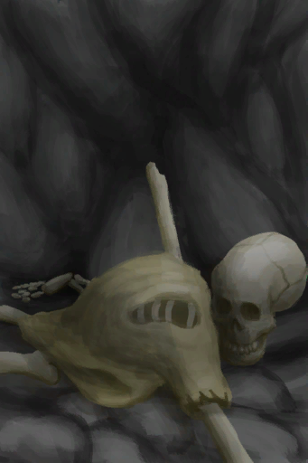

# 情绪  
> 显示你当前的基本情绪。情绪会影响你的免疫系统，在极端情况下会导致抑郁或狂躁状态。  
> 你的情绪代表了你当前的心情。  情绪低落会削弱你的<b>免疫系统</b>，让你睡得更多，工作生活效率低下，因为无论你做什么都感觉没有意义。  为了保持高昂的情绪，一定要避免处于<b>负面状态</b>中，如饥饿、口渴或疼痛时，别忘了时不时地休息一下。  
  

<b>基础值: </b> 0 
  

<b>变化范围: </b> -350 ~ 350 
  

<b>基础变化率: </b> 无 
  

<b>衰减: </b>相同来源1天内衰减50%，叠加2次 
  
## 阶段  

<table><tr style="height:2em;"><td style="background-color:#F0F0F0;text-align:center;width:180px;font-size:1.4em;font-weight:bold;vertical-align:middle;">
326 ～ 350

93% ～ 100%
</td><td colspan=2 style="font-size:1.1em;vertical-align:middle;background-color:#F9F9F9;">
<b>

欢欣</b>

&nbsp;&nbsp;我对生活很满意
</td></tr><tr><td colspan=2><b>影响：</b>[

[免疫系统](ImmuneSystem.md)](ImmuneSystem.md)<b>+100</b>, [

[情绪](Morale.md)](Morale.md)加成<b>-3</b>, [

[世界观](Structure.md)](Structure.md)加成<b>-4</b>, [

[孤独感](Loneliness.md)](Loneliness.md)加成<b>-1</b>, [

[狂躁](Mania.md)](Mania.md)加成<b>+0.75</b>, [

[失实症](Derealization.md)](Derealization.md)加成<b>-100</b></td></tr><tr><td colspan=2></td></tr><tr style="height:2em;"><td style="background-color:#F0F0F0;text-align:center;width:180px;font-size:1.4em;font-weight:bold;vertical-align:middle;">
251 ～ 325

71% ～ 92%
</td><td colspan=2 style="font-size:1.1em;vertical-align:middle;background-color:#F9F9F9;">
<b>

快乐</b>

&nbsp;&nbsp;我对生活很满意
</td></tr><tr><td colspan=2><b>影响：</b>[

[免疫系统](ImmuneSystem.md)](ImmuneSystem.md)<b>+75</b>, [

[情绪](Morale.md)](Morale.md)加成<b>-2</b>, [

[孤独感](Loneliness.md)](Loneliness.md)加成<b>-0.5</b>, [

[狂躁](Mania.md)](Mania.md)加成<b>+0.5</b>, [

[失实症](Derealization.md)](Derealization.md)加成<b>-50</b></td></tr><tr><td colspan=2></td></tr><tr style="height:2em;"><td style="background-color:#F0F0F0;text-align:center;width:180px;font-size:1.4em;font-weight:bold;vertical-align:middle;">
100 ～ 250

28% ～ 71%
</td><td colspan=2 style="font-size:1.1em;vertical-align:middle;background-color:#F9F9F9;">
<b>

满意</b>

&nbsp;&nbsp;我很满意现在的生活
</td></tr><tr><td colspan=2><b>影响：</b>[

[免疫系统](ImmuneSystem.md)](ImmuneSystem.md)<b>+50</b>, [

[情绪](Morale.md)](Morale.md)加成<b>-1</b>, [

[失实症](Derealization.md)](Derealization.md)加成<b>-25</b></td></tr><tr><td colspan=2></td></tr><tr style="height:2em;"><td style="background-color:#F0F0F0;text-align:center;width:180px;font-size:1.4em;font-weight:bold;vertical-align:middle;">
-250 ～ -100

-72% ～ -29%
</td><td colspan=2 style="font-size:1.1em;vertical-align:middle;background-color:#F9F9F9;">
<b>

失落</b>

&nbsp;&nbsp;我有点难过
</td></tr><tr><td colspan=2><b>影响：</b>[

[免疫系统](ImmuneSystem.md)](ImmuneSystem.md)<b>-25</b>, [

[食欲](Appetite.md)](Appetite.md)<b>-25</b>, [

[情绪](Morale.md)](Morale.md)加成<b>+0.5</b>, [

[失实症](Derealization.md)](Derealization.md)加成<b>-10</b></td></tr><tr><td colspan=2></td></tr><tr style="height:2em;"><td style="background-color:#F0F0F0;text-align:center;width:180px;font-size:1.4em;font-weight:bold;vertical-align:middle;">
-300 ～ -251

-86% ～ -72%
</td><td colspan=2 style="font-size:1.1em;vertical-align:middle;background-color:#F9F9F9;">
<b>

抑郁</b>

&nbsp;&nbsp;撑不下去了……
</td></tr><tr><td colspan=2><b>影响：</b>[

[免疫系统](ImmuneSystem.md)](ImmuneSystem.md)<b>-50</b>, [

[食欲](Appetite.md)](Appetite.md)<b>-50</b>, [

[情绪](Morale.md)](Morale.md)加成<b>+1</b>, [

[世界观](Structure.md)](Structure.md)加成<b>-1</b></td></tr><tr><td colspan=2><b>影响动作：</b>[“休息动作(组)”](SleepAction.md): , [睡眠钟](SleepClock.md)<b>+2</b>, 耗时+2</td></tr><tr><td colspan=2></td></tr><tr style="height:2em;"><td style="background-color:#F0F0F0;text-align:center;width:180px;font-size:1.4em;font-weight:bold;vertical-align:middle;">
-349 ～ -301

-100% ～ -86%
</td><td colspan=2 style="font-size:1.1em;vertical-align:middle;background-color:#F9F9F9;">
<b>

严重抑郁</b>

&nbsp;&nbsp;生活毫无乐趣……
</td></tr><tr><td colspan=2><b>影响：</b>[

[免疫系统](ImmuneSystem.md)](ImmuneSystem.md)<b>-75</b>, [

[食欲](Appetite.md)](Appetite.md)<b>-75</b>, [

[情绪](Morale.md)](Morale.md)加成<b>+1.5</b>, [

[世界观](Structure.md)](Structure.md)加成<b>-2</b>, [

[失实症](Derealization.md)](Derealization.md)加成<b>+0.75</b></td></tr><tr><td colspan=2><b>影响动作：</b>[“手部动作(组)”](HandAction.md): , [“腿部动作(组)”](LegAction.md): , 耗时+1, , [“休息动作(组)”](SleepAction.md): , [睡眠钟](SleepClock.md)<b>+4</b>, 耗时+4</td></tr><tr><td colspan=2></td></tr><tr style="height:2em;"><td style="background-color:#F0F0F0;text-align:center;width:180px;font-size:1.4em;font-weight:bold;vertical-align:middle;">
-350

-100%
</td><td colspan=2 style="font-size:1.1em;vertical-align:middle;background-color:#F9F9F9;">
<b>

崩溃</b>

&nbsp;&nbsp;活着毫无意义……
</td></tr><tr><td colspan=2><b>影响：</b>[

[免疫系统](ImmuneSystem.md)](ImmuneSystem.md)<b>-100</b>, [

[食欲](Appetite.md)](Appetite.md)<b>-100</b>, [

[情绪](Morale.md)](Morale.md)加成<b>+2</b>, [

[世界观](Structure.md)](Structure.md)加成<b>-2</b>, [

[失实症](Derealization.md)](Derealization.md)加成<b>+1.5</b></td></tr><tr><td colspan=2><b>影响动作：</b>[“手部动作(组)”](HandAction.md): , [“腿部动作(组)”](LegAction.md): , 耗时+1, , [“休息动作(组)”](SleepAction.md): , [睡眠钟](SleepClock.md)<b>+6</b>, 耗时+6</td></tr><tr><td colspan=2></td></tr></table>
  
## 相关卡牌  
[疼痛](Pain.md)  |  [发烧](Fever.md)  |  [水分](Hydration.md)  |  [压力](Stress.md)  |  [狂躁](Mania.md)  |  [恶心](Nausea.md)  |  [腹泻](Diarrhoea.md)  |  [清醒度](Wakefulness.md)  |  [饱食](Satiation.md)  |  [香蕉<nobr>厌倦度</nobr>](SaturationBananas.md)  |  [鸟类<nobr>厌倦度</nobr>](SaturationBird.md)  |  [椰子<nobr>厌倦度</nobr>](SaturationCoconuts.md)  |  [甲壳类<nobr>厌倦度</nobr>](SaturationCrustaceans.md)  |  [乳品<nobr>厌倦度</nobr>](SaturationDairy.md)  |  [蛋类<nobr>厌倦度</nobr>](SaturationEggs.md)  |  [鱼类<nobr>厌倦度</nobr>](SaturationFish.md)  |  [水果<nobr>厌倦度</nobr>](SaturationFruits.md)  |  [肉类<nobr>厌倦度</nobr>](SaturationMeat.md)  |  [软体类<nobr>厌倦度</nobr>](SaturationMollusks.md)  |  [蘑菇<nobr>厌倦度</nobr>](SaturationMushrooms.md)  |  [坚果<nobr>厌倦度</nobr>](SaturationNuts.md)  |  [干粮<nobr>厌倦度</nobr>](SaturationRations.md)  |  [稻米<nobr>厌倦度</nobr>](SaturationRice.md)  |  [爬行类厌倦度](SaturationReptile.md)  |  [西米<nobr>厌倦度</nobr>](SaturationSago.md)  |  [糖<nobr>厌倦度</nobr>](SaturationSugar.md)  |  [蔬菜<nobr>厌倦度</nobr>](SaturationVegetables.md)  |  [参薯<nobr>厌倦度</nobr>](SaturationYam.md)  |  [过热](Hyperthermia.md)  |  [失温](Hypothermia.md)  |  [外星植物渴求](AlienCravings.md)  |  [孤独感](Loneliness.md)  |  [酒精](Alcohol.md)  |  [失血](BloodLoss.md)  |  [船长陪伴](CaptainCompany.md)  |  [月季效果](ChinaRoseEffect.md)  |  [情绪钟摆](MoodOscillator.md)  |  [茉莉效果](JasmineEffect.md)  |  [舒适度](Comfort.md)  |  [娱乐](Entertainment.md)  |  [神圣灵视](GodInsight.md)  |  [孤立感](Isolation.md)  |  [哀悼](Mourning.md)  |  [蛇床子素](Psylocibin.md)  
## 加成值影响因素  
<table class="table table-bordered" data-toggle="table"  ><thead style=""><tr ><th  style="text-align:left;vertical-align:top;"  >来源</th><th  style="text-align:left;vertical-align:top;"  >操作</th><th  style="text-align:left;vertical-align:top;"  >值</th></tr></thead><tr ><td  style="text-align:left;vertical-align:top;"  >

[乐观主义](Pk_4_Optimist.md)</td><td  style="text-align:left;vertical-align:top;"  >特质影响</td><td  style="text-align:left;vertical-align:top;"  >加成+0.75</td></tr><tr ><td  style="text-align:left;vertical-align:top;"  >[茉莉蜡烛(开)](CandleJasmineOn.md)</td><td  style="text-align:left;vertical-align:top;"  >被动效果</td><td  style="text-align:left;vertical-align:top;"  >加成+0.5</td></tr><tr ><td  style="text-align:left;vertical-align:top;"  >[铜项链](CopperNecklace.md)</td><td  style="text-align:left;vertical-align:top;"  >被动效果</td><td  style="text-align:left;vertical-align:top;"  >加成+0.25</td></tr><tr ><td  style="text-align:left;vertical-align:top;"  >[鲜花项链](FlowerNecklace.md)</td><td  style="text-align:left;vertical-align:top;"  >被动效果</td><td  style="text-align:left;vertical-align:top;"  >加成+0.25</td></tr><tr ><td  style="text-align:left;vertical-align:top;"  >[夏威夷衬衫](HawaiianShirt.md)</td><td  style="text-align:left;vertical-align:top;"  >被动效果</td><td  style="text-align:left;vertical-align:top;"  >加成+0.25</td></tr><tr ><td  style="text-align:left;vertical-align:top;"  >[卫衣](HoodieRetromation.md)</td><td  style="text-align:left;vertical-align:top;"  >被动效果</td><td  style="text-align:left;vertical-align:top;"  >加成+0.25</td></tr><tr ><td  style="text-align:left;vertical-align:top;"  >[草裙](LeafSKirt.md)</td><td  style="text-align:left;vertical-align:top;"  >被动效果</td><td  style="text-align:left;vertical-align:top;"  >加成+0.25</td></tr><tr ><td  style="text-align:left;vertical-align:top;"  >[珍珠项链](PearlNecklace.md)</td><td  style="text-align:left;vertical-align:top;"  >被动效果</td><td  style="text-align:left;vertical-align:top;"  >加成+0.25</td></tr><tr ><td  style="text-align:left;vertical-align:top;"  >[海鸥护符](SeagullCharm.md)</td><td  style="text-align:left;vertical-align:top;"  >被动效果</td><td  style="text-align:left;vertical-align:top;"  >加成+0.25</td></tr><tr ><td  style="text-align:left;vertical-align:top;"  >[贝壳项链](SeashellNecklace.md)</td><td  style="text-align:left;vertical-align:top;"  >被动效果</td><td  style="text-align:left;vertical-align:top;"  >加成+0.25</td></tr><tr ><td  style="text-align:left;vertical-align:top;"  >[月季](ChinaRoseFlowers.md)</td><td  style="text-align:left;vertical-align:top;"  >被动效果</td><td  style="text-align:left;vertical-align:top;"  >加成+0.25</td></tr><tr ><td  style="text-align:left;vertical-align:top;"  >[香茅蜡烛(开)](CandleCitronellaOn.md)</td><td  style="text-align:left;vertical-align:top;"  >被动效果</td><td  style="text-align:left;vertical-align:top;"  >加成+0.25</td></tr><tr ><td  style="text-align:left;vertical-align:top;"  >[干辣椒](ChiliesDried.md)</td><td  style="text-align:left;vertical-align:top;"  >食用</td><td  style="text-align:left;vertical-align:top;"  >加成+0</td></tr><tr ><td  style="text-align:left;vertical-align:top;"  >[月季](ChinaRoseFlowers.md)</td><td  style="text-align:left;vertical-align:top;"  >食用</td><td  style="text-align:left;vertical-align:top;"  >加成+0</td></tr><tr ><td  style="text-align:left;vertical-align:top;"  >[鱼干](FishDried.md)</td><td  style="text-align:left;vertical-align:top;"  >食用</td><td  style="text-align:left;vertical-align:top;"  >加成+0</td></tr><tr ><td  style="text-align:left;vertical-align:top;"  >[咸鱼](FishSalted.md)</td><td  style="text-align:left;vertical-align:top;"  >食用</td><td  style="text-align:left;vertical-align:top;"  >加成+0</td></tr><tr ><td  style="text-align:left;vertical-align:top;"  >[柠檬草](LemongrassStalks.md)</td><td  style="text-align:left;vertical-align:top;"  >食用</td><td  style="text-align:left;vertical-align:top;"  >加成+0</td></tr><tr ><td  style="text-align:left;vertical-align:top;"  >[虾](Prawns.md)</td><td  style="text-align:left;vertical-align:top;"  >食用</td><td  style="text-align:left;vertical-align:top;"  >加成+0</td></tr><tr ><td  style="text-align:left;vertical-align:top;"  >[煮熟的参薯](YamBoiled.md)</td><td  style="text-align:left;vertical-align:top;"  >食用</td><td  style="text-align:left;vertical-align:top;"  >加成+0</td></tr><tr ><td  style="text-align:left;vertical-align:top;"  >[眼镜蛇毒液](W_CobraSpit.md)</td><td  style="text-align:left;vertical-align:top;"  >用海水清理 ** 拖入：**[盐水](LQ_WaterSalt.md)</td><td  style="text-align:left;vertical-align:top;"  >加成+0</td></tr><tr ><td  style="text-align:left;vertical-align:top;"  >[蜂蜜水](LQ_HoneyWater.md)</td><td  style="text-align:left;vertical-align:top;"  >饮用</td><td  style="text-align:left;vertical-align:top;"  >加成+0</td></tr><tr ><td  style="text-align:left;vertical-align:top;"  >[糖水](LQ_SugarWater.md)</td><td  style="text-align:left;vertical-align:top;"  >饮用</td><td  style="text-align:left;vertical-align:top;"  >加成+0</td></tr><tr ><td  style="text-align:left;vertical-align:top;"  >[鬼掌印](W_HunterMark.md)</td><td  style="text-align:left;vertical-align:top;"  >条件被动</td><td  style="text-align:left;vertical-align:top;"  >加成-1</td></tr><tr ><td  style="text-align:left;vertical-align:top;"  >[崩解烙印](W_UnravellingMark.md)</td><td  style="text-align:left;vertical-align:top;"  >条件被动</td><td  style="text-align:left;vertical-align:top;"  >加成-1</td></tr><tr ><td  style="text-align:left;vertical-align:top;"  >

[悲观主义](Pk_4_Pessimistic.md)</td><td  style="text-align:left;vertical-align:top;"  >特质影响</td><td  style="text-align:left;vertical-align:top;"  >加成-2</td></tr></tbody></table>  
  
## 可被以下操作改变  
<table class="table table-bordered" data-toggle="table"  ><thead style=""><tr ><th  style="text-align:left;vertical-align:top;"  >来源</th><th  style="text-align:left;vertical-align:top;"  >操作</th><th  style="text-align:left;vertical-align:top;"  >值</th></tr></thead><tr ><td  style="text-align:left;vertical-align:top;"  >[

[时候已到！(事件)](Event_Pregnancy.md)](Event_Pregnancy.md)</td><td  style="text-align:left;vertical-align:top;"  >分娩！</td><td  style="text-align:left;vertical-align:top;"  >250</td></tr><tr ><td  style="text-align:left;vertical-align:top;"  >[

[木筏(蓝图)](Bp_Raft.md)](Bp_Raft.md)</td><td  style="text-align:left;vertical-align:top;"  >蓝图制造</td><td  style="text-align:left;vertical-align:top;"  >100</td></tr><tr ><td  style="text-align:left;vertical-align:top;"  >[

[宿敌被打败了！(事件)](Event_EnemyFightSuccess.md)](Event_EnemyFightSuccess.md)</td><td  style="text-align:left;vertical-align:top;"  >胜利啦！</td><td  style="text-align:left;vertical-align:top;"  >100</td></tr><tr ><td  style="text-align:left;vertical-align:top;"  >[

[猎手被击败了！(事件)](Event_HunterFightSuccess.md)](Event_HunterFightSuccess.md)</td><td  style="text-align:left;vertical-align:top;"  >胜利啦！</td><td  style="text-align:left;vertical-align:top;"  >100</td></tr><tr ><td  style="text-align:left;vertical-align:top;"  >[

[箭术提升了！(事件)](Event_SkillArchery1.md)](Event_SkillArchery1.md)</td><td  style="text-align:left;vertical-align:top;"  >真不错！</td><td  style="text-align:left;vertical-align:top;"  >100</td></tr><tr ><td  style="text-align:left;vertical-align:top;"  >[

[箭术提升了！(事件)](Event_SkillArchery2.md)](Event_SkillArchery2.md)</td><td  style="text-align:left;vertical-align:top;"  >真不错！</td><td  style="text-align:left;vertical-align:top;"  >100</td></tr><tr ><td  style="text-align:left;vertical-align:top;"  >[

[箭术提升了！(事件)](Event_SkillArchery3.md)](Event_SkillArchery3.md)</td><td  style="text-align:left;vertical-align:top;"  >真不错！</td><td  style="text-align:left;vertical-align:top;"  >100</td></tr><tr ><td  style="text-align:left;vertical-align:top;"  >[

[箭术提升了！(事件)](Event_SkillArchery4.md)](Event_SkillArchery4.md)</td><td  style="text-align:left;vertical-align:top;"  >真不错！</td><td  style="text-align:left;vertical-align:top;"  >100</td></tr><tr ><td  style="text-align:left;vertical-align:top;"  >[

[烹饪技能提升！(事件)](Event_SkillCooking1.md)](Event_SkillCooking1.md)</td><td  style="text-align:left;vertical-align:top;"  >真不错！</td><td  style="text-align:left;vertical-align:top;"  >100</td></tr><tr ><td  style="text-align:left;vertical-align:top;"  >[

[烹饪技能提升！(事件)](Event_SkillCooking2.md)](Event_SkillCooking2.md)</td><td  style="text-align:left;vertical-align:top;"  >真不错！</td><td  style="text-align:left;vertical-align:top;"  >100</td></tr><tr ><td  style="text-align:left;vertical-align:top;"  >[

[烹饪技能提升！(事件)](Event_SkillCooking3.md)](Event_SkillCooking3.md)</td><td  style="text-align:left;vertical-align:top;"  >真不错！</td><td  style="text-align:left;vertical-align:top;"  >100</td></tr><tr ><td  style="text-align:left;vertical-align:top;"  >[

[烹饪技能提升！(事件)](Event_SkillCooking4.md)](Event_SkillCooking4.md)</td><td  style="text-align:left;vertical-align:top;"  >真不错！</td><td  style="text-align:left;vertical-align:top;"  >100</td></tr><tr ><td  style="text-align:left;vertical-align:top;"  >[

[制作技能提升！(事件)](Event_SkillCrafting1.md)](Event_SkillCrafting1.md)</td><td  style="text-align:left;vertical-align:top;"  >真不错！</td><td  style="text-align:left;vertical-align:top;"  >100</td></tr><tr ><td  style="text-align:left;vertical-align:top;"  >[

[制作技能提升！(事件)](Event_SkillCrafting2.md)](Event_SkillCrafting2.md)</td><td  style="text-align:left;vertical-align:top;"  >真不错！</td><td  style="text-align:left;vertical-align:top;"  >100</td></tr><tr ><td  style="text-align:left;vertical-align:top;"  >[

[制作技能提升！(事件)](Event_SkillCrafting3.md)](Event_SkillCrafting3.md)</td><td  style="text-align:left;vertical-align:top;"  >真不错！</td><td  style="text-align:left;vertical-align:top;"  >100</td></tr><tr ><td  style="text-align:left;vertical-align:top;"  >[

[制作技能提升！(事件)](Event_SkillCrafting4.md)](Event_SkillCrafting4.md)</td><td  style="text-align:left;vertical-align:top;"  >真不错！</td><td  style="text-align:left;vertical-align:top;"  >100</td></tr><tr ><td  style="text-align:left;vertical-align:top;"  >[

[钓鱼技能提升！(事件)](Event_SkillFishing1.md)](Event_SkillFishing1.md)</td><td  style="text-align:left;vertical-align:top;"  >真不错！</td><td  style="text-align:left;vertical-align:top;"  >100</td></tr><tr ><td  style="text-align:left;vertical-align:top;"  >[

[钓鱼技能提升！(事件)](Event_SkillFishing2.md)](Event_SkillFishing2.md)</td><td  style="text-align:left;vertical-align:top;"  >真不错！</td><td  style="text-align:left;vertical-align:top;"  >100</td></tr><tr ><td  style="text-align:left;vertical-align:top;"  >[

[钓鱼技能提升！(事件)](Event_SkillFishing3.md)](Event_SkillFishing3.md)</td><td  style="text-align:left;vertical-align:top;"  >真不错！</td><td  style="text-align:left;vertical-align:top;"  >100</td></tr><tr ><td  style="text-align:left;vertical-align:top;"  >[

[钓鱼技能提升！(事件)](Event_SkillFishing4.md)](Event_SkillFishing4.md)</td><td  style="text-align:left;vertical-align:top;"  >真不错！</td><td  style="text-align:left;vertical-align:top;"  >100</td></tr><tr ><td  style="text-align:left;vertical-align:top;"  >[

[薬草学技能提升了！(事件)](Event_SkillHerbology1.md)](Event_SkillHerbology1.md)</td><td  style="text-align:left;vertical-align:top;"  >真不错！</td><td  style="text-align:left;vertical-align:top;"  >100</td></tr><tr ><td  style="text-align:left;vertical-align:top;"  >[

[薬草学技能提升了！(事件)](Event_SkillHerbology2.md)](Event_SkillHerbology2.md)</td><td  style="text-align:left;vertical-align:top;"  >真不错！</td><td  style="text-align:left;vertical-align:top;"  >100</td></tr><tr ><td  style="text-align:left;vertical-align:top;"  >[

[薬草学技能提升了！(事件)](Event_SkillHerbology3.md)](Event_SkillHerbology3.md)</td><td  style="text-align:left;vertical-align:top;"  >真不错！</td><td  style="text-align:left;vertical-align:top;"  >100</td></tr><tr ><td  style="text-align:left;vertical-align:top;"  >[

[薬草学技能提升了！(事件)](Event_SkillHerbology4.md)](Event_SkillHerbology4.md)</td><td  style="text-align:left;vertical-align:top;"  >真不错！</td><td  style="text-align:left;vertical-align:top;"  >100</td></tr><tr ><td  style="text-align:left;vertical-align:top;"  >[

[你顿悟了！(事件)](Event_SkillInsight1.md)](Event_SkillInsight1.md)</td><td  style="text-align:left;vertical-align:top;"  >继续</td><td  style="text-align:left;vertical-align:top;"  >100</td></tr><tr ><td  style="text-align:left;vertical-align:top;"  >[

[你顿悟了！(事件)](Event_SkillInsight2.md)](Event_SkillInsight2.md)</td><td  style="text-align:left;vertical-align:top;"  >继续</td><td  style="text-align:left;vertical-align:top;"  >100</td></tr><tr ><td  style="text-align:left;vertical-align:top;"  >[

[你顿悟了！(事件)](Event_SkillInsight3.md)](Event_SkillInsight3.md)</td><td  style="text-align:left;vertical-align:top;"  >继续</td><td  style="text-align:left;vertical-align:top;"  >100</td></tr><tr ><td  style="text-align:left;vertical-align:top;"  >[

[你顿悟了！(事件)](Event_SkillInsight4.md)](Event_SkillInsight4.md)</td><td  style="text-align:left;vertical-align:top;"  >继续</td><td  style="text-align:left;vertical-align:top;"  >100</td></tr><tr ><td  style="text-align:left;vertical-align:top;"  >[

[石工技能提升！(事件)](Event_SkillKnapping1.md)](Event_SkillKnapping1.md)</td><td  style="text-align:left;vertical-align:top;"  >真不错！</td><td  style="text-align:left;vertical-align:top;"  >100</td></tr><tr ><td  style="text-align:left;vertical-align:top;"  >[

[石工技能提升！(事件)](Event_SkillKnapping2.md)](Event_SkillKnapping2.md)</td><td  style="text-align:left;vertical-align:top;"  >真不错！</td><td  style="text-align:left;vertical-align:top;"  >100</td></tr><tr ><td  style="text-align:left;vertical-align:top;"  >[

[石工技能提升！(事件)](Event_SkillKnapping3.md)](Event_SkillKnapping3.md)</td><td  style="text-align:left;vertical-align:top;"  >真不错！</td><td  style="text-align:left;vertical-align:top;"  >100</td></tr><tr ><td  style="text-align:left;vertical-align:top;"  >[

[石工技能提升！(事件)](Event_SkillKnapping4.md)](Event_SkillKnapping4.md)</td><td  style="text-align:left;vertical-align:top;"  >真不错！</td><td  style="text-align:left;vertical-align:top;"  >100</td></tr><tr ><td  style="text-align:left;vertical-align:top;"  >[

[金工技能提升！(事件)](Event_SkillMetalworking1.md)](Event_SkillMetalworking1.md)</td><td  style="text-align:left;vertical-align:top;"  >真不错！</td><td  style="text-align:left;vertical-align:top;"  >100</td></tr><tr ><td  style="text-align:left;vertical-align:top;"  >[

[金工技能提升！(事件)](Event_SkillMetalworking2.md)](Event_SkillMetalworking2.md)</td><td  style="text-align:left;vertical-align:top;"  >真不错！</td><td  style="text-align:left;vertical-align:top;"  >100</td></tr><tr ><td  style="text-align:left;vertical-align:top;"  >[

[制作技能提升！(事件)](Event_SkillMetalworking3.md)](Event_SkillMetalworking3.md)</td><td  style="text-align:left;vertical-align:top;"  >真不错！</td><td  style="text-align:left;vertical-align:top;"  >100</td></tr><tr ><td  style="text-align:left;vertical-align:top;"  >[

[金工技能提升！(事件)](Event_SkillMetalworking4.md)](Event_SkillMetalworking4.md)</td><td  style="text-align:left;vertical-align:top;"  >真不错！</td><td  style="text-align:left;vertical-align:top;"  >100</td></tr><tr ><td  style="text-align:left;vertical-align:top;"  >[

[击鼓技能提升！(事件)](Event_SkillPercussion1.md)](Event_SkillPercussion1.md)</td><td  style="text-align:left;vertical-align:top;"  >真不错！</td><td  style="text-align:left;vertical-align:top;"  >100</td></tr><tr ><td  style="text-align:left;vertical-align:top;"  >[

[击鼓技能提升！(事件)](Event_SkillPercussion2.md)](Event_SkillPercussion2.md)</td><td  style="text-align:left;vertical-align:top;"  >真不错！</td><td  style="text-align:left;vertical-align:top;"  >100</td></tr><tr ><td  style="text-align:left;vertical-align:top;"  >[

[击鼓技能提升！(事件)](Event_SkillPercussion3.md)](Event_SkillPercussion3.md)</td><td  style="text-align:left;vertical-align:top;"  >真不错！</td><td  style="text-align:left;vertical-align:top;"  >100</td></tr><tr ><td  style="text-align:left;vertical-align:top;"  >[

[击鼓技能提升！(事件)](Event_SkillPercussion4.md)](Event_SkillPercussion4.md)</td><td  style="text-align:left;vertical-align:top;"  >真不错！</td><td  style="text-align:left;vertical-align:top;"  >100</td></tr><tr ><td  style="text-align:left;vertical-align:top;"  >[

[长矛技巧提升！(事件)](Event_SkillSpearFighting1.md)](Event_SkillSpearFighting1.md)</td><td  style="text-align:left;vertical-align:top;"  >真不错！</td><td  style="text-align:left;vertical-align:top;"  >100</td></tr><tr ><td  style="text-align:left;vertical-align:top;"  >[

[长矛技巧提升！(事件)](Event_SkillSpearFighting2.md)](Event_SkillSpearFighting2.md)</td><td  style="text-align:left;vertical-align:top;"  >真不错！</td><td  style="text-align:left;vertical-align:top;"  >100</td></tr><tr ><td  style="text-align:left;vertical-align:top;"  >[

[长矛技巧提升！(事件)](Event_SkillSpearFighting3.md)](Event_SkillSpearFighting3.md)</td><td  style="text-align:left;vertical-align:top;"  >真不错！</td><td  style="text-align:left;vertical-align:top;"  >100</td></tr><tr ><td  style="text-align:left;vertical-align:top;"  >[

[长矛技巧提升！(事件)](Event_SkillSpearFighting4.md)](Event_SkillSpearFighting4.md)</td><td  style="text-align:left;vertical-align:top;"  >真不错！</td><td  style="text-align:left;vertical-align:top;"  >100</td></tr><tr ><td  style="text-align:left;vertical-align:top;"  >[

[叉鱼技能提升！(事件)](Event_SkillSpearFishing1.md)](Event_SkillSpearFishing1.md)</td><td  style="text-align:left;vertical-align:top;"  >真不错！</td><td  style="text-align:left;vertical-align:top;"  >100</td></tr><tr ><td  style="text-align:left;vertical-align:top;"  >[

[叉鱼技能提升！(事件)](Event_SkillSpearFishing2.md)](Event_SkillSpearFishing2.md)</td><td  style="text-align:left;vertical-align:top;"  >真不错！</td><td  style="text-align:left;vertical-align:top;"  >100</td></tr><tr ><td  style="text-align:left;vertical-align:top;"  >[

[叉鱼技能提升！(事件)](Event_SkillSpearFishing3.md)](Event_SkillSpearFishing3.md)</td><td  style="text-align:left;vertical-align:top;"  >真不错！</td><td  style="text-align:left;vertical-align:top;"  >100</td></tr><tr ><td  style="text-align:left;vertical-align:top;"  >[

[叉鱼技能提升！(事件)](Event_SkillSpearFishing4.md)](Event_SkillSpearFishing4.md)</td><td  style="text-align:left;vertical-align:top;"  >真不错！</td><td  style="text-align:left;vertical-align:top;"  >100</td></tr><tr ><td  style="text-align:left;vertical-align:top;"  >[

[纺织技能提升！(事件)](Event_SkillTailoring1.md)](Event_SkillTailoring1.md)</td><td  style="text-align:left;vertical-align:top;"  >真不错！</td><td  style="text-align:left;vertical-align:top;"  >100</td></tr><tr ><td  style="text-align:left;vertical-align:top;"  >[

[纺织技能提升！(事件)](Event_SkillTailoring2.md)](Event_SkillTailoring2.md)</td><td  style="text-align:left;vertical-align:top;"  >真不错！</td><td  style="text-align:left;vertical-align:top;"  >100</td></tr><tr ><td  style="text-align:left;vertical-align:top;"  >[

[纺织技能提升！(事件)](Event_SkillTailoring3.md)](Event_SkillTailoring3.md)</td><td  style="text-align:left;vertical-align:top;"  >真不错！</td><td  style="text-align:left;vertical-align:top;"  >100</td></tr><tr ><td  style="text-align:left;vertical-align:top;"  >[

[纺织技能提升！(事件)](Event_SkillTailoring4.md)](Event_SkillTailoring4.md)</td><td  style="text-align:left;vertical-align:top;"  >真不错！</td><td  style="text-align:left;vertical-align:top;"  >100</td></tr><tr ><td  style="text-align:left;vertical-align:top;"  >[

[陷阱技能提升了！(事件)](Event_SkillTrapping1.md)](Event_SkillTrapping1.md)</td><td  style="text-align:left;vertical-align:top;"  >真不错！</td><td  style="text-align:left;vertical-align:top;"  >100</td></tr><tr ><td  style="text-align:left;vertical-align:top;"  >[

[陷阱技能提升了！(事件)](Event_SkillTrapping2.md)](Event_SkillTrapping2.md)</td><td  style="text-align:left;vertical-align:top;"  >真不错！</td><td  style="text-align:left;vertical-align:top;"  >100</td></tr><tr ><td  style="text-align:left;vertical-align:top;"  >[

[陷阱技能提升了！(事件)](Event_SkillTrapping3.md)](Event_SkillTrapping3.md)</td><td  style="text-align:left;vertical-align:top;"  >真不错！</td><td  style="text-align:left;vertical-align:top;"  >100</td></tr><tr ><td  style="text-align:left;vertical-align:top;"  >[

[陷阱技能提升了！(事件)](Event_SkillTrapping4.md)](Event_SkillTrapping4.md)</td><td  style="text-align:left;vertical-align:top;"  >真不错！</td><td  style="text-align:left;vertical-align:top;"  >100</td></tr><tr ><td  style="text-align:left;vertical-align:top;"  >[

[击鼓技能提升！(事件)](Event_SkillWindInstruments1.md)](Event_SkillWindInstruments1.md)</td><td  style="text-align:left;vertical-align:top;"  >真不错！</td><td  style="text-align:left;vertical-align:top;"  >100</td></tr><tr ><td  style="text-align:left;vertical-align:top;"  >[

[击鼓技能提升！(事件)](Event_SkillWindInstruments2.md)](Event_SkillWindInstruments2.md)</td><td  style="text-align:left;vertical-align:top;"  >真不错！</td><td  style="text-align:left;vertical-align:top;"  >100</td></tr><tr ><td  style="text-align:left;vertical-align:top;"  >[

[击鼓技能提升！(事件)](Event_SkillWindInstruments3.md)](Event_SkillWindInstruments3.md)</td><td  style="text-align:left;vertical-align:top;"  >真不错！</td><td  style="text-align:left;vertical-align:top;"  >100</td></tr><tr ><td  style="text-align:left;vertical-align:top;"  >[

[击鼓技能提升！(事件)](Event_SkillWindInstruments4.md)](Event_SkillWindInstruments4.md)</td><td  style="text-align:left;vertical-align:top;"  >真不错！</td><td  style="text-align:left;vertical-align:top;"  >100</td></tr><tr ><td  style="text-align:left;vertical-align:top;"  >[

[木工技能提升！(事件)](Event_SkillWoodworking1.md)](Event_SkillWoodworking1.md)</td><td  style="text-align:left;vertical-align:top;"  >真不错！</td><td  style="text-align:left;vertical-align:top;"  >100</td></tr><tr ><td  style="text-align:left;vertical-align:top;"  >[

[木工技能提升！(事件)](Event_SkillWoodworking2.md)](Event_SkillWoodworking2.md)</td><td  style="text-align:left;vertical-align:top;"  >真不错！</td><td  style="text-align:left;vertical-align:top;"  >100</td></tr><tr ><td  style="text-align:left;vertical-align:top;"  >[

[木工技能提升！(事件)](Event_SkillWoodworking3.md)](Event_SkillWoodworking3.md)</td><td  style="text-align:left;vertical-align:top;"  >真不错！</td><td  style="text-align:left;vertical-align:top;"  >100</td></tr><tr ><td  style="text-align:left;vertical-align:top;"  >[

[木工技能提升！(事件)](Event_SkillWoodworking4.md)](Event_SkillWoodworking4.md)</td><td  style="text-align:left;vertical-align:top;"  >真不错！</td><td  style="text-align:left;vertical-align:top;"  >100</td></tr><tr ><td  style="text-align:left;vertical-align:top;"  >[

[监视者(事件)](Event_WatchedExperience1gGod.md)](Event_WatchedExperience1gGod.md)</td><td  style="text-align:left;vertical-align:top;"  >成为监视者</td><td  style="text-align:left;vertical-align:top;"  >100</td></tr><tr ><td  style="text-align:left;vertical-align:top;"  >[

[猕猴窝(丛林高地)](MacaqueDenEntrance.md)](MacaqueDenEntrance.md)</td><td  style="text-align:left;vertical-align:top;"  >我TM来啦！ ** 拖入：**[炸‍葯(开)](DynamiteOn.md)</td><td  style="text-align:left;vertical-align:top;"  >100</td></tr><tr ><td  style="text-align:left;vertical-align:top;"  >[

[泥屋(蓝图)](Bp_MudHut.md)](Bp_MudHut.md)</td><td  style="text-align:left;vertical-align:top;"  >蓝图制造</td><td  style="text-align:left;vertical-align:top;"  >50</td></tr><tr ><td  style="text-align:left;vertical-align:top;"  >[

[石屋(蓝图)](Bp_StoneHut.md)](Bp_StoneHut.md)</td><td  style="text-align:left;vertical-align:top;"  >蓝图制造</td><td  style="text-align:left;vertical-align:top;"  >50</td></tr><tr ><td  style="text-align:left;vertical-align:top;"  >[

[韦斯顿(Special1e)(事件)](Event_WestonSpecial1e.md)](Event_WestonSpecial1e.md)</td><td  style="text-align:left;vertical-align:top;"  >继续</td><td  style="text-align:left;vertical-align:top;"  >50</td></tr><tr ><td  style="text-align:left;vertical-align:top;"  >[

[蜜汁火腿](HoneyGlazedPork.md)](HoneyGlazedPork.md)</td><td  style="text-align:left;vertical-align:top;"  >食用</td><td  style="text-align:left;vertical-align:top;"  >35</td></tr><tr ><td  style="text-align:left;vertical-align:top;"  >[

[进阶之调(事件)](Event_NewTuneAdvanced.md)](Event_NewTuneAdvanced.md)</td><td  style="text-align:left;vertical-align:top;"  >继续</td><td  style="text-align:left;vertical-align:top;"  >30</td></tr><tr ><td  style="text-align:left;vertical-align:top;"  >[

[洞穴之调(事件)](Event_NewTuneCave.md)](Event_NewTuneCave.md)</td><td  style="text-align:left;vertical-align:top;"  >继续</td><td  style="text-align:left;vertical-align:top;"  >30</td></tr><tr ><td  style="text-align:left;vertical-align:top;"  >[

[欢快之调(事件)](Event_NewTuneHappy.md)](Event_NewTuneHappy.md)</td><td  style="text-align:left;vertical-align:top;"  >继续</td><td  style="text-align:left;vertical-align:top;"  >30</td></tr><tr ><td  style="text-align:left;vertical-align:top;"  >[

[丛林之调(事件)](Event_NewTuneJungle.md)](Event_NewTuneJungle.md)</td><td  style="text-align:left;vertical-align:top;"  >继续</td><td  style="text-align:left;vertical-align:top;"  >30</td></tr><tr ><td  style="text-align:left;vertical-align:top;"  >[

[孤独之调(事件)](Event_NewTuneLonely.md)](Event_NewTuneLonely.md)</td><td  style="text-align:left;vertical-align:top;"  >继续</td><td  style="text-align:left;vertical-align:top;"  >30</td></tr><tr ><td  style="text-align:left;vertical-align:top;"  >[

[忧伤之调(事件)](Event_NewTuneSad.md)](Event_NewTuneSad.md)</td><td  style="text-align:left;vertical-align:top;"  >继续</td><td  style="text-align:left;vertical-align:top;"  >30</td></tr><tr ><td  style="text-align:left;vertical-align:top;"  >[

[海洋之调(事件)](Event_NewTuneSea.md)](Event_NewTuneSea.md)</td><td  style="text-align:left;vertical-align:top;"  >继续</td><td  style="text-align:left;vertical-align:top;"  >30</td></tr><tr ><td  style="text-align:left;vertical-align:top;"  >[

[简易之调(事件)](Event_NewTuneSimple.md)](Event_NewTuneSimple.md)</td><td  style="text-align:left;vertical-align:top;"  >继续</td><td  style="text-align:left;vertical-align:top;"  >30</td></tr><tr ><td  style="text-align:left;vertical-align:top;"  >[

[韦斯顿之调(事件)](Event_NewTuneWeston.md)](Event_NewTuneWeston.md)</td><td  style="text-align:left;vertical-align:top;"  >继续</td><td  style="text-align:left;vertical-align:top;"  >30</td></tr><tr ><td  style="text-align:left;vertical-align:top;"  >[

[木床(蓝图)](Bp_BedWooden.md)](Bp_BedWooden.md)</td><td  style="text-align:left;vertical-align:top;"  >蓝图制造</td><td  style="text-align:left;vertical-align:top;"  >25</td></tr><tr ><td  style="text-align:left;vertical-align:top;"  >[

[椅子(蓝图)](Bp_Chair.md)](Bp_Chair.md)</td><td  style="text-align:left;vertical-align:top;"  >蓝图制造</td><td  style="text-align:left;vertical-align:top;"  >25</td></tr><tr ><td  style="text-align:left;vertical-align:top;"  >[

[鼓(蓝图)](Bp_Drum.md)](Bp_Drum.md)</td><td  style="text-align:left;vertical-align:top;"  >蓝图制造</td><td  style="text-align:left;vertical-align:top;"  >25</td></tr><tr ><td  style="text-align:left;vertical-align:top;"  >[

[畜栏(蓝图)](Bp_Enclosure.md)](Bp_Enclosure.md)</td><td  style="text-align:left;vertical-align:top;"  >蓝图制造</td><td  style="text-align:left;vertical-align:top;"  >25</td></tr><tr ><td  style="text-align:left;vertical-align:top;"  >[

[骨笛(蓝图)](Bp_FluteBone.md)](Bp_FluteBone.md)</td><td  style="text-align:left;vertical-align:top;"  >蓝图制造</td><td  style="text-align:left;vertical-align:top;"  >25</td></tr><tr ><td  style="text-align:left;vertical-align:top;"  >[

[木笛(蓝图)](Bp_FluteWooden.md)](Bp_FluteWooden.md)</td><td  style="text-align:left;vertical-align:top;"  >蓝图制造</td><td  style="text-align:left;vertical-align:top;"  >25</td></tr><tr ><td  style="text-align:left;vertical-align:top;"  >[

[蜥蜴皮手鼓(蓝图)](Bp_LizardDrum.md)](Bp_LizardDrum.md)</td><td  style="text-align:left;vertical-align:top;"  >蓝图制造</td><td  style="text-align:left;vertical-align:top;"  >25</td></tr><tr ><td  style="text-align:left;vertical-align:top;"  >[

[陶轮(蓝图)](Bp_PotteryWheel.md)](Bp_PotteryWheel.md)</td><td  style="text-align:left;vertical-align:top;"  >蓝图制造</td><td  style="text-align:left;vertical-align:top;"  >25</td></tr><tr ><td  style="text-align:left;vertical-align:top;"  >[

[木桌(蓝图)](Bp_Table.md)](Bp_Table.md)</td><td  style="text-align:left;vertical-align:top;"  >蓝图制造</td><td  style="text-align:left;vertical-align:top;"  >25</td></tr><tr ><td  style="text-align:left;vertical-align:top;"  >[

[地区探索完毕(事件)](Event_AcidLakeExplored.md)](Event_AcidLakeExplored.md)</td><td  style="text-align:left;vertical-align:top;"  >继续</td><td  style="text-align:left;vertical-align:top;"  >25</td></tr><tr ><td  style="text-align:left;vertical-align:top;"  >[

[地区探索完毕(事件)(海湾)](Event_BayExplored.md)](Event_BayExplored.md)</td><td  style="text-align:left;vertical-align:top;"  >继续</td><td  style="text-align:left;vertical-align:top;"  >25</td></tr><tr ><td  style="text-align:left;vertical-align:top;"  >[

[地区探索完毕(事件)(沙滩)](Event_BeachExplored.md)](Event_BeachExplored.md)</td><td  style="text-align:left;vertical-align:top;"  >继续</td><td  style="text-align:left;vertical-align:top;"  >25</td></tr><tr ><td  style="text-align:left;vertical-align:top;"  >[

[地区探索完毕(事件)(鸟岩岛)](Event_BirdRockExplored.md)](Event_BirdRockExplored.md)</td><td  style="text-align:left;vertical-align:top;"  >继续</td><td  style="text-align:left;vertical-align:top;"  >25</td></tr><tr ><td  style="text-align:left;vertical-align:top;"  >[

[地区探索完毕(事件)](Event_CoveExplored.md)](Event_CoveExplored.md)</td><td  style="text-align:left;vertical-align:top;"  >继续</td><td  style="text-align:left;vertical-align:top;"  >25</td></tr><tr ><td  style="text-align:left;vertical-align:top;"  >[

[地区探索完毕(事件)(丛林深处)](Event_DeepJungleExplored.md)](Event_DeepJungleExplored.md)</td><td  style="text-align:left;vertical-align:top;"  >继续</td><td  style="text-align:left;vertical-align:top;"  >25</td></tr><tr ><td  style="text-align:left;vertical-align:top;"  >[

[地区探索完毕(事件)(荒芜沙滩)](Event_DesolateBeachExplored.md)](Event_DesolateBeachExplored.md)</td><td  style="text-align:left;vertical-align:top;"  >继续</td><td  style="text-align:left;vertical-align:top;"  >25</td></tr><tr ><td  style="text-align:left;vertical-align:top;"  >[

[地区探索完毕(事件)(东部草原)](Event_GrasslandsEExplored.md)](Event_GrasslandsEExplored.md)</td><td  style="text-align:left;vertical-align:top;"  >继续</td><td  style="text-align:left;vertical-align:top;"  >25</td></tr><tr ><td  style="text-align:left;vertical-align:top;"  >[

[地区探索完毕(事件)(西部草原)](Event_GrasslandsWExplored.md)](Event_GrasslandsWExplored.md)</td><td  style="text-align:left;vertical-align:top;"  >继续</td><td  style="text-align:left;vertical-align:top;"  >25</td></tr><tr ><td  style="text-align:left;vertical-align:top;"  >[

[地区探索完毕(事件)(东部高地)](Event_HighlandsEExplored.md)](Event_HighlandsEExplored.md)</td><td  style="text-align:left;vertical-align:top;"  >继续</td><td  style="text-align:left;vertical-align:top;"  >25</td></tr><tr ><td  style="text-align:left;vertical-align:top;"  >[

[地区探索完毕(事件)(西部高地)](Event_HighlandsWExplored.md)](Event_HighlandsWExplored.md)</td><td  style="text-align:left;vertical-align:top;"  >继续</td><td  style="text-align:left;vertical-align:top;"  >25</td></tr><tr ><td  style="text-align:left;vertical-align:top;"  >[

[地区探索完毕(事件)](Event_JungleExplored.md)](Event_JungleExplored.md)</td><td  style="text-align:left;vertical-align:top;"  >继续</td><td  style="text-align:left;vertical-align:top;"  >25</td></tr><tr ><td  style="text-align:left;vertical-align:top;"  >[

[地区探索完毕(事件)(丛林高地)](Event_JungleHighlandsExplored.md)](Event_JungleHighlandsExplored.md)</td><td  style="text-align:left;vertical-align:top;"  >继续</td><td  style="text-align:left;vertical-align:top;"  >25</td></tr><tr ><td  style="text-align:left;vertical-align:top;"  >[

[地区探索完毕(事件)(红树林)](Event_MangrovesExplored.md)](Event_MangrovesExplored.md)</td><td  style="text-align:left;vertical-align:top;"  >继续</td><td  style="text-align:left;vertical-align:top;"  >25</td></tr><tr ><td  style="text-align:left;vertical-align:top;"  >[

[地区探索完毕(事件)](Event_OutskirtsExplored.md)](Event_OutskirtsExplored.md)</td><td  style="text-align:left;vertical-align:top;"  >继续</td><td  style="text-align:left;vertical-align:top;"  >25</td></tr><tr ><td  style="text-align:left;vertical-align:top;"  >[

[漂浮的残骸！(事件)](Event_Raft_FloatingDebris.md)](Event_Raft_FloatingDebris.md)</td><td  style="text-align:left;vertical-align:top;"  >继续</td><td  style="text-align:left;vertical-align:top;"  >25</td></tr><tr ><td  style="text-align:left;vertical-align:top;"  >[

[一艘路过的船！(事件)](Event_Raft_PassingShip.md)](Event_Raft_PassingShip.md)</td><td  style="text-align:left;vertical-align:top;"  >继续</td><td  style="text-align:left;vertical-align:top;"  >25</td></tr><tr ><td  style="text-align:left;vertical-align:top;"  >[

[一条鲨鱼！(事件)](Event_Raft_SharkVisitor.md)](Event_Raft_SharkVisitor.md)</td><td  style="text-align:left;vertical-align:top;"  >继续</td><td  style="text-align:left;vertical-align:top;"  >25</td></tr><tr ><td  style="text-align:left;vertical-align:top;"  >[

[地区探索完毕(事件)](Event_RocksExplored.md)](Event_RocksExplored.md)</td><td  style="text-align:left;vertical-align:top;"  >继续</td><td  style="text-align:left;vertical-align:top;"  >25</td></tr><tr ><td  style="text-align:left;vertical-align:top;"  >[

[地区探索完毕(事件)(神秘谷)](Event_SecretValleyExplored.md)](Event_SecretValleyExplored.md)</td><td  style="text-align:left;vertical-align:top;"  >继续</td><td  style="text-align:left;vertical-align:top;"  >25</td></tr><tr ><td  style="text-align:left;vertical-align:top;"  >[

[地区探索完毕(事件)](Event_VolcanoExplored.md)](Event_VolcanoExplored.md)</td><td  style="text-align:left;vertical-align:top;"  >继续</td><td  style="text-align:left;vertical-align:top;"  >25</td></tr><tr ><td  style="text-align:left;vertical-align:top;"  >[

[地区探索完毕(事件)(湿地)](Event_WetlandsExplored.md)](Event_WetlandsExplored.md)</td><td  style="text-align:left;vertical-align:top;"  >继续</td><td  style="text-align:left;vertical-align:top;"  >25</td></tr><tr ><td  style="text-align:left;vertical-align:top;"  >[

[铜制装饰品](CopperDecoration_Mold.md)](CopperDecoration_Mold.md)</td><td  style="text-align:left;vertical-align:top;"  >敲开 ** 拖入：**[“锤”](tag_Hammer.md)</td><td  style="text-align:left;vertical-align:top;"  >25</td></tr><tr ><td  style="text-align:left;vertical-align:top;"  >[

[肉食盛宴](HeartyFeast.md)](HeartyFeast.md)</td><td  style="text-align:left;vertical-align:top;"  >食用</td><td  style="text-align:left;vertical-align:top;"  >25</td></tr><tr ><td  style="text-align:left;vertical-align:top;"  >[

[野猪牙](Tusk.md)](Tusk.md)</td><td  style="text-align:left;vertical-align:top;"  >雕刻 ** 拖入：**[“高级切割工具”](tag_CutterAdv.md)</td><td  style="text-align:left;vertical-align:top;"  >25</td></tr><tr ><td  style="text-align:left;vertical-align:top;"  >[

[棚屋(蓝图)](Bp_Shed.md)](Bp_Shed.md)</td><td  style="text-align:left;vertical-align:top;"  >蓝图制造</td><td  style="text-align:left;vertical-align:top;"  >20</td></tr><tr ><td  style="text-align:left;vertical-align:top;"  >[

[野猪倒下了！(事件)](Event_BoarFightSuccess.md)](Event_BoarFightSuccess.md)</td><td  style="text-align:left;vertical-align:top;"  >继续</td><td  style="text-align:left;vertical-align:top;"  >20</td></tr><tr ><td  style="text-align:left;vertical-align:top;"  >[

[成功！(事件)](Event_CobraFightSuccess.md)](Event_CobraFightSuccess.md)</td><td  style="text-align:left;vertical-align:top;"  >继续</td><td  style="text-align:left;vertical-align:top;"  >20</td></tr><tr ><td  style="text-align:left;vertical-align:top;"  >[

[成功！(事件)](Event_DroneFightSuccess.md)](Event_DroneFightSuccess.md)</td><td  style="text-align:left;vertical-align:top;"  >继续</td><td  style="text-align:left;vertical-align:top;"  >20</td></tr><tr ><td  style="text-align:left;vertical-align:top;"  >[

[我做到啦！(事件)](Event_MacaqueDenFightSuccess.md)](Event_MacaqueDenFightSuccess.md)</td><td  style="text-align:left;vertical-align:top;"  >继续</td><td  style="text-align:left;vertical-align:top;"  >20</td></tr><tr ><td  style="text-align:left;vertical-align:top;"  >[

[我把猕猴吓跑了！(事件)](Event_MacaqueFightEscape.md)](Event_MacaqueFightEscape.md)</td><td  style="text-align:left;vertical-align:top;"  >继续</td><td  style="text-align:left;vertical-align:top;"  >20</td></tr><tr ><td  style="text-align:left;vertical-align:top;"  >[

[那只猕猴倒下了！(事件)](Event_MacaqueFightSuccess.md)](Event_MacaqueFightSuccess.md)</td><td  style="text-align:left;vertical-align:top;"  >继续</td><td  style="text-align:left;vertical-align:top;"  >20</td></tr><tr ><td  style="text-align:left;vertical-align:top;"  >[

[那只猕猴倒下了！(事件)](Event_MacaqueUndeadFightSuccess.md)](Event_MacaqueUndeadFightSuccess.md)</td><td  style="text-align:left;vertical-align:top;"  >继续</td><td  style="text-align:left;vertical-align:top;"  >20</td></tr><tr ><td  style="text-align:left;vertical-align:top;"  >[

[巨蜥倒下了！(事件)](Event_MonitorFightSuccess.md)](Event_MonitorFightSuccess.md)</td><td  style="text-align:left;vertical-align:top;"  >继续</td><td  style="text-align:left;vertical-align:top;"  >20</td></tr><tr ><td  style="text-align:left;vertical-align:top;"  >[

[海怪倒下了！(事件)](Event_SeahoundFightSuccess.md)](Event_SeahoundFightSuccess.md)</td><td  style="text-align:left;vertical-align:top;"  >继续</td><td  style="text-align:left;vertical-align:top;"  >20</td></tr><tr ><td  style="text-align:left;vertical-align:top;"  >[

[鲨鱼死了！(事件)](Event_SharkFightSuccess.md)](Event_SharkFightSuccess.md)</td><td  style="text-align:left;vertical-align:top;"  >继续</td><td  style="text-align:left;vertical-align:top;"  >20</td></tr><tr ><td  style="text-align:left;vertical-align:top;"  >[

[椰子鱼](CoconutFish.md)](CoconutFish.md)</td><td  style="text-align:left;vertical-align:top;"  >食用</td><td  style="text-align:left;vertical-align:top;"  >15</td></tr><tr ><td  style="text-align:left;vertical-align:top;"  >[

[醉蟹](DrunkenCrab.md)](DrunkenCrab.md)</td><td  style="text-align:left;vertical-align:top;"  >食用</td><td  style="text-align:left;vertical-align:top;"  >15</td></tr><tr ><td  style="text-align:left;vertical-align:top;"  >[

[蛋炒饭](EggFriedRice.md)](EggFriedRice.md)</td><td  style="text-align:left;vertical-align:top;"  >食用</td><td  style="text-align:left;vertical-align:top;"  >15</td></tr><tr ><td  style="text-align:left;vertical-align:top;"  >[

[炸鱼薯条](FishNChips.md)](FishNChips.md)</td><td  style="text-align:left;vertical-align:top;"  >食用</td><td  style="text-align:left;vertical-align:top;"  >15</td></tr><tr ><td  style="text-align:left;vertical-align:top;"  >[

[炒菇球](FriedPuffballs.md)](FriedPuffballs.md)</td><td  style="text-align:left;vertical-align:top;"  >食用</td><td  style="text-align:left;vertical-align:top;"  >15</td></tr><tr ><td  style="text-align:left;vertical-align:top;"  >[

[热带烤鸡](IslandChicken.md)](IslandChicken.md)</td><td  style="text-align:left;vertical-align:top;"  >食用</td><td  style="text-align:left;vertical-align:top;"  >15</td></tr><tr ><td  style="text-align:left;vertical-align:top;"  >[

[辣炒巨蜥肉](LizardFry.md)](LizardFry.md)</td><td  style="text-align:left;vertical-align:top;"  >食用</td><td  style="text-align:left;vertical-align:top;"  >15</td></tr><tr ><td  style="text-align:left;vertical-align:top;"  >[

[海鲜杂烩](SeafoodCup.md)](SeafoodCup.md)</td><td  style="text-align:left;vertical-align:top;"  >食用</td><td  style="text-align:left;vertical-align:top;"  >15</td></tr><tr ><td  style="text-align:left;vertical-align:top;"  >[

[参薯咖喱](YamCurry.md)](YamCurry.md)</td><td  style="text-align:left;vertical-align:top;"  >食用</td><td  style="text-align:left;vertical-align:top;"  >15</td></tr><tr ><td  style="text-align:left;vertical-align:top;"  >[

[西米蛋糕](SagoCake.md)](SagoCake.md)</td><td  style="text-align:left;vertical-align:top;"  >食用</td><td  style="text-align:left;vertical-align:top;"  >12</td></tr><tr ><td  style="text-align:left;vertical-align:top;"  >[

[简易床(蓝图)](Bp_BedRustic.md)](Bp_BedRustic.md)</td><td  style="text-align:left;vertical-align:top;"  >蓝图制造</td><td  style="text-align:left;vertical-align:top;"  >10</td></tr><tr ><td  style="text-align:left;vertical-align:top;"  >[

[空蜂箱(蓝图)](Bp_BeeSkepEmpty.md)](Bp_BeeSkepEmpty.md)</td><td  style="text-align:left;vertical-align:top;"  >蓝图制造</td><td  style="text-align:left;vertical-align:top;"  >10</td></tr><tr ><td  style="text-align:left;vertical-align:top;"  >[

[书架(蓝图)](Bp_Bookshelf.md)](Bp_Bookshelf.md)</td><td  style="text-align:left;vertical-align:top;"  >蓝图制造</td><td  style="text-align:left;vertical-align:top;"  >10</td></tr><tr ><td  style="text-align:left;vertical-align:top;"  >[

[地窖(蓝图)](Bp_Cellar.md)](Bp_Cellar.md)</td><td  style="text-align:left;vertical-align:top;"  >蓝图制造</td><td  style="text-align:left;vertical-align:top;"  >10</td></tr><tr ><td  style="text-align:left;vertical-align:top;"  >[

[水窖(蓝图)](Bp_Cistern.md)](Bp_Cistern.md)</td><td  style="text-align:left;vertical-align:top;"  >蓝图制造</td><td  style="text-align:left;vertical-align:top;"  >10</td></tr><tr ><td  style="text-align:left;vertical-align:top;"  >[

[熔炉(蓝图)](Bp_Forge.md)](Bp_Forge.md)</td><td  style="text-align:left;vertical-align:top;"  >蓝图制造</td><td  style="text-align:left;vertical-align:top;"  >10</td></tr><tr ><td  style="text-align:left;vertical-align:top;"  >[

[高级窑炉(蓝图)](Bp_KilnAdvanced.md)](Bp_KilnAdvanced.md)</td><td  style="text-align:left;vertical-align:top;"  >蓝图制造</td><td  style="text-align:left;vertical-align:top;"  >10</td></tr><tr ><td  style="text-align:left;vertical-align:top;"  >[

[盐田(蓝图)](Bp_SaltBed.md)](Bp_SaltBed.md)</td><td  style="text-align:left;vertical-align:top;"  >蓝图制造</td><td  style="text-align:left;vertical-align:top;"  >10</td></tr><tr ><td  style="text-align:left;vertical-align:top;"  >[

[淋浴器(蓝图)](Bp_Shower.md)](Bp_Shower.md)</td><td  style="text-align:left;vertical-align:top;"  >蓝图制造</td><td  style="text-align:left;vertical-align:top;"  >10</td></tr><tr ><td  style="text-align:left;vertical-align:top;"  >[

[火炉(蓝图)](Bp_Stove.md)](Bp_Stove.md)</td><td  style="text-align:left;vertical-align:top;"  >蓝图制造</td><td  style="text-align:left;vertical-align:top;"  >10</td></tr><tr ><td  style="text-align:left;vertical-align:top;"  >[

[补给箱(蓝图)](Bp_SupplyChest.md)](Bp_SupplyChest.md)</td><td  style="text-align:left;vertical-align:top;"  >蓝图制造</td><td  style="text-align:left;vertical-align:top;"  >10</td></tr><tr ><td  style="text-align:left;vertical-align:top;"  >[

[蓄水池(蓝图)](Bp_WaterReservoir.md)](Bp_WaterReservoir.md)</td><td  style="text-align:left;vertical-align:top;"  >蓝图制造</td><td  style="text-align:left;vertical-align:top;"  >10</td></tr><tr ><td  style="text-align:left;vertical-align:top;"  >[

[水槽(蓝图)](Bp_WateringTrough.md)](Bp_WateringTrough.md)</td><td  style="text-align:left;vertical-align:top;"  >蓝图制造</td><td  style="text-align:left;vertical-align:top;"  >10</td></tr><tr ><td  style="text-align:left;vertical-align:top;"  >[

[水井(蓝图)](Bp_Well.md)](Bp_Well.md)</td><td  style="text-align:left;vertical-align:top;"  >蓝图制造</td><td  style="text-align:left;vertical-align:top;"  >10</td></tr><tr ><td  style="text-align:left;vertical-align:top;"  >[

[睡袋(蓝图)](Bp_Bedroll.md)](Bp_Bedroll.md)</td><td  style="text-align:left;vertical-align:top;"  >蓝图制造</td><td  style="text-align:left;vertical-align:top;"  >10</td></tr><tr ><td  style="text-align:left;vertical-align:top;"  >[

[防蜂服(蓝图)](Bp_BeeSuit.md)](Bp_BeeSuit.md)</td><td  style="text-align:left;vertical-align:top;"  >蓝图制造</td><td  style="text-align:left;vertical-align:top;"  >10</td></tr><tr ><td  style="text-align:left;vertical-align:top;"  >[

[风箱(蓝图)](Bp_Bellows.md)](Bp_Bellows.md)</td><td  style="text-align:left;vertical-align:top;"  >蓝图制造</td><td  style="text-align:left;vertical-align:top;"  >10</td></tr><tr ><td  style="text-align:left;vertical-align:top;"  >[

[铜瓶(蓝图)](Bp_CopperBottle.md)](Bp_CopperBottle.md)</td><td  style="text-align:left;vertical-align:top;"  >蓝图制造</td><td  style="text-align:left;vertical-align:top;"  >10</td></tr><tr ><td  style="text-align:left;vertical-align:top;"  >[

[铜罐(蓝图)](Bp_CopperJar.md)](Bp_CopperJar.md)</td><td  style="text-align:left;vertical-align:top;"  >蓝图制造</td><td  style="text-align:left;vertical-align:top;"  >10</td></tr><tr ><td  style="text-align:left;vertical-align:top;"  >[

[铜项链(蓝图)](Bp_CopperNecklace.md)](Bp_CopperNecklace.md)</td><td  style="text-align:left;vertical-align:top;"  >蓝图制造</td><td  style="text-align:left;vertical-align:top;"  >10</td></tr><tr ><td  style="text-align:left;vertical-align:top;"  >[

[铜针(蓝图)](Bp_CopperNeedles.md)](Bp_CopperNeedles.md)</td><td  style="text-align:left;vertical-align:top;"  >蓝图制造</td><td  style="text-align:left;vertical-align:top;"  >10</td></tr><tr ><td  style="text-align:left;vertical-align:top;"  >[

[铜制餐具(蓝图)](Bp_EatingUtensilsCopper.md)](Bp_EatingUtensilsCopper.md)</td><td  style="text-align:left;vertical-align:top;"  >蓝图制造</td><td  style="text-align:left;vertical-align:top;"  >10</td></tr><tr ><td  style="text-align:left;vertical-align:top;"  >[

[鲜花项链(蓝图)](Bp_FlowerNecklace.md)](Bp_FlowerNecklace.md)</td><td  style="text-align:left;vertical-align:top;"  >蓝图制造</td><td  style="text-align:left;vertical-align:top;"  >10</td></tr><tr ><td  style="text-align:left;vertical-align:top;"  >[

[防毒面具(蓝图)](Bp_GasMask.md)](Bp_GasMask.md)</td><td  style="text-align:left;vertical-align:top;"  >蓝图制造</td><td  style="text-align:left;vertical-align:top;"  >10</td></tr><tr ><td  style="text-align:left;vertical-align:top;"  >[

[皮革背包(蓝图)](Bp_LeatherBackpack.md)](Bp_LeatherBackpack.md)</td><td  style="text-align:left;vertical-align:top;"  >蓝图制造</td><td  style="text-align:left;vertical-align:top;"  >10</td></tr><tr ><td  style="text-align:left;vertical-align:top;"  >[

[皮裤(蓝图)](Bp_LeatherPants.md)](Bp_LeatherPants.md)</td><td  style="text-align:left;vertical-align:top;"  >蓝图制造</td><td  style="text-align:left;vertical-align:top;"  >10</td></tr><tr ><td  style="text-align:left;vertical-align:top;"  >[

[珍珠项链(蓝图)](Bp_PearlNecklace.md)](Bp_PearlNecklace.md)</td><td  style="text-align:left;vertical-align:top;"  >蓝图制造</td><td  style="text-align:left;vertical-align:top;"  >10</td></tr><tr ><td  style="text-align:left;vertical-align:top;"  >[

[雨衣(蓝图)](Bp_Raincoat.md)](Bp_Raincoat.md)</td><td  style="text-align:left;vertical-align:top;"  >蓝图制造</td><td  style="text-align:left;vertical-align:top;"  >10</td></tr><tr ><td  style="text-align:left;vertical-align:top;"  >[

[海鸥护符(蓝图)](Bp_SeagullCharm.md)](Bp_SeagullCharm.md)</td><td  style="text-align:left;vertical-align:top;"  >蓝图制造</td><td  style="text-align:left;vertical-align:top;"  >10</td></tr><tr ><td  style="text-align:left;vertical-align:top;"  >[

[贝壳项链(蓝图)](Bp_SeashellNecklace.md)](Bp_SeashellNecklace.md)</td><td  style="text-align:left;vertical-align:top;"  >蓝图制造</td><td  style="text-align:left;vertical-align:top;"  >10</td></tr><tr ><td  style="text-align:left;vertical-align:top;"  >[

[鲨鱼头饰(蓝图)](Bp_SharkHeadpiece.md)](Bp_SharkHeadpiece.md)</td><td  style="text-align:left;vertical-align:top;"  >蓝图制造</td><td  style="text-align:left;vertical-align:top;"  >10</td></tr><tr ><td  style="text-align:left;vertical-align:top;"  >[

[蓑衣(蓝图)](Bp_StrawCape.md)](Bp_StrawCape.md)</td><td  style="text-align:left;vertical-align:top;"  >蓝图制造</td><td  style="text-align:left;vertical-align:top;"  >10</td></tr><tr ><td  style="text-align:left;vertical-align:top;"  >[

[水袋(蓝图)](Bp_Waterskin.md)](Bp_Waterskin.md)</td><td  style="text-align:left;vertical-align:top;"  >蓝图制造</td><td  style="text-align:left;vertical-align:top;"  >10</td></tr><tr ><td  style="text-align:left;vertical-align:top;"  >[

[木针(蓝图)](Bp_WoodenNeedles.md)](Bp_WoodenNeedles.md)</td><td  style="text-align:left;vertical-align:top;"  >蓝图制造</td><td  style="text-align:left;vertical-align:top;"  >10</td></tr><tr ><td  style="text-align:left;vertical-align:top;"  >[

[拿下了！(事件)](Event_GoatFightSuccess.md)](Event_GoatFightSuccess.md)</td><td  style="text-align:left;vertical-align:top;"  >继续</td><td  style="text-align:left;vertical-align:top;"  >10</td></tr><tr ><td  style="text-align:left;vertical-align:top;"  >[

[拿下了！(事件)](Event_PartridgeFightSuccess.md)](Event_PartridgeFightSuccess.md)</td><td  style="text-align:left;vertical-align:top;"  >继续</td><td  style="text-align:left;vertical-align:top;"  >10</td></tr><tr ><td  style="text-align:left;vertical-align:top;"  >[

[拿下了！(事件)](Event_SeagullFightSuccess.md)](Event_SeagullFightSuccess.md)</td><td  style="text-align:left;vertical-align:top;"  >继续</td><td  style="text-align:left;vertical-align:top;"  >10</td></tr><tr ><td  style="text-align:left;vertical-align:top;"  >[

[洞穴(事件)(湿地)](Event_CaveDarkFound.md)](Event_CaveDarkFound.md)</td><td  style="text-align:left;vertical-align:top;"  >继续</td><td  style="text-align:left;vertical-align:top;"  >10</td></tr><tr ><td  style="text-align:left;vertical-align:top;"  >[

[洞穴(事件)(岩滩)](Event_CaveFound.md)](Event_CaveFound.md)</td><td  style="text-align:left;vertical-align:top;"  >继续</td><td  style="text-align:left;vertical-align:top;"  >10</td></tr><tr ><td  style="text-align:left;vertical-align:top;"  >[

[隐秘港湾(事件)](Event_CoveFound.md)](Event_CoveFound.md)</td><td  style="text-align:left;vertical-align:top;"  >继续</td><td  style="text-align:left;vertical-align:top;"  >10</td></tr><tr ><td  style="text-align:left;vertical-align:top;"  >[

[礼物！(事件)](Event_DogFriendGift.md)](Event_DogFriendGift.md)</td><td  style="text-align:left;vertical-align:top;"  >看看礼物</td><td  style="text-align:left;vertical-align:top;"  >10</td></tr><tr ><td  style="text-align:left;vertical-align:top;"  >[

[丛林小径(事件)](Event_JunglePathFound.md)](Event_JunglePathFound.md)</td><td  style="text-align:left;vertical-align:top;"  >继续</td><td  style="text-align:left;vertical-align:top;"  >10</td></tr><tr ><td  style="text-align:left;vertical-align:top;"  >[

[礼物！(事件)](Event_MacaqueFriendGift.md)](Event_MacaqueFriendGift.md)</td><td  style="text-align:left;vertical-align:top;"  >看看礼物</td><td  style="text-align:left;vertical-align:top;"  >10</td></tr><tr ><td  style="text-align:left;vertical-align:top;"  >[

[丛林边缘(事件)](Event_OutskirtsFoundFromBeach.md)](Event_OutskirtsFoundFromBeach.md)</td><td  style="text-align:left;vertical-align:top;"  >继续</td><td  style="text-align:left;vertical-align:top;"  >10</td></tr><tr ><td  style="text-align:left;vertical-align:top;"  >[

[岩滩(事件)](Event_RocksFound.md)](Event_RocksFound.md)</td><td  style="text-align:left;vertical-align:top;"  >继续</td><td  style="text-align:left;vertical-align:top;"  >10</td></tr><tr ><td  style="text-align:left;vertical-align:top;"  >[

[沉船(事件)](Event_ShipwreckFound.md)](Event_ShipwreckFound.md)</td><td  style="text-align:left;vertical-align:top;"  >继续</td><td  style="text-align:left;vertical-align:top;"  >10</td></tr><tr ><td  style="text-align:left;vertical-align:top;"  >[

[未完成的骨笛](FluteBone_Unfinished.md)](FluteBone_Unfinished.md)</td><td  style="text-align:left;vertical-align:top;"  >完成了！</td><td  style="text-align:left;vertical-align:top;"  >10</td></tr><tr ><td  style="text-align:left;vertical-align:top;"  >[

[未完成的木笛](FluteWooden_Unfinished.md)](FluteWooden_Unfinished.md)</td><td  style="text-align:left;vertical-align:top;"  >完成了！</td><td  style="text-align:left;vertical-align:top;"  >10</td></tr><tr ><td  style="text-align:left;vertical-align:top;"  >[

[姜糖](CandiedGinger.md)](CandiedGinger.md)</td><td  style="text-align:left;vertical-align:top;"  >食用</td><td  style="text-align:left;vertical-align:top;"  >10</td></tr><tr ><td  style="text-align:left;vertical-align:top;"  >[

[巧克力](Chocolate.md)](Chocolate.md)</td><td  style="text-align:left;vertical-align:top;"  >食用</td><td  style="text-align:left;vertical-align:top;"  >10</td></tr><tr ><td  style="text-align:left;vertical-align:top;"  >[

[鱼肉蛋饼](FishOmelette.md)](FishOmelette.md)</td><td  style="text-align:left;vertical-align:top;"  >食用</td><td  style="text-align:left;vertical-align:top;"  >10</td></tr><tr ><td  style="text-align:left;vertical-align:top;"  >[

[猕猴肉串](MacaqueSkewers.md)](MacaqueSkewers.md)</td><td  style="text-align:left;vertical-align:top;"  >食用</td><td  style="text-align:left;vertical-align:top;"  >10</td></tr><tr ><td  style="text-align:left;vertical-align:top;"  >[

[炸香蕉](FriedBanana.md)](FriedBanana.md)</td><td  style="text-align:left;vertical-align:top;"  >食用</td><td  style="text-align:left;vertical-align:top;"  >10</td></tr><tr ><td  style="text-align:left;vertical-align:top;"  >[

[蜜糖](HoneyCandy.md)](HoneyCandy.md)</td><td  style="text-align:left;vertical-align:top;"  >食用</td><td  style="text-align:left;vertical-align:top;"  >10</td></tr><tr ><td  style="text-align:left;vertical-align:top;"  >[

[寿司](Sushi.md)](Sushi.md)</td><td  style="text-align:left;vertical-align:top;"  >食用</td><td  style="text-align:left;vertical-align:top;"  >10</td></tr><tr ><td  style="text-align:left;vertical-align:top;"  >[

[未完成的木雕](WoodCarving_Unfinished.md)](WoodCarving_Unfinished.md)</td><td  style="text-align:left;vertical-align:top;"  >完成了！</td><td  style="text-align:left;vertical-align:top;"  >10</td></tr><tr ><td  style="text-align:left;vertical-align:top;"  >[

[蜂蜜](LQ_Honey.md)](LQ_Honey.md)</td><td  style="text-align:left;vertical-align:top;"  >饮用</td><td  style="text-align:left;vertical-align:top;"  >10</td></tr><tr ><td  style="text-align:left;vertical-align:top;"  >[

[卡瓦汤](LQ_Kava.md)](LQ_Kava.md)</td><td  style="text-align:left;vertical-align:top;"  >饮用</td><td  style="text-align:left;vertical-align:top;"  >10</td></tr><tr ><td  style="text-align:left;vertical-align:top;"  >[

[野猪肉干](BoarMeatDried.md)](BoarMeatDried.md)</td><td  style="text-align:left;vertical-align:top;"  >食用</td><td  style="text-align:left;vertical-align:top;"  >7</td></tr><tr ><td  style="text-align:left;vertical-align:top;"  >[

[腌野猪肉](BoarMeatSalted.md)](BoarMeatSalted.md)</td><td  style="text-align:left;vertical-align:top;"  >食用</td><td  style="text-align:left;vertical-align:top;"  >7</td></tr><tr ><td  style="text-align:left;vertical-align:top;"  >[

[腌肉](MeatSaltedDried.md)](MeatSaltedDried.md)</td><td  style="text-align:left;vertical-align:top;"  >食用</td><td  style="text-align:left;vertical-align:top;"  >7</td></tr><tr ><td  style="text-align:left;vertical-align:top;"  >[

[巨蜥肉干](MonitorMeatDried.md)](MonitorMeatDried.md)</td><td  style="text-align:left;vertical-align:top;"  >食用</td><td  style="text-align:left;vertical-align:top;"  >7</td></tr><tr ><td  style="text-align:left;vertical-align:top;"  >[

[腌巨蜥肉](MonitorMeatSalted.md)](MonitorMeatSalted.md)</td><td  style="text-align:left;vertical-align:top;"  >食用</td><td  style="text-align:left;vertical-align:top;"  >7</td></tr><tr ><td  style="text-align:left;vertical-align:top;"  >[

[黄油焗牡蛎](OysterMeatBaked.md)](OysterMeatBaked.md)</td><td  style="text-align:left;vertical-align:top;"  >食用</td><td  style="text-align:left;vertical-align:top;"  >7</td></tr><tr ><td  style="text-align:left;vertical-align:top;"  >[

[蜂箱(蓝图)](Bp_BeeSkep.md)](Bp_BeeSkep.md)</td><td  style="text-align:left;vertical-align:top;"  >蓝图制造</td><td  style="text-align:left;vertical-align:top;"  >5</td></tr><tr ><td  style="text-align:left;vertical-align:top;"  >[

[熏蜂器(蓝图)](Bp_BeeSmoker.md)](Bp_BeeSmoker.md)</td><td  style="text-align:left;vertical-align:top;"  >蓝图制造</td><td  style="text-align:left;vertical-align:top;"  >5</td></tr><tr ><td  style="text-align:left;vertical-align:top;"  >[

[猪食槽(蓝图)](Bp_BoarFeeder.md)](Bp_BoarFeeder.md)</td><td  style="text-align:left;vertical-align:top;"  >蓝图制造</td><td  style="text-align:left;vertical-align:top;"  >5</td></tr><tr ><td  style="text-align:left;vertical-align:top;"  >[

[储物箱(蓝图)](Bp_Chest.md)](Bp_Chest.md)</td><td  style="text-align:left;vertical-align:top;"  >蓝图制造</td><td  style="text-align:left;vertical-align:top;"  >5</td></tr><tr ><td  style="text-align:left;vertical-align:top;"  >[

[堆肥箱(蓝图)](Bp_CompostBin.md)](Bp_CompostBin.md)</td><td  style="text-align:left;vertical-align:top;"  >蓝图制造</td><td  style="text-align:left;vertical-align:top;"  >5</td></tr><tr ><td  style="text-align:left;vertical-align:top;"  >[

[燧石斧(蓝图)](Bp_FlintAxe.md)](Bp_FlintAxe.md)</td><td  style="text-align:left;vertical-align:top;"  >蓝图制造</td><td  style="text-align:left;vertical-align:top;"  >5</td></tr><tr ><td  style="text-align:left;vertical-align:top;"  >[

[羊食槽(蓝图)](Bp_GoatFeeder.md)](Bp_GoatFeeder.md)</td><td  style="text-align:left;vertical-align:top;"  >蓝图制造</td><td  style="text-align:left;vertical-align:top;"  >5</td></tr><tr ><td  style="text-align:left;vertical-align:top;"  >[

[鱼镖(蓝图)](Bp_Harpoon.md)](Bp_Harpoon.md)</td><td  style="text-align:left;vertical-align:top;"  >蓝图制造</td><td  style="text-align:left;vertical-align:top;"  >5</td></tr><tr ><td  style="text-align:left;vertical-align:top;"  >[

[窑炉(蓝图)](Bp_Kiln.md)](Bp_Kiln.md)</td><td  style="text-align:left;vertical-align:top;"  >蓝图制造</td><td  style="text-align:left;vertical-align:top;"  >5</td></tr><tr ><td  style="text-align:left;vertical-align:top;"  >[

[织布机(蓝图)](Bp_Loom.md)](Bp_Loom.md)</td><td  style="text-align:left;vertical-align:top;"  >蓝图制造</td><td  style="text-align:left;vertical-align:top;"  >5</td></tr><tr ><td  style="text-align:left;vertical-align:top;"  >[

[灰山鹑喂食器(蓝图)](Bp_PartridgeFeeder.md)](Bp_PartridgeFeeder.md)</td><td  style="text-align:left;vertical-align:top;"  >蓝图制造</td><td  style="text-align:left;vertical-align:top;"  >5</td></tr><tr ><td  style="text-align:left;vertical-align:top;"  >[

[水稻田(蓝图)](Bp_RicePaddy.md)](Bp_RicePaddy.md)</td><td  style="text-align:left;vertical-align:top;"  >蓝图制造</td><td  style="text-align:left;vertical-align:top;"  >5</td></tr><tr ><td  style="text-align:left;vertical-align:top;"  >[

[废金属斧(蓝图)](Bp_ScrapAxe.md)](Bp_ScrapAxe.md)</td><td  style="text-align:left;vertical-align:top;"  >蓝图制造</td><td  style="text-align:left;vertical-align:top;"  >5</td></tr><tr ><td  style="text-align:left;vertical-align:top;"  >[

[废金属刀(蓝图)](Bp_ScrapKnife.md)](Bp_ScrapKnife.md)</td><td  style="text-align:left;vertical-align:top;"  >蓝图制造</td><td  style="text-align:left;vertical-align:top;"  >5</td></tr><tr ><td  style="text-align:left;vertical-align:top;"  >[

[废金属铲(蓝图)](Bp_ScrapShovel.md)](Bp_ScrapShovel.md)</td><td  style="text-align:left;vertical-align:top;"  >蓝图制造</td><td  style="text-align:left;vertical-align:top;"  >5</td></tr><tr ><td  style="text-align:left;vertical-align:top;"  >[

[投石索(蓝图)](Bp_Sling.md)](Bp_Sling.md)</td><td  style="text-align:left;vertical-align:top;"  >蓝图制造</td><td  style="text-align:left;vertical-align:top;"  >5</td></tr><tr ><td  style="text-align:left;vertical-align:top;"  >[

[石斧(蓝图)](Bp_StoneAxe.md)](Bp_StoneAxe.md)</td><td  style="text-align:left;vertical-align:top;"  >蓝图制造</td><td  style="text-align:left;vertical-align:top;"  >5</td></tr><tr ><td  style="text-align:left;vertical-align:top;"  >[

[火把(蓝图)](Bp_Torch.md)](Bp_Torch.md)</td><td  style="text-align:left;vertical-align:top;"  >蓝图制造</td><td  style="text-align:left;vertical-align:top;"  >5</td></tr><tr ><td  style="text-align:left;vertical-align:top;"  >[

[陷坑(蓝图)](Bp_TrappingPit.md)](Bp_TrappingPit.md)</td><td  style="text-align:left;vertical-align:top;"  >蓝图制造</td><td  style="text-align:left;vertical-align:top;"  >5</td></tr><tr ><td  style="text-align:left;vertical-align:top;"  >[

[小拉车(蓝图)](Bp_Travois.md)](Bp_Travois.md)</td><td  style="text-align:left;vertical-align:top;"  >蓝图制造</td><td  style="text-align:left;vertical-align:top;"  >5</td></tr><tr ><td  style="text-align:left;vertical-align:top;"  >[

[木钉(蓝图)](Bp_Treenails.md)](Bp_Treenails.md)</td><td  style="text-align:left;vertical-align:top;"  >蓝图制造</td><td  style="text-align:left;vertical-align:top;"  >5</td></tr><tr ><td  style="text-align:left;vertical-align:top;"  >[

[滤水器(蓝图)](Bp_WaterFilter.md)](Bp_WaterFilter.md)</td><td  style="text-align:left;vertical-align:top;"  >蓝图制造</td><td  style="text-align:left;vertical-align:top;"  >5</td></tr><tr ><td  style="text-align:left;vertical-align:top;"  >[

[木雕(蓝图)](Bp_WoodCarvings.md)](Bp_WoodCarvings.md)</td><td  style="text-align:left;vertical-align:top;"  >蓝图制造</td><td  style="text-align:left;vertical-align:top;"  >5</td></tr><tr ><td  style="text-align:left;vertical-align:top;"  >[

[背篓(蓝图)](Bp_WovenBackpack.md)](Bp_WovenBackpack.md)</td><td  style="text-align:left;vertical-align:top;"  >蓝图制造</td><td  style="text-align:left;vertical-align:top;"  >5</td></tr><tr ><td  style="text-align:left;vertical-align:top;"  >[

[编织篓(蓝图)](Bp_WovenBasket.md)](Bp_WovenBasket.md)</td><td  style="text-align:left;vertical-align:top;"  >蓝图制造</td><td  style="text-align:left;vertical-align:top;"  >5</td></tr><tr ><td  style="text-align:left;vertical-align:top;"  >[

[棕榈编织帽(蓝图)](Bp_WovenHat.md)](Bp_WovenHat.md)</td><td  style="text-align:left;vertical-align:top;"  >蓝图制造</td><td  style="text-align:left;vertical-align:top;"  >5</td></tr><tr ><td  style="text-align:left;vertical-align:top;"  >[

[蒸馏器(蓝图)](Bp_Alembic.md)](Bp_Alembic.md)</td><td  style="text-align:left;vertical-align:top;"  >蓝图制造</td><td  style="text-align:left;vertical-align:top;"  >5</td></tr><tr ><td  style="text-align:left;vertical-align:top;"  >[

[保鲜罐(蓝图)](Bp_ClayPotCooler.md)](Bp_ClayPotCooler.md)</td><td  style="text-align:left;vertical-align:top;"  >蓝图制造</td><td  style="text-align:left;vertical-align:top;"  >5</td></tr><tr ><td  style="text-align:left;vertical-align:top;"  >[

[吊床(蓝图)](Bp_Hammock.md)](Bp_Hammock.md)</td><td  style="text-align:left;vertical-align:top;"  >蓝图制造</td><td  style="text-align:left;vertical-align:top;"  >5</td></tr><tr ><td  style="text-align:left;vertical-align:top;"  >[

[箭筒(蓝图)](Bp_Quiver.md)](Bp_Quiver.md)</td><td  style="text-align:left;vertical-align:top;"  >蓝图制造</td><td  style="text-align:left;vertical-align:top;"  >5</td></tr><tr ><td  style="text-align:left;vertical-align:top;"  >[

[挎包(蓝图)](Bp_Satchel.md)](Bp_Satchel.md)</td><td  style="text-align:left;vertical-align:top;"  >蓝图制造</td><td  style="text-align:left;vertical-align:top;"  >5</td></tr><tr ><td  style="text-align:left;vertical-align:top;"  >[

[衬衫(蓝图)](Bp_Shirt.md)](Bp_Shirt.md)</td><td  style="text-align:left;vertical-align:top;"  >蓝图制造</td><td  style="text-align:left;vertical-align:top;"  >5</td></tr><tr ><td  style="text-align:left;vertical-align:top;"  >[

[沙滩(事件)](Event_BeachFoundFromMangroves.md)](Event_BeachFoundFromMangroves.md)</td><td  style="text-align:left;vertical-align:top;"  >继续</td><td  style="text-align:left;vertical-align:top;"  >5</td></tr><tr ><td  style="text-align:left;vertical-align:top;"  >[

[沙滩(事件)](Event_BeachFoundFromOutskirts.md)](Event_BeachFoundFromOutskirts.md)</td><td  style="text-align:left;vertical-align:top;"  >继续</td><td  style="text-align:left;vertical-align:top;"  >5</td></tr><tr ><td  style="text-align:left;vertical-align:top;"  >[

[铜矿脉(事件)](Event_CopperFound.md)](Event_CopperFound.md)</td><td  style="text-align:left;vertical-align:top;"  >继续</td><td  style="text-align:left;vertical-align:top;"  >5</td></tr><tr ><td  style="text-align:left;vertical-align:top;"  >[

[高地(事件)](Event_HighlandsFound.md)](Event_HighlandsFound.md)</td><td  style="text-align:left;vertical-align:top;"  >继续</td><td  style="text-align:left;vertical-align:top;"  >5</td></tr><tr ><td  style="text-align:left;vertical-align:top;"  >[

[丛林(事件)](Event_JungleFound.md)](Event_JungleFound.md)</td><td  style="text-align:left;vertical-align:top;"  >继续</td><td  style="text-align:left;vertical-align:top;"  >5</td></tr><tr ><td  style="text-align:left;vertical-align:top;"  >[

[丛林边缘(事件)](Event_JungleFoundFromWetlands.md)](Event_JungleFoundFromWetlands.md)</td><td  style="text-align:left;vertical-align:top;"  >继续</td><td  style="text-align:left;vertical-align:top;"  >5</td></tr><tr ><td  style="text-align:left;vertical-align:top;"  >[

[红树林(事件)](Event_MangrovesFoundFromBeach.md)](Event_MangrovesFoundFromBeach.md)</td><td  style="text-align:left;vertical-align:top;"  >继续</td><td  style="text-align:left;vertical-align:top;"  >5</td></tr><tr ><td  style="text-align:left;vertical-align:top;"  >[

[红树林(事件)](Event_MangrovesFoundFromWetlands.md)](Event_MangrovesFoundFromWetlands.md)</td><td  style="text-align:left;vertical-align:top;"  >继续</td><td  style="text-align:left;vertical-align:top;"  >5</td></tr><tr ><td  style="text-align:left;vertical-align:top;"  >[

[山路(事件)](Event_MountainsFound.md)](Event_MountainsFound.md)</td><td  style="text-align:left;vertical-align:top;"  >继续</td><td  style="text-align:left;vertical-align:top;"  >5</td></tr><tr ><td  style="text-align:left;vertical-align:top;"  >[

[丛林边缘(事件)](Event_OutskirtsFoundFromJungle.md)](Event_OutskirtsFoundFromJungle.md)</td><td  style="text-align:left;vertical-align:top;"  >继续</td><td  style="text-align:left;vertical-align:top;"  >5</td></tr><tr ><td  style="text-align:left;vertical-align:top;"  >[

[飞机残骸(事件)](Event_PlaneCrashFound.md)](Event_PlaneCrashFound.md)</td><td  style="text-align:left;vertical-align:top;"  >继续</td><td  style="text-align:left;vertical-align:top;"  >5</td></tr><tr ><td  style="text-align:left;vertical-align:top;"  >[

[湿地(事件)](Event_WetlandsFound.md)](Event_WetlandsFound.md)</td><td  style="text-align:left;vertical-align:top;"  >继续</td><td  style="text-align:left;vertical-align:top;"  >5</td></tr><tr ><td  style="text-align:left;vertical-align:top;"  >[

[湿地(事件)](Event_WetlandsFoundFromMangroves.md)](Event_WetlandsFoundFromMangroves.md)</td><td  style="text-align:left;vertical-align:top;"  >继续</td><td  style="text-align:left;vertical-align:top;"  >5</td></tr><tr ><td  style="text-align:left;vertical-align:top;"  >[

[未完成的骨笛](FluteBone_Unfinished.md)](FluteBone_Unfinished.md)</td><td  style="text-align:left;vertical-align:top;"  >雕刻 ** 拖入：**[“高级切割工具”](tag_CutterAdv.md)</td><td  style="text-align:left;vertical-align:top;"  >5</td></tr><tr ><td  style="text-align:left;vertical-align:top;"  >[

[未完成的木笛](FluteWooden_Unfinished.md)](FluteWooden_Unfinished.md)</td><td  style="text-align:left;vertical-align:top;"  >雕刻 ** 拖入：**[“高级切割工具”](tag_CutterAdv.md)</td><td  style="text-align:left;vertical-align:top;"  >5</td></tr><tr ><td  style="text-align:left;vertical-align:top;"  >[

[外星结节](AlienNodule.md)](AlienNodule.md)</td><td  style="text-align:left;vertical-align:top;"  >食用</td><td  style="text-align:left;vertical-align:top;"  >5</td></tr><tr ><td  style="text-align:left;vertical-align:top;"  >[

[烤野猪肉](BoarMeatCooked.md)](BoarMeatCooked.md)</td><td  style="text-align:left;vertical-align:top;"  >食用</td><td  style="text-align:left;vertical-align:top;"  >5</td></tr><tr ><td  style="text-align:left;vertical-align:top;"  >[

[腌制中的野猪肉](BoarMeatSaltedDrying.md)](BoarMeatSaltedDrying.md)</td><td  style="text-align:left;vertical-align:top;"  >食用</td><td  style="text-align:left;vertical-align:top;"  >5</td></tr><tr ><td  style="text-align:left;vertical-align:top;"  >[

[烟熏野猪肉](BoarMeatSmoked.md)](BoarMeatSmoked.md)</td><td  style="text-align:left;vertical-align:top;"  >食用</td><td  style="text-align:left;vertical-align:top;"  >5</td></tr><tr ><td  style="text-align:left;vertical-align:top;"  >[

[山羊奶酪](Cheese.md)](Cheese.md)</td><td  style="text-align:left;vertical-align:top;"  >食用</td><td  style="text-align:left;vertical-align:top;"  >5</td></tr><tr ><td  style="text-align:left;vertical-align:top;"  >[

[鸡肉三明治](ChickenSandwich.md)](ChickenSandwich.md)</td><td  style="text-align:left;vertical-align:top;"  >食用</td><td  style="text-align:left;vertical-align:top;"  >5</td></tr><tr ><td  style="text-align:left;vertical-align:top;"  >[

[炖羊汤](GoatStew.md)](GoatStew.md)</td><td  style="text-align:left;vertical-align:top;"  >食用</td><td  style="text-align:left;vertical-align:top;"  >5</td></tr><tr ><td  style="text-align:left;vertical-align:top;"  >[

[丛林沙拉](JungleSalad.md)](JungleSalad.md)</td><td  style="text-align:left;vertical-align:top;"  >食用</td><td  style="text-align:left;vertical-align:top;"  >5</td></tr><tr ><td  style="text-align:left;vertical-align:top;"  >[

[烤羊肉](GoatMeatCooked.md)](GoatMeatCooked.md)</td><td  style="text-align:left;vertical-align:top;"  >食用</td><td  style="text-align:left;vertical-align:top;"  >5</td></tr><tr ><td  style="text-align:left;vertical-align:top;"  >[

[羊肉干](GoatMeatDried.md)](GoatMeatDried.md)</td><td  style="text-align:left;vertical-align:top;"  >食用</td><td  style="text-align:left;vertical-align:top;"  >5</td></tr><tr ><td  style="text-align:left;vertical-align:top;"  >[

[腌羊肉](GoatMeatSalted.md)](GoatMeatSalted.md)</td><td  style="text-align:left;vertical-align:top;"  >食用</td><td  style="text-align:left;vertical-align:top;"  >5</td></tr><tr ><td  style="text-align:left;vertical-align:top;"  >[

[腌制中的羊肉](GoatMeatSaltedDrying.md)](GoatMeatSaltedDrying.md)</td><td  style="text-align:left;vertical-align:top;"  >食用</td><td  style="text-align:left;vertical-align:top;"  >5</td></tr><tr ><td  style="text-align:left;vertical-align:top;"  >[

[烟熏羊肉](GoatMeatSmoked.md)](GoatMeatSmoked.md)</td><td  style="text-align:left;vertical-align:top;"  >食用</td><td  style="text-align:left;vertical-align:top;"  >5</td></tr><tr ><td  style="text-align:left;vertical-align:top;"  >[

[祖父](Grandfather.md)](Grandfather.md)</td><td  style="text-align:left;vertical-align:top;"  >喂食 ** 拖入：**[“椰子壳料理”](tag_MealCoconutShell.md)</td><td  style="text-align:left;vertical-align:top;"  >5</td></tr><tr ><td  style="text-align:left;vertical-align:top;"  >[

[祖父](Grandfather.md)](Grandfather.md)</td><td  style="text-align:left;vertical-align:top;"  >喂食 ** 拖入：**[“已烹饪的”](tag_MealCookingpot.md)</td><td  style="text-align:left;vertical-align:top;"  >5</td></tr><tr ><td  style="text-align:left;vertical-align:top;"  >[

[祖父(健康)](GrandfatherHealthy.md)](GrandfatherHealthy.md)</td><td  style="text-align:left;vertical-align:top;"  >喂食 ** 拖入：**[“椰子壳料理”](tag_MealCoconutShell.md)</td><td  style="text-align:left;vertical-align:top;"  >5</td></tr><tr ><td  style="text-align:left;vertical-align:top;"  >[

[祖父(健康)](GrandfatherHealthy.md)](GrandfatherHealthy.md)</td><td  style="text-align:left;vertical-align:top;"  >喂食 ** 拖入：**[“已烹饪的”](tag_MealCookingpot.md)</td><td  style="text-align:left;vertical-align:top;"  >5</td></tr><tr ><td  style="text-align:left;vertical-align:top;"  >[

[烤猕猴肉](MacaqueMeatCooked.md)](MacaqueMeatCooked.md)</td><td  style="text-align:left;vertical-align:top;"  >食用</td><td  style="text-align:left;vertical-align:top;"  >5</td></tr><tr ><td  style="text-align:left;vertical-align:top;"  >[

[猕猴肉干](MacaqueMeatDried.md)](MacaqueMeatDried.md)</td><td  style="text-align:left;vertical-align:top;"  >食用</td><td  style="text-align:left;vertical-align:top;"  >5</td></tr><tr ><td  style="text-align:left;vertical-align:top;"  >[

[腌猕猴肉](MacaqueMeatSalted.md)](MacaqueMeatSalted.md)</td><td  style="text-align:left;vertical-align:top;"  >食用</td><td  style="text-align:left;vertical-align:top;"  >5</td></tr><tr ><td  style="text-align:left;vertical-align:top;"  >[

[腌制中的猕猴肉](MacaqueMeatSaltedDrying.md)](MacaqueMeatSaltedDrying.md)</td><td  style="text-align:left;vertical-align:top;"  >食用</td><td  style="text-align:left;vertical-align:top;"  >5</td></tr><tr ><td  style="text-align:left;vertical-align:top;"  >[

[烟熏猕猴肉](MacaqueMeatSmoked.md)](MacaqueMeatSmoked.md)</td><td  style="text-align:left;vertical-align:top;"  >食用</td><td  style="text-align:left;vertical-align:top;"  >5</td></tr><tr ><td  style="text-align:left;vertical-align:top;"  >[

[腌制中的肉](MeatSaltedDrying.md)](MeatSaltedDrying.md)</td><td  style="text-align:left;vertical-align:top;"  >食用</td><td  style="text-align:left;vertical-align:top;"  >5</td></tr><tr ><td  style="text-align:left;vertical-align:top;"  >[

[烤巨蜥肉](MonitorMeatCooked.md)](MonitorMeatCooked.md)</td><td  style="text-align:left;vertical-align:top;"  >食用</td><td  style="text-align:left;vertical-align:top;"  >5</td></tr><tr ><td  style="text-align:left;vertical-align:top;"  >[

[腌制中的巨蜥肉](MonitorMeatSaltedDrying.md)](MonitorMeatSaltedDrying.md)</td><td  style="text-align:left;vertical-align:top;"  >食用</td><td  style="text-align:left;vertical-align:top;"  >5</td></tr><tr ><td  style="text-align:left;vertical-align:top;"  >[

[烟熏巨蜥肉](MonitorMeatSmoked.md)](MonitorMeatSmoked.md)</td><td  style="text-align:left;vertical-align:top;"  >食用</td><td  style="text-align:left;vertical-align:top;"  >5</td></tr><tr ><td  style="text-align:left;vertical-align:top;"  >[

[蛋白棒](ProteinBar.md)](ProteinBar.md)</td><td  style="text-align:left;vertical-align:top;"  >食用</td><td  style="text-align:left;vertical-align:top;"  >5</td></tr><tr ><td  style="text-align:left;vertical-align:top;"  >[

[蜂蜜西米饼](SagoFlatbreadHoney.md)](SagoFlatbreadHoney.md)</td><td  style="text-align:left;vertical-align:top;"  >食用</td><td  style="text-align:left;vertical-align:top;"  >5</td></tr><tr ><td  style="text-align:left;vertical-align:top;"  >[

[果酱西米饼](SagoFlatbreadJam.md)](SagoFlatbreadJam.md)</td><td  style="text-align:left;vertical-align:top;"  >食用</td><td  style="text-align:left;vertical-align:top;"  >5</td></tr><tr ><td  style="text-align:left;vertical-align:top;"  >[

[烤海怪肉](SeahoundCooked.md)](SeahoundCooked.md)</td><td  style="text-align:left;vertical-align:top;"  >食用</td><td  style="text-align:left;vertical-align:top;"  >5</td></tr><tr ><td  style="text-align:left;vertical-align:top;"  >[

[参薯酱](YamJam.md)](YamJam.md)</td><td  style="text-align:left;vertical-align:top;"  >食用</td><td  style="text-align:left;vertical-align:top;"  >5</td></tr><tr ><td  style="text-align:left;vertical-align:top;"  >[

[手机(开)](PhoneOn.md)](PhoneOn.md)</td><td  style="text-align:left;vertical-align:top;"  >玩游戏</td><td  style="text-align:left;vertical-align:top;"  >5</td></tr><tr ><td  style="text-align:left;vertical-align:top;"  >[

[手机](PhoneOnLight.md)](PhoneOnLight.md)</td><td  style="text-align:left;vertical-align:top;"  >玩游戏</td><td  style="text-align:left;vertical-align:top;"  >5</td></tr><tr ><td  style="text-align:left;vertical-align:top;"  >[

[未完成的木雕](WoodCarving_Unfinished.md)](WoodCarving_Unfinished.md)</td><td  style="text-align:left;vertical-align:top;"  >雕刻 ** 拖入：**[“高级切割工具”](tag_CutterAdv.md)</td><td  style="text-align:left;vertical-align:top;"  >5</td></tr><tr ><td  style="text-align:left;vertical-align:top;"  >[

[蜂蜜酒](LQ_Mead.md)](LQ_Mead.md)</td><td  style="text-align:left;vertical-align:top;"  >饮用</td><td  style="text-align:left;vertical-align:top;"  >5</td></tr><tr ><td  style="text-align:left;vertical-align:top;"  >[

[棕榈酒](LQ_PalmWine.md)](LQ_PalmWine.md)</td><td  style="text-align:left;vertical-align:top;"  >饮用</td><td  style="text-align:left;vertical-align:top;"  >5</td></tr><tr ><td  style="text-align:left;vertical-align:top;"  >[

[蝙蝠洞](CaveBats.md)](CaveBats.md)</td><td  style="text-align:left;vertical-align:top;"  >打扫 ** 拖入：**[扫帚](Broom.md)</td><td  style="text-align:left;vertical-align:top;"  >5</td></tr><tr ><td  style="text-align:left;vertical-align:top;"  >[

[草原洞穴(洞穴)](CaveGrasslands.md)](CaveGrasslands.md)</td><td  style="text-align:left;vertical-align:top;"  >打扫 ** 拖入：**[扫帚](Broom.md)</td><td  style="text-align:left;vertical-align:top;"  >5</td></tr><tr ><td  style="text-align:left;vertical-align:top;"  >[

[海蚀洞(洞穴)](CaveSea.md)](CaveSea.md)</td><td  style="text-align:left;vertical-align:top;"  >打扫 ** 拖入：**[扫帚](Broom.md)</td><td  style="text-align:left;vertical-align:top;"  >5</td></tr><tr ><td  style="text-align:left;vertical-align:top;"  >[

[晶石洞穴(洞穴上层)](CrystalChamber.md)](CrystalChamber.md)</td><td  style="text-align:left;vertical-align:top;"  >打扫 ** 拖入：**[扫帚](Broom.md)</td><td  style="text-align:left;vertical-align:top;"  >5</td></tr><tr ><td  style="text-align:left;vertical-align:top;"  >[

[潮湿洞穴](DampChamber.md)](DampChamber.md)</td><td  style="text-align:left;vertical-align:top;"  >打扫 ** 拖入：**[扫帚](Broom.md)</td><td  style="text-align:left;vertical-align:top;"  >5</td></tr><tr ><td  style="text-align:left;vertical-align:top;"  >[

[黑暗(阴暗洞穴)](DarkChamber.md)](DarkChamber.md)</td><td  style="text-align:left;vertical-align:top;"  >打扫 ** 拖入：**[扫帚](Broom.md)</td><td  style="text-align:left;vertical-align:top;"  >5</td></tr><tr ><td  style="text-align:left;vertical-align:top;"  >[

[覆溺洞穴](FloodedChamber.md)](FloodedChamber.md)</td><td  style="text-align:left;vertical-align:top;"  >打扫 ** 拖入：**[扫帚](Broom.md)</td><td  style="text-align:left;vertical-align:top;"  >5</td></tr><tr ><td  style="text-align:left;vertical-align:top;"  >[

[洞穴上层](HighChamber.md)](HighChamber.md)</td><td  style="text-align:left;vertical-align:top;"  >打扫 ** 拖入：**[扫帚](Broom.md)</td><td  style="text-align:left;vertical-align:top;"  >5</td></tr><tr ><td  style="text-align:left;vertical-align:top;"  >[

[洞穴底层](LowChamber.md)](LowChamber.md)</td><td  style="text-align:left;vertical-align:top;"  >打扫 ** 拖入：**[扫帚](Broom.md)</td><td  style="text-align:left;vertical-align:top;"  >5</td></tr><tr ><td  style="text-align:left;vertical-align:top;"  >[

[洞穴中层](MidChamber.md)](MidChamber.md)</td><td  style="text-align:left;vertical-align:top;"  >打扫 ** 拖入：**[扫帚](Broom.md)</td><td  style="text-align:left;vertical-align:top;"  >5</td></tr><tr ><td  style="text-align:left;vertical-align:top;"  >[

[狭窄隧道(洞穴上层)](NarrowTunnel.md)](NarrowTunnel.md)</td><td  style="text-align:left;vertical-align:top;"  >打扫 ** 拖入：**[扫帚](Broom.md)</td><td  style="text-align:left;vertical-align:top;"  >5</td></tr><tr ><td  style="text-align:left;vertical-align:top;"  >[

[隧道](Tunnel.md)](Tunnel.md)</td><td  style="text-align:left;vertical-align:top;"  >打扫 ** 拖入：**[扫帚](Broom.md)</td><td  style="text-align:left;vertical-align:top;"  >5</td></tr><tr ><td  style="text-align:left;vertical-align:top;"  >[

[潮汐洞](CaveTidal.md)](CaveTidal.md)</td><td  style="text-align:left;vertical-align:top;"  >打扫 ** 拖入：**[扫帚](Broom.md)</td><td  style="text-align:left;vertical-align:top;"  >5</td></tr><tr ><td  style="text-align:left;vertical-align:top;"  >[

[地窖](Cellar.md)](Cellar.md)</td><td  style="text-align:left;vertical-align:top;"  >打扫 ** 拖入：**[扫帚](Broom.md)</td><td  style="text-align:left;vertical-align:top;"  >5</td></tr><tr ><td  style="text-align:left;vertical-align:top;"  >[

[幽暗洞穴](DarkCave.md)](DarkCave.md)</td><td  style="text-align:left;vertical-align:top;"  >打扫 ** 拖入：**[扫帚](Broom.md)</td><td  style="text-align:left;vertical-align:top;"  >5</td></tr><tr ><td  style="text-align:left;vertical-align:top;"  >[

[畜栏](Enclosure.md)](Enclosure.md)</td><td  style="text-align:left;vertical-align:top;"  >打扫 ** 拖入：**[扫帚](Broom.md)</td><td  style="text-align:left;vertical-align:top;"  >5</td></tr><tr ><td  style="text-align:left;vertical-align:top;"  >[

[猕猴窝](MacaqueDen.md)](MacaqueDen.md)</td><td  style="text-align:left;vertical-align:top;"  >打扫 ** 拖入：**[扫帚](Broom.md)</td><td  style="text-align:left;vertical-align:top;"  >5</td></tr><tr ><td  style="text-align:left;vertical-align:top;"  >[

[泥屋](MudHut.md)](MudHut.md)</td><td  style="text-align:left;vertical-align:top;"  >打扫 ** 拖入：**[扫帚](Broom.md)</td><td  style="text-align:left;vertical-align:top;"  >5</td></tr><tr ><td  style="text-align:left;vertical-align:top;"  >[

[泥屋(损坏)](MudHutRuins.md)](MudHutRuins.md)</td><td  style="text-align:left;vertical-align:top;"  >打扫 ** 拖入：**[扫帚](Broom.md)</td><td  style="text-align:left;vertical-align:top;"  >5</td></tr><tr ><td  style="text-align:left;vertical-align:top;"  >[

[飞机残骸(坠毁的飞机)](PlaneCrash.md)](PlaneCrash.md)</td><td  style="text-align:left;vertical-align:top;"  >打扫 ** 拖入：**[扫帚](Broom.md)</td><td  style="text-align:left;vertical-align:top;"  >5</td></tr><tr ><td  style="text-align:left;vertical-align:top;"  >[

[棚屋](Shed.md)](Shed.md)</td><td  style="text-align:left;vertical-align:top;"  >打扫 ** 拖入：**[扫帚](Broom.md)</td><td  style="text-align:left;vertical-align:top;"  >5</td></tr><tr ><td  style="text-align:left;vertical-align:top;"  >[

[石屋](StoneHut.md)](StoneHut.md)</td><td  style="text-align:left;vertical-align:top;"  >打扫 ** 拖入：**[扫帚](Broom.md)</td><td  style="text-align:left;vertical-align:top;"  >5</td></tr><tr ><td  style="text-align:left;vertical-align:top;"  >[

[淋浴器](Shower.md)](Shower.md)</td><td  style="text-align:left;vertical-align:top;"  >淋浴</td><td  style="text-align:left;vertical-align:top;"  >5</td></tr><tr ><td  style="text-align:left;vertical-align:top;"  >[

[婴儿](Baby.md)](Baby.md)</td><td  style="text-align:left;vertical-align:top;"  >一起玩耍</td><td  style="text-align:left;vertical-align:top;"  >4</td></tr><tr ><td  style="text-align:left;vertical-align:top;"  >[

[鱼肉塔可](FishTaco.md)](FishTaco.md)</td><td  style="text-align:left;vertical-align:top;"  >食用</td><td  style="text-align:left;vertical-align:top;"  >4</td></tr><tr ><td  style="text-align:left;vertical-align:top;"  >[

[烤海胆](UrchinMeatCooked.md)](UrchinMeatCooked.md)</td><td  style="text-align:left;vertical-align:top;"  >食用</td><td  style="text-align:left;vertical-align:top;"  >4</td></tr><tr ><td  style="text-align:left;vertical-align:top;"  >[

[椰奶](LQ_CoconutMilk.md)](LQ_CoconutMilk.md)</td><td  style="text-align:left;vertical-align:top;"  >饮用</td><td  style="text-align:left;vertical-align:top;"  >4</td></tr><tr ><td  style="text-align:left;vertical-align:top;"  >[

[脱脂羊奶](LQ_MilkSkimmed.md)](LQ_MilkSkimmed.md)</td><td  style="text-align:left;vertical-align:top;"  >饮用</td><td  style="text-align:left;vertical-align:top;"  >4</td></tr><tr ><td  style="text-align:left;vertical-align:top;"  >[

[乳清](LQ_MilkWhey.md)](LQ_MilkWhey.md)</td><td  style="text-align:left;vertical-align:top;"  >饮用</td><td  style="text-align:left;vertical-align:top;"  >4</td></tr><tr ><td  style="text-align:left;vertical-align:top;"  >[

[全脂羊奶](LQ_MilkWhole.md)](LQ_MilkWhole.md)</td><td  style="text-align:left;vertical-align:top;"  >饮用</td><td  style="text-align:left;vertical-align:top;"  >4</td></tr><tr ><td  style="text-align:left;vertical-align:top;"  >[

[海水(覆溺洞穴)](Sea_Cave.md)](Sea_Cave.md)</td><td  style="text-align:left;vertical-align:top;"  >潜水</td><td  style="text-align:left;vertical-align:top;"  >4</td></tr><tr ><td  style="text-align:left;vertical-align:top;"  >[

[沙堆(环礁)](SandSource.md)](SandSource.md)</td><td  style="text-align:left;vertical-align:top;"  >堆沙堡</td><td  style="text-align:left;vertical-align:top;"  >4</td></tr><tr ><td  style="text-align:left;vertical-align:top;"  >[

[海(环礁)](Sea_Atoll.md)](Sea_Atoll.md)</td><td  style="text-align:left;vertical-align:top;"  >潜水</td><td  style="text-align:left;vertical-align:top;"  >4</td></tr><tr ><td  style="text-align:left;vertical-align:top;"  >[

[海(海湾)](Sea_Bay.md)](Sea_Bay.md)</td><td  style="text-align:left;vertical-align:top;"  >潜水</td><td  style="text-align:left;vertical-align:top;"  >4</td></tr><tr ><td  style="text-align:left;vertical-align:top;"  >[

[海(沙滩)](Sea_Beach.md)](Sea_Beach.md)</td><td  style="text-align:left;vertical-align:top;"  >潜水</td><td  style="text-align:left;vertical-align:top;"  >4</td></tr><tr ><td  style="text-align:left;vertical-align:top;"  >[

[海(隐秘港湾)](Sea_Cove.md)](Sea_Cove.md)</td><td  style="text-align:left;vertical-align:top;"  >潜水</td><td  style="text-align:left;vertical-align:top;"  >4</td></tr><tr ><td  style="text-align:left;vertical-align:top;"  >[

[海(荒芜沙滩)](Sea_DesolateBeach.md)](Sea_DesolateBeach.md)</td><td  style="text-align:left;vertical-align:top;"  >潜水</td><td  style="text-align:left;vertical-align:top;"  >4</td></tr><tr ><td  style="text-align:left;vertical-align:top;"  >[

[海(红树林)](Sea_Mangroves.md)](Sea_Mangroves.md)</td><td  style="text-align:left;vertical-align:top;"  >潜水</td><td  style="text-align:left;vertical-align:top;"  >4</td></tr><tr ><td  style="text-align:left;vertical-align:top;"  >[

[海](Sea_Raft.md)](Sea_Raft.md)</td><td  style="text-align:left;vertical-align:top;"  >潜水</td><td  style="text-align:left;vertical-align:top;"  >4</td></tr><tr ><td  style="text-align:left;vertical-align:top;"  >[

[海(鸟岩岛)](Sea_Rocks.md)](Sea_Rocks.md)</td><td  style="text-align:left;vertical-align:top;"  >潜水</td><td  style="text-align:left;vertical-align:top;"  >4</td></tr><tr ><td  style="text-align:left;vertical-align:top;"  >[

[鼓(事件)](Event_DrumMenu.md)](Event_DrumMenu.md)</td><td  style="text-align:left;vertical-align:top;"  >跃动的节奏</td><td  style="text-align:left;vertical-align:top;"  >3 / 每15分钟</td></tr><tr ><td  style="text-align:left;vertical-align:top;"  >[

[鼓(事件)](Event_DrumMenu.md)](Event_DrumMenu.md)</td><td  style="text-align:left;vertical-align:top;"  >激昂的节奏</td><td  style="text-align:left;vertical-align:top;"  >3 / 每15分钟</td></tr><tr ><td  style="text-align:left;vertical-align:top;"  >[

[第1页(事件)](Event_FluteTunes1.md)](Event_FluteTunes1.md)</td><td  style="text-align:left;vertical-align:top;"  >简易之调</td><td  style="text-align:left;vertical-align:top;"  >3 / 每15分钟</td></tr><tr ><td  style="text-align:left;vertical-align:top;"  >[

[第1页(事件)](Event_FluteTunes1.md)](Event_FluteTunes1.md)</td><td  style="text-align:left;vertical-align:top;"  >欢快之调</td><td  style="text-align:left;vertical-align:top;"  >3 / 每15分钟</td></tr><tr ><td  style="text-align:left;vertical-align:top;"  >[

[第1页(事件)](Event_FluteTunes1.md)](Event_FluteTunes1.md)</td><td  style="text-align:left;vertical-align:top;"  >忧伤之调</td><td  style="text-align:left;vertical-align:top;"  >3 / 每15分钟</td></tr><tr ><td  style="text-align:left;vertical-align:top;"  >[

[第2页(事件)](Event_FluteTunes2.md)](Event_FluteTunes2.md)</td><td  style="text-align:left;vertical-align:top;"  >孤独之调</td><td  style="text-align:left;vertical-align:top;"  >3 / 每15分钟</td></tr><tr ><td  style="text-align:left;vertical-align:top;"  >[

[第2页(事件)](Event_FluteTunes2.md)](Event_FluteTunes2.md)</td><td  style="text-align:left;vertical-align:top;"  >韦斯顿之调</td><td  style="text-align:left;vertical-align:top;"  >3 / 每15分钟</td></tr><tr ><td  style="text-align:left;vertical-align:top;"  >[

[第2页(事件)](Event_FluteTunes2.md)](Event_FluteTunes2.md)</td><td  style="text-align:left;vertical-align:top;"  >进阶之调</td><td  style="text-align:left;vertical-align:top;"  >3 / 每15分钟</td></tr><tr ><td  style="text-align:left;vertical-align:top;"  >[

[第3页(事件)](Event_FluteTunes3.md)](Event_FluteTunes3.md)</td><td  style="text-align:left;vertical-align:top;"  >海洋之调</td><td  style="text-align:left;vertical-align:top;"  >3 / 每15分钟</td></tr><tr ><td  style="text-align:left;vertical-align:top;"  >[

[第3页(事件)](Event_FluteTunes3.md)](Event_FluteTunes3.md)</td><td  style="text-align:left;vertical-align:top;"  >丛林之调</td><td  style="text-align:left;vertical-align:top;"  >3 / 每15分钟</td></tr><tr ><td  style="text-align:left;vertical-align:top;"  >[

[第3页(事件)](Event_FluteTunes3.md)](Event_FluteTunes3.md)</td><td  style="text-align:left;vertical-align:top;"  >洞穴之调</td><td  style="text-align:left;vertical-align:top;"  >3 / 每15分钟</td></tr><tr ><td  style="text-align:left;vertical-align:top;"  >[

[鼓](Drum.md)](Drum.md)</td><td  style="text-align:left;vertical-align:top;"  >跃动的节奏</td><td  style="text-align:left;vertical-align:top;"  >3 / 每15分钟</td></tr><tr ><td  style="text-align:left;vertical-align:top;"  >[

[鼓](Drum.md)](Drum.md)</td><td  style="text-align:left;vertical-align:top;"  >激昂的节奏</td><td  style="text-align:left;vertical-align:top;"  >3 / 每15分钟</td></tr><tr ><td  style="text-align:left;vertical-align:top;"  >[

[鼓](Drum.md)](Drum.md)</td><td  style="text-align:left;vertical-align:top;"  >入迷击鼓</td><td  style="text-align:left;vertical-align:top;"  >3 / 每15分钟</td></tr><tr ><td  style="text-align:left;vertical-align:top;"  >[

[烤鸟肉](BirdMeatCooked.md)](BirdMeatCooked.md)</td><td  style="text-align:left;vertical-align:top;"  >食用</td><td  style="text-align:left;vertical-align:top;"  >3</td></tr><tr ><td  style="text-align:left;vertical-align:top;"  >[

[烟熏鸟肉](BirdMeatSmoked.md)](BirdMeatSmoked.md)</td><td  style="text-align:left;vertical-align:top;"  >食用</td><td  style="text-align:left;vertical-align:top;"  >3</td></tr><tr ><td  style="text-align:left;vertical-align:top;"  >[

[烤北梭鱼](BonefishCooked.md)](BonefishCooked.md)</td><td  style="text-align:left;vertical-align:top;"  >食用</td><td  style="text-align:left;vertical-align:top;"  >3</td></tr><tr ><td  style="text-align:left;vertical-align:top;"  >[

[烟熏北梭鱼](BonefishSmoked.md)](BonefishSmoked.md)</td><td  style="text-align:left;vertical-align:top;"  >食用</td><td  style="text-align:left;vertical-align:top;"  >3</td></tr><tr ><td  style="text-align:left;vertical-align:top;"  >[

[松软的烤海螺肉](ConchMeatSoftCooked.md)](ConchMeatSoftCooked.md)</td><td  style="text-align:left;vertical-align:top;"  >食用</td><td  style="text-align:left;vertical-align:top;"  >3</td></tr><tr ><td  style="text-align:left;vertical-align:top;"  >[

[烤绯鲤](GoatfishCooked.md)](GoatfishCooked.md)</td><td  style="text-align:left;vertical-align:top;"  >食用</td><td  style="text-align:left;vertical-align:top;"  >3</td></tr><tr ><td  style="text-align:left;vertical-align:top;"  >[

[烟熏绯鲤](GoatfishSmoked.md)](GoatfishSmoked.md)</td><td  style="text-align:left;vertical-align:top;"  >食用</td><td  style="text-align:left;vertical-align:top;"  >3</td></tr><tr ><td  style="text-align:left;vertical-align:top;"  >[

[烤石斑鱼](GrouperMeatCooked.md)](GrouperMeatCooked.md)</td><td  style="text-align:left;vertical-align:top;"  >食用</td><td  style="text-align:left;vertical-align:top;"  >3</td></tr><tr ><td  style="text-align:left;vertical-align:top;"  >[

[烟熏石斑鱼](GrouperMeatSmoked.md)](GrouperMeatSmoked.md)</td><td  style="text-align:left;vertical-align:top;"  >食用</td><td  style="text-align:left;vertical-align:top;"  >3</td></tr><tr ><td  style="text-align:left;vertical-align:top;"  >[

[烤鲱鱼](HerringCooked.md)](HerringCooked.md)</td><td  style="text-align:left;vertical-align:top;"  >食用</td><td  style="text-align:left;vertical-align:top;"  >3</td></tr><tr ><td  style="text-align:left;vertical-align:top;"  >[

[烟熏鲱鱼](HerringSmoked.md)](HerringSmoked.md)</td><td  style="text-align:left;vertical-align:top;"  >食用</td><td  style="text-align:left;vertical-align:top;"  >3</td></tr><tr ><td  style="text-align:left;vertical-align:top;"  >[

[芒果](Mango.md)](Mango.md)</td><td  style="text-align:left;vertical-align:top;"  >食用</td><td  style="text-align:left;vertical-align:top;"  >3</td></tr><tr ><td  style="text-align:left;vertical-align:top;"  >[

[烤牡蛎肉](OysterMeatCooked.md)](OysterMeatCooked.md)</td><td  style="text-align:left;vertical-align:top;"  >食用</td><td  style="text-align:left;vertical-align:top;"  >3</td></tr><tr ><td  style="text-align:left;vertical-align:top;"  >[

[烤鹦哥鱼](ParrotFishCooked.md)](ParrotFishCooked.md)</td><td  style="text-align:left;vertical-align:top;"  >食用</td><td  style="text-align:left;vertical-align:top;"  >3</td></tr><tr ><td  style="text-align:left;vertical-align:top;"  >[

[烟熏鹦哥鱼](ParrotFishSmoked.md)](ParrotFishSmoked.md)</td><td  style="text-align:left;vertical-align:top;"  >食用</td><td  style="text-align:left;vertical-align:top;"  >3</td></tr><tr ><td  style="text-align:left;vertical-align:top;"  >[

[烤鲨鱼肉](SharkCooked.md)](SharkCooked.md)</td><td  style="text-align:left;vertical-align:top;"  >食用</td><td  style="text-align:left;vertical-align:top;"  >3</td></tr><tr ><td  style="text-align:left;vertical-align:top;"  >[

[烟熏鲨鱼肉](SharkSmoked.md)](SharkSmoked.md)</td><td  style="text-align:left;vertical-align:top;"  >食用</td><td  style="text-align:left;vertical-align:top;"  >3</td></tr><tr ><td  style="text-align:left;vertical-align:top;"  >[

[烤蛇肉](SnakeCooked.md)](SnakeCooked.md)</td><td  style="text-align:left;vertical-align:top;"  >食用</td><td  style="text-align:left;vertical-align:top;"  >3</td></tr><tr ><td  style="text-align:left;vertical-align:top;"  >[

[烤马鲅鱼](ThreadfinCooked.md)](ThreadfinCooked.md)</td><td  style="text-align:left;vertical-align:top;"  >食用</td><td  style="text-align:left;vertical-align:top;"  >3</td></tr><tr ><td  style="text-align:left;vertical-align:top;"  >[

[烟熏马鲅鱼](ThreadfinSmoked.md)](ThreadfinSmoked.md)</td><td  style="text-align:left;vertical-align:top;"  >食用</td><td  style="text-align:left;vertical-align:top;"  >3</td></tr><tr ><td  style="text-align:left;vertical-align:top;"  >[

[蜥蜴皮手鼓](LizardDrum.md)](LizardDrum.md)</td><td  style="text-align:left;vertical-align:top;"  >跃动的节奏</td><td  style="text-align:left;vertical-align:top;"  >3 / 每15分钟</td></tr><tr ><td  style="text-align:left;vertical-align:top;"  >[

[蜥蜴皮手鼓](LizardDrum.md)](LizardDrum.md)</td><td  style="text-align:left;vertical-align:top;"  >激昂的节奏</td><td  style="text-align:left;vertical-align:top;"  >3 / 每15分钟</td></tr><tr ><td  style="text-align:left;vertical-align:top;"  >[

[蜥蜴皮手鼓](LizardDrum.md)](LizardDrum.md)</td><td  style="text-align:left;vertical-align:top;"  >入迷击鼓</td><td  style="text-align:left;vertical-align:top;"  >3 / 每15分钟</td></tr><tr ><td  style="text-align:left;vertical-align:top;"  >[

[蜥蜴皮手鼓](LizardDrum.md)](LizardDrum.md)</td><td  style="text-align:left;vertical-align:top;"  >唤灵的节奏</td><td  style="text-align:left;vertical-align:top;"  >3 / 每15分钟</td></tr><tr ><td  style="text-align:left;vertical-align:top;"  >[

[木床](BedWooden.md)](BedWooden.md)</td><td  style="text-align:left;vertical-align:top;"  >小憩</td><td  style="text-align:left;vertical-align:top;"  >2 / 每15分钟</td></tr><tr ><td  style="text-align:left;vertical-align:top;"  >[

[木床](BedWooden.md)](BedWooden.md)</td><td  style="text-align:left;vertical-align:top;"  >睡觉</td><td  style="text-align:left;vertical-align:top;"  >2 / 每15分钟</td></tr><tr ><td  style="text-align:left;vertical-align:top;"  >[

[烟熏炉](Smoker.md)](Smoker.md)</td><td  style="text-align:left;vertical-align:top;"  >烧制陶瓶 ** 拖入：**[未烧制的陶罐](ClayVaseUnfired.md)</td><td  style="text-align:left;vertical-align:top;"  >2</td></tr><tr ><td  style="text-align:left;vertical-align:top;"  >[

[烟熏炉(塑料布)(点燃)](SmokerPlastic.md)](SmokerPlastic.md)</td><td  style="text-align:left;vertical-align:top;"  >烧制陶瓶 ** 拖入：**[未烧制的陶罐](ClayVaseUnfired.md)</td><td  style="text-align:left;vertical-align:top;"  >2</td></tr><tr ><td  style="text-align:left;vertical-align:top;"  >[

[鱼饵(蓝图)](Bp_FishBait.md)](Bp_FishBait.md)</td><td  style="text-align:left;vertical-align:top;"  >蓝图制造</td><td  style="text-align:left;vertical-align:top;"  >2</td></tr><tr ><td  style="text-align:left;vertical-align:top;"  >[

[木筏庇护所(蓝图)](Bp_RaftShelter.md)](Bp_RaftShelter.md)</td><td  style="text-align:left;vertical-align:top;"  >蓝图制造</td><td  style="text-align:left;vertical-align:top;"  >2</td></tr><tr ><td  style="text-align:left;vertical-align:top;"  >[

[稻草人(蓝图)](Bp_Scarecrow.md)](Bp_Scarecrow.md)</td><td  style="text-align:left;vertical-align:top;"  >蓝图制造</td><td  style="text-align:left;vertical-align:top;"  >2</td></tr><tr ><td  style="text-align:left;vertical-align:top;"  >[

[架子(蓝图)](Bp_Shelf.md)](Bp_Shelf.md)</td><td  style="text-align:left;vertical-align:top;"  >蓝图制造</td><td  style="text-align:left;vertical-align:top;"  >2</td></tr><tr ><td  style="text-align:left;vertical-align:top;"  >[

[窝棚(蓝图)](Bp_Shelter.md)](Bp_Shelter.md)</td><td  style="text-align:left;vertical-align:top;"  >蓝图制造</td><td  style="text-align:left;vertical-align:top;"  >2</td></tr><tr ><td  style="text-align:left;vertical-align:top;"  >[

[陶碗(蓝图)](Bp_ClayBowl.md)](Bp_ClayBowl.md)</td><td  style="text-align:left;vertical-align:top;"  >蓝图制造</td><td  style="text-align:left;vertical-align:top;"  >2</td></tr><tr ><td  style="text-align:left;vertical-align:top;"  >[

[小陶罐(蓝图)](Bp_ClayJar.md)](Bp_ClayJar.md)</td><td  style="text-align:left;vertical-align:top;"  >蓝图制造</td><td  style="text-align:left;vertical-align:top;"  >2</td></tr><tr ><td  style="text-align:left;vertical-align:top;"  >[

[陶罐(蓝图)](Bp_ClayVase.md)](Bp_ClayVase.md)</td><td  style="text-align:left;vertical-align:top;"  >蓝图制造</td><td  style="text-align:left;vertical-align:top;"  >2</td></tr><tr ><td  style="text-align:left;vertical-align:top;"  >[

[烹饪锅(蓝图)](Bp_CookingPot.md)](Bp_CookingPot.md)</td><td  style="text-align:left;vertical-align:top;"  >蓝图制造</td><td  style="text-align:left;vertical-align:top;"  >2</td></tr><tr ><td  style="text-align:left;vertical-align:top;"  >[

[釉面陶罐(蓝图)](Bp_GlazedVase.md)](Bp_GlazedVase.md)</td><td  style="text-align:left;vertical-align:top;"  >蓝图制造</td><td  style="text-align:left;vertical-align:top;"  >2</td></tr><tr ><td  style="text-align:left;vertical-align:top;"  >[

[布袋(蓝图)](Bp_Sack.md)](Bp_Sack.md)</td><td  style="text-align:left;vertical-align:top;"  >蓝图制造</td><td  style="text-align:left;vertical-align:top;"  >2</td></tr><tr ><td  style="text-align:left;vertical-align:top;"  >[左脚（内层）(蓝图)](InnerLeftFootBlueprint.md)</td><td  style="text-align:left;vertical-align:top;"  >制作包脚布 ** 拖入：**[布](Cloth.md)</td><td  style="text-align:left;vertical-align:top;"  >2</td></tr><tr ><td  style="text-align:left;vertical-align:top;"  >[左脚（外层）(蓝图)](OuterLeftFootBlueprint.md)</td><td  style="text-align:left;vertical-align:top;"  >制作包脚布</td><td  style="text-align:left;vertical-align:top;"  >2</td></tr><tr ><td  style="text-align:left;vertical-align:top;"  >[

[鼓(事件)](Event_DrumMenu.md)](Event_DrumMenu.md)</td><td  style="text-align:left;vertical-align:top;"  >练习</td><td  style="text-align:left;vertical-align:top;"  >2 / 每15分钟</td></tr><tr ><td  style="text-align:left;vertical-align:top;"  >[

[布](Cloth.md)](Cloth.md)</td><td  style="text-align:left;vertical-align:top;"  >制作绷带</td><td  style="text-align:left;vertical-align:top;"  >2</td></tr><tr ><td  style="text-align:left;vertical-align:top;"  >[

[布](Cloth.md)](Cloth.md)</td><td  style="text-align:left;vertical-align:top;"  >制作包脚布</td><td  style="text-align:left;vertical-align:top;"  >2</td></tr><tr ><td  style="text-align:left;vertical-align:top;"  >[

[布](Cloth.md)](Cloth.md)</td><td  style="text-align:left;vertical-align:top;"  >制作绑手带</td><td  style="text-align:left;vertical-align:top;"  >2</td></tr><tr ><td  style="text-align:left;vertical-align:top;"  >[

[婴儿](Baby.md)](Baby.md)</td><td  style="text-align:left;vertical-align:top;"  >喂奶</td><td  style="text-align:left;vertical-align:top;"  >2</td></tr><tr ><td  style="text-align:left;vertical-align:top;"  >[

[婴儿](Baby.md)](Baby.md)</td><td  style="text-align:left;vertical-align:top;"  >哄哄</td><td  style="text-align:left;vertical-align:top;"  >2</td></tr><tr ><td  style="text-align:left;vertical-align:top;"  >[

[鼓](Drum.md)](Drum.md)</td><td  style="text-align:left;vertical-align:top;"  >练习</td><td  style="text-align:left;vertical-align:top;"  >2 / 每15分钟</td></tr><tr ><td  style="text-align:left;vertical-align:top;"  >[

[骨笛](FluteBone.md)](FluteBone.md)</td><td  style="text-align:left;vertical-align:top;"  >练习</td><td  style="text-align:left;vertical-align:top;"  >2 / 每15分钟</td></tr><tr ><td  style="text-align:left;vertical-align:top;"  >[

[骨笛](FluteBone.md)](FluteBone.md)</td><td  style="text-align:left;vertical-align:top;"  >作曲</td><td  style="text-align:left;vertical-align:top;"  >2 / 每15分钟</td></tr><tr ><td  style="text-align:left;vertical-align:top;"  >[

[木笛](FluteWooden.md)](FluteWooden.md)</td><td  style="text-align:left;vertical-align:top;"  >练习</td><td  style="text-align:left;vertical-align:top;"  >2 / 每15分钟</td></tr><tr ><td  style="text-align:left;vertical-align:top;"  >[

[木笛](FluteWooden.md)](FluteWooden.md)</td><td  style="text-align:left;vertical-align:top;"  >Compose</td><td  style="text-align:left;vertical-align:top;"  >2 / 每15分钟</td></tr><tr ><td  style="text-align:left;vertical-align:top;"  >[

[香蕉](Banana.md)](Banana.md)</td><td  style="text-align:left;vertical-align:top;"  >食用</td><td  style="text-align:left;vertical-align:top;"  >2</td></tr><tr ><td  style="text-align:left;vertical-align:top;"  >[

[烤蝙蝠](BatCooked.md)](BatCooked.md)</td><td  style="text-align:left;vertical-align:top;"  >食用</td><td  style="text-align:left;vertical-align:top;"  >2</td></tr><tr ><td  style="text-align:left;vertical-align:top;"  >[

[鸟肉](BirdMeat.md)](BirdMeat.md)</td><td  style="text-align:left;vertical-align:top;"  >食用</td><td  style="text-align:left;vertical-align:top;"  >2</td></tr><tr ><td  style="text-align:left;vertical-align:top;"  >[

[辣椒](Chilies.md)](Chilies.md)</td><td  style="text-align:left;vertical-align:top;"  >食用</td><td  style="text-align:left;vertical-align:top;"  >2</td></tr><tr ><td  style="text-align:left;vertical-align:top;"  >[

[椰肉](CoconutMeat.md)](CoconutMeat.md)</td><td  style="text-align:left;vertical-align:top;"  >食用</td><td  style="text-align:left;vertical-align:top;"  >2</td></tr><tr ><td  style="text-align:left;vertical-align:top;"  >[

[烤椰肉](CoconutMeatCooked.md)](CoconutMeatCooked.md)</td><td  style="text-align:left;vertical-align:top;"  >食用</td><td  style="text-align:left;vertical-align:top;"  >2</td></tr><tr ><td  style="text-align:left;vertical-align:top;"  >[

[烤螃蟹](CrabCooked.md)](CrabCooked.md)</td><td  style="text-align:left;vertical-align:top;"  >食用</td><td  style="text-align:left;vertical-align:top;"  >2</td></tr><tr ><td  style="text-align:left;vertical-align:top;"  >[

[烤蛋](EggCooked.md)](EggCooked.md)</td><td  style="text-align:left;vertical-align:top;"  >食用</td><td  style="text-align:left;vertical-align:top;"  >2</td></tr><tr ><td  style="text-align:left;vertical-align:top;"  >[

[野枣](JujubeFruits.md)](JujubeFruits.md)</td><td  style="text-align:left;vertical-align:top;"  >食用</td><td  style="text-align:left;vertical-align:top;"  >2</td></tr><tr ><td  style="text-align:left;vertical-align:top;"  >[

[捣碎的卡瓦根](KavaRootGround.md)](KavaRootGround.md)</td><td  style="text-align:left;vertical-align:top;"  >食用</td><td  style="text-align:left;vertical-align:top;"  >2</td></tr><tr ><td  style="text-align:left;vertical-align:top;"  >[

[烤蜥蜴](LizardCooked.md)](LizardCooked.md)</td><td  style="text-align:left;vertical-align:top;"  >食用</td><td  style="text-align:left;vertical-align:top;"  >2</td></tr><tr ><td  style="text-align:left;vertical-align:top;"  >[

[烤老鼠](MouseCooked.md)](MouseCooked.md)</td><td  style="text-align:left;vertical-align:top;"  >食用</td><td  style="text-align:left;vertical-align:top;"  >2</td></tr><tr ><td  style="text-align:left;vertical-align:top;"  >[

[烤弹涂鱼](MudskipperCooked.md)](MudskipperCooked.md)</td><td  style="text-align:left;vertical-align:top;"  >食用</td><td  style="text-align:left;vertical-align:top;"  >2</td></tr><tr ><td  style="text-align:left;vertical-align:top;"  >[

[烤热带杏仁](TropicalAlmondsRoasted.md)](TropicalAlmondsRoasted.md)</td><td  style="text-align:left;vertical-align:top;"  >食用</td><td  style="text-align:left;vertical-align:top;"  >2</td></tr><tr ><td  style="text-align:left;vertical-align:top;"  >[

[木斧柄](HandleWood.md)](HandleWood.md)</td><td  style="text-align:left;vertical-align:top;"  >制作石斧 ** 拖入：**[石刀](StoneSharpened.md)</td><td  style="text-align:left;vertical-align:top;"  >2</td></tr><tr ><td  style="text-align:left;vertical-align:top;"  >[

[蜥蜴皮手鼓](LizardDrum.md)](LizardDrum.md)</td><td  style="text-align:left;vertical-align:top;"  >练习</td><td  style="text-align:left;vertical-align:top;"  >2 / 每15分钟</td></tr><tr ><td  style="text-align:left;vertical-align:top;"  >[

[月季花茶](LQ_ChinaRoseTea.md)](LQ_ChinaRoseTea.md)</td><td  style="text-align:left;vertical-align:top;"  >饮用</td><td  style="text-align:left;vertical-align:top;"  >2</td></tr><tr ><td  style="text-align:left;vertical-align:top;"  >[

[茉莉花茶](LQ_JasmineTea.md)](LQ_JasmineTea.md)</td><td  style="text-align:left;vertical-align:top;"  >饮用</td><td  style="text-align:left;vertical-align:top;"  >2</td></tr><tr ><td  style="text-align:left;vertical-align:top;"  >[

[高处](HighPoint.md)](HighPoint.md)</td><td  style="text-align:left;vertical-align:top;"  >调查</td><td  style="text-align:left;vertical-align:top;"  >2</td></tr><tr ><td  style="text-align:left;vertical-align:top;"  >[

[沉船(鸟岩岛)](Shipwreck.md)](Shipwreck.md)</td><td  style="text-align:left;vertical-align:top;"  >探索沉船</td><td  style="text-align:left;vertical-align:top;"  >2</td></tr><tr ><td  style="text-align:left;vertical-align:top;"  >[

[吊床](Hammock.md)](Hammock.md)</td><td  style="text-align:left;vertical-align:top;"  >小憩</td><td  style="text-align:left;vertical-align:top;"  >1.75 / 每15分钟</td></tr><tr ><td  style="text-align:left;vertical-align:top;"  >[

[吊床](Hammock.md)](Hammock.md)</td><td  style="text-align:left;vertical-align:top;"  >睡觉</td><td  style="text-align:left;vertical-align:top;"  >1.75 / 每15分钟</td></tr><tr ><td  style="text-align:left;vertical-align:top;"  >[

[简易床](BedRustic.md)](BedRustic.md)</td><td  style="text-align:left;vertical-align:top;"  >小憩</td><td  style="text-align:left;vertical-align:top;"  >1.5 / 每15分钟</td></tr><tr ><td  style="text-align:left;vertical-align:top;"  >[

[简易床](BedRustic.md)](BedRustic.md)</td><td  style="text-align:left;vertical-align:top;"  >睡觉</td><td  style="text-align:left;vertical-align:top;"  >1.5 / 每15分钟</td></tr><tr ><td  style="text-align:left;vertical-align:top;"  >[

[睡袋](BedRoll.md)](BedRoll.md)</td><td  style="text-align:left;vertical-align:top;"  >小憩</td><td  style="text-align:left;vertical-align:top;"  >1.25 / 每15分钟</td></tr><tr ><td  style="text-align:left;vertical-align:top;"  >[

[睡袋](BedRoll.md)](BedRoll.md)</td><td  style="text-align:left;vertical-align:top;"  >睡觉</td><td  style="text-align:left;vertical-align:top;"  >1.25 / 每15分钟</td></tr><tr ><td  style="text-align:left;vertical-align:top;"  >[

[叶床](LeafBed.md)](LeafBed.md)</td><td  style="text-align:left;vertical-align:top;"  >小憩</td><td  style="text-align:left;vertical-align:top;"  >1.25 / 每15分钟</td></tr><tr ><td  style="text-align:left;vertical-align:top;"  >[

[叶床](LeafBed.md)](LeafBed.md)</td><td  style="text-align:left;vertical-align:top;"  >睡觉</td><td  style="text-align:left;vertical-align:top;"  >1.25 / 每15分钟</td></tr><tr ><td  style="text-align:left;vertical-align:top;"  >[

[人鱼巢](MermaidNest.md)](MermaidNest.md)</td><td  style="text-align:left;vertical-align:top;"  >小憩</td><td  style="text-align:left;vertical-align:top;"  >1.25 / 每15分钟</td></tr><tr ><td  style="text-align:left;vertical-align:top;"  >[

[人鱼巢](MermaidNest.md)](MermaidNest.md)</td><td  style="text-align:left;vertical-align:top;"  >睡觉</td><td  style="text-align:left;vertical-align:top;"  >1.25 / 每15分钟</td></tr><tr ><td  style="text-align:left;vertical-align:top;"  >[

[窝棚](Shelter.md)](Shelter.md)</td><td  style="text-align:left;vertical-align:top;"  >小憩</td><td  style="text-align:left;vertical-align:top;"  >1.25 / 每15分钟</td></tr><tr ><td  style="text-align:left;vertical-align:top;"  >[

[窝棚](Shelter.md)](Shelter.md)</td><td  style="text-align:left;vertical-align:top;"  >睡觉</td><td  style="text-align:left;vertical-align:top;"  >1.25 / 每15分钟</td></tr><tr ><td  style="text-align:left;vertical-align:top;"  >[

[有遮蔽的叶床](ShelteredLeafBed.md)](ShelteredLeafBed.md)</td><td  style="text-align:left;vertical-align:top;"  >小憩</td><td  style="text-align:left;vertical-align:top;"  >1.25 / 每15分钟</td></tr><tr ><td  style="text-align:left;vertical-align:top;"  >[

[有遮蔽的叶床](ShelteredLeafBed.md)](ShelteredLeafBed.md)</td><td  style="text-align:left;vertical-align:top;"  >睡觉</td><td  style="text-align:left;vertical-align:top;"  >1.25 / 每15分钟</td></tr><tr ><td  style="text-align:left;vertical-align:top;"  >[

[帐篷](TentDeployed.md)](TentDeployed.md)</td><td  style="text-align:left;vertical-align:top;"  >小憩</td><td  style="text-align:left;vertical-align:top;"  >1.25 / 每15分钟</td></tr><tr ><td  style="text-align:left;vertical-align:top;"  >[

[帐篷](TentDeployed.md)](TentDeployed.md)</td><td  style="text-align:left;vertical-align:top;"  >睡觉</td><td  style="text-align:left;vertical-align:top;"  >1.25 / 每15分钟</td></tr><tr ><td  style="text-align:left;vertical-align:top;"  >[

[木筏庇护所](RaftShelter.md)](RaftShelter.md)</td><td  style="text-align:left;vertical-align:top;"  >小憩</td><td  style="text-align:left;vertical-align:top;"  >1.25 / 每15分钟</td></tr><tr ><td  style="text-align:left;vertical-align:top;"  >[

[木筏庇护所](RaftShelter.md)](RaftShelter.md)</td><td  style="text-align:left;vertical-align:top;"  >睡觉</td><td  style="text-align:left;vertical-align:top;"  >1.25 / 每15分钟</td></tr><tr ><td  style="text-align:left;vertical-align:top;"  >[

[营火](Campfire.md)](Campfire.md)</td><td  style="text-align:left;vertical-align:top;"  >制作简易长矛 ** 拖入：**[长木棍](StickLong.md)</td><td  style="text-align:left;vertical-align:top;"  >1</td></tr><tr ><td  style="text-align:left;vertical-align:top;"  >[

[粘土火盆](ClayFirePit.md)](ClayFirePit.md)</td><td  style="text-align:left;vertical-align:top;"  >制作简易长矛 ** 拖入：**[长木棍](StickLong.md)</td><td  style="text-align:left;vertical-align:top;"  >1</td></tr><tr ><td  style="text-align:left;vertical-align:top;"  >[

[火堆](Fire.md)](Fire.md)</td><td  style="text-align:left;vertical-align:top;"  >制作简易长矛 ** 拖入：**[长木棍](StickLong.md)</td><td  style="text-align:left;vertical-align:top;"  >1</td></tr><tr ><td  style="text-align:left;vertical-align:top;"  >[

[烟熏炉](Smoker.md)](Smoker.md)</td><td  style="text-align:left;vertical-align:top;"  >制作简易长矛 ** 拖入：**[长木棍](StickLong.md)</td><td  style="text-align:left;vertical-align:top;"  >1</td></tr><tr ><td  style="text-align:left;vertical-align:top;"  >[

[烟熏炉](Smoker.md)](Smoker.md)</td><td  style="text-align:left;vertical-align:top;"  >烹饪绯鲤 ** 拖入：**[绯鲤](Goatfish.md)</td><td  style="text-align:left;vertical-align:top;"  >1</td></tr><tr ><td  style="text-align:left;vertical-align:top;"  >[

[烟熏炉](Smoker.md)](Smoker.md)</td><td  style="text-align:left;vertical-align:top;"  >烤蛋 ** 拖入：**[蛋](Egg.md)</td><td  style="text-align:left;vertical-align:top;"  >1</td></tr><tr ><td  style="text-align:left;vertical-align:top;"  >[

[烟熏炉](Smoker.md)](Smoker.md)</td><td  style="text-align:left;vertical-align:top;"  >熏石斑鱼 ** 拖入：**[石斑鱼肉](GrouperMeat.md)</td><td  style="text-align:left;vertical-align:top;"  >1</td></tr><tr ><td  style="text-align:left;vertical-align:top;"  >[

[烟熏炉](Smoker.md)](Smoker.md)</td><td  style="text-align:left;vertical-align:top;"  >熏野猪肉 ** 拖入：**[野猪肉](BoarMeat.md)</td><td  style="text-align:left;vertical-align:top;"  >1</td></tr><tr ><td  style="text-align:left;vertical-align:top;"  >[

[烟熏炉](Smoker.md)](Smoker.md)</td><td  style="text-align:left;vertical-align:top;"  >熏梭鱼肉 ** 拖入：**[北梭鱼肉](BonefishMeat.md)</td><td  style="text-align:left;vertical-align:top;"  >1</td></tr><tr ><td  style="text-align:left;vertical-align:top;"  >[

[烟熏炉](Smoker.md)](Smoker.md)</td><td  style="text-align:left;vertical-align:top;"  >烤螃蟹 ** 拖入：**[螃蟹](Crab.md)</td><td  style="text-align:left;vertical-align:top;"  >1</td></tr><tr ><td  style="text-align:left;vertical-align:top;"  >[

[烟熏炉](Smoker.md)](Smoker.md)</td><td  style="text-align:left;vertical-align:top;"  >烤海螺肉 ** 拖入：**[海螺肉](ConchMeat.md)</td><td  style="text-align:left;vertical-align:top;"  >1</td></tr><tr ><td  style="text-align:left;vertical-align:top;"  >[

[烟熏炉](Smoker.md)](Smoker.md)</td><td  style="text-align:left;vertical-align:top;"  >烤松软的海螺肉 ** 拖入：**[松软的海螺肉](ConchMeatSoft.md)</td><td  style="text-align:left;vertical-align:top;"  >1</td></tr><tr ><td  style="text-align:left;vertical-align:top;"  >[

[烟熏炉](Smoker.md)](Smoker.md)</td><td  style="text-align:left;vertical-align:top;"  >烧制陶碗 ** 拖入：**[未烧制的陶碗](ClayBowlUnfired.md)</td><td  style="text-align:left;vertical-align:top;"  >1</td></tr><tr ><td  style="text-align:left;vertical-align:top;"  >[

[烟熏炉](Smoker.md)](Smoker.md)</td><td  style="text-align:left;vertical-align:top;"  >熏鹦哥鱼 ** 拖入：**[鹦哥鱼](ParrotFish.md)</td><td  style="text-align:left;vertical-align:top;"  >1</td></tr><tr ><td  style="text-align:left;vertical-align:top;"  >[

[烟熏炉](Smoker.md)](Smoker.md)</td><td  style="text-align:left;vertical-align:top;"  >烤杏仁 ** 拖入：**[热带杏仁核](TropicalAlmondKernels.md)</td><td  style="text-align:left;vertical-align:top;"  >1</td></tr><tr ><td  style="text-align:left;vertical-align:top;"  >[

[烟熏炉](Smoker.md)](Smoker.md)</td><td  style="text-align:left;vertical-align:top;"  >烹饪蛋糕</td><td  style="text-align:left;vertical-align:top;"  >1</td></tr><tr ><td  style="text-align:left;vertical-align:top;"  >[

[烟熏炉](Smoker.md)](Smoker.md)</td><td  style="text-align:left;vertical-align:top;"  >烹饪西米糕</td><td  style="text-align:left;vertical-align:top;"  >1</td></tr><tr ><td  style="text-align:left;vertical-align:top;"  >[

[烟熏炉(塑料布)(点燃)](SmokerPlastic.md)](SmokerPlastic.md)</td><td  style="text-align:left;vertical-align:top;"  >制作简易长矛 ** 拖入：**[长木棍](StickLong.md)</td><td  style="text-align:left;vertical-align:top;"  >1</td></tr><tr ><td  style="text-align:left;vertical-align:top;"  >[

[烟熏炉(塑料布)(点燃)](SmokerPlastic.md)](SmokerPlastic.md)</td><td  style="text-align:left;vertical-align:top;"  >烤蛋 ** 拖入：**[蛋](Egg.md)</td><td  style="text-align:left;vertical-align:top;"  >1</td></tr><tr ><td  style="text-align:left;vertical-align:top;"  >[

[烟熏炉(塑料布)(点燃)](SmokerPlastic.md)](SmokerPlastic.md)</td><td  style="text-align:left;vertical-align:top;"  >烹饪绯鲤 ** 拖入：**[绯鲤](Goatfish.md)</td><td  style="text-align:left;vertical-align:top;"  >1</td></tr><tr ><td  style="text-align:left;vertical-align:top;"  >[

[烟熏炉(塑料布)(点燃)](SmokerPlastic.md)](SmokerPlastic.md)</td><td  style="text-align:left;vertical-align:top;"  >熏石斑鱼 ** 拖入：**[石斑鱼肉](GrouperMeat.md)</td><td  style="text-align:left;vertical-align:top;"  >1</td></tr><tr ><td  style="text-align:left;vertical-align:top;"  >[

[烟熏炉(塑料布)(点燃)](SmokerPlastic.md)](SmokerPlastic.md)</td><td  style="text-align:left;vertical-align:top;"  >熏野猪肉 ** 拖入：**[野猪肉](BoarMeat.md)</td><td  style="text-align:left;vertical-align:top;"  >1</td></tr><tr ><td  style="text-align:left;vertical-align:top;"  >[

[烟熏炉(塑料布)(点燃)](SmokerPlastic.md)](SmokerPlastic.md)</td><td  style="text-align:left;vertical-align:top;"  >熏梭鱼肉 ** 拖入：**[北梭鱼肉](BonefishMeat.md)</td><td  style="text-align:left;vertical-align:top;"  >1</td></tr><tr ><td  style="text-align:left;vertical-align:top;"  >[

[烟熏炉(塑料布)(点燃)](SmokerPlastic.md)](SmokerPlastic.md)</td><td  style="text-align:left;vertical-align:top;"  >烤螃蟹 ** 拖入：**[螃蟹](Crab.md)</td><td  style="text-align:left;vertical-align:top;"  >1</td></tr><tr ><td  style="text-align:left;vertical-align:top;"  >[

[烟熏炉(塑料布)(点燃)](SmokerPlastic.md)](SmokerPlastic.md)</td><td  style="text-align:left;vertical-align:top;"  >烤海螺肉 ** 拖入：**[海螺肉](ConchMeat.md)</td><td  style="text-align:left;vertical-align:top;"  >1</td></tr><tr ><td  style="text-align:left;vertical-align:top;"  >[

[烟熏炉(塑料布)(点燃)](SmokerPlastic.md)](SmokerPlastic.md)</td><td  style="text-align:left;vertical-align:top;"  >烤松软的海螺肉 ** 拖入：**[松软的海螺肉](ConchMeatSoft.md)</td><td  style="text-align:left;vertical-align:top;"  >1</td></tr><tr ><td  style="text-align:left;vertical-align:top;"  >[

[烟熏炉(塑料布)(点燃)](SmokerPlastic.md)](SmokerPlastic.md)</td><td  style="text-align:left;vertical-align:top;"  >烧制陶碗 ** 拖入：**[未烧制的陶碗](ClayBowlUnfired.md)</td><td  style="text-align:left;vertical-align:top;"  >1</td></tr><tr ><td  style="text-align:left;vertical-align:top;"  >[

[烟熏炉(塑料布)(点燃)](SmokerPlastic.md)](SmokerPlastic.md)</td><td  style="text-align:left;vertical-align:top;"  >熏鹦哥鱼 ** 拖入：**[鹦哥鱼](ParrotFish.md)</td><td  style="text-align:left;vertical-align:top;"  >1</td></tr><tr ><td  style="text-align:left;vertical-align:top;"  >[

[烟熏炉(塑料布)(点燃)](SmokerPlastic.md)](SmokerPlastic.md)</td><td  style="text-align:left;vertical-align:top;"  >烤杏仁 ** 拖入：**[热带杏仁核](TropicalAlmondKernels.md)</td><td  style="text-align:left;vertical-align:top;"  >1</td></tr><tr ><td  style="text-align:left;vertical-align:top;"  >[

[椰子凉鞋(蓝图)](Bp_CoconutSandals.md)](Bp_CoconutSandals.md)</td><td  style="text-align:left;vertical-align:top;"  >蓝图制造</td><td  style="text-align:left;vertical-align:top;"  >1</td></tr><tr ><td  style="text-align:left;vertical-align:top;"  >[

[未烧制的陶碗](ClayBowlUnfired.md)](ClayBowlUnfired.md)</td><td  style="text-align:left;vertical-align:top;"  >手工陶罐</td><td  style="text-align:left;vertical-align:top;"  >1</td></tr><tr ><td  style="text-align:left;vertical-align:top;"  >[

[未烧制的陶罐](ClayVaseUnfinished.md)](ClayVaseUnfinished.md)</td><td  style="text-align:left;vertical-align:top;"  >完成陶罐</td><td  style="text-align:left;vertical-align:top;"  >1</td></tr><tr ><td  style="text-align:left;vertical-align:top;"  >[

[羽毛](Feathers.md)](Feathers.md)</td><td  style="text-align:left;vertical-align:top;"  >钻木取火 ** 拖入：**[手钻](HandDrill.md)</td><td  style="text-align:left;vertical-align:top;"  >1</td></tr><tr ><td  style="text-align:left;vertical-align:top;"  >[

[羽毛](Feathers.md)](Feathers.md)</td><td  style="text-align:left;vertical-align:top;"  >钻木取火 ** 拖入：**[弓钻](BowDrill.md)</td><td  style="text-align:left;vertical-align:top;"  >1</td></tr><tr ><td  style="text-align:left;vertical-align:top;"  >[

[羽毛](Feathers.md)](Feathers.md)</td><td  style="text-align:left;vertical-align:top;"  >点燃火绒 ** 拖入：**[“火源”](tag_FireSource.md)</td><td  style="text-align:left;vertical-align:top;"  >1</td></tr><tr ><td  style="text-align:left;vertical-align:top;"  >[

[纤维](Fibers.md)](Fibers.md)</td><td  style="text-align:left;vertical-align:top;"  >钻木取火 ** 拖入：**[手钻](HandDrill.md)</td><td  style="text-align:left;vertical-align:top;"  >1</td></tr><tr ><td  style="text-align:left;vertical-align:top;"  >[

[纤维](Fibers.md)](Fibers.md)</td><td  style="text-align:left;vertical-align:top;"  >钻木取火 ** 拖入：**[弓钻](BowDrill.md)</td><td  style="text-align:left;vertical-align:top;"  >1</td></tr><tr ><td  style="text-align:left;vertical-align:top;"  >[

[纤维](Fibers.md)](Fibers.md)</td><td  style="text-align:left;vertical-align:top;"  >点燃火绒 ** 拖入：**[“火源”](tag_FireSource.md)</td><td  style="text-align:left;vertical-align:top;"  >1</td></tr><tr ><td  style="text-align:left;vertical-align:top;"  >[

[纤维](Fibers.md)](Fibers.md)</td><td  style="text-align:left;vertical-align:top;"  >点燃火绒 ** 拖入：**[信号镜](SignalingMirror.md) , [眼镜](Glasses.md)</td><td  style="text-align:left;vertical-align:top;"  >1</td></tr><tr ><td  style="text-align:left;vertical-align:top;"  >[

[巢脾](BeeHoneycomb.md)](BeeHoneycomb.md)</td><td  style="text-align:left;vertical-align:top;"  >食用</td><td  style="text-align:left;vertical-align:top;"  >1</td></tr><tr ><td  style="text-align:left;vertical-align:top;"  >[

[咖啡果](CoffeeBerries.md)](CoffeeBerries.md)</td><td  style="text-align:left;vertical-align:top;"  >食用</td><td  style="text-align:left;vertical-align:top;"  >1</td></tr><tr ><td  style="text-align:left;vertical-align:top;"  >[

[咖啡果浆](CoffeeBerryPulp.md)](CoffeeBerryPulp.md)</td><td  style="text-align:left;vertical-align:top;"  >食用</td><td  style="text-align:left;vertical-align:top;"  >1</td></tr><tr ><td  style="text-align:left;vertical-align:top;"  >[

[水煮蛋](EggBoiled.md)](EggBoiled.md)</td><td  style="text-align:left;vertical-align:top;"  >食用</td><td  style="text-align:left;vertical-align:top;"  >1</td></tr><tr ><td  style="text-align:left;vertical-align:top;"  >[

[卡瓦根](KavaRoot.md)](KavaRoot.md)</td><td  style="text-align:left;vertical-align:top;"  >食用</td><td  style="text-align:left;vertical-align:top;"  >1</td></tr><tr ><td  style="text-align:left;vertical-align:top;"  >[

[忠犬朋友](DogFriend.md)](DogFriend.md)</td><td  style="text-align:left;vertical-align:top;"  >喂骨头 ** 拖入：**[骨头](Bones.md)</td><td  style="text-align:left;vertical-align:top;"  >1</td></tr><tr ><td  style="text-align:left;vertical-align:top;"  >[

[水椰籽](NipaSeeds.md)](NipaSeeds.md)</td><td  style="text-align:left;vertical-align:top;"  >食用</td><td  style="text-align:left;vertical-align:top;"  >1</td></tr><tr ><td  style="text-align:left;vertical-align:top;"  >[

[烤虾](PrawnsCooked.md)](PrawnsCooked.md)</td><td  style="text-align:left;vertical-align:top;"  >食用</td><td  style="text-align:left;vertical-align:top;"  >1</td></tr><tr ><td  style="text-align:left;vertical-align:top;"  >[

[马勃菌](Puffballs.md)](Puffballs.md)</td><td  style="text-align:left;vertical-align:top;"  >食用</td><td  style="text-align:left;vertical-align:top;"  >1</td></tr><tr ><td  style="text-align:left;vertical-align:top;"  >[

[米饭](RiceCooked.md)](RiceCooked.md)</td><td  style="text-align:left;vertical-align:top;"  >食用</td><td  style="text-align:left;vertical-align:top;"  >1</td></tr><tr ><td  style="text-align:left;vertical-align:top;"  >[

[西米饼](SagoFlatbread.md)](SagoFlatbread.md)</td><td  style="text-align:left;vertical-align:top;"  >食用</td><td  style="text-align:left;vertical-align:top;"  >1</td></tr><tr ><td  style="text-align:left;vertical-align:top;"  >[

[糖](Sugar.md)](Sugar.md)</td><td  style="text-align:left;vertical-align:top;"  >食用</td><td  style="text-align:left;vertical-align:top;"  >1</td></tr><tr ><td  style="text-align:left;vertical-align:top;"  >[

[热带杏仁核](TropicalAlmondKernels.md)](TropicalAlmondKernels.md)</td><td  style="text-align:left;vertical-align:top;"  >食用</td><td  style="text-align:left;vertical-align:top;"  >1</td></tr><tr ><td  style="text-align:left;vertical-align:top;"  >[

[枯叶](LeavesDry.md)](LeavesDry.md)</td><td  style="text-align:left;vertical-align:top;"  >钻木取火 ** 拖入：**[手钻](HandDrill.md)</td><td  style="text-align:left;vertical-align:top;"  >1</td></tr><tr ><td  style="text-align:left;vertical-align:top;"  >[

[枯叶](LeavesDry.md)](LeavesDry.md)</td><td  style="text-align:left;vertical-align:top;"  >钻木取火 ** 拖入：**[弓钻](BowDrill.md)</td><td  style="text-align:left;vertical-align:top;"  >1</td></tr><tr ><td  style="text-align:left;vertical-align:top;"  >[

[枯叶](LeavesDry.md)](LeavesDry.md)</td><td  style="text-align:left;vertical-align:top;"  >点燃火绒 ** 拖入：**[“火源”](tag_FireSource.md)</td><td  style="text-align:left;vertical-align:top;"  >1</td></tr><tr ><td  style="text-align:left;vertical-align:top;"  >[

[枯叶](LeavesDry.md)](LeavesDry.md)</td><td  style="text-align:left;vertical-align:top;"  >点燃火绒 ** 拖入：**[信号镜](SignalingMirror.md) , [眼镜](Glasses.md)</td><td  style="text-align:left;vertical-align:top;"  >1</td></tr><tr ><td  style="text-align:left;vertical-align:top;"  >[

[鸟巢](Nest.md)](Nest.md)</td><td  style="text-align:left;vertical-align:top;"  >钻木取火 ** 拖入：**[手钻](HandDrill.md)</td><td  style="text-align:left;vertical-align:top;"  >1</td></tr><tr ><td  style="text-align:left;vertical-align:top;"  >[

[鸟巢](Nest.md)](Nest.md)</td><td  style="text-align:left;vertical-align:top;"  >钻木取火 ** 拖入：**[弓钻](BowDrill.md)</td><td  style="text-align:left;vertical-align:top;"  >1</td></tr><tr ><td  style="text-align:left;vertical-align:top;"  >[

[鸟巢](Nest.md)](Nest.md)</td><td  style="text-align:left;vertical-align:top;"  >点燃火绒 ** 拖入：**[“火源”](tag_FireSource.md)</td><td  style="text-align:left;vertical-align:top;"  >1</td></tr><tr ><td  style="text-align:left;vertical-align:top;"  >[

[鸟巢](Nest.md)](Nest.md)</td><td  style="text-align:left;vertical-align:top;"  >点燃火绒 ** 拖入：**[信号镜](SignalingMirror.md) , [眼镜](Glasses.md)</td><td  style="text-align:left;vertical-align:top;"  >1</td></tr><tr ><td  style="text-align:left;vertical-align:top;"  >[

[纸](Papers.md)](Papers.md)</td><td  style="text-align:left;vertical-align:top;"  >钻木取火 ** 拖入：**[手钻](HandDrill.md)</td><td  style="text-align:left;vertical-align:top;"  >1</td></tr><tr ><td  style="text-align:left;vertical-align:top;"  >[

[纸](Papers.md)](Papers.md)</td><td  style="text-align:left;vertical-align:top;"  >钻木取火 ** 拖入：**[弓钻](BowDrill.md)</td><td  style="text-align:left;vertical-align:top;"  >1</td></tr><tr ><td  style="text-align:left;vertical-align:top;"  >[

[纸](Papers.md)](Papers.md)</td><td  style="text-align:left;vertical-align:top;"  >点燃火绒 ** 拖入：**[“火源”](tag_FireSource.md)</td><td  style="text-align:left;vertical-align:top;"  >1</td></tr><tr ><td  style="text-align:left;vertical-align:top;"  >[

[纸](Papers.md)](Papers.md)</td><td  style="text-align:left;vertical-align:top;"  >点燃火绒 ** 拖入：**[信号镜](SignalingMirror.md) , [眼镜](Glasses.md)</td><td  style="text-align:left;vertical-align:top;"  >1</td></tr><tr ><td  style="text-align:left;vertical-align:top;"  >[

[潮汐池(岩滩)](TidePool.md)](TidePool.md)</td><td  style="text-align:left;vertical-align:top;"  >洗个澡</td><td  style="text-align:left;vertical-align:top;"  >1</td></tr><tr ><td  style="text-align:left;vertical-align:top;"  >[

[被淹没的潮汐池(岩滩)](TidePoolFlooded.md)](TidePoolFlooded.md)</td><td  style="text-align:left;vertical-align:top;"  >洗个澡</td><td  style="text-align:left;vertical-align:top;"  >1</td></tr><tr ><td  style="text-align:left;vertical-align:top;"  >[

[木屑](WoodShavings.md)](WoodShavings.md)</td><td  style="text-align:left;vertical-align:top;"  >钻木取火 ** 拖入：**[手钻](HandDrill.md)</td><td  style="text-align:left;vertical-align:top;"  >1</td></tr><tr ><td  style="text-align:left;vertical-align:top;"  >[

[木屑](WoodShavings.md)](WoodShavings.md)</td><td  style="text-align:left;vertical-align:top;"  >钻木取火 ** 拖入：**[弓钻](BowDrill.md)</td><td  style="text-align:left;vertical-align:top;"  >1</td></tr><tr ><td  style="text-align:left;vertical-align:top;"  >[

[木屑](WoodShavings.md)](WoodShavings.md)</td><td  style="text-align:left;vertical-align:top;"  >点燃火绒 ** 拖入：**[“火源”](tag_FireSource.md)</td><td  style="text-align:left;vertical-align:top;"  >1</td></tr><tr ><td  style="text-align:left;vertical-align:top;"  >[

[木屑](WoodShavings.md)](WoodShavings.md)</td><td  style="text-align:left;vertical-align:top;"  >点燃火绒 ** 拖入：**[信号镜](SignalingMirror.md) , [眼镜](Glasses.md)</td><td  style="text-align:left;vertical-align:top;"  >1</td></tr><tr ><td  style="text-align:left;vertical-align:top;"  >[

[姜茶](LQ_GingerTea.md)](LQ_GingerTea.md)</td><td  style="text-align:left;vertical-align:top;"  >饮用</td><td  style="text-align:left;vertical-align:top;"  >1</td></tr><tr ><td  style="text-align:left;vertical-align:top;"  >[

[水椰树汁](LQ_Sap.md)](LQ_Sap.md)</td><td  style="text-align:left;vertical-align:top;"  >饮用</td><td  style="text-align:left;vertical-align:top;"  >1</td></tr><tr ><td  style="text-align:left;vertical-align:top;"  >[

[水](LQ_Water.md)](LQ_Water.md)</td><td  style="text-align:left;vertical-align:top;"  >洗个澡</td><td  style="text-align:left;vertical-align:top;"  >1</td></tr><tr ><td  style="text-align:left;vertical-align:top;"  >[

[盐水](LQ_WaterSalt.md)](LQ_WaterSalt.md)</td><td  style="text-align:left;vertical-align:top;"  >洗个澡</td><td  style="text-align:left;vertical-align:top;"  >1</td></tr><tr ><td  style="text-align:left;vertical-align:top;"  >[

[有毒的水](LQ_WaterToxic.md)](LQ_WaterToxic.md)</td><td  style="text-align:left;vertical-align:top;"  >洗个澡</td><td  style="text-align:left;vertical-align:top;"  >1</td></tr><tr ><td  style="text-align:left;vertical-align:top;"  >[

[不安全的水](LQ_WaterUnsafe.md)](LQ_WaterUnsafe.md)</td><td  style="text-align:left;vertical-align:top;"  >洗个澡</td><td  style="text-align:left;vertical-align:top;"  >1</td></tr><tr ><td  style="text-align:left;vertical-align:top;"  >[

[海水(覆溺洞穴)](Sea_Cave.md)](Sea_Cave.md)</td><td  style="text-align:left;vertical-align:top;"  >洗个澡</td><td  style="text-align:left;vertical-align:top;"  >1</td></tr><tr ><td  style="text-align:left;vertical-align:top;"  >[

[海水(覆溺洞穴)](Sea_Cave.md)](Sea_Cave.md)</td><td  style="text-align:left;vertical-align:top;"  >钓鱼 ** 拖入：**[“钓鱼线”](tag_FishingLine.md)</td><td  style="text-align:left;vertical-align:top;"  >1</td></tr><tr ><td  style="text-align:left;vertical-align:top;"  >[

[海水(覆溺洞穴)](Sea_Cave.md)](Sea_Cave.md)</td><td  style="text-align:left;vertical-align:top;"  >钓鱼 ** 拖入：**[“诱饵（用于钓鱼线）”](tag_FishingLineBait.md)</td><td  style="text-align:left;vertical-align:top;"  >1</td></tr><tr ><td  style="text-align:left;vertical-align:top;"  >[

[海(环礁)](Sea_Atoll.md)](Sea_Atoll.md)</td><td  style="text-align:left;vertical-align:top;"  >洗个澡</td><td  style="text-align:left;vertical-align:top;"  >1</td></tr><tr ><td  style="text-align:left;vertical-align:top;"  >[

[海(环礁)](Sea_Atoll.md)](Sea_Atoll.md)</td><td  style="text-align:left;vertical-align:top;"  >叉鱼 ** 拖入：**[“一级矛”](tag_Spear.md)</td><td  style="text-align:left;vertical-align:top;"  >1</td></tr><tr ><td  style="text-align:left;vertical-align:top;"  >[

[海(环礁)](Sea_Atoll.md)](Sea_Atoll.md)</td><td  style="text-align:left;vertical-align:top;"  >钓鱼 ** 拖入：**[“钓鱼线”](tag_FishingLine.md)</td><td  style="text-align:left;vertical-align:top;"  >1</td></tr><tr ><td  style="text-align:left;vertical-align:top;"  >[

[海(环礁)](Sea_Atoll.md)](Sea_Atoll.md)</td><td  style="text-align:left;vertical-align:top;"  >钓鱼 ** 拖入：**[“诱饵（用于钓鱼线）”](tag_FishingLineBait.md)</td><td  style="text-align:left;vertical-align:top;"  >1</td></tr><tr ><td  style="text-align:left;vertical-align:top;"  >[

[海(海湾)](Sea_Bay.md)](Sea_Bay.md)</td><td  style="text-align:left;vertical-align:top;"  >洗个澡</td><td  style="text-align:left;vertical-align:top;"  >1</td></tr><tr ><td  style="text-align:left;vertical-align:top;"  >[

[海(海湾)](Sea_Bay.md)](Sea_Bay.md)</td><td  style="text-align:left;vertical-align:top;"  >叉鱼 ** 拖入：**[“一级矛”](tag_Spear.md)</td><td  style="text-align:left;vertical-align:top;"  >1</td></tr><tr ><td  style="text-align:left;vertical-align:top;"  >[

[海(海湾)](Sea_Bay.md)](Sea_Bay.md)</td><td  style="text-align:left;vertical-align:top;"  >钓鱼 ** 拖入：**[“钓鱼线”](tag_FishingLine.md)</td><td  style="text-align:left;vertical-align:top;"  >1</td></tr><tr ><td  style="text-align:left;vertical-align:top;"  >[

[海(海湾)](Sea_Bay.md)](Sea_Bay.md)</td><td  style="text-align:left;vertical-align:top;"  >钓鱼 ** 拖入：**[“诱饵（用于钓鱼线）”](tag_FishingLineBait.md)</td><td  style="text-align:left;vertical-align:top;"  >1</td></tr><tr ><td  style="text-align:left;vertical-align:top;"  >[

[海(沙滩)](Sea_Beach.md)](Sea_Beach.md)</td><td  style="text-align:left;vertical-align:top;"  >洗个澡</td><td  style="text-align:left;vertical-align:top;"  >1</td></tr><tr ><td  style="text-align:left;vertical-align:top;"  >[

[海(沙滩)](Sea_Beach.md)](Sea_Beach.md)</td><td  style="text-align:left;vertical-align:top;"  >叉鱼 ** 拖入：**[“一级矛”](tag_Spear.md)</td><td  style="text-align:left;vertical-align:top;"  >1</td></tr><tr ><td  style="text-align:left;vertical-align:top;"  >[

[海(沙滩)](Sea_Beach.md)](Sea_Beach.md)</td><td  style="text-align:left;vertical-align:top;"  >钓鱼 ** 拖入：**[“钓鱼线”](tag_FishingLine.md)</td><td  style="text-align:left;vertical-align:top;"  >1</td></tr><tr ><td  style="text-align:left;vertical-align:top;"  >[

[海(沙滩)](Sea_Beach.md)](Sea_Beach.md)</td><td  style="text-align:left;vertical-align:top;"  >钓鱼 ** 拖入：**[“诱饵（用于钓鱼线）”](tag_FishingLineBait.md)</td><td  style="text-align:left;vertical-align:top;"  >1</td></tr><tr ><td  style="text-align:left;vertical-align:top;"  >[

[海(隐秘港湾)](Sea_Cove.md)](Sea_Cove.md)</td><td  style="text-align:left;vertical-align:top;"  >洗个澡</td><td  style="text-align:left;vertical-align:top;"  >1</td></tr><tr ><td  style="text-align:left;vertical-align:top;"  >[

[海(隐秘港湾)](Sea_Cove.md)](Sea_Cove.md)</td><td  style="text-align:left;vertical-align:top;"  >叉鱼 ** 拖入：**[“一级矛”](tag_Spear.md)</td><td  style="text-align:left;vertical-align:top;"  >1</td></tr><tr ><td  style="text-align:left;vertical-align:top;"  >[

[海(隐秘港湾)](Sea_Cove.md)](Sea_Cove.md)</td><td  style="text-align:left;vertical-align:top;"  >钓鱼 ** 拖入：**[“钓鱼线”](tag_FishingLine.md)</td><td  style="text-align:left;vertical-align:top;"  >1</td></tr><tr ><td  style="text-align:left;vertical-align:top;"  >[

[海(隐秘港湾)](Sea_Cove.md)](Sea_Cove.md)</td><td  style="text-align:left;vertical-align:top;"  >钓鱼 ** 拖入：**[“诱饵（用于钓鱼线）”](tag_FishingLineBait.md)</td><td  style="text-align:left;vertical-align:top;"  >1</td></tr><tr ><td  style="text-align:left;vertical-align:top;"  >[

[海(荒芜沙滩)](Sea_DesolateBeach.md)](Sea_DesolateBeach.md)</td><td  style="text-align:left;vertical-align:top;"  >洗个澡</td><td  style="text-align:left;vertical-align:top;"  >1</td></tr><tr ><td  style="text-align:left;vertical-align:top;"  >[

[海(荒芜沙滩)](Sea_DesolateBeach.md)](Sea_DesolateBeach.md)</td><td  style="text-align:left;vertical-align:top;"  >叉鱼 ** 拖入：**[“一级矛”](tag_Spear.md)</td><td  style="text-align:left;vertical-align:top;"  >1</td></tr><tr ><td  style="text-align:left;vertical-align:top;"  >[

[海(荒芜沙滩)](Sea_DesolateBeach.md)](Sea_DesolateBeach.md)</td><td  style="text-align:left;vertical-align:top;"  >钓鱼 ** 拖入：**[“钓鱼线”](tag_FishingLine.md)</td><td  style="text-align:left;vertical-align:top;"  >1</td></tr><tr ><td  style="text-align:left;vertical-align:top;"  >[

[海(荒芜沙滩)](Sea_DesolateBeach.md)](Sea_DesolateBeach.md)</td><td  style="text-align:left;vertical-align:top;"  >钓鱼 ** 拖入：**[“诱饵（用于钓鱼线）”](tag_FishingLineBait.md)</td><td  style="text-align:left;vertical-align:top;"  >1</td></tr><tr ><td  style="text-align:left;vertical-align:top;"  >[

[海(红树林)](Sea_Mangroves.md)](Sea_Mangroves.md)</td><td  style="text-align:left;vertical-align:top;"  >洗个澡</td><td  style="text-align:left;vertical-align:top;"  >1</td></tr><tr ><td  style="text-align:left;vertical-align:top;"  >[

[海(红树林)](Sea_Mangroves.md)](Sea_Mangroves.md)</td><td  style="text-align:left;vertical-align:top;"  >叉鱼 ** 拖入：**[“一级矛”](tag_Spear.md)</td><td  style="text-align:left;vertical-align:top;"  >1</td></tr><tr ><td  style="text-align:left;vertical-align:top;"  >[

[海(红树林)](Sea_Mangroves.md)](Sea_Mangroves.md)</td><td  style="text-align:left;vertical-align:top;"  >钓鱼 ** 拖入：**[“钓鱼线”](tag_FishingLine.md)</td><td  style="text-align:left;vertical-align:top;"  >1</td></tr><tr ><td  style="text-align:left;vertical-align:top;"  >[

[海(红树林)](Sea_Mangroves.md)](Sea_Mangroves.md)</td><td  style="text-align:left;vertical-align:top;"  >钓鱼 ** 拖入：**[“诱饵（用于钓鱼线）”](tag_FishingLineBait.md)</td><td  style="text-align:left;vertical-align:top;"  >1</td></tr><tr ><td  style="text-align:left;vertical-align:top;"  >[

[海](Sea_Raft.md)](Sea_Raft.md)</td><td  style="text-align:left;vertical-align:top;"  >洗个澡</td><td  style="text-align:left;vertical-align:top;"  >1</td></tr><tr ><td  style="text-align:left;vertical-align:top;"  >[

[海](Sea_Raft.md)](Sea_Raft.md)</td><td  style="text-align:left;vertical-align:top;"  >叉鱼 ** 拖入：**[鱼镖](HarpoonBone.md)</td><td  style="text-align:left;vertical-align:top;"  >1</td></tr><tr ><td  style="text-align:left;vertical-align:top;"  >[

[海](Sea_Raft.md)](Sea_Raft.md)</td><td  style="text-align:left;vertical-align:top;"  >钓鱼 ** 拖入：**[“钓鱼线”](tag_FishingLine.md)</td><td  style="text-align:left;vertical-align:top;"  >1</td></tr><tr ><td  style="text-align:left;vertical-align:top;"  >[

[海](Sea_Raft.md)](Sea_Raft.md)</td><td  style="text-align:left;vertical-align:top;"  >钓鱼 ** 拖入：**[“诱饵（用于钓鱼线）”](tag_FishingLineBait.md)</td><td  style="text-align:left;vertical-align:top;"  >1</td></tr><tr ><td  style="text-align:left;vertical-align:top;"  >[

[海(鸟岩岛)](Sea_Rocks.md)](Sea_Rocks.md)</td><td  style="text-align:left;vertical-align:top;"  >洗个澡</td><td  style="text-align:left;vertical-align:top;"  >1</td></tr><tr ><td  style="text-align:left;vertical-align:top;"  >[

[海(鸟岩岛)](Sea_Rocks.md)](Sea_Rocks.md)</td><td  style="text-align:left;vertical-align:top;"  >叉鱼 ** 拖入：**[“一级矛”](tag_Spear.md)</td><td  style="text-align:left;vertical-align:top;"  >1</td></tr><tr ><td  style="text-align:left;vertical-align:top;"  >[

[海(鸟岩岛)](Sea_Rocks.md)](Sea_Rocks.md)</td><td  style="text-align:left;vertical-align:top;"  >钓鱼 ** 拖入：**[“钓鱼线”](tag_FishingLine.md)</td><td  style="text-align:left;vertical-align:top;"  >1</td></tr><tr ><td  style="text-align:left;vertical-align:top;"  >[

[海(鸟岩岛)](Sea_Rocks.md)](Sea_Rocks.md)</td><td  style="text-align:left;vertical-align:top;"  >钓鱼 ** 拖入：**[“诱饵（用于钓鱼线）”](tag_FishingLineBait.md)</td><td  style="text-align:left;vertical-align:top;"  >1</td></tr><tr ><td  style="text-align:left;vertical-align:top;"  >[

[燧石](Flint.md)](Flint.md)</td><td  style="text-align:left;vertical-align:top;"  >练习投石</td><td  style="text-align:left;vertical-align:top;"  >0.25</td></tr><tr ><td  style="text-align:left;vertical-align:top;"  >[

[投石索](Sling.md)](Sling.md)</td><td  style="text-align:left;vertical-align:top;"  >练习</td><td  style="text-align:left;vertical-align:top;"  >0.25</td></tr><tr ><td  style="text-align:left;vertical-align:top;"  >[

[石头](Stone.md)](Stone.md)</td><td  style="text-align:left;vertical-align:top;"  >练习投石</td><td  style="text-align:left;vertical-align:top;"  >0.25</td></tr><tr ><td  style="text-align:left;vertical-align:top;"  >[

[杂菌](AssortedMushrooms.md)](AssortedMushrooms.md)</td><td  style="text-align:left;vertical-align:top;"  >食用</td><td  style="text-align:left;vertical-align:top;"  >-1</td></tr><tr ><td  style="text-align:left;vertical-align:top;"  >[

[海螺肉](ConchMeat.md)](ConchMeat.md)</td><td  style="text-align:left;vertical-align:top;"  >食用</td><td  style="text-align:left;vertical-align:top;"  >-1</td></tr><tr ><td  style="text-align:left;vertical-align:top;"  >[

[蛋](Egg.md)](Egg.md)</td><td  style="text-align:left;vertical-align:top;"  >食用</td><td  style="text-align:left;vertical-align:top;"  >-1</td></tr><tr ><td  style="text-align:left;vertical-align:top;"  >[

[受精蛋](EggPartridgeFertilized.md)](EggPartridgeFertilized.md)</td><td  style="text-align:left;vertical-align:top;"  >食用</td><td  style="text-align:left;vertical-align:top;"  >-1</td></tr><tr ><td  style="text-align:left;vertical-align:top;"  >[

[干燥的卡瓦根](KavaRootDried.md)](KavaRootDried.md)</td><td  style="text-align:left;vertical-align:top;"  >食用</td><td  style="text-align:left;vertical-align:top;"  >-1</td></tr><tr ><td  style="text-align:left;vertical-align:top;"  >[

[迷幻菇](MagicMushrooms.md)](MagicMushrooms.md)</td><td  style="text-align:left;vertical-align:top;"  >食用</td><td  style="text-align:left;vertical-align:top;"  >-1</td></tr><tr ><td  style="text-align:left;vertical-align:top;"  >[

[海胆肉](UrchinMeat.md)](UrchinMeat.md)</td><td  style="text-align:left;vertical-align:top;"  >食用</td><td  style="text-align:left;vertical-align:top;"  >-1</td></tr><tr ><td  style="text-align:left;vertical-align:top;"  >[

[你一无所获！(事件)](Event_FishNothing.md)](Event_FishNothing.md)</td><td  style="text-align:left;vertical-align:top;"  >……</td><td  style="text-align:left;vertical-align:top;"  >-2</td></tr><tr ><td  style="text-align:left;vertical-align:top;"  >[

[芦荟膏](AloeVeraGel.md)](AloeVeraGel.md)</td><td  style="text-align:left;vertical-align:top;"  >食用</td><td  style="text-align:left;vertical-align:top;"  >-2</td></tr><tr ><td  style="text-align:left;vertical-align:top;"  >[

[野猪肉](BoarMeat.md)](BoarMeat.md)</td><td  style="text-align:left;vertical-align:top;"  >食用</td><td  style="text-align:left;vertical-align:top;"  >-2</td></tr><tr ><td  style="text-align:left;vertical-align:top;"  >[

[北梭鱼肉](BonefishMeat.md)](BonefishMeat.md)</td><td  style="text-align:left;vertical-align:top;"  >食用</td><td  style="text-align:left;vertical-align:top;"  >-2</td></tr><tr ><td  style="text-align:left;vertical-align:top;"  >[

[羊肉](GoatMeat.md)](GoatMeat.md)</td><td  style="text-align:left;vertical-align:top;"  >食用</td><td  style="text-align:left;vertical-align:top;"  >-2</td></tr><tr ><td  style="text-align:left;vertical-align:top;"  >[

[绯鲤](Goatfish.md)](Goatfish.md)</td><td  style="text-align:left;vertical-align:top;"  >食用</td><td  style="text-align:left;vertical-align:top;"  >-2</td></tr><tr ><td  style="text-align:left;vertical-align:top;"  >[

[石斑鱼肉](GrouperMeat.md)](GrouperMeat.md)</td><td  style="text-align:left;vertical-align:top;"  >食用</td><td  style="text-align:left;vertical-align:top;"  >-2</td></tr><tr ><td  style="text-align:left;vertical-align:top;"  >[

[鲱鱼](Herring.md)](Herring.md)</td><td  style="text-align:left;vertical-align:top;"  >食用</td><td  style="text-align:left;vertical-align:top;"  >-2</td></tr><tr ><td  style="text-align:left;vertical-align:top;"  >[

[猕猴肉](MacaqueMeat.md)](MacaqueMeat.md)</td><td  style="text-align:left;vertical-align:top;"  >食用</td><td  style="text-align:left;vertical-align:top;"  >-2</td></tr><tr ><td  style="text-align:left;vertical-align:top;"  >[

[巨蜥肉](MonitorMeat.md)](MonitorMeat.md)</td><td  style="text-align:left;vertical-align:top;"  >食用</td><td  style="text-align:left;vertical-align:top;"  >-2</td></tr><tr ><td  style="text-align:left;vertical-align:top;"  >[

[鹦哥鱼](ParrotFish.md)](ParrotFish.md)</td><td  style="text-align:left;vertical-align:top;"  >食用</td><td  style="text-align:left;vertical-align:top;"  >-2</td></tr><tr ><td  style="text-align:left;vertical-align:top;"  >[

[海怪肉](Seahoundmeat.md)](Seahoundmeat.md)</td><td  style="text-align:left;vertical-align:top;"  >食用</td><td  style="text-align:left;vertical-align:top;"  >-2</td></tr><tr ><td  style="text-align:left;vertical-align:top;"  >[

[鲨鱼肉](SharkMeat.md)](SharkMeat.md)</td><td  style="text-align:left;vertical-align:top;"  >食用</td><td  style="text-align:left;vertical-align:top;"  >-2</td></tr><tr ><td  style="text-align:left;vertical-align:top;"  >[

[剥皮的蛇](SnakeSkinned.md)](SnakeSkinned.md)</td><td  style="text-align:left;vertical-align:top;"  >食用</td><td  style="text-align:left;vertical-align:top;"  >-2</td></tr><tr ><td  style="text-align:left;vertical-align:top;"  >[

[马鲅鱼肉](ThreadfinMeat.md)](ThreadfinMeat.md)</td><td  style="text-align:left;vertical-align:top;"  >食用</td><td  style="text-align:left;vertical-align:top;"  >-2</td></tr><tr ><td  style="text-align:left;vertical-align:top;"  >[

[它逃跑了！(事件)](Event_GoatFightFailure.md)](Event_GoatFightFailure.md)</td><td  style="text-align:left;vertical-align:top;"  >继续</td><td  style="text-align:left;vertical-align:top;"  >-3</td></tr><tr ><td  style="text-align:left;vertical-align:top;"  >[

[它逃跑了！(事件)](Event_PartridgeFightFailure.md)](Event_PartridgeFightFailure.md)</td><td  style="text-align:left;vertical-align:top;"  >继续</td><td  style="text-align:left;vertical-align:top;"  >-3</td></tr><tr ><td  style="text-align:left;vertical-align:top;"  >[

[它逃跑了！(事件)](Event_SeagullFightFailure.md)](Event_SeagullFightFailure.md)</td><td  style="text-align:left;vertical-align:top;"  >继续</td><td  style="text-align:left;vertical-align:top;"  >-3</td></tr><tr ><td  style="text-align:left;vertical-align:top;"  >[

[黄油](Butter.md)](Butter.md)</td><td  style="text-align:left;vertical-align:top;"  >食用</td><td  style="text-align:left;vertical-align:top;"  >-3</td></tr><tr ><td  style="text-align:left;vertical-align:top;"  >[

[脂肪](Fat.md)](Fat.md)</td><td  style="text-align:left;vertical-align:top;"  >食用</td><td  style="text-align:left;vertical-align:top;"  >-3</td></tr><tr ><td  style="text-align:left;vertical-align:top;"  >[

[烤鱼杂](FishScrapsCooked.md)](FishScrapsCooked.md)</td><td  style="text-align:left;vertical-align:top;"  >食用</td><td  style="text-align:left;vertical-align:top;"  >-3</td></tr><tr ><td  style="text-align:left;vertical-align:top;"  >[

[茉莉花](JasmineFlowers.md)](JasmineFlowers.md)</td><td  style="text-align:left;vertical-align:top;"  >食用</td><td  style="text-align:left;vertical-align:top;"  >-3</td></tr><tr ><td  style="text-align:left;vertical-align:top;"  >[

[捣碎的茉莉花](JasmineFlowersGround.md)](JasmineFlowersGround.md)</td><td  style="text-align:left;vertical-align:top;"  >食用</td><td  style="text-align:left;vertical-align:top;"  >-3</td></tr><tr ><td  style="text-align:left;vertical-align:top;"  >[

[西米浆](SagoPulp.md)](SagoPulp.md)</td><td  style="text-align:left;vertical-align:top;"  >食用</td><td  style="text-align:left;vertical-align:top;"  >-3</td></tr><tr ><td  style="text-align:left;vertical-align:top;"  >[

[我游不动了……(事件)](Event_SwimFail.md)](Event_SwimFail.md)</td><td  style="text-align:left;vertical-align:top;"  >游回去</td><td  style="text-align:left;vertical-align:top;"  >-5</td></tr><tr ><td  style="text-align:left;vertical-align:top;"  >[

[西米粉](SagoFlour.md)](SagoFlour.md)</td><td  style="text-align:left;vertical-align:top;"  >食用</td><td  style="text-align:left;vertical-align:top;"  >-5</td></tr><tr ><td  style="text-align:left;vertical-align:top;"  >[

[金鸡纳树皮粉](QuininePowder.md)](QuininePowder.md)</td><td  style="text-align:left;vertical-align:top;"  >食用</td><td  style="text-align:left;vertical-align:top;"  >-5</td></tr><tr ><td  style="text-align:left;vertical-align:top;"  >[

[硫酸奎宁](QuinineSulfate.md)](QuinineSulfate.md)</td><td  style="text-align:left;vertical-align:top;"  >食用</td><td  style="text-align:left;vertical-align:top;"  >-5</td></tr><tr ><td  style="text-align:left;vertical-align:top;"  >[

[擦伤](W_Abrasion.md)](W_Abrasion.md)</td><td  style="text-align:left;vertical-align:top;"  >用海水清理 ** 拖入：**[盐水](LQ_WaterSalt.md)</td><td  style="text-align:left;vertical-align:top;"  >-5</td></tr><tr ><td  style="text-align:left;vertical-align:top;"  >[

[左臂撕裂伤](W_ArmLacerationL.md)](W_ArmLacerationL.md)</td><td  style="text-align:left;vertical-align:top;"  >用海水清理 ** 拖入：**[盐水](LQ_WaterSalt.md)</td><td  style="text-align:left;vertical-align:top;"  >-5</td></tr><tr ><td  style="text-align:left;vertical-align:top;"  >[

[已缝合的左臂撕裂伤](W_ArmLacerationLStitched.md)](W_ArmLacerationLStitched.md)</td><td  style="text-align:left;vertical-align:top;"  >用海水清理 ** 拖入：**[盐水](LQ_WaterSalt.md)</td><td  style="text-align:left;vertical-align:top;"  >-5</td></tr><tr ><td  style="text-align:left;vertical-align:top;"  >[

[右臂撕裂伤](W_ArmLacerationR.md)](W_ArmLacerationR.md)</td><td  style="text-align:left;vertical-align:top;"  >用海水清理 ** 拖入：**[盐水](LQ_WaterSalt.md)</td><td  style="text-align:left;vertical-align:top;"  >-5</td></tr><tr ><td  style="text-align:left;vertical-align:top;"  >[

[已缝合的右臂撕裂伤](W_ArmLacerationRStitched.md)](W_ArmLacerationRStitched.md)</td><td  style="text-align:left;vertical-align:top;"  >用海水清理 ** 拖入：**[盐水](LQ_WaterSalt.md)</td><td  style="text-align:left;vertical-align:top;"  >-5</td></tr><tr ><td  style="text-align:left;vertical-align:top;"  >[

[狗咬伤](W_DogBite.md)](W_DogBite.md)</td><td  style="text-align:left;vertical-align:top;"  >用海水清理 ** 拖入：**[盐水](LQ_WaterSalt.md)</td><td  style="text-align:left;vertical-align:top;"  >-5</td></tr><tr ><td  style="text-align:left;vertical-align:top;"  >[

[左腿撕裂伤](W_LegLacerationL.md)](W_LegLacerationL.md)</td><td  style="text-align:left;vertical-align:top;"  >用海水清理 ** 拖入：**[盐水](LQ_WaterSalt.md)</td><td  style="text-align:left;vertical-align:top;"  >-5</td></tr><tr ><td  style="text-align:left;vertical-align:top;"  >[

[已缝合的左腿撕裂伤](W_LegLacerationLStitched.md)](W_LegLacerationLStitched.md)</td><td  style="text-align:left;vertical-align:top;"  >用海水清理 ** 拖入：**[盐水](LQ_WaterSalt.md)</td><td  style="text-align:left;vertical-align:top;"  >-5</td></tr><tr ><td  style="text-align:left;vertical-align:top;"  >[

[右腿撕裂伤](W_LegLacerationR.md)](W_LegLacerationR.md)</td><td  style="text-align:left;vertical-align:top;"  >用海水清理 ** 拖入：**[盐水](LQ_WaterSalt.md)</td><td  style="text-align:left;vertical-align:top;"  >-5</td></tr><tr ><td  style="text-align:left;vertical-align:top;"  >[

[已缝合的右腿撕裂伤](W_LegLacerationRStitched.md)](W_LegLacerationRStitched.md)</td><td  style="text-align:left;vertical-align:top;"  >用海水清理 ** 拖入：**[盐水](LQ_WaterSalt.md)</td><td  style="text-align:left;vertical-align:top;"  >-5</td></tr><tr ><td  style="text-align:left;vertical-align:top;"  >[

[猕猴咬伤](W_MacaqueBite.md)](W_MacaqueBite.md)</td><td  style="text-align:left;vertical-align:top;"  >用海水清理 ** 拖入：**[盐水](LQ_WaterSalt.md)</td><td  style="text-align:left;vertical-align:top;"  >-5</td></tr><tr ><td  style="text-align:left;vertical-align:top;"  >[

[轻微撕裂伤](W_MinorLaceration.md)](W_MinorLaceration.md)</td><td  style="text-align:left;vertical-align:top;"  >用海水清理 ** 拖入：**[盐水](LQ_WaterSalt.md)</td><td  style="text-align:left;vertical-align:top;"  >-5</td></tr><tr ><td  style="text-align:left;vertical-align:top;"  >[

[已缝合的轻微撕裂伤](W_MinorLacerationStitched.md)](W_MinorLacerationStitched.md)</td><td  style="text-align:left;vertical-align:top;"  >用海水清理 ** 拖入：**[盐水](LQ_WaterSalt.md)</td><td  style="text-align:left;vertical-align:top;"  >-5</td></tr><tr ><td  style="text-align:left;vertical-align:top;"  >[

[巨蜥咬伤](W_MonitorBite.md)](W_MonitorBite.md)</td><td  style="text-align:left;vertical-align:top;"  >用海水清理 ** 拖入：**[盐水](LQ_WaterSalt.md)</td><td  style="text-align:left;vertical-align:top;"  >-5</td></tr><tr ><td  style="text-align:left;vertical-align:top;"  >[

[海怪刺伤](W_SeahoundSting.md)](W_SeahoundSting.md)</td><td  style="text-align:left;vertical-align:top;"  >用海水清理 ** 拖入：**[盐水](LQ_WaterSalt.md)</td><td  style="text-align:left;vertical-align:top;"  >-5</td></tr><tr ><td  style="text-align:left;vertical-align:top;"  >[

[鲨鱼咬伤](W_SharkBite.md)](W_SharkBite.md)</td><td  style="text-align:left;vertical-align:top;"  >用海水清理 ** 拖入：**[盐水](LQ_WaterSalt.md)</td><td  style="text-align:left;vertical-align:top;"  >-5</td></tr><tr ><td  style="text-align:left;vertical-align:top;"  >[

[蜘蛛咬伤](W_SpiderBite.md)](W_SpiderBite.md)</td><td  style="text-align:left;vertical-align:top;"  >用海水清理 ** 拖入：**[盐水](LQ_WaterSalt.md)</td><td  style="text-align:left;vertical-align:top;"  >-5</td></tr><tr ><td  style="text-align:left;vertical-align:top;"  >[

[海胆刺伤](W_UrchinWound.md)](W_UrchinWound.md)</td><td  style="text-align:left;vertical-align:top;"  >用海水清理 ** 拖入：**[盐水](LQ_WaterSalt.md)</td><td  style="text-align:left;vertical-align:top;"  >-5</td></tr><tr ><td  style="text-align:left;vertical-align:top;"  >[

[糖酒](LQ_SugarWine.md)](LQ_SugarWine.md)</td><td  style="text-align:left;vertical-align:top;"  >饮用</td><td  style="text-align:left;vertical-align:top;"  >-5</td></tr><tr ><td  style="text-align:left;vertical-align:top;"  >[

[鱼杂](FishScraps.md)](FishScraps.md)</td><td  style="text-align:left;vertical-align:top;"  >食用</td><td  style="text-align:left;vertical-align:top;"  >-6</td></tr><tr ><td  style="text-align:left;vertical-align:top;"  >[

[蜥蜴](Lizard.md)](Lizard.md)</td><td  style="text-align:left;vertical-align:top;"  >食用</td><td  style="text-align:left;vertical-align:top;"  >-6</td></tr><tr ><td  style="text-align:left;vertical-align:top;"  >[

[弹涂鱼](Mudskipper.md)](Mudskipper.md)</td><td  style="text-align:left;vertical-align:top;"  >食用</td><td  style="text-align:left;vertical-align:top;"  >-6</td></tr><tr ><td  style="text-align:left;vertical-align:top;"  >[

[小灰山鹑尸体](PartridgeChickDead.md)](PartridgeChickDead.md)</td><td  style="text-align:left;vertical-align:top;"  >食用</td><td  style="text-align:left;vertical-align:top;"  >-6</td></tr><tr ><td  style="text-align:left;vertical-align:top;"  >[

[西米树芯](SagoSawdust.md)](SagoSawdust.md)</td><td  style="text-align:left;vertical-align:top;"  >食用</td><td  style="text-align:left;vertical-align:top;"  >-6</td></tr><tr ><td  style="text-align:left;vertical-align:top;"  >[

[它逃跑了！(事件)](Event_BoarArcheryFailure.md)](Event_BoarArcheryFailure.md)</td><td  style="text-align:left;vertical-align:top;"  >继续</td><td  style="text-align:left;vertical-align:top;"  >-10</td></tr><tr ><td  style="text-align:left;vertical-align:top;"  >[

[它逃跑了！(事件)](Event_BoarFightFailure.md)](Event_BoarFightFailure.md)</td><td  style="text-align:left;vertical-align:top;"  >继续</td><td  style="text-align:left;vertical-align:top;"  >-10</td></tr><tr ><td  style="text-align:left;vertical-align:top;"  >[

[我被它伤到了……(事件)](Event_CobraFightBadFailure.md)](Event_CobraFightBadFailure.md)</td><td  style="text-align:left;vertical-align:top;"  >继续</td><td  style="text-align:left;vertical-align:top;"  >-10</td></tr><tr ><td  style="text-align:left;vertical-align:top;"  >[

[它逃跑了！(事件)](Event_CobraFightFailure.md)](Event_CobraFightFailure.md)</td><td  style="text-align:left;vertical-align:top;"  >继续</td><td  style="text-align:left;vertical-align:top;"  >-10</td></tr><tr ><td  style="text-align:left;vertical-align:top;"  >[

[它撤退了！(事件)](Event_DroneFightFailure.md)](Event_DroneFightFailure.md)</td><td  style="text-align:left;vertical-align:top;"  >继续</td><td  style="text-align:left;vertical-align:top;"  >-10</td></tr><tr ><td  style="text-align:left;vertical-align:top;"  >[

[我进不去！(事件)](Event_MacaqueDenFightFailure.md)](Event_MacaqueDenFightFailure.md)</td><td  style="text-align:left;vertical-align:top;"  >继续</td><td  style="text-align:left;vertical-align:top;"  >-10</td></tr><tr ><td  style="text-align:left;vertical-align:top;"  >[

[它逃跑了！(事件)](Event_MacaqueFightFailure.md)](Event_MacaqueFightFailure.md)</td><td  style="text-align:left;vertical-align:top;"  >继续</td><td  style="text-align:left;vertical-align:top;"  >-10</td></tr><tr ><td  style="text-align:left;vertical-align:top;"  >[

[它逃跑了！(事件)](Event_MacaqueUndeadFightFailure.md)](Event_MacaqueUndeadFightFailure.md)</td><td  style="text-align:left;vertical-align:top;"  >继续</td><td  style="text-align:left;vertical-align:top;"  >-10</td></tr><tr ><td  style="text-align:left;vertical-align:top;"  >[

[它逃跑了！(事件)](Event_MonitorFightFailure.md)](Event_MonitorFightFailure.md)</td><td  style="text-align:left;vertical-align:top;"  >继续</td><td  style="text-align:left;vertical-align:top;"  >-10</td></tr><tr ><td  style="text-align:left;vertical-align:top;"  >[

[我击退了它！(事件)](Event_SeahoundFightFailure.md)](Event_SeahoundFightFailure.md)</td><td  style="text-align:left;vertical-align:top;"  >继续</td><td  style="text-align:left;vertical-align:top;"  >-10</td></tr><tr ><td  style="text-align:left;vertical-align:top;"  >[

[它逃跑了！(事件)](Event_SharkFightFailure.md)](Event_SharkFightFailure.md)</td><td  style="text-align:left;vertical-align:top;"  >继续</td><td  style="text-align:left;vertical-align:top;"  >-10</td></tr><tr ><td  style="text-align:left;vertical-align:top;"  >[

[鼠害(事件)](Event_MouseDamage.md)](Event_MouseDamage.md)</td><td  style="text-align:left;vertical-align:top;"  >评估损失</td><td  style="text-align:left;vertical-align:top;"  >-10</td></tr><tr ><td  style="text-align:left;vertical-align:top;"  >[

[海鸥(事件)](Event_SeagullRaidCropDestruction.md)](Event_SeagullRaidCropDestruction.md)</td><td  style="text-align:left;vertical-align:top;"  >无能为力地看着……</td><td  style="text-align:left;vertical-align:top;"  >-10</td></tr><tr ><td  style="text-align:left;vertical-align:top;"  >[

[海鸥(事件)](Event_SeagullRaidRummaging.md)](Event_SeagullRaidRummaging.md)</td><td  style="text-align:left;vertical-align:top;"  >无能为力地看着……</td><td  style="text-align:left;vertical-align:top;"  >-10</td></tr><tr ><td  style="text-align:left;vertical-align:top;"  >[

[呕吐！(事件)](Event_Vomit.md)](Event_Vomit.md)</td><td  style="text-align:left;vertical-align:top;"  >呕呕呕……</td><td  style="text-align:left;vertical-align:top;"  >-10</td></tr><tr ><td  style="text-align:left;vertical-align:top;"  >[

[木炭](Charcoal.md)](Charcoal.md)</td><td  style="text-align:left;vertical-align:top;"  >食用</td><td  style="text-align:left;vertical-align:top;"  >-10</td></tr><tr ><td  style="text-align:left;vertical-align:top;"  >[

[虫子](Bugs.md)](Bugs.md)</td><td  style="text-align:left;vertical-align:top;"  >食用</td><td  style="text-align:left;vertical-align:top;"  >-10</td></tr><tr ><td  style="text-align:left;vertical-align:top;"  >[

[腌制中的咸鱼](FishSaltedDrying.md)](FishSaltedDrying.md)</td><td  style="text-align:left;vertical-align:top;"  >食用</td><td  style="text-align:left;vertical-align:top;"  >-10</td></tr><tr ><td  style="text-align:left;vertical-align:top;"  >[

[捣碎的柠檬草](LemonGrassGround.md)](LemonGrassGround.md)</td><td  style="text-align:left;vertical-align:top;"  >食用</td><td  style="text-align:left;vertical-align:top;"  >-10</td></tr><tr ><td  style="text-align:left;vertical-align:top;"  >[

[捣碎的蛇草](SnakeGrassGround.md)](SnakeGrassGround.md)</td><td  style="text-align:left;vertical-align:top;"  >食用</td><td  style="text-align:left;vertical-align:top;"  >-10</td></tr><tr ><td  style="text-align:left;vertical-align:top;"  >[

[捣碎的蜘蛛兰](SpiderLilyGround.md)](SpiderLilyGround.md)</td><td  style="text-align:left;vertical-align:top;"  >食用</td><td  style="text-align:left;vertical-align:top;"  >-10</td></tr><tr ><td  style="text-align:left;vertical-align:top;"  >[

[蜘蛛兰叶](SpiderLilyLeaves.md)](SpiderLilyLeaves.md)</td><td  style="text-align:left;vertical-align:top;"  >食用</td><td  style="text-align:left;vertical-align:top;"  >-10</td></tr><tr ><td  style="text-align:left;vertical-align:top;"  >[

[干燥的蜘蛛兰叶](SpiderLilyLeavesDried.md)](SpiderLilyLeavesDried.md)</td><td  style="text-align:left;vertical-align:top;"  >食用</td><td  style="text-align:left;vertical-align:top;"  >-10</td></tr><tr ><td  style="text-align:left;vertical-align:top;"  >[

[参薯片](YamCut.md)](YamCut.md)</td><td  style="text-align:left;vertical-align:top;"  >食用</td><td  style="text-align:left;vertical-align:top;"  >-10</td></tr><tr ><td  style="text-align:left;vertical-align:top;"  >[

[海胆刺伤](W_UrchinWoundSpines.md)](W_UrchinWoundSpines.md)</td><td  style="text-align:left;vertical-align:top;"  >拔掉刺</td><td  style="text-align:left;vertical-align:top;"  >-10</td></tr><tr ><td  style="text-align:left;vertical-align:top;"  >[

[灰水](LQ_AshWater.md)](LQ_AshWater.md)</td><td  style="text-align:left;vertical-align:top;"  >饮用</td><td  style="text-align:left;vertical-align:top;"  >-10</td></tr><tr ><td  style="text-align:left;vertical-align:top;"  >[

[油](LQ_Oil.md)](LQ_Oil.md)</td><td  style="text-align:left;vertical-align:top;"  >饮用</td><td  style="text-align:left;vertical-align:top;"  >-10</td></tr><tr ><td  style="text-align:left;vertical-align:top;"  >[

[香茅精油](LQ_OilCitronella.md)](LQ_OilCitronella.md)</td><td  style="text-align:left;vertical-align:top;"  >饮用</td><td  style="text-align:left;vertical-align:top;"  >-10</td></tr><tr ><td  style="text-align:left;vertical-align:top;"  >[

[香茅油混合物](LQ_OilCitronellaMix.md)](LQ_OilCitronellaMix.md)</td><td  style="text-align:left;vertical-align:top;"  >饮用</td><td  style="text-align:left;vertical-align:top;"  >-10</td></tr><tr ><td  style="text-align:left;vertical-align:top;"  >[

[茉莉精油](LQ_OilJasmine.md)](LQ_OilJasmine.md)</td><td  style="text-align:left;vertical-align:top;"  >饮用</td><td  style="text-align:left;vertical-align:top;"  >-10</td></tr><tr ><td  style="text-align:left;vertical-align:top;"  >[

[茉莉油混合物](LQ_OilJasmineMix.md)](LQ_OilJasmineMix.md)</td><td  style="text-align:left;vertical-align:top;"  >饮用</td><td  style="text-align:left;vertical-align:top;"  >-10</td></tr><tr ><td  style="text-align:left;vertical-align:top;"  >[

[浸泡的西米](LQ_SoakedSago.md)](LQ_SoakedSago.md)</td><td  style="text-align:left;vertical-align:top;"  >食用</td><td  style="text-align:left;vertical-align:top;"  >-10</td></tr><tr ><td  style="text-align:left;vertical-align:top;"  >[

[浸泡的参薯](LQ_SoakedYam.md)](LQ_SoakedYam.md)</td><td  style="text-align:left;vertical-align:top;"  >食用</td><td  style="text-align:left;vertical-align:top;"  >-10</td></tr><tr ><td  style="text-align:left;vertical-align:top;"  >[

[有毒的水](LQ_WaterToxic.md)](LQ_WaterToxic.md)</td><td  style="text-align:left;vertical-align:top;"  >饮用</td><td  style="text-align:left;vertical-align:top;"  >-10</td></tr><tr ><td  style="text-align:left;vertical-align:top;"  >[

[┗｀O′┛ 嗷！！！！(事件)](Event_DogFriendAnger.md)](Event_DogFriendAnger.md)</td><td  style="text-align:left;vertical-align:top;"  >继续</td><td  style="text-align:left;vertical-align:top;"  >-15</td></tr><tr ><td  style="text-align:left;vertical-align:top;"  >[

[啊！！！！(事件)](Event_MacaqueFoeAnger.md)](Event_MacaqueFoeAnger.md)</td><td  style="text-align:left;vertical-align:top;"  >继续</td><td  style="text-align:left;vertical-align:top;"  >-15</td></tr><tr ><td  style="text-align:left;vertical-align:top;"  >[

[啊！！！！(事件)](Event_MacaqueFriendAnger.md)](Event_MacaqueFriendAnger.md)</td><td  style="text-align:left;vertical-align:top;"  >继续</td><td  style="text-align:left;vertical-align:top;"  >-15</td></tr><tr ><td  style="text-align:left;vertical-align:top;"  >[

[蝙蝠尸体](Bat.md)](Bat.md)</td><td  style="text-align:left;vertical-align:top;"  >食用</td><td  style="text-align:left;vertical-align:top;"  >-15</td></tr><tr ><td  style="text-align:left;vertical-align:top;"  >[

[烧焦物](CharredRemains.md)](CharredRemains.md)</td><td  style="text-align:left;vertical-align:top;"  >吃烧焦物</td><td  style="text-align:left;vertical-align:top;"  >-15</td></tr><tr ><td  style="text-align:left;vertical-align:top;"  >[

[老鼠尸体](Mouse.md)](Mouse.md)</td><td  style="text-align:left;vertical-align:top;"  >食用</td><td  style="text-align:left;vertical-align:top;"  >-15</td></tr><tr ><td  style="text-align:left;vertical-align:top;"  >[

[剥皮的老鼠](MouseSkinned.md)](MouseSkinned.md)</td><td  style="text-align:left;vertical-align:top;"  >食用</td><td  style="text-align:left;vertical-align:top;"  >-15</td></tr><tr ><td  style="text-align:left;vertical-align:top;"  >[

[腐烂物](RottenRemains.md)](RottenRemains.md)</td><td  style="text-align:left;vertical-align:top;"  >食用</td><td  style="text-align:left;vertical-align:top;"  >-15</td></tr><tr ><td  style="text-align:left;vertical-align:top;"  >[

[我被它伤到了……(事件)](Event_BoarFightBadFailure.md)](Event_BoarFightBadFailure.md)</td><td  style="text-align:left;vertical-align:top;"  >继续</td><td  style="text-align:left;vertical-align:top;"  >-20</td></tr><tr ><td  style="text-align:left;vertical-align:top;"  >[

[那条眼镜蛇喷射了毒液！(事件)](Event_CobraFightFailedRetreat.md)](Event_CobraFightFailedRetreat.md)</td><td  style="text-align:left;vertical-align:top;"  >继续</td><td  style="text-align:left;vertical-align:top;"  >-20</td></tr><tr ><td  style="text-align:left;vertical-align:top;"  >[

[我被它伤到了……(事件)](Event_DroneFightBadFailure.md)](Event_DroneFightBadFailure.md)</td><td  style="text-align:left;vertical-align:top;"  >继续</td><td  style="text-align:left;vertical-align:top;"  >-20</td></tr><tr ><td  style="text-align:left;vertical-align:top;"  >[

[无人机开火了！(事件)](Event_DroneFightFailedRetreat.md)](Event_DroneFightFailedRetreat.md)</td><td  style="text-align:left;vertical-align:top;"  >继续</td><td  style="text-align:left;vertical-align:top;"  >-20</td></tr><tr ><td  style="text-align:left;vertical-align:top;"  >[

[胜负参半(事件)](Event_DroneFightMixedSuccess.md)](Event_DroneFightMixedSuccess.md)</td><td  style="text-align:left;vertical-align:top;"  >继续</td><td  style="text-align:left;vertical-align:top;"  >-20</td></tr><tr ><td  style="text-align:left;vertical-align:top;"  >[

[我没能逃掉！(事件)](Event_EnemyFightFailedRetreat.md)](Event_EnemyFightFailedRetreat.md)</td><td  style="text-align:left;vertical-align:top;"  >闭眼</td><td  style="text-align:left;vertical-align:top;"  >-20</td></tr><tr ><td  style="text-align:left;vertical-align:top;"  >[

[我失败了！(事件)](Event_EnemyFightFailure.md)](Event_EnemyFightFailure.md)</td><td  style="text-align:left;vertical-align:top;"  >闭眼</td><td  style="text-align:left;vertical-align:top;"  >-20</td></tr><tr ><td  style="text-align:left;vertical-align:top;"  >[

[我失败了！(事件)](Event_HunterFightBadFailure.md)](Event_HunterFightBadFailure.md)</td><td  style="text-align:left;vertical-align:top;"  >闭眼</td><td  style="text-align:left;vertical-align:top;"  >-20</td></tr><tr ><td  style="text-align:left;vertical-align:top;"  >[

[我没能逃掉！(事件)](Event_HunterFightFailedRetreat.md)](Event_HunterFightFailedRetreat.md)</td><td  style="text-align:left;vertical-align:top;"  >闭眼</td><td  style="text-align:left;vertical-align:top;"  >-20</td></tr><tr ><td  style="text-align:left;vertical-align:top;"  >[

[啊！(事件)](Event_MacaqueDenFightBadFailure.md)](Event_MacaqueDenFightBadFailure.md)</td><td  style="text-align:left;vertical-align:top;"  >继续</td><td  style="text-align:left;vertical-align:top;"  >-20</td></tr><tr ><td  style="text-align:left;vertical-align:top;"  >[

[啊！(事件)](Event_MacaqueDenFightFailedRetreat.md)](Event_MacaqueDenFightFailedRetreat.md)</td><td  style="text-align:left;vertical-align:top;"  >继续</td><td  style="text-align:left;vertical-align:top;"  >-20</td></tr><tr ><td  style="text-align:left;vertical-align:top;"  >[

[啊！(事件)](Event_MacaqueFightBadFailure.md)](Event_MacaqueFightBadFailure.md)</td><td  style="text-align:left;vertical-align:top;"  >继续</td><td  style="text-align:left;vertical-align:top;"  >-20</td></tr><tr ><td  style="text-align:left;vertical-align:top;"  >[

[啊！(事件)](Event_MacaqueFightFailedRetreat.md)](Event_MacaqueFightFailedRetreat.md)</td><td  style="text-align:left;vertical-align:top;"  >继续</td><td  style="text-align:left;vertical-align:top;"  >-20</td></tr><tr ><td  style="text-align:left;vertical-align:top;"  >[

[我被它伤到了……(事件)](Event_MonitorFightBadFailure.md)](Event_MonitorFightBadFailure.md)</td><td  style="text-align:left;vertical-align:top;"  >继续</td><td  style="text-align:left;vertical-align:top;"  >-20</td></tr><tr ><td  style="text-align:left;vertical-align:top;"  >[

[巨蜥发动攻击了！(事件)](Event_MonitorFightFailedRetreat.md)](Event_MonitorFightFailedRetreat.md)</td><td  style="text-align:left;vertical-align:top;"  >继续</td><td  style="text-align:left;vertical-align:top;"  >-20</td></tr><tr ><td  style="text-align:left;vertical-align:top;"  >[

[我被它伤到了……(事件)](Event_SeahoundFightBadFailure.md)](Event_SeahoundFightBadFailure.md)</td><td  style="text-align:left;vertical-align:top;"  >继续</td><td  style="text-align:left;vertical-align:top;"  >-20</td></tr><tr ><td  style="text-align:left;vertical-align:top;"  >[

[海怪攻击了！(事件)](Event_SeahoundFightFailedRetreat.md)](Event_SeahoundFightFailedRetreat.md)</td><td  style="text-align:left;vertical-align:top;"  >继续</td><td  style="text-align:left;vertical-align:top;"  >-20</td></tr><tr ><td  style="text-align:left;vertical-align:top;"  >[

[我被它伤到了……(事件)](Event_SharkFightBadFailure.md)](Event_SharkFightBadFailure.md)</td><td  style="text-align:left;vertical-align:top;"  >继续</td><td  style="text-align:left;vertical-align:top;"  >-20</td></tr><tr ><td  style="text-align:left;vertical-align:top;"  >[

[鲨鱼攻击！(事件)](Event_SharkFightFailedRetreat.md)](Event_SharkFightFailedRetreat.md)</td><td  style="text-align:left;vertical-align:top;"  >继续</td><td  style="text-align:left;vertical-align:top;"  >-20</td></tr><tr ><td  style="text-align:left;vertical-align:top;"  >[

[我感觉到某种“存在”……(事件)](Event_EnemyPresence.md)](Event_EnemyPresence.md)</td><td  style="text-align:left;vertical-align:top;"  >我还没准备好</td><td  style="text-align:left;vertical-align:top;"  >-50</td></tr><tr ><td  style="text-align:left;vertical-align:top;"  >[

[船长(Special1f)(事件)](Event_CaptainSpecial1f.md)](Event_CaptainSpecial1f.md)</td><td  style="text-align:left;vertical-align:top;"  >滚吧！</td><td  style="text-align:left;vertical-align:top;"  >-50</td></tr><tr ><td  style="text-align:left;vertical-align:top;"  >[

[一条海蛇！(事件)](Event_SeaKraitStep.md)](Event_SeaKraitStep.md)</td><td  style="text-align:left;vertical-align:top;"  >继续</td><td  style="text-align:left;vertical-align:top;"  >-50</td></tr><tr ><td  style="text-align:left;vertical-align:top;"  >[

[一具骷髅！(事件)(坑洞)](Event_SkeletonSeen.md)](Event_SkeletonSeen.md)</td><td  style="text-align:left;vertical-align:top;"  >继续</td><td  style="text-align:left;vertical-align:top;"  >-50</td></tr><tr ><td  style="text-align:left;vertical-align:top;"  >[

[噩梦！(事件)](Event_Nightmare.md)](Event_Nightmare.md)</td><td  style="text-align:left;vertical-align:top;"  >试着冷静下来……</td><td  style="text-align:left;vertical-align:top;"  >-50</td></tr><tr ><td  style="text-align:left;vertical-align:top;"  >[

[一只蜘蛛咬了我！(事件)](Event_SpiderNight.md)](Event_SpiderNight.md)</td><td  style="text-align:left;vertical-align:top;"  >赶走蜘蛛！</td><td  style="text-align:left;vertical-align:top;"  >-50</td></tr><tr ><td  style="text-align:left;vertical-align:top;"  >[

[忠犬朋友](DogFriend.md)](DogFriend.md)</td><td  style="text-align:left;vertical-align:top;"  >杀‍害！ ** 拖入：**[“切割工具”](tag_Cutter.md) , [“一级矛”](tag_Spear.md)</td><td  style="text-align:left;vertical-align:top;"  >-100</td></tr><tr ><td  style="text-align:left;vertical-align:top;"  >[

[猕猴朋友](MacaqueFriend.md)](MacaqueFriend.md)</td><td  style="text-align:left;vertical-align:top;"  >杀‍害！ ** 拖入：**[“切割工具”](tag_Cutter.md) , [“一级矛”](tag_Spear.md)</td><td  style="text-align:left;vertical-align:top;"  >-100</td></tr><tr ><td  style="text-align:left;vertical-align:top;"  >[

[韦斯顿](Weston.md)](Weston.md)</td><td  style="text-align:left;vertical-align:top;"  >杀‍害！ ** 拖入：**[“锤”](tag_Hammer.md)</td><td  style="text-align:left;vertical-align:top;"  >-100</td></tr><tr ><td  style="text-align:left;vertical-align:top;"  >

[肉食主义者](Pk_4_Carnivore.md)</td><td  style="text-align:left;vertical-align:top;"  >“食用蔬菜类动作(组)”</td><td  style="text-align:left;vertical-align:top;"  >-100</td></tr><tr ><td  style="text-align:left;vertical-align:top;"  >

[素食主义者](Pk_4_Vegetarian.md)</td><td  style="text-align:left;vertical-align:top;"  >“食用肉类动作(组)”</td><td  style="text-align:left;vertical-align:top;"  >-100</td></tr><tr ><td  style="text-align:left;vertical-align:top;"  >[

[监视者(事件)](Event_WatchedExperience1a.md)](Event_WatchedExperience1a.md)</td><td  style="text-align:left;vertical-align:top;"  >惊恐地尖叫</td><td  style="text-align:left;vertical-align:top;"  >-200 / 每15分钟</td></tr><tr ><td  style="text-align:left;vertical-align:top;"  >[

[监视者(事件)](Event_WatchedExperience1b.md)](Event_WatchedExperience1b.md)</td><td  style="text-align:left;vertical-align:top;"  >惊恐地尖叫</td><td  style="text-align:left;vertical-align:top;"  >-200 / 每15分钟</td></tr><tr ><td  style="text-align:left;vertical-align:top;"  >[

[监视者(事件)](Event_WatchedExperience1c.md)](Event_WatchedExperience1c.md)</td><td  style="text-align:left;vertical-align:top;"  >惊恐地尖叫</td><td  style="text-align:left;vertical-align:top;"  >-200 / 每15分钟</td></tr><tr ><td  style="text-align:left;vertical-align:top;"  >[

[监视者(事件)](Event_WatchedExperience1d.md)](Event_WatchedExperience1d.md)</td><td  style="text-align:left;vertical-align:top;"  >惊恐地尖叫</td><td  style="text-align:left;vertical-align:top;"  >-200 / 每15分钟</td></tr><tr ><td  style="text-align:left;vertical-align:top;"  >[

[监视者(事件)](Event_WatchedExperience1e.md)](Event_WatchedExperience1e.md)</td><td  style="text-align:left;vertical-align:top;"  >惊恐地尖叫</td><td  style="text-align:left;vertical-align:top;"  >-200 / 每15分钟</td></tr><tr ><td  style="text-align:left;vertical-align:top;"  >[

[监视者(事件)](Event_WatchedExperience1f.md)](Event_WatchedExperience1f.md)</td><td  style="text-align:left;vertical-align:top;"  >惊恐地尖叫</td><td  style="text-align:left;vertical-align:top;"  >-200 / 每15分钟</td></tr></tbody></table>  
  
## 被以下操作需求  
<table class="table table-bordered" data-toggle="table"  ><thead style=""><tr ><th  style="text-align:left;vertical-align:top;"  >来源</th><th  style="text-align:left;vertical-align:top;"  >操作</th><th  style="text-align:left;vertical-align:top;"  data-sortable="true"  >值</th></tr></thead><tr ><td  style="text-align:left;vertical-align:top;"  >[神圣灵视(事件)](Event_GodExperience1a.md)</td><td  style="text-align:left;vertical-align:top;"  >触发事件</td><td  style="text-align:left;vertical-align:top;"  >350</td></tr><tr ><td  style="text-align:left;vertical-align:top;"  >[骨笛](FluteBone.md)</td><td  style="text-align:left;vertical-align:top;"  >影响</td><td  style="text-align:left;vertical-align:top;"  >-350 ~ 350</td></tr><tr ><td  style="text-align:left;vertical-align:top;"  >[木笛](FluteWooden.md)</td><td  style="text-align:left;vertical-align:top;"  >影响</td><td  style="text-align:left;vertical-align:top;"  >-350 ~ 350</td></tr></tbody></table>  
  

