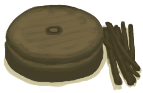

# 陶轮  
> 方便我进行各类陶器制作。  
  
<table class="table table-bordered" data-toggle="table"  data-show-header="false"><thead style="display:none"><tr ><th  style="width:50%;text-align:left;vertical-align:top;"  >title</th><th  style="width:50%;text-align:left;vertical-align:top;"  ></th></tr></thead><tr ><td  style="width:50%;text-align:left;vertical-align:top;"  >** 不可删除 **  ** 不可堆叠 **  **重量：**1000  ** 效果: ** [

[陶艺加成](PotteryBonus.md)](PotteryBonus.md)<b>+1</b></td><td  style="width:50%;text-align:left;vertical-align:top;"  >

<a href="PotteryWheel.md" style="color:black">陶轮</a>

</td></tr></tbody></table>  
  
## 获取来源  

放置

[陶轮（未放置）](PotteryWheelDismantled.md)

蓝图制造

[陶轮(蓝图)](Bp_PotteryWheel.md)

  
  
## 动作  

<table><tr><td rowspan="2" style="width:200px;text-align:center;font-size:1.3em;font-weight:bold">

拆卸并搬起

1小时

</td><td>[“手部动作(组)”](HandAction.md)</td></tr><tr><td><b>自身：</b>→ [

[陶轮（未放置）](PotteryWheelDismantled.md)](PotteryWheelDismantled.md)</td></tr><tr><td colspan="2"><b>需求：</b>[

[光亮](Light.md)](Light.md): <b>10-100</b></td></tr></table>
  
  
  
## 被动效果  
<table class="table table-bordered" data-toggle="table"  ><thead style=""><tr ><th  style="text-align:left;vertical-align:top;"  >名称</th><th  style="text-align:left;vertical-align:top;"  data-sortable="true"  >条件</th><th  style="text-align:left;vertical-align:top;"  data-sortable="true"  >变化(每15分钟)</th><th  style="text-align:left;vertical-align:top;"  >玩家状态</th></tr></thead><tr ><td  style="text-align:left;vertical-align:top;"  >Comfort</td><td  style="text-align:left;vertical-align:top;"  ></td><td  style="text-align:left;vertical-align:top;"  ></td><td  style="text-align:left;vertical-align:top;"  >[

[舒适度](Comfort.md)](Comfort.md)<b>+75</b></td></tr></tbody></table>  
  

