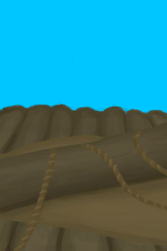

# 损坏的帆  
> 我应当修好它。下次在坏之前我应该多加注意。  
  
<table class="table table-bordered" data-toggle="table"  data-show-header="false"><thead style="display:none"><tr ><th  style="width:50%;text-align:left;vertical-align:top;"  >title</th><th  style="width:50%;text-align:left;vertical-align:top;"  ></th></tr></thead><tr ><td  style="width:50%;text-align:left;vertical-align:top;"  >**可用次数：**0</td><td  style="width:50%;text-align:left;vertical-align:top;"  >

<a href="SailBroken_Raft.md" style="color:black">损坏的帆</a>

</td></tr></tbody></table>  
  
## 获取来源  

转化

[收起的帆](SailDown_Raft.md)

转化

[扬起的帆](SailUp_Raft.md)

  
  
## 可拖入  

<table style="margin-bottom:0px;"><tr><td style="width:40%;text-align:left; background-color:#FEFEFE"><b>拖入：</b>[

[细线](CordFiber.md)](CordFiber.md)</td><td style="width:40%;font-size:1em;font-weight:bold;background-color:#FEFEFE">修理船帆 (30分) </td></tr><tr><td colspan="2"><b>需求：</b>[

[光亮](Light.md)](Light.md): <b>10-100</b></td></tr><tr style="background-color:#FFFFFF"><td style=""><b>使用物：</b>→消失</td><td style=""><b>自身：</b>使用次数  <b>+96(20%)</b></td></tr></table>
  
  
## 属性   

<table style="margin-bottom:0px;"><tr><td style="width:30%;text-align:left; background-color:#FEFEFE;font-size:1.3em;font-weight:bold;">使用次数</td><td style="font-size:1em;background-color:#FEFEFE">初始：0 , 最大：480 每15分钟-1 , 最多需要：5天</td></tr><tr style="background-color:#FFFFFF"><td colspan=2>** 到达上限时： ** 自身: → [

[收起的帆](SailDown_Raft.md)](SailDown_Raft.md)</td></tr></table>
  

