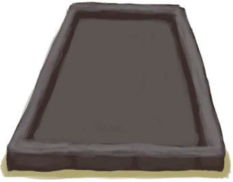

# 盐田  
> 适用于从海水中提取盐。  
  
<table class="table table-bordered" data-toggle="table"  data-show-header="false"><thead style="display:none"><tr ><th  style="width:50%;text-align:left;vertical-align:top;"  >title</th><th  style="width:50%;text-align:left;vertical-align:top;"  ></th></tr></thead><tr ><td  style="width:50%;text-align:left;vertical-align:top;"  >** 不可删除 **  ** 不可堆叠 **  **重量：**1000  **标签：**	[“容器（蓄水池）”](tag_ContainerReservoir.md)  **储水量：**9600</td><td  style="width:50%;text-align:left;vertical-align:top;"  >

<a href="SaltBed.md" style="color:black">盐田</a>

</td></tr></tbody></table>  
  
## 获取来源  

蓝图制造

[盐田(蓝图)](Bp_SaltBed.md)

  
  
## 动作  

<table><tr><td rowspan="2" style="width:200px;text-align:center;font-size:1.3em;font-weight:bold">

刮取盐

</td><td></td></tr><tr><td></td></tr><tr><td colspan="2"><b>需求：</b>盐: <b>144～1920(7.5%～100%)</b></td></tr><tr><td colspan="2">[

[盐](Salt.md)](Salt.md)(<b>+3</b>) 盐: <b><b>-144</b></b></td></tr></table>
  

<table><tr><td rowspan="2" style="width:200px;text-align:center;font-size:1.3em;font-weight:bold">

刮取盐

</td><td></td></tr><tr><td></td></tr><tr><td colspan="2"><b>需求：</b>盐: <b>96～144(5%～7.5%)</b></td></tr><tr><td colspan="2">[

[盐](Salt.md)](Salt.md)(<b>+2</b>) 盐: <b><b>-96</b></b></td></tr></table>
  

<table><tr><td rowspan="2" style="width:200px;text-align:center;font-size:1.3em;font-weight:bold">

刮取盐

</td><td></td></tr><tr><td></td></tr><tr><td colspan="2"><b>需求：</b>盐: <b>48～96(2.5%～5%)</b></td></tr><tr><td colspan="2">[

[盐](Salt.md)](Salt.md)(<b>+1</b>) 盐: <b><b>-48</b></b></td></tr></table>
  
  
  
## 属性   

<table style="margin-bottom:0px;"><tr><td style="width:30%;text-align:left; background-color:#FEFEFE;font-size:1.3em;font-weight:bold;">盐</td><td style="font-size:1em;background-color:#FEFEFE">初始：0 , 最大：1920 -</td></tr><tr style="background-color:#FFFFFF"><td colspan=2></td></tr></table>
  
## 被动效果  
<table class="table table-bordered" data-toggle="table"  ><thead style=""><tr ><th  style="text-align:left;vertical-align:top;"  >名称</th><th  style="text-align:left;vertical-align:top;"  >条件</th><th  style="text-align:left;vertical-align:top;"  >变化(每15分钟)</th><th  style="text-align:left;vertical-align:top;"  data-sortable="true"  >玩家状态</th></tr></thead><tr ><td  style="text-align:left;vertical-align:top;"  >Produce Salt</td><td  style="text-align:left;vertical-align:top;"  >** 需要属性：** 含水量: <b>1～9600(0.01%～100%)</b> ** 需要放入：** [盐水](LQ_WaterSalt.md)</td><td  style="text-align:left;vertical-align:top;"  >盐 +2(0.1%)</td><td  style="text-align:left;vertical-align:top;"  ></td></tr><tr ><td  style="text-align:left;vertical-align:top;"  >Evaporate Liquid</td><td  style="text-align:left;vertical-align:top;"  >** 需要属性：** 含水量: <b>1～9600(0.01%～100%)</b></td><td  style="text-align:left;vertical-align:top;"  >含水量-50</td><td  style="text-align:left;vertical-align:top;"  ></td></tr></tbody></table>  
  

