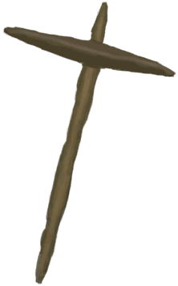

# 纺锤  
> 我可以用它把纤维缠成细线。  
  
<table class="table table-bordered" data-toggle="table"  data-show-header="false"><thead style="display:none"><tr ><th  style="width:50%;text-align:left;vertical-align:top;"  >title</th><th  style="width:50%;text-align:left;vertical-align:top;"  ></th></tr></thead><tr ><td  style="width:50%;text-align:left;vertical-align:top;"  >**重量：**50  **标签：**	[“细线”](tag_Cord.md)</td><td  style="width:50%;text-align:left;vertical-align:top;"  >

<a href="Spindle.md" style="color:black">纺锤</a>

</td></tr></tbody></table>  
  
## 获取来源  

蓝图制造

[纺锤(蓝图)](Bp_Spindle.md)

纺细线

[缠好的纺锤](SpindleFiber.md)

纺线团

[缠好的纺锤](SpindleFiber.md)

  
  
## 可拖入  

<table style="margin-bottom:0px;"><tr><td style="width:40%;text-align:left; background-color:#FEFEFE"><b>拖入：</b>[

[纤维](Fibers.md)](Fibers.md)</td><td style="width:40%;font-size:1em;font-weight:bold;background-color:#FEFEFE">缠线  </td></tr><tr><td colspan="2"><b>需求：</b>[

[光亮](Light.md)](Light.md): <b>10-100</b></td></tr><tr style="background-color:#FFFFFF"><td style=""><b>使用物：</b>→消失</td><td style=""><b>自身：</b>进度  <b>+1(33.33%)</b></td></tr></table>
  

<table style="margin-bottom:0px;"><tr><td style="width:40%;text-align:left; background-color:#FEFEFE"><b>拖入：</b>[

[线团](YarnFiber.md)](YarnFiber.md)</td><td style="width:40%;font-size:1em;font-weight:bold;background-color:#FEFEFE">缠线  </td></tr><tr><td colspan="2"><b>需求：</b>[

[光亮](Light.md)](Light.md): <b>10-100</b></td></tr><tr style="background-color:#FFFFFF"><td style=""><b>使用物：</b>→消失</td><td style=""><b>自身：</b>→ [

[缠好的纺锤](SpindleFiber.md)](SpindleFiber.md), 进度  <b>+3(100%)</b></td></tr></table>
  
  
## 属性   

<table style="margin-bottom:0px;"><tr><td style="width:30%;text-align:left; background-color:#FEFEFE;font-size:1.3em;font-weight:bold;">进度</td><td style="font-size:1em;background-color:#FEFEFE">初始：0 , 最大：3 -</td></tr><tr style="background-color:#FFFFFF"><td colspan=2>** 到达上限时：纤维就绪 ** 自身: → [

[缠好的纺锤](SpindleFiber.md)](SpindleFiber.md)</td></tr></table>
  

