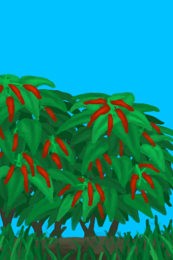
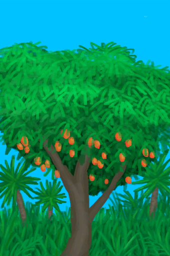
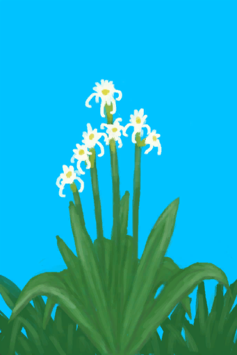
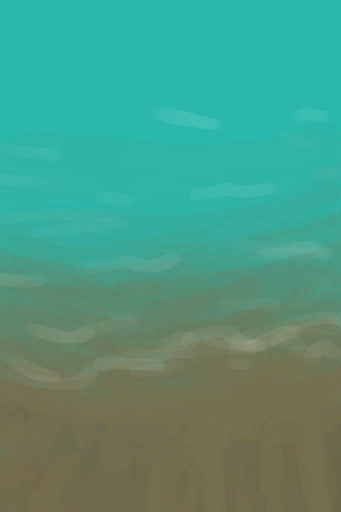
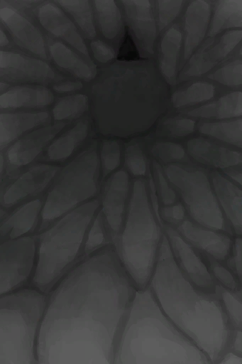
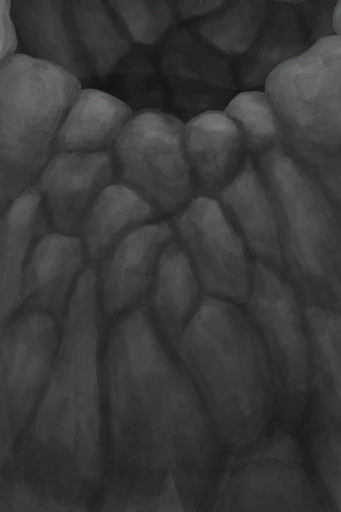
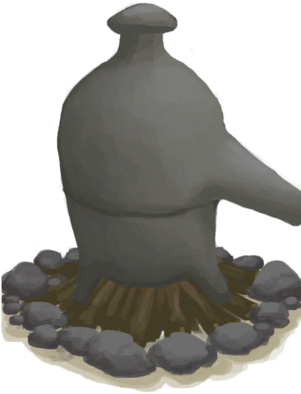
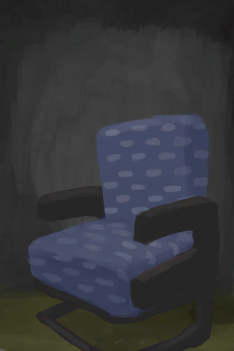
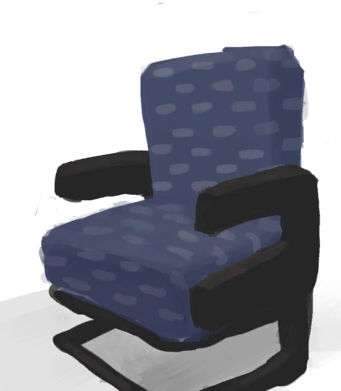

# 区域物品  
## 养殖  

<a href="BeeSkepSwarming.md" style="color:black">繁殖中的蜂群</a>

<a href="BeeSkep.md" style="color:black">蜂箱</a>

<a href="PartridgeFeeder.md" style="color:black">灰山鹑喂食器</a>

<a href="PartridgeFeederEmpty.md" style="color:black">灰山鹑喂食器</a>

<a href="WateringTrough.md" style="color:black">水槽</a>

<a href="GoatFeeder.md" style="color:black">羊食槽</a>

<a href="GoatFeederEmpty.md" style="color:black">羊食槽</a>

<a href="BoarFeeder.md" style="color:black">猪食槽</a>

<a href="BoarFeederEmpty.md" style="color:black">猪食槽</a>

  
  
## 陷阱  

<a href="RaftFishTrap.md" style="color:black">捕捞拖网</a>

<a href="FishTrapDeployed.md" style="color:black">捕鱼陷阱</a>

<a href="CageTrapPlacedTriggered.md" style="color:black">解除陷阱</a>

<a href="CageTrapPlacedTriggeredPartridgeFemale.md" style="color:black">解除陷阱</a>

<a href="CageTrapPlacedTriggeredPartridgeMale.md" style="color:black">解除陷阱</a>

<a href="CageTrapPlacedTriggeredSeagull.md" style="color:black">解除陷阱</a>

<a href="DeadfallTrap.md" style="color:black">落石陷阱</a>

<a href="DeadfallTrapTriggered.md" style="color:black">落石陷阱</a>

<a href="SnareTrap.md" style="color:black">套索陷阱</a>

<a href="SnareTrapTriggered.md" style="color:black">套索陷阱</a>

<a href="TrappingPit.md" style="color:black">陷坑</a>

<a href="TrappingPitTriggered.md" style="color:black">陷坑</a>

<a href="CageTrapPlaced.md" style="color:black">诱捕笼</a>

<a href="LogTrap.md" style="color:black">原木陷阱</a>

<a href="LogTrapTriggered.md" style="color:black">原木陷阱</a>

  
  
## 植物  

<a href="CinchonaTreeCleared.md" style="color:black">剥净的金鸡纳树</a>

<a href="LargeTree.md" style="color:black">大树</a>

<a href="WeevilLily.md" style="color:black">大叶仙茅</a>

<a href="LargeTreeFelled.md" style="color:black">倒下的大树</a>

<a href="SagoPalmFelled.md" style="color:black">倒下的西米树</a>

<a href="PalmTreeFelled.md" style="color:black">倒下的棕榈树</a>

<a href="GingerPlant.md" style="color:black">姜株</a>

<a href="CinchonaTree.md" style="color:black">金鸡纳树</a>

<a href="CoffeePlant.md" style="color:black">咖啡丛</a>

<a href="KavaPlant.md" style="color:black">卡瓦胡椒株</a>

<a href="ChiliPlant.md" style="color:black">辣椒丛</a>

<a href="AloeVera.md" style="color:black">芦荟</a>

<a href="PuffballsPlant.md" style="color:black">马勃菌</a>

<a href="MangoTree.md" style="color:black">芒果树</a>

<a href="MagicMushroomsPlant.md" style="color:black">迷幻菇</a>

<a href="JasminePlant.md" style="color:black">茉莉花</a>

<a href="Lemongrass.md" style="color:black">柠檬草</a>

<a href="TropicalAlmondTree.md" style="color:black">热带杏仁树</a>

<a href="SnakegrassPatch.md" style="color:black">蛇草丛</a>

<a href="RicePlant.md" style="color:black">水稻</a>

<a href="NipaPalm.md" style="color:black">水椰</a>

<a href="NipaSapStation.md" style="color:black">水椰树</a>

<a href="MushroomBedDry.md" style="color:black">未浇灌的菌床</a>

<a href="CropPlotDry.md" style="color:black">未浇灌的农田</a>

<a href="SagoPalm.md" style="color:black">西米树</a>

<a href="BananaTree.md" style="color:black">香蕉树</a>

<a href="MangoTreeYoung.md" style="color:black">小芒果树</a>

<a href="SmallTree.md" style="color:black">小树</a>

<a href="TropicalAlmondTreeYoung.md" style="color:black">小杏仁树</a>

<a href="SmallPalm.md" style="color:black">小棕榈树</a>

<a href="PalmTreeNew.md" style="color:black">椰子树</a>

<a href="YamPlant.md" style="color:black">野参薯</a>

<a href="WildJujube.md" style="color:black">野枣丛</a>

<a href="PalmTreeYoung.md" style="color:black">幼年椰子树</a>

<a href="ChinaRosePlant.md" style="color:black">月季丛</a>

<a href="AssortedMushroomsPlant.md" style="color:black">杂菌</a>

<a href="MangoTreeCleared.md" style="color:black">摘光的芒果树</a>

<a href="TropicalAlmondTreeCleared.md" style="color:black">摘光的热带杏仁树</a>

<a href="BananaTreeCleared.md" style="color:black">摘光的香蕉树</a>

<a href="WildJujubeCleared.md" style="color:black">摘光的野枣从</a>

<a href="PalmTreeCleared.md" style="color:black">摘完的椰子树</a>

<a href="SpiderLily.md" style="color:black">蜘蛛兰</a>

<a href="PalmBush.md" style="color:black">棕榈丛</a>

  
  
## 农田  

<a href="CropPlotYam.md" style="color:black">参薯田</a>

<a href="CropPlotWeevilLily.md" style="color:black">大叶仙茅田</a>

<a href="CropPlotRice.md" style="color:black">稻田</a>

<a href="CropPlotRuined.md" style="color:black">毁坏的田地</a>

<a href="CropPlotGinger.md" style="color:black">姜田</a>

<a href="CropPlotCinchonaTree.md" style="color:black">金鸡纳树田</a>

<a href="CropPlotCoffee.md" style="color:black">咖啡田</a>

<a href="CropPlotKava.md" style="color:black">卡瓦胡椒田</a>

<a href="CropPlotChilies.md" style="color:black">辣椒田</a>

<a href="CropPlotAloeVera.md" style="color:black">芦荟田</a>

<a href="MushroomBedPuffballs.md" style="color:black">马勃菌菌床</a>

<a href="CropPlotMangoTree.md" style="color:black">芒果树田</a>

<a href="MushroomBedMagic.md" style="color:black">迷幻菇菌床</a>

<a href="CropPlotJasmine.md" style="color:black">茉莉花田</a>

<a href="CropPlotLemonGrass.md" style="color:black">柠檬草田</a>

<a href="CropPlotSnakeGrass.md" style="color:black">蛇草田</a>

<a href="RicePaddy.md" style="color:black">水稻田</a>

<a href="CropPlotNipaPalm.md" style="color:black">水椰树田</a>

<a href="CropPlotEmpty.md" style="color:black">未栽种的农田</a>

<a href="MushroomBedEmpty.md" style="color:black">未种植的菌床</a>

<a href="CropPlotSagoPalm.md" style="color:black">西米树田</a>

<a href="CropPlotBananaTree.md" style="color:black">香蕉树田</a>

<a href="CropPlotAlmondTree.md" style="color:black">杏仁树田</a>

<a href="CropPlotPalmTree.md" style="color:black">椰子树田</a>

<a href="CropPlotWildJujube.md" style="color:black">野枣田</a>

<a href="CropPlotChinaRose.md" style="color:black">月季田</a>

<a href="MushroomBedAssorted.md" style="color:black">杂菌菌床</a>

<a href="CropPlotSpiderLily.md" style="color:black">蜘蛛兰田</a>

<a href="CropPlotPalmBush.md" style="color:black">棕榈丛田</a>

  
  
## 容器  

<a href="ClayPotCoolerOff.md" style="color:black">保鲜罐</a>

<a href="ClayPotCoolerOn.md" style="color:black">保鲜罐</a>

<a href="BasketPlaced.md" style="color:black">编织篓</a>

<a href="SupplyChestRaft.md" style="color:black">补给箱</a>

<a href="TrunkPerkPlaced.md" style="color:black">超级生存箱 2000</a>

<a href="ChestFarmer.md" style="color:black">储物箱</a>

<a href="ChestPlaced.md" style="color:black">储物箱</a>

<a href="Shelf.md" style="color:black">架子</a>

<a href="LifeRaftDeflated.md" style="color:black">没气的救生筏</a>

<a href="TrunkPlaced.md" style="color:black">收纳箱</a>

<a href="Bookshelf.md" style="color:black">书架</a>

<a href="LuggageAPlaced.md" style="color:black">行李箱</a>

<a href="LuggageCPlaced.md" style="color:black">行李箱</a>

<a href="TentDeployed.md" style="color:black">帐篷</a>

  
  
## 地点  

<a href="TidePoolFlooded.md" style="color:black">被淹没的潮汐池</a>

<a href="BatColony.md" style="color:black">蝙蝠群</a>

<a href="DampChamberEntrance.md" style="color:black">潮湿洞穴</a>

<a href="TidePool.md" style="color:black">潮汐池</a>

<a href="Shipwreck.md" style="color:black">沉船</a>

<a href="NarrowTunnelExit.md" style="color:black">洞穴底层</a>

<a href="Debris.md" style="color:black">废墟</a>

<a href="CavePond.md" style="color:black">干涸的洞穴水潭</a>

<a href="CavePuddle.md" style="color:black">干涸的小水坑</a>

<a href="Puddle.md" style="color:black">干涸的小水塘</a>

<a href="AcidLakePuddle.md" style="color:black">干涸酸湖</a>

<a href="Sea_Atoll.md" style="color:black">海</a>

<a href="Sea_Bay.md" style="color:black">海</a>

<a href="Sea_Beach.md" style="color:black">海</a>

<a href="Sea_Cove.md" style="color:black">海</a>

<a href="Sea_DesolateBeach.md" style="color:black">海</a>

<a href="Sea_Mangroves.md" style="color:black">海</a>

<a href="Sea_Rocks.md" style="color:black">海</a>

<a href="Sea_Cave.md" style="color:black">海水</a>

<a href="Path_BirdRockToDesolateBeach.md" style="color:black">荒芜沙滩</a>

<a href="HighlandHoleEntrance.md" style="color:black">坑洞</a>

<a href="HighlandHoleNoRope.md" style="color:black">坑洞</a>

<a href="Skeleton.md" style="color:black">骷髅</a>

<a href="VentBrimstone.md" style="color:black">硫磺喷口</a>

<a href="MacaqueDenEntrance.md" style="color:black">猕猴窝</a>

<a href="Path_CoveToBirdRock.md" style="color:black">鸟岩岛</a>

<a href="Path_DesolateBeachToBirdRock.md" style="color:black">鸟岩岛</a>

<a href="WallScratchings.md" style="color:black">墙上的划痕</a>

<a href="SandSource.md" style="color:black">沙堆</a>

<a href="ShaftCrystalChamberToFloodedChamber.md" style="color:black">竖井</a>

<a href="ShaftHighChamberToMidChamber.md" style="color:black">竖井</a>

<a href="ShaftMidChamberToLowChamber.md" style="color:black">竖井</a>

<a href="UnderwaterExit.md" style="color:black">水下出口</a>

<a href="TunnelEntranceClosed.md" style="color:black">坍塌的隧道入口</a>

<a href="CopperVein.md" style="color:black">铜矿脉</a>

<a href="DampChamberExit.md" style="color:black">狭窄隧道</a>

<a href="NarrowTunnelEntrance.md" style="color:black">狭窄隧道</a>

<a href="CrystalChamberEntranceClosed.md" style="color:black">狭窄通道</a>

<a href="DarkCaveCaveEntranceClosed.md" style="color:black">狭窄通道</a>

<a href="DarkChamberCaveEntranceClosed.md" style="color:black">狭窄通道</a>

<a href="FloodedChamberEntranceClosed.md" style="color:black">狭窄通道</a>

<a href="HighChamberEntranceClosed.md" style="color:black">狭窄通道</a>

<a href="Path_BirdRockToRocks.md" style="color:black">岩滩</a>

  
  
## 其他  

<a href="ParachuteDeployed.md" style="color:black">打开的降落伞</a>

<a href="Scarecrow.md" style="color:black">稻草人</a>

<a href="Hammock.md" style="color:black">吊床</a>

<a href="CompostBin.md" style="color:black">堆肥箱</a>

<a href="Cesspool.md" style="color:black">粪池</a>

<a href="Beehive.md" style="color:black">蜂巢</a>

<a href="KilnAdvanced.md" style="color:black">高级窑炉</a>

<a href="KilnAdvancedExtinguished.md" style="color:black">高级窑炉</a>

<a href="PassingShip.md" style="color:black">过路的船只</a>

<a href="Sea_Raft.md" style="color:black">海</a>

<a href="SeagullNest.md" style="color:black">海鸥巢</a>

<a href="Fire.md" style="color:black">火堆</a>

<a href="FireExtinguished.md" style="color:black">火堆</a>

<a href="Stove.md" style="color:black">火炉</a>

<a href="StoveExtinguished.md" style="color:black">火炉</a>

<a href="BedRustic.md" style="color:black">简易床</a>

<a href="Start_Raft.md" style="color:black">开始冒险</a>

<a href="Start_RaftAtoll.md" style="color:black">开始冒险</a>

<a href="HighlandHoleExit.md" style="color:black">离开</a>

<a href="DryingRack.md" style="color:black">晾晒架</a>

<a href="Shower.md" style="color:black">淋浴器</a>

<a href="WaterFilter.md" style="color:black">滤水器</a>

<a href="BedWooden.md" style="color:black">木床</a>

<a href="RaftShelter.md" style="color:black">木筏庇护所</a>

<a href="Table.md" style="color:black">木桌</a>

<a href="MudDeposit.md" style="color:black">泥滩</a>

<a href="Path_RocksToBirdRock.md" style="color:black">鸟岩岛</a>

<a href="SagoSplitLog.md" style="color:black">劈开的西米树干</a>

<a href="FloatingDebris.md" style="color:black">漂浮的残骸</a>

<a href="MermaidNest.md" style="color:black">人鱼巢</a>

<a href="Forge.md" style="color:black">熔炉</a>

<a href="ForgeExtinguished.md" style="color:black">熔炉</a>

<a href="SharkVisitor.md" style="color:black">鲨鱼</a>

<a href="AlienGrowth.md" style="color:black">盛开的外星植物</a>

<a href="SailDown_Raft.md" style="color:black">收起的帆</a>

<a href="ShaftFloodedChamberToCrystalChamber.md" style="color:black">竖井</a>

<a href="ShaftLowChamberToMidChamber.md" style="color:black">竖井</a>

<a href="ShaftMidChamberToHighChamber.md" style="color:black">竖井</a>

<a href="Cistern.md" style="color:black">水窖</a>

<a href="Well.md" style="color:black">水井</a>

<a href="UnderwaterEntrance.md" style="color:black">水下洞穴</a>

<a href="SailBroken_Raft.md" style="color:black">损坏的帆</a>

<a href="SolarStill.md" style="color:black">太阳能蒸馏器</a>

<a href="PotteryWheel.md" style="color:black">陶轮</a>

<a href="AlienGrowthCleared.md" style="color:black">外星植物</a>

<a href="RicePaddyEmpty.md" style="color:black">未栽种的稻田</a>

<a href="Shelter.md" style="color:black">窝棚</a>

<a href="BananaStump.md" style="color:black">香蕉树桩</a>

<a href="NiterBed.md" style="color:black">硝石矿床</a>

<a href="WaterReservoir.md" style="color:black">蓄水池</a>

<a href="WaterReservoirFull.md" style="color:black">蓄水池</a>

<a href="WaterReservoirIrrigating.md" style="color:black">蓄水池（灌溉中）</a>

<a href="SaltBed.md" style="color:black">盐田</a>

<a href="SailUp_Raft.md" style="color:black">扬起的帆</a>

<a href="Kiln.md" style="color:black">窑炉</a>

<a href="KilnExtinguished.md" style="color:black">窑炉</a>

<a href="PalmTreeNewMultiEventOld.md" style="color:black">椰子树</a>

<a href="LeafBed.md" style="color:black">叶床</a>

<a href="ChairPlaced.md" style="color:black">椅子</a>

<a href="Path_BirdRockToCove.md" style="color:black">隐秘港湾</a>

<a href="Campfire.md" style="color:black">营火</a>

<a href="CampfireExtinguished.md" style="color:black">营火</a>

<a href="ShelteredLeafBed.md" style="color:black">有遮蔽的叶床</a>

<a href="RainCatcher.md" style="color:black">雨水收集器</a>

<a href="AlienCrater.md" style="color:black">陨石坑</a>

<a href="AlembicOff.md" style="color:black">蒸馏器</a>

<a href="AlembicOn.md" style="color:black">蒸馏器</a>

<a href="Loom.md" style="color:black">织布机</a>

<a href="LoomEmpty.md" style="color:black">织布机（空）</a>

<a href="Grandfather.md" style="color:black">祖父</a>

<a href="GrandfatherHealthy.md" style="color:black">祖父(健康)</a>

<a href="SeatAttached.md" style="color:black">座椅</a>

<a href="SeatPlaced.md" style="color:black">座椅</a>

  
  

