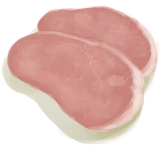
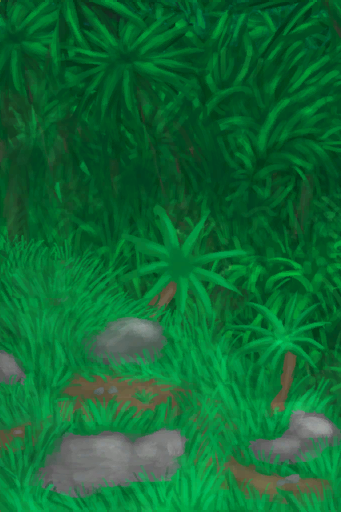
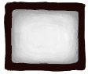

# 角色特质  
## 食欲  
<table class="table table-bordered" data-toggle="table"  ><thead style=""><tr ><th  style="width:25%;text-align:left;vertical-align:top;"  >名称</th><th  style="text-align:left;vertical-align:top;"  data-sortable="true"  >难度分</th><th  style="text-align:left;vertical-align:top;"  >解锁价格</th><th  style="width:40%;text-align:left;vertical-align:top;"  >描述</th></tr></thead><tr ><td  style="width:25%;text-align:left;vertical-align:top;"  >

[胃口大开](Pk_4_Gluttonous.md)</td><td  style="text-align:left;vertical-align:top;"  >0</td><td  style="text-align:left;vertical-align:top;"  >10☀️</td><td  style="width:40%;text-align:left;vertical-align:top;"  >饿得更快。进食更频繁，所以很难营养不良。</td></tr><tr ><td  style="width:25%;text-align:left;vertical-align:top;"  >

[食欲不振](Pk_4_Inappetent.md)</td><td  style="text-align:left;vertical-align:top;"  >1000</td><td  style="text-align:left;vertical-align:top;"  >10☀️</td><td  style="width:40%;text-align:left;vertical-align:top;"  >饿得更慢。进食频率更低所以容易营养不良。</td></tr></tbody></table>  
  
## 虫子  
<table class="table table-bordered" data-toggle="table"  ><thead style=""><tr ><th  style="width:25%;text-align:left;vertical-align:top;"  >名称</th><th  style="text-align:left;vertical-align:top;"  data-sortable="true"  >难度分</th><th  style="text-align:left;vertical-align:top;"  >解锁价格</th><th  style="width:40%;text-align:left;vertical-align:top;"  >描述</th></tr></thead><tr ><td  style="width:25%;text-align:left;vertical-align:top;"  >

[招虫体质](Pk_4_BugAttractant.md)</td><td  style="text-align:left;vertical-align:top;"  >750</td><td  style="text-align:left;vertical-align:top;"  >10☀️</td><td  style="width:40%;text-align:left;vertical-align:top;"  >虫子喜欢你。</td></tr><tr ><td  style="width:25%;text-align:left;vertical-align:top;"  >

[抗虫体质](Pk_4_BugResistant.md)</td><td  style="text-align:left;vertical-align:top;"  >-500</td><td  style="text-align:left;vertical-align:top;"  >10☀️</td><td  style="width:40%;text-align:left;vertical-align:top;"  >虫子们离你远远的。</td></tr></tbody></table>  
  
## 衣物  
<table class="table table-bordered" data-toggle="table"  ><thead style=""><tr ><th  style="width:25%;text-align:left;vertical-align:top;"  >名称</th><th  style="text-align:left;vertical-align:top;"  data-sortable="true"  >难度分</th><th  style="text-align:left;vertical-align:top;"  >解锁价格</th><th  style="width:40%;text-align:left;vertical-align:top;"  >描述</th></tr></thead><tr ><td  style="width:25%;text-align:left;vertical-align:top;"  >

[军人](Pk_2_Military.md)</td><td  style="text-align:left;vertical-align:top;"  >-1500</td><td  style="text-align:left;vertical-align:top;"  >1🌙</td><td  style="width:40%;text-align:left;vertical-align:top;"  >开始时拥有一套军用装备，还有一把枪！</td></tr><tr ><td  style="width:25%;text-align:left;vertical-align:top;"  >

[生不带来](Pk_2_Naked.md)</td><td  style="text-align:left;vertical-align:top;"  >750</td><td  style="text-align:left;vertical-align:top;"  >5☀️</td><td  style="width:40%;text-align:left;vertical-align:top;"  >开始游戏时完全赤裸。</td></tr><tr ><td  style="width:25%;text-align:left;vertical-align:top;"  >

[岛民](Pk_2_Islander.md)</td><td  style="text-align:left;vertical-align:top;"  >-1000</td><td  style="text-align:left;vertical-align:top;"  >5☀️</td><td  style="width:40%;text-align:left;vertical-align:top;"  >岛屿的原住民。</td></tr><tr ><td  style="width:25%;text-align:left;vertical-align:top;"  >

[游客](Pk_2_Tourist.md)</td><td  style="text-align:left;vertical-align:top;"  >-750</td><td  style="text-align:left;vertical-align:top;"  >20☀️</td><td  style="width:40%;text-align:left;vertical-align:top;"  >开始时穿着一身度假的行头。</td></tr><tr ><td  style="width:25%;text-align:left;vertical-align:top;"  >

[生存专家](Pk_2_Survivalist.md)</td><td  style="text-align:left;vertical-align:top;"  >-2500</td><td  style="text-align:left;vertical-align:top;"  >1🌙</td><td  style="width:40%;text-align:left;vertical-align:top;"  >开始时拥有一套生存装备，包括帐篷和瓦斯炉。</td></tr><tr ><td  style="width:25%;text-align:left;vertical-align:top;"  >

[UP主](Pk_2_Retromation.md)</td><td  style="text-align:left;vertical-align:top;"  >-500</td><td  style="text-align:left;vertical-align:top;"  >10☀️</td><td  style="width:40%;text-align:left;vertical-align:top;"  >开始时拥有一件时髦的卫衣和一部手机！\n（给冰ic点点关注）</td></tr></tbody></table>  
  
## 饮食  
<table class="table table-bordered" data-toggle="table"  ><thead style=""><tr ><th  style="width:25%;text-align:left;vertical-align:top;"  >名称</th><th  style="text-align:left;vertical-align:top;"  data-sortable="true"  >难度分</th><th  style="text-align:left;vertical-align:top;"  >解锁价格</th><th  style="width:40%;text-align:left;vertical-align:top;"  >描述</th></tr></thead><tr ><td  style="width:25%;text-align:left;vertical-align:top;"  >

[素食主义者](Pk_4_Vegetarian.md)</td><td  style="text-align:left;vertical-align:top;"  >1500</td><td  style="text-align:left;vertical-align:top;"  >15☀️</td><td  style="width:40%;text-align:left;vertical-align:top;"  >食用肉食会让你恶心抑郁。</td></tr><tr ><td  style="width:25%;text-align:left;vertical-align:top;"  >

[肉食主义者](Pk_4_Carnivore.md)</td><td  style="text-align:left;vertical-align:top;"  >1500</td><td  style="text-align:left;vertical-align:top;"  >15☀️</td><td  style="width:40%;text-align:left;vertical-align:top;"  >食用素食会让你恶心抑郁。</td></tr></tbody></table>  
  
## 免疫系统  
<table class="table table-bordered" data-toggle="table"  ><thead style=""><tr ><th  style="width:25%;text-align:left;vertical-align:top;"  >名称</th><th  style="text-align:left;vertical-align:top;"  data-sortable="true"  >难度分</th><th  style="text-align:left;vertical-align:top;"  >解锁价格</th><th  style="width:40%;text-align:left;vertical-align:top;"  >描述</th></tr></thead><tr ><td  style="width:25%;text-align:left;vertical-align:top;"  >

[强免疫系统](Pk_4_ImmuneSystemStrong.md)</td><td  style="text-align:left;vertical-align:top;"  >-750</td><td  style="text-align:left;vertical-align:top;"  >10☀️</td><td  style="width:40%;text-align:left;vertical-align:top;"  >不易生病。</td></tr><tr ><td  style="width:25%;text-align:left;vertical-align:top;"  >

[免疫系统脆弱](Pk_4_ImmuneSystemWeak.md)</td><td  style="text-align:left;vertical-align:top;"  >1000</td><td  style="text-align:left;vertical-align:top;"  >10☀️</td><td  style="width:40%;text-align:left;vertical-align:top;"  >更容易得病。</td></tr></tbody></table>  
  
## 位置  
<table class="table table-bordered" data-toggle="table"  ><thead style=""><tr ><th  style="width:25%;text-align:left;vertical-align:top;"  >名称</th><th  style="text-align:left;vertical-align:top;"  data-sortable="true"  >难度分</th><th  style="text-align:left;vertical-align:top;"  >解锁价格</th><th  style="width:40%;text-align:left;vertical-align:top;"  >描述</th></tr></thead><tr ><td  style="width:25%;text-align:left;vertical-align:top;"  >

[废弃农场](Pk_1_AbandonedFarm.md)</td><td  style="text-align:left;vertical-align:top;"  >500</td><td  style="text-align:left;vertical-align:top;"  >3🌙</td><td  style="width:40%;text-align:left;vertical-align:top;"  >在神秘谷的废弃农场开始。</td></tr><tr ><td  style="width:25%;text-align:left;vertical-align:top;"  >

[坠机](Pk_1_PlaneCrash.md)</td><td  style="text-align:left;vertical-align:top;"  >500</td><td  style="text-align:left;vertical-align:top;"  >3🌙</td><td  style="width:40%;text-align:left;vertical-align:top;"  >在湿地中坠毁的飞机开始。</td></tr><tr ><td  style="width:25%;text-align:left;vertical-align:top;"  >

[海湾](Pk_1_LocationBay.md)</td><td  style="text-align:left;vertical-align:top;"  >0</td><td  style="text-align:left;vertical-align:top;"  >10☀️</td><td  style="width:40%;text-align:left;vertical-align:top;"  >在海湾开始。</td></tr><tr ><td  style="width:25%;text-align:left;vertical-align:top;"  >

[丛林深处](Pk_1_LocationDeepJungle.md)</td><td  style="text-align:left;vertical-align:top;"  >1000</td><td  style="text-align:left;vertical-align:top;"  >10☀️</td><td  style="width:40%;text-align:left;vertical-align:top;"  >在丛林深处开始。</td></tr><tr ><td  style="width:25%;text-align:left;vertical-align:top;"  >

[荒芜沙滩](Pk_1_LocationDesolateBeach.md)</td><td  style="text-align:left;vertical-align:top;"  >2000</td><td  style="text-align:left;vertical-align:top;"  >10☀️</td><td  style="width:40%;text-align:left;vertical-align:top;"  >在荒芜沙滩开始。</td></tr><tr ><td  style="width:25%;text-align:left;vertical-align:top;"  >

[东部草原](Pk_1_LocationEGrasslands.md)</td><td  style="text-align:left;vertical-align:top;"  >1500</td><td  style="text-align:left;vertical-align:top;"  >10☀️</td><td  style="width:40%;text-align:left;vertical-align:top;"  >在东部草原开始。</td></tr><tr ><td  style="width:25%;text-align:left;vertical-align:top;"  >

[东部高地](Pk_1_LocationEHighlands.md)</td><td  style="text-align:left;vertical-align:top;"  >2500</td><td  style="text-align:left;vertical-align:top;"  >10☀️</td><td  style="width:40%;text-align:left;vertical-align:top;"  >在东部高地开始。</td></tr><tr ><td  style="width:25%;text-align:left;vertical-align:top;"  >

[丛林](Pk_1_LocationJungle.md)</td><td  style="text-align:left;vertical-align:top;"  >750</td><td  style="text-align:left;vertical-align:top;"  >10☀️</td><td  style="width:40%;text-align:left;vertical-align:top;"  >在丛林开始。</td></tr><tr ><td  style="width:25%;text-align:left;vertical-align:top;"  >

[丛林高地](Pk_1_LocationJungleHighlands.md)</td><td  style="text-align:left;vertical-align:top;"  >2000</td><td  style="text-align:left;vertical-align:top;"  >10☀️</td><td  style="width:40%;text-align:left;vertical-align:top;"  >在丛林高地开始。</td></tr><tr ><td  style="width:25%;text-align:left;vertical-align:top;"  >

[神秘谷](Pk_1_LocationSecretValley.md)</td><td  style="text-align:left;vertical-align:top;"  >2000</td><td  style="text-align:left;vertical-align:top;"  >10☀️</td><td  style="width:40%;text-align:left;vertical-align:top;"  >在神秘谷开始。</td></tr><tr ><td  style="width:25%;text-align:left;vertical-align:top;"  >

[湿地](Pk_1_LocationWetlands.md)</td><td  style="text-align:left;vertical-align:top;"  >1000</td><td  style="text-align:left;vertical-align:top;"  >10☀️</td><td  style="width:40%;text-align:left;vertical-align:top;"  >在湿地开始。</td></tr><tr ><td  style="width:25%;text-align:left;vertical-align:top;"  >

[西部草原](Pk_1_LocationWGrasslands.md)</td><td  style="text-align:left;vertical-align:top;"  >1000</td><td  style="text-align:left;vertical-align:top;"  >10☀️</td><td  style="width:40%;text-align:left;vertical-align:top;"  >在西部草原开始。</td></tr><tr ><td  style="width:25%;text-align:left;vertical-align:top;"  >

[西部高地](Pk_1_LocationWHighlands.md)</td><td  style="text-align:left;vertical-align:top;"  >2000</td><td  style="text-align:left;vertical-align:top;"  >10☀️</td><td  style="width:40%;text-align:left;vertical-align:top;"  >在西部高地开始。</td></tr><tr ><td  style="width:25%;text-align:left;vertical-align:top;"  >

[红树林](Pk_1_LocationMangroves.md)</td><td  style="text-align:left;vertical-align:top;"  >750</td><td  style="text-align:left;vertical-align:top;"  >10☀️</td><td  style="width:40%;text-align:left;vertical-align:top;"  >在红树林开始。</td></tr></tbody></table>  
  
## 代谢  
<table class="table table-bordered" data-toggle="table"  ><thead style=""><tr ><th  style="width:25%;text-align:left;vertical-align:top;"  >名称</th><th  style="text-align:left;vertical-align:top;"  data-sortable="true"  >难度分</th><th  style="text-align:left;vertical-align:top;"  >解锁价格</th><th  style="width:40%;text-align:left;vertical-align:top;"  >描述</th></tr></thead><tr ><td  style="width:25%;text-align:left;vertical-align:top;"  >

[超级代谢](Pk_4_HyperMetabolism.md)</td><td  style="text-align:left;vertical-align:top;"  >1500</td><td  style="text-align:left;vertical-align:top;"  >15☀️</td><td  style="width:40%;text-align:left;vertical-align:top;"  >体脂减少得更快，更容易过热。</td></tr><tr ><td  style="width:25%;text-align:left;vertical-align:top;"  >

[快速代谢](Pk_4_FastMetabolism.md)</td><td  style="text-align:left;vertical-align:top;"  >750</td><td  style="text-align:left;vertical-align:top;"  >10☀️</td><td  style="width:40%;text-align:left;vertical-align:top;"  >体脂减少得更快。</td></tr><tr ><td  style="width:25%;text-align:left;vertical-align:top;"  >

[缓慢代谢](Pk_4_SlowMetabolism.md)</td><td  style="text-align:left;vertical-align:top;"  >-750</td><td  style="text-align:left;vertical-align:top;"  >10☀️</td><td  style="width:40%;text-align:left;vertical-align:top;"  >体脂减少得更慢。</td></tr></tbody></table>  
  
## 情绪  
<table class="table table-bordered" data-toggle="table"  ><thead style=""><tr ><th  style="width:25%;text-align:left;vertical-align:top;"  >名称</th><th  style="text-align:left;vertical-align:top;"  data-sortable="true"  >难度分</th><th  style="text-align:left;vertical-align:top;"  >解锁价格</th><th  style="width:40%;text-align:left;vertical-align:top;"  >描述</th></tr></thead><tr ><td  style="width:25%;text-align:left;vertical-align:top;"  >

[乐观主义](Pk_4_Optimist.md)</td><td  style="text-align:left;vertical-align:top;"  >-1000</td><td  style="text-align:left;vertical-align:top;"  >10☀️</td><td  style="width:40%;text-align:left;vertical-align:top;"  >拥有乐观的精神。</td></tr><tr ><td  style="width:25%;text-align:left;vertical-align:top;"  >

[悲观主义](Pk_4_Pessimistic.md)</td><td  style="text-align:left;vertical-align:top;"  >1250</td><td  style="text-align:left;vertical-align:top;"  >10☀️</td><td  style="width:40%;text-align:left;vertical-align:top;"  >这个世界完蛋了。</td></tr></tbody></table>  
  
## 皮肤  
<table class="table table-bordered" data-toggle="table"  ><thead style=""><tr ><th  style="width:25%;text-align:left;vertical-align:top;"  >名称</th><th  style="text-align:left;vertical-align:top;"  data-sortable="true"  >难度分</th><th  style="text-align:left;vertical-align:top;"  >解锁价格</th><th  style="width:40%;text-align:left;vertical-align:top;"  >描述</th></tr></thead><tr ><td  style="width:25%;text-align:left;vertical-align:top;"  >

[皮肤白皙](Pk_3_PaleSkin.md)</td><td  style="text-align:left;vertical-align:top;"  >500</td><td  style="text-align:left;vertical-align:top;"  >免费</td><td  style="width:40%;text-align:left;vertical-align:top;"  >很容易被晒伤。</td></tr><tr ><td  style="width:25%;text-align:left;vertical-align:top;"  >

[皮肤黝黑](Pk_3_DarkSkin.md)</td><td  style="text-align:left;vertical-align:top;"  >-250</td><td  style="text-align:left;vertical-align:top;"  >免费</td><td  style="width:40%;text-align:left;vertical-align:top;"  >抗晒伤。</td></tr><tr ><td  style="width:25%;text-align:left;vertical-align:top;"  >

[紫外线过敏](Pk_3_SunAllergy.md)</td><td  style="text-align:left;vertical-align:top;"  >4000</td><td  style="text-align:left;vertical-align:top;"  >1🌙</td><td  style="width:40%;text-align:left;vertical-align:top;"  >远离太阳！阳光会灼烧你的皮肤！！</td></tr></tbody></table>  
  
## 开始  
<table class="table table-bordered" data-toggle="table"  ><thead style=""><tr ><th  style="width:25%;text-align:left;vertical-align:top;"  >名称</th><th  style="text-align:left;vertical-align:top;"  data-sortable="true"  >难度分</th><th  style="text-align:left;vertical-align:top;"  >解锁价格</th><th  style="width:40%;text-align:left;vertical-align:top;"  >描述</th></tr></thead><tr ><td  style="width:25%;text-align:left;vertical-align:top;"  >

[救生筏](Pk_1_LifeRaft.md)</td><td  style="text-align:left;vertical-align:top;"  >-2000</td><td  style="text-align:left;vertical-align:top;"  >免费</td><td  style="width:40%;text-align:left;vertical-align:top;"  >开始时拥有满载物资的救生筏。</td></tr><tr ><td  style="width:25%;text-align:left;vertical-align:top;"  >

[降落伞](Pk_1_Parachute.md)</td><td  style="text-align:left;vertical-align:top;"  >-500</td><td  style="text-align:left;vertical-align:top;"  >1🌙</td><td  style="width:40%;text-align:left;vertical-align:top;"  >开始拥有一顶降落伞。</td></tr><tr ><td  style="width:25%;text-align:left;vertical-align:top;"  >

[废弃农场](Pk_1_AbandonedFarm.md)</td><td  style="text-align:left;vertical-align:top;"  >500</td><td  style="text-align:left;vertical-align:top;"  >3🌙</td><td  style="width:40%;text-align:left;vertical-align:top;"  >在神秘谷的废弃农场开始。</td></tr><tr ><td  style="width:25%;text-align:left;vertical-align:top;"  >

[坠机](Pk_1_PlaneCrash.md)</td><td  style="text-align:left;vertical-align:top;"  >500</td><td  style="text-align:left;vertical-align:top;"  >3🌙</td><td  style="width:40%;text-align:left;vertical-align:top;"  >在湿地中坠毁的飞机开始。</td></tr></tbody></table>  
  
## 天气  
<table class="table table-bordered" data-toggle="table"  ><thead style=""><tr ><th  style="width:25%;text-align:left;vertical-align:top;"  >名称</th><th  style="text-align:left;vertical-align:top;"  data-sortable="true"  >难度分</th><th  style="text-align:left;vertical-align:top;"  >解锁价格</th><th  style="width:40%;text-align:left;vertical-align:top;"  >描述</th></tr></thead><tr ><td  style="width:25%;text-align:left;vertical-align:top;"  >

[异常干旱](Pk_1_ExtremeDrought.md)</td><td  style="text-align:left;vertical-align:top;"  >750</td><td  style="text-align:left;vertical-align:top;"  >30☀️</td><td  style="width:40%;text-align:left;vertical-align:top;"  >雨天十分罕见。</td></tr><tr ><td  style="width:25%;text-align:left;vertical-align:top;"  >

[异常多雨](Pk_1_ExtremeRain.md)</td><td  style="text-align:left;vertical-align:top;"  >750</td><td  style="text-align:left;vertical-align:top;"  >1🌙</td><td  style="width:40%;text-align:left;vertical-align:top;"  >几乎天天下雨。</td></tr><tr ><td  style="width:25%;text-align:left;vertical-align:top;"  >

[终极干旱](Pk_1_FinalDrought.md)</td><td  style="text-align:left;vertical-align:top;"  >1500</td><td  style="text-align:left;vertical-align:top;"  >90☀️</td><td  style="width:40%;text-align:left;vertical-align:top;"  >永不下雨！</td></tr><tr ><td  style="width:25%;text-align:left;vertical-align:top;"  >

[终极多雨](Pk_1_FinalRain.md)</td><td  style="text-align:left;vertical-align:top;"  >1500</td><td  style="text-align:left;vertical-align:top;"  >3🌙</td><td  style="width:40%;text-align:left;vertical-align:top;"  >永不停雨！</td></tr><tr ><td  style="width:25%;text-align:left;vertical-align:top;"  >

[终极风暴](Pk_1_FinalStorm.md)</td><td  style="text-align:left;vertical-align:top;"  >2500</td><td  style="text-align:left;vertical-align:top;"  >3🌙</td><td  style="width:40%;text-align:left;vertical-align:top;"  >一场无尽的风暴。</td></tr><tr ><td  style="width:25%;text-align:left;vertical-align:top;"  >

[雨天开局](Pk_1_RainStart.md)</td><td  style="text-align:left;vertical-align:top;"  >100</td><td  style="text-align:left;vertical-align:top;"  >5☀️</td><td  style="width:40%;text-align:left;vertical-align:top;"  >一场雨中开始的冒险！</td></tr></tbody></table>  
  
## 体重  
<table class="table table-bordered" data-toggle="table"  ><thead style=""><tr ><th  style="width:25%;text-align:left;vertical-align:top;"  >名称</th><th  style="text-align:left;vertical-align:top;"  data-sortable="true"  >难度分</th><th  style="text-align:left;vertical-align:top;"  >解锁价格</th><th  style="width:40%;text-align:left;vertical-align:top;"  >描述</th></tr></thead><tr ><td  style="width:25%;text-align:left;vertical-align:top;"  >

[过瘦](Pk_3_Underweight.md)</td><td  style="text-align:left;vertical-align:top;"  >1250</td><td  style="text-align:left;vertical-align:top;"  >免费</td><td  style="width:40%;text-align:left;vertical-align:top;"  >开始时营养不良。</td></tr><tr ><td  style="width:25%;text-align:left;vertical-align:top;"  >

[超重](Pk_3_Overweight.md)</td><td  style="text-align:left;vertical-align:top;"  >-750</td><td  style="text-align:left;vertical-align:top;"  >免费</td><td  style="width:40%;text-align:left;vertical-align:top;"  >开始时拥有更多体脂。</td></tr><tr ><td  style="width:25%;text-align:left;vertical-align:top;"  >

[过度肥胖](Pk_3_Obese.md)</td><td  style="text-align:left;vertical-align:top;"  >250</td><td  style="text-align:left;vertical-align:top;"  >5☀️</td><td  style="width:40%;text-align:left;vertical-align:top;"  >开始时拥有很高的体脂，但会使你行动困难。</td></tr></tbody></table>  
  
## 其他  
<table class="table table-bordered" data-toggle="table"  ><thead style=""><tr ><th  style="width:25%;text-align:left;vertical-align:top;"  >名称</th><th  style="text-align:left;vertical-align:top;"  data-sortable="true"  >难度分</th><th  style="text-align:left;vertical-align:top;"  >解锁价格</th><th  style="width:40%;text-align:left;vertical-align:top;"  >描述</th></tr></thead><tr ><td  style="width:25%;text-align:left;vertical-align:top;"  >

[外星生物](Pk_1_AlienLifeform.md)</td><td  style="text-align:left;vertical-align:top;"  >1500</td><td  style="text-align:left;vertical-align:top;"  >2🌙</td><td  style="width:40%;text-align:left;vertical-align:top;"  >闻着很香，味道怪怪的还挺好吃，营养丰富，长得也快，所以这其中藏着什么猫腻呢？</td></tr><tr ><td  style="width:25%;text-align:left;vertical-align:top;"  >

[杀手无人机](Pk_1_KillerDrones.md)</td><td  style="text-align:left;vertical-align:top;"  >2000</td><td  style="text-align:left;vertical-align:top;"  >3🌙</td><td  style="width:40%;text-align:left;vertical-align:top;"  >杀手无人机会在岛上一直追杀你。</td></tr><tr ><td  style="width:25%;text-align:left;vertical-align:top;"  >

[猕猴诅咒](Pk_1_MacaqueCurse.md)</td><td  style="text-align:left;vertical-align:top;"  >750</td><td  style="text-align:left;vertical-align:top;"  >1🌙</td><td  style="width:40%;text-align:left;vertical-align:top;"  >猕猴特别喜欢来给你捣乱。</td></tr><tr ><td  style="width:25%;text-align:left;vertical-align:top;"  >

[夜晚开局](Pk_1_NightStart.md)</td><td  style="text-align:left;vertical-align:top;"  >100</td><td  style="text-align:left;vertical-align:top;"  >5☀️</td><td  style="width:40%;text-align:left;vertical-align:top;"  >一场夜间开始的冒险！</td></tr><tr ><td  style="width:25%;text-align:left;vertical-align:top;"  >

[海怪来袭](Pk_1_Seahounds.md)</td><td  style="text-align:left;vertical-align:top;"  >1500</td><td  style="text-align:left;vertical-align:top;"  >1🌙</td><td  style="width:40%;text-align:left;vertical-align:top;"  >海怪会持续在沿海地区追杀你。</td></tr><tr ><td  style="width:25%;text-align:left;vertical-align:top;"  >

[真人秀游戏](Pk_1_TVGame.md)</td><td  style="text-align:left;vertical-align:top;"  >4000</td><td  style="text-align:left;vertical-align:top;"  >3🌙</td><td  style="width:40%;text-align:left;vertical-align:top;"  >你有三条命，在时间结束前找到全部8个空投胶囊。</td></tr><tr ><td  style="width:25%;text-align:left;vertical-align:top;"  >

[忠犬相伴](Pk_2_DogFriend.md)</td><td  style="text-align:left;vertical-align:top;"  >-1500</td><td  style="text-align:left;vertical-align:top;"  >免费</td><td  style="width:40%;text-align:left;vertical-align:top;"  >这位忠诚的伙伴能给予你陪伴与帮助。</td></tr><tr ><td  style="width:25%;text-align:left;vertical-align:top;"  >

[超级生存箱 2000](Pk_2_SurvivalTrunk.md)</td><td  style="text-align:left;vertical-align:top;"  >-7500</td><td  style="text-align:left;vertical-align:top;"  >免费</td><td  style="width:40%;text-align:left;vertical-align:top;"  >生存有困难？快试试超级生存箱 2000！</td></tr><tr ><td  style="width:25%;text-align:left;vertical-align:top;"  >

[正在流血](Pk_3_BleedingWound.md)</td><td  style="text-align:left;vertical-align:top;"  >2500</td><td  style="text-align:left;vertical-align:top;"  >10☀️</td><td  style="width:40%;text-align:left;vertical-align:top;"  >开始时有一个流血的伤口。</td></tr><tr ><td  style="width:25%;text-align:left;vertical-align:top;"  >

[腿骨折](Pk_3_LegFracture.md)</td><td  style="text-align:left;vertical-align:top;"  >2500</td><td  style="text-align:left;vertical-align:top;"  >10☀️</td><td  style="width:40%;text-align:left;vertical-align:top;"  >开始时有一条腿骨折了。</td></tr><tr ><td  style="width:25%;text-align:left;vertical-align:top;"  >

[夜视](Pk_3_NightVision.md)</td><td  style="text-align:left;vertical-align:top;"  >-1500</td><td  style="text-align:left;vertical-align:top;"  >2🌙</td><td  style="width:40%;text-align:left;vertical-align:top;"  >你在黑暗中依然看得清！</td></tr><tr ><td  style="width:25%;text-align:left;vertical-align:top;"  >

[鱼人皮肤](Pk_3_PermeableSkin.md)</td><td  style="text-align:left;vertical-align:top;"  >3000</td><td  style="text-align:left;vertical-align:top;"  >1🌙</td><td  style="width:40%;text-align:left;vertical-align:top;"  >你的皮肤会脱水，请保持皮肤湿润！</td></tr><tr ><td  style="width:25%;text-align:left;vertical-align:top;"  >

[近视](Pk_3_Shortsighted.md)</td><td  style="text-align:left;vertical-align:top;"  >1000</td><td  style="text-align:left;vertical-align:top;"  >免费</td><td  style="width:40%;text-align:left;vertical-align:top;"  >降低发现好东西的概率，尤其是在你没戴眼镜的时候。</td></tr><tr ><td  style="width:25%;text-align:left;vertical-align:top;"  >

[超级肾脏](Pk_3_SpecializedKidneys.md)</td><td  style="text-align:left;vertical-align:top;"  >-1500</td><td  style="text-align:left;vertical-align:top;"  >2🌙</td><td  style="width:40%;text-align:left;vertical-align:top;"  >饮用海水对你来说毫无问题。</td></tr><tr ><td  style="width:25%;text-align:left;vertical-align:top;"  >

[勇敢](Pk_4_Brave.md)</td><td  style="text-align:left;vertical-align:top;"  >-1000</td><td  style="text-align:left;vertical-align:top;"  >10☀️</td><td  style="width:40%;text-align:left;vertical-align:top;"  >拥有爆棚的勇气与决心。</td></tr><tr ><td  style="width:25%;text-align:left;vertical-align:top;"  >

[脚踏实地](Pk_4_DownToEarth.md)</td><td  style="text-align:left;vertical-align:top;"  >-1500</td><td  style="text-align:left;vertical-align:top;"  >免费</td><td  style="width:40%;text-align:left;vertical-align:top;"  >不易陷入精神失常状态。</td></tr><tr ><td  style="width:25%;text-align:left;vertical-align:top;"  >

[野人](Pk_4_Feral.md)</td><td  style="text-align:left;vertical-align:top;"  >-1000</td><td  style="text-align:left;vertical-align:top;"  >1🌙</td><td  style="width:40%;text-align:left;vertical-align:top;"  >不易感到不适。</td></tr><tr ><td  style="width:25%;text-align:left;vertical-align:top;"  >

[天生免疫](Pk_4_Immunized.md)</td><td  style="text-align:left;vertical-align:top;"  >-750</td><td  style="text-align:left;vertical-align:top;"  >免费</td><td  style="width:40%;text-align:left;vertical-align:top;"  >免疫部分严重疾病。</td></tr><tr ><td  style="width:25%;text-align:left;vertical-align:top;"  >

[内陆恐惧症](Pk_4_LandSickness.md)</td><td  style="text-align:left;vertical-align:top;"  >750</td><td  style="text-align:left;vertical-align:top;"  >10☀️</td><td  style="width:40%;text-align:left;vertical-align:top;"  >远离海边会感到恶心。</td></tr><tr ><td  style="width:25%;text-align:left;vertical-align:top;"  >

[独来独往](Pk_4_Loner.md)</td><td  style="text-align:left;vertical-align:top;"  >-1000</td><td  style="text-align:left;vertical-align:top;"  >10☀️</td><td  style="width:40%;text-align:left;vertical-align:top;"  >减少孤独感对你的影响。</td></tr><tr ><td  style="width:25%;text-align:left;vertical-align:top;"  >

[坚果过敏](Pk_4_NutAllergy.md)</td><td  style="text-align:left;vertical-align:top;"  >750</td><td  style="text-align:left;vertical-align:top;"  >15☀️</td><td  style="width:40%;text-align:left;vertical-align:top;"  >食用椰子、杏仁、水椰籽对你的肠胃不太好。</td></tr><tr ><td  style="width:25%;text-align:left;vertical-align:top;"  >

[痛苦耐受](Pk_4_PainTolerance.md)</td><td  style="text-align:left;vertical-align:top;"  >-500</td><td  style="text-align:left;vertical-align:top;"  >10☀️</td><td  style="width:40%;text-align:left;vertical-align:top;"  >可以忍耐更高的疼痛。</td></tr><tr ><td  style="width:25%;text-align:left;vertical-align:top;"  >

[席地而睡](Pk_4_RoughSleeper.md)</td><td  style="text-align:left;vertical-align:top;"  >-750</td><td  style="text-align:left;vertical-align:top;"  >10☀️</td><td  style="width:40%;text-align:left;vertical-align:top;"  >免疫背痛。</td></tr><tr ><td  style="width:25%;text-align:left;vertical-align:top;"  >

[水手](Pk_4_Sailor.md)</td><td  style="text-align:left;vertical-align:top;"  >-250</td><td  style="text-align:left;vertical-align:top;"  >15☀️</td><td  style="width:40%;text-align:left;vertical-align:top;"  >免疫晕船。</td></tr><tr ><td  style="width:25%;text-align:left;vertical-align:top;"  >

[贝类过敏](Pk_4_ShellfishAllergy.md)</td><td  style="text-align:left;vertical-align:top;"  >750</td><td  style="text-align:left;vertical-align:top;"  >15☀️</td><td  style="width:40%;text-align:left;vertical-align:top;"  >食用贝类对你的肠胃不太好</td></tr><tr ><td  style="width:25%;text-align:left;vertical-align:top;"  >

[弓箭手](Pk_5_Archer.md)</td><td  style="text-align:left;vertical-align:top;"  >-1000</td><td  style="text-align:left;vertical-align:top;"  >10☀️</td><td  style="width:40%;text-align:left;vertical-align:top;"  >擅长箭术。</td></tr><tr ><td  style="width:25%;text-align:left;vertical-align:top;"  >

[攀岩者](Pk_5_Climber.md)</td><td  style="text-align:left;vertical-align:top;"  >-1000</td><td  style="text-align:left;vertical-align:top;"  >10☀️</td><td  style="width:40%;text-align:left;vertical-align:top;"  >善于攀爬。</td></tr><tr ><td  style="width:25%;text-align:left;vertical-align:top;"  >

[厨师](Pk_5_Cook.md)</td><td  style="text-align:left;vertical-align:top;"  >-500</td><td  style="text-align:left;vertical-align:top;"  >10☀️</td><td  style="width:40%;text-align:left;vertical-align:top;"  >善于烹饪。</td></tr><tr ><td  style="width:25%;text-align:left;vertical-align:top;"  >

[工匠](Pk_5_Crafting.md)</td><td  style="text-align:left;vertical-align:top;"  >-1000</td><td  style="text-align:left;vertical-align:top;"  >10☀️</td><td  style="width:40%;text-align:left;vertical-align:top;"  >善于制作。</td></tr><tr ><td  style="width:25%;text-align:left;vertical-align:top;"  >

[鼓手](Pk_5_Drummer.md)</td><td  style="text-align:left;vertical-align:top;"  >-500</td><td  style="text-align:left;vertical-align:top;"  >10☀️</td><td  style="width:40%;text-align:left;vertical-align:top;"  >敲得一手好鼓。</td></tr><tr ><td  style="width:25%;text-align:left;vertical-align:top;"  >

[钓鱼佬](Pk_5_Fisher.md)</td><td  style="text-align:left;vertical-align:top;"  >-1500</td><td  style="text-align:left;vertical-align:top;"  >10☀️</td><td  style="width:40%;text-align:left;vertical-align:top;"  >永不空军（希望）。</td></tr><tr ><td  style="width:25%;text-align:left;vertical-align:top;"  >

[薬草学者](Pk_5_Herbologist.md)</td><td  style="text-align:left;vertical-align:top;"  >-1000</td><td  style="text-align:left;vertical-align:top;"  >10☀️</td><td  style="width:40%;text-align:left;vertical-align:top;"  >熟知各类植物。</td></tr><tr ><td  style="width:25%;text-align:left;vertical-align:top;"  >

[石匠](Pk_5_Knapper.md)</td><td  style="text-align:left;vertical-align:top;"  >-1000</td><td  style="text-align:left;vertical-align:top;"  >10☀️</td><td  style="width:40%;text-align:left;vertical-align:top;"  >善于制作石制工具。</td></tr><tr ><td  style="width:25%;text-align:left;vertical-align:top;"  >

[长矛手](Pk_5_SpearFighter.md)</td><td  style="text-align:left;vertical-align:top;"  >-1500</td><td  style="text-align:left;vertical-align:top;"  >10☀️</td><td  style="width:40%;text-align:left;vertical-align:top;"  >善于长矛战斗。</td></tr><tr ><td  style="width:25%;text-align:left;vertical-align:top;"  >

[鱼叉手](Pk_5_SpearFisher.md)</td><td  style="text-align:left;vertical-align:top;"  >-1500</td><td  style="text-align:left;vertical-align:top;"  >10☀️</td><td  style="width:40%;text-align:left;vertical-align:top;"  >叉鱼又快又准。</td></tr><tr ><td  style="width:25%;text-align:left;vertical-align:top;"  >

[潜行大师](Pk_5_StealthMaster.md)</td><td  style="text-align:left;vertical-align:top;"  >-1500</td><td  style="text-align:left;vertical-align:top;"  >10☀️</td><td  style="width:40%;text-align:left;vertical-align:top;"  >善于隐匿自己。</td></tr><tr ><td  style="width:25%;text-align:left;vertical-align:top;"  >

[游泳健将](Pk_5_Swimmer.md)</td><td  style="text-align:left;vertical-align:top;"  >-1000</td><td  style="text-align:left;vertical-align:top;"  >10☀️</td><td  style="width:40%;text-align:left;vertical-align:top;"  >善于游泳。</td></tr><tr ><td  style="width:25%;text-align:left;vertical-align:top;"  >

[裁缝](Pk_5_Tailor.md)</td><td  style="text-align:left;vertical-align:top;"  >-1000</td><td  style="text-align:left;vertical-align:top;"  >10☀️</td><td  style="width:40%;text-align:left;vertical-align:top;"  >针线活不错。</td></tr><tr ><td  style="width:25%;text-align:left;vertical-align:top;"  >

[陷阱能手](Pk_5_Trapper.md)</td><td  style="text-align:left;vertical-align:top;"  >-1000</td><td  style="text-align:left;vertical-align:top;"  >10☀️</td><td  style="width:40%;text-align:left;vertical-align:top;"  >善于设陷阱。</td></tr><tr ><td  style="width:25%;text-align:left;vertical-align:top;"  >

[木匠](Pk_5_Woodworker.md)</td><td  style="text-align:left;vertical-align:top;"  >-1000</td><td  style="text-align:left;vertical-align:top;"  >10☀️</td><td  style="width:40%;text-align:left;vertical-align:top;"  >擅长木工。</td></tr><tr ><td  style="width:25%;text-align:left;vertical-align:top;"  >

[祖父](Pk_6_Grandfather.md)</td><td  style="text-align:left;vertical-align:top;"  >2500</td><td  style="text-align:left;vertical-align:top;"  >免费</td><td  style="width:40%;text-align:left;vertical-align:top;"  >你必须照顾好你的祖父。</td></tr><tr ><td  style="width:25%;text-align:left;vertical-align:top;"  >

[怀孕](Pk_6_Pregnancy.md)</td><td  style="text-align:left;vertical-align:top;"  >1500</td><td  style="text-align:left;vertical-align:top;"  >3🌙</td><td  style="width:40%;text-align:left;vertical-align:top;"  >你的体内孕育着新生命。</td></tr></tbody></table>  
  

