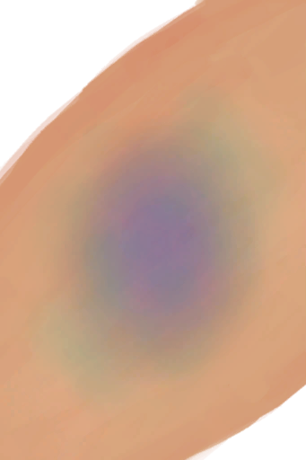
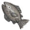
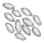

# 状态  
## “精神”  

[

[情绪](Morale.md)](Morale.md)

[

[压力](Stress.md)](Stress.md)

[

[清醒度](Wakefulness.md)](Wakefulness.md)

[

[食欲](Appetite.md)](Appetite.md)

[

[娱乐](Entertainment.md)](Entertainment.md)

[

[勇气](Courage.md)](Courage.md)

[

[孤独感](Loneliness.md)](Loneliness.md)

[

[精神失常](MindState.md)](MindState.md)

[

[狂躁](Mania.md)](Mania.md)

[

[失实症](Derealization.md)](Derealization.md)

[

[世界观](Structure.md)](Structure.md)

[

[孤立感](Isolation.md)](Isolation.md)

  
  
  
## “身体”  

[

[水分](Hydration.md)](Hydration.md)

[

[饱食](Satiation.md)](Satiation.md)

[

[耐力](Stamina.md)](Stamina.md)

[

[污垢](Filth.md)](Filth.md)

[

[体重](Weight.md)](Weight.md)

[

[晒黑](Tanning.md)](Tanning.md)

[

[足茧](CallousesFeet.md)](CallousesFeet.md)

[

[手茧](CallousesHands.md)](CallousesHands.md)

[

[视力](Myopia.md)](Myopia.md)

[

[皮肤完整度](SkinIntegrity.md)](SkinIntegrity.md)

  
  
  
## “伤害”  

[

[疼痛](Pain.md)](Pain.md)

[

[晒伤](Sunburn.md)](Sunburn.md)

[

[背痛](BackPain.md)](BackPain.md)

[

[蚊虫叮咬](BugBites.md)](BugBites.md)

[

[足部损伤](FootDamage.md)](FootDamage.md)

[

[手掌损伤](HandDamage.md)](HandDamage.md)

[

[失血](BloodLoss.md)](BloodLoss.md)

[

[淤青](Bruising.md)](Bruising.md)

[

[烧伤](Burns.md)](Burns.md)

[

[眼部损伤](EyeDamage.md)](EyeDamage.md)

[

[肺部伤害](LungDamage.md)](LungDamage.md)

  
  
  
## “身体内部”  

[

[过热](Hyperthermia.md)](Hyperthermia.md)

[

[失温](Hypothermia.md)](Hypothermia.md)

[

[血压](Blood.md)](Blood.md)

[

[发烧](Fever.md)](Fever.md)

[

[恶心](Nausea.md)](Nausea.md)

[

[腹泻](Diarrhoea.md)](Diarrhoea.md)

[

[免疫系统](ImmuneSystem.md)](ImmuneSystem.md)

[

[头疼](Headache.md)](Headache.md)

  
  
  
## “化合物”  

[

[镇痛](Analgesia.md)](Analgesia.md)

[

[蜘蛛兰效果](SpiderLilyEffect.md)](SpiderLilyEffect.md)

[

[姜效果](GingerEffect.md)](GingerEffect.md)

[抗生素](AntibioticsEffect.md)

[

[酒精](Alcohol.md)](Alcohol.md)

[

[钠](Sodium.md)](Sodium.md)

[

[奎宁](Quinine.md)](Quinine.md)

[

[咖啡因](Caffeine.md)](Caffeine.md)

[

[辣椒素](Capsaicin.md)](Capsaicin.md)

[

[蛇床子素](Psylocibin.md)](Psylocibin.md)

[

[茉莉效果](JasmineEffect.md)](JasmineEffect.md)

[

[食物中毒](FoodPoisoning.md)](FoodPoisoning.md)

[

[月季效果](ChinaRoseEffect.md)](ChinaRoseEffect.md)

[

[米饭效果](RiceEffect.md)](RiceEffect.md)

[

[蛇毒](VenomKrait.md)](VenomKrait.md)

  
  
  
## “防护”  

[

[绝热](InsulationHeat.md)](InsulationHeat.md)

[

[保温](InsulationCold.md)](InsulationCold.md)

[

[阳光防护](SunProtection.md)](SunProtection.md)

[

[雨水防护](RainProtection.md)](RainProtection.md)

[

[蚊虫防护](BugProtection.md)](BugProtection.md)

[

[足部防护](FootProtection.md)](FootProtection.md)

[

[护甲](Armor.md)](Armor.md)

  
  
  
## “厌倦度”  

[

[椰子<nobr>厌倦度</nobr>](SaturationCoconuts.md)](SaturationCoconuts.md)

[

[甲壳类<nobr>厌倦度</nobr>](SaturationCrustaceans.md)](SaturationCrustaceans.md)

[

[软体类<nobr>厌倦度</nobr>](SaturationMollusks.md)](SaturationMollusks.md)

[

[鱼类<nobr>厌倦度</nobr>](SaturationFish.md)](SaturationFish.md)

[

[鸟类<nobr>厌倦度</nobr>](SaturationBird.md)](SaturationBird.md)

[

[肉类<nobr>厌倦度</nobr>](SaturationMeat.md)](SaturationMeat.md)

[

[爬行类厌倦度](SaturationReptile.md)](SaturationReptile.md)

[

[香蕉<nobr>厌倦度</nobr>](SaturationBananas.md)](SaturationBananas.md)

[

[水果<nobr>厌倦度</nobr>](SaturationFruits.md)](SaturationFruits.md)

[

[蔬菜<nobr>厌倦度</nobr>](SaturationVegetables.md)](SaturationVegetables.md)

[

[西米<nobr>厌倦度</nobr>](SaturationSago.md)](SaturationSago.md)

[

[糖<nobr>厌倦度</nobr>](SaturationSugar.md)](SaturationSugar.md)

[

[稻米<nobr>厌倦度</nobr>](SaturationRice.md)](SaturationRice.md)

[

[坚果<nobr>厌倦度</nobr>](SaturationNuts.md)](SaturationNuts.md)

[

[干粮<nobr>厌倦度</nobr>](SaturationRations.md)](SaturationRations.md)

[

[蛋类<nobr>厌倦度</nobr>](SaturationEggs.md)](SaturationEggs.md)

[

[乳品<nobr>厌倦度</nobr>](SaturationDairy.md)](SaturationDairy.md)

[

[蘑菇<nobr>厌倦度</nobr>](SaturationMushrooms.md)](SaturationMushrooms.md)

[

[参薯<nobr>厌倦度</nobr>](SaturationYam.md)](SaturationYam.md)

  
  
  
## “技能”  

[

[攀爬(技能)](Skill_Climbing.md)](Skill_Climbing.md)

[

[游泳(技能)](Skill_Swimming.md)](Skill_Swimming.md)

[

[薬草学(技能)](Skill_Herbology.md)](Skill_Herbology.md)

[

[烹饪(技能)](Skill_Cooking.md)](Skill_Cooking.md)

[

[制作(技能)](Skill_Crafting.md)](Skill_Crafting.md)

[

[纺织(技能)](Skill_Tailoring.md)](Skill_Tailoring.md)

[

[木工(技能)](Skill_Woodworking.md)](Skill_Woodworking.md)

[

[石工(技能)](Skill_Knapping.md)](Skill_Knapping.md)

[

[金工(技能)](Skill_Metalworking.md)](Skill_Metalworking.md)

[

[陷阱(技能)](Skill_Trapping.md)](Skill_Trapping.md)

[

[钓鱼(技能)](Skill_Fishing.md)](Skill_Fishing.md)

[

[叉鱼(技能)](Skill_SpearFishing.md)](Skill_SpearFishing.md)

[

[矛战(技能)](Skill_SpearFighting.md)](Skill_SpearFighting.md)

[

[箭术(技能)](Skill_Archery.md)](Skill_Archery.md)

[

[投石(技能)](Skill_RockThrowing.md)](Skill_RockThrowing.md)

[

[投石索(技能)](Skill_Sling.md)](Skill_Sling.md)

[

[击鼓(技能)](Skill_Percussion.md)](Skill_Percussion.md)

[

[管乐器(技能)](Skill_WindInstruments.md)](Skill_WindInstruments.md)

[

[潜行(技能)](Skill_Stealth.md)](Skill_Stealth.md)

[

[洞察(技能)](Skill_Insight.md)](Skill_Insight.md)

  
  
  
## 种群数量  

[草原辣椒种群数量](Chilies_GrasslandPop.md)

[草原热带杏仁种群数量](Almond_GrasslandPop.md)

[丛林边缘芦荟种群数量](AloeVera_OutskirtsPop.md)

[丛林边缘柠檬草种群数量](LemonGrass_OutskirtsPop.md)

[丛林边缘椰子树种群数量](PalmTree_OutskirtsPop.md)

[丛林参薯种群数量](Yam_JunglePop.md)

[丛林大叶仙茅种群数量](WeevilLily_JunglePop.md)

[丛林高地咖啡种群数量](Coffee_JungleHighlandsPop.md)

[丛林高地芒果种群数量](Mango_JungleHighlandsPop.md)

[丛林高地月季种群数量](ChinaRose_JungleHighlandsPop.md)

[丛林卡瓦胡椒种群数量](Kava_JunglePop.md)

[丛林芒果种群数量](Mango_JunglePop.md)

[丛林茉莉种群数量](Jasmine_JunglePop.md)

[丛林香蕉树种群数量](Bananas_JunglePop.md)

[弹涂鱼种群数量](Pop_Mudskipper.md)

[东部草原野生枣树种群数量](WIldJujube_GrasslandsEPop.md)

[高地芦荟种群数量](AloeVera_HighlandsPop.md)

[高地柠檬草种群数量](LemonGrass_HighlandsPop.md)

[高地热带杏仁种群数量](Almond_HighlandsPop.md)

[海胆种群数量](Pop_Urchin.md)

[海怪种群数量](Pop_Seahounds.md)

[海螺种群数量](Pop_Conch.md)

[海鸥种群数量](Pop_Seagull.md)

[海蛇种群数量](Pop_Krait.md)

[海湾芦荟种群数量](AloeVera_BayPop.md)

[海湾柠檬草种群数量](LemonGrass_BayPop.md)

[海湾椰子树种群数量](PalmTree_BayPop.md)

[红树林姜种群数量](Ginger_MangrovesPop.md)

[红树林水椰种群数量](Nipa_MangrovesPop.md)

[灰山鹑种群数量](Pop_Partridge.md)

[巨蜥种群数量](Pop_Monitor.md)

[老鼠种群数量](Pop_Mouse.md)

[猕猴种群数量](Pop_Macaque.md)

[蜜蜂种群数量](Pop_Bees.md)

[牡蛎种群数量](Pop_Oyster.md)

[螃蟹种群数量](Pop_Crab.md)

[杀手无人机种群数量](Pop_Drone.md)

[沙滩芦荟种群数量](AloeVera_BeachPop.md)

[沙滩柠檬草种群数量](LemonGrass_BeachPop.md)

[沙滩椰子树种群数量](PalmTree_BeachPop.md)

[鲨鱼种群数量](Pop_Shark.md)

[山谷水稻种群数量](Rice_ValleyPop.md)

[山羊种群数量](Pop_Goat.md)

[湿地参薯种群数量](Yam_WetlandsPop.md)

[湿地姜种群数量](Ginger_WetlandsPop.md)

[湿地西米种群数量](Sago_WetlandsPop.md)

[湿地香蕉树种群数量](Bananas_WetlandsPop.md)

[湿地蜘蛛兰种群数量](SpiderLily_WetlandsPop.md)

[蜥蜴种群数量](Pop_Lizard.md)

[虾种群数量](Pop_Prawn.md)

[眼镜蛇种群数量](Pop_Cobra.md)

[野猪种群数量](Pop_Boar.md)

  
  
## 真人秀  

[真人秀 - 包裹倒计时](TV_CounterRush.md)

[真人秀 - 等待](TV_CounterWait.md)

[真人秀 - 岩滩](TV_Rocks.md)

[真人秀 草原](TV_Grasslands.md)

[真人秀 草原 - 探索](TV_GrasslandsExplore.md)

[真人秀 丛林](TV_Jungle.md)

[真人秀 丛林 - 探索](TV_JungleExplore.md)

[真人秀 高地](TV_Highlands.md)

[真人秀 高地 - 探索](TV_HighlandsExplore.md)

[真人秀 红树林](TV_Mangroves.md)

[真人秀 红树林 - 探索](TV_MangrovesExplore.md)

[真人秀 石滩 - 探索](TV_RocksExplore.md)

[真人秀舞台](TV_Stage.md)

[真人秀直播](TV_Lives.md)

[阻止抽到陨石坑事件](TV_CrateKiller.md)

  
  
## 其他  

[哀悼](Mourning.md)

[表面细菌](BacteriaSurface.md)

[波次](WaveCounter.md)

[不适](Discomfort.md)

[肠道](Intestines.md)

[潮汐](Tides.md)

[船长陪伴](CaptainCompany.md)

[船长亲密关系](CaptainPropinquity.md)

[丛林边缘风暴](Storm_Outskirts.md)

[丛林启程](Start_Jungle.md)

[多云](Clouds.md)

[防晒霜](SunScreenApplied.md)

[风](Wind.md)

[风暴次数](StormCounter.md)

[蜂蛰防护](BeeProtection.md)

[负重](Encumbrance.md)

[工作区](Workplace.md)

[关系层](RelationalLayer.md)

[光亮](Light.md)

[海风程度](SeaAgitation.md)

[海怪击杀数](SeaHoundKills.md)

[海怪寄生虫](ParasitesSeahound.md)

[海怪入侵计数器](SeaHoundRaidCounter.md)

[海鸥入侵计数器](SeagullRaidCounter.md)

[海鸥之惧](SeagullFear.md)

[海湾风暴](Storm_Bay.md)

[航海技术](SeaSicknessResistance.md)

[航行](Sailed.md)

[红树林风暴](Storm_Mangroves.md)

[怀孕](Pregnancy.md)

[荒芜沙滩风暴](Storm_DesolateBeach.md)

[击中椰子](OnCoconutHit.md)

[计数](Counter.md)

[计数器](TickCounter.md)

[季节](Seasons.md)

[寄生虫](Parasites.md)

[假期满意度](HolidaySatisfaction.md)

[监视者的凝视](WatchersGlare.md)

[监视者的注视](WatcherInsight.md)

[降水值](RainValue.md)

[焦虑计数](AnxietyCounter.md)

[脚的硬度](FootHardness.md)

[精神错乱](Insanity.md)

[精神失常计数器](PsychoCounter.md)

[巨蜥袭击计时器](MonitorRaidCounter.md)

[距离](Distance.md)

[决心](Determination.md)

[抗晕船](AntiSeasickness.md)

[空气毒性](AirToxicity.md)

[老鼠袭击次数](MouseDamageCounter.md)

[猎手的注视](HunterInsight.md)

[猎手接近](HuntersProximity.md)

[淋雨](RainExposure.md)

[硫磺膏保护](BrimstoneGelProtection.md)

[芦荟膏防护](AloeVeraGelProtection.md)

[旅行加速](ModifierTravel.md)

[美人鱼最终行动](MermaidFinalAction.md)

[梦魇计数器](NightmareCounter.md)

[猕猴入侵计数器](MacaqueRaidCounter.md)

[蜜蜂蛰刺](BeeStings.md)

[内陆恐惧症](LandSickness.md)

[泥巴防护](MudProtection.md)

[疟疾寄生虫](ParasiteMalaria.md)

[疟疾寄生虫抗性](MalariaResistance.md)

[呕吐次数](VomitCounter.md)

[攀爬动作受限](ModifierClimb.md)

[皮肤潮湿度](SkinHumidity.md)

[情绪钟摆](MoodOscillator.md)

[曲调 - 丛林](Tune_Jungle.md)

[曲调 - 洞穴](Tune_Cave.md)

[曲调 - 孤独](Tune_Lonely.md)

[曲调 - 海洋](Tune_Sea.md)

[曲调 - 欢快](Tune_Happy.md)

[曲调 - 简易](Tune_Simple.md)

[曲调 - 进阶](Tune_Advanced.md)

[曲调 - 韦斯顿](Tune_Weston.md)

[曲调 - 忧伤](Tune_Sad.md)

[驱虫](BugRepellentApplied.md)

[沙滩风暴](Storm_Beach.md)

[蛇毒抗性](VenomKraitResistance.md)

[神圣灵视](GodInsight.md)

[肾脏](IfKidneys.md)

[湿度](Wetness.md)

[手部动作受限](ModifierHand.md)

[手部神经损伤](NerveDamageHands.md)

[手部神经损伤(永久)](NerveDamageHandsPermanent.md)

[手枪(技能)](Skill_Handguns.md)

[首月次数](FirstMonthCounter.md)

[受伤](Wounds.md)

[舒适度](Comfort.md)

[睡眠风险](SleepRisk.md)

[睡眠中断](SleepInterrupt.md)

[睡眠钟](SleepClock.md)

[思维深度](ThoughtDepth.md)

[宿敌现身](EnemyDefeated.md)

[探索从林深处](Exploration_DeepJungle.md)

[探索丛林](Exploration_Jungle.md)

[探索丛林边缘](Exploration_JungleOutskirts.md)

[探索大海](Exploration_Sea.md)

[探索海岸](Exploration_Beach.md)

[探索海湾](Exploration_Bay.md)

[探索红树林](Exploration_Mangroves.md)

[探索湿地](Exploration_Wetlands.md)

[探索小岛](Exploration_SmallIsland.md)

[探索岩滩](Exploration_Rocks.md)

[陶艺加成](PotteryBonus.md)

[体感温度](TemperaturePerceived.md)

[腿部动作受限](ModifierLeg.md)

[腿部防护](LegProtection.md)

[腿部神经损伤](NerveDamageLegs.md)

[外星斑点](AlienSpots.md)

[外星孢子](AlienSpores.md)

[外星植物渴求](AlienCravings.md)

[韦斯顿带来的快乐](WestonHappiness.md)

[韦斯顿的决心](WestonDetermination.md)

[韦斯顿的陪伴](WestonCompany.md)

[韦斯顿还在](WestonAlive.md)

[韦斯顿亲密关系](WestonPropinquity.md)

[韦斯顿特辑](WestonSpecial1.md)

[韦斯顿特辑 2](WestonSpecial2.md)

[韦斯顿特辑 3](WestonSpecial3.md)

[韦斯顿特辑 4](WestonSpecial4.md)

[胃](Stomach.md)

[蚊虫叮咬](BugDamage.md)

[蚊虫数量](BugPopulation.md)

[无人机袭击计数器](DroneRaidCounter.md)

[细菌性斑疹伤寒](BacteriaTyphusPackage.md)

[细菌性发烧](BacteriaFever.md)

[细菌性腹泻](BacteriaDiarrhoea.md)

[细菌性霍乱](BacteriaCholera.md)

[细菌性霍乱并发症](BacteriaCholeraPackage.md)

[虚空灵视](VoidInsight.md)

[岩滩风暴](Storm_Rocks.md)

[岩滩启程](Start_Rocks.md)

[阳光辐射](SunExposure.md)

[阳光强度](SunStrength.md)

[野营热病](BacteriaTyphus.md)

[野猪死亡预警](BoarDeathAlarm.md)

[野猪袭击计时器](BoarRaidCounter.md)

[夜晚](IsNight.md)

[已灌溉](Irrigated.md)

[引擎开启](EngineOn.md)

[用餐环境](Foodplace.md)

[油箱满的](FuelTankFull.md)

[雨水计数器](RainCounter.md)

[晕船](SeaSickness.md)

[晕倒次数](FaintCounter.md)

[在黑暗环境](InDarkPlace.md)

[在木筏上](OnRaft.md)

[遮蔽](Sheltered.md)

[中蛇毒](VenomKraitInjector.md)

[紫外线过敏](SunAllergy.md)

[阻止抽到海鸥巢](SeagullNestKiller.md)

[阻止抽到雨天](RainKiller.md)

[阻止抽到棕榈树](PalmTreeKiller.md)

[祖父去世了么？](IsGrandpaDead.md)

[左腿神经损伤](NerveDamageLegsPermanent.md)

[IGNOREKEY](OnNotAxeAdv.md)

[MacaqueFear_GameName](MacaqueFear.md)

  
  

