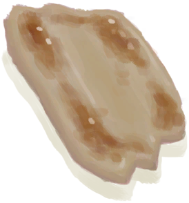

# “人类食物”  

<a href="AlienNodule.md" style="color:black">外星结节</a>

<a href="Banana.md" style="color:black">香蕉</a>

<a href="BatCooked.md" style="color:black">烤蝙蝠</a>

<a href="BeeHoneycomb.md" style="color:black">巢脾</a>

<a href="BirdMeatCooked.md" style="color:black">烤鸟肉</a>

<a href="BirdMeatSmoked.md" style="color:black">烟熏鸟肉</a>

<a href="BoarMeatCooked.md" style="color:black">烤野猪肉</a>

<a href="BoarMeatDried.md" style="color:black">野猪肉干</a>

<a href="BoarMeatSalted.md" style="color:black">腌野猪肉</a>

<a href="BoarMeatSmoked.md" style="color:black">烟熏野猪肉</a>

<a href="BonefishCooked.md" style="color:black">烤北梭鱼</a>

<a href="BonefishSmoked.md" style="color:black">烟熏北梭鱼</a>

<a href="CandiedGinger.md" style="color:black">姜糖</a>

<a href="Cheese.md" style="color:black">山羊奶酪</a>

<a href="ChickenSandwich.md" style="color:black">鸡肉三明治</a>

<a href="Chilies.md" style="color:black">辣椒</a>

<a href="Chocolate.md" style="color:black">巧克力</a>

<a href="CoconutMeat.md" style="color:black">椰肉</a>

<a href="CoconutMeatCooked.md" style="color:black">烤椰肉</a>

<a href="CoffeeBerries.md" style="color:black">咖啡果</a>

<a href="ConchMeatCooked.md" style="color:black">烤海螺肉</a>

<a href="ConchMeatSoftCooked.md" style="color:black">松软的烤海螺肉</a>

<a href="ButterBakedOystersCooked.md" style="color:black">黄油焗牡蛎</a>

<a href="CrabCooked.md" style="color:black">烤螃蟹</a>

<a href="EggBoiled.md" style="color:black">水煮蛋</a>

<a href="EggCooked.md" style="color:black">烤蛋</a>

<a href="FishDried.md" style="color:black">鱼干</a>

<a href="FishSalted.md" style="color:black">咸鱼</a>

<a href="FishTaco.md" style="color:black">鱼肉塔可</a>

<a href="FoodRation.md" style="color:black">压缩干粮</a>

<a href="FriedBanana.md" style="color:black">炸香蕉</a>

<a href="GoatMeatCooked.md" style="color:black">烤羊肉</a>

<a href="GoatMeatDried.md" style="color:black">羊肉干</a>

<a href="GoatMeatSalted.md" style="color:black">腌羊肉</a>

<a href="GoatMeatSmoked.md" style="color:black">烟熏羊肉</a>

<a href="GoatfishCooked.md" style="color:black">烤绯鲤</a>

<a href="GoatfishSmoked.md" style="color:black">烟熏绯鲤</a>

<a href="GrouperMeatCooked.md" style="color:black">烤石斑鱼</a>

<a href="GrouperMeatSmoked.md" style="color:black">烟熏石斑鱼</a>

<a href="HerringCooked.md" style="color:black">烤鲱鱼</a>

<a href="HerringSmoked.md" style="color:black">烟熏鲱鱼</a>

<a href="HoneyCandy.md" style="color:black">蜜糖</a>

<a href="JujubeFruits.md" style="color:black">野枣</a>

<a href="LizardCooked.md" style="color:black">烤蜥蜴</a>

<a href="MacaqueMeatCooked.md" style="color:black">烤猕猴肉</a>

<a href="MacaqueMeatDried.md" style="color:black">猕猴肉干</a>

<a href="MacaqueMeatSalted.md" style="color:black">腌猕猴肉</a>

<a href="MacaqueMeatSmoked.md" style="color:black">烟熏猕猴肉</a>

<a href="Mango.md" style="color:black">芒果</a>

<a href="MeatSaltedDried.md" style="color:black">腌肉</a>

<a href="MonitorMeatCooked.md" style="color:black">烤巨蜥肉</a>

<a href="MonitorMeatDried.md" style="color:black">巨蜥肉干</a>

<a href="MonitorMeatSalted.md" style="color:black">腌巨蜥肉</a>

<a href="MonitorMeatSmoked.md" style="color:black">烟熏巨蜥肉</a>

<a href="MouseCooked.md" style="color:black">烤老鼠</a>

<a href="MudskipperCooked.md" style="color:black">烤弹涂鱼</a>

<a href="NipaSeeds.md" style="color:black">水椰籽</a>

<a href="OysterMeatBaked.md" style="color:black">黄油焗牡蛎</a>

<a href="OysterMeatCooked.md" style="color:black">烤牡蛎肉</a>

<a href="ParrotFishCooked.md" style="color:black">烤鹦哥鱼</a>

<a href="ParrotFishSmoked.md" style="color:black">烟熏鹦哥鱼</a>

<a href="PrawnsCooked.md" style="color:black">烤虾</a>

<a href="ProteinBar.md" style="color:black">蛋白棒</a>

<a href="Puffballs.md" style="color:black">马勃菌</a>

<a href="RiceCooked.md" style="color:black">米饭</a>

<a href="SagoFlatbread.md" style="color:black">西米饼</a>

<a href="SagoFlatbreadHoney.md" style="color:black">蜂蜜西米饼</a>

<a href="SagoFlatbreadJam.md" style="color:black">果酱西米饼</a>

<a href="SagoSlime.md" style="color:black">西米糕</a>

<a href="SeahoundCooked.md" style="color:black">烤海怪肉</a>

<a href="SharkCooked.md" style="color:black">烤鲨鱼肉</a>

<a href="SharkSmoked.md" style="color:black">烟熏鲨鱼肉</a>

<a href="SnakeCooked.md" style="color:black">烤蛇肉</a>

<a href="Sushi.md" style="color:black">寿司</a>

<a href="ThreadfinCooked.md" style="color:black">烤马鲅鱼</a>

<a href="ThreadfinSmoked.md" style="color:black">烟熏马鲅鱼</a>

<a href="TropicalAlmondKernels.md" style="color:black">热带杏仁核</a>

<a href="TropicalAlmondsRoasted.md" style="color:black">烤热带杏仁</a>

<a href="UrchinMeatCooked.md" style="color:black">烤海胆</a>

<a href="YamBoiled.md" style="color:black">煮熟的参薯</a>

<a href="YamJam.md" style="color:black">参薯酱</a>

  
  

