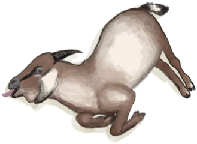
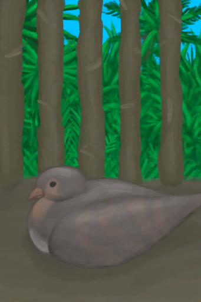

# “大的”  

<a href="CageTrap.md" style="color:black">诱捕笼</a>

<a href="CageTrapPlaced.md" style="color:black">诱捕笼</a>

<a href="GasCookerOn.md" style="color:black">瓦斯炉</a>

<a href="HalfLog.md" style="color:black">半根原木</a>

<a href="Log.md" style="color:black">原木</a>

<a href="BowRustic.md" style="color:black">简易的弓</a>

<a href="BowRustic_Copper.md" style="color:black">上弦的简易弓</a>

<a href="BowRustic_Simple.md" style="color:black">上弦的简易弓</a>

<a href="ClayFirePitUnfired.md" style="color:black">未烧制的粘土火盆</a>

<a href="ClayVase.md" style="color:black">陶罐</a>

<a href="ClayVaseUnfired.md" style="color:black">未烧制的陶罐</a>

<a href="GlazedVase.md" style="color:black">釉面陶罐</a>

<a href="GlazedVaseUnfired.md" style="color:black">未烧制的釉面陶罐</a>

<a href="Jerrycan.md" style="color:black">油桶</a>

<a href="JerrycanFuel.md" style="color:black">装有燃料的油桶</a>

<a href="Drum.md" style="color:black">鼓</a>

<a href="CageTrapMacaque.md" style="color:black">中陷阱的猕猴</a>

<a href="BoarCarcass.md" style="color:black">野猪尸体</a>

<a href="BoarCarcassPiglet.md" style="color:black">小猪尸体</a>

<a href="BoarEnclosureFemale.md" style="color:black">母猪</a>

<a href="BoarEnclosureMale.md" style="color:black">公猪</a>

<a href="BoarEnclosurePiglet.md" style="color:black">小猪</a>

<a href="BoarSkinned.md" style="color:black">剥皮的野猪</a>

<a href="BoarSkinnedPiglet.md" style="color:black">剥皮的小猪</a>

<a href="BoarTiedFemale.md" style="color:black">母猪</a>

<a href="BoarTiedMale.md" style="color:black">公猪</a>

<a href="BoarTiedPiglet.md" style="color:black">小猪</a>

<a href="DogFriend.md" style="color:black">忠犬朋友</a>

<a href="GoatCarcassFemale.md" style="color:black">山羊尸体</a>

<a href="GoatCarcassKid.md" style="color:black">小羊尸体</a>

<a href="GoatCarcassMale.md" style="color:black">山羊尸体</a>

<a href="GoatEnclosureFemale.md" style="color:black">母山羊</a>

<a href="GoatEnclosureKid.md" style="color:black">小羊</a>

<a href="GoatEnclosureLactating.md" style="color:black">泌乳期山羊</a>

<a href="GoatEnclosureMale.md" style="color:black">公山羊</a>

<a href="GoatSkinned.md" style="color:black">剥皮的山羊</a>

<a href="GoatSkinnedKid.md" style="color:black">剥皮的小羊</a>

<a href="GoatTiedFemale.md" style="color:black">母山羊</a>

<a href="GoatTiedFemaleLactating.md" style="color:black">泌乳期山羊</a>

<a href="GoatTiedKid.md" style="color:black">小羊</a>

<a href="GoatTiedMale.md" style="color:black">公山羊</a>

<a href="SeahoundCarcass.md" style="color:black">海怪尸体</a>

<a href="SharkCarcass.md" style="color:black">鲨鱼尸体</a>

<a href="PartridgeFemaleEnclosure.md" style="color:black">雌灰山鹑</a>

<a href="PartridgeMaleEnclosure.md" style="color:black">雄灰山鹑</a>

<a href="Chest.md" style="color:black">储物箱</a>

<a href="ChestFarmer.md" style="color:black">储物箱</a>

<a href="ClayPotCoolerOff.md" style="color:black">保鲜罐</a>

<a href="ClayPotCoolerUndeployed.md" style="color:black">保鲜罐</a>

<a href="SupplyChestRaft.md" style="color:black">补给箱</a>

<a href="Travois.md" style="color:black">小拉车</a>

<a href="Trunk.md" style="color:black">收纳箱</a>

<a href="TrunkPerk.md" style="color:black">超级生存箱 2000</a>

<a href="TrunkPerkPlaced.md" style="color:black">超级生存箱 2000</a>

<a href="TrunkPlaced.md" style="color:black">收纳箱</a>

<a href="LizardDrum.md" style="color:black">蜥蜴皮手鼓</a>

<a href="MonitorCarcass.md" style="color:black">巨蜥尸体</a>

<a href="MonitorSkinned.md" style="color:black">剥皮的巨蜥</a>

<a href="SandCastle.md" style="color:black">沙堡</a>

<a href="StickLong.md" style="color:black">长木棍</a>

<a href="Broom.md" style="color:black">扫帚</a>

<a href="FishingRod.md" style="color:black">钓鱼竿</a>

<a href="FishingRodBait.md" style="color:black">钓鱼竿（已添加诱饵）</a>

<a href="HarpoonBone.md" style="color:black">鱼镖</a>

<a href="Shield.md" style="color:black">盾牌</a>

<a href="SpearCopper.md" style="color:black">铜长矛</a>

<a href="SpearFishing.md" style="color:black">鱼叉</a>

<a href="SpearFlint.md" style="color:black">燧石长矛</a>

<a href="SpearObsidian.md" style="color:black">黑曜石长矛</a>

<a href="SpearRustic.md" style="color:black">简易长矛</a>

<a href="SpearScrap.md" style="color:black">废金属长矛</a>

<a href="AlembicUndeployed.md" style="color:black">蒸馏器</a>

  
  

