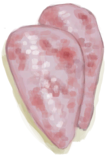
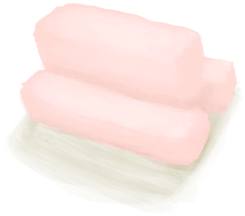
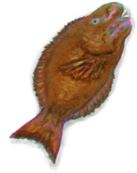
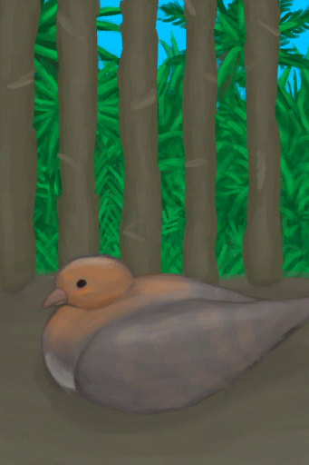

# “肉”  

<a href="Bat.md" style="color:black">蝙蝠尸体</a>

<a href="BatCooked.md" style="color:black">烤蝙蝠</a>

<a href="BirdMeat.md" style="color:black">鸟肉</a>

<a href="BirdMeatCooked.md" style="color:black">烤鸟肉</a>

<a href="BirdMeatSmoked.md" style="color:black">烟熏鸟肉</a>

<a href="BoarMeat.md" style="color:black">野猪肉</a>

<a href="BoarMeatCooked.md" style="color:black">烤野猪肉</a>

<a href="BoarMeatDried.md" style="color:black">野猪肉干</a>

<a href="BoarMeatSalted.md" style="color:black">腌野猪肉</a>

<a href="BoarMeatSaltedDrying.md" style="color:black">腌制中的野猪肉</a>

<a href="BoarMeatSmoked.md" style="color:black">烟熏野猪肉</a>

<a href="Bonefish.md" style="color:black">北梭鱼</a>

<a href="BonefishCooked.md" style="color:black">烤北梭鱼</a>

<a href="BonefishMeat.md" style="color:black">北梭鱼肉</a>

<a href="BonefishSmoked.md" style="color:black">烟熏北梭鱼</a>

<a href="Butter.md" style="color:black">黄油</a>

<a href="ConchMeat.md" style="color:black">海螺肉</a>

<a href="ConchMeatCooked.md" style="color:black">烤海螺肉</a>

<a href="ConchMeatSoft.md" style="color:black">松软的海螺肉</a>

<a href="ConchMeatSoftCooked.md" style="color:black">松软的烤海螺肉</a>

<a href="Egg.md" style="color:black">蛋</a>

<a href="EggBoiled.md" style="color:black">水煮蛋</a>

<a href="EggCooked.md" style="color:black">烤蛋</a>

<a href="EggPartridgeFertilized.md" style="color:black">受精蛋</a>

<a href="Fat.md" style="color:black">脂肪</a>

<a href="FishDried.md" style="color:black">鱼干</a>

<a href="FishSalted.md" style="color:black">咸鱼</a>

<a href="FishSaltedDrying.md" style="color:black">腌制中的咸鱼</a>

<a href="FishScraps.md" style="color:black">鱼杂</a>

<a href="FishScrapsCooked.md" style="color:black">烤鱼杂</a>

<a href="GoatMeat.md" style="color:black">羊肉</a>

<a href="GoatMeatCooked.md" style="color:black">烤羊肉</a>

<a href="GoatMeatDried.md" style="color:black">羊肉干</a>

<a href="GoatMeatSalted.md" style="color:black">腌羊肉</a>

<a href="GoatMeatSaltedDrying.md" style="color:black">腌制中的羊肉</a>

<a href="GoatMeatSmoked.md" style="color:black">烟熏羊肉</a>

<a href="Goatfish.md" style="color:black">绯鲤</a>

<a href="GoatfishCooked.md" style="color:black">烤绯鲤</a>

<a href="GoatfishSmoked.md" style="color:black">烟熏绯鲤</a>

<a href="Herring.md" style="color:black">鲱鱼</a>

<a href="HerringCooked.md" style="color:black">烤鲱鱼</a>

<a href="HerringSmoked.md" style="color:black">烟熏鲱鱼</a>

<a href="KingThreadfin.md" style="color:black">大马鲅鱼</a>

<a href="SeahoundCarcass.md" style="color:black">海怪尸体</a>

<a href="SharkCarcass.md" style="color:black">鲨鱼尸体</a>

<a href="Lizard.md" style="color:black">蜥蜴</a>

<a href="LizardCooked.md" style="color:black">烤蜥蜴</a>

<a href="MacaqueCarcass.md" style="color:black">猕猴尸体</a>

<a href="MacaqueMeat.md" style="color:black">猕猴肉</a>

<a href="MacaqueMeatCooked.md" style="color:black">烤猕猴肉</a>

<a href="MacaqueMeatDried.md" style="color:black">猕猴肉干</a>

<a href="MacaqueMeatSalted.md" style="color:black">腌猕猴肉</a>

<a href="MacaqueMeatSaltedDrying.md" style="color:black">腌制中的猕猴肉</a>

<a href="MacaqueMeatSmoked.md" style="color:black">烟熏猕猴肉</a>

<a href="MeatSaltedDried.md" style="color:black">腌肉</a>

<a href="MeatSaltedDrying.md" style="color:black">腌制中的肉</a>

<a href="MonitorMeat.md" style="color:black">巨蜥肉</a>

<a href="MonitorMeatCooked.md" style="color:black">烤巨蜥肉</a>

<a href="MonitorMeatDried.md" style="color:black">巨蜥肉干</a>

<a href="MonitorMeatSalted.md" style="color:black">腌巨蜥肉</a>

<a href="MonitorMeatSaltedDrying.md" style="color:black">腌制中的巨蜥肉</a>

<a href="MonitorMeatSmoked.md" style="color:black">烟熏巨蜥肉</a>

<a href="Mouse.md" style="color:black">老鼠尸体</a>

<a href="MouseCooked.md" style="color:black">烤老鼠</a>

<a href="MouseSkinned.md" style="color:black">剥皮的老鼠</a>

<a href="Mudskipper.md" style="color:black">弹涂鱼</a>

<a href="MudskipperCooked.md" style="color:black">烤弹涂鱼</a>

<a href="OysterMeat.md" style="color:black">牡蛎肉</a>

<a href="OysterMeatBaked.md" style="color:black">黄油焗牡蛎</a>

<a href="OysterMeatCooked.md" style="color:black">烤牡蛎肉</a>

<a href="ParrotFish.md" style="color:black">鹦哥鱼</a>

<a href="ParrotFishCooked.md" style="color:black">烤鹦哥鱼</a>

<a href="ParrotFishSmoked.md" style="color:black">烟熏鹦哥鱼</a>

<a href="PartridgeChick.md" style="color:black">小灰山鹑</a>

<a href="PartridgeChickDead.md" style="color:black">小灰山鹑尸体</a>

<a href="PartridgeDead.md" style="color:black">灰山鹑尸体</a>

<a href="PartridgeFemaleEnclosure.md" style="color:black">雌灰山鹑</a>

<a href="PartridgeFemaleLive.md" style="color:black">雌灰山鹑</a>

<a href="PartridgeMaleEnclosure.md" style="color:black">雄灰山鹑</a>

<a href="PartridgeMaleLive.md" style="color:black">雄灰山鹑</a>

<a href="Prawns.md" style="color:black">虾</a>

<a href="PrawnsCooked.md" style="color:black">烤虾</a>

<a href="Rennet.md" style="color:black">凝乳酶</a>

<a href="SeagullDead.md" style="color:black">海鸥尸体</a>

<a href="SeahoundCooked.md" style="color:black">烤海怪肉</a>

<a href="Seahoundmeat.md" style="color:black">海怪肉</a>

<a href="SharkCooked.md" style="color:black">烤鲨鱼肉</a>

<a href="ThreadfinCooked.md" style="color:black">烤马鲅鱼</a>

<a href="ThreadfinMeat.md" style="color:black">马鲅鱼肉</a>

<a href="ThreadfinSmoked.md" style="color:black">烟熏马鲅鱼</a>

<a href="UrchinMeat.md" style="color:black">海胆肉</a>

<a href="UrchinMeatCooked.md" style="color:black">烤海胆</a>

  
  

