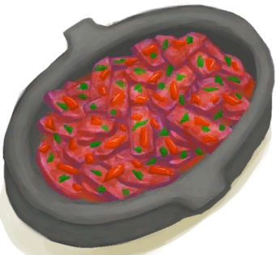

# “可加盐。”  

<a href="BatCooked.md" style="color:black">烤蝙蝠</a>

<a href="BirdMeatCooked.md" style="color:black">烤鸟肉</a>

<a href="BirdMeatSmoked.md" style="color:black">烟熏鸟肉</a>

<a href="BoarMeatCooked.md" style="color:black">烤野猪肉</a>

<a href="BoarMeatSmoked.md" style="color:black">烟熏野猪肉</a>

<a href="BonefishCooked.md" style="color:black">烤北梭鱼</a>

<a href="BonefishSmoked.md" style="color:black">烟熏北梭鱼</a>

<a href="Butter.md" style="color:black">黄油</a>

<a href="Cheese.md" style="color:black">山羊奶酪</a>

<a href="ChickenSandwich.md" style="color:black">鸡肉三明治</a>

<a href="ConchMeatCooked.md" style="color:black">烤海螺肉</a>

<a href="ConchMeatSoftCooked.md" style="color:black">松软的烤海螺肉</a>

<a href="BoneBroth.md" style="color:black">骨头汤</a>

<a href="ButterBakedOystersCooked.md" style="color:black">黄油焗牡蛎</a>

<a href="CoconutFish.md" style="color:black">椰子鱼</a>

<a href="DrunkenCrab.md" style="color:black">醉蟹</a>

<a href="EggFriedRice.md" style="color:black">蛋炒饭</a>

<a href="FishNChips.md" style="color:black">炸鱼薯条</a>

<a href="FishOmelette.md" style="color:black">鱼肉蛋饼</a>

<a href="FriedPuffballs.md" style="color:black">炒菇球</a>

<a href="GoatStew.md" style="color:black">炖羊汤</a>

<a href="HeartyFeast.md" style="color:black">肉食盛宴</a>

<a href="HoneyGlazedPork.md" style="color:black">蜜汁火腿</a>

<a href="IslandChicken.md" style="color:black">热带烤鸡</a>

<a href="JungleSalad.md" style="color:black">丛林沙拉</a>

<a href="LizardFry.md" style="color:black">辣炒巨蜥肉</a>

<a href="MacaqueSkewers.md" style="color:black">猕猴肉串</a>

<a href="SeafoodCup.md" style="color:black">海鲜杂烩</a>

<a href="YamCurry.md" style="color:black">参薯咖喱</a>

<a href="CrabCooked.md" style="color:black">烤螃蟹</a>

<a href="EggBoiled.md" style="color:black">水煮蛋</a>

<a href="EggCooked.md" style="color:black">烤蛋</a>

<a href="FishTaco.md" style="color:black">鱼肉塔可</a>

<a href="FriedBanana.md" style="color:black">炸香蕉</a>

<a href="GoatMeatCooked.md" style="color:black">烤羊肉</a>

<a href="GoatMeatSmoked.md" style="color:black">烟熏羊肉</a>

<a href="GoatfishCooked.md" style="color:black">烤绯鲤</a>

<a href="GoatfishSmoked.md" style="color:black">烟熏绯鲤</a>

<a href="GrouperMeatCooked.md" style="color:black">烤石斑鱼</a>

<a href="GrouperMeatSmoked.md" style="color:black">烟熏石斑鱼</a>

<a href="HerringCooked.md" style="color:black">烤鲱鱼</a>

<a href="HerringSmoked.md" style="color:black">烟熏鲱鱼</a>

<a href="LizardCooked.md" style="color:black">烤蜥蜴</a>

<a href="MacaqueMeatCooked.md" style="color:black">烤猕猴肉</a>

<a href="MacaqueMeatSmoked.md" style="color:black">烟熏猕猴肉</a>

<a href="MonitorMeatCooked.md" style="color:black">烤巨蜥肉</a>

<a href="MonitorMeatSmoked.md" style="color:black">烟熏巨蜥肉</a>

<a href="MouseCooked.md" style="color:black">烤老鼠</a>

<a href="MudskipperCooked.md" style="color:black">烤弹涂鱼</a>

<a href="OysterMeatCooked.md" style="color:black">烤牡蛎肉</a>

<a href="ParrotFishCooked.md" style="color:black">烤鹦哥鱼</a>

<a href="ParrotFishSmoked.md" style="color:black">烟熏鹦哥鱼</a>

<a href="ProteinBar.md" style="color:black">蛋白棒</a>

<a href="RiceCooked.md" style="color:black">米饭</a>

<a href="SagoFlatbread.md" style="color:black">西米饼</a>

<a href="SagoSlime.md" style="color:black">西米糕</a>

<a href="SeahoundCooked.md" style="color:black">烤海怪肉</a>

<a href="SharkCooked.md" style="color:black">烤鲨鱼肉</a>

<a href="SharkSmoked.md" style="color:black">烟熏鲨鱼肉</a>

<a href="SnakeCooked.md" style="color:black">烤蛇肉</a>

<a href="Sushi.md" style="color:black">寿司</a>

<a href="ThreadfinCooked.md" style="color:black">烤马鲅鱼</a>

<a href="ThreadfinSmoked.md" style="color:black">烟熏马鲅鱼</a>

<a href="UrchinMeatCooked.md" style="color:black">烤海胆</a>

<a href="YamBoiled.md" style="color:black">煮熟的参薯</a>

  
  
## 影响动作  

<table><tr><td>[“进食动作(组)”](EatingAction.md)</td></tr<tr><td>** 需要属性：** 咸度: <b>1(100%)</b></td></tr<tr><td>[

[情绪](Morale.md)](Morale.md)<b>+8</b> [

[钠](Sodium.md)](Sodium.md)<b>+12</b></td></tr</table>
  

