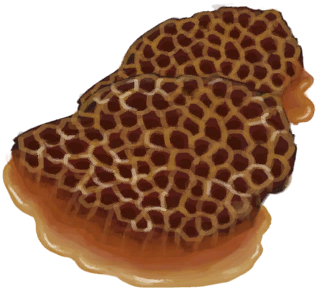

# “高糖分”  

<a href="AlienNodule.md" style="color:black">外星结节</a>

<a href="BeeHoneycomb.md" style="color:black">巢脾</a>

<a href="FriedBanana.md" style="color:black">炸香蕉</a>

<a href="HoneyCandy.md" style="color:black">蜜糖</a>

<a href="SagoFlatbreadHoney.md" style="color:black">蜂蜜西米饼</a>

<a href="SagoFlatbreadJam.md" style="color:black">果酱西米饼</a>

<a href="Sugar.md" style="color:black">糖</a>

<a href="Yam.md" style="color:black">参薯</a>

<a href="YamBoiled.md" style="color:black">煮熟的参薯</a>

<a href="YamJam.md" style="color:black">参薯酱</a>

  
  

