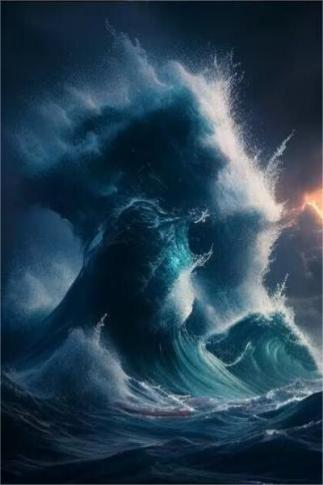

# 乱流  
> 海月闪耀，海洋平面近在眼前！  
  
<table class="table table-bordered" data-toggle="table"  data-show-header="false"><thead style="display:none"><tr ><th  style="width:50%;text-align:left;vertical-align:top;"  data-sortable="true"  >title</th><th  style="width:50%;text-align:left;vertical-align:top;"  ></th></tr></thead><tr ><td  style="width:50%;text-align:left;vertical-align:top;"  ></td><td  style="width:50%;text-align:left;vertical-align:top;"  >

<a href="tq_Event_Character_Lola_StartEpisode_Drowning_StepThree.md" style="color:black">乱流</a>

</td></tr></tbody></table>  
  
## 获取来源  

向上游动

[海面(深海)](tq_Nc_DeepSeaToOverTheDeepSea.md)

  
  
## 动作  

<table><tr><td rowspan="2" style="width:200px;text-align:center;font-size:1.3em;font-weight:bold">

大口呼吸

15分

</td><td></td></tr><tr><td><b>自身：</b>→消失</td></tr><tr><td colspan="2"><b>状态变化：</b>[

[缺氧程度](tq_Gs_UnderSea_Oxygen.md)](tq_Gs_UnderSea_Oxygen.md)<b>-100</b></td></tr><tr><td colspan="2">[

[飓风海域(环境)](tq_Env_OverTheDeepSea.md)](tq_Env_OverTheDeepSea.md)(<b>+1</b>)</td></tr></table>
  
  
  

