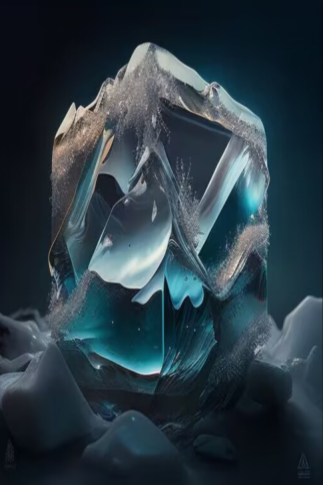

# 冰球来袭！  
> 一个比你人还大的巨型冰球砸过来了！  
  
<table class="table table-bordered" data-toggle="table"  data-show-header="false"><thead style="display:none"><tr ><th  style="width:50%;text-align:left;vertical-align:top;"  data-sortable="true"  >title</th><th  style="width:50%;text-align:left;vertical-align:top;"  ></th></tr></thead><tr ><td  style="width:50%;text-align:left;vertical-align:top;"  ></td><td  style="width:50%;text-align:left;vertical-align:top;"  >

<a href="tq_Event_Hail_IceDrop.md" style="color:black">冰球来袭！</a>

</td></tr></tbody></table>  
  
## 获取来源  

转化

[暴风雪](tq_Wather_Hail.md)

  
  
## 动作  

<table><tr><td rowspan="2" style="width:200px;text-align:center;font-size:1.3em;font-weight:bold">

快躲开！

</td><td></td></tr><tr><td><b>自身：</b>→消失</td></tr><tr><td colspan="2"><b>状态变化：</b>[

[情绪](Morale.md)](Morale.md)<b>-10</b>, [

[情绪](Morale.md)](Morale.md)<b>+50</b></td></tr><tr><td colspan="2">[

[冰](tq_Nc_Hail_Ice.md)](tq_Nc_Hail_Ice.md)(<b>+3</b>)</td></tr></table>
  

<table><tr><td rowspan="2" style="width:200px;text-align:center;font-size:1.3em;font-weight:bold">

空手接冰球！

</td><td></td></tr><tr><td><b>自身：</b>→消失</td></tr><tr><td colspan="2"><b>状态变化：</b>[

[背痛](BackPain.md)](BackPain.md)<b>+20</b>, [

[淤青](Bruising.md)](Bruising.md)<b>+50</b></td></tr><tr><td colspan="2">[

[冰雹砸伤](tq_W_Hail_IceDrop.md)](tq_W_Hail_IceDrop.md)(<b>+1</b>), [

[冰](tq_Nc_Hail_Ice.md)](tq_Nc_Hail_Ice.md)(<b>+9</b>)</td></tr></table>
  
  
  

