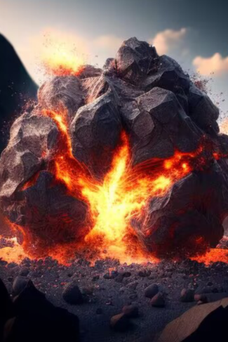

# 轰隆隆！  
> 白色浓雾中窜出一道火星，一颗落石砸过来了！  
  
<table class="table table-bordered" data-toggle="table"  data-show-header="false"><thead style="display:none"><tr ><th  style="width:50%;text-align:left;vertical-align:top;"  data-sortable="true"  >title</th><th  style="width:50%;text-align:left;vertical-align:top;"  ></th></tr></thead><tr ><td  style="width:50%;text-align:left;vertical-align:top;"  ></td><td  style="width:50%;text-align:left;vertical-align:top;"  >

<a href="tq_Event_VolcanicEruptions_RockDrop.md" style="color:black">轰隆隆！</a>

</td></tr></tbody></table>  
  
## 获取来源  

轰隆隆！

[火山爆发](tq_Wather_VolcanicEruptions.md)

  
  
## 动作  

<table><tr><td rowspan="2" style="width:200px;text-align:center;font-size:1.3em;font-weight:bold">

快闪开！

</td><td></td></tr><tr><td><b>自身：</b>→消失</td></tr><tr><td colspan="2"><b>状态变化：</b>[

[情绪](Morale.md)](Morale.md)<b>-10</b></td></tr><tr><td colspan="2">

<table style="margin-bottom:3px;"><tr><td rowspan=2 style="text-align:center" width="80px">
基础权重

100
</td><td style="font-size:0.6em;line-height:0.6em;font-weight:bold">1</td></tr><tr><td>[

[巨岩](tq_Nc_VolcanicEruption_Drop_Rock_Hot.md)](tq_Nc_VolcanicEruption_Drop_Rock_Hot.md)(<b>+1</b>)</td></tr></table>

<table style="margin-bottom:3px;"><tr><td rowspan=2 style="text-align:center" width="80px">
基础权重

50
</td><td style="font-size:0.6em;line-height:0.6em;font-weight:bold">Dirt</td></tr><tr><td>[

[轰隆隆！(事件)](tq_Event_VolcanicEruptions_RockDrop_Dodge_Failure.md)](tq_Event_VolcanicEruptions_RockDrop_Dodge_Failure.md)(<b>+1</b>)</td></tr></table>

</td></tr></table>
  

<table><tr><td rowspan="2" style="width:200px;text-align:center;font-size:1.3em;font-weight:bold">

真男人直面冲击！

</td><td></td></tr><tr><td><b>自身：</b>→消失</td></tr><tr><td colspan="2"><b>状态变化：</b>[

[背痛](BackPain.md)](BackPain.md)<b>+20</b>, [

[淤青](Bruising.md)](Bruising.md)<b>+50</b></td></tr><tr><td colspan="2">[

[巨岩](tq_Nc_VolcanicEruption_Drop_Rock_Hot.md)](tq_Nc_VolcanicEruption_Drop_Rock_Hot.md)(<b>+3</b>), [

[落石撞伤](tq_W_VolcanicEruptions_RockDrop.md)](tq_W_VolcanicEruptions_RockDrop.md)(<b>+1</b>)</td></tr></table>
  
  
  

