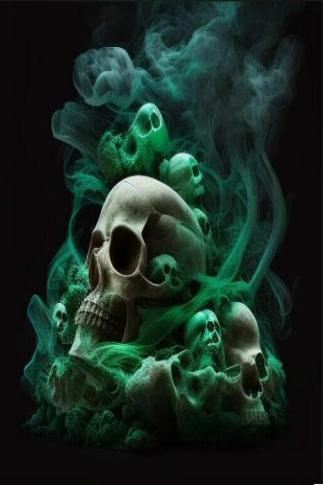

# 死灵骨  
> 它是某种..活的...  
  
<table class="table table-bordered" data-toggle="table"  data-show-header="false"><thead style="display:none"><tr ><th  style="width:50%;text-align:left;vertical-align:top;"  >title</th><th  style="width:50%;text-align:left;vertical-align:top;"  ></th></tr></thead><tr ><td  style="width:50%;text-align:left;vertical-align:top;"  >**重量：**150</td><td  style="width:50%;text-align:left;vertical-align:top;"  >

<a href="tq_Nc_GhostShip_DeathBones.md" style="color:black">死灵骨</a>

</td></tr></tbody></table>  
  
## 获取来源  

可恶！

[争相抗争！(事件)](tq_Event_GhostShip_BonePile_ProducedBoneMonster_Confrontion_Fail.md)

哈！

[攻其不备！(事件)](tq_Event_GhostShip_BonePile_ProducedBoneMonster_Confrontion_Success.md)

随便逛逛

[骷髅船(幽灵船)](tq_Exp_GhostShip.json.md)

清理骨堆

[骨堆(幽灵船)](tq_Nc_GhostShip_BonePile.md)

  
  
## 可拖入  

<table style="margin-bottom:0px;"><tr><td style="width:40%;text-align:left; background-color:#FEFEFE"><b>拖入：</b>[“锤”](tag_Hammer.md)</td><td style="width:40%;font-size:1em;font-weight:bold;background-color:#FEFEFE">打碎 (30分) [“手部动作(组)”](HandAction.md)</td></tr><tr style="background-color:#FFFFFF"><td style=""><b>使用物：</b></td><td style=""><b>自身：</b>→消失</td></tr><tr><td colspan="2">[

[骨头碎片](BoneSplinters.md)](BoneSplinters.md)(<b>+2</b>)</td></tr></table>
  
  
## 可拖至  

[前往祭坛](tq_Path_GhostShip_Retern.json.md)

  
  

