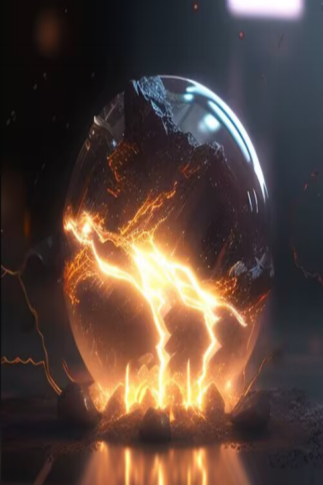

# 瓶中闪电  
> 电弧四射，散发着强烈的光芒。  
  
<table class="table table-bordered" data-toggle="table"  data-show-header="false"><thead style="display:none"><tr ><th  style="width:50%;text-align:left;vertical-align:top;"  >title</th><th  style="width:50%;text-align:left;vertical-align:top;"  ></th></tr></thead><tr ><td  style="width:50%;text-align:left;vertical-align:top;"  >**重量：**50  ** 效果: ** [

[情绪](Morale.md)](Morale.md)加成<b>+0.25</b> [

[光亮](Light.md)](Light.md)<b>+10</b> [

[孤立感](Isolation.md)](Isolation.md)加成<b>-0.1</b> [

[舒适度](Comfort.md)](Comfort.md)<b>+50</b></td><td  style="width:50%;text-align:left;vertical-align:top;"  >

<a href="tq_Nc_ThunderStorm_Lightning_In_Bottle.md" style="color:black">瓶中闪电</a>

</td></tr></tbody></table>  
  
## 获取来源  

转化

[雷鸣](tq_Nc_ThunderStorm_Lightning_In_Bottle_StepTwo.md)

** 使用**[塑料瓶](PlasticBottle.md) , [葫芦瓶](GourdBottle.md) , [塑料瓶(满)](PlasticBottleFull.md) , [铜瓶](CopperBottle.md)装起来！

[球形闪电](tq_Nc_ThunderStorm_ThunderBall.md)

  
  
## 属性   

<table style="margin-bottom:0px;"><tr><td style="width:30%;text-align:left; background-color:#FEFEFE;font-size:1.3em;font-weight:bold;">耐久</td><td style="font-size:1em;background-color:#FEFEFE">初始：192 每15分钟-1 , 最多需要：2天</td></tr><tr style="background-color:#FFFFFF"><td colspan=2>** 到达0时： ** 自身: → [

[腐烂物](RottenRemains.md)](RottenRemains.md)</td></tr></table>
  

<table style="margin-bottom:0px;"><tr><td style="width:30%;text-align:left; background-color:#FEFEFE;font-size:1.3em;font-weight:bold;">

</td><td style="font-size:1em;background-color:#FEFEFE">初始：0 , 最大：3 -</td></tr><tr style="background-color:#FFFFFF"><td colspan=2>** 到达上限时： ** 自身: → [

[雷鸣](tq_Nc_ThunderStorm_Lightning_In_Bottle_StepTwo.md)](tq_Nc_ThunderStorm_Lightning_In_Bottle_StepTwo.md)</td></tr></table>
  

