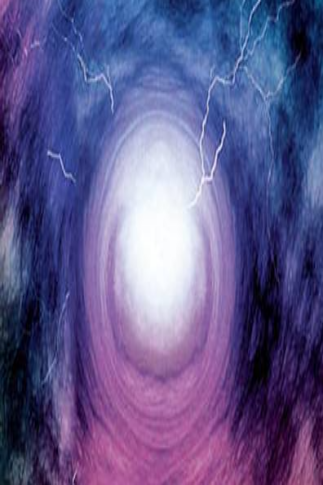
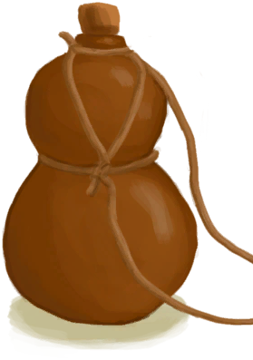
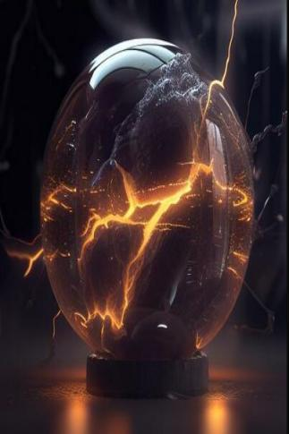

# 球形闪电  
> 一个漂浮的闪光球体，电弧四散，看起来有些不妙。  
  
<table class="table table-bordered" data-toggle="table"  data-show-header="false"><thead style="display:none"><tr ><th  style="width:50%;text-align:left;vertical-align:top;"  >title</th><th  style="width:50%;text-align:left;vertical-align:top;"  ></th></tr></thead><tr ><td  style="width:50%;text-align:left;vertical-align:top;"  >** 可重命名 **  ** 不可删除 **  ** 不可堆叠 **  **可用次数：**3</td><td  style="width:50%;text-align:left;vertical-align:top;"  >

<a href="tq_Nc_ThunderStorm_ThunderBall.md" style="color:black">球形闪电</a>

</td></tr></tbody></table>  
  
## 获取来源  

它飘过来了！

[轰隆隆！(事件)](tq_Event_ThunderBall.md)

  
  
## 动作  

<table><tr><td rowspan="2" style="width:200px;text-align:center;font-size:1.3em;font-weight:bold">

踢走！

</td><td></td></tr><tr><td><b>自身：</b>→消失</td></tr><tr><td colspan="2">

<table style="margin-bottom:3px;"><tr><td rowspan=2 style="text-align:center" width="80px">
基础权重

2
</td><td style="font-size:0.6em;line-height:0.6em;font-weight:bold">Partridge Dead</td></tr><tr><td>[

[什么！(事件)](tq_Event_ThunderStorm_ThunderBall_Boom.md)](tq_Event_ThunderStorm_ThunderBall_Boom.md)(<b>+1</b>)</td></tr></table>

<table style="margin-bottom:3px;"><tr><td rowspan=2 style="text-align:center" width="80px">
基础权重

1
</td><td style="font-size:0.6em;line-height:0.6em;font-weight:bold">Dirt</td></tr><tr><td>[

[轰隆隆！(事件)](tq_Event_ThunderStorm_ThunderBall_AnimalsBoom.md)](tq_Event_ThunderStorm_ThunderBall_AnimalsBoom.md)(<b>+1</b>)</td></tr></table>

</td></tr></table>
  
  
  
## 可拖入  

<table style="margin-bottom:0px;"><tr><td style="width:40%;text-align:left; background-color:#FEFEFE"><b>拖入：</b>[

[塑料瓶](PlasticBottle.md)](PlasticBottle.md) | [

[葫芦瓶](GourdBottle.md)](GourdBottle.md) | [

[塑料瓶(满)](PlasticBottleFull.md)](PlasticBottleFull.md) | [

[铜瓶](CopperBottle.md)](CopperBottle.md)</td><td style="width:40%;font-size:1em;font-weight:bold;background-color:#FEFEFE">装起来！  </td></tr><tr style="background-color:#FFFFFF"><td style=""><b>使用物：</b></td><td style=""><b>自身：</b></td></tr><tr><td colspan="2">

<table style="margin-bottom:3px;"><tr><td rowspan=2 style="text-align:center" width="80px">
基础权重

8
</td><td style="font-size:0.6em;line-height:0.6em;font-weight:bold">Dirt</td></tr><tr><td>[

[轰隆隆！(事件)](tq_Event_ThunderStorm_ThunderBall_Paralysis.md)](tq_Event_ThunderStorm_ThunderBall_Paralysis.md)(<b>+1</b>)</td></tr></table>

<table style="margin-bottom:3px;"><tr><td rowspan=2 style="text-align:center" width="80px">
基础权重

2
</td><td style="font-size:0.6em;line-height:0.6em;font-weight:bold">Dirt</td></tr><tr><td>[

[瓶中闪电](tq_Nc_ThunderStorm_Lightning_In_Bottle.md)](tq_Nc_ThunderStorm_Lightning_In_Bottle.md)(<b>+1</b>) 球闪耐久

: <b><b>-3</b></b></td></tr></table>

</td></tr></table>
  
  
## 属性   

<table style="margin-bottom:0px;"><tr><td style="width:30%;text-align:left; background-color:#FEFEFE;font-size:1.3em;font-weight:bold;">

饥饿</td><td style="font-size:1em;background-color:#FEFEFE">初始：24 , 最大：24 每15分钟-1 , 最多需要：6小时</td></tr><tr style="background-color:#FFFFFF"><td colspan=2>** 到达0时：一声巨响！ ** 自身: → [

[什么！(事件)](tq_Event_ThunderStorm_ThunderBall_Boom.md)](tq_Event_ThunderStorm_ThunderBall_Boom.md)</td></tr></table>
  

<table style="margin-bottom:0px;"><tr><td style="width:30%;text-align:left; background-color:#FEFEFE;font-size:1.3em;font-weight:bold;">

球闪耐久</td><td style="font-size:1em;background-color:#FEFEFE">初始：3 , 最大：3 -</td></tr><tr style="background-color:#FFFFFF"><td colspan=2>** 到达0时：渴死了 ** 自身: →消失</td></tr></table>
  

<table style="margin-bottom:0px;"><tr><td style="width:30%;text-align:left; background-color:#FEFEFE;font-size:1.3em;font-weight:bold;">独处时间</td><td style="font-size:1em;background-color:#FEFEFE">初始：96 , 最大：96 每15分钟-16 , 最多需要：1小时30分</td></tr><tr style="background-color:#FFFFFF"><td colspan=2>** 到达0时： ** 自身: 饥饿

  <b>+24～+96(100%～400%)</b> 球闪耐久

  <b>+24～+96(800%～3200%)</b> 独处时间  <b>+96(100%)</b></td></tr></table>
  

<table style="margin-bottom:0px;"><tr><td style="width:30%;text-align:left; background-color:#FEFEFE;font-size:1.3em;font-weight:bold;">便便</td><td style="font-size:1em;background-color:#FEFEFE">初始：192 , 最大：192 每15分钟-1 , 最多需要：2天</td></tr><tr style="background-color:#FFFFFF"><td colspan=2>** 到达0时： ** 自身: 便便  <b>+192(100%)</b> [

[粪便](Manure.md)](Manure.md)(<b>+1</b>)</td></tr></table>
  

