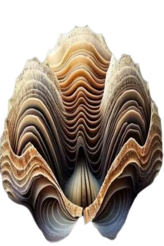

# 海洋贝  
> 一个巨大的贝壳，可以看见其中蕴含了很多的珍珠。  
  
<table class="table table-bordered" data-toggle="table"  data-show-header="false"><thead style="display:none"><tr ><th  style="width:50%;text-align:left;vertical-align:top;"  >title</th><th  style="width:50%;text-align:left;vertical-align:top;"  ></th></tr></thead><tr ><td  style="width:50%;text-align:left;vertical-align:top;"  >**环境：**[浅海(环境)](tq_Env_UnderSea.md)  **重量：**25  **可用次数：**480</td><td  style="width:50%;text-align:left;vertical-align:top;"  >

<a href="tq_Nc_UnderSea_BigShells.md" style="color:black">海洋贝</a>

</td></tr></tbody></table>  
  
## 动作  

<table><tr><td rowspan="2" style="width:200px;text-align:center;font-size:1.3em;font-weight:bold">

摘珍珠

15分

</td><td>[“食用蔬菜类动作(组)”](VegetarianAction.md), [“进食动作(组)”](EatingAction.md)</td></tr><tr><td><b>自身：</b>

  <b>-32(-6.67%)</b>, 特殊1  <b>+1(10%)</b></td></tr><tr><td colspan="2"><b>需求：</b>

: <b>13～50(26%～100%)</b>, 

: <b>120～480(25%～100%)</b></td></tr><tr><td colspan="2">

<table style="margin-bottom:3px;"><tr><td rowspan=2 style="text-align:center" width="80px">
基础权重

25
</td><td style="font-size:0.6em;line-height:0.6em;font-weight:bold">Dirt</td></tr><tr><td>[

[珍珠](Pearl.md)](Pearl.md)(<b>+1</b>)</td></tr></table>

<table style="margin-bottom:3px;"><tr><td rowspan=2 style="text-align:center" width="80px">
基础权重

50
</td><td style="font-size:0.6em;line-height:0.6em;font-weight:bold">Dirt</td></tr><tr><td>[

[什么！(事件)](tq_Event_UnderSea_BigShell_Attack.md)](tq_Event_UnderSea_BigShell_Attack.md)(<b>+1</b>)</td></tr></table>

<table style="margin-bottom:3px;"><tr><td rowspan=2 style="text-align:center" width="80px">
基础权重

25
</td><td style="font-size:0.6em;line-height:0.6em;font-weight:bold">Dirt</td></tr><tr><td>[

[夜明珠](tq_Nc_UnderSea_LuminousPearl.md)](tq_Nc_UnderSea_LuminousPearl.md)(<b>+1</b>)</td></tr></table>

</td></tr></table>
  

<table><tr><td rowspan="2" style="width:200px;text-align:center;font-size:1.3em;font-weight:bold">

摘大珍珠

15分

</td><td></td></tr><tr><td><b>自身：</b>

  <b>-32(-6.67%)</b>, 特殊1  <b>+1(10%)</b></td></tr><tr><td colspan="2"><b>需求：</b>

: <b>120～480(25%～100%)</b></td></tr><tr><td colspan="2">

<table style="margin-bottom:3px;"><tr><td rowspan=2 style="text-align:center" width="80px">
基础权重

15
</td><td style="font-size:0.6em;line-height:0.6em;font-weight:bold">Dirt</td></tr><tr><td>[

[水灵球](tq_Nc_UnderSea_WaterBallWaterBall.md)](tq_Nc_UnderSea_WaterBallWaterBall.md)(<b>+1</b>)</td></tr></table>

<table style="margin-bottom:3px;"><tr><td rowspan=2 style="text-align:center" width="80px">
基础权重

85
</td><td style="font-size:0.6em;line-height:0.6em;font-weight:bold">Dirt</td></tr><tr><td>[

[什么！(事件)](tq_Event_UnderSea_BigShell_Attack.md)](tq_Event_UnderSea_BigShell_Attack.md)(<b>+1</b>)</td></tr></table>

</td></tr></table>
  
  
  
## 可拖入  

<table style="margin-bottom:0px;"><tr><td style="width:40%;text-align:left; background-color:#FEFEFE"><b>拖入：</b>[

[鱼杂](FishScraps.md)](FishScraps.md) | [

[烤鱼杂](FishScrapsCooked.md)](FishScrapsCooked.md) | [

[外星结节](AlienNodule.md)](AlienNodule.md) | [

[野枣](JujubeFruits.md)](JujubeFruits.md)</td><td style="width:40%;font-size:1em;font-weight:bold;background-color:#FEFEFE">补充  </td></tr><tr style="background-color:#FFFFFF"><td style=""><b>使用物：</b>→消失</td><td style=""><b>自身：</b>

  <b>+0.25(0.5%)</b>, 

  <b>+4(0.83%)</b></td></tr></table>
  

<table style="margin-bottom:0px;"><tr><td style="width:40%;text-align:left; background-color:#FEFEFE"><b>拖入：</b>[“肉”](tag_Meat.md)</td><td style="width:40%;font-size:1em;font-weight:bold;background-color:#FEFEFE">补充  </td></tr><tr style="background-color:#FFFFFF"><td style=""><b>使用物：</b>→消失</td><td style=""><b>自身：</b>

  <b>+1.5(3%)</b>, 

  <b>+32(6.67%)</b></td></tr></table>
  

<table style="margin-bottom:0px;"><tr><td style="width:40%;text-align:left; background-color:#FEFEFE"><b>拖入：</b>[“人类食物”](tag_HumanFood.md) | [“鱼肉”](tag_Fish.md)</td><td style="width:40%;font-size:1em;font-weight:bold;background-color:#FEFEFE">补充  </td></tr><tr style="background-color:#FFFFFF"><td style=""><b>使用物：</b>→消失</td><td style=""><b>自身：</b>

  <b>+1(2%)</b>, 

  <b>+16(3.33%)</b></td></tr></table>
  
  
## 属性   

<table style="margin-bottom:0px;"><tr><td style="width:30%;text-align:left; background-color:#FEFEFE;font-size:1.3em;font-weight:bold;">

</td><td style="font-size:1em;background-color:#FEFEFE">初始：0 , 最大：50 -</td></tr><tr style="background-color:#FFFFFF"><td colspan=2>** 到达上限时： ** 自身: 

  <b>-50(-100%)</b> [

[海洋贝(满)(事件)](tq_Event_UnderSea_BigShell_HungerFull.md)](tq_Event_UnderSea_BigShell_HungerFull.md)(<b>+1</b>)</td></tr></table>
  

<table style="margin-bottom:0px;"><tr><td style="width:30%;text-align:left; background-color:#FEFEFE;font-size:1.3em;font-weight:bold;">

</td><td style="font-size:1em;background-color:#FEFEFE">初始：480 , 最大：480 每15分钟+1 , 最多需要：5天</td></tr><tr style="background-color:#FFFFFF"><td colspan=2></td></tr></table>
  

<table style="margin-bottom:0px;"><tr><td style="width:30%;text-align:left; background-color:#FEFEFE;font-size:1.3em;font-weight:bold;">特殊1</td><td style="font-size:1em;background-color:#FEFEFE">初始：0 , 最大：10 -</td></tr><tr style="background-color:#FFFFFF"><td colspan=2>** 到达上限时： ** [

[贝壳毒素](tq_W_UnderSea_BigShells_Two.md)](tq_W_UnderSea_BigShells_Two.md)(<b>+1</b>) 特殊1: <b><b>-10</b></b></td></tr></table>
  

