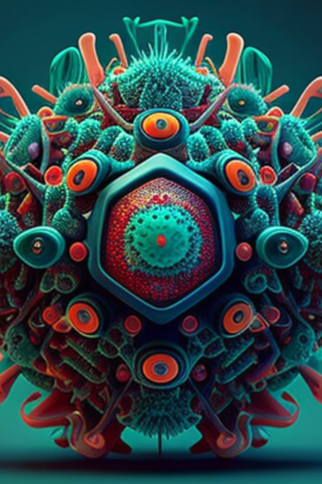

# 未知病毒  
> 我的手和脚感觉越来越不舒服了，感觉怎么吃都吃不饱..  
  
<table class="table table-bordered" data-toggle="table"  data-show-header="false"><thead style="display:none"><tr ><th  style="width:50%;text-align:left;vertical-align:top;"  >title</th><th  style="width:50%;text-align:left;vertical-align:top;"  ></th></tr></thead><tr ><td  style="width:50%;text-align:left;vertical-align:top;"  >** 不可删除 **  **装备：**[“擦伤”](eTag_WAbrasion.md)  **槽位：**1  **可用次数：**0  ** 效果: ** [

[发烧](Fever.md)](Fever.md)加成<b>+5</b> [

[光亮](Light.md)](Light.md)<b>+50</b> [

[饱食](Satiation.md)](Satiation.md)加成<b>-2</b> [

[肉类<nobr>厌倦度</nobr>](SaturationMeat.md)](SaturationMeat.md)加成<b>-5</b></td><td  style="width:50%;text-align:left;vertical-align:top;"  >

<a href="tq_W_BloodWolfViur_StepTwo.md" style="color:black">未知病毒</a>

</td></tr></tbody></table>  
  
## 获取来源  

我感觉身体产生了一些变化...

[未知病毒](tq_W_BloodWolfViur.md)

  
  
## 属性   

<table style="margin-bottom:0px;"><tr><td style="width:30%;text-align:left; background-color:#FEFEFE;font-size:1.3em;font-weight:bold;">

</td><td style="font-size:1em;background-color:#FEFEFE">初始：0 , 最大：288 每15分钟+1 , 最多需要：3天</td></tr><tr style="background-color:#FFFFFF"><td colspan=2>** 到达上限时：我感觉身体产生了一些变化... ** 自身: → [

[狼人血统](tq_W_BloodWolfViur_StepThree.md)](tq_W_BloodWolfViur_StepThree.md) [

[狼爪](tq_Nc_BloodMoon_BloodWolf_Claw.md)](tq_Nc_BloodMoon_BloodWolf_Claw.md)(<b>+1</b>)</td></tr></table>
  

<table style="margin-bottom:0px;"><tr><td style="width:30%;text-align:left; background-color:#FEFEFE;font-size:1.3em;font-weight:bold;">

</td><td style="font-size:1em;background-color:#FEFEFE">初始：0 , 最大：0 -</td></tr><tr style="background-color:#FFFFFF"><td colspan=2></td></tr></table>
  

<table style="margin-bottom:0px;"><tr><td style="width:30%;text-align:left; background-color:#FEFEFE;font-size:1.3em;font-weight:bold;">

</td><td style="font-size:1em;background-color:#FEFEFE">初始：192 , 最大：192 每15分钟-1 , 最多需要：2天</td></tr><tr style="background-color:#FFFFFF"><td colspan=2>** 到达0时： **</td></tr></table>
  

