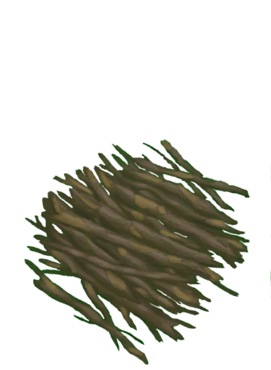
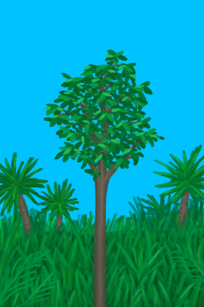
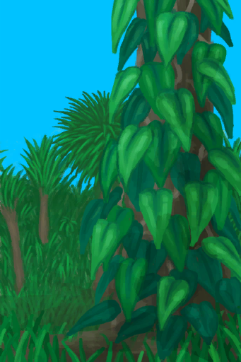

# Deep Jungle  
> "I should explore it for resources  
  

<a href="DeepJungle.md" style="color:black">Deep Jungle</a>

<a href="JungleHighlands.md" style="color:black">Jungle Highlands</a>

<a href="SecretValley.md" style="color:black">Secret Valley</a>

<a href="Wetlands.md" style="color:black">Wetland Jungle</a>

  
  
<table class="table table-bordered" data-toggle="table"  data-show-header="false"><thead style="display:none"><tr ><th  style="width:50%;text-align:left;vertical-align:top;"  >title</th><th  style="width:50%;text-align:left;vertical-align:top;"  ></th></tr></thead><tr ><td  style="width:50%;text-align:left;vertical-align:top;"  >** Unique On Board **  **Environment：**[Jungle(Environment)](Env_DeepJungle.md)  **Tag：**	[“Trees for Snare Traps”](tag_SnareCompatible.md)  ** EnvironmentEffect: ** [

[Rain Protection](RainProtection.md)](RainProtection.md)<b>+2</b> [

[Heat Insulation](InsulationHeat.md)](InsulationHeat.md)<b>+2</b> [

[Sun Protection](SunProtection.md)](SunProtection.md)<b>+2</b> [

[Bug Population](BugPopulation.md)](BugPopulation.md)<b>+3</b> [

[Hunter's Proximity](HuntersProximity.md)](HuntersProximity.md)<b>-0.5</b>  ** Improvements: ** [Path](Imp_Path.md) , [Irrigation System](Imp_Irrigation.md) , [Trapping Fences](Imp_TrappingFences.md)</td><td  style="width:50%;text-align:left;vertical-align:top;"  >"The Deep jungle is a lush forest near the Island's valley</td></tr></tbody></table>  
  
## Exploration  
<table class="table table-bordered" data-toggle="table"  ><thead style=""><tr ><th  style="text-align:left;vertical-align:top;"  >Progress</th><th  style="text-align:left;vertical-align:top;"  >Target</th></tr></thead><tr ><td  style="text-align:left;vertical-align:top;"  >40%</td><td  style="text-align:left;vertical-align:top;"  >[To Wetlands(Jungle)](Path_DeepJungleToWetlands.md)</td></tr><tr ><td  style="text-align:left;vertical-align:top;"  >60%</td><td  style="text-align:left;vertical-align:top;"  >[To Jungle Highlands(Jungle)](Path_DeepJungleToJungleHighlands.md)</td></tr><tr ><td  style="text-align:left;vertical-align:top;"  >80%</td><td  style="text-align:left;vertical-align:top;"  >[To Secret Valley(Jungle)](Path_DeepJungleToValley.md)</td></tr><tr ><td  style="text-align:left;vertical-align:top;"  >100%</td><td  style="text-align:left;vertical-align:top;"  >[Area Explored(Event)(Jungle)](Event_DeepJungleExplored.md)</td></tr></tbody></table>  
  
## Action  

<table><tr><td rowspan="2" style="width:200px;text-align:center;font-size:1.3em;font-weight:bold">

Explore

15m

</td><td>[“LegAction(Group)”](LegAction.md)</td></tr><tr><td></td></tr><tr><td colspan="2"><b>Require：</b>[

[Light](Light.md)](Light.md): <b>10-100</b></td></tr><tr><td colspan="2"><b>StatChange：</b>[

[Foot Damage](FootDamage.md)](FootDamage.md)<b>+20</b>, [

[Stamina](Stamina.md)](Stamina.md)<b>-4</b>, [

[Stress](Stress.md)](Stress.md)<b>-10</b>, [

[Filth](Filth.md)](Filth.md)<b>+1</b>, [Exploration Jungle](Exploration_Jungle.md)<b>+1</b>, [TV Jungle - Explore](TV_JungleExplore.md)<b>+1</b>, [Exploration Deep Jungle](Exploration_DeepJungle.md)<b>+1</b></td></tr><tr><td colspan="2">

<table style="margin-bottom:3px;"><tr><td rowspan=2 style="text-align:center" width="80px">
Base Weight

600
</td><td style="font-size:0.6em;line-height:0.6em;font-weight:bold">Dry Leaves</td></tr><tr><td>[

[Dry Leaves](LeavesDry.md)](LeavesDry.md)(<b>+1～+2</b>)</td></tr></table>

<table style="margin-bottom:3px;"><tr><td rowspan=2 style="text-align:center" width="80px">
Base Weight

600
</td><td style="font-size:0.6em;line-height:0.6em;font-weight:bold">Palm Fronds</td></tr><tr><td>[

[Palm Fronds](PalmFronds.md)](PalmFronds.md)(<b>+2～+4</b>)</td></tr></table>

<table style="margin-bottom:3px;"><tr><td rowspan=2 style="text-align:center" width="80px">
Base Weight

800
</td><td style="font-size:0.6em;line-height:0.6em;font-weight:bold">Sticks</td></tr><tr><td>[

[Sticks](Sticks.md)](Sticks.md)(<b>+1～+2</b>)</td></tr></table>

<table style="margin-bottom:3px;"><tr><td rowspan=2 style="text-align:center" width="80px">
Base Weight

600
</td><td style="font-size:0.6em;line-height:0.6em;font-weight:bold">Long Sticks</td></tr><tr><td>[

[Long Stick](StickLong.md)](StickLong.md)(<b>+1</b>)</td></tr></table>

<table style="margin-bottom:3px;"><tr><td rowspan=2 style="text-align:center" width="80px">
Base Weight

400
</td><td style="font-size:0.6em;line-height:0.6em;font-weight:bold">Palm Bush</td></tr><tr><td>[

[Palm Bush](PalmBush.md)](PalmBush.md)(<b>+1</b>)</td></tr></table>

<table style="margin-bottom:3px;"><tr><td rowspan=2 style="text-align:center" width="80px">
Base Weight

800
</td><td style="font-size:0.6em;line-height:0.6em;font-weight:bold">Wood</td></tr><tr><td>[

[Wood](Wood.md)](Wood.md)(<b>+1</b>)</td></tr></table>

<table style="margin-bottom:3px;"><tr><td rowspan=2 style="text-align:center" width="80px">
Base Weight

1000000
</td><td style="font-size:0.6em;line-height:0.6em;font-weight:bold">Wood First❗1 limit</td></tr><tr><td>[

[Wood](Wood.md)](Wood.md)(<b>+1</b>)</td></tr></table>

<table style="margin-bottom:3px;"><tr><td rowspan=2 style="text-align:center" width="80px">
Base Weight

800
</td><td style="font-size:0.6em;line-height:0.6em;font-weight:bold">Stone❗3 limit</td></tr><tr><td>[

[Stone](Stone.md)](Stone.md)(<b>+1</b>)</td></tr></table>

<table style="margin-bottom:3px;"><tr><td rowspan=2 style="text-align:center" width="80px">
Base Weight

0
</td><td style="font-size:0.6em;line-height:0.6em;font-weight:bold">Supply Crate</td></tr><tr><td>[

[Supply Capsule](TV_SupplyCapsule.md)](TV_SupplyCapsule.md)(<b>+1</b>)</td></tr><tr><td colspan=2><li>[

[TV Jungle](TV_Jungle.md)](TV_Jungle.md) in <b>1</b>, weight<b>+300</b></li><li>[TV Jungle - Explore](TV_JungleExplore.md) in <b>0～9</b>, weight<b>-999</b></li></td></tr></table>

<table style="margin-bottom:3px;"><tr><td rowspan=2 style="text-align:center" width="80px">
Base Weight

300
</td><td style="font-size:0.6em;line-height:0.6em;font-weight:bold">Heavy Stone❗2 limit</td></tr><tr><td>[

[Heavy Stone](StoneHeavy.md)](StoneHeavy.md)(<b>+1</b>)</td></tr></table>

<table style="margin-bottom:3px;"><tr><td rowspan=2 style="text-align:center" width="80px">
Base Weight

200000
</td><td style="font-size:0.6em;line-height:0.6em;font-weight:bold">Small Tree</td></tr><tr><td>[

[Small Tree](SmallTree.md)](SmallTree.md)(<b>+1</b>)</td></tr></table>

<table style="margin-bottom:3px;"><tr><td rowspan=2 style="text-align:center" width="80px">
Base Weight

200000
</td><td style="font-size:0.6em;line-height:0.6em;font-weight:bold">Small Palm</td></tr><tr><td>[

[Small Palm](SmallPalm.md)](SmallPalm.md)(<b>+1</b>)</td></tr></table>

<table style="margin-bottom:3px;"><tr><td rowspan=2 style="text-align:center" width="80px">
Base Weight

600
</td><td style="font-size:0.6em;line-height:0.6em;font-weight:bold">Snake Grass</td></tr><tr><td>[

[Snakegrass Patch](SnakegrassPatch.md)](SnakegrassPatch.md)(<b>+1</b>)</td></tr><tr><td colspan=2><li>[

[Herbology(Skill)](Skill_Herbology.md)](Skill_Herbology.md) in <b>0～150</b>, weight<b>+0～+200</b></li></td></tr></table>

<table style="margin-bottom:3px;"><tr><td rowspan=2 style="text-align:center" width="80px">
Base Weight

2000
</td><td style="font-size:0.6em;line-height:0.6em;font-weight:bold">Large Tree</td></tr><tr><td>[

[Large Tree](LargeTree.md)](LargeTree.md)(<b>+1</b>)</td></tr></table>

<table style="margin-bottom:3px;"><tr><td rowspan=2 style="text-align:center" width="80px">
Base Weight

0
</td><td style="font-size:0.6em;line-height:0.6em;font-weight:bold">Banana Tree</td></tr><tr><td>[

[Banana Tree](BananaTree.md)](BananaTree.md)(<b>+1</b>)[Beach Palm Trees](Bananas_JunglePop.md)<b>-1000</b></td></tr><tr><td colspan=2><li>[

[Herbology(Skill)](Skill_Herbology.md)](Skill_Herbology.md) in <b>0～150</b>, weight<b>-400～+0</b></li><li>[

[Eyesight](Myopia.md)](Myopia.md) in <b>1～3</b>, weight<b>-100～-300</b></li><li>[Beach Palm Trees](Bananas_JunglePop.md) in <b>1000～6000</b>, weight<b>+100～+500</b></li></td></tr></table>

<table style="margin-bottom:3px;"><tr><td rowspan=2 style="text-align:center" width="80px">
Base Weight

0
</td><td style="font-size:0.6em;line-height:0.6em;font-weight:bold">Yam</td></tr><tr><td>[

[Wild Yam](YamPlant.md)](YamPlant.md)(<b>+1</b>)[Jungle Yam](Yam_JunglePop.md)<b>-1000</b></td></tr><tr><td colspan=2><li>[

[Herbology(Skill)](Skill_Herbology.md)](Skill_Herbology.md) in <b>0～150</b>, weight<b>-300～+0</b></li><li>[

[Eyesight](Myopia.md)](Myopia.md) in <b>1～3</b>, weight<b>-100～-300</b></li><li>[Jungle Yam](Yam_JunglePop.md) in <b>1000～6000</b>, weight<b>+100～+400</b></li></td></tr></table>

<table style="margin-bottom:3px;"><tr><td rowspan=2 style="text-align:center" width="80px">
Base Weight

450
</td><td style="font-size:0.6em;line-height:0.6em;font-weight:bold">Puffballs</td></tr><tr><td>[

[Puffballs](PuffballsPlant.md)](PuffballsPlant.md)(<b>+1</b>)</td></tr><tr><td colspan=2><li>[

[Herbology(Skill)](Skill_Herbology.md)](Skill_Herbology.md) in <b>0～150</b>, weight<b>-300～+0</b></li><li>[

[Eyesight](Myopia.md)](Myopia.md) in <b>1～3</b>, weight<b>-100～-300</b></li></td></tr></table>

<table style="margin-bottom:3px;"><tr><td rowspan=2 style="text-align:center" width="80px">
Base Weight

0
</td><td style="font-size:0.6em;line-height:0.6em;font-weight:bold">Jasmine</td></tr><tr><td>[

[Jasmine Flowers](JasminePlant.md)](JasminePlant.md)(<b>+1</b>)[Jungle Jasmine](Jasmine_JunglePop.md)<b>-1000</b></td></tr><tr><td colspan=2><li>[

[Herbology(Skill)](Skill_Herbology.md)](Skill_Herbology.md) in <b>0～150</b>, weight<b>-150～+0</b></li><li>[

[Eyesight](Myopia.md)](Myopia.md) in <b>1～3</b>, weight<b>-100～-300</b></li><li>[Jungle Jasmine](Jasmine_JunglePop.md) in <b>1000～15000</b>, weight<b>+100～+500</b></li></td></tr></table>

<table style="margin-bottom:3px;"><tr><td rowspan=2 style="text-align:center" width="80px">
Base Weight

0
</td><td style="font-size:0.6em;line-height:0.6em;font-weight:bold">Kava</td></tr><tr><td>[

[Kava Plant](KavaPlant.md)](KavaPlant.md)(<b>+1</b>)[Jungle Kava](Kava_JunglePop.md)<b>-1000</b></td></tr><tr><td colspan=2><li>[

[Herbology(Skill)](Skill_Herbology.md)](Skill_Herbology.md) in <b>0～150</b>, weight<b>-300～+0</b></li><li>[

[Eyesight](Myopia.md)](Myopia.md) in <b>1～3</b>, weight<b>-100～-300</b></li><li>[Jungle Kava](Kava_JunglePop.md) in <b>1000～15000</b>, weight<b>+100～+500</b></li></td></tr></table>

<table style="margin-bottom:3px;"><tr><td rowspan=2 style="text-align:center" width="80px">
Base Weight

6000
</td><td style="font-size:0.6em;line-height:0.6em;font-weight:bold">Kava First❗1 limit</td></tr><tr><td>[

[Kava Plant](KavaPlant.md)](KavaPlant.md)(<b>+1</b>)[Jungle Kava](Kava_JunglePop.md)<b>-1000</b></td></tr></table>

<table style="margin-bottom:3px;"><tr><td rowspan=2 style="text-align:center" width="80px">
Base Weight

0
</td><td style="font-size:0.6em;line-height:0.6em;font-weight:bold">Molineria</td></tr><tr><td>[

[Weevil Lily](WeevilLily.md)](WeevilLily.md)(<b>+1</b>)[Jungle Molinaria](WeevilLily_JunglePop.md)<b>-1000</b></td></tr><tr><td colspan=2><li>[

[Herbology(Skill)](Skill_Herbology.md)](Skill_Herbology.md) in <b>0～150</b>, weight<b>-300～+0</b></li><li>[

[Eyesight](Myopia.md)](Myopia.md) in <b>1～3</b>, weight<b>-100～-300</b></li><li>[Jungle Molinaria](WeevilLily_JunglePop.md) in <b>1000～9000</b>, weight<b>+100～+600</b></li></td></tr></table>

<table style="margin-bottom:3px;"><tr><td rowspan=2 style="text-align:center" width="80px">
Base Weight

2500
</td><td style="font-size:0.6em;line-height:0.6em;font-weight:bold">Molineria First❗1 limit</td></tr><tr><td>[

[Weevil Lily](WeevilLily.md)](WeevilLily.md)(<b>+1</b>)[Jungle Molinaria](WeevilLily_JunglePop.md)<b>-1000</b></td></tr></table>

<table style="margin-bottom:3px;"><tr><td rowspan=2 style="text-align:center" width="80px">
Base Weight

0
</td><td style="font-size:0.6em;line-height:0.6em;font-weight:bold">Partridge Spotted</td></tr><tr><td>[

[A partridge!(Event)](Event_PartridgeFight.md)](Event_PartridgeFight.md)(<b>+1</b>)</td></tr><tr><td colspan=2><li>[Population Partridges](Pop_Partridge.md) in <b>1000～30000</b>, weight <b>+100～+200</b></li><li>[

[Eyesight](Myopia.md)](Myopia.md) in <b>1～3</b>, weight <b>-100～-200</b></li></td></tr></table>

<table style="margin-bottom:3px;"><tr><td rowspan=2 style="text-align:center" width="80px">
Base Weight

0
</td><td style="font-size:0.6em;line-height:0.6em;font-weight:bold">Partridge Nest</td></tr><tr><td>[

[A partridge nest!(Event)](Event_PartridgeNest.md)](Event_PartridgeNest.md)(<b>+1</b>)</td></tr><tr><td colspan=2><li>[Population Partridges](Pop_Partridge.md) in <b>2000～30000</b>, weight <b>+10～+100</b></li><li>[

[Eyesight](Myopia.md)](Myopia.md) in <b>1～3</b>, weight <b>-100～-200</b></li></td></tr></table>

<table style="margin-bottom:3px;"><tr><td rowspan=2 style="text-align:center" width="80px">
Base Weight

0
</td><td style="font-size:0.6em;line-height:0.6em;font-weight:bold">Macaque Spotted</td></tr><tr><td>[

[A Macaque!(Event)](Event_MacaqueFight.md)](Event_MacaqueFight.md)(<b>+1</b>)</td></tr><tr><td colspan=2><li>[Population Macaques](Pop_Macaque.md) in <b>1000～25000</b>, weight <b>+25～+250</b></li><li>[

[Eyesight](Myopia.md)](Myopia.md) in <b>1～3</b>, weight <b>-100～-150</b></li></td></tr></table>

<table style="margin-bottom:3px;"><tr><td rowspan=2 style="text-align:center" width="80px">
Base Weight

0
</td><td style="font-size:0.6em;line-height:0.6em;font-weight:bold">Boar Encounter</td></tr><tr><td>[

[I see a Boar!(Event)](Event_BoarFight.md)](Event_BoarFight.md)(<b>+1</b>)</td></tr><tr><td colspan=2><li>[Population Boars](Pop_Boar.md) in <b>1000～12000</b>, weight<b>+50～+350</b></li><li>[

[Eyesight](Myopia.md)](Myopia.md) in <b>1～3</b>, weight<b>-50～-200</b></li><li>[“Fight Event”](tag_FightEvent.md) On *Hand/Board*，Weight<b>-999999</b>(Stackable),</li></td></tr></table>

<table style="margin-bottom:3px;"><tr><td rowspan=2 style="text-align:center" width="80px">
Base Weight

0
</td><td style="font-size:0.6em;line-height:0.6em;font-weight:bold">Bee Hive</td></tr><tr><td>[

[Beehive](Beehive.md)](Beehive.md)(<b>+1</b>)[Population Bees](Pop_Bees.md)<b>-1000</b></td></tr><tr><td colspan=2><li>[Population Bees](Pop_Bees.md) in <b>1000～10000</b>, weight<b>+25～+150</b></li><li>[

[Eyesight](Myopia.md)](Myopia.md) in <b>1～3</b>, weight<b>-50～-45</b></li></td></tr></table>

<table style="margin-bottom:3px;"><tr><td rowspan=2 style="text-align:center" width="80px">
Base Weight

0
</td><td style="font-size:0.6em;line-height:0.6em;font-weight:bold">Drone Encounter</td></tr><tr><td>[

[Attack Drone!(Event)](Event_DroneFight.md)](Event_DroneFight.md)(<b>+1</b>)</td></tr><tr><td colspan=2><li>[Island Drones](Pop_Drone.md) in <b>1000～4000</b>, weight<b>+25～+50</b></li><li>[

[Eyesight](Myopia.md)](Myopia.md) in <b>1～3</b>, weight<b>+0</b></li><li>[“Fight Event”](tag_FightEvent.md) On *Hand/Board*，Weight<b>-999999</b>(Stackable),</li></td></tr></table>

<table style="margin-bottom:3px;"><tr><td rowspan=2 style="text-align:center" width="80px">
Base Weight

100
</td><td style="font-size:0.6em;line-height:0.6em;font-weight:bold">Spider</td></tr><tr><td>[

[A spider!!(Event)](Event_Spider.md)](Event_Spider.md)(<b>+1</b>)</td></tr><tr><td colspan=2><li>[

[Eyesight](Myopia.md)](Myopia.md) in <b>1～3</b>, weight<b>+25～+100</b></li></td></tr></table>

<table style="margin-bottom:3px;"><tr><td rowspan=2 style="text-align:center" width="80px">
Base Weight

50
</td><td style="font-size:0.6em;line-height:0.6em;font-weight:bold">Fallen Tree</td></tr><tr><td>[

[Felled Large Tree](LargeTreeFelled.md)](LargeTreeFelled.md)(<b>+1</b>)</td></tr></table>
<button class="btn btn-secondary btn-sm" style="" data-toggle="modal" onclick="setCollectionDataBase64('eyJ0aXRsZSI6IlNpbXVsYXRvcjogRXhwbG9yZSAoRGVlcCBKdW5nbGUpIiwiY29sbGVjdGlvbnMiOlt7ImRyb3AiOiI8ZGl2IHN0eWxlPVwid2lkdGg6MjVweDtkaXNwbGF5OmlubGluZS1ibG9jazt0ZXh0LWFsaWduOmNlbnRlclwiPjxpbWcgZGVjb2Rpbmc9XCJhc3luY1wiIHNyYz1cIi4uL3dpa2kvU3ByaXRlL1RpbmRlci5wbmdcIiBocmVmPVwiYS5tZFwiIHN0eWxlPVwibWF4LXdpZHRoOjI1cHg7bWF4LWhlaWdodDoyNXB4O1wiPjwvZGl2PkRyeSBMZWF2ZXMiLCJiYXNlIjo2MDAsImNvbmRpdGlvbiI6W119LHsiZHJvcCI6IjxkaXYgc3R5bGU9XCJ3aWR0aDoyNXB4O2Rpc3BsYXk6aW5saW5lLWJsb2NrO3RleHQtYWxpZ246Y2VudGVyXCI+PGltZyBkZWNvZGluZz1cImFzeW5jXCIgc3JjPVwiLi4vd2lraS9TcHJpdGUvUGFsbVRyZWVMZWF2ZXMucG5nXCIgaHJlZj1cImEubWRcIiBzdHlsZT1cIm1heC13aWR0aDoyNXB4O21heC1oZWlnaHQ6MjVweDtcIj48L2Rpdj5QYWxtIEZyb25kcyIsImJhc2UiOjYwMCwiY29uZGl0aW9uIjpbXX0seyJkcm9wIjoiPGRpdiBzdHlsZT1cIndpZHRoOjI1cHg7ZGlzcGxheTppbmxpbmUtYmxvY2s7dGV4dC1hbGlnbjpjZW50ZXJcIj48aW1nIGRlY29kaW5nPVwiYXN5bmNcIiBzcmM9XCIuLi93aWtpL1Nwcml0ZS9LaW5kbGluZy5wbmdcIiBocmVmPVwiYS5tZFwiIHN0eWxlPVwibWF4LXdpZHRoOjI1cHg7bWF4LWhlaWdodDoyNXB4O1wiPjwvZGl2PlN0aWNrcyIsImJhc2UiOjgwMCwiY29uZGl0aW9uIjpbXX0seyJkcm9wIjoiPGRpdiBzdHlsZT1cIndpZHRoOjI1cHg7ZGlzcGxheTppbmxpbmUtYmxvY2s7dGV4dC1hbGlnbjpjZW50ZXJcIj48aW1nIGRlY29kaW5nPVwiYXN5bmNcIiBzcmM9XCIuLi93aWtpL1Nwcml0ZS9TdGlja0xvbmcucG5nXCIgaHJlZj1cImEubWRcIiBzdHlsZT1cIm1heC13aWR0aDoyNXB4O21heC1oZWlnaHQ6MjVweDtcIj48L2Rpdj5Mb25nIFN0aWNrIiwiYmFzZSI6NjAwLCJjb25kaXRpb24iOltdfSx7ImRyb3AiOiI8ZGl2IHN0eWxlPVwid2lkdGg6MjVweDtkaXNwbGF5OmlubGluZS1ibG9jazt0ZXh0LWFsaWduOmNlbnRlclwiPjxpbWcgZGVjb2Rpbmc9XCJhc3luY1wiIHNyYz1cIi4uL3dpa2kvU3ByaXRlL1BhbG1CdXNoLnBuZ1wiIGhyZWY9XCJhLm1kXCIgc3R5bGU9XCJtYXgtd2lkdGg6MjVweDttYXgtaGVpZ2h0OjI1cHg7XCI+PC9kaXY+UGFsbSBCdXNoIiwiYmFzZSI6NDAwLCJjb25kaXRpb24iOltdfSx7ImRyb3AiOiI8ZGl2IHN0eWxlPVwid2lkdGg6MjVweDtkaXNwbGF5OmlubGluZS1ibG9jazt0ZXh0LWFsaWduOmNlbnRlclwiPjxpbWcgZGVjb2Rpbmc9XCJhc3luY1wiIHNyYz1cIi4uL3dpa2kvU3ByaXRlL0ZpcmV3b29kLnBuZ1wiIGhyZWY9XCJhLm1kXCIgc3R5bGU9XCJtYXgtd2lkdGg6MjVweDttYXgtaGVpZ2h0OjI1cHg7XCI+PC9kaXY+V29vZCIsImJhc2UiOjgwMCwiY29uZGl0aW9uIjpbXX0seyJkcm9wIjoiPGRpdiBzdHlsZT1cIndpZHRoOjI1cHg7ZGlzcGxheTppbmxpbmUtYmxvY2s7dGV4dC1hbGlnbjpjZW50ZXJcIj48aW1nIGRlY29kaW5nPVwiYXN5bmNcIiBzcmM9XCIuLi93aWtpL1Nwcml0ZS9UVkNyYXRlLnBuZ1wiIGhyZWY9XCJhLm1kXCIgc3R5bGU9XCJtYXgtd2lkdGg6MjVweDttYXgtaGVpZ2h0OjI1cHg7XCI+PC9kaXY+U3VwcGx5IENhcHN1bGUiLCJiYXNlIjowLCJjb25kaXRpb24iOlt7ImtleSI6IlRWX0p1bmdsZSIsInRpdGxlIjoiVFYgSnVuZ2xlIiwidHlwZSI6InJhbmdlIiwibWF4IjpbMCwxXSwicmFuZ2UiOlsxLDFdLCJ3ZWlnaHQiOlszMDAsMzAwXSwiZGVmYXVsdFZhbHVlIjowLCJ3aGVuT3V0T2ZSYW5nZSI6MH0seyJrZXkiOiJUVl9KdW5nbGVFeHBsb3JlIiwidGl0bGUiOiJUViBKdW5nbGUgLSBFeHBsb3JlIiwidHlwZSI6InJhbmdlIiwibWF4IjpbMCwyMF0sInJhbmdlIjpbMCw5XSwid2VpZ2h0IjpbLTk5OSwtOTk5XSwiZGVmYXVsdFZhbHVlIjowLCJ3aGVuT3V0T2ZSYW5nZSI6MH1dLCJpc1VuaXF1ZSI6dHJ1ZX0seyJkcm9wIjoiPGRpdiBzdHlsZT1cIndpZHRoOjI1cHg7ZGlzcGxheTppbmxpbmUtYmxvY2s7dGV4dC1hbGlnbjpjZW50ZXJcIj48aW1nIGRlY29kaW5nPVwiYXN5bmNcIiBzcmM9XCIuLi93aWtpL1Nwcml0ZS9TbWFsbFRyZWUucG5nXCIgaHJlZj1cImEubWRcIiBzdHlsZT1cIm1heC13aWR0aDoyNXB4O21heC1oZWlnaHQ6MjVweDtcIj48L2Rpdj5TbWFsbCBUcmVlIiwiYmFzZSI6MjAwMDAwLCJjb25kaXRpb24iOltdLCJpc1VuaXF1ZSI6dHJ1ZX0seyJkcm9wIjoiPGRpdiBzdHlsZT1cIndpZHRoOjI1cHg7ZGlzcGxheTppbmxpbmUtYmxvY2s7dGV4dC1hbGlnbjpjZW50ZXJcIj48aW1nIGRlY29kaW5nPVwiYXN5bmNcIiBzcmM9XCIuLi93aWtpL1Nwcml0ZS9TbWFsbFBhbG0ucG5nXCIgaHJlZj1cImEubWRcIiBzdHlsZT1cIm1heC13aWR0aDoyNXB4O21heC1oZWlnaHQ6MjVweDtcIj48L2Rpdj5TbWFsbCBQYWxtIiwiYmFzZSI6MjAwMDAwLCJjb25kaXRpb24iOltdLCJpc1VuaXF1ZSI6dHJ1ZX0seyJkcm9wIjoiPGRpdiBzdHlsZT1cIndpZHRoOjI1cHg7ZGlzcGxheTppbmxpbmUtYmxvY2s7dGV4dC1hbGlnbjpjZW50ZXJcIj48aW1nIGRlY29kaW5nPVwiYXN5bmNcIiBzcmM9XCIuLi93aWtpL1Nwcml0ZS9TbmFrZWdyYXNzUGF0Y2gucG5nXCIgaHJlZj1cImEubWRcIiBzdHlsZT1cIm1heC13aWR0aDoyNXB4O21heC1oZWlnaHQ6MjVweDtcIj48L2Rpdj5TbmFrZWdyYXNzIFBhdGNoIiwiYmFzZSI6NjAwLCJjb25kaXRpb24iOlt7ImtleSI6IlNraWxsX0hlcmJvbG9neSIsInRpdGxlIjoiSGVyYm9sb2d5KFNraWxsKSIsInR5cGUiOiJyYW5nZSIsIm1heCI6WzAsMTUwXSwicmFuZ2UiOlswLDE1MF0sIndlaWdodCI6WzAsMjAwXSwiZGVmYXVsdFZhbHVlIjowLCJ3aGVuT3V0T2ZSYW5nZSI6MH1dfSx7ImRyb3AiOiI8ZGl2IHN0eWxlPVwid2lkdGg6MjVweDtkaXNwbGF5OmlubGluZS1ibG9jazt0ZXh0LWFsaWduOmNlbnRlclwiPjxpbWcgZGVjb2Rpbmc9XCJhc3luY1wiIHNyYz1cIi4uL3dpa2kvU3ByaXRlL0NvdHRvbndvb2RUcmVlLnBuZ1wiIGhyZWY9XCJhLm1kXCIgc3R5bGU9XCJtYXgtd2lkdGg6MjVweDttYXgtaGVpZ2h0OjI1cHg7XCI+PC9kaXY+TGFyZ2UgVHJlZSIsImJhc2UiOjIwMDAsImNvbmRpdGlvbiI6W10sImlzVW5pcXVlIjp0cnVlfSx7ImRyb3AiOiI8ZGl2IHN0eWxlPVwid2lkdGg6MjVweDtkaXNwbGF5OmlubGluZS1ibG9jazt0ZXh0LWFsaWduOmNlbnRlclwiPjxpbWcgZGVjb2Rpbmc9XCJhc3luY1wiIHNyYz1cIi4uL3dpa2kvU3ByaXRlL0JhbmFuYVRyZWUucG5nXCIgaHJlZj1cImEubWRcIiBzdHlsZT1cIm1heC13aWR0aDoyNXB4O21heC1oZWlnaHQ6MjVweDtcIj48L2Rpdj5CYW5hbmEgVHJlZSIsImJhc2UiOjAsImNvbmRpdGlvbiI6W3sia2V5IjoiU2tpbGxfSGVyYm9sb2d5IiwidGl0bGUiOiJIZXJib2xvZ3koU2tpbGwpIiwidHlwZSI6InJhbmdlIiwibWF4IjpbMCwxNTBdLCJyYW5nZSI6WzAsMTUwXSwid2VpZ2h0IjpbLTQwMCwwXSwiZGVmYXVsdFZhbHVlIjowLCJ3aGVuT3V0T2ZSYW5nZSI6MH0seyJrZXkiOiJNeW9waWEiLCJ0aXRsZSI6IkV5ZXNpZ2h0IiwidHlwZSI6InJhbmdlIiwibWF4IjpbMCwzXSwicmFuZ2UiOlsxLDNdLCJ3ZWlnaHQiOlstMTAwLC0zMDBdLCJkZWZhdWx0VmFsdWUiOjAsIndoZW5PdXRPZlJhbmdlIjowfSx7ImtleSI6IkJhbmFuYXNfSnVuZ2xlUG9wIiwidGl0bGUiOiJCZWFjaCBQYWxtIFRyZWVzIiwidHlwZSI6InJhbmdlIiwibWF4IjpbMCw2MDAwXSwicmFuZ2UiOlsxMDAwLDYwMDBdLCJ3ZWlnaHQiOlsxMDAsNTAwXSwiZGVmYXVsdFZhbHVlIjo2MDAwLCJ3aGVuT3V0T2ZSYW5nZSI6MH1dfSx7ImRyb3AiOiI8ZGl2IHN0eWxlPVwid2lkdGg6MjVweDtkaXNwbGF5OmlubGluZS1ibG9jazt0ZXh0LWFsaWduOmNlbnRlclwiPjxpbWcgZGVjb2Rpbmc9XCJhc3luY1wiIHNyYz1cIi4uL3dpa2kvU3ByaXRlL1lhbVBsYW50LnBuZ1wiIGhyZWY9XCJhLm1kXCIgc3R5bGU9XCJtYXgtd2lkdGg6MjVweDttYXgtaGVpZ2h0OjI1cHg7XCI+PC9kaXY+V2lsZCBZYW0iLCJiYXNlIjowLCJjb25kaXRpb24iOlt7ImtleSI6IlNraWxsX0hlcmJvbG9neSIsInRpdGxlIjoiSGVyYm9sb2d5KFNraWxsKSIsInR5cGUiOiJyYW5nZSIsIm1heCI6WzAsMTUwXSwicmFuZ2UiOlswLDE1MF0sIndlaWdodCI6Wy0zMDAsMF0sImRlZmF1bHRWYWx1ZSI6MCwid2hlbk91dE9mUmFuZ2UiOjB9LHsia2V5IjoiTXlvcGlhIiwidGl0bGUiOiJFeWVzaWdodCIsInR5cGUiOiJyYW5nZSIsIm1heCI6WzAsM10sInJhbmdlIjpbMSwzXSwid2VpZ2h0IjpbLTEwMCwtMzAwXSwiZGVmYXVsdFZhbHVlIjowLCJ3aGVuT3V0T2ZSYW5nZSI6MH0seyJrZXkiOiJZYW1fSnVuZ2xlUG9wIiwidGl0bGUiOiJKdW5nbGUgWWFtIiwidHlwZSI6InJhbmdlIiwibWF4IjpbMCw2MDAwXSwicmFuZ2UiOlsxMDAwLDYwMDBdLCJ3ZWlnaHQiOlsxMDAsNDAwXSwiZGVmYXVsdFZhbHVlIjo2MDAwLCJ3aGVuT3V0T2ZSYW5nZSI6MH1dfSx7ImRyb3AiOiI8ZGl2IHN0eWxlPVwid2lkdGg6MjVweDtkaXNwbGF5OmlubGluZS1ibG9jazt0ZXh0LWFsaWduOmNlbnRlclwiPjxpbWcgZGVjb2Rpbmc9XCJhc3luY1wiIHNyYz1cIi4uL3dpa2kvU3ByaXRlL1B1ZmZiYWxsc1BsYW50LnBuZ1wiIGhyZWY9XCJhLm1kXCIgc3R5bGU9XCJtYXgtd2lkdGg6MjVweDttYXgtaGVpZ2h0OjI1cHg7XCI+PC9kaXY+UHVmZmJhbGxzIiwiYmFzZSI6NDUwLCJjb25kaXRpb24iOlt7ImtleSI6IlNraWxsX0hlcmJvbG9neSIsInRpdGxlIjoiSGVyYm9sb2d5KFNraWxsKSIsInR5cGUiOiJyYW5nZSIsIm1heCI6WzAsMTUwXSwicmFuZ2UiOlswLDE1MF0sIndlaWdodCI6Wy0zMDAsMF0sImRlZmF1bHRWYWx1ZSI6MCwid2hlbk91dE9mUmFuZ2UiOjB9LHsia2V5IjoiTXlvcGlhIiwidGl0bGUiOiJFeWVzaWdodCIsInR5cGUiOiJyYW5nZSIsIm1heCI6WzAsM10sInJhbmdlIjpbMSwzXSwid2VpZ2h0IjpbLTEwMCwtMzAwXSwiZGVmYXVsdFZhbHVlIjowLCJ3aGVuT3V0T2ZSYW5nZSI6MH1dfSx7ImRyb3AiOiI8ZGl2IHN0eWxlPVwid2lkdGg6MjVweDtkaXNwbGF5OmlubGluZS1ibG9jazt0ZXh0LWFsaWduOmNlbnRlclwiPjxpbWcgZGVjb2Rpbmc9XCJhc3luY1wiIHNyYz1cIi4uL3dpa2kvU3ByaXRlL0phc21pbmUucG5nXCIgaHJlZj1cImEubWRcIiBzdHlsZT1cIm1heC13aWR0aDoyNXB4O21heC1oZWlnaHQ6MjVweDtcIj48L2Rpdj5KYXNtaW5lIEZsb3dlcnMiLCJiYXNlIjowLCJjb25kaXRpb24iOlt7ImtleSI6IlNraWxsX0hlcmJvbG9neSIsInRpdGxlIjoiSGVyYm9sb2d5KFNraWxsKSIsInR5cGUiOiJyYW5nZSIsIm1heCI6WzAsMTUwXSwicmFuZ2UiOlswLDE1MF0sIndlaWdodCI6Wy0xNTAsMF0sImRlZmF1bHRWYWx1ZSI6MCwid2hlbk91dE9mUmFuZ2UiOjB9LHsia2V5IjoiTXlvcGlhIiwidGl0bGUiOiJFeWVzaWdodCIsInR5cGUiOiJyYW5nZSIsIm1heCI6WzAsM10sInJhbmdlIjpbMSwzXSwid2VpZ2h0IjpbLTEwMCwtMzAwXSwiZGVmYXVsdFZhbHVlIjowLCJ3aGVuT3V0T2ZSYW5nZSI6MH0seyJrZXkiOiJKYXNtaW5lX0p1bmdsZVBvcCIsInRpdGxlIjoiSnVuZ2xlIEphc21pbmUiLCJ0eXBlIjoicmFuZ2UiLCJtYXgiOlswLDE1MDAwXSwicmFuZ2UiOlsxMDAwLDE1MDAwXSwid2VpZ2h0IjpbMTAwLDUwMF0sImRlZmF1bHRWYWx1ZSI6MTUwMDAsIndoZW5PdXRPZlJhbmdlIjowfV19LHsiZHJvcCI6IjxkaXYgc3R5bGU9XCJ3aWR0aDoyNXB4O2Rpc3BsYXk6aW5saW5lLWJsb2NrO3RleHQtYWxpZ246Y2VudGVyXCI+PGltZyBkZWNvZGluZz1cImFzeW5jXCIgc3JjPVwiLi4vd2lraS9TcHJpdGUvS2F2YVBsYW50LnBuZ1wiIGhyZWY9XCJhLm1kXCIgc3R5bGU9XCJtYXgtd2lkdGg6MjVweDttYXgtaGVpZ2h0OjI1cHg7XCI+PC9kaXY+S2F2YSBQbGFudCIsImJhc2UiOjAsImNvbmRpdGlvbiI6W3sia2V5IjoiU2tpbGxfSGVyYm9sb2d5IiwidGl0bGUiOiJIZXJib2xvZ3koU2tpbGwpIiwidHlwZSI6InJhbmdlIiwibWF4IjpbMCwxNTBdLCJyYW5nZSI6WzAsMTUwXSwid2VpZ2h0IjpbLTMwMCwwXSwiZGVmYXVsdFZhbHVlIjowLCJ3aGVuT3V0T2ZSYW5nZSI6MH0seyJrZXkiOiJNeW9waWEiLCJ0aXRsZSI6IkV5ZXNpZ2h0IiwidHlwZSI6InJhbmdlIiwibWF4IjpbMCwzXSwicmFuZ2UiOlsxLDNdLCJ3ZWlnaHQiOlstMTAwLC0zMDBdLCJkZWZhdWx0VmFsdWUiOjAsIndoZW5PdXRPZlJhbmdlIjowfSx7ImtleSI6IkthdmFfSnVuZ2xlUG9wIiwidGl0bGUiOiJKdW5nbGUgS2F2YSIsInR5cGUiOiJyYW5nZSIsIm1heCI6WzAsMTUwMDBdLCJyYW5nZSI6WzEwMDAsMTUwMDBdLCJ3ZWlnaHQiOlsxMDAsNTAwXSwiZGVmYXVsdFZhbHVlIjoxNTAwMCwid2hlbk91dE9mUmFuZ2UiOjB9XX0seyJkcm9wIjoiPGRpdiBzdHlsZT1cIndpZHRoOjI1cHg7ZGlzcGxheTppbmxpbmUtYmxvY2s7dGV4dC1hbGlnbjpjZW50ZXJcIj48aW1nIGRlY29kaW5nPVwiYXN5bmNcIiBzcmM9XCIuLi93aWtpL1Nwcml0ZS9Nb2xpbmVyaWEucG5nXCIgaHJlZj1cImEubWRcIiBzdHlsZT1cIm1heC13aWR0aDoyNXB4O21heC1oZWlnaHQ6MjVweDtcIj48L2Rpdj5XZWV2aWwgTGlseSIsImJhc2UiOjAsImNvbmRpdGlvbiI6W3sia2V5IjoiU2tpbGxfSGVyYm9sb2d5IiwidGl0bGUiOiJIZXJib2xvZ3koU2tpbGwpIiwidHlwZSI6InJhbmdlIiwibWF4IjpbMCwxNTBdLCJyYW5nZSI6WzAsMTUwXSwid2VpZ2h0IjpbLTMwMCwwXSwiZGVmYXVsdFZhbHVlIjowLCJ3aGVuT3V0T2ZSYW5nZSI6MH0seyJrZXkiOiJNeW9waWEiLCJ0aXRsZSI6IkV5ZXNpZ2h0IiwidHlwZSI6InJhbmdlIiwibWF4IjpbMCwzXSwicmFuZ2UiOlsxLDNdLCJ3ZWlnaHQiOlstMTAwLC0zMDBdLCJkZWZhdWx0VmFsdWUiOjAsIndoZW5PdXRPZlJhbmdlIjowfSx7ImtleSI6IldlZXZpbExpbHlfSnVuZ2xlUG9wIiwidGl0bGUiOiJKdW5nbGUgTW9saW5hcmlhIiwidHlwZSI6InJhbmdlIiwibWF4IjpbMCw5MDAwXSwicmFuZ2UiOlsxMDAwLDkwMDBdLCJ3ZWlnaHQiOlsxMDAsNjAwXSwiZGVmYXVsdFZhbHVlIjo5MDAwLCJ3aGVuT3V0T2ZSYW5nZSI6MH1dfSx7ImRyb3AiOiI8ZGl2IHN0eWxlPVwid2lkdGg6MjVweDtkaXNwbGF5OmlubGluZS1ibG9jazt0ZXh0LWFsaWduOmNlbnRlclwiPjxpbWcgZGVjb2Rpbmc9XCJhc3luY1wiIHNyYz1cIi4uL3dpa2kvU3ByaXRlL1BhcnRyaWRnZUV2ZW50LnBuZ1wiIGhyZWY9XCJhLm1kXCIgc3R5bGU9XCJtYXgtd2lkdGg6MjVweDttYXgtaGVpZ2h0OjI1cHg7XCI+PC9kaXY+QSBwYXJ0cmlkZ2UhKEV2ZW50KSIsImJhc2UiOjAsImNvbmRpdGlvbiI6W3sia2V5IjoiUG9wX1BhcnRyaWRnZSIsInRpdGxlIjoiUG9wdWxhdGlvbiBQYXJ0cmlkZ2VzIiwidHlwZSI6InJhbmdlIiwibWF4IjpbMCw0MDAwMF0sInJhbmdlIjpbMTAwMCwzMDAwMF0sIndlaWdodCI6WzEwMCwyMDBdLCJkZWZhdWx0VmFsdWUiOjQwMDAwLCJ3aGVuT3V0T2ZSYW5nZSI6MX0seyJrZXkiOiJNeW9waWEiLCJ0aXRsZSI6IkV5ZXNpZ2h0IiwidHlwZSI6InJhbmdlIiwibWF4IjpbMCwzXSwicmFuZ2UiOlsxLDNdLCJ3ZWlnaHQiOlstMTAwLC0yMDBdLCJkZWZhdWx0VmFsdWUiOjAsIndoZW5PdXRPZlJhbmdlIjoxfV19LHsiZHJvcCI6IjxkaXYgc3R5bGU9XCJ3aWR0aDoyNXB4O2Rpc3BsYXk6aW5saW5lLWJsb2NrO3RleHQtYWxpZ246Y2VudGVyXCI+PGltZyBkZWNvZGluZz1cImFzeW5jXCIgc3JjPVwiLi4vd2lraS9TcHJpdGUvTmVzdC5wbmdcIiBocmVmPVwiYS5tZFwiIHN0eWxlPVwibWF4LXdpZHRoOjI1cHg7bWF4LWhlaWdodDoyNXB4O1wiPjwvZGl2PkEgcGFydHJpZGdlIG5lc3QhKEV2ZW50KSIsImJhc2UiOjAsImNvbmRpdGlvbiI6W3sia2V5IjoiUG9wX1BhcnRyaWRnZSIsInRpdGxlIjoiUG9wdWxhdGlvbiBQYXJ0cmlkZ2VzIiwidHlwZSI6InJhbmdlIiwibWF4IjpbMCw0MDAwMF0sInJhbmdlIjpbMjAwMCwzMDAwMF0sIndlaWdodCI6WzEwLDEwMF0sImRlZmF1bHRWYWx1ZSI6NDAwMDAsIndoZW5PdXRPZlJhbmdlIjoxfSx7ImtleSI6Ik15b3BpYSIsInRpdGxlIjoiRXllc2lnaHQiLCJ0eXBlIjoicmFuZ2UiLCJtYXgiOlswLDNdLCJyYW5nZSI6WzEsM10sIndlaWdodCI6Wy0xMDAsLTIwMF0sImRlZmF1bHRWYWx1ZSI6MCwid2hlbk91dE9mUmFuZ2UiOjF9XX0seyJkcm9wIjoiPGRpdiBzdHlsZT1cIndpZHRoOjI1cHg7ZGlzcGxheTppbmxpbmUtYmxvY2s7dGV4dC1hbGlnbjpjZW50ZXJcIj48aW1nIGRlY29kaW5nPVwiYXN5bmNcIiBzcmM9XCIuLi93aWtpL1Nwcml0ZS9NYWNhcXVlRXZlbnQucG5nXCIgaHJlZj1cImEubWRcIiBzdHlsZT1cIm1heC13aWR0aDoyNXB4O21heC1oZWlnaHQ6MjVweDtcIj48L2Rpdj5BIE1hY2FxdWUhKEV2ZW50KSIsImJhc2UiOjAsImNvbmRpdGlvbiI6W3sia2V5IjoiUG9wX01hY2FxdWUiLCJ0aXRsZSI6IlBvcHVsYXRpb24gTWFjYXF1ZXMiLCJ0eXBlIjoicmFuZ2UiLCJtYXgiOlswLDI1MDAwXSwicmFuZ2UiOlsxMDAwLDI1MDAwXSwid2VpZ2h0IjpbMjUsMjUwXSwiZGVmYXVsdFZhbHVlIjoyNTAwMCwid2hlbk91dE9mUmFuZ2UiOjF9LHsia2V5IjoiTXlvcGlhIiwidGl0bGUiOiJFeWVzaWdodCIsInR5cGUiOiJyYW5nZSIsIm1heCI6WzAsM10sInJhbmdlIjpbMSwzXSwid2VpZ2h0IjpbLTEwMCwtMTUwXSwiZGVmYXVsdFZhbHVlIjowLCJ3aGVuT3V0T2ZSYW5nZSI6MX1dfSx7ImRyb3AiOiI8ZGl2IHN0eWxlPVwid2lkdGg6MjVweDtkaXNwbGF5OmlubGluZS1ibG9jazt0ZXh0LWFsaWduOmNlbnRlclwiPjxpbWcgZGVjb2Rpbmc9XCJhc3luY1wiIHNyYz1cIi4uL3dpa2kvU3ByaXRlL0JvYXJFdmVudC5wbmdcIiBocmVmPVwiYS5tZFwiIHN0eWxlPVwibWF4LXdpZHRoOjI1cHg7bWF4LWhlaWdodDoyNXB4O1wiPjwvZGl2Pkkgc2VlIGEgQm9hciEoRXZlbnQpIiwiYmFzZSI6MCwiY29uZGl0aW9uIjpbeyJrZXkiOiJQb3BfQm9hciIsInRpdGxlIjoiUG9wdWxhdGlvbiBCb2FycyIsInR5cGUiOiJyYW5nZSIsIm1heCI6WzAsMTIwMDBdLCJyYW5nZSI6WzEwMDAsMTIwMDBdLCJ3ZWlnaHQiOls1MCwzNTBdLCJkZWZhdWx0VmFsdWUiOjEyMDAwLCJ3aGVuT3V0T2ZSYW5nZSI6MH0seyJrZXkiOiJNeW9waWEiLCJ0aXRsZSI6IkV5ZXNpZ2h0IiwidHlwZSI6InJhbmdlIiwibWF4IjpbMCwzXSwicmFuZ2UiOlsxLDNdLCJ3ZWlnaHQiOlstNTAsLTIwMF0sImRlZmF1bHRWYWx1ZSI6MCwid2hlbk91dE9mUmFuZ2UiOjB9LHsia2V5IjoidGFnX0ZpZ2h0RXZlbnRfYW1vdW50IiwidGl0bGUiOiLigJxGaWdodCBFdmVudOKAnSIsInR5cGUiOiJyYW5nZSIsInJhbmdlIjpbMCwyMF0sIm1heCI6WzAsMjBdLCJ3ZWlnaHQiOlswLC0xOTk5OTk4MF0sImRlZmF1bHRWYWx1ZSI6MCwid2hlbk91dE9mUmFuZ2UiOjB9XX0seyJkcm9wIjoiPGRpdiBzdHlsZT1cIndpZHRoOjI1cHg7ZGlzcGxheTppbmxpbmUtYmxvY2s7dGV4dC1hbGlnbjpjZW50ZXJcIj48aW1nIGRlY29kaW5nPVwiYXN5bmNcIiBzcmM9XCIuLi93aWtpL1Nwcml0ZS9CZWVIaXZlLnBuZ1wiIGhyZWY9XCJhLm1kXCIgc3R5bGU9XCJtYXgtd2lkdGg6MjVweDttYXgtaGVpZ2h0OjI1cHg7XCI+PC9kaXY+QmVlaGl2ZSIsImJhc2UiOjAsImNvbmRpdGlvbiI6W3sia2V5IjoiUG9wX0JlZXMiLCJ0aXRsZSI6IlBvcHVsYXRpb24gQmVlcyIsInR5cGUiOiJyYW5nZSIsIm1heCI6WzAsMTAwMDBdLCJyYW5nZSI6WzEwMDAsMTAwMDBdLCJ3ZWlnaHQiOlsyNSwxNTBdLCJkZWZhdWx0VmFsdWUiOjEwMDAwLCJ3aGVuT3V0T2ZSYW5nZSI6MH0seyJrZXkiOiJNeW9waWEiLCJ0aXRsZSI6IkV5ZXNpZ2h0IiwidHlwZSI6InJhbmdlIiwibWF4IjpbMCwzXSwicmFuZ2UiOlsxLDNdLCJ3ZWlnaHQiOlstNTAsLTQ1XSwiZGVmYXVsdFZhbHVlIjowLCJ3aGVuT3V0T2ZSYW5nZSI6MH1dLCJpc1VuaXF1ZSI6dHJ1ZX0seyJkcm9wIjoiPGRpdiBzdHlsZT1cIndpZHRoOjI1cHg7ZGlzcGxheTppbmxpbmUtYmxvY2s7dGV4dC1hbGlnbjpjZW50ZXJcIj48aW1nIGRlY29kaW5nPVwiYXN5bmNcIiBzcmM9XCIuLi93aWtpL1Nwcml0ZS9Ecm9uZS5wbmdcIiBocmVmPVwiYS5tZFwiIHN0eWxlPVwibWF4LXdpZHRoOjI1cHg7bWF4LWhlaWdodDoyNXB4O1wiPjwvZGl2PkF0dGFjayBEcm9uZSEoRXZlbnQpIiwiYmFzZSI6MCwiY29uZGl0aW9uIjpbeyJrZXkiOiJQb3BfRHJvbmUiLCJ0aXRsZSI6IklzbGFuZCBEcm9uZXMiLCJ0eXBlIjoicmFuZ2UiLCJtYXgiOlswLDQwMDBdLCJyYW5nZSI6WzEwMDAsNDAwMF0sIndlaWdodCI6WzI1LDUwXSwiZGVmYXVsdFZhbHVlIjowLCJ3aGVuT3V0T2ZSYW5nZSI6MH0seyJrZXkiOiJNeW9waWEiLCJ0aXRsZSI6IkV5ZXNpZ2h0IiwidHlwZSI6InJhbmdlIiwibWF4IjpbMCwzXSwicmFuZ2UiOlsxLDNdLCJ3ZWlnaHQiOlswLDBdLCJkZWZhdWx0VmFsdWUiOjAsIndoZW5PdXRPZlJhbmdlIjowfSx7ImtleSI6InRhZ19GaWdodEV2ZW50X2Ftb3VudCIsInRpdGxlIjoi4oCcRmlnaHQgRXZlbnTigJ0iLCJ0eXBlIjoicmFuZ2UiLCJyYW5nZSI6WzAsMjBdLCJtYXgiOlswLDIwXSwid2VpZ2h0IjpbMCwtMTk5OTk5ODBdLCJkZWZhdWx0VmFsdWUiOjAsIndoZW5PdXRPZlJhbmdlIjowfV19LHsiZHJvcCI6IjxkaXYgc3R5bGU9XCJ3aWR0aDoyNXB4O2Rpc3BsYXk6aW5saW5lLWJsb2NrO3RleHQtYWxpZ246Y2VudGVyXCI+PGltZyBkZWNvZGluZz1cImFzeW5jXCIgc3JjPVwiLi4vd2lraS9TcHJpdGUvU3BpZGVyLnBuZ1wiIGhyZWY9XCJhLm1kXCIgc3R5bGU9XCJtYXgtd2lkdGg6MjVweDttYXgtaGVpZ2h0OjI1cHg7XCI+PC9kaXY+QSBzcGlkZXIhIShFdmVudCkiLCJiYXNlIjoxMDAsImNvbmRpdGlvbiI6W3sia2V5IjoiTXlvcGlhIiwidGl0bGUiOiJFeWVzaWdodCIsInR5cGUiOiJyYW5nZSIsIm1heCI6WzAsM10sInJhbmdlIjpbMSwzXSwid2VpZ2h0IjpbMjUsMTAwXSwiZGVmYXVsdFZhbHVlIjowLCJ3aGVuT3V0T2ZSYW5nZSI6MH1dfSx7ImRyb3AiOiI8ZGl2IHN0eWxlPVwid2lkdGg6MjVweDtkaXNwbGF5OmlubGluZS1ibG9jazt0ZXh0LWFsaWduOmNlbnRlclwiPjxpbWcgZGVjb2Rpbmc9XCJhc3luY1wiIHNyYz1cIi4uL3dpa2kvU3ByaXRlL0xvZy5wbmdcIiBocmVmPVwiYS5tZFwiIHN0eWxlPVwibWF4LXdpZHRoOjI1cHg7bWF4LWhlaWdodDoyNXB4O1wiPjwvZGl2PkZlbGxlZCBMYXJnZSBUcmVlIiwiYmFzZSI6NTAsImNvbmRpdGlvbiI6W119LHsiZHJvcCI6IjxkaXYgc3R5bGU9XCJ3aWR0aDoyNXB4O2Rpc3BsYXk6aW5saW5lLWJsb2NrO3RleHQtYWxpZ246Y2VudGVyXCI+PGltZyBkZWNvZGluZz1cImFzeW5jXCIgc3JjPVwiLi4vd2lraS9TcHJpdGUvRmlyZXdvb2QucG5nXCIgaHJlZj1cImEubWRcIiBzdHlsZT1cIm1heC13aWR0aDoyNXB4O21heC1oZWlnaHQ6MjVweDtcIj48L2Rpdj5Xb29kIiwiYmFzZSI6MTAwMDAwMCwiY29uZGl0aW9uIjpbXSwiaXNMaW1pdCI6dHJ1ZX0seyJkcm9wIjoiPGRpdiBzdHlsZT1cIndpZHRoOjI1cHg7ZGlzcGxheTppbmxpbmUtYmxvY2s7dGV4dC1hbGlnbjpjZW50ZXJcIj48aW1nIGRlY29kaW5nPVwiYXN5bmNcIiBzcmM9XCIuLi93aWtpL1Nwcml0ZS9TdG9uZS5wbmdcIiBocmVmPVwiYS5tZFwiIHN0eWxlPVwibWF4LXdpZHRoOjI1cHg7bWF4LWhlaWdodDoyNXB4O1wiPjwvZGl2PlN0b25lIiwiYmFzZSI6ODAwLCJjb25kaXRpb24iOltdLCJpc0xpbWl0Ijp0cnVlfSx7ImRyb3AiOiI8ZGl2IHN0eWxlPVwid2lkdGg6MjVweDtkaXNwbGF5OmlubGluZS1ibG9jazt0ZXh0LWFsaWduOmNlbnRlclwiPjxpbWcgZGVjb2Rpbmc9XCJhc3luY1wiIHNyYz1cIi4uL3dpa2kvU3ByaXRlL1NhbmRzdG9uZS5wbmdcIiBocmVmPVwiYS5tZFwiIHN0eWxlPVwibWF4LXdpZHRoOjI1cHg7bWF4LWhlaWdodDoyNXB4O1wiPjwvZGl2PkhlYXZ5IFN0b25lIiwiYmFzZSI6MzAwLCJjb25kaXRpb24iOltdLCJpc0xpbWl0Ijp0cnVlfSx7ImRyb3AiOiI8ZGl2IHN0eWxlPVwid2lkdGg6MjVweDtkaXNwbGF5OmlubGluZS1ibG9jazt0ZXh0LWFsaWduOmNlbnRlclwiPjxpbWcgZGVjb2Rpbmc9XCJhc3luY1wiIHNyYz1cIi4uL3dpa2kvU3ByaXRlL0thdmFQbGFudC5wbmdcIiBocmVmPVwiYS5tZFwiIHN0eWxlPVwibWF4LXdpZHRoOjI1cHg7bWF4LWhlaWdodDoyNXB4O1wiPjwvZGl2PkthdmEgUGxhbnQiLCJiYXNlIjo2MDAwLCJjb25kaXRpb24iOltdLCJpc0xpbWl0Ijp0cnVlfSx7ImRyb3AiOiI8ZGl2IHN0eWxlPVwid2lkdGg6MjVweDtkaXNwbGF5OmlubGluZS1ibG9jazt0ZXh0LWFsaWduOmNlbnRlclwiPjxpbWcgZGVjb2Rpbmc9XCJhc3luY1wiIHNyYz1cIi4uL3dpa2kvU3ByaXRlL01vbGluZXJpYS5wbmdcIiBocmVmPVwiYS5tZFwiIHN0eWxlPVwibWF4LXdpZHRoOjI1cHg7bWF4LWhlaWdodDoyNXB4O1wiPjwvZGl2PldlZXZpbCBMaWx5IiwiYmFzZSI6MjUwMCwiY29uZGl0aW9uIjpbXSwiaXNMaW1pdCI6dHJ1ZX1dfQ==')" data-target="#modelCollectionSimulator">Simulator</button>
</td></tr></table>
  
  
  
## Drag With  

<table style="margin-bottom:0px;"><tr><td style="width:40%;text-align:left; background-color:#FEFEFE"><b>With：</b>[“Hammer”](tag_AxeAdv.md)</td><td style="width:40%;font-size:1em;font-weight:bold;background-color:#FEFEFE">Cut Wood (30m) [“HandAction(Group)”](HandAction.md)</td></tr><tr style="background-color:#FFFFFF"><td style=""><b>Receiving：</b>Usage  <b>-1</b></td><td style=""><b>Self：</b></td></tr><tr><td colspan="2"><b>StatChange：</b>[

[Stamina](Stamina.md)](Stamina.md)<b>-4</b>, [

[Hand Damage](HandDamage.md)](HandDamage.md)<b>+25</b>, [

[Woodworking(Skill)](Skill_Woodworking.md)](Skill_Woodworking.md)<b>+0.5</b></td></tr><tr><td colspan="2"><b>Require：</b>[

[Light](Light.md)](Light.md): <b>10-100</b>, [

[Stamina](Stamina.md)](Stamina.md): <b>11-32</b></td></tr><tr><td colspan="2">[

[Wood](Wood.md)](Wood.md)(<b>+2</b>), [

[Sticks](Sticks.md)](Sticks.md)(<b>+4</b>)</td></tr></table>
  

<table style="margin-bottom:0px;"><tr><td style="width:40%;text-align:left; background-color:#FEFEFE"><b>With：</b>[“Axe”](tag_Axe.md)</td><td style="width:40%;font-size:1em;font-weight:bold;background-color:#FEFEFE">Cut Wood (30m) [“HandAction(Group)”](HandAction.md)</td></tr><tr style="background-color:#FFFFFF"><td style=""><b>Receiving：</b>Usage  <b>-1</b></td><td style=""><b>Self：</b></td></tr><tr><td colspan="2"><b>StatChange：</b>[

[Stamina](Stamina.md)](Stamina.md)<b>-4</b>, [

[Hand Damage](HandDamage.md)](HandDamage.md)<b>+25</b>, [

[Woodworking(Skill)](Skill_Woodworking.md)](Skill_Woodworking.md)<b>+0.5</b></td></tr><tr><td colspan="2"><b>Require：</b>[

[Light](Light.md)](Light.md): <b>10-100</b>, [

[Stamina](Stamina.md)](Stamina.md): <b>11-32</b></td></tr><tr><td colspan="2">[

[Wood](Wood.md)](Wood.md)(<b>+1</b>), [

[Sticks](Sticks.md)](Sticks.md)(<b>+2</b>)</td></tr></table>
  
  

