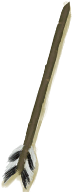

# Feathers  
> A pile of feathers.  
  
<table class="table table-bordered" data-toggle="table"  data-show-header="false"><thead style="display:none"><tr ><th  style="width:50%;text-align:left;vertical-align:top;"  >title</th><th  style="width:50%;text-align:left;vertical-align:top;"  ></th></tr></thead><tr ><td  style="width:50%;text-align:left;vertical-align:top;"  >**Environment：**[Macaque Den(Environment)](Env_MacaqueDen.md)  **Weight：**10</td><td  style="width:50%;text-align:left;vertical-align:top;"  >

<a href="Feathers.md" style="color:black">Feathers</a>

"Feathers can be found in <b>Bird Nests</b> or extracted from the <b>Carcasses of Dead Birds</b>.  They can be used for numberous crafts including <b>Artificial Fishing Bait</td></tr></tbody></table>  
  
## Got From  

Check Gift

[A gift!(Event)](Event_MacaqueFriendGift.md)

Continue

[A partridge nest!(Event)](Event_PartridgeNest.md)

Continue

[You made it!(Event)](Event_SeagullNest.md)

Transform

[Seagull Charm](SeagullCharm.md)

Dismantle

[Shark Headpiece](SharkHeadpiece.md)

Harvest

[Partridge Carcass](PartridgeCarcass.md)

** With：**[Obsidian Knife](KnifeObsidian.md)Cut Open

[Dead Partridge](PartridgeDead.md)

** With：**[“Cutter”](tag_Cutter.md)Cut Open

[Dead Partridge](PartridgeDead.md)

** With：**[“Cutter”](tag_Cutter.md)Cut Open

[Partridge](PartridgeFemaleEnclosure.md)

** With：**[“Cutter”](tag_Cutter.md)Cut Open

[Partridge](PartridgeFemaleLive.md)

** With：**[“Cutter”](tag_Cutter.md)Cut Open

[Male Partridge](PartridgeMaleEnclosure.md)

** With：**[“Cutter”](tag_Cutter.md)Cut Open

[Male Partridge](PartridgeMaleLive.md)

Harvest

[Seagull Carcass](SeagullCarcass.md)

** With：**[Obsidian Knife](KnifeObsidian.md)Cut Open

[Dead Seagull](SeagullDead.md)

** With：**[“Cutter”](tag_Cutter.md)Cut Open

[Dead Seagull](SeagullDead.md)

Explore

[Bird Rock](BirdRock.md)

  
  
## Use In BluePrint  

<a href="Bp_Arrow.md" style="color:black">Arrows</a>

<a href="Bp_BedWooden.md" style="color:black">Wooden Bed</a>

<a href="Bp_CeremonialDagger.md" style="color:black">Ceremonial Dagger</a>

<a href="Bp_FishBait.md" style="color:black">Fish Bait</a>

<a href="Bp_ObsidianSpear.md" style="color:black">Obsidian Spear</a>

<a href="Bp_SeagullCharm.md" style="color:black">Seagull Charm</a>

<a href="Bp_SharkHeadpiece.md" style="color:black">Shark Headpiece</a>

  
  
  

