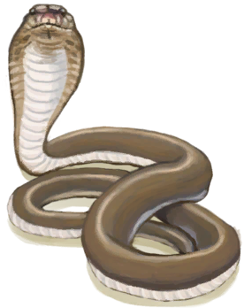

# Western Highlands  
> A more mountainous area of the jungle.  
  

<a href="HighlandsWestern.md" style="color:black">Western Highlands</a>

<a href="HighlandHole.md" style="color:black">Highland Hole</a>

<a href="GrasslandsW.md" style="color:black">Western Grasslands</a>

<a href="HighlandsEastern.md" style="color:black">Eastern Highlands</a>

<a href="JungleHighlands.md" style="color:black">Jungle Highlands</a>

  
  
<table class="table table-bordered" data-toggle="table"  data-show-header="false"><thead style="display:none"><tr ><th  style="width:50%;text-align:left;vertical-align:top;"  >title</th><th  style="width:50%;text-align:left;vertical-align:top;"  data-sortable="true"  ></th></tr></thead><tr ><td  style="width:50%;text-align:left;vertical-align:top;"  >** Unique On Board **  **Environment：**[Western Highlands(Environment)](Env_HighlandsWestern.md)  **Tag：**	[“Trees for Snare Traps”](tag_SnareCompatible.md)  ** EnvironmentEffect: ** [

[Rain Protection](RainProtection.md)](RainProtection.md)<b>+2</b> [

[Heat Insulation](InsulationHeat.md)](InsulationHeat.md)<b>+2</b> [

[Bug Population](BugPopulation.md)](BugPopulation.md)<b>+2</b>  ** Improvements: ** [Path](Imp_Path.md) , [Irrigation System](Imp_Irrigation.md) , [Trapping Fences](Imp_TrappingFences.md)</td><td  style="width:50%;text-align:left;vertical-align:top;"  ></td></tr></tbody></table>  
  
## Exploration  
<table class="table table-bordered" data-toggle="table"  ><thead style=""><tr ><th  style="text-align:left;vertical-align:top;"  >Progress</th><th  style="text-align:left;vertical-align:top;"  >Target</th></tr></thead><tr ><td  style="text-align:left;vertical-align:top;"  >25%</td><td  style="text-align:left;vertical-align:top;"  >[Hole(Western Highlands)](HighlandHoleNoRope.md)</td></tr><tr ><td  style="text-align:left;vertical-align:top;"  >40%</td><td  style="text-align:left;vertical-align:top;"  >[To Jungle Highlands(Western Highlands)](Path_HighlandsWToJungleHighlands.md)</td></tr><tr ><td  style="text-align:left;vertical-align:top;"  >55%</td><td  style="text-align:left;vertical-align:top;"  >[To Eastern Highlands(Western Highlands)](Path_HighlandsWToHighlandsE.md)</td></tr><tr ><td  style="text-align:left;vertical-align:top;"  >70%</td><td  style="text-align:left;vertical-align:top;"  >[To Western Grasslands(Western Highlands)](Path_HighlandsWToGrasslandsW.md)</td></tr><tr ><td  style="text-align:left;vertical-align:top;"  >100%</td><td  style="text-align:left;vertical-align:top;"  >[Area Explored(Event)(Western Highlands)](Event_HighlandsWExplored.md)</td></tr></tbody></table>  
  
## Action  

<table><tr><td rowspan="2" style="width:200px;text-align:center;font-size:1.3em;font-weight:bold">

Explore

15m

</td><td>[“LegAction(Group)”](LegAction.md)</td></tr><tr><td></td></tr><tr><td colspan="2"><b>Require：</b>[

[Light](Light.md)](Light.md): <b>10-100</b></td></tr><tr><td colspan="2"><b>StatChange：</b>[

[Foot Damage](FootDamage.md)](FootDamage.md)<b>+20</b>, [

[Stamina](Stamina.md)](Stamina.md)<b>-4</b>, [

[Stress](Stress.md)](Stress.md)<b>-10</b>, [

[Filth](Filth.md)](Filth.md)<b>+1</b>, [TV Highlands - Explore](TV_HighlandsExplore.md)<b>+1</b></td></tr><tr><td colspan="2">

<table style="margin-bottom:3px;"><tr><td rowspan=2 style="text-align:center" width="80px">
Base Weight

400
</td><td style="font-size:0.6em;line-height:0.6em;font-weight:bold">Dry Leaves</td></tr><tr><td>[

[Dry Leaves](LeavesDry.md)](LeavesDry.md)(<b>+1～+2</b>)</td></tr></table>

<table style="margin-bottom:3px;"><tr><td rowspan=2 style="text-align:center" width="80px">
Base Weight

500
</td><td style="font-size:0.6em;line-height:0.6em;font-weight:bold">Palm Fronds</td></tr><tr><td>[

[Palm Fronds](PalmFronds.md)](PalmFronds.md)(<b>+4～+8</b>)</td></tr></table>

<table style="margin-bottom:3px;"><tr><td rowspan=2 style="text-align:center" width="80px">
Base Weight

700
</td><td style="font-size:0.6em;line-height:0.6em;font-weight:bold">Sticks</td></tr><tr><td>[

[Sticks](Sticks.md)](Sticks.md)(<b>+1～+2</b>)</td></tr></table>

<table style="margin-bottom:3px;"><tr><td rowspan=2 style="text-align:center" width="80px">
Base Weight

800
</td><td style="font-size:0.6em;line-height:0.6em;font-weight:bold">Stones</td></tr><tr><td>[

[Stone](Stone.md)](Stone.md)(<b>+1</b>)</td></tr></table>

<table style="margin-bottom:3px;"><tr><td rowspan=2 style="text-align:center" width="80px">
Base Weight

200
</td><td style="font-size:0.6em;line-height:0.6em;font-weight:bold">Flint</td></tr><tr><td>[

[Flint](Flint.md)](Flint.md)(<b>+1</b>)</td></tr></table>

<table style="margin-bottom:3px;"><tr><td rowspan=2 style="text-align:center" width="80px">
Base Weight

50
</td><td style="font-size:0.6em;line-height:0.6em;font-weight:bold">Flint Slab</td></tr><tr><td>[

[Flint Slab](FlintSlab.md)](FlintSlab.md)(<b>+1</b>)</td></tr></table>

<table style="margin-bottom:3px;"><tr><td rowspan=2 style="text-align:center" width="80px">
Base Weight

0
</td><td style="font-size:0.6em;line-height:0.6em;font-weight:bold">Supply Crate</td></tr><tr><td>[

[Supply Capsule](TV_SupplyCapsule.md)](TV_SupplyCapsule.md)(<b>+1</b>)</td></tr><tr><td colspan=2><li>[

[TV Highlands](TV_Highlands.md)](TV_Highlands.md) in <b>1</b>, weight<b>+100</b></li><li>[TV Highlands - Explore](TV_HighlandsExplore.md) in <b>0～9</b>, weight<b>-999</b></li></td></tr></table>

<table style="margin-bottom:3px;"><tr><td rowspan=2 style="text-align:center" width="80px">
Base Weight

300
</td><td style="font-size:0.6em;line-height:0.6em;font-weight:bold">Heavy Stone</td></tr><tr><td>[

[Heavy Stone](StoneHeavy.md)](StoneHeavy.md)(<b>+1</b>)</td></tr></table>

<table style="margin-bottom:3px;"><tr><td rowspan=2 style="text-align:center" width="80px">
Base Weight

100
</td><td style="font-size:0.6em;line-height:0.6em;font-weight:bold">Geode❗3 limit</td></tr><tr><td>[

[Geode](Geode.md)](Geode.md)(<b>+1</b>)</td></tr></table>

<table style="margin-bottom:3px;"><tr><td rowspan=2 style="text-align:center" width="80px">
Base Weight

0
</td><td style="font-size:0.6em;line-height:0.6em;font-weight:bold">Cobra Encounter</td></tr><tr><td>[

[Spitting Cobra!(Event)](Event_CobraFight.md)](Event_CobraFight.md)(<b>+1</b>)</td></tr><tr><td colspan=2><li>[Population Cobra](Pop_Cobra.md) in <b>1000～12000</b>, weight<b>+10～+50</b></li><li>[

[Eyesight](Myopia.md)](Myopia.md) in <b>1～3</b>, weight<b>+0</b></li><li>[“Fight Event”](tag_FightEvent.md) On *Hand/Board*，Weight<b>-999999</b>(Stackable),</li></td></tr></table>

<table style="margin-bottom:3px;"><tr><td rowspan=2 style="text-align:center" width="80px">
Base Weight

0
</td><td style="font-size:0.6em;line-height:0.6em;font-weight:bold">Goat Encounter</td></tr><tr><td>[

[A Goat!(Event)](Event_GoatFight.md)](Event_GoatFight.md)(<b>+1</b>)</td></tr><tr><td colspan=2><li>[Population Goats](Pop_Goat.md) in <b>1000～15000</b>, weight<b>+10～+70</b></li><li>[

[Eyesight](Myopia.md)](Myopia.md) in <b>1～3</b>, weight<b>+0</b></li><li>[“Fight Event”](tag_FightEvent.md) On *Hand/Board*，Weight<b>-999999</b>(Stackable),</li></td></tr></table>

<table style="margin-bottom:3px;"><tr><td rowspan=2 style="text-align:center" width="80px">
Base Weight

0
</td><td style="font-size:0.6em;line-height:0.6em;font-weight:bold">Drone Encounter</td></tr><tr><td>[

[Attack Drone!(Event)](Event_DroneFight.md)](Event_DroneFight.md)(<b>+1</b>)</td></tr><tr><td colspan=2><li>[Island Drones](Pop_Drone.md) in <b>1000～4000</b>, weight<b>+25～+100</b></li><li>[

[Eyesight](Myopia.md)](Myopia.md) in <b>1～3</b>, weight<b>+0</b></li><li>[“Fight Event”](tag_FightEvent.md) On *Hand/Board*，Weight<b>-999999</b>(Stackable),</li></td></tr></table>

<table style="margin-bottom:3px;"><tr><td rowspan=2 style="text-align:center" width="80px">
Base Weight

0
</td><td style="font-size:0.6em;line-height:0.6em;font-weight:bold">Partridge Spotted</td></tr><tr><td>[

[A partridge!(Event)](Event_PartridgeFight.md)](Event_PartridgeFight.md)(<b>+1</b>)</td></tr><tr><td colspan=2><li>[Population Partridges](Pop_Partridge.md) in <b>1000～30000</b>, weight <b>+100～+200</b></li><li>[

[Eyesight](Myopia.md)](Myopia.md) in <b>1～3</b>, weight <b>-100～-200</b></li></td></tr></table>

<table style="margin-bottom:3px;"><tr><td rowspan=2 style="text-align:center" width="80px">
Base Weight

500
</td><td style="font-size:0.6em;line-height:0.6em;font-weight:bold">Wood</td></tr><tr><td>[

[Wood](Wood.md)](Wood.md)(<b>+1</b>)</td></tr></table>

<table style="margin-bottom:3px;"><tr><td rowspan=2 style="text-align:center" width="80px">
Base Weight

100000
</td><td style="font-size:0.6em;line-height:0.6em;font-weight:bold">Small Tree</td></tr><tr><td>[

[Small Tree](SmallTree.md)](SmallTree.md)(<b>+1</b>)</td></tr></table>

<table style="margin-bottom:3px;"><tr><td rowspan=2 style="text-align:center" width="80px">
Base Weight

0
</td><td style="font-size:0.6em;line-height:0.6em;font-weight:bold">Lemon Grass</td></tr><tr><td>[

[Lemongrass](Lemongrass.md)](Lemongrass.md)(<b>+1</b>)[Highlands Lemon Grass](LemonGrass_HighlandsPop.md)<b>-1000</b></td></tr><tr><td colspan=2><li>[

[Herbology(Skill)](Skill_Herbology.md)](Skill_Herbology.md) in <b>0～150</b>, weight<b>-400～+0</b></li><li>[Highlands Lemon Grass](LemonGrass_HighlandsPop.md) in <b>1000～20000</b>, weight<b>+100～+600</b></li></td></tr></table>

<table style="margin-bottom:3px;"><tr><td rowspan=2 style="text-align:center" width="80px">
Base Weight

0
</td><td style="font-size:0.6em;line-height:0.6em;font-weight:bold">Aloe Vera</td></tr><tr><td>[

[Aloe Vera](AloeVera.md)](AloeVera.md)(<b>+1</b>)[Highlands Aloe Vera](AloeVera_HighlandsPop.md)<b>-1000</b></td></tr><tr><td colspan=2><li>[

[Herbology(Skill)](Skill_Herbology.md)](Skill_Herbology.md) in <b>0～150</b>, weight<b>-300～+0</b></li><li>[Highlands Aloe Vera](AloeVera_HighlandsPop.md) in <b>1000～4000</b>, weight<b>+100～+600</b></li></td></tr></table>

<table style="margin-bottom:3px;"><tr><td rowspan=2 style="text-align:center" width="80px">
Base Weight

0
</td><td style="font-size:0.6em;line-height:0.6em;font-weight:bold">Tropical Almond Tree</td></tr><tr><td>[

[Tropical Almond Tree](TropicalAlmondTree.md)](TropicalAlmondTree.md)(<b>+1</b>)[Highlands Aloe Vera](AloeVera_HighlandsPop.md)<b>-1000</b></td></tr><tr><td colspan=2><li>[

[Herbology(Skill)](Skill_Herbology.md)](Skill_Herbology.md) in <b>0～150</b>, weight<b>-200～+0</b></li><li>[Highlands Aloe Vera](AloeVera_HighlandsPop.md) in <b>1000～6000</b>, weight<b>+100～+500</b></li></td></tr></table>

<table style="margin-bottom:3px;"><tr><td rowspan=2 style="text-align:center" width="80px">
Base Weight

1000
</td><td style="font-size:0.6em;line-height:0.6em;font-weight:bold">Large Tree</td></tr><tr><td>[

[Large Tree](LargeTree.md)](LargeTree.md)(<b>+1</b>)</td></tr></table>
<button class="btn btn-secondary btn-sm" style="" data-toggle="modal" onclick="setCollectionDataBase64('eyJ0aXRsZSI6IlNpbXVsYXRvcjogRXhwbG9yZSAoV2VzdGVybiBIaWdobGFuZHMpIiwiY29sbGVjdGlvbnMiOlt7ImRyb3AiOiI8ZGl2IHN0eWxlPVwid2lkdGg6MjVweDtkaXNwbGF5OmlubGluZS1ibG9jazt0ZXh0LWFsaWduOmNlbnRlclwiPjxpbWcgZGVjb2Rpbmc9XCJhc3luY1wiIHNyYz1cIi4uL3dpa2kvU3ByaXRlL1RpbmRlci5wbmdcIiBocmVmPVwiYS5tZFwiIHN0eWxlPVwibWF4LXdpZHRoOjI1cHg7bWF4LWhlaWdodDoyNXB4O1wiPjwvZGl2PkRyeSBMZWF2ZXMiLCJiYXNlIjo0MDAsImNvbmRpdGlvbiI6W119LHsiZHJvcCI6IjxkaXYgc3R5bGU9XCJ3aWR0aDoyNXB4O2Rpc3BsYXk6aW5saW5lLWJsb2NrO3RleHQtYWxpZ246Y2VudGVyXCI+PGltZyBkZWNvZGluZz1cImFzeW5jXCIgc3JjPVwiLi4vd2lraS9TcHJpdGUvUGFsbVRyZWVMZWF2ZXMucG5nXCIgaHJlZj1cImEubWRcIiBzdHlsZT1cIm1heC13aWR0aDoyNXB4O21heC1oZWlnaHQ6MjVweDtcIj48L2Rpdj5QYWxtIEZyb25kcyIsImJhc2UiOjUwMCwiY29uZGl0aW9uIjpbXX0seyJkcm9wIjoiPGRpdiBzdHlsZT1cIndpZHRoOjI1cHg7ZGlzcGxheTppbmxpbmUtYmxvY2s7dGV4dC1hbGlnbjpjZW50ZXJcIj48aW1nIGRlY29kaW5nPVwiYXN5bmNcIiBzcmM9XCIuLi93aWtpL1Nwcml0ZS9LaW5kbGluZy5wbmdcIiBocmVmPVwiYS5tZFwiIHN0eWxlPVwibWF4LXdpZHRoOjI1cHg7bWF4LWhlaWdodDoyNXB4O1wiPjwvZGl2PlN0aWNrcyIsImJhc2UiOjcwMCwiY29uZGl0aW9uIjpbXX0seyJkcm9wIjoiPGRpdiBzdHlsZT1cIndpZHRoOjI1cHg7ZGlzcGxheTppbmxpbmUtYmxvY2s7dGV4dC1hbGlnbjpjZW50ZXJcIj48aW1nIGRlY29kaW5nPVwiYXN5bmNcIiBzcmM9XCIuLi93aWtpL1Nwcml0ZS9TdG9uZS5wbmdcIiBocmVmPVwiYS5tZFwiIHN0eWxlPVwibWF4LXdpZHRoOjI1cHg7bWF4LWhlaWdodDoyNXB4O1wiPjwvZGl2PlN0b25lIiwiYmFzZSI6ODAwLCJjb25kaXRpb24iOltdfSx7ImRyb3AiOiI8ZGl2IHN0eWxlPVwid2lkdGg6MjVweDtkaXNwbGF5OmlubGluZS1ibG9jazt0ZXh0LWFsaWduOmNlbnRlclwiPjxpbWcgZGVjb2Rpbmc9XCJhc3luY1wiIHNyYz1cIi4uL3dpa2kvU3ByaXRlL0ZsaW50LnBuZ1wiIGhyZWY9XCJhLm1kXCIgc3R5bGU9XCJtYXgtd2lkdGg6MjVweDttYXgtaGVpZ2h0OjI1cHg7XCI+PC9kaXY+RmxpbnQiLCJiYXNlIjoyMDAsImNvbmRpdGlvbiI6W119LHsiZHJvcCI6IjxkaXYgc3R5bGU9XCJ3aWR0aDoyNXB4O2Rpc3BsYXk6aW5saW5lLWJsb2NrO3RleHQtYWxpZ246Y2VudGVyXCI+PGltZyBkZWNvZGluZz1cImFzeW5jXCIgc3JjPVwiLi4vd2lraS9TcHJpdGUvRmxpbnRMYXJnZS5wbmdcIiBocmVmPVwiYS5tZFwiIHN0eWxlPVwibWF4LXdpZHRoOjI1cHg7bWF4LWhlaWdodDoyNXB4O1wiPjwvZGl2PkZsaW50IFNsYWIiLCJiYXNlIjo1MCwiY29uZGl0aW9uIjpbXX0seyJkcm9wIjoiPGRpdiBzdHlsZT1cIndpZHRoOjI1cHg7ZGlzcGxheTppbmxpbmUtYmxvY2s7dGV4dC1hbGlnbjpjZW50ZXJcIj48aW1nIGRlY29kaW5nPVwiYXN5bmNcIiBzcmM9XCIuLi93aWtpL1Nwcml0ZS9UVkNyYXRlLnBuZ1wiIGhyZWY9XCJhLm1kXCIgc3R5bGU9XCJtYXgtd2lkdGg6MjVweDttYXgtaGVpZ2h0OjI1cHg7XCI+PC9kaXY+U3VwcGx5IENhcHN1bGUiLCJiYXNlIjowLCJjb25kaXRpb24iOlt7ImtleSI6IlRWX0hpZ2hsYW5kcyIsInRpdGxlIjoiVFYgSGlnaGxhbmRzIiwidHlwZSI6InJhbmdlIiwibWF4IjpbMCwxXSwicmFuZ2UiOlsxLDFdLCJ3ZWlnaHQiOlsxMDAsMTAwXSwiZGVmYXVsdFZhbHVlIjowLCJ3aGVuT3V0T2ZSYW5nZSI6MH0seyJrZXkiOiJUVl9IaWdobGFuZHNFeHBsb3JlIiwidGl0bGUiOiJUViBIaWdobGFuZHMgLSBFeHBsb3JlIiwidHlwZSI6InJhbmdlIiwibWF4IjpbMCwyMF0sInJhbmdlIjpbMCw5XSwid2VpZ2h0IjpbLTk5OSwtOTk5XSwiZGVmYXVsdFZhbHVlIjowLCJ3aGVuT3V0T2ZSYW5nZSI6MH1dLCJpc1VuaXF1ZSI6dHJ1ZX0seyJkcm9wIjoiPGRpdiBzdHlsZT1cIndpZHRoOjI1cHg7ZGlzcGxheTppbmxpbmUtYmxvY2s7dGV4dC1hbGlnbjpjZW50ZXJcIj48aW1nIGRlY29kaW5nPVwiYXN5bmNcIiBzcmM9XCIuLi93aWtpL1Nwcml0ZS9TYW5kc3RvbmUucG5nXCIgaHJlZj1cImEubWRcIiBzdHlsZT1cIm1heC13aWR0aDoyNXB4O21heC1oZWlnaHQ6MjVweDtcIj48L2Rpdj5IZWF2eSBTdG9uZSIsImJhc2UiOjMwMCwiY29uZGl0aW9uIjpbXX0seyJkcm9wIjoiPGRpdiBzdHlsZT1cIndpZHRoOjI1cHg7ZGlzcGxheTppbmxpbmUtYmxvY2s7dGV4dC1hbGlnbjpjZW50ZXJcIj48aW1nIGRlY29kaW5nPVwiYXN5bmNcIiBzcmM9XCIuLi93aWtpL1Nwcml0ZS9TcGl0dGluZ0NvYnJhLnBuZ1wiIGhyZWY9XCJhLm1kXCIgc3R5bGU9XCJtYXgtd2lkdGg6MjVweDttYXgtaGVpZ2h0OjI1cHg7XCI+PC9kaXY+U3BpdHRpbmcgQ29icmEhKEV2ZW50KSIsImJhc2UiOjAsImNvbmRpdGlvbiI6W3sia2V5IjoiUG9wX0NvYnJhIiwidGl0bGUiOiJQb3B1bGF0aW9uIENvYnJhIiwidHlwZSI6InJhbmdlIiwibWF4IjpbMCwxMjAwMF0sInJhbmdlIjpbMTAwMCwxMjAwMF0sIndlaWdodCI6WzEwLDUwXSwiZGVmYXVsdFZhbHVlIjoxMjAwMCwid2hlbk91dE9mUmFuZ2UiOjB9LHsia2V5IjoiTXlvcGlhIiwidGl0bGUiOiJFeWVzaWdodCIsInR5cGUiOiJyYW5nZSIsIm1heCI6WzAsM10sInJhbmdlIjpbMSwzXSwid2VpZ2h0IjpbMCwwXSwiZGVmYXVsdFZhbHVlIjowLCJ3aGVuT3V0T2ZSYW5nZSI6MH0seyJrZXkiOiJ0YWdfRmlnaHRFdmVudF9hbW91bnQiLCJ0aXRsZSI6IuKAnEZpZ2h0IEV2ZW504oCdIiwidHlwZSI6InJhbmdlIiwicmFuZ2UiOlswLDIwXSwibWF4IjpbMCwyMF0sIndlaWdodCI6WzAsLTE5OTk5OTgwXSwiZGVmYXVsdFZhbHVlIjowLCJ3aGVuT3V0T2ZSYW5nZSI6MCwibWF4U3RhY2tHcm91cCI6IiJ9XX0seyJkcm9wIjoiPGRpdiBzdHlsZT1cIndpZHRoOjI1cHg7ZGlzcGxheTppbmxpbmUtYmxvY2s7dGV4dC1hbGlnbjpjZW50ZXJcIj48aW1nIGRlY29kaW5nPVwiYXN5bmNcIiBzcmM9XCIuLi93aWtpL1Nwcml0ZS9Hb2F0RXZlbnQucG5nXCIgaHJlZj1cImEubWRcIiBzdHlsZT1cIm1heC13aWR0aDoyNXB4O21heC1oZWlnaHQ6MjVweDtcIj48L2Rpdj5BIEdvYXQhKEV2ZW50KSIsImJhc2UiOjAsImNvbmRpdGlvbiI6W3sia2V5IjoiUG9wX0dvYXQiLCJ0aXRsZSI6IlBvcHVsYXRpb24gR29hdHMiLCJ0eXBlIjoicmFuZ2UiLCJtYXgiOlswLDE1MDAwXSwicmFuZ2UiOlsxMDAwLDE1MDAwXSwid2VpZ2h0IjpbMTAsNzBdLCJkZWZhdWx0VmFsdWUiOjE1MDAwLCJ3aGVuT3V0T2ZSYW5nZSI6MH0seyJrZXkiOiJNeW9waWEiLCJ0aXRsZSI6IkV5ZXNpZ2h0IiwidHlwZSI6InJhbmdlIiwibWF4IjpbMCwzXSwicmFuZ2UiOlsxLDNdLCJ3ZWlnaHQiOlswLDBdLCJkZWZhdWx0VmFsdWUiOjAsIndoZW5PdXRPZlJhbmdlIjowfSx7ImtleSI6InRhZ19GaWdodEV2ZW50X2Ftb3VudCIsInRpdGxlIjoi4oCcRmlnaHQgRXZlbnTigJ0iLCJ0eXBlIjoicmFuZ2UiLCJyYW5nZSI6WzAsMjBdLCJtYXgiOlswLDIwXSwid2VpZ2h0IjpbMCwtMTk5OTk5ODBdLCJkZWZhdWx0VmFsdWUiOjAsIndoZW5PdXRPZlJhbmdlIjowLCJtYXhTdGFja0dyb3VwIjoiIn1dfSx7ImRyb3AiOiI8ZGl2IHN0eWxlPVwid2lkdGg6MjVweDtkaXNwbGF5OmlubGluZS1ibG9jazt0ZXh0LWFsaWduOmNlbnRlclwiPjxpbWcgZGVjb2Rpbmc9XCJhc3luY1wiIHNyYz1cIi4uL3dpa2kvU3ByaXRlL0Ryb25lLnBuZ1wiIGhyZWY9XCJhLm1kXCIgc3R5bGU9XCJtYXgtd2lkdGg6MjVweDttYXgtaGVpZ2h0OjI1cHg7XCI+PC9kaXY+QXR0YWNrIERyb25lIShFdmVudCkiLCJiYXNlIjowLCJjb25kaXRpb24iOlt7ImtleSI6IlBvcF9Ecm9uZSIsInRpdGxlIjoiSXNsYW5kIERyb25lcyIsInR5cGUiOiJyYW5nZSIsIm1heCI6WzAsNDAwMF0sInJhbmdlIjpbMTAwMCw0MDAwXSwid2VpZ2h0IjpbMjUsMTAwXSwiZGVmYXVsdFZhbHVlIjowLCJ3aGVuT3V0T2ZSYW5nZSI6MH0seyJrZXkiOiJNeW9waWEiLCJ0aXRsZSI6IkV5ZXNpZ2h0IiwidHlwZSI6InJhbmdlIiwibWF4IjpbMCwzXSwicmFuZ2UiOlsxLDNdLCJ3ZWlnaHQiOlswLDBdLCJkZWZhdWx0VmFsdWUiOjAsIndoZW5PdXRPZlJhbmdlIjowfSx7ImtleSI6InRhZ19GaWdodEV2ZW50X2Ftb3VudCIsInRpdGxlIjoi4oCcRmlnaHQgRXZlbnTigJ0iLCJ0eXBlIjoicmFuZ2UiLCJyYW5nZSI6WzAsMjBdLCJtYXgiOlswLDIwXSwid2VpZ2h0IjpbMCwtMTk5OTk5ODBdLCJkZWZhdWx0VmFsdWUiOjAsIndoZW5PdXRPZlJhbmdlIjowLCJtYXhTdGFja0dyb3VwIjoiIn1dfSx7ImRyb3AiOiI8ZGl2IHN0eWxlPVwid2lkdGg6MjVweDtkaXNwbGF5OmlubGluZS1ibG9jazt0ZXh0LWFsaWduOmNlbnRlclwiPjxpbWcgZGVjb2Rpbmc9XCJhc3luY1wiIHNyYz1cIi4uL3dpa2kvU3ByaXRlL1BhcnRyaWRnZUV2ZW50LnBuZ1wiIGhyZWY9XCJhLm1kXCIgc3R5bGU9XCJtYXgtd2lkdGg6MjVweDttYXgtaGVpZ2h0OjI1cHg7XCI+PC9kaXY+QSBwYXJ0cmlkZ2UhKEV2ZW50KSIsImJhc2UiOjAsImNvbmRpdGlvbiI6W3sia2V5IjoiUG9wX1BhcnRyaWRnZSIsInRpdGxlIjoiUG9wdWxhdGlvbiBQYXJ0cmlkZ2VzIiwidHlwZSI6InJhbmdlIiwibWF4IjpbMCw0MDAwMF0sInJhbmdlIjpbMTAwMCwzMDAwMF0sIndlaWdodCI6WzEwMCwyMDBdLCJkZWZhdWx0VmFsdWUiOjQwMDAwLCJ3aGVuT3V0T2ZSYW5nZSI6MX0seyJrZXkiOiJNeW9waWEiLCJ0aXRsZSI6IkV5ZXNpZ2h0IiwidHlwZSI6InJhbmdlIiwibWF4IjpbMCwzXSwicmFuZ2UiOlsxLDNdLCJ3ZWlnaHQiOlstMTAwLC0yMDBdLCJkZWZhdWx0VmFsdWUiOjAsIndoZW5PdXRPZlJhbmdlIjoxfV19LHsiZHJvcCI6IjxkaXYgc3R5bGU9XCJ3aWR0aDoyNXB4O2Rpc3BsYXk6aW5saW5lLWJsb2NrO3RleHQtYWxpZ246Y2VudGVyXCI+PGltZyBkZWNvZGluZz1cImFzeW5jXCIgc3JjPVwiLi4vd2lraS9TcHJpdGUvRmlyZXdvb2QucG5nXCIgaHJlZj1cImEubWRcIiBzdHlsZT1cIm1heC13aWR0aDoyNXB4O21heC1oZWlnaHQ6MjVweDtcIj48L2Rpdj5Xb29kIiwiYmFzZSI6NTAwLCJjb25kaXRpb24iOltdfSx7ImRyb3AiOiI8ZGl2IHN0eWxlPVwid2lkdGg6MjVweDtkaXNwbGF5OmlubGluZS1ibG9jazt0ZXh0LWFsaWduOmNlbnRlclwiPjxpbWcgZGVjb2Rpbmc9XCJhc3luY1wiIHNyYz1cIi4uL3dpa2kvU3ByaXRlL1NtYWxsVHJlZS5wbmdcIiBocmVmPVwiYS5tZFwiIHN0eWxlPVwibWF4LXdpZHRoOjI1cHg7bWF4LWhlaWdodDoyNXB4O1wiPjwvZGl2PlNtYWxsIFRyZWUiLCJiYXNlIjoxMDAwMDAsImNvbmRpdGlvbiI6W10sImlzVW5pcXVlIjp0cnVlfSx7ImRyb3AiOiI8ZGl2IHN0eWxlPVwid2lkdGg6MjVweDtkaXNwbGF5OmlubGluZS1ibG9jazt0ZXh0LWFsaWduOmNlbnRlclwiPjxpbWcgZGVjb2Rpbmc9XCJhc3luY1wiIHNyYz1cIi4uL3dpa2kvU3ByaXRlL0xlbW9uR3Jhc3MucG5nXCIgaHJlZj1cImEubWRcIiBzdHlsZT1cIm1heC13aWR0aDoyNXB4O21heC1oZWlnaHQ6MjVweDtcIj48L2Rpdj5MZW1vbmdyYXNzIiwiYmFzZSI6MCwiY29uZGl0aW9uIjpbeyJrZXkiOiJTa2lsbF9IZXJib2xvZ3kiLCJ0aXRsZSI6IkhlcmJvbG9neShTa2lsbCkiLCJ0eXBlIjoicmFuZ2UiLCJtYXgiOlswLDE1MF0sInJhbmdlIjpbMCwxNTBdLCJ3ZWlnaHQiOlstNDAwLDBdLCJkZWZhdWx0VmFsdWUiOjAsIndoZW5PdXRPZlJhbmdlIjowfSx7ImtleSI6IkxlbW9uR3Jhc3NfSGlnaGxhbmRzUG9wIiwidGl0bGUiOiJIaWdobGFuZHMgTGVtb24gR3Jhc3MiLCJ0eXBlIjoicmFuZ2UiLCJtYXgiOlswLDIwMDAwXSwicmFuZ2UiOlsxMDAwLDIwMDAwXSwid2VpZ2h0IjpbMTAwLDYwMF0sImRlZmF1bHRWYWx1ZSI6MjAwMDAsIndoZW5PdXRPZlJhbmdlIjowfV19LHsiZHJvcCI6IjxkaXYgc3R5bGU9XCJ3aWR0aDoyNXB4O2Rpc3BsYXk6aW5saW5lLWJsb2NrO3RleHQtYWxpZ246Y2VudGVyXCI+PGltZyBkZWNvZGluZz1cImFzeW5jXCIgc3JjPVwiLi4vd2lraS9TcHJpdGUvQWxvZVZlcmEucG5nXCIgaHJlZj1cImEubWRcIiBzdHlsZT1cIm1heC13aWR0aDoyNXB4O21heC1oZWlnaHQ6MjVweDtcIj48L2Rpdj5BbG9lIFZlcmEiLCJiYXNlIjowLCJjb25kaXRpb24iOlt7ImtleSI6IlNraWxsX0hlcmJvbG9neSIsInRpdGxlIjoiSGVyYm9sb2d5KFNraWxsKSIsInR5cGUiOiJyYW5nZSIsIm1heCI6WzAsMTUwXSwicmFuZ2UiOlswLDE1MF0sIndlaWdodCI6Wy0zMDAsMF0sImRlZmF1bHRWYWx1ZSI6MCwid2hlbk91dE9mUmFuZ2UiOjB9LHsia2V5IjoiQWxvZVZlcmFfSGlnaGxhbmRzUG9wIiwidGl0bGUiOiJIaWdobGFuZHMgQWxvZSBWZXJhIiwidHlwZSI6InJhbmdlIiwibWF4IjpbMCw0MDAwXSwicmFuZ2UiOlsxMDAwLDQwMDBdLCJ3ZWlnaHQiOlsxMDAsNjAwXSwiZGVmYXVsdFZhbHVlIjo0MDAwLCJ3aGVuT3V0T2ZSYW5nZSI6MH1dfSx7ImRyb3AiOiI8ZGl2IHN0eWxlPVwid2lkdGg6MjVweDtkaXNwbGF5OmlubGluZS1ibG9jazt0ZXh0LWFsaWduOmNlbnRlclwiPjxpbWcgZGVjb2Rpbmc9XCJhc3luY1wiIHNyYz1cIi4uL3dpa2kvU3ByaXRlL1Ryb3BpY2FsQWxtb25kVHJlZS5wbmdcIiBocmVmPVwiYS5tZFwiIHN0eWxlPVwibWF4LXdpZHRoOjI1cHg7bWF4LWhlaWdodDoyNXB4O1wiPjwvZGl2PlRyb3BpY2FsIEFsbW9uZCBUcmVlIiwiYmFzZSI6MCwiY29uZGl0aW9uIjpbeyJrZXkiOiJTa2lsbF9IZXJib2xvZ3kiLCJ0aXRsZSI6IkhlcmJvbG9neShTa2lsbCkiLCJ0eXBlIjoicmFuZ2UiLCJtYXgiOlswLDE1MF0sInJhbmdlIjpbMCwxNTBdLCJ3ZWlnaHQiOlstMjAwLDBdLCJkZWZhdWx0VmFsdWUiOjAsIndoZW5PdXRPZlJhbmdlIjowfSx7ImtleSI6IkFsb2VWZXJhX0hpZ2hsYW5kc1BvcCIsInRpdGxlIjoiSGlnaGxhbmRzIEFsb2UgVmVyYSIsInR5cGUiOiJyYW5nZSIsIm1heCI6WzAsNDAwMF0sInJhbmdlIjpbMTAwMCw2MDAwXSwid2VpZ2h0IjpbMTAwLDUwMF0sImRlZmF1bHRWYWx1ZSI6NDAwMCwid2hlbk91dE9mUmFuZ2UiOjB9XX0seyJkcm9wIjoiPGRpdiBzdHlsZT1cIndpZHRoOjI1cHg7ZGlzcGxheTppbmxpbmUtYmxvY2s7dGV4dC1hbGlnbjpjZW50ZXJcIj48aW1nIGRlY29kaW5nPVwiYXN5bmNcIiBzcmM9XCIuLi93aWtpL1Nwcml0ZS9Db3R0b253b29kVHJlZS5wbmdcIiBocmVmPVwiYS5tZFwiIHN0eWxlPVwibWF4LXdpZHRoOjI1cHg7bWF4LWhlaWdodDoyNXB4O1wiPjwvZGl2PkxhcmdlIFRyZWUiLCJiYXNlIjoxMDAwLCJjb25kaXRpb24iOltdLCJpc1VuaXF1ZSI6dHJ1ZX0seyJkcm9wIjoiPGRpdiBzdHlsZT1cIndpZHRoOjI1cHg7ZGlzcGxheTppbmxpbmUtYmxvY2s7dGV4dC1hbGlnbjpjZW50ZXJcIj48aW1nIGRlY29kaW5nPVwiYXN5bmNcIiBzcmM9XCIuLi93aWtpL1Nwcml0ZS9HZW9kZS5wbmdcIiBocmVmPVwiYS5tZFwiIHN0eWxlPVwibWF4LXdpZHRoOjI1cHg7bWF4LWhlaWdodDoyNXB4O1wiPjwvZGl2Pkdlb2RlIiwiYmFzZSI6MTAwLCJjb25kaXRpb24iOltdLCJpc0xpbWl0Ijp0cnVlfV19')" data-target="#modelCollectionSimulator">Simulator</button>
</td></tr></table>
  
  
  
## Drag With  

<table style="margin-bottom:0px;"><tr><td style="width:40%;text-align:left; background-color:#FEFEFE"><b>With：</b>[“Hammer”](tag_AxeAdv.md)</td><td style="width:40%;font-size:1em;font-weight:bold;background-color:#FEFEFE">Cut Wood (30m) [“HandAction(Group)”](HandAction.md)</td></tr><tr style="background-color:#FFFFFF"><td style=""><b>Receiving：</b>Usage  <b>-1</b></td><td style=""><b>Self：</b></td></tr><tr><td colspan="2"><b>StatChange：</b>[

[Stamina](Stamina.md)](Stamina.md)<b>-4</b>, [

[Hand Damage](HandDamage.md)](HandDamage.md)<b>+25</b>, [

[Woodworking(Skill)](Skill_Woodworking.md)](Skill_Woodworking.md)<b>+0.25</b></td></tr><tr><td colspan="2"><b>Require：</b>[

[Light](Light.md)](Light.md): <b>10-100</b>, [

[Stamina](Stamina.md)](Stamina.md): <b>11-32</b></td></tr><tr><td colspan="2">[

[Wood](Wood.md)](Wood.md)(<b>+2</b>), [

[Sticks](Sticks.md)](Sticks.md)(<b>+4</b>)</td></tr></table>
  

<table style="margin-bottom:0px;"><tr><td style="width:40%;text-align:left; background-color:#FEFEFE"><b>With：</b>[“Axe”](tag_Axe.md)</td><td style="width:40%;font-size:1em;font-weight:bold;background-color:#FEFEFE">Cut Wood (30m) [“HandAction(Group)”](HandAction.md)</td></tr><tr style="background-color:#FFFFFF"><td style=""><b>Receiving：</b>Usage  <b>-1</b></td><td style=""><b>Self：</b></td></tr><tr><td colspan="2"><b>StatChange：</b>[

[Stamina](Stamina.md)](Stamina.md)<b>-4</b>, [

[Hand Damage](HandDamage.md)](HandDamage.md)<b>+25</b>, [

[Woodworking(Skill)](Skill_Woodworking.md)](Skill_Woodworking.md)<b>+0.25</b></td></tr><tr><td colspan="2"><b>Require：</b>[

[Light](Light.md)](Light.md): <b>10-100</b>, [

[Stamina](Stamina.md)](Stamina.md): <b>11-32</b></td></tr><tr><td colspan="2">[

[Wood](Wood.md)](Wood.md)(<b>+1</b>), [

[Sticks](Sticks.md)](Sticks.md)(<b>+2</b>)</td></tr></table>
  
  

